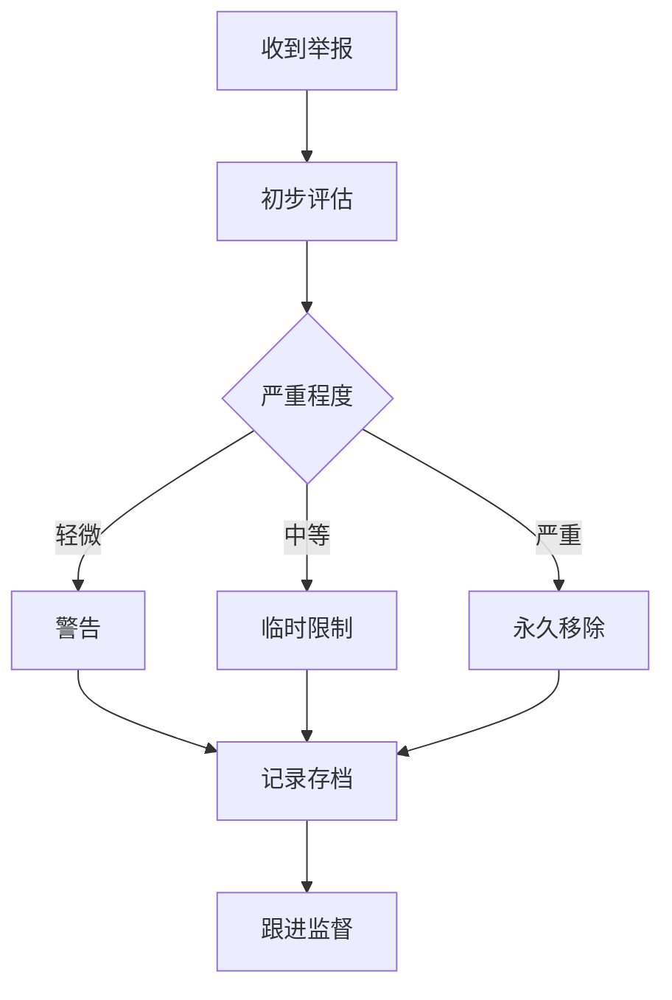

# 行为准则 (Code of Conduct)

> 我们致力于打造一个友好、包容、专业的社区环境。本行为准则适用于所有项目空间。

## 我们的承诺

作为项目成员、贡献者和领导者，我们承诺：

- 让每个人都能获得友好和包容的体验
- 尊重不同的观点和经验
- 乐于接受建设性批评
- 关注社区最有益的事情
- 对其他社区成员表示同理心

## 适用范围

本行为准则适用于：

- 所有项目空间（GitHub Issues、PR、Discussions）
- 公共或私人交流
- 项目相关的线下活动
- 代表项目的公开场合

## 标准

### 鼓励的行为

| 行为 | 示例 |
|-----|------|
| 使用包容性语言 | "大家好" 而非 "各位兄弟" |
| 尊重不同观点 | "我理解你的观点，但我认为..." |
| 接受建设性批评 | "感谢指出，我会改进" |
| 关注社区利益 | "这对整个社区都有帮助" |
| 帮助新手 | 耐心解答新贡献者的问题 |
| 认可他人贡献 | 在适当场合致谢贡献者 |

### 不可接受的行为

| 行为 | 示例 |
|-----|------|
| 歧视性语言 | 基于性别、种族、宗教等的歧视 |
| 侮辱性评论 | 人身攻击或贬低他人 |
| 骚扰行为 | 持续的骚扰或恐吓 |
| 侵犯隐私 | 未经同意发布他人信息 |
| 恶意破坏 | 故意破坏项目或 spam |
| 不尊重 | 无视他人观点或经验 |

## 责任

### 项目维护者责任

项目维护者负责：

1. **澄清标准**：明确行为准则的标准
2. **公正执行**：公正地执行和响应违规行为
3. **及时处理**：及时处理举报
4. **保护隐私**：保护举报者隐私
5. **以身作则**：维护者应以更高标准要求自己

### 社区成员责任

社区成员应：

1. **遵守准则**：遵守本行为准则
2. **相互尊重**：尊重其他成员
3. **报告违规**：发现违规行为及时报告
4. **接受指导**：接受维护者的指导

## 执行

### 报告违规

如果您遭遇或发现违规行为，请通过以下方式报告：

| 方式 | 联系方式 | 适用场景 |
|-----|---------|---------|
| GitHub | 私信项目维护者 | 一般违规 |
| 邮件 | <conduct@analysisdataflow.org> | 敏感问题 |
| 匿名 | 通过可信第三方转达 | 需要匿名 |

### 处理流程



### 处理措施

根据违规严重程度，可能采取以下措施：

| 级别 | 行为 | 措施 |
|-----|------|------|
| 1 | 轻微违规（如言语不当） | 私下警告，要求道歉 |
| 2 | 中等违规（如持续骚扰） | 临时限制（7-30天） |
| 3 | 严重违规（如歧视、威胁） | 永久移除出社区 |

### 申诉机制

如果您对处理结果有异议，可以：

1. **书面申诉**：向项目所有者提交书面申诉
2. **说明理由**：详细说明申诉理由
3. **等待复核**：等待复核结果（7-14工作日）
4. **接受决定**：接受最终复核决定

## 沟通指南

### 提问的智慧

1. **先搜索**：提问前搜索是否已有类似问题
2. **提供上下文**：提供足够的背景信息
3. **清晰描述**：清晰地描述问题和期望结果
4. **最小示例**：如可能，提供最小复现示例
5. **表示感谢**：对回答者表示感谢

### 回复的善意

1. **保持耐心**：对新贡献者保持耐心
2. **建设性反馈**：指出问题时同时给出建议
3. **认可努力**：承认并感谢贡献者的努力
4. **礼貌用语**：使用礼貌和尊重的语言

### 冲突解决

1. **直接沟通**：当事人首先尝试直接沟通
2. **寻求调解**：如无法解决，寻求第三方调解
3. **维护者介入**：必要时维护者介入
4. **记录存档**：记录冲突和解决方案

## 具体场景指南

### Issue 和 PR 讨论

**应该做的**：

- 保持讨论聚焦技术问题
- 提供建设性的反馈
- 感谢贡献者的时间和努力
- 使用清晰、礼貌的语言

**不应该做的**：

- 使用讽刺或挖苦的语气
- 无视贡献者的问题
- 对贡献者进行人身攻击
- 在无关话题上发表评论

### 代码审核

**应该做的**：

- 指出问题时说明原因
- 提供改进建议或示例
- 肯定好的实践
- 区分个人偏好和技术要求

**不应该做的**：

- 仅说"这个不好"而不解释
- 使用命令式语气（"你必须..."）
- 过度批评小细节
- 让贡献者感到被贬低

### 社区讨论

**应该做的**：

- 分享知识和经验
- 鼓励新人参与
- 尊重不同的技术观点
- 帮助营造积极的氛围

**不应该做的**：

- 强加自己的观点
- 贬低他人的技术选择
- 制造分裂或对立
- 进行商业推广

## 示例对话

### 好的示例

**场景：审核 PR 时发现问题**

```markdown
> 感谢你的贡献！这个 Watermark 解释很有帮助。
>
> 我发现一个小问题：定理编号 `Thm-F-03-05` 在注册表中已经被使用了。
> 建议改为 `Thm-F-03-15`，并更新注册表。
>
> 另外，如果能添加一个延迟场景的示例会更有帮助，
> 可以参考已有文档中的格式。
>
> 再次感谢你的时间和努力！
```

**场景：回答新手问题**

```markdown
> 欢迎！这是一个很好的问题。
>
> Watermark 的延迟设置取决于你的业务场景。
> 一般来说，可以参考以下步骤：
> 1. 分析历史数据的乱序程度
> 2. 考虑业务对延迟数据的容忍度
> 3. 从保守值开始，逐步优化
>
> 如果你有具体的数据分布，我可以给出更具体的建议。
> 也可以参考 `Flink/1.2-watermark-strategies.md` 中的详细说明。
```

### 需要改进的示例

**场景：审核 PR 时发现问题的反面示例**

```markdown
❌ 不好的示例：

> 这个编号错了，改一下。
> 还有这里没有例子，加一下。

---

✅ 改进后：

> 感谢你的贡献！
>
> 发现定理编号 `Thm-F-03-05` 已经被使用了（见 `Flink/1.1-checkpoint.md`），
> 建议改为 `Thm-F-03-15`。
>
> 另外，如果能添加一个延迟场景的示例会更有帮助，
> 可以参考 `Flink/1.2-watermark-strategies.md` 第 3 节的格式。
>
> 有任何问题欢迎讨论！
```

## 更新历史

| 版本 | 日期 | 变更 |
|-----|------|------|
| 1.0 | 2026-04-08 | 初始版本 |

## 参考

本行为准则参考以下资源：

- [Contributor Covenant](https://www.contributor-covenant.org/)
- [GitHub Community Guidelines](https://docs.github.com/en/site-policy/github-terms/github-community-guidelines)
- [Apache Software Foundation Code of Conduct](https://www.apache.org/foundation/policies/conduct)

## 联系

如有任何问题或建议，请联系：

- **邮箱**: <conduct@analysisdataflow.org>
- **GitHub**: 私信项目维护者

---

*本行为准则是社区共同遵守的约定。让我们共同努力，打造一个友好、专业的社区环境。*
