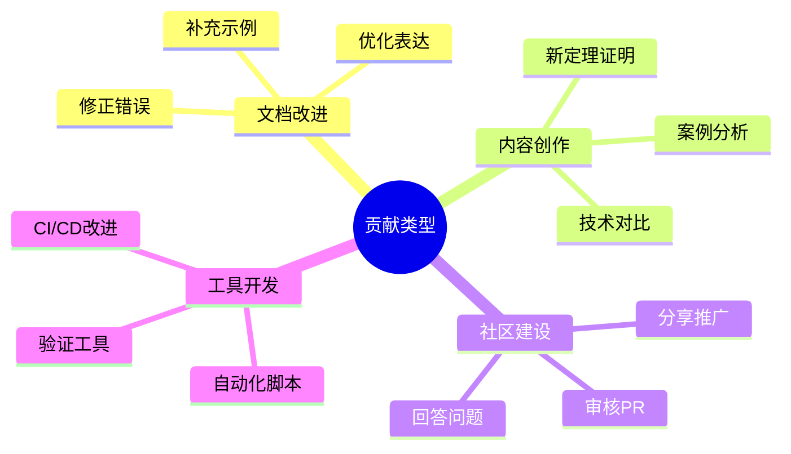

> **状态**: 🔮 前瞻内容 | **风险等级**: 高 | **最后更新**: 2026-04
> 
> 此文档描述的内容处于早期规划阶段，可能与最终实现不符。请以 Apache Flink 官方发布为准。
# 新贡献者入门指南

> 欢迎加入 AnalysisDataFlow 社区！本指南将帮助您快速了解项目并做出第一次贡献。

## 目录

- [新贡献者入门指南](#新贡献者入门指南)
  - [目录](#目录)
  - [1. 项目概览](#1-项目概览)
    - [1.1 什么是 AnalysisDataFlow？](#11-什么是-analysisdataflow)
    - [1.2 项目特色](#12-项目特色)
    - [1.3 您可以贡献什么](#13-您可以贡献什么)
  - [2. 准备工作](#2-准备工作)
    - [2.1 需要的知识背景](#21-需要的知识背景)
    - [2.2 开发环境配置](#22-开发环境配置)
    - [2.3 熟悉项目结构](#23-熟悉项目结构)
  - [3. 快速开始](#3-快速开始)
    - [3.1 Fork 项目](#31-fork-项目)
    - [3.2 克隆到本地](#32-克隆到本地)
    - [3.3 创建分支](#33-创建分支)
  - [4. 第一次贡献](#4-第一次贡献)
    - [4.1 选择适合的任务](#41-选择适合的任务)
    - [4.2 实战：修正一个拼写错误](#42-实战修正一个拼写错误)
    - [4.3 PR 描述模板](#43-pr-描述模板)
  - [5. 获取帮助](#5-获取帮助)
    - [5.1 自助资源](#51-自助资源)
    - [5.2 提问渠道](#52-提问渠道)
    - [5.3 第一次贡献检查清单](#53-第一次贡献检查清单)
  - [下一步](#下一步)

---

## 1. 项目概览

### 1.1 什么是 AnalysisDataFlow？

AnalysisDataFlow 是一个关于**流计算**的综合知识库，涵盖：

| 领域 | 说明 | 对应目录 |
|-----|------|---------|
| **形式理论** | 流计算的理论基础、严格证明 | `Struct/` |
| **知识结构** | 设计模式、最佳实践、业务建模 | `Knowledge/` |
| **Flink 专项** | Apache Flink 的架构、机制、路线图 | `Flink/` |

### 1.2 项目特色

- **严格的形式化体系**：每个核心概念都有编号定义和定理证明
- **六段式文档结构**：统一的文档模板确保内容完整性
- **丰富的可视化**：Mermaid 图表辅助理解复杂概念
- **权威引用**：基于顶级会议论文和官方文档

### 1.3 您可以贡献什么



---

## 2. 准备工作

### 2.1 需要的知识背景

**必备基础**：

- Git 和 GitHub 基本操作
- Markdown 语法
- 流计算基础概念

**加分项**：

- 形式化方法（逻辑、证明）
- Apache Flink 使用经验
- 分布式系统理论
- LaTeX / 数学公式

### 2.2 开发环境配置

**必需工具**：

| 工具 | 用途 | 安装链接 |
|-----|------|---------|
| Git | 版本控制 | [git-scm.com](https://git-scm.com/) |
| VS Code | 编辑器 | [code.visualstudio.com](https://code.visualstudio.com/) |
| Node.js | 本地验证 | [nodejs.org](https://nodejs.org/) |

**推荐 VS Code 扩展**：

```
- Markdown All in One
- Markdown Preview Mermaid Support
- markdownlint
- GitLens
```

**本地验证工具安装**：

```bash
# Markdown 语法检查
npm install -g markdownlint-cli

# 链接检查
npm install -g markdown-link-check

# Mermaid CLI（可选）
npm install -g @mermaid-js/mermaid-cli
```

### 2.3 熟悉项目结构

```
AnalysisDataFlow/
├── Struct/           # 形式理论文档
├── Knowledge/        # 知识结构文档
├── Flink/            # Flink 专项文档
├── docs/             # 项目文档
│   └── contributing/ # 贡献指南
├── .github/          # GitHub 配置
├── THEOREM-REGISTRY.md    # 定理注册表
├── PROJECT-TRACKING.md    # 项目进度
└── CONTRIBUTING.md        # 贡献指南
```

---

## 3. 快速开始

### 3.1 Fork 项目

1. 访问 [GitHub 仓库](https://github.com/your-org/AnalysisDataFlow)
2. 点击右上角的 **Fork** 按钮
3. 等待 Fork 完成

### 3.2 克隆到本地

```bash
# 克隆您的 Fork
https://github.com/YOUR_USERNAME/AnalysisDataFlow.git
cd AnalysisDataFlow

# 添加上游仓库
git remote add upstream https://github.com/your-org/AnalysisDataFlow.git
git fetch upstream
```

### 3.3 创建分支

```bash
# 同步主分支
git checkout main
git pull upstream main

# 创建功能分支
# 命名规范: {类型}/{简短描述}
git checkout -b docs/fix-typo-in-watermark-section
```

---

## 4. 第一次贡献

### 4.1 选择适合的任务

作为新贡献者，建议从以下任务开始：

| 难度 | 任务类型 | 示例 |
|-----|---------|------|
| ⭐ | 修正拼写/语法错误 | 修正文档中的错别字 |
| ⭐⭐ | 改进示例代码 | 添加代码注释或优化示例 |
| ⭐⭐⭐ | 补充引用来源 | 为缺少引用的段落添加引用 |
| ⭐⭐⭐⭐ | 添加 Mermaid 图表 | 为复杂概念创建可视化 |

### 4.2 实战：修正一个拼写错误

**步骤 1: 找到问题**

假设您在 `Flink/1.1-checkpoint-mechanism.md` 中发现一个拼写错误。

**步骤 2: 创建分支**

```bash
git checkout -b fix/typo-in-checkpoint-doc
```

**步骤 3: 进行修改**

编辑文件，修正错误。

**步骤 4: 本地验证**

```bash
# 检查 Markdown 语法
npx markdownlint-cli Flink/1.1-checkpoint-mechanism.md

# 检查链接
npx markdown-link-check Flink/1.1-checkpoint-mechanism.md
```

**步骤 5: 提交更改**

```bash
git add Flink/1.1-checkpoint-mechanism.md
git commit -m "fix(flink): 修正 Checkpoint 文档中的拼写错误

将 'chekcpoint' 修正为 'checkpoint'

 Fixes #123"
```

**步骤 6: 推送到您的 Fork**

```bash
git push origin fix/typo-in-checkpoint-doc
```

**步骤 7: 创建 Pull Request**

1. 访问您的 Fork 页面
2. 点击 **Compare & pull request**
3. 填写 PR 描述
4. 点击 **Create pull request**

### 4.3 PR 描述模板

```markdown
## 变更类型
- [ ] 新功能
- [x] 错误修复
- [ ] 文档改进
- [ ] 代码重构

## 变更说明
修正了 Flink Checkpoint 文档中的拼写错误。

## 检查清单
- [x] 拼写错误已修正
- [x] Markdown 语法检查通过
- [x] 本地验证通过

## 关联 Issue
Fixes #123
```

---

## 5. 获取帮助

### 5.1 自助资源

| 资源 | 位置 | 说明 |
|-----|------|------|
| 完整贡献指南 | [CONTRIBUTING.md](../../CONTRIBUTING.md) | 详细的贡献规范 |
| 写作风格指南 | [writing-guide.md](./writing-guide.md) | 文档写作规范 |
| 审核清单 | [review-checklist.md](./review-checklist.md) | 提交前自检 |
| 定理注册表 | [THEOREM-REGISTRY.md](../../THEOREM-REGISTRY.md) | 查看现有定理编号 |

### 5.2 提问渠道

**GitHub Discussions**：

- 一般性问题和讨论
- 分享想法和建议
- 寻求贡献指导

**GitHub Issues**：

- 报告具体问题
- 功能建议
- 错误报告

**常见问题和解答**：

**Q: 我不确定我的修改是否正确，怎么办？**
A: 您可以先创建 Draft PR， maintainer 会提供反馈。

**Q: 如何找到可以贡献的任务？**
A: 查看带有 `good first issue` 标签的 Issue。

**Q: 定理编号如何分配？**
A: 查看 THEOREM-REGISTRY.md 获取最新编号，确保全局唯一。

### 5.3 第一次贡献检查清单

- [ ] 已 Fork 项目并克隆到本地
- [ ] 已配置上游仓库
- [ ] 已阅读 CONTRIBUTING.md
- [ ] 已选择适合新手的任务
- [ ] 已创建功能分支
- [ ] 已进行本地验证
- [ ] 已提交符合规范的 commit
- [ ] 已创建 PR 并填写描述

---

## 下一步

完成第一次贡献后，您可以：

1. **深入学习** - 阅读 [writing-guide.md](./writing-guide.md) 学习文档写作规范
2. **尝试更大任务** - 选择更复杂的贡献类型
3. **参与审核** - 帮助审核其他贡献者的 PR
4. **加入社区** - 参与讨论，分享您的想法

欢迎成为 AnalysisDataFlow 社区的一员！🎉
