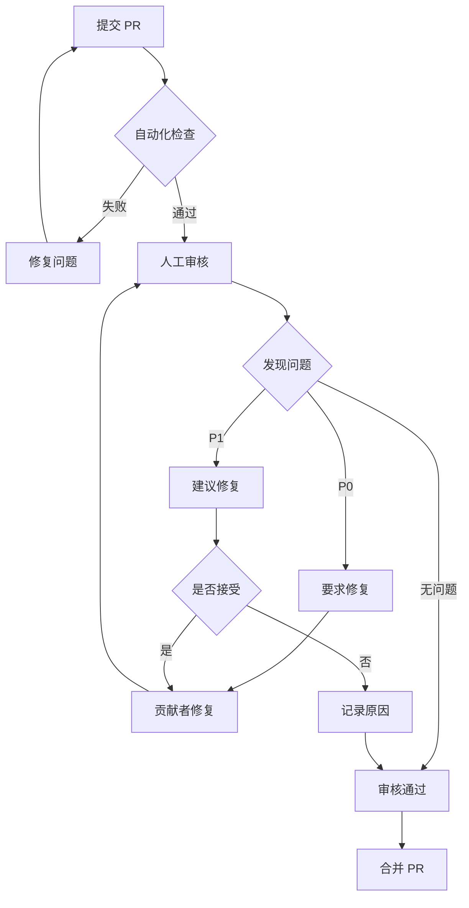

# 审核清单

> 提交前和审核时使用的完整检查清单，确保内容质量和一致性。

## 目录

- [审核清单](#审核清单)
  - [目录](#目录)
  - [1. 提交前自检清单](#1-提交前自检清单)
    - [1.1 内容质量检查](#11-内容质量检查)
    - [1.2 格式规范检查](#12-格式规范检查)
    - [1.3 定理注册检查](#13-定理注册检查)
    - [1.4 链接验证检查](#14-链接验证检查)
    - [1.5 维护文件检查](#15-维护文件检查)
  - [2. 审核者检查清单](#2-审核者检查清单)
    - [2.1 内容审核](#21-内容审核)
    - [2.2 格式审核](#22-格式审核)
    - [2.3 完整性审核](#23-完整性审核)
  - [3. 问题分类与处理](#3-问题分类与处理)
    - [3.1 问题严重程度](#31-问题严重程度)
    - [3.2 常见 P0 问题](#32-常见-p0-问题)
    - [3.3 常见 P1 问题](#33-常见-p1-问题)
    - [3.4 审核评论模板](#34-审核评论模板)
  - [4. 审核流程](#4-审核流程)
    - [4.1 审核流程图](#41-审核流程图)
    - [4.2 审核步骤](#42-审核步骤)
    - [4.3 审核响应时间](#43-审核响应时间)
    - [4.4 合并标准](#44-合并标准)
  - [5. 自动化检查脚本](#5-自动化检查脚本)
    - [5.1 本地检查脚本](#51-本地检查脚本)
    - [5.2 GitHub Actions 工作流](#52-github-actions-工作流)
  - [6. 审核最佳实践](#6-审核最佳实践)
    - [6.1 对贡献者](#61-对贡献者)
    - [6.2 对审核者](#62-对审核者)
  - [快速检查表](#快速检查表)

---

## 1. 提交前自检清单

### 1.1 内容质量检查

| 检查项 | 要求 | 状态 |
|-------|------|------|
| 文档定位 | 内容符合目标目录定位（Struct/Knowledge/Flink） | ☐ |
| 结构完整 | 六段式模板结构完整 | ☐ |
| 形式化元素 | 包含至少一个定理/定义/引理（如适用） | ☐ |
| 可视化 | 包含至少一个 Mermaid 图表 | ☐ |
| 引用充足 | 引用不少于 3 条 | ☐ |
| 链接有效 | 所有引用链接已验证可访问 | ☐ |

### 1.2 格式规范检查

| 检查项 | 要求 | 状态 |
|-------|------|------|
| 文件名 | 符合命名规范（小写，连字符分隔） | ☐ |
| Markdown | 语法正确，通过 markdownlint | ☐ |
| 代码块 | 指定语言标识符 | ☐ |
| 列表表格 | 格式正确 | ☐ |
| 中英文混排 | 符合规范（中英文间有空格） | ☐ |

### 1.3 定理注册检查

| 检查项 | 要求 | 状态 |
|-------|------|------|
| 编号唯一 | 定理编号全局唯一 | ☐ |
| 格式正确 | 编号格式符合 `{Type}-{Stage}-{Doc}-{Seq}` 规范 | ☐ |
| 注册表更新 | THEOREM-REGISTRY.md 已更新 | ☐ |

### 1.4 链接验证检查

| 检查项 | 要求 | 状态 |
|-------|------|------|
| 内部链接 | 文档内部链接可访问 | ☐ |
| 外部链接 | 外部引用链接有效（200/206） | ☐ |
| 图片路径 | 图片路径正确 | ☐ |

### 1.5 维护文件检查

| 检查项 | 要求 | 状态 |
|-------|------|------|
| 项目跟踪 | PROJECT-TRACKING.md 已更新 | ☐ |
| 导航索引 | NAVIGATION-INDEX.md 已更新 | ☐ |
| 交叉引用 | 相关文档的交叉引用已更新 | ☐ |

---

## 2. 审核者检查清单

### 2.1 内容审核

| 检查项 | 标准 | 优先级 |
|-------|------|--------|
| 技术准确性 | 概念、公式、代码正确无误 | P0 |
| 引用可靠性 | 来源权威，DOI/URL 有效 | P0 |
| 逻辑严密性 | 论证逻辑清晰，无漏洞 | P0 |
| 内容一致性 | 与现有内容无冲突 | P1 |
| 数学正确性 | 公式推导正确 | P1 |
| 代码可运行 | 代码示例可运行（如适用） | P1 |

### 2.2 格式审核

| 检查项 | 标准 | 优先级 |
|-------|------|--------|
| 模板符合 | 符合六段式模板 | P0 |
| 编号正确 | 定理编号正确且唯一 | P0 |
| 引用格式 | 引用格式规范 | P1 |
| Mermaid 语法 | Mermaid 语法正确 | P1 |
| 中英文混排 | 符合规范 | P2 |

### 2.3 完整性审核

| 检查项 | 标准 | 优先级 |
|-------|------|--------|
| 注册表更新 | THEOREM-REGISTRY.md 已更新 | P0 |
| 项目跟踪 | PROJECT-TRACKING.md 已更新 | P1 |
| 导航索引 | 新增文档已添加到导航索引 | P1 |
| 审核意见 | 所有审核意见已解决 | P0 |

---

## 3. 问题分类与处理

### 3.1 问题严重程度

| 级别 | 说明 | 处理方式 |
|-----|------|---------|
| **P0 - 阻塞** | 必须修复才能合并 | 要求修复，阻塞合并 |
| **P1 - 重要** | 应该修复，影响质量 | 建议修复，可协商 |
| **P2 - 建议** | 可选改进 | 记录建议，后续处理 |

### 3.2 常见 P0 问题

```markdown
## 必须修复的问题 (P0)

### 技术错误
- [ ] 概念定义错误
- [ ] 定理陈述错误
- [ ] 公式推导错误
- [ ] 代码示例错误

### 编号冲突
- [ ] 定理编号与现有编号重复
- [ ] 编号格式不符合规范
- [ ] 缺少必要的形式化元素

### 引用问题
- [ ] 引用来源不可靠
- [ ] 关键陈述缺少引用
- [ ] 链接失效

### 结构问题
- [ ] 缺少六段式核心章节
- [ ] 缺少可视化
- [ ] 定理注册表未更新
```

### 3.3 常见 P1 问题

```markdown
## 建议修复的问题 (P1)

### 内容改进
- [ ] 可以增加更多示例
- [ ] 解释可以更清晰
- [ ] 引用可以更新到最新版本

### 格式优化
- [ ] Mermaid 图表可以优化布局
- [ ] 中英文混排可以改进
- [ ] 代码格式可以统一

### 完整性
- [ ] 可以添加更多交叉引用
- [ ] 导航索引可以补充
```

### 3.4 审核评论模板

**P0 评论模板**：

```markdown
**[P0] 问题类型**: 简要描述

详细说明：...

建议修复：...
```

**P1 评论模板**：

```markdown
**[P1] 建议**: 简要描述

说明：...

可选修复：...
```

**P2 评论模板**：

```markdown
**[P2] 可选改进**: 简要描述

说明：...
```

---

## 4. 审核流程

### 4.1 审核流程图



### 4.2 审核步骤

**步骤 1: 自动化检查**

```bash
# 检查 Markdown 语法
npx markdownlint-cli "**/*.md" --ignore node_modules

# 检查链接
find . -name "*.md" -not -path "./node_modules/*" -exec npx markdown-link-check {} \;

# 验证 Mermaid 语法（手动检查）
```

**步骤 2: 内容审核**

- [ ] 阅读文档，理解内容
- [ ] 验证技术准确性
- [ ] 检查引用来源
- [ ] 验证数学公式（如有）

**步骤 3: 格式审核**

- [ ] 检查六段式结构
- [ ] 验证定理编号
- [ ] 检查引用格式
- [ ] 验证 Mermaid 语法

**步骤 4: 完整性审核**

- [ ] 检查 THEOREM-REGISTRY.md
- [ ] 检查 PROJECT-TRACKING.md
- [ ] 检查 NAVIGATION-INDEX.md

### 4.3 审核响应时间

| 类型 | 响应时间 | 说明 |
|-----|---------|------|
| 首次响应 | 3-5 工作日 | 确认收到 PR |
| 审核周期 | 7-14 工作日 | 完成审核 |
| 修复验证 | 3-5 工作日 | 验证修复 |

### 4.4 合并标准

PR 可以合并的条件：

1. ✅ 所有自动化检查通过
2. ✅ 所有 P0 问题已解决
3. ✅ 至少一名维护者审核通过
4. ✅ 无未解决的讨论
5. ✅ 与主分支无冲突

---

## 5. 自动化检查脚本

### 5.1 本地检查脚本

```bash
#!/bin/bash
# check-local.sh - 本地提交前检查

echo "=== 本地提交前检查 ==="

# 1. Markdown 语法检查
echo "[1/4] Markdown 语法检查..."
npx markdownlint-cli "**/*.md" --ignore node_modules --ignore .git
if [ $? -ne 0 ]; then
    echo "❌ Markdown 语法检查失败"
    exit 1
fi
echo "✅ Markdown 语法检查通过"

# 2. 链接检查
echo "[2/4] 链接检查..."
# 仅检查修改的文件
for file in $(git diff --name-only --cached | grep '.md$'); do
    npx markdown-link-check "$file" -q
    if [ $? -ne 0 ]; then
        echo "❌ 链接检查失败: $file"
        exit 1
    fi
done
echo "✅ 链接检查通过"

# 3. 定理编号检查
echo "[3/4] 定理编号检查..."
python3 .scripts/check-theorem-ids.py
if [ $? -ne 0 ]; then
    echo "❌ 定理编号检查失败"
    exit 1
fi
echo "✅ 定理编号检查通过"

# 4. 文件命名检查
echo "[4/4] 文件命名检查..."
# 检查新文件命名规范
for file in $(git diff --name-only --cached --diff-filter=A | grep '.md$'); do
    if [[ ! $file =~ ^[a-z0-9./-]+$ ]]; then
        echo "❌ 文件命名不符合规范: $file"
        exit 1
    fi
done
echo "✅ 文件命名检查通过"

echo ""
echo "=== 所有检查通过 ✅ ==="
echo "可以安全地提交更改"
```

### 5.2 GitHub Actions 工作流

```yaml
# .github/workflows/pr-check.yml
name: PR Check

on:
  pull_request:
    paths:
      - '**.md'

jobs:
  lint:
    runs-on: ubuntu-latest
    steps:
      - uses: actions/checkout@v3

      - name: Markdown Lint
        run: |
          npm install -g markdownlint-cli
          markdownlint-cli "**/*.md" --ignore node_modules

      - name: Check Theorem IDs
        run: python3 .scripts/check-theorem-ids.py
```

---

## 6. 审核最佳实践

### 6.1 对贡献者

- **积极响应**：及时回复审核评论
- **逐个修复**：逐一解决审核问题
- **说明理由**：如果不同意某个建议，说明理由
- **保持礼貌**：审核是帮助改进，不是批评

### 6.2 对审核者

- **及时响应**：在规定时间内完成审核
- **明确分类**：清晰标注问题级别 (P0/P1/P2)
- **提供建议**：不仅指出问题，还提供修复建议
- **认可努力**：肯定贡献者的工作
- **保持尊重**：使用礼貌和建设性的语言

---

## 快速检查表

```markdown
## 提交前快速检查

- [ ] 内容准确无误
- [ ] 六段式结构完整
- [ ] 定理编号唯一
- [ ] 引用格式正确
- [ ] Mermaid 语法正确
- [ ] 中英文混排规范
- [ ] 定理注册表已更新
- [ ] 本地检查通过

## 审核快速检查

- [ ] 技术内容准确
- [ ] 引用来源可靠
- [ ] 逻辑严密
- [ ] 符合模板
- [ ] 编号正确
- [ ] 无 P0 问题
```
