> **状态**: 🔮 前瞻内容 | **风险等级**: 高 | **最后更新**: 2026-04
> 
> 此文档描述的内容处于早期规划阶段，可能与最终实现不符。请以 Apache Flink 官方发布为准。
# 视频教程脚本：创建 Mermaid 图表

> 时长: 18-22 分钟 | 目标受众: 所有内容贡献者

---

## 开场 (1 分钟)

### 画面

- 项目 Logo 和标题
- Mermaid 图表示例展示

### 脚本

```
大家好！欢迎回到 AnalysisDataFlow 贡献指南系列教程。

在前两期中，我们学习了基础贡献流程和形式化定理编写。
今天，我们将学习如何创建 Mermaid 可视化图表。

可视化是 AnalysisDataFlow 文档的重要组成部分，
它帮助读者直观理解复杂的概念和流程。

通过本教程，你将学会：
- 选择合适的图表类型
- 编写 Mermaid 语法
- 设计清晰的图表结构
- 优化图表的可读性

让我们开始吧！
```

---

## 第一部分：Mermaid 简介 (2 分钟)

### 画面

- Mermaid 官网
- 图表类型展示

### 脚本

```
首先，让我们了解 Mermaid 是什么。

Mermaid 是一个基于 JavaScript 的图表绘制工具，
它允许你使用类似 Markdown 的语法创建图表。

在 AnalysisDataFlow 项目中，
我们主要使用以下几种图表类型：

graph TB - 从上到下的层次结构图，
适合展示概念层次和架构关系。

flowchart TD - 流程图，
适合展示决策流程和算法步骤。

sequenceDiagram - 时序图，
适合展示组件间的交互顺序。

stateDiagram-v2 - 状态图，
适合展示状态转移和执行流程。

classDiagram - 类图，
适合展示类型系统和模型结构。

Gantt - 甘特图，
适合展示项目计划和路线图。

让我们看看项目中的一些实际示例。
```

### 屏幕操作

```
1. 展示 Mermaid 官网
2. 逐个展示不同图表类型
3. 展示项目中的实际示例
```

---

## 第二部分：层次结构图 (4 分钟)

### 画面

- graph TB 示例
- 实时编写演示

### 脚本

```
让我们从最常用的层次结构图开始。

graph TB 表示从上到下的层次结构，
graph TD 表示从上到下的层次结构（另一种写法）。

基本语法很简单：
- 使用 A --> B 表示 A 指向 B 的箭头
- 使用方括号 [文本] 表示矩形节点
- 使用圆括号 (文本) 表示圆角矩形

让我演示如何创建一个 Checkpoint 架构图。

首先，定义图表类型：
```mermaid
graph TB
```

然后，定义节点：

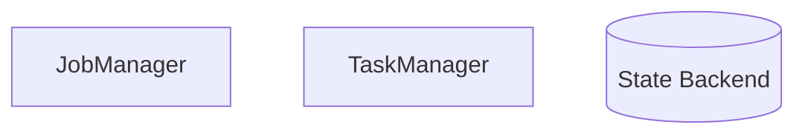

接着，添加连接：

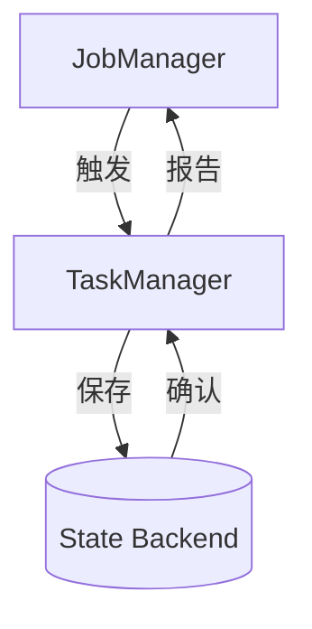

我们还可以：

- 使用不同形状区分节点类型
- 添加标签说明连接含义
- 使用子图组织相关节点

添加子图：

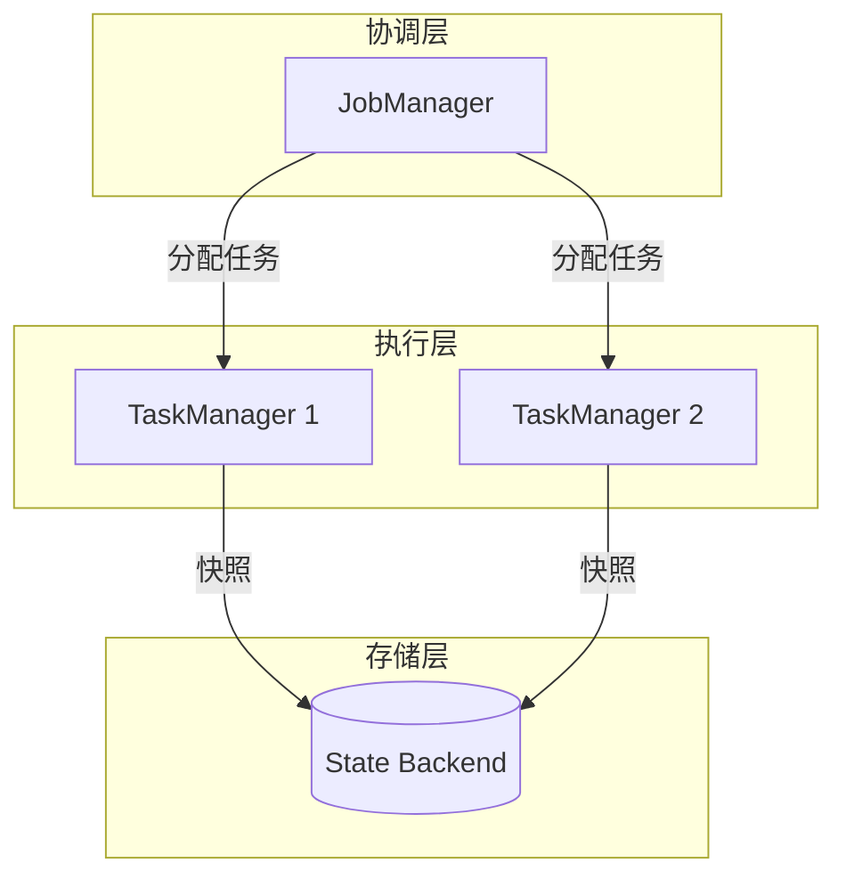

子图可以帮助我们组织复杂的图表，
让层次关系更加清晰。

```

### 屏幕操作
```

1. 在 Mermaid Live Editor 中编写
2. 逐步添加节点
3. 添加连接
4. 添加子图
5. 展示最终效果

```

---

## 第三部分：时序图 (4 分钟)

### 画面
- sequenceDiagram 示例
- 交互流程演示

### 脚本
```

时序图是展示交互流程的有力工具。

在流处理系统中，时序图特别适合展示：

- Checkpoint 协调过程
- Watermark 传播机制
- 故障恢复流程

基本语法：

- participant 定义参与者
- ->> 表示实线箭头
- -->> 表示虚线箭头
- activate/deactivate 表示激活/取消激活

让我演示 Checkpoint 的协调时序。

定义参与者：

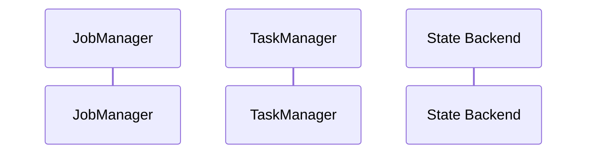

添加交互步骤：

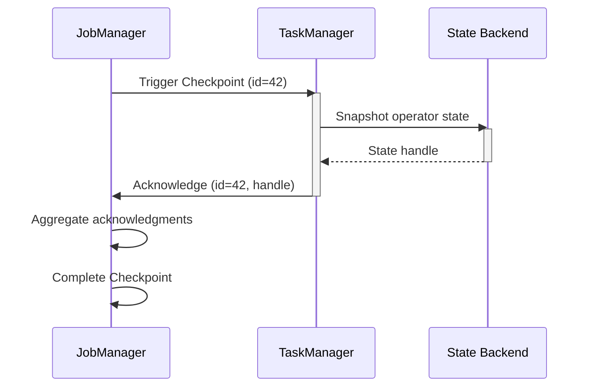

高级特性：

- 使用 loop 表示循环
- 使用 alt/else 表示条件分支
- 使用 opt 表示可选步骤

添加循环和条件：

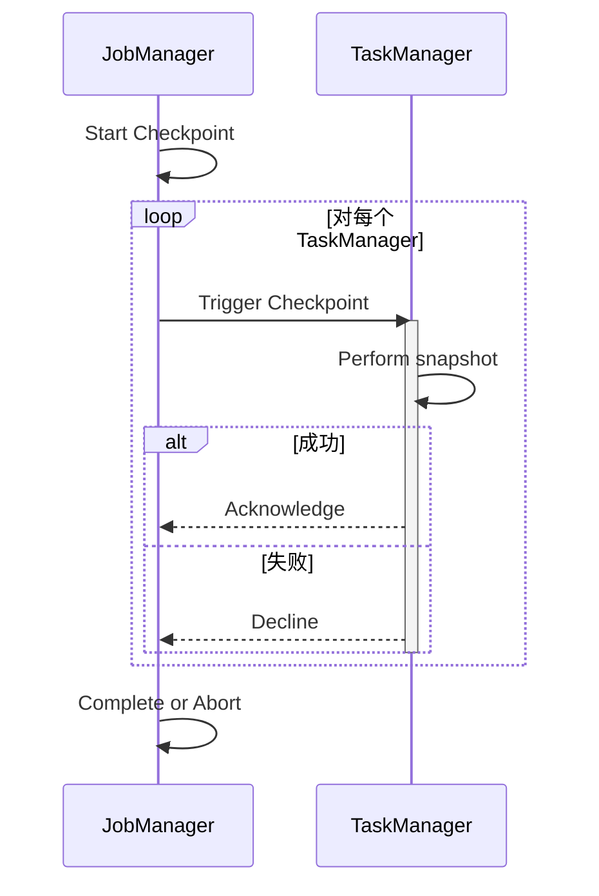

时序图让复杂的交互流程一目了然，
是理解分布式系统行为的重要工具。

```

### 屏幕操作
```

1. 定义参与者
2. 添加基本交互
3. 使用 activate/deactivate
4. 添加 loop
5. 添加 alt/else
6. 展示完整图表

```

---

## 第四部分：流程图 (3 分钟)

### 画面
- flowchart 示例
- 决策树演示

### 脚本
```

流程图适合展示算法流程和决策过程。

与 graph 不同，flowchart 提供了更多控制流元素：

- 条件判断
- 并行处理
- 子流程

基本语法：

- 使用方向关键字（TD、LR、RL、BT）
- 使用特殊形状表示判断（菱形）
- 使用 & 表示并行路径

让我演示 Watermark 生成策略的选择流程。

创建决策流程：

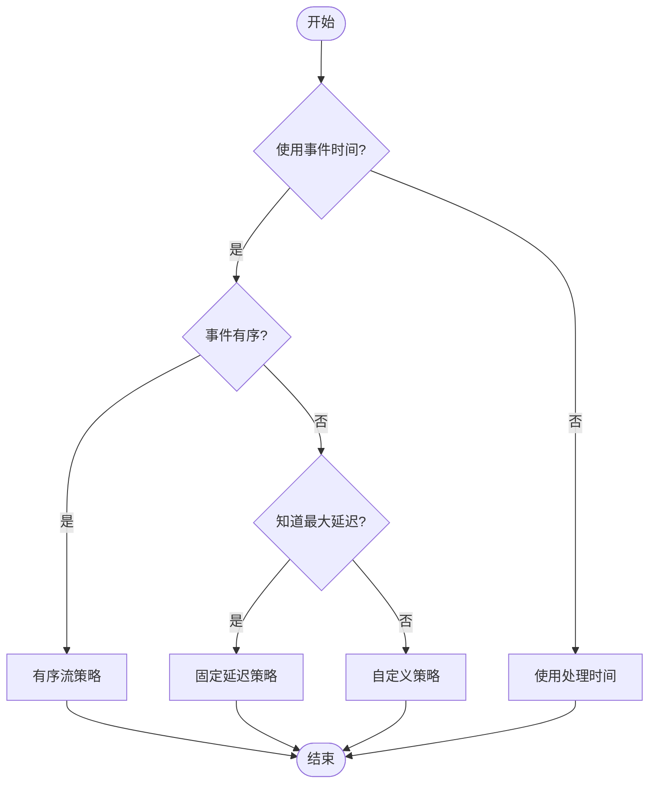

样式美化：

- 使用 classDef 定义样式类
- 应用样式到特定节点

添加样式：

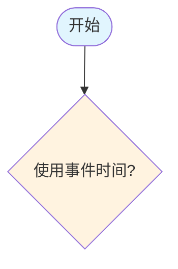

流程图让决策逻辑清晰可见，
特别适合算法说明和配置指南。

```

### 屏幕操作
```

1. 创建基本流程
2. 添加判断节点
3. 完善所有路径
4. 添加样式
5. 展示效果

```

---

## 第五部分：状态图 (3 分钟)

### 画面
- stateDiagram 示例
- 状态转移演示

### 脚本
```

状态图用于展示系统的状态转移和执行流程。

在流处理中，状态图可以展示：

- 算子生命周期
- Checkpoint 状态机
- 作业执行状态

基本语法：

- state 定义状态
- --> 表示状态转移
- [*] 表示初始/终止状态

让我演示 Flink 作业的状态机。

创建状态图：

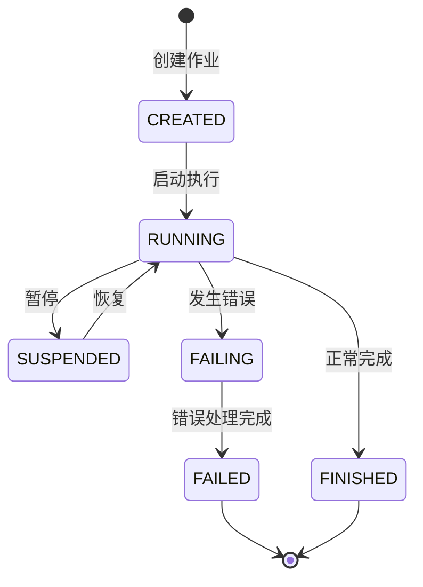

添加转移条件：

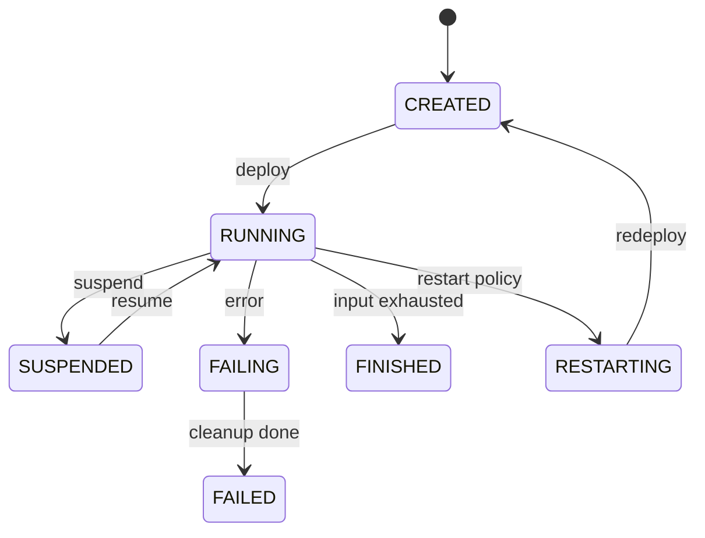

组合状态：

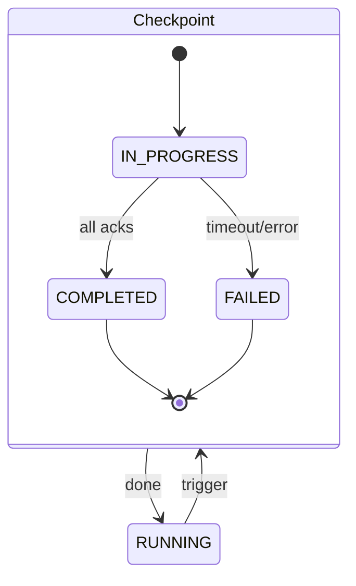

状态图清晰展示了系统行为的动态方面，
是理解复杂执行流程的好工具。

```

### 屏幕操作
```

1. 创建基本状态
2. 添加状态转移
3. 添加转移条件
4. 创建组合状态
5. 展示效果

```

---

## 第六部分：最佳实践 (3 分钟)

### 画面
- 优化前后的对比
- 常见问题展示

### 脚本
```

让我们总结一些 Mermaid 图表的最佳实践。

**1. 保持简洁**

不好的示例：

- 节点过多，超过 15 个
- 连接线交叉混乱
- 文字过长

好的示例：

- 节点控制在 10 个以内
- 层次分明，减少交叉
- 使用简洁的标签

**2. 使用有意义的命名**

不好的示例：

```
A --> B --> C
```

好的示例：

```
Source --> Operator --> Sink
```

**3. 添加说明文字**

每个图表前都应该有文字说明：

```markdown
以下图表展示了 Checkpoint 的协调流程：

```mermaid
...
```

**4. 选择合适的图表类型**

- 概念层次 → graph TB
- 交互流程 → sequenceDiagram
- 决策过程 → flowchart
- 状态转移 → stateDiagram
- 类型关系 → classDiagram

**5. 验证语法**

编写完成后，使用 Mermaid Live Editor 验证：

- 访问 mermaid.live
- 粘贴代码
- 检查渲染结果

**6. 常见错误**

- 节点名包含特殊字符 → 使用引号
- 循环依赖 → 确保有终止条件
- 缩进错误 → 使用统一缩进

**7. 优化技巧**

- 使用子图组织复杂图表
- 使用样式区分不同类型节点
- 使用注释说明复杂逻辑

```

### 屏幕操作
```

1. 展示不好的示例
2. 改进为好的示例
3. 展示命名对比
4. 展示说明文字格式
5. 展示 Mermaid Live Editor 验证

```

---

## 第七部分：在文档中使用 (2 分钟)

### 画面
- Markdown 文档
- VS Code 预览

### 脚本
```

最后，让我们看看如何在 Markdown 文档中使用 Mermaid。

在 AnalysisDataFlow 文档中，
Mermaid 图表放在第 7 节"可视化"中。

基本格式：

```markdown
## 7. 可视化 (Visualizations)

### 7.1 架构图

以下图表展示了系统的整体架构：

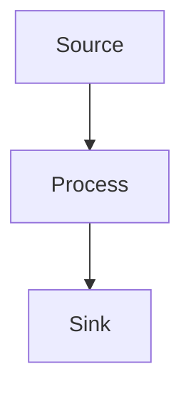

```

VS Code 中预览：
1. 安装 Markdown Preview Mermaid Support 扩展
2. 打开 Markdown 预览（Ctrl+Shift+V）
3. 实时查看图表渲染效果

提交前检查：
- 在 Mermaid Live Editor 中验证语法
- 确保图表清晰可读
- 检查所有标签和连接

VS Code 扩展推荐：
- Markdown Preview Mermaid Support（预览）
- Mermaid Preview（独立预览）
```

### 屏幕操作

```
1. 在 VS Code 中创建文档
2. 添加 Mermaid 代码块
3. 打开预览查看效果
4. 调整优化
5. 展示最终效果
```

---

## 结尾 (1 分钟)

### 画面

- 总结幻灯片
- 资源链接

### 脚本

```
今天我们学习了 Mermaid 图表的创建：

1. 了解了 Mermaid 的基本概念
2. 学习了层次结构图的创建
3. 掌握了时序图的编写
4. 实践了流程图和状态图
5. 了解了最佳实践和使用方法

记住：
- 选择合适的图表类型
- 保持图表简洁清晰
- 添加文字说明
- 验证语法正确性

更多资源：
- Mermaid 官方文档: mermaid.js.org
- 项目示例文档: Flink/ 目录
- Mermaid Live Editor: mermaid.live

至此，我们的贡献指南系列教程就结束了。
感谢观看，期待你为 AnalysisDataFlow 创建精美的可视化！
```

---

## 附录：Mermaid 快速参考

```markdown
## 常用图表类型

| 类型 | 语法 | 用途 |
|-----|------|------|
| 层次图 | `graph TB` | 概念层次 |
| 时序图 | `sequenceDiagram` | 交互流程 |
| 流程图 | `flowchart TD` | 决策过程 |
| 状态图 | `stateDiagram-v2` | 状态转移 |
| 类图 | `classDiagram` | 类型关系 |

## 常用语法

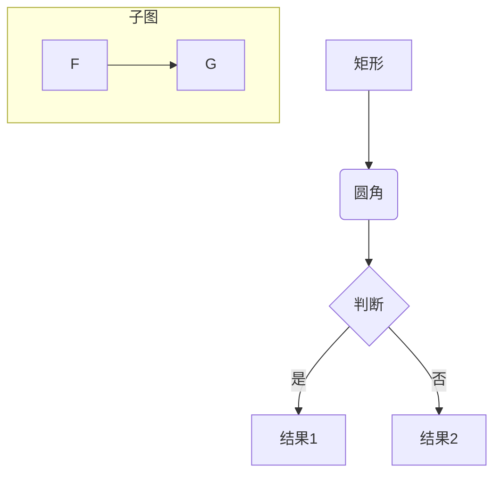

## 检查清单

- [ ] 图表类型选择合适
- [ ] 节点命名清晰
- [ ] 连接线不混乱
- [ ] 添加了文字说明
- [ ] 语法验证通过

```
