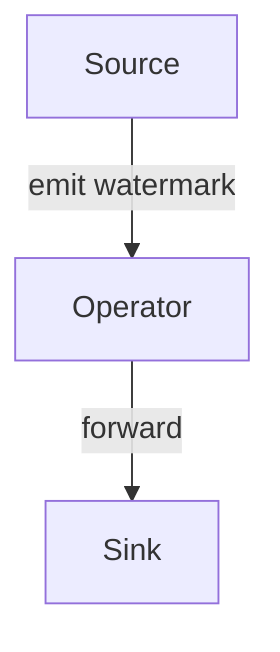
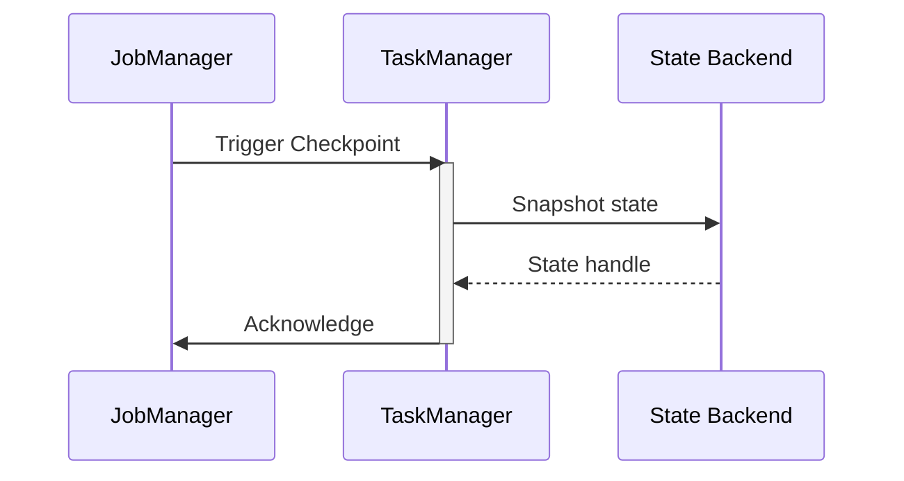

# 写作风格指南

> 本指南规范 AnalysisDataFlow 项目的文档写作风格，确保内容的一致性、专业性和可读性。

## 目录

- [写作风格指南](#写作风格指南)
  - [目录](#目录)
  - [1. 写作原则](#1-写作原则)
    - [1.1 四大核心原则](#11-四大核心原则)
    - [1.2 语气与风格](#12-语气与风格)
  - [2. 文档结构](#2-文档结构)
    - [2.1 六段式模板详解](#21-六段式模板详解)
    - [2.2 各章节详细说明](#22-各章节详细说明)
      - [概念定义 (Definitions)](#概念定义-definitions)
      - [属性推导 (Properties)](#属性推导-properties)
      - [关系建立 (Relations)](#关系建立-relations)
      - [形式证明 (Proof)](#形式证明-proof)
      - [实例验证 (Examples)](#实例验证-examples)
    - [6.3 生产案例](#63-生产案例)
    - [3.2 列表使用](#32-列表使用)
    - [3.3 中英文混排](#33-中英文混排)
  - [4. 术语规范](#4-术语规范)
    - [4.1 术语一致性](#41-术语一致性)
    - [4.2 术语定义格式](#42-术语定义格式)
    - [4.3 缩略语使用](#43-缩略语使用)
  - [5. 代码示例](#5-代码示例)
    - [5.1 代码块格式](#51-代码块格式)
    - [5.4 代码完整性](#54-代码完整性)
    - [6.2 独立公式](#62-独立公式)
    - [6.3 常用符号](#63-常用符号)
  - [7. 图表规范](#7-图表规范)
    - [7.1 Mermaid 图表类型选择](#71-mermaid-图表类型选择)
    - [7.2 图表设计原则](#72-图表设计原则)
    - [7.3 图表示例](#73-图表示例)
    - [8.2 引用来源优先级](#82-引用来源优先级)
    - [8.3 引用原则](#83-引用原则)
  - [快速参考卡片](#快速参考卡片)

---

## 1. 写作原则

### 1.1 四大核心原则

| 原则 | 说明 | 正面示例 | 反面示例 |
|-----|------|---------|---------|
| **准确性** | 概念准确，逻辑严密 | "Watermark 是事件时间处理的进度度量" | "Watermark 大概是一种时间标记" |
| **清晰性** | 表达清晰，层次分明 | 使用"首先...其次...最后" | 冗长混乱的长段落 |
| **简洁性** | 言简意赅，去除冗余 | "Flink 的 Checkpoint 机制" | "Apache Flink 流计算框架所提供的 Checkpoint 容错机制" |
| **完整性** | 内容完整，论证充分 | 定义→解释→示例→引用 | 只有定义没有解释 |

### 1.2 语气与风格

**应该做的**：

- 使用客观、学术的语气
- 使用主动语态（"我们定义"而非"被定义"）
- 使用现在时态
- 每个概念都提供定义和解释

**不应该做的**：

- 使用口语化表达（"这个东西"、"那个啥"）
- 使用营销语言（"革命性的"、"最佳的"）
- 使用主观评价（"显然"、"众所周知"）
- 使用模糊限定词（"可能"、"大概"，除非表达不确定性）

---

## 2. 文档结构

### 2.1 六段式模板详解

每篇核心文档必须遵循以下结构：

```markdown
# 标题

> 所属阶段: Struct/ Knowledge/ Flink/ | 前置依赖: [文档链接] | 形式化等级: L1-L6

## 1. 概念定义 (Definitions)
## 2. 属性推导 (Properties)
## 3. 关系建立 (Relations)
## 4. 论证过程 (Argumentation)
## 5. 形式证明 / 工程论证 (Proof / Engineering Argument)
## 6. 实例验证 (Examples)
## 7. 可视化 (Visualizations)
## 8. 引用参考 (References)
```

### 2.2 各章节详细说明

#### 概念定义 (Definitions)

**要求**：

- 严格的形式化定义
- 直观解释（用通俗语言说明）
- 至少一个 `Def-*` 编号

**模板**：

```markdown
## 1. 概念定义 (Definitions)

**定义 X.X** (概念名称): `Def-{阶段}-{文档}-{序号}`

形式化定义:
$$概念 := 数学定义$$

直观解释:
用通俗语言解释这个概念的含义、作用和使用场景...

**示例**:
```markdown
**定义 1.1** (Watermark): `Def-F-03-01`

形式化定义：
给定事件流 $S = \{e_1, e_2, ..., e_n\}$，Watermark 是一个单调不减的函数 $w: \mathbb{N} \rightarrow \mathbb{T}$，其中 $\mathbb{T}$ 是时间域。

直观解释：
Watermark 是流处理系统用来度量事件时间处理进度的时间戳。它告诉系统："所有时间戳小于等于此 Watermark 的事件应该已经到达"。
```

#### 属性推导 (Properties)

**要求**:

- 从定义直接推导的性质
- 至少一个 `Lemma-*` 或 `Prop-*` 编号
- 每个性质需有简要证明或说明

**模板**:

```markdown
## 2. 属性推导 (Properties)

**引理 X.X** (性质名称): `Lemma-{阶段}-{文档}-{序号}`

陈述：...

证明：
1. 根据定义...
2. 因此...
∎
```

#### 关系建立 (Relations)

**要求**:

- 与其他概念/模型/系统的关系
- 使用表格或图表展示关系
- 说明关系的方向性和强度

**示例**:

```markdown
## 3. 关系建立 (Relations)

### 3.1 与相关概念的关系

| 概念 | 关系类型 | 说明 |
|-----|---------|------|
| Processing Time | 对比 | Watermark 用于事件时间，与处理时间相对 |
| Lateness | 依赖 | Watermark 决定延迟数据的边界 |

### 3.2 编码关系

以下图表展示了 Watermark 在 Flink 中的传播机制：



```

#### 论证过程 (Argumentation)

**要求**:
- 辅助定理和引理
- 反例分析(如适用)
- 边界讨论

**示例**:
```markdown
## 4. 论证过程 (Argumentation)

### 4.1 边界分析

Watermark 机制在以下边界条件下需要特别注意：

1. **无序度极高**：当事件乱序程度超过预期时...
2. **延迟数据过多**：当大量数据超过 Watermark 边界到达时...

### 4.2 反例

以下场景展示了 Watermark 机制的局限性：
...
```

#### 形式证明 (Proof)

**要求**:

- 核心定理的完整证明
- 清晰的证明结构
- `Thm-*` 编号

**模板**:

```markdown
## 5. 形式证明 (Proof)

**定理 X.X** (定理名称): `Thm-{阶段}-{文档}-{序号}`

**陈述**：...

**证明**：
1. 假设...
2. 根据引理 X.X，...
3. 因此...

∎ **证毕**
```

#### 实例验证 (Examples)

**要求**:

- 简化实例
- 代码片段(如适用)
- 配置示例
- 真实案例

**示例**:

```markdown
## 6. 实例验证 (Examples)

### 6.1 简化实例

假设我们有一个简单的事件流：...

### 6.2 代码示例

```java

// [伪代码片段 - 不可直接运行] 仅展示核心逻辑
import org.apache.flink.api.common.eventtime.WatermarkStrategy;

WatermarkStrategy<Event> strategy = WatermarkStrategy
    .<Event>forBoundedOutOfOrderness(Duration.ofSeconds(5))
    .withTimestampAssigner((event, timestamp) -> event.getEventTime());
```

### 6.3 生产案例

在某电商实时风控系统中，Watermark 被用于...

```

#### 可视化 (Visualizations)

**要求**:
- 至少一个 Mermaid 图表
- 图表前有简短说明
- 选择合适的图表类型

#### 引用参考 (References)

**要求**:
- 使用 `[^n]` 上标格式
- 至少 3 条引用
- 权威来源

---

## 3. 语言表达

### 3.1 段落结构

**每段聚焦一个主题**:
```markdown
✅ 正确：
Watermark 是流处理中用于处理无序事件的关键机制。它通过注入特殊的时间戳标记来度量事件时间处理的进度。

Flink 提供了多种 Watermark 生成策略。内置策略包括有序流策略和固定延迟策略，也支持自定义策略。

❌ 错误：
Watermark 是流处理中用于处理无序事件的关键机制，Flink 提供了多种 Watermark 生成策略，内置策略包括有序流策略和固定延迟策略，也支持自定义策略，它通过注入特殊的时间戳标记来度量事件时间处理的进度。
```

**段首句概括主旨**:

```markdown
✅ 正确：
Checkpoint 是 Flink 实现容错的核心机制。它通过周期性地保存算子状态来确保故障恢复时的数据一致性。

❌ 错误：
在 Flink 中有一个非常重要的机制叫做 Checkpoint，它是实现容错的核心机制，通过周期性地保存算子状态来确保故障恢复时的数据一致性。
```

### 3.2 列表使用

**有序列表**:用于步骤或优先级

```markdown
启用 Checkpoint 的步骤如下：

1. 配置 Checkpoint 间隔
2. 选择状态后端
3. 设置 exactly-once 语义
4. 启动应用程序
```

**无序列表**:用于并列项

```markdown
Flink 支持以下状态后端：

- MemoryStateBackend
- FsStateBackend
- RocksDBStateBackend
```

**嵌套列表**:不超过 3 层

```markdown
- 一级项目
  - 二级项目
    - 三级项目
```

### 3.3 中英文混排

**基本规则**:

- 中文和英文/数字之间添加空格
- 标点符号使用中文全角(代码除外)
- 专有名词保持英文

| 正确 | 错误 |
|-----|------|
| Flink 的 Checkpoint 机制 | Flink的Checkpoint机制 |
| 在 5 秒内完成 | 在5秒内完成 |
| 版本 1.18.0 引入了 | 版本1.18.0引入了 |
| 使用 `map()` 函数 | 使用`map()`函数 |

---

## 4. 术语规范

### 4.1 术语一致性

| 首选术语 | 避免使用 | 说明 |
|---------|---------|------|
| Checkpoint | 检查点/快照 | 使用英文术语 |
| Watermark | 水印/水位线 | 使用英文术语 |
| Exactly-Once | 恰好一次 | 使用英文术语 |
| At-Least-Once | 至少一次 | 使用英文术语 |
| 流处理 | 流式处理/流计算 | 统一使用 "流处理" |
| 算子 | Operator | 中文文档使用 "算子" |
| 有状态 | Stateful | 中文文档使用 "有状态" |
| 作业 | Job | 中文文档使用 "作业" |

### 4.2 术语定义格式

首次出现的重要术语需给出定义:

```markdown
**Watermark**（水位线）是一种时间戳机制，用于衡量事件时间处理的进度...
```

### 4.3 缩略语使用

首次使用时给出全称和缩写:

```markdown
Apache Flink 实现了异步屏障快照（Asynchronous Barrier Snapshotting，ABS）机制。ABS 允许...
```

**无需全称的常见缩略语**:

- CPU、GPU、API、URL、HTTP、JSON

---

## 5. 代码示例

### 5.1 代码块格式

```markdown
✅ 正确：
```java

// [伪代码片段 - 不可直接运行] 仅展示核心逻辑
import org.apache.flink.streaming.api.datastream.DataStream;

// Java 代码示例
DataStream<Event> stream = env
    .addSource(new KafkaSource<>())
    .assignTimestampsAndWatermarks(
        WatermarkStrategy.<Event>forBoundedOutOfOrderness(
            Duration.ofSeconds(5)
        )
    );
```

❌ 错误：

```
DataStream<Event> stream = env.addSource(new KafkaSource<>())
```

```

### 5.2 代码规范

| 语言 | 规范 | 说明 |
|-----|------|------|
| Java | Google Java Style | 4空格缩进 |
| Python | PEP 8 | 4空格缩进 |
| Scala | Scalariform | 2空格缩进 |
| SQL | 项目自定义 | 关键字大写 |

### 5.3 代码注释

```java

import org.apache.flink.api.common.eventtime.WatermarkStrategy;

// ✅ 正确：解释"为什么"
// 设置 5 秒延迟是根据业务最大乱序时间确定的
WatermarkStrategy<Event> strategy = WatermarkStrategy
    .<Event>forBoundedOutOfOrderness(Duration.ofSeconds(5));

// ❌ 错误：只说明"做什么"
// 设置 Watermark 策略
WatermarkStrategy<Event> strategy = WatermarkStrategy
    .<Event>forBoundedOutOfOrderness(Duration.ofSeconds(5));
```

### 5.4 代码完整性

```markdown
✅ 完整的示例应包含：
- 必要的 import 语句
- 上下文代码（环境设置等）
- 版本标注

❌ 不完整的示例：
```java

// [伪代码片段 - 不可直接运行] 仅展示核心逻辑
import org.apache.flink.streaming.api.datastream.DataStream;

// 缺少 import 和上下文
DataStream<String> result = stream.map(x -> x.toString());
```

```

---

## 6. 数学公式

### 6.1 行内公式

使用 `$` 包裹:
```markdown
Watermark 是一个单调不减函数 $w: \mathbb{N} \rightarrow \mathbb{T}$。
```

### 6.2 独立公式

使用 `$$` 包裹:

```markdown
$$
\forall t_1, t_2 \in \mathbb{T}: t_1 < t_2 \Rightarrow w(t_1) \leq w(t_2)
$$
```

### 6.3 常用符号

| 含义 | LaTeX | 渲染 |
|-----|-------|------|
| 属于 | `\in` | $\in$ |
| 对于所有 | `\forall` | $\forall$ |
| 存在 | `\exists` | $\exists$ |
| 蕴含 | `\Rightarrow` | $\Rightarrow$ |
| 等价 | `\Leftrightarrow` | $\Leftrightarrow$ |
| 无穷 | `\infty` | $\infty$ |

---

## 7. 图表规范

### 7.1 Mermaid 图表类型选择

| 图表类型 | 用途 | 示例 |
|---------|------|------|
| `graph TB/TD` | 层次结构 | 架构图、概念层次 |
| `flowchart TD` | 流程图 | 算法流程、决策树 |
| `sequenceDiagram` | 时序图 | 协议交互、调用序列 |
| `stateDiagram-v2` | 状态机 | 状态转移、执行流程 |
| `classDiagram` | 类图 | 类型系统、模型结构 |
| `gantt` | 甘特图 | 项目计划、路线图 |

### 7.2 图表设计原则

1. **节点命名清晰**:使用有意义的标识符
2. **避免过于拥挤**:复杂图表分层次展示
3. **添加文字说明**:图表前说明其内容
4. **统一配色**:优先使用默认配色

### 7.3 图表示例

```markdown
以下图表展示了 Checkpoint 的协调流程：



```

---

## 8. 引用规范

### 8.1 引用格式

```markdown
[^1]: Apache Flink Documentation, "Checkpointing", 2025. https://nightlies.apache.org/flink/flink-docs-stable/
[^2]: T. Akidau et al., "The Dataflow Model", PVLDB, 8(12), 2015. https://doi.org/10.14778/2824032.2824076
[^3]: L. Lamport, "Time, Clocks...", CACM, 21(7), 1978.
```

### 8.2 引用来源优先级

1. **顶级会议/期刊**:VLDB, SIGMOD, OSDI, SOSP, CACM
2. **经典课程**:MIT 6.824, CMU 15-712, Stanford CS240
3. **官方文档**:Apache Flink, Go Spec, Scala Spec
4. **权威书籍**:Kleppmann《DDIA》, Akidau《Streaming Systems》

### 8.3 引用原则

- 每段关键陈述需有引用支持
- 原创结论需明确标注并给出论证
- 优先使用 DOI 或稳定 URL
- 提交前验证外部链接可访问

---

## 快速参考卡片

```markdown
## 文档检查清单

- [ ] 六段式结构完整
- [ ] 至少 1 个 Def-* 编号
- [ ] 至少 1 个 Lemma-* 或 Prop-* 编号
- [ ] 至少 1 个 Thm-* 编号（如适用）
- [ ] 至少 1 个 Mermaid 图表
- [ ] 至少 3 条引用
- [ ] 中英文混排规范
- [ ] 术语使用一致
```
