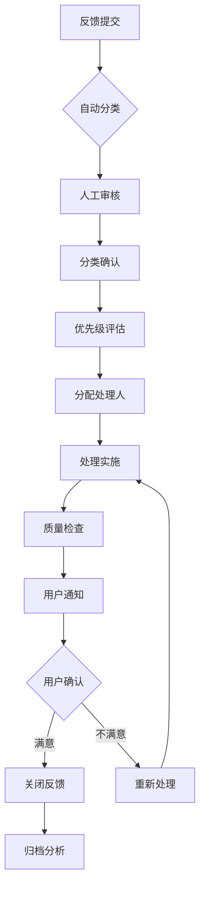

# 用户反馈处理流程

> 所属阶段: 社区运营 | 前置依赖: [用户反馈系统指南](../USER-FEEDBACK-SYSTEM-GUIDE.md) | 形式化等级: L3

本文档定义了用户反馈的标准化处理流程，确保每一条反馈都能得到及时、有效的响应。

---

## 1. 反馈收集渠道

### 1.1 正式渠道

| 渠道 | 用途 | 响应时间 |
|------|------|----------|
| GitHub Issues | 功能反馈、Bug 报告、改进建议 | 48 小时内 |
| GitHub Discussions | 一般讨论、问题咨询 | 72 小时内 |
| 邮件反馈 | 私密反馈、商业合作 | 48 小时内 |

### 1.2 社区渠道

| 渠道 | 用途 | 响应时间 |
|------|------|----------|
| 社区论坛 | 经验分享、使用交流 | 非正式 |
| 即时通讯群 | 快速问答、实时交流 | 非正式 |
| 社交媒体 | 公开反馈、传播互动 | 非正式 |

---

## 2. 反馈分类体系

### 2.1 按类型分类

```
反馈类型
├── 🐛 Bug 报告
│   ├── 内容错误(定理、定义错误)
│   ├── 链接失效
│   ├── 格式问题
│   └── 其他技术问题
├── ✨ 功能建议
│   ├── 新内容请求
│   ├── 功能增强
│   └── 流程优化
├── 📚 文档反馈
│   ├── 内容不清晰
│   ├── 缺少示例
│   ├── 翻译问题
│   └── 结构建议
├── 🎨 用户体验
│   ├── 导航困难
│   ├── 搜索问题
│   ├── 视觉设计
│   └── 交互体验
├── ⚡ 性能反馈
│   ├── 加载速度
│   ├── 搜索响应
│   └── 资源占用
└── 🤔 使用困惑
    ├── 概念不理解
    ├── 找不到内容
    └── 使用流程疑问
```

### 2.2 按优先级分类

| 优先级 | 定义 | 处理时限 | 标签 |
|--------|------|----------|------|
| P0 - 紧急 | 严重影响使用，需要立即处理 | 24 小时 | `priority/P0` |
| P1 - 高 | 重要功能问题或广泛影响 | 3 天 | `priority/P1` |
| P2 - 中 | 一般改进建议或局部问题 | 7 天 | `priority/P2` |
| P3 - 低 | 优化建议或长期规划 | 14 天 | `priority/P3` |

### 2.3 按用户类型分类

| 用户类型 | 特点 | 处理策略 |
|----------|------|----------|
| 学术研究 | 关注理论深度、引用准确性 | 专业回复，提供引用 |
| 工业开发 | 关注实用性、工程落地 | 案例导向，技术细节 |
| 学习探索 | 关注易理解性、学习路径 | 耐心指导，资源推荐 |
| 技术评估 | 关注全面性、可信度 | 客观介绍，数据支持 |

---

## 3. 处理流程

### 3.1 流程概览



### 3.2 详细步骤

#### 步骤 1: 反馈收集

- 用户通过 GitHub Issue 模板提交反馈
- 系统自动记录提交时间、用户信息
- 触发通知给维护团队

#### 步骤 2: 自动分类

```python
# 伪代码示例
if issue.title.contains("bug", "错误", "失效"):
    label = "bug"
elif issue.title.contains("建议", "feature", "enhancement"):
    label = "enhancement"
# ... 更多规则
```

#### 步骤 3: 人工审核（T+0）

- 维护者在 24 小时内进行初步审核
- 确认分类是否正确
- 评估优先级
- 添加相应标签

#### 步骤 4: 优先级评估标准

| 评估维度 | P0 | P1 | P2 | P3 |
|----------|----|----|----|----|
| 影响范围 | 全部用户 | 大量用户 | 部分用户 | 个别用户 |
| 严重程度 | 完全不可用 | 主要功能受损 | 次要功能问题 | 体验优化 |
| 紧急程度 | 立即 | 本周 | 本月 | 长期规划 |

#### 步骤 5: 分配处理人

- 根据反馈类型分配给对应模块的维护者
- 复杂问题召开简短会议讨论

#### 步骤 6: 处理实施

- 制定处理方案
- 实施改进
- 更新处理状态

#### 步骤 7: 质量检查

- 检查改进是否符合预期
- 验证是否解决用户问题
- 确保不引入新问题

#### 步骤 8: 用户通知

- 在原始 Issue 中回复处理结果
- 感谢用户的反馈
- 邀请用户验证改进效果

#### 步骤 9: 闭环确认

- 等待用户确认满意度
- 如不满意，重新进入处理流程
- 如满意，关闭 Issue

#### 步骤 10: 归档分析

- 将反馈数据归档
- 纳入月度反馈分析报告
- 用于识别系统性问题

---

## 4. 响应时间标准

### 4.1 时间承诺

| 阶段 | P0 | P1 | P2 | P3 |
|------|----|----|----|----|
| 首次响应 | 4 小时 | 24 小时 | 48 小时 | 72 小时 |
| 方案提供 | 24 小时 | 72 小时 | 7 天 | 14 天 |
| 问题解决 | 72 小时 | 7 天 | 14 天 | 30 天 |
| 用户回访 | 解决后 24 小时 | 解决后 48 小时 | 解决后 72 小时 | 可选 |

### 4.2 SLA 监控

- 每日检查即将超期的反馈
- 每周统计响应时间达标率
- 每月发布响应质量报告

---

## 5. 闭环管理

### 5.1 状态流转

```
待分类 → 已分类 → 处理中 → 待验证 → 已解决 → 已关闭
  ↓         ↓         ↓         ↓         ↓
  └─────────┴─────────┴─────────┴─────────┘
              可回到上一状态
```

### 5.2 状态定义

| 状态 | 定义 | 触发条件 |
|------|------|----------|
| 待分类 | 刚提交的反馈 | Issue 创建 |
| 已分类 | 已完成类型和优先级分类 | 人工审核完成 |
| 处理中 | 正在实施改进 | 分配处理人后 |
| 待验证 | 改进已完成，等待用户确认 | 处理实施完成 |
| 已解决 | 用户确认满意 | 用户回复或 7 天无回复 |
| 已关闭 | 反馈生命周期结束 | 确认解决或无需处理 |
| 已挂起 | 暂时无法处理 | 需要等待外部条件 |

### 5.3 自动提醒规则

| 触发条件 | 操作 |
|----------|------|
| 24 小时未分类 | 提醒维护团队 |
| 即将超期（剩余 20% 时间） | 发送预警通知 |
| 已解决 7 天无用户回复 | 自动关闭并标记为已解决 |
| 挂起 30 天 | 重新评估是否继续挂起 |

---

## 6. 升级机制

### 6.1 升级条件

- 处理人无法解决
- 需要跨团队协作
- 用户不满意当前处理
- 涉及敏感或重大问题

### 6.2 升级路径

```
一线维护者 → 模块负责人 → 项目负责人 → 社区委员会
     ↑           ↑            ↑
   1 天内      2 天内       3 天内
```

---

## 7. 度量指标

### 7.1 关键指标

| 指标 | 目标值 | 计算方式 |
|------|--------|----------|
| 首次响应时间 | < 24h | 提交到首次回复的平均时间 |
| 解决时间 | < 7天 | 提交到关闭的平均时间 |
| 用户满意度 | > 90% | 满意反馈数 / 总关闭反馈数 |
| 闭环率 | > 95% | 有用户确认的关闭数 / 总关闭数 |
| 分类准确率 | > 85% | 正确分类数 / 总分类数 |

### 7.2 报告周期

- **日报**: 待处理反馈数量、即将超期提醒
- **周报**: 本周处理统计、趋势分析
- **月报**: 综合质量报告、改进建议

---

## 8. 特殊情况处理

### 8.1 重复反馈

- 标记为重复并关联原始 Issue
- 在原始 Issue 中增加影响计数
- 通知用户关注原始 Issue

### 8.2 无效反馈

- 标记为 `invalid` 并说明原因
- 保持礼貌，提供正确反馈方式指引
- 关闭前等待 3 天

### 8.3 恶意反馈

- 标记为 `spam` 或 `abuse`
- 立即隐藏或删除
- 记录并视情况采取限制措施

---

## 9. 持续改进

### 9.1 流程优化

- 每月回顾处理流程效率
- 收集维护者反馈
- 定期更新本文档

### 9.2 工具改进

- 优化自动分类准确率
- 完善提醒机制
- 开发分析仪表盘

---

## 10. 参考模板

- [反馈响应模板](./feedback-response-templates.md)
- [用户满意度调查](../community/user-survey-2026.md)

---

## 引用参考
