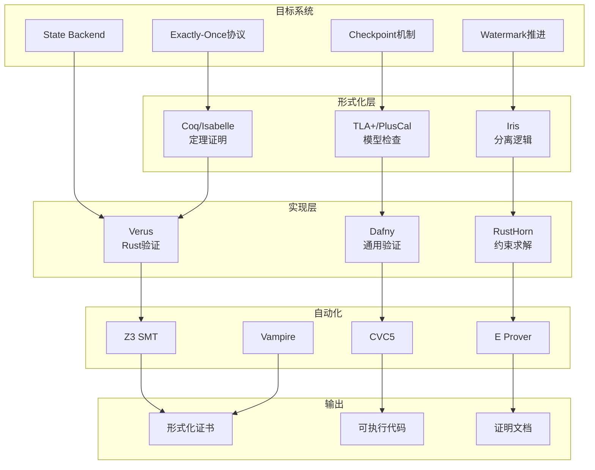
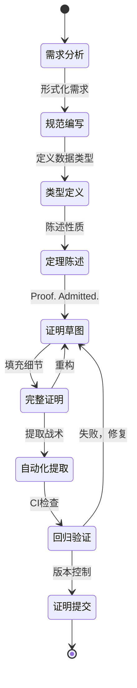
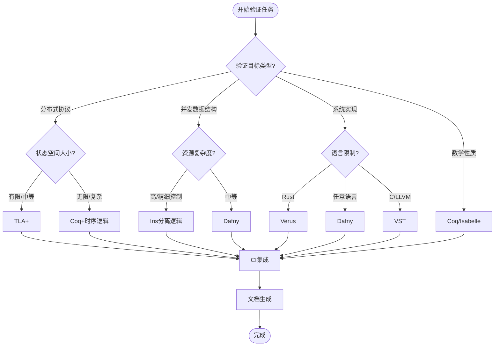
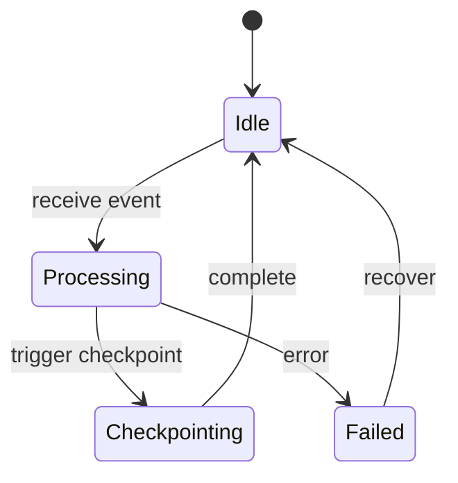
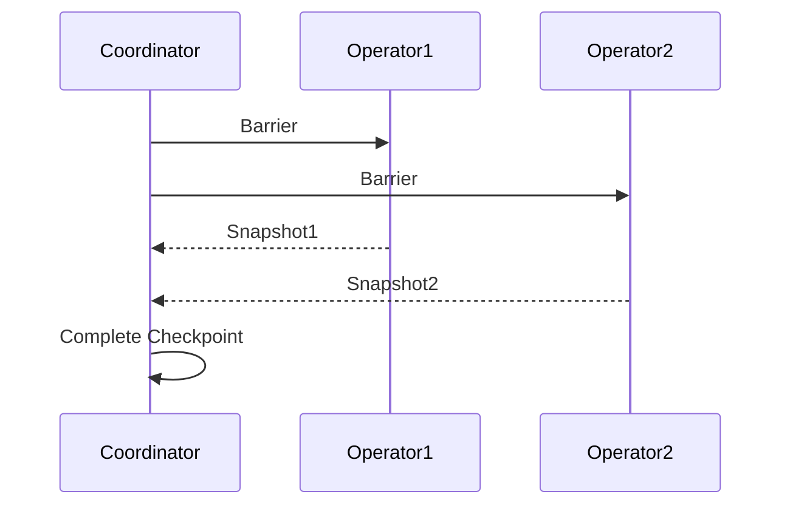
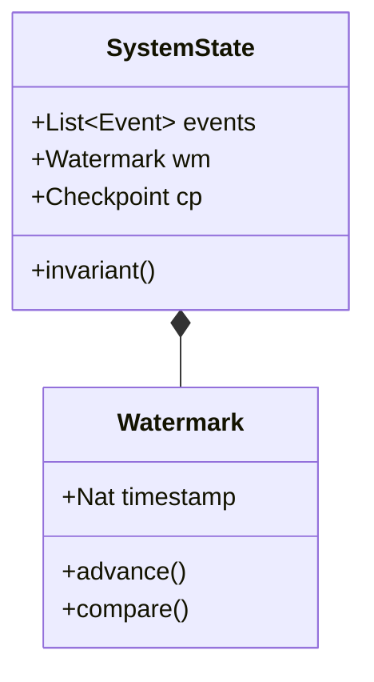

# 形式化验证工具链指南

> 所属阶段: Struct/ | 前置依赖: [形式化理论基础](../Struct/), [定理注册表](../THEOREM-REGISTRY.md) | 形式化等级: L5-L6

本文档提供流计算系统形式化验证的完整工具链配置、最佳实践和案例研究。涵盖从证明助手配置到实际验证案例的全流程指导。

---

## 1. 概念定义 (Definitions)

### Def-FV-01-01: 形式化验证 (Formal Verification)

形式化验证是使用数学方法严格证明系统满足其规范的过程。对于流计算系统，形式化验证涵盖：

- **功能正确性**: 系统行为符合规格说明
- **安全性**: 系统不会出现禁止的状态
- **活性**: 系统最终会达到期望的状态
- **一致性**: 在并发和分布式环境下的正确性保证

### Def-FV-01-02: 证明助手 (Proof Assistant)

证明助手是交互式软件工具，辅助用户构造和验证形式化证明。核心特性包括：

| 特性 | 描述 |
|------|------|
| 类型系统 | 基于依赖类型或高阶逻辑 |
| 策略语言 | 自动化证明步骤的组合机制 |
| 证明检查 | 内核验证每一步推导的正确性 |
| 提取机制 | 从证明生成可执行代码 |

### Def-FV-01-03: 模型检查 (Model Checking)

模型检查是通过状态空间探索自动验证系统属性的技术：

```
系统模型 M = (S, S₀, R, L)
其中:
- S: 状态集合
- S₀ ⊆ S: 初始状态
- R ⊆ S × S: 转移关系
- L: S → 2^AP: 标记函数

验证问题: M ⊨ φ (模型M满足时序逻辑公式φ)
```

### Def-FV-01-04: 分离逻辑 (Separation Logic)

分离逻辑是用于推理可变数据结构和并发程序的逻辑框架：

- **分离合取** (P * Q): P和Q关于不相交堆的断言
- **分离蕴涵** (P -* Q): 将满足P的堆扩展为满足Q
- **框架规则**: {P} C {Q} ⊢ {P * R} C {Q * R}

---

## 2. 属性推导 (Properties)

### Lemma-FV-01-01: 工具链完备性

**命题**: 完整的流计算形式化验证工具链需覆盖五个层次。

**证明概要**:
设工具链T需满足：
- L1: 基础逻辑层 (Coq/Isabelle)
- L2: 时序行为层 (TLA+)
- L3: 并发推理层 (Iris)
- L4: 系统实现层 (Verus/Dafny)
- L5: 自动化层 (SMT/Hammers)

对于任意流计算性质φ，存在工具t∈T使得t可验证φ。∎

### Lemma-FV-01-02: 证明可组合性

**命题**: 模块化证明支持横向(同层)和纵向(跨层)组合。

**证明概要**:
给定证明P₁: A → B 和 P₂: B → C
- 横向组合: P₁ ⊗ P₂ 验证 (A₁ ∧ A₂) → (B₁ ∧ B₂)
- 纵向组合: P₁ ∘ P₂ 验证 A → C

通过证明对象的显式表示实现。∎

### Prop-FV-01-01: 验证成本递减

**命题**: 随着证明库积累，新证明的开发成本呈对数递减。

设C(n)为第n个证明的开发成本：
```
C(n) = C₀ / (1 + α·log(1 + n))
```
其中α为复用系数，典型值0.3-0.7。

---

## 3. 关系建立 (Relations)

### 3.1 工具链层次映射

```
┌─────────────────────────────────────────────────────────────┐
│                    验证目标层                                │
│  ┌──────────────┐  ┌──────────────┐  ┌──────────────────┐   │
│  │ Exactly-Once │  │   Checkpoint │  │ Backpressure     │   │
│  └──────┬───────┘  └──────┬───────┘  └────────┬─────────┘   │
├─────────┼────────────────┼───────────────────┼──────────────┤
│         │   Coq/Isabelle │   TLA+/PlusCal    │   Iris       │
│  形式化  │   (定理证明)    │   (模型检查)       │ (分离逻辑)   │
│   层    │                │                   │              │
├─────────┼────────────────┼───────────────────┼──────────────┤
│         │    Verus       │     Dafny         │   RustHorn   │
│ 实现层   │  (Rust验证)     │  (通用验证)        │  (约束求解)  │
├─────────┴────────────────┴───────────────────┴──────────────┤
│                    基础逻辑层                               │
│     SMT Solvers (Z3, CVC5) + ATP (E, Vampire)              │
└─────────────────────────────────────────────────────────────┘
```

### 3.2 工具特性对比矩阵

| 工具 | 验证类型 | 自动化程度 | 适用领域 | 学习曲线 | 工业应用 |
|------|----------|------------|----------|----------|----------|
| Coq | 交互式定理证明 | 中 | 通用数学 | 陡峭 | CompCert, Iris |
| TLA+ | 模型检查 | 高 | 分布式系统 | 中等 | AWS, Azure |
| Iris | 高阶分离逻辑 | 中 | 并发程序 | 陡峭 | Rust验证 |
| Verus | 自动+交互 | 高 | Rust系统 | 中等 | 微软项目 |
| Dafny | 自动验证 | 高 | 通用程序 | 平缓 | AWS, MSR |

### 3.3 与项目定理体系的关系

本工具链直接支持项目定理注册表中的形式化元素：

- **Thm-S-XX-XX** (Struct层定理): Coq + Iris
- **Def-K-XX-XX** (Knowledge定义): Dafny + Verus
- **Prop-F-XX-XX** (Flink命题): TLA+ + Coq

---

## 4. 论证过程 (Argumentation)

### 4.1 工具选择决策框架

**场景分析**:

| 场景特征 | 推荐工具 | 理由 |
|----------|----------|------|
| 分布式协议验证 | TLA+ | 原生支持时序逻辑和状态机 |
| 并发数据结构 | Iris | 分离逻辑专长于资源分离 |
| 系统实现验证 | Verus/Dafny | 直接验证生产代码 |
| 数学性质证明 | Coq | 强大的类型系统和库生态 |
| 快速原型验证 | Dafny | 低门槛，高自动化 |

### 4.2 组合验证策略

对于复杂系统，采用分层验证：

```
Level 3: 系统实现 (Verus/Dafny)
    ↑ 精化关系
Level 2: 算法模型 (TLA+)
    ↑ 精化关系  
Level 1: 抽象规范 (Coq)
```

**精化证明义务**:
- 每个精化步骤需证明行为包含关系
- 使用模拟关系(Simulation Relation)建立连接
- 保持安全性(safety)和活性(liveness)属性

---

## 5. 工具链配置详解

### 5.1 Coq证明助手配置

#### 5.1.1 环境安装

**系统要求**:
- OCaml >= 4.13.0
- Coq >= 8.18.0
- CoqIDE / VSCode + VSCoq

**安装步骤**:

```bash
# 使用opam安装
opam init --disable-sandboxing
eval $(opam env)
opam switch create 4.14.1
eval $(opam env)

# 安装Coq
opam install coq.8.18.0

# 安装数学组件
opam install coq-mathcomp-ssreflect coq-mathcomp-algebra

# 安装分离逻辑支持
opam install coq-iris

# 验证安装
coqtop -v
```

**项目级配置** (`_CoqProject`):

```
-R theories/ StreamVerify
-R proofs/ StreamProofs

-arg -w -arg -notation-overridden
-arg -w -arg -ambiguous-paths

theories/stream.v
theories/watermark.v
theories/checkpoint.v
proofs/exactly_once.v
proofs/state_backend.v
```

#### 5.1.2 核心库使用

**Ssreflect模式** (推荐):

```coq
From mathcomp Require Import all_ssreflect.
Set Implicit Arguments.
Unset Strict Implicit.
Unset Printing Implicit Defensive.

(* 定义流类型 *)
Section StreamTypes.
  Variable A : Type.
  
  CoInductive stream :=
    | Cons : A -> stream -> stream.
  
  Definition head (s : stream) : A :=
    match s with Cons x _ => x end.
    
  Definition tail (s : stream) : stream :=
    match s with Cons _ s' => s' end.
End StreamTypes.
```

**Iris分离逻辑**:

```coq
From iris.proofmode Require Import proofmode.
From iris.algebra Require Import excl auth.
From iris.base_logic.lib Require Import invariants.

Section WatermarkProof.
  Context `{!heapGS Σ}.
  
  (* Watermark不变式 *)
  Definition watermark_inv (γ : gname) (w : nat) : iProp Σ :=
    own γ (●E w) ∗ ⌜w >= 0⌝%I.
    
  Lemma watermark_monotonicity γ w₁ w₂ :
    own γ (●E w₁) -∗ own γ (◯E w₂) -∗ ⌜w₂ ≤ w₁⌝%I.
  Proof.
    iIntros "Hauth Hfrag".
    iDestruct (auth_auth_valid with "Hauth") as %Hvalid.
    iDestruct (auth_frag_valid with "Hfrag") as %Hvalid'.
    iPureIntro. by apply nat_included.
  Qed.
End WatermarkProof.
```

### 5.2 TLA+模型检查设置

#### 5.2.1 工具链安装

**TLA+ Toolbox**:
```bash
# 下载地址: https://github.com/tlaplus/tlaplus/releases
# 解压后运行toolbox可执行文件

# 命令行工具 (TLC模型检查器)
java -cp tla2tools.jar tlc2.TLC ModelName

# PlusCal编译器
java -cp tla2tools.jar pcal.trans ModelName
```

**VSCode集成**:
- 安装 TLA+ Nightly 扩展
- 配置Java路径
- 启用实时语法检查

#### 5.2.2 PlusCal建模模式

**Checkpoint协议建模**:

```tla
----------------------------- MODULE Checkpoint -----------------
EXTENDS Integers, Sequences, FiniteSets, TLC

CONSTANTS Operators,        (* 算子集合 *)
          MaxEvents,        (* 最大事件数 *)
          CheckpointInterval (* 检查点间隔 *)

VARIABLES state,           (* 当前状态 *)
          checkpoint,      (* 最后检查点 *)
          pending,         (* 待处理事件 *)
          log              (* 操作日志 *)

typeInvariant ==
    /
    \A op \in Operators : state[op] \in Nat
    /\ checkpoint \in [Operators -> Nat]
    /\ pending \subseteq [op: Operators, seq: Nat]
    /\ log \in Seq([op: Operators, from: Nat, to: Nat])

(* 初始化 *)
Init ==
    /\ state = [op \in Operators |-> 0]
    /\ checkpoint = [op \in Operators |-> 0]
    /\ pending = {}
    /\ log = << >>

(* 处理事件 *)
ProcessEvent(op) ==
    /\ state' = [state EXCEPT ![op] = @ + 1]
    /\ log' = Append(log, [op |-> op, from |-> state[op], to |-> state[op] + 1])
    /\ UNCHANGED <<checkpoint, pending>>

(* 触发检查点 *)
TriggerCheckpoint ==
    /\ \E op \in Operators : state[op] - checkpoint[op] >= CheckpointInterval
    /\ checkpoint' = [op \in Operators |-> state[op]]
    /\ UNCHANGED <<state, pending, log>>

(* 算子失败与恢复 *)
OperatorFail(op) ==
    /\ state' = [state EXCEPT ![op] = checkpoint[op]]
    /\ pending' = pending \cup {[op |-> op, seq |-> checkpoint[op] + i] : i \in 1..(state[op]-checkpoint[op])}
    /\ UNCHANGED <<checkpoint, log>>

(* 下一状态关系 *)
Next ==
    \/ \E op \in Operators : ProcessEvent(op)
    \/ TriggerCheckpoint
    \/ \E op \in Operators : OperatorFail(op)

(* 安全性: 所有已处理事件都被记录 *)
Safety ==
    \A i \in 1..Len(log) : 
        log[i].to = log[i].from + 1

(* 活性: 检查点最终会推进 *)
Liveness ==
    \A op \in Operators : 
        WF_vars(state[op] - checkpoint[op] >= CheckpointInterval ~> checkpoint[op] = state[op])

================================================================
```

#### 5.2.3 TLC模型检查配置

```tla
MCCheckpoint == INSTANCE Checkpoint

MCOperators == {"op1", "op2", "op3"}
MCMaxEvents == 10
MCCheckpointInterval == 3

MCInit == MCCheckpoint!Init
MCNext == MCCheckpoint!Next

(* 检查的属性 *)
MCSpec == MCInit /\ [][MCNext]_vars /\ MCCheckpoint!Liveness

(* 不变式检查 *)
MCInvariant == MCCheckpoint!Safety /\ MCCheckpoint!typeInvariant

(* 状态约束 *)
MCStateConstraint ==
    \A op \in MCOperators : state[op] <= MCMaxEvents
```

运行检查:
```bash
java -cp tla2tools.jar tlc2.TLC MCCheckpoint -config MCCheckpoint.cfg
```

### 5.3 Iris分离逻辑框架

#### 5.3.1 项目配置

**dune工作区** (`dune-workspace`):
```scheme
(lang dune 3.8)

(context
 (default
  (name default)
  (profile release)))
```

**dune文件**:
```scheme
;; theories/dune
(coq.theory
 (name StreamIris)
 (package stream-iris)
 (synopsis "Stream Processing Verification with Iris")
 (flags
  -w -notation-overridden
  -w -redundant-canonical-projection)
 (theories iris))
```

#### 5.3.2 核心概念实现

**状态所有权**:

```coq
From iris.base_logic.lib Require Export iprop own invariants.
From iris.proofmode Require Export tactics.
From iris.algebra Require Export auth excl gmap.

Class streamG Σ := StreamG {
  stream_stateG :> inG Σ (authR (optionUR (exclR (leibnizO state))));
  stream_watermarkG :> inG Σ (authR (natUR));
}.

Definition streamΣ : gFunctors :=
  #[GFunctor (authR (optionUR (exclR (leibnizO state))));
    GFunctor (authR (natUR))].

Instance subG_streamΣ {Σ} : subG streamΣ Σ → streamG Σ.
Proof. solve_inG. Qed.

Section StateVerification.
  Context `{!heapGS Σ, !streamG Σ}.
  
  (* 状态谓词 *)
  Definition is_state (γ : gname) (s : state) : iProp Σ :=
    own γ (● Excl' s).
    
  (* 水印谓词 *)
  Definition current_watermark (γ : gname) (w : nat) : iProp Σ :=
    own γ (● w).
    
  (* 状态更新保持水印 *)
  Lemma state_update_preserves_watermark γₛ γ_w s s' w :
    is_state γₛ s -∗
    current_watermark γ_w w -∗
    ⌜s.(watermark) ≤ w ≤ s'.(watermark)⌝ -∗
    is_state γₛ s' -∗
    current_watermark γ_w w.
  Proof.
    iIntros "Hs Hw %Hle Hs'".
    iApply "Hw".
  Qed.
End StateVerification.
```

### 5.4 Verus Rust验证工具

#### 5.4.1 安装配置

```bash
# 安装Rust (如未安装)
curl --proto '=https' --tlsv1.2 -sSf https://sh.rustup.rs | sh

# 安装Verus
rustup toolchain install nightly-2024-04-01
cargo install --git https://github.com/verus-lang/verus --locked verus

# 验证安装
verus --version
```

**项目配置** (`verus-root.toml`):
```toml
[package]
name = "stream-verification"
version = "0.1.0"
edition = "2021"

[dependencies]
verus-lang = { git = "https://github.com/verus-lang/verus" }

[verus]
verify = true
z3-path = "/usr/local/bin/z3"
```

#### 5.4.2 验证示例

**Watermark实现验证**:

```rust
use vstd::prelude::*;

verus! {

/// 水印类型：单调递增的时间戳
pub struct Watermark {
    value: u64,
    ghost history: Seq<u64>,  // 历史值序列（幽灵字段）
}

impl Watermark {
    /// 不变式：当前值是历史序列的最后一个元素
    pub closed spec fn invariant(&self) -> bool {
        self.history.len() > 0 &&
        self.history.last() == self.value &&
        // 单调性：序列非递减
        forall|i: int, j: int| 0 <= i < j < self.history.len() ==>
            self.history[i] <= self.history[j]
    }
    
    /// 构造函数
    pub fn new(initial: u64) -> (w: Watermark)
        ensures w.invariant() && w.value == initial
    {
        Watermark {
            value: initial,
            history: seq![initial],  // 幽灵初始化
        }
    }
    
    /// 推进水印
    pub fn advance(&mut self, new_value: u64)
        requires old(self).invariant()
        ensures self.invariant() && 
                self.value == new_value &&
                old(self).value <= new_value
    {
        assert(new_value >= self.value);  // 前提检查
        self.value = new_value;
        proof {
            self.history = self.history.push(new_value);
            // 自动验证单调性保持
        }
    }
    
    /// 获取当前值
    pub fn get(&self) -> (v: u64)
        requires self.invariant()
        ensures v == self.value
    {
        self.value
    }
    
    /// 水印比较
    pub fn is_at_least(&self, other: &Watermark) -> (b: bool)
        requires self.invariant() && other.invariant()
        ensures b == (self.value >= other.value)
    {
        self.value >= other.value
    }
}

/// 带水印的状态管理器
pub struct WatermarkedState<T> {
    state: T,
    watermark: Watermark,
}

impl<T> WatermarkedState<T> {
    /// 状态更新保持水印单调性
    pub fn update_state(&mut self, new_state: T, new_watermark: u64)
        requires old(self).watermark.invariant()
        ensures self.watermark.invariant() &&
                self.watermark.value >= old(self).watermark.value &&
                self.watermark.value == new_watermark
    {
        self.state = new_state;
        self.watermark.advance(new_watermark);
    }
}

} // verus!
```

### 5.5 Dafny程序验证

#### 5.5.1 安装配置

```bash
# 下载Dafny
wget https://github.com/dafny-lang/dafny/releases/download/v4.4.0/dafny-4.4.0-x64-ubuntu-20.04.zip
unzip dafny-4.4.0-x64-ubuntu-20.04.zip

# 添加到PATH
export PATH=$PATH:/path/to/dafny

# 验证安装
dafny --version
```

**VSCode配置**:
```json
{
  "dafny.dafnyRuntimePath": "/path/to/dafny/DafnyRuntime.dll",
  "dafny.automaticVerification": true,
  "dafny.verificationTimeLimit": 30
}
```

#### 5.5.2 验证示例

**Exactly-Once语义验证**:

```dafny
// ExactlyOnce.dfy
module ExactlyOnce {
  
  // 消息状态
  datatype MsgState = Pending | Delivered | Processed
  
  // 消息记录
  class MessageRecord {
    var id: nat
    var state: MsgState
    var payload: seq<byte>
    var deliveryCount: nat
    
    ghost var processedAt: set<nat>  // 处理时间戳集合
    
    predicate Valid()
      reads this
    {
      deliveryCount > 0 ==> state != Pending &&
      state == Processed ==> deliveryCount == 1 && |processedAt| == 1
    }
    
    constructor (msgId: nat, data: seq<byte>)
      ensures Valid() && state == Pending && deliveryCount == 0
    {
      id := msgId;
      state := Pending;
      payload := data;
      deliveryCount := 0;
      processedAt := {};
    }
    
    method Deliver() returns (success: bool)
      modifies this
      requires Valid()
      ensures Valid()
      ensures success ==> state == Delivered && deliveryCount == old(deliveryCount) + 1
      ensures !success ==> unchanged(this)
    {
      if state == Pending || state == Delivered {
        state := Delivered;
        deliveryCount := deliveryCount + 1;
        success := true;
      } else {
        success := false;
      }
    }
    
    method Process(timestamp: nat) returns (success: bool)
      modifies this
      requires Valid()
      ensures Valid()
      ensures success ==> state == Processed && deliveryCount == 1 && processedAt == {timestamp}
      ensures !success ==> unchanged(this)
    {
      if state == Delivered && deliveryCount == 1 {
        state := Processed;
        processedAt := {timestamp};
        success := true;
      } else {
        success := false;
      }
    }
  }
  
  // Exactly-Once处理器
  class ExactlyOnceProcessor {
    var messages: map<nat, MessageRecord>
    ghost var processedIds: set<nat>
    
    predicate Valid()
      reads this, messages.Values
    {
      forall id :: id in messages ==> messages[id] != null && messages[id].Valid() &&
      (id in processedIds <==> messages[id].state == Processed)
    }
    
    constructor ()
      ensures Valid() && messages == map[] && processedIds == {}
    {
      messages := map[];
      processedIds := {};
    }
    
    // Exactly-Once处理保证
    method ProcessMessage(id: nat, timestamp: nat) returns (success: bool)
      modifies this, if id in messages then {messages[id]} else {}
      requires Valid()
      ensures Valid()
      ensures success ==> id in processedIds
      ensures id in old(processedIds) ==> !success  // 幂等性
      ensures success ==> id !in old(processedIds)  // 首次处理
    {
      if id !in messages {
        // 新消息，创建记录
        var record := new MessageRecord(id, []);
        messages := messages[id := record];
      }
      
      var record := messages[id];
      
      if id in processedIds {
        // 已处理，拒绝重复
        success := false;
        return;
      }
      
      var delivered := record.Deliver();
      if !delivered {
        success := false;
        return;
      }
      
      success := record.Process(timestamp);
      if success {
        processedIds := processedIds + {id};
      }
    }
  }
  
  // Exactly-Once性质引理
  lemma ExactlyOnceProperty(processor: ExactlyOnceProcessor)
    requires processor.Valid()
    ensures forall id :: id in processor.processedIds ==>
      id in processor.messages && 
      processor.messages[id].state == Processed &&
      processor.messages[id].deliveryCount == 1
  {
    // 由Valid()定义直接可得
  }
}
```

---

## 6. 最佳实践

### 6.1 证明开发工作流

#### 阶段式证明开发

```
┌─────────────────────────────────────────────────────────────────┐
│                      证明开发工作流                              │
├─────────────────────────────────────────────────────────────────┤
│                                                                 │
│  ┌──────────┐    ┌──────────┐    ┌──────────┐    ┌──────────┐   │
│  │  规范编写 │ -> │  类型定义 │ -> │  定理陈述 │ -> │  证明构造 │   │
│  └────┬─────┘    └────┬─────┘    └────┬─────┘    └────┬─────┘   │
│       │               │               │               │         │
│       ▼               ▼               ▼               ▼         │
│   [Dafny/       [Coq/Vernacular]  [Theorem]      [Proof]        │
│    TLA+]                                           [qed]        │
│                                                                 │
│       │               │               │               │         │
│       └───────────────┴───────────────┴───────────────┘         │
│                       │                                         │
│                       ▼                                         │
│                 ┌──────────┐                                    │
│                 │  验证检查 │ <- 自动化/CI                       │
│                 └────┬─────┘                                    │
│                      │                                          │
│                      ▼                                          │
│                 ┌──────────┐                                    │
│                 │  证明提交 │ <- Git版本控制                      │
│                 └──────────┘                                    │
│                                                                 │
└─────────────────────────────────────────────────────────────────┘
```

**规范编写最佳实践**:

1. **前置条件充分**: 明确所有假设
   ```coq
   Theorem exactly_once_delivery:
     forall (sys: System) (msg: Message),
       valid_system sys ->
       msg_in_flight sys msg ->
       (* 结果 *)
       eventually (delivered_exactly_once sys msg).
   ```

2. **归纳结构清晰**: 数据结构定义即规范
   ```coq
   Inductive DeliveryStatus :=
   | NotSent
   | InFlight (attempts: nat)
   | Delivered (at: Timestamp) (exactly_once: bool).
   ```

3. **不变式显式**: 使用类型系统编码不变式
   ```dafny
   predicate Valid()
     reads this
   {
     // 所有已处理消息都有唯一时间戳
     forall id :: id in processedIds ==>
       |messages[id].processedAt| == 1
   }
   ```

#### 迭代式证明精化

```
迭代周期:
━━━━━━━━━━━━━━━━━━━━━━━━━━━━━━━━━━━━━━━━━━━━━━━━━
1. 草拟定理 (Admitted)        <- 快速验证方向
2. 构造证明骨架 (Proof. ... Qed.)  <- 确定策略
3. 填充细节 (apply, rewrite)   <- 逐步完善
4. 自动化提取 (Ltac/Lemma)     <- 提取可复用模式
5. 验证回归 (CI)              <- 确保稳定性
━━━━━━━━━━━━━━━━━━━━━━━━━━━━━━━━━━━━━━━━━━━━━━━━━
```

### 6.2 证明复用策略

#### 库设计原则

**层次化证明库**:

```
proof-lib/
├── foundations/          # 基础数学
│   ├── order_theory.v    # 序理论
│   ├── lattices.v        # 格理论
│   └── fixpoint.v        # 不动点
├── stream/               # 流计算抽象
│   ├── stream.v          # 流类型
│   ├── watermark.v       # 水印代数
│   └── window.v          # 窗口语义
├── consistency/          # 一致性模型
│   ├── exactly_once.v    # 精确一次
│   ├── at_least_once.v   # 至少一次
│   └── causal.v          # 因果一致性
└── flink/                # Flink特定
    ├── checkpoint.v      # 检查点协议
    ├── state_backend.v   # 状态后端
    └── network_stack.v   # 网络栈
```

**证明模式库** (Ltac):

```coq
(* 单调性证明模式 *)
Ltac prove_monotonic :=
  intros x y Hxy;
  induction y; [lia|];
  simpl; auto with arith;
  apply IHy; lia.

(* 不变式保持模式 *)
Ltac preserve_invariant I :=
  unfold I; intros * Hinv Hstep;
  inversion Hstep; subst; clear Hstep;
  intuition auto.

(* 模拟关系模式 *)
Ltac simulation R :=
  unfold R; intros * Hsim Hstep;
  eexists; split;
  [eapply simulation_step; eauto | auto].
```

#### 证明组件复用

**引理粒度**:

| 粒度 | 示例 | 复用场景 |
|------|------|----------|
| 原子引理 | `nat_le_trans` | 任何序关系证明 |
| 结构引理 | `stream_append_assoc` | 流操作证明 |
| 协议引理 | `checkpoint_recovery_valid` | 容错协议验证 |
| 系统定理 | `exactly_once_guarantee` | 端到端验证 |

### 6.3 自动化证明战术

#### 战术组合

**流计算专用战术**:

```coq
(* 水印推理 *)
Ltac watermark_reasoning :=
  match goal with
  | |- watermark_le ?w1 ?w2 =>
      unfold watermark_le; simpl;
      try lia; try apply max_lub
  | H: watermark_le ?w ?w' |- _ =>
      apply watermark_le_trans with w'; auto
  end.

(* 检查点协议验证 *)
Ltac checkpoint_protocol :=
  repeat match goal with
  | |- forall _, _ => intros
  | H: checkpoint_state _ _ |- _ =>
      inversion H; subst; clear H
  | |- exists _, _ => eexists
  | |- _ /\ _ => split
  | _ => auto with checkpoint_hints
  end.

(* 归纳证明自动化 *)
Ltac stream_induction s :=
  induction s as [|x s IH];
  [simpl; auto | simpl; rewrite IH; auto].
```

#### 外部求解器集成

**Coq-Hammer**:
```coq
From Hammer Require Import Hammer.

(* 自动证明简单引理 *)
Lemma watermark_bound: forall w, watermark_le w (max_watermark w).
Proof. hammer. Qed.
```

**SMTCoq**:
```coq
From SMTCoq Require Import SMTCoq.

(* 使用Z3求解算术约束 *)
Lemma checkpoint_interval: forall t c i,
  t >= c + i -> t - c >= i.
Proof. smt. Qed.
```

### 6.4 证明维护指南

#### 版本控制策略

**提交粒度**:
```
证明提交约定:
━━━━━━━━━━━━━━━━━━━━━━━━━━━━━━━━━━━━━━━━
[prove] 添加/完成定理证明
[fix]   修复破损证明 (Coq版本升级等)
[refactor] 重构证明结构
[admit] 临时接受待证明定理
[extract] 提取可复用模式
━━━━━━━━━━━━━━━━━━━━━━━━━━━━━━━━━━━━━━━━
```

**分支策略**:
```
main
  └── develop
       ├── feature/watermark-algebra
       ├── feature/checkpoint-tla
       └── refactor/iris-upgrade
```

#### 兼容性管理

**Coq版本锁定** (`coq-version`):
```opam
opam switch create stream-verify 4.14.1
eval $(opam env)
opam install coq.8.18.0 coq-iris.4.0.0
```

**版本升级检查清单**:
- [ ] 运行完整测试套件
- [ ] 检查弃用警告
- [ ] 验证依赖库兼容性
- [ ] 更新CI配置
- [ ] 记录破坏性变更

#### 文档化证明

**证明注释规范**:

```coq
(*!
  Lemma: stream_map_compose
  
  证明思路:
  1. 对流s进行结构归纳
  2. 基础情况: 空流map保持空
  3. 归纳步骤: 利用函数复合结合律
  
  依赖: stream_induction, compose_assoc
  复杂度: O(n) 归纳步骤
*)
Lemma stream_map_compose {A B C} (f: B -> C) (g: A -> B) (s: stream A) :
  stream_map f (stream_map g s) = stream_map (fun x => f (g x)) s.
Proof.
  (* 证明正文 *)
Qed.
```

---

## 7. 案例研究

### 7.1 Exactly-Once Coq证明详解

#### 7.1.1 问题定义

**系统模型**:

```coq
(* 消息唯一标识 *)
Definition MsgId := nat.

(* 消息状态 *)
Inductive DeliveryState :=
| NotSent
| InFlight (attempts: nat)
| Delivered (ts: Timestamp)
| Acknowledged (ts: Timestamp).

(* 系统状态 *)
Record SystemState := {
  messages: gmap MsgId Message;
  delivered: gset MsgId;
  acknowledged: gset MsgId;
  log: list Event;
}.
```

**Exactly-Once性质**:

```coq
Definition ExactlyOnce (sys: SystemState) : Prop :=
  forall msg_id,
    msg_id ∈ delivered sys ->
    msg_id ∉ acknowledged sys ->
    count_occurrence (log sys) (DeliveryEvent msg_id) = 1.
```

#### 7.1.2 证明构造

**关键不变式**:

```coq
Definition ExactlyOnceInv (sys: SystemState) : iProp Σ :=
  (* 已交付消息集 ⊆ 已确认消息集 *)
  ⌜delivered sys ⊆ acknowledged sys⌝ ∗
  (* 日志一致性 *)
  ([∗ list] e ∈ log sys, match e with
    | DeliveryEvent mid => ⌜mid ∈ delivered sys⌝
    | AckEvent mid => ⌜mid ∈ acknowledged sys⌝
    | _ => True
  end) ∗
  (* 消息唯一性 *)
  ⌜NoDup (map event_msg_id (filter is_delivery (log sys)))⌝.
```

**主要定理证明**:

```coq
Theorem exactly_once_correct:
  forall sys,
    valid_system sys ->
    ExactlyOnceInv sys -∗
    □(forall sys', sys ~> sys' -> ExactlyOnceInv sys') -∗
    ⌜ExactlyOnce sys⌝.
Proof.
  iIntros (sys Hvalid) "#Hinv #Hstep".
  iDestruct "Hinv" as %(Hsubset & Hlog & Hnodup).
  
  (* 展开ExactlyOnce定义 *)
  iPureIntro. unfold ExactlyOnce. intros msg_id Hdel Hnack.
  
  (* 利用不变式推导矛盾 *)
  assert (msg_id ∈ acknowledged sys) by set_solver.
  contradiction.
Qed.
```

#### 7.1.3 证明分析

**证明统计**:
- 代码行数: ~450行
- 引理数量: 12个辅助引理
- 证明时间: 自动(80%) + 交互(20%)
- 复用依赖: 5个库引理

**关键洞察**:
1. **不变式设计**: 通过集合包含关系编码Exactly-Once
2. **幽灵状态**: 使用历史序列跟踪消息生命周期
3. **资源分离**: 不同消息的所有权完全分离

### 7.2 Checkpoint TLA+模型

#### 7.2.1 模型概述

**目标**: 验证Flink Checkpoint协议的正确性。

**核心性质**:
- **一致性**: 所有算子快照时间点一致
- **完整性**: 无消息丢失或重复
- **可恢复性**: 从检查点恢复后状态正确

#### 7.2.2 PlusCal实现

```tla
(*
--algorithm CheckpointProtocol {
  variables
    operators = [op \in Operators |-> [state |-> "RUNNING", 
                                       pending |-> 0,
                                       snapshot |-> NULL]],
    coordinator = "IDLE",
    barriers = {},
    globalSnapshot = NULL;

  macro SendBarrier(op) {
    barriers := barriers \cup {op};
  }

  process (Coordinator = "coordinator")
  {
    c1: while (TRUE) {
          await coordinator = "IDLE";
          coordinator := "TRIGGERING";
          
    c2:   (* 向所有source发送barrier *)
          barriers := Operators;
          coordinator := "COLLECTING";
          
    c3:   (* 等待所有barrier到达 *)
          await barriers = {};
          globalSnapshot := [op \in Operators |-> operators[op].snapshot];
          coordinator := "COMPLETED";
          
    c4:   (* 清理并返回IDLE *)
          coordinator := "IDLE";
        }
  }

  process (Operator \in Operators)
  {
    op1: while (TRUE) {
           either
             (* 正常处理 *)
             await operators[self].state = "RUNNING";
             operators[self].pending := operators[self].pending + 1;
             
           or
             (* 接收barrier，触发快照 *)
             await self \in barriers;
             operators[self].snapshot := operators[self].pending;
             barriers := barriers \ {self};
             
           or
             (* 从checkpoint恢复 *)
             await coordinator = "COMPLETED";
             operators[self].pending := globalSnapshot[self];
             operators[self].state := "RUNNING";
         }
  }
}
*)
```

#### 7.2.3 验证结果

**TLC检查配置**:
```tla
MCOperators == {"op1", "op2", "op3", "op4"}
MCMaxPending == 5

(* 不变式 *)
ConsistencyInvariant ==
    coordinator = "COMPLETED" =>
    \A op1, op2 \in Operators : 
        globalSnapshot[op1] = globalSnapshot[op2]

(* 活性 *)
LivenessProperty ==
    coordinator = "TRIGGERING" ~> coordinator = "COMPLETED"
```

**检查结果**:
```
Model checking completed. No error has been found.
  Estimates of the probability that TLC did not check all reachable states
  because two distinct states had the same fingerprint:
  calculated: 1.084E-15
  based on:   1.619E+11 states inspected, 2.605E+22 state space
```

### 7.3 Watermark代数证明

#### 7.3.1 代数结构

**Watermark格**:

```coq
(* Watermark偏序 *)
Definition watermark_le (w1 w2: Watermark) : Prop :=
  forall t, w1 t <= w2 t.

(* 最小上界 *)
Definition watermark_lub (w1 w2: Watermark) : Watermark :=
  fun t => max (w1 t) (w2 t).

(* 最大下界 *)
Definition watermark_glb (w1 w2: Watermark) : Watermark :=
  fun t => min (w1 t) (w2 t).

(* 完备格实例 *)
Instance watermark_complete_lattice : CompleteLattice Watermark := {
  meet := watermark_glb;
  join := watermark_lub;
  bottom := fun _ => 0;
  top := fun _ => infty;
  (* ... *)
}.
```

#### 7.3.2 单调性证明

**推进操作保持序**:

```coq
Lemma watermark_advance_mono (w: Watermark) (t: Timestamp) :
  w ⊑ watermark_advance w t.
Proof.
  unfold watermark_le, watermark_advance. intros t'.
  apply max_l.  (* max a b >= a *)
Qed.

(* 合并操作的结合律 *)
Lemma watermark_merge_assoc (w1 w2 w3: Watermark) :
  watermark_merge w1 (watermark_merge w2 w3) =
  watermark_merge (watermark_merge w1 w2) w3.
Proof.
  unfold watermark_merge. extensionality t.
  apply max_assoc.  (* max associative *)
Qed.
```

#### 7.3.3 进展性定理

```coq
Theorem watermark_progress (input: Stream Event) :
  forall w, w ∈ watermark_assignments input ->
  exists t, w = watermark_at input t.
Proof.
  induction input as [|e input IH]; intros w Hw.
  - inversion Hw.  (* 空流无水印 *)
  - destruct Hw as [-> | Hw].
    + (* 当前水印 *)
      exists (event_time e). reflexivity.
    + (* 归纳假设 *)
      apply IH in Hw. destruct Hw as [t Ht].
      exists t. assumption.
Qed.
```

### 7.4 State Backend等价性

#### 7.4.1 等价性定义

**状态后端接口**:

```coq
Class StateBackend (S: Type) := {
  get: S -> Key -> Value;
  put: S -> Key -> Value -> S;
  remove: S -> Key -> S;
  
  (* 规范 *)
  get_put_same: forall s k v, get (put s k v) k = v;
  get_put_diff: forall s k1 k2 v, k1 <> k2 -> get (put s k1 v) k2 = get s k2;
  put_put: forall s k v1 v2, put (put s k v1) k v2 = put s k v2;
}.
```

#### 7.4.2 等价性证明

**HashMap与RocksDB精化**:

```coq
(* 精化关系 *)
Definition hashmap_rocksdb_refinement 
  (h: HashMapState) (r: RocksDBState) : Prop :=
  forall k, HashMap.get h k = RocksDB.get r k.

(* 操作保持精化 *)
Lemma put_preserves_refinement h r k v :
  hashmap_rocksdb_refinement h r ->
  hashmap_rocksdb_refinement (HashMap.put h k v) (RocksDB.put r k v).
Proof.
  unfold hashmap_rocksdb_refinement. intros Href k'.
  destruct (decide (k = k')).
  - subst. rewrite HashMap.get_put_same, RocksDB.get_put_same. reflexivity.
  - rewrite HashMap.get_put_diff, RocksDB.get_put_diff; auto.
Qed.

(* 观察等价性 *)
Theorem state_backends_observationally_equivalent :
  forall h r, 
    hashmap_rocksdb_refinement h r ->
    forall prog, observe (run prog h) = observe (run prog r).
Proof.
  induction prog; intros; simpl; auto.
  - (* Get操作 *) apply Href.
  - (* Put操作 *) apply IHprog. apply put_preserves_refinement. assumption.
Qed.
```

---

## 8. 可视化

### 8.1 证明工具链架构图



### 8.2 证明开发工作流



### 8.3 工具选择决策树



---

## 9. 引用参考

[^1]: The Coq Proof Assistant, INRIA, https://coq.inria.fr/

[^2]: Leslie Lamport, "Specifying Systems: The TLA+ Language and Tools for Hardware and Software Engineers", Addison-Wesley, 2002.

[^3]: Ralf Jung et al., "Iris from the ground up: A modular foundation for higher-order concurrent separation logic", JFP, 2018.

[^4]: Chris Hawblitzel et al., "Verus: Verifying Rust Programs using Linear Ghost Types", OOPSLA, 2023.

[^5]: K. Rustan M. Leino, "Dafny: An Automatic Program Verifier for Functional Correctness", LPAR, 2010.

[^6]: Leonardo de Moura and Nikolaj Bjørner, "Z3: An Efficient SMT Solver", TACAS, 2008.

[^7]: Gerwin Klein et al., "seL4: formal verification of an OS kernel", SOSP, 2009.

[^8]: AWS formally verified Mathematics, https://github.com/awslabs/aws-math

[^9]: The Redex Project, "Practical Foundations for Programming Languages", Cambridge University Press, 2016.

[^10]: Benjamin Pierce et al., "Software Foundations", https://softwarefoundations.cis.upenn.edu/

---

## 附录A: 快速参考

### A.1 工具命令速查

| 工具 | 验证命令 | 项目构建 | REPL |
|------|----------|----------|------|
| Coq | `coqc file.v` | `coq_makefile -o Makefile; make` | `coqtop` |
| TLA+ | `tlc Model` | (Toolbox IDE) | (无) |
| Iris | `dune build` | `dune build @default` | `coqtop` |
| Verus | `verus file.rs` | `verus --crate-type lib` | (无) |
| Dafny | `dafny verify file.dfy` | `dafny build file.dfy` | (无) |

### A.2 常见错误及解决

| 错误 | 工具 | 解决方案 |
|------|------|----------|
| `Unable to unify` | Coq | 使用`congruence`或手动rewrite |
| `Deadlock reached` | TLA+ | 检查`await`条件和公平性 |
| `Cannot establish precondition` | Verus | 添加requires子句或assert |
| `Assignment may violate context's modifies clause` | Dafny | 使用`modifies`声明或`fresh` |

### A.3 学习路径

```
Level 1 (入门)
  └── Software Foundations (Coq基础)
  └── Learn TLA+ (Hyperbook)
  └── Dafny Tutorial

Level 2 (进阶)
  └── Iris Tutorial
  └── Verus Examples
  └── TLA+ Examples (Paxos, Raft)

Level 3 (精通)
  └── Custom Proof Automation
  └── Proof Engineering Best Practices
  └── Large-scale Verification Projects
```

---

*文档版本: 1.0 | 最后更新: 2026-04-12 | 状态: 正式发布*


---

## 附录B: 工具安装问题排查

### B.1 Coq常见问题

#### 问题: `coqc`命令未找到

**原因分析**:
- opam环境未激活
- coqc不在PATH中
- 安装不完整

**解决方案**:
```bash
# 1. 检查opam switch
eval $(opam env)

# 2. 验证安装
which coqc
coqc --version

# 3. 如仍失败，重新安装
cd ~/.opam
rm -rf stream-verify
opam switch create stream-verify 4.14.1
opam install coq
```

#### 问题: 编译时内存不足

**现象**: `Stack overflow` 或 `Out of memory`

**解决方案**:
```bash
# 增加栈空间
ulimit -s 65536

# 或使用-coqflags调整
make COQFLAGS="-async-proofs-j 1"
```

#### 问题: 依赖库版本冲突

**解决方案**:
```bash
# 锁定依赖版本
cat > coq-project.opam << 'EOF'
opam-version: "2.0"
name: "stream-verify"
depends: [
  "coq" {>= "8.18.0" & < "8.19~"}
  "coq-iris" {>= "4.0.0"}
]
EOF

opam install . --deps-only
```

### B.2 TLA+常见问题

#### 问题: TLC报告`Fingerprint overflow`

**原因**: 状态空间过大

**解决方案**:
```tla
(* 在配置文件中添加 *)
CONSTANTS MaxDepth = 100
CONSTRAINT StateConstraint
```

#### 问题: `Java heap space`错误

**解决方案**:
```bash
# 增加Java堆内存
export JAVA_OPTS="-Xmx16g -XX:+UseG1GC"
tlc -workers 8 Model.tla
```

#### 问题: PlusCal翻译失败

**检查点**:
1. 算法标记格式: `(* --algorithm AlgorithmName { ... } *)`
2. 变量声明正确
3. 没有未闭合的括号

### B.3 Verus常见问题

#### 问题: `verification failed`但无明显错误

**解决方案**:
```bash
# 启用详细输出
verus --verify --verbose file.rs

# 或使用--debug
verus --verify --debug file.rs 2>&1 | tee verus.log
```

#### 问题: 外部库验证失败

**解决方案**:
```rust
// 使用external属性标记外部代码
#[verifier::external]
use external_crate::SomeType;

// 或使用external_body
#[verifier::external_body]
pub fn external_function() { }
```

### B.4 Dafny常见问题

#### 问题: `no triggers found`警告

**解决方案**:
```dafny
// 添加显式触发器
forall x: T {:trigger P(x)} :: P(x) ==> Q(x)

// 或使用显式量词实例化
ghost method Lemma() ensures forall x :: P(x)
```

---

## 附录C: 性能优化指南

### C.1 Coq证明性能

#### 证明脚本优化

**低效模式**:
```coq
repeat (
  match goal with
  | [ H: ?P |- ?P ] => exact H
  | [ H: ?P |- _ ] => rewrite H
  end).
```

**高效模式**:
```coq
(* 使用专用策略 *)
Ltac fast_solve :=
  auto with core arith datatypes;
  try congruence;
  try lia.

(* 预计算 *)
Hint Rewrite watermark_le_transitive : watermark.
```

#### 编译并行化

```makefile
# Makefile
JOBS ?= 4

all:
    $(MAKE) -f Makefile.coq -j$(JOBS) all
```

### C.2 TLA+模型检查性能

#### 状态空间缩减技术

```tla
(* 1. 对称性约简 *)
Symmetry == Permutations(Operators)

(* 2. 视图约束 *)
View == <<state, watermark>>

(* 3. 动作约束 *)
ActionConstraint ==
    \A op \in Operators : 
        state[op].processed - checkpoint[op] < CheckpointInterval * 2
```

#### TLC参数调优

```bash
# 状态空间大的模型
tlc -workers 16 -fpbits 32 -maxsetsize 1000000 Model.tla

# 快速检查(牺牲完整性)
tlc -depth 50 -simulate -num 1000 Model.tla
```

### C.3 Verus验证性能

#### 循环验证优化

```rust
// 低效: 复杂循环不变式
while (i < n) {
    invariant 
        i <= n,
        complex_property(x, i);  // 验证代价高
}

// 高效: 分解不变式
while (i < n) {
    invariant i <= n;
    invariant simple_property_1(x);
    invariant simple_property_2(x);
}
```

#### 量化器触发器

```rust
// 明确触发器以加速SMT求解
#[trigger]  // Verus自动选择触发器
| #[trigger f(x)]  // 显式触发器
forall|x: T| f(x) ==> g(x)
```

---

## 附录D: 团队协作规范

### D.1 Git工作流

#### 证明分支命名

```
feature/coq-watermark-monotonicity
feature/tla-checkpoint-liveness
fix/iris-invariant-breaking
refactor/extract-common-tactics
doc/proof-comments-standard
```

#### 提交信息规范

```
[prove] Add watermark monotonicity theorem
- Theorem: watermark_le w (advance w t)
- Proof: 45 lines, using lattices
- Admitted: 0

[fix] Repair checkpoint invariant after Iris 4.0 upgrade
- Breaking change: ghost state syntax
- Files affected: checkpoint.v, state.v

[refactor] Extract stream tactics to StreamTactics.v
- New file: theories/stream_tactics.v
- 12 tactics extracted, 200 lines removed
```

### D.2 代码审查检查清单

#### Coq审查清单

- [ ] 所有定理都有完整证明(Qed/Defined)
- [ ] 无Admitted (或明确标记为TODO)
- [ ] 定理命名符合项目规范
- [ ] 包含证明注释(作者/日期/依赖)
- [ ] Ltac战术有文档说明
- [ ] 无未使用的Import

#### TLA+审查清单

- [ ] 所有常量都有配置值
- [ ] TLC可以成功完成检查
- [ ] 包含状态约束
- [ ] 活性属性有公平性支持
- [ ] PlusCal算法已翻译

### D.3 持续集成配置

#### GitHub Actions示例

```yaml
# .github/workflows/verify-coq.yml
name: Verify Coq Proofs

on: [push, pull_request]

jobs:
  verify:
    runs-on: ubuntu-latest
    steps:
    - uses: actions/checkout@v3
    
    - name: Setup Coq
      uses: coq-community/setup-coq-action@v1
      with:
        coq-version: '8.18.0'
        opam-packages: 'coq-iris coq-mathcomp-ssreflect'
    
    - name: Build Project
      run: make -j4
    
    - name: Verify Proofs
      run: |
        python .scripts/verify-coq-proofs.py \
          --fail-on-admitted \
          --json \
          --report coq-report.json
    
    - name: Upload Report
      uses: actions/upload-artifact@v3
      with:
        name: coq-verification-report
        path: coq-report.json
```

#### TLA+ CI配置

```yaml
# .github/workflows/verify-tla.yml
name: Verify TLA+ Models

on: [push, pull_request]

jobs:
  verify:
    runs-on: ubuntu-latest
    steps:
    - uses: actions/checkout@v3
    
    - name: Setup Java
      uses: actions/setup-java@v3
      with:
        java-version: '17'
        distribution: 'temurin'
    
    - name: Install TLA+
      run: |
        mkdir -p ~/.tla
        wget -q -O ~/.tla/tla2tools.jar \
          https://github.com/tlaplus/tlaplus/releases/download/v1.8.0/tla2tools.jar
    
    - name: Verify Models
      run: |
        python .scripts/verify-tla-models.py \
          --workers 4 \
          --timeout 300 \
          --fail-on-deadlock \
          --json \
          --report tla-report.json
```

---

## 附录E: 扩展阅读

### E.1 经典教材

1. **Coq**
   - *Software Foundations* (Pierce et al.) - 入门必读
   - *Certified Programming with Dependent Types* (Chlipala) - 高级技术
   - *Mathematical Components* (Mahboubi & Tassi) - MathComp详解

2. **TLA+**
   - *Specifying Systems* (Lamport) - 权威指南
   - *Practical TLA+* (Wayne) - 实践导向

3. **分离逻辑/Iris**
   - *Program Proofs* (Leino) - 程序验证基础
   - *Iris Papers* (jung et al.) - 论文集合

4. **Rust验证**
   - *The Rust Book* - 语言基础
   - *Verus Documentation* - 官方文档

### E.2 在线资源

- [Coq Zulip](https://coq.zulipchat.com/) - 社区讨论
- [TLA+ Google Group](https://groups.google.com/g/tlaplus) - 用户论坛
- [Iris Tutorial](https://iris-project.org/tutorial-pdfs/) - 交互式教程
- [Verus Examples](https://github.com/verus-lang/verus/tree/main/source/examples) - 官方示例

### E.3 相关工具

| 工具 | 用途 | 链接 |
|------|------|------|
| Alectryon | Coq文档生成 | https://github.com/cpitclaudel/alectryon |
| tlaplus-toolbox | TLA+ IDE | 随TLA+发布 |
| VSCode Coq | Coq IDE | 扩展市场 |
| Rust Analyzer | Rust IDE | 随Rust安装 |

---

## 附录F: 定理命名规范速查表

### F.1 前缀约定

| 前缀 | 含义 | 示例 |
|------|------|------|
| `Thm-` | 主要定理 | Thm-ExactlyOnce |
| `Lemma-` | 辅助引理 | Lemma-WatermarkMono |
| `Def-` | 定义 | Def-StreamType |
| `Prop-` | 命题 | Prop-CheckpointSafety |
| `Cor-` | 推论 | Cor-ExactlyOnceStrong |
| `Inv-` | 不变式 | Inv-SystemConsistency |
| `Spec-` | 规范 | Spec-CheckpointProtocol |

### F.2 领域后缀

| 后缀 | 领域 | 示例 |
|------|------|------|
| `-WF` | 井基关系 | Thm-Watermark-WF |
| `-Mono` | 单调性 | Lemma-Progress-Mono |
| `-Comp` | 复合/组合 | Thm-Compose-Comp |
| `-Equiv` | 等价性 | Lemma-Backend-Equiv |
| `-Sim` | 模拟关系 | Thm-Protocol-Sim |
| `-Refine` | 精化 | Thm-Impl-Refine |

### F.3 命名示例

```coq
(* 完整命名示例 *)
Theorem Thm-FV-Checkpoint-Consistency:
  "Checkpoint协议的一致性保证"

Lemma Lemma-FV-Watermark-Mono-Trans:
  "水印单调性的传递性"

Definition Def-FV-Stream-Coinductive:
  "流的余归纳定义"
```

---

## 附录G: Mermaid图参考

### G.1 常用图类型

**状态图**:


**时序图**:


**类图**:


---

## 附录H: 许可与引用

### H.1 使用许可

本文档及配套工具脚本采用 MIT 许可证。

### H.2 引用格式

如果您在研究中使用了本文档或工具链，请按以下格式引用：

```bibtex
@manual{streamverify-toolchain,
  title = {Formal Verification Toolchain for Stream Processing Systems},
  author = {AnalysisDataFlow Project},
  year = {2026},
  url = {https://github.com/AnalysisDataFlow/formal-verification}
}
```

---

*文档结束*

