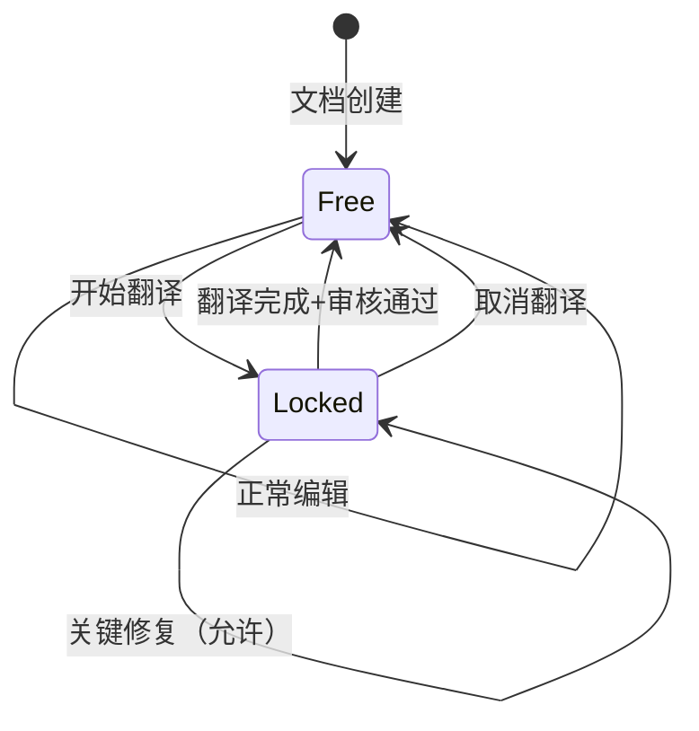
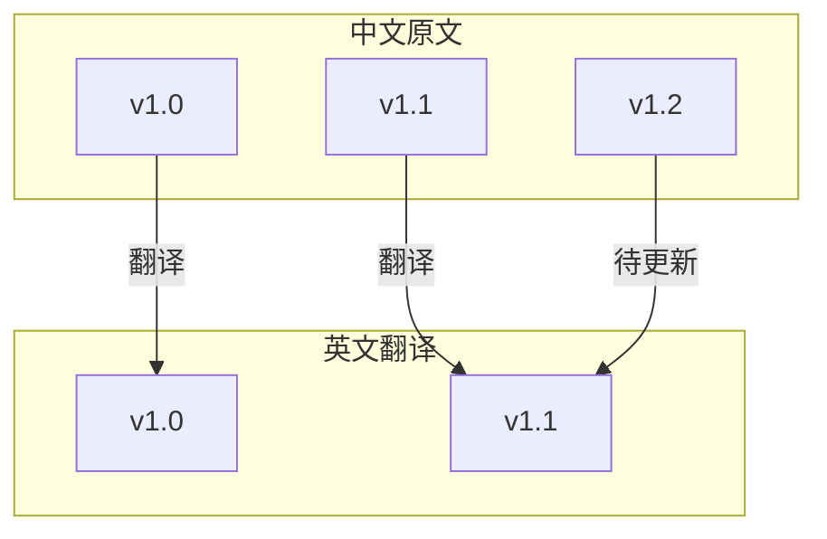
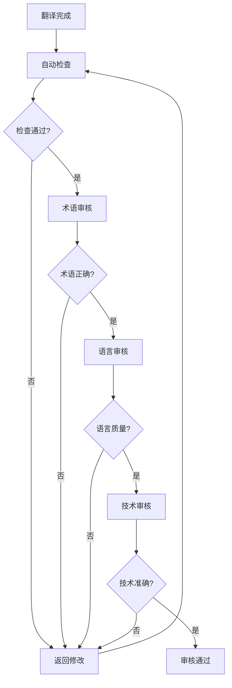
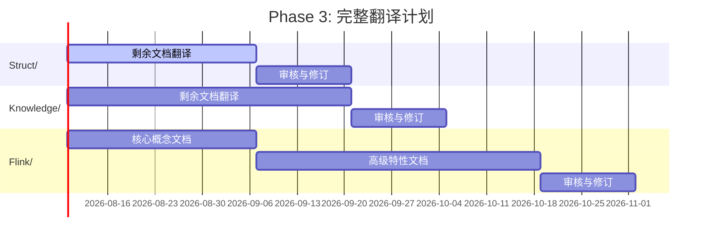

# 国际化(i18n)架构设计方案

> **版本**: v1.0 | **生效日期**: 2026-04-04 | **状态**: Design

## 1. 国际化架构设计

### 1.1 多语言内容组织方式

采用**文件级隔离**的组织策略，每种语言拥有独立的目录结构：

```
docs/i18n/i18n-content/
├── zh/                         # 中文（原文/源语言）
│   ├── Struct/                 # 形式理论文档
│   ├── Knowledge/              # 知识结构文档
│   └── Flink/                  # Flink专项文档
├── en/                         # 英文（目标语言）
│   ├── Struct/
│   ├── Knowledge/
│   └── Flink/
├── ja/                         # 日文（未来扩展）
└── ko/                         # 韩文（未来扩展）
```

**组织原则**:

| 原则 | 说明 |
|------|------|
| **源语言优先** | 中文为唯一源语言，所有翻译以此为基准 |
| **文件级对应** | 翻译文件与原文件路径完全对应 |
| **增量翻译** | 支持部分翻译，未翻译内容显示原文提示 |
| **回退机制** | 缺失翻译自动回退到源语言版本 |

### 1.2 文件命名规范

#### 1.2.1 原文文件命名

遵循项目现有规范：

```
{层号}.{序号}-{主题关键词}.md
```

示例：
- `01.01-stream-processing-fundamentals.md`
- `03.05-exactly-once-semantics.md`

#### 1.2.2 翻译文件命名

翻译文件与原文文件**同名**，通过目录区分语言：

```
i18n-content/
├── zh/Struct/01.01-stream-processing-fundamentals.md  # 原文
└── en/Struct/01.01-stream-processing-fundamentals.md  # 英文翻译
```

#### 1.2.3 元数据文件命名

```
├── glossary/
│   ├── core-terms.json           # 核心术语表
│   ├── prohibited-list.json      # 禁止翻译列表
│   └── domain-terms-{lang}.json  # 领域术语（按语言）
└── workflows/
    ├── translation-queue.json    # 待翻译队列
    ├── review-queue.json         # 审核队列
    └── version-lock.json         # 版本锁定记录
```

### 1.3 目录结构建议

完整的国际化目录结构：

```
docs/i18n/
├── ARCHITECTURE.md               # 本架构文档
├── README.md                     # i18n模块使用指南
├── i18n-content/                 # 多语言内容目录
│   ├── zh/                       # 中文（源语言）
│   │   ├── Struct/
│   │   ├── Knowledge/
│   │   └── Flink/
│   ├── en/                       # 英文
│   │   ├── Struct/
│   │   ├── Knowledge/
│   │   └── Flink/
│   └── ...                       # 其他语言
├── glossary/                     # 术语管理
│   ├── core-terms.json
│   ├── prohibited-list.json
│   └── domain-terms-en.json
├── workflows/                    # 工作流状态
│   ├── translation-queue.json
│   ├── review-queue.json
│   └── version-lock.json
├── templates/                    # 翻译模板
│   ├── translation-template.md
│   └── review-checklist.md
└── config/                       # 配置文件
    ├── i18n-config.yaml
    └── languages.json
```

## 2. 翻译工作流

### 2.1 原文锁定机制

当文档进入翻译流程时，原文进入**锁定状态**，防止修改导致版本不一致。

#### 2.1.1 锁定规则

```yaml
lock_rules:
  auto_lock_on_translate: true      # 开始翻译时自动锁定
  lock_scope: "file"                # 锁定范围：文件级
  allow_critical_fixes: true        # 允许关键修复
  critical_fix_categories:
    - "factual_error"               # 事实错误
    - "broken_link"                 # 失效链接
    - "code_error"                  # 代码错误
  lock_duration_max: "30d"          # 最长锁定时间
```

#### 2.1.2 版本锁定记录格式

```json
{
  "locks": [
    {
      "file": "Struct/01.01-stream-processing-fundamentals.md",
      "locked_at": "2026-04-04T15:26:26Z",
      "locked_by": "translator-en-001",
      "target_language": "en",
      "source_version": "abc123def456",
      "expected_completion": "2026-04-14T15:26:26Z",
      "status": "active"
    }
  ]
}
```

#### 2.1.3 锁定状态可视化



### 2.2 翻译标记系统

#### 2.2.1 文档级标记

在翻译文件头部添加元数据：

```markdown
---
translation_status: "in_progress"  # not_started | in_progress | pending_review | completed
source_version: "abc123def456"
translator: "translator-en-001"
reviewer: null
translated_at: null
reviewed_at: null
completion_percentage: 45
---

# Stream Processing Fundamentals
```

#### 2.2.2 段落级标记

对于部分翻译的文档，使用标记标注状态：

```markdown
<!-- TRANSLATION_STATUS: pending -->
## 1. 概念定义

This section is still being translated.

<!-- TRANSLATION_STATUS: completed -->
## 2. 核心原理

The core principles of stream processing...
```

#### 2.2.3 术语标记

```markdown
<!-- TERM: checkpoint | 检查点 -->
A checkpoint is a consistent snapshot of the system state.
```

### 2.3 版本同步策略

#### 2.3.1 版本追踪



#### 2.3.2 变更检测机制

```yaml
version_sync:
  hash_algorithm: "sha256"
  track_sections: true
  change_types:
    - "major": "结构性变更，需重新翻译"
    - "minor": "内容更新，需增量翻译"
    - "patch": "修正错误，需术语同步"
  sync_interval: "daily"
  notification_channels:
    - "email"
    - "slack"
```

#### 2.3.3 版本对比算法

```python
# 伪代码示意
def detect_changes(source_file, target_meta):
    current_hash = compute_hash(source_file)
    last_hash = target_meta['source_version']
    
    if current_hash == last_hash:
        return "no_change"
    
    diff = compute_diff(last_hash, current_hash)
    
    if diff.has_structure_changes():
        return "major_update_required"
    elif diff.has_content_additions():
        return "minor_update_required"
    else:
        return "patch_update_required"
```

### 2.4 审核流程

#### 2.4.1 多级审核体系



#### 2.4.2 审核检查清单

```markdown
## 审核检查清单

### 术语审核
- [ ] 核心术语符合术语表规范
- [ ] 专有名词处理正确
- [ ] 缩写首次出现有全称
- [ ] 禁止翻译列表项目未翻译

### 语言审核
- [ ] 语法正确，无错别字
- [ ] 句式符合目标语言习惯
- [ ] 专业表达准确
- [ ] 标点符号使用正确

### 技术审核
- [ ] 代码示例正确
- [ ] 公式/符号准确
- [ ] 引用链接有效
- [ ] 图表标注正确
```

## 3. 术语管理系统

### 3.1 核心术语表（中英对照）

#### 3.1.1 流计算基础术语

| 中文术语 | 英文术语 | 缩写 | 定义 |
|---------|---------|------|------|
| 流处理 | Stream Processing | SP | 对无界数据流进行实时计算的模式 |
| 批处理 | Batch Processing | BP | 对有界数据集进行离线计算的模式 |
| 检查点 | Checkpoint | CP | 分布式系统的全局一致性快照 |
| 水印 | Watermark | WM | 表示事件时间进展的时间戳标记 |
| 窗口 | Window | - | 将流数据切分为有界集合的逻辑边界 |
| 恰好一次 | Exactly-Once | EO | 每条记录被处理且仅被处理一次的语义 |
| 至少一次 | At-Least-Once | ALO | 每条记录至少被处理一次的语义 |
| 最多一次 | At-Most-Once | AMO | 每条记录最多被处理一次的语义 |
| 背压 | Backpressure | BP | 消费者向生产者反馈处理能力的机制 |
| 状态管理 | State Management | - | 流计算中有状态算子的状态维护 |
| 事件时间 | Event Time | - | 数据产生的时间戳 |
| 处理时间 | Processing Time | - | 数据被处理的时间戳 |
| 摄取时间 | Ingestion Time | - | 数据进入系统的时间戳 |

#### 3.1.2 Actor/CSP 术语

| 中文术语 | 英文术语 | 缩写 | 定义 |
|---------|---------|------|------|
| Actor 模型 | Actor Model | - | 基于消息传递的并发计算模型 |
| 通信顺序进程 | Communicating Sequential Processes | CSP | Hoare 提出的并发形式化语言 |
| 消息传递 | Message Passing | - | 进程间通过发送/接收消息通信的方式 |
| 共享内存 | Shared Memory | - | 进程通过共享内存区域通信的方式 |
| 信道 | Channel | - | CSP 中进程间通信的管道 |
| 守卫命令 | Guarded Command | - | Dijkstra 提出的条件执行结构 |

#### 3.1.3 形式化方法术语

| 中文术语 | 英文术语 | 缩写 | 定义 |
|---------|---------|------|------|
| 进程演算 | Process Calculus | - | 描述并发进程行为的形式化语言 |
| 双模拟 | Bisimulation | - | 验证进程等价关系的方法 |
| 迹等价 | Trace Equivalence | - | 基于可观测行为的等价关系 |
| 类型系统 | Type System | - | 为程序赋予类型以确保正确性的规则集 |
| 会话类型 | Session Types | - | 描述通信协议的类型系统 |

### 3.2 术语一致性检查

#### 3.2.1 自动化检查规则

```yaml
term_consistency:
  case_sensitive: false
  check_variants: true
  allowed_variants:
    "流处理": ["Stream Processing", "streaming processing"]
    "检查点": ["Checkpoint", "checkpoint"]
  forbidden_mix:
    - ["Stream Processing", "流处理", "数据流处理"]  # 禁止混用
  context_rules:
    - term: "Actor"
      context: "首字母大写表示模型，小写表示实现"
```

#### 3.2.2 术语检查报告示例

```json
{
  "file": "en/Struct/01.01-stream-processing.md",
  "issues": [
    {
      "line": 45,
      "type": "term_mismatch",
      "severity": "error",
      "message": "术语不一致: 使用 'data stream processing'，应为 'Stream Processing'",
      "suggestion": "Stream Processing"
    },
    {
      "line": 67,
      "type": "case_issue",
      "severity": "warning",
      "message": "大小写不一致: 'checkpoint' 应为 'Checkpoint'（句首）",
      "suggestion": "Checkpoint"
    }
  ]
}
```

### 3.3 禁止翻译列表

以下术语在任何情况下**保持原文**，不进行翻译：

#### 3.3.1 技术产品名

```json
{
  "prohibited_terms": {
    "products": [
      "Apache Flink", "Apache Kafka", "Apache Spark",
      "Akka", "Pekko", "Temporal",
      "Kubernetes", "Docker", "Prometheus"
    ],
    "programming_languages": [
      "Java", "Scala", "Python", "Go", "Rust",
      "JavaScript", "TypeScript"
    ],
    "api_methods": [
      "map", "flatMap", "filter", "reduce", "keyBy",
      "window", "trigger", "evictor"
    ],
    "configuration_keys": [
      "execution.checkpointing.interval",
      "parallelism.default",
      "state.backend"
    ]
  }
}
```

#### 3.3.2 代码相关

```json
{
  "prohibited_in_context": {
    "code_blocks": "所有代码块内的标识符",
    "inline_code": "行内代码的所有内容",
    "file_paths": "文件路径和扩展名",
    "environment_variables": "环境变量名",
    "cli_commands": "命令行命令和参数"
  }
}
```

### 3.4 专有名词处理

#### 3.4.1 人名处理

| 规则 | 示例 |
|------|------|
| 学术论文作者保留原名 | "T. Akidau et al. proposed..." |
| 首次出现可附加中文 | "Martin Kleppmann（马丁·克莱普曼）" |
| 后续直接使用原名 | "Kleppmann argues that..." |

#### 3.4.2 机构名处理

| 类型 | 处理方式 | 示例 |
|------|---------|------|
| 国际会议 | 英文全称+缩写 | "International Conference on Very Large Data Bases (VLDB)" |
| 学术期刊 | 英文全称 | "Communications of the ACM" |
| 大学 | 英文原名 | "Stanford University", "MIT" |

#### 3.4.3 论文/书籍标题处理

```markdown
<!-- 引用格式 -->
Akidau et al., "The Dataflow Model", PVLDB, 2015.
Kleppmann, *Designing Data-Intensive Applications*, O'Reilly, 2017.
```

## 4. 自动化工具

### 4.1 工具架构

自动化工具采用 Python 脚本实现，位于 `.scripts/i18n-manager.py`：

```
.scripts/i18n-manager.py
├── 命令行接口 (CLI)
├── 内容提取模块
├── 翻译管理模块
├── 质量检查模块
├── 报告生成模块
└── 配置管理模块
```

### 4.2 功能模块

#### 4.2.1 提取待翻译内容

```bash
# 提取特定目录的待翻译内容
python .scripts/i18n-manager.py extract --source Struct/ --lang en

# 输出示例：
# - 生成 i18n-content/en/Struct/translation-package.json
# - 包含：原文、源版本哈希、术语提示
```

#### 4.2.2 翻译进度统计

```bash
# 查看整体进度
python .scripts/i18n-manager.py stats

# 输出示例：
# =========================================
# Translation Progress Report
# =========================================
# Language: en (English)
# -----------------------------------------
# Struct/:     15/43  documents (34.9%)
# Knowledge/:  32/70  documents (45.7%)
# Flink/:      58/130 documents (44.6%)
# -----------------------------------------
# Overall:     105/243 documents (43.2%)
# =========================================
```

#### 4.2.3 缺失翻译检测

```bash
# 检测缺失翻译
python .scripts/i18n-manager.py check-missing --lang en

# 输出：
# Missing translations in en/:
# - Struct/03.05-exactly-once-semantics.md (not started)
# - Knowledge/02.10-windowing-patterns.md (incomplete - 30%)
# - Flink/04.15-ai-agents-integration.md (outdated - source changed)
```

#### 4.2.4 格式一致性检查

```bash
# 检查格式一致性
python .scripts/i18n-manager.py check-format --file en/Struct/01.01-stream-processing.md

# 检查项：
# - Markdown 语法正确性
# - 标题层级一致性
# - 代码块语言标签
# - 链接有效性
# - 图片引用
```

### 4.3 工具配置

```yaml
# docs/i18n/config/i18n-config.yaml
i18n:
  source_language: "zh"
  target_languages: ["en", "ja", "ko"]
  
  paths:
    content_root: "docs/i18n/i18n-content"
    glossary_dir: "docs/i18n/glossary"
    workflow_dir: "docs/i18n/workflows"
  
  source_dirs:
    - "Struct"
    - "Knowledge"
    - "Flink"
  
  extraction:
    skip_patterns:
      - "*.draft.md"
      - "*.archived.md"
    include_frontmatter: true
    preserve_mermaid: true
  
  quality:
    term_check: true
    format_check: true
    link_check: true
    min_completion_threshold: 95
  
  notifications:
    on_translation_complete: true
    on_review_required: true
    channels:
      - "console"
      - "file"
```

## 5. 输出格式

### 5.1 静态站点生成器支持

#### 5.1.1 MkDocs 配置

```yaml
# mkdocs.yml
site_name: AnalysisDataFlow
plugins:
  - i18n:
      languages:
        - locale: zh
          name: 中文
          default: true
        - locale: en
          name: English
        - locale: ja
          name: 日本語
      
      # 内容目录映射
      docs_structure: folder
      
      # 语言切换配置
      alternate:
        - name: 中文
          link: ./zh/
          lang: zh
        - name: English
          link: ./en/
          lang: en
```

#### 5.1.2 Docusaurus 配置

```javascript
// docusaurus.config.js
module.exports = {
  i18n: {
    defaultLocale: 'zh',
    locales: ['zh', 'en', 'ja'],
    localeConfigs: {
      zh: {
        label: '中文',
        direction: 'ltr',
      },
      en: {
        label: 'English',
        direction: 'ltr',
      },
    },
  },
};
```

### 5.2 多语言导航

#### 5.2.1 导航结构

```yaml
# 多语言导航配置
nav:
  zh:
    - 首页: index.md
    - 形式理论:
      - 流计算基础: Struct/01.01-stream-processing.md
      - Actor模型: Struct/02.01-actor-model.md
    - 知识结构:
      - 设计模式: Knowledge/01.01-design-patterns.md
  
  en:
    - Home: index.md
    - Formal Theory:
      - Stream Processing Basics: Struct/01.01-stream-processing.md
      - Actor Model: Struct/02.01-actor-model.md
    - Knowledge:
      - Design Patterns: Knowledge/01.01-design-patterns.md
```

#### 5.2.2 自动导航生成

```python
# 从源语言导航自动生成分语言导航
def generate_multilingual_nav(source_nav, target_lang):
    """
    根据源语言导航结构，为目标语言生成对应导航
    未翻译的页面使用特殊标记
    """
    target_nav = {}
    for section, items in source_nav.items():
        target_nav[section] = []
        for item in items:
            target_item = {
                'title': translate_or_mark(item['title'], target_lang),
                'path': item['path'],
                'status': get_translation_status(item['path'], target_lang)
            }
            target_nav[section].append(target_item)
    return target_nav
```

### 5.3 语言切换UI

#### 5.3.1 语言选择器设计

```html
<!-- 语言切换组件 -->
<div class="language-selector">
  <button class="lang-current">
    <span class="lang-flag">🇨🇳</span>
    <span class="lang-name">中文</span>
  </button>
  <ul class="lang-dropdown">
    <li class="lang-item active">
      <a href="/zh/struct/stream-processing">
        <span class="lang-flag">🇨🇳</span> 中文
        <span class="lang-status">100%</span>
      </a>
    </li>
    <li class="lang-item">
      <a href="/en/struct/stream-processing">
        <span class="lang-flag">🇬🇧</span> English
        <span class="lang-status">45%</span>
      </a>
    </li>
    <li class="lang-item disabled">
      <span class="lang-flag">🇯🇵</span> 日本語
      <span class="lang-status">Planned</span>
    </li>
  </ul>
</div>
```

#### 5.3.2 智能语言重定向

```javascript
// 根据用户偏好自动选择语言
function detectPreferredLanguage() {
    // 1. 检查 URL 参数
    const urlLang = new URLSearchParams(window.location.search).get('lang');
    if (urlLang) return urlLang;
    
    // 2. 检查本地存储
    const storedLang = localStorage.getItem('preferred-language');
    if (storedLang) return storedLang;
    
    // 3. 检查浏览器语言
    const browserLang = navigator.language.split('-')[0];
    if (supportedLanguages.includes(browserLang)) {
        return browserLang;
    }
    
    // 4. 默认语言
    return 'zh';
}
```

## 6. 分阶段实施计划

### 6.1 Phase 1: 术语表 (Week 1-2)

**目标**: 建立完整的术语管理体系

| 任务 | 负责人 | 工期 | 产出物 |
|------|--------|------|--------|
| 整理核心术语表 | Content Team | 3天 | glossary/core-terms.json |
| 建立禁止翻译列表 | Tech Lead | 2天 | glossary/prohibited-list.json |
| 制定术语审核规范 | QA Team | 2天 | workflows/term-review-guide.md |
| 术语工具集成 | Dev Team | 3天 | i18n-manager.py term-check |

**验收标准**:
- [ ] 术语表覆盖 100% 核心技术术语
- [ ] 自动化术语检查可用
- [ ] 术语一致性错误检出率 > 95%

### 6.2 Phase 2: 核心文档 (Week 3-8)

**目标**: 完成 20% 核心文档的英文翻译

| 阶段 | 任务 | 工期 | 产出 |
|------|------|------|------|
| Week 3-4 | 翻译基础设施搭建 | 2周 | 完整的工作流系统 |
| Week 5-6 | Struct/ 核心文档 | 2周 | 10篇形式理论文档 |
| Week 7-8 | Knowledge/ 核心文档 | 2周 | 15篇知识结构文档 |

**优先级排序**:
1. 高优先级：README, QUICK-START, ARCHITECTURE
2. 中优先级：核心理论文档（流处理基础、Actor模型）
3. 低优先级：进阶专题、案例分析

**验收标准**:
- [ ] 至少 25 篇文档翻译完成
- [ ] 翻译质量通过三级审核
- [ ] 用户反馈满意度 > 80%

### 6.3 Phase 3: 完整翻译 (Month 3-6)

**目标**: 完成 100% 文档的英文翻译



**里程碑**:

| 里程碑 | 日期 | 目标 |
|--------|------|------|
| M1 | Month 3 | Struct/ 100% 翻译完成 |
| M2 | Month 4 | Knowledge/ 100% 翻译完成 |
| M3 | Month 5 | Flink/ 核心文档完成 |
| M4 | Month 6 | 全部文档翻译+审核完成 |

**验收标准**:
- [ ] 所有文档英文版可用
- [ ] 翻译覆盖率 100%
- [ ] 审核通过率 100%
- [ ] 无 P0/P1 级翻译质量问题

---

## 7. 附录

### 7.1 参考资源

- [W3C Internationalization](https://www.w3.org/standards/webdesign/i18n)
- [Mozilla i18n Guide](https://developer.mozilla.org/en-US/docs/Mozilla/Add-ons/WebExtensions/Internationalization)
- [Fluent Project](https://projectfluent.org/) - Mozilla 的本地化框架

### 7.2 工具链

| 工具 | 用途 | 链接 |
|------|------|------|
| i18n-manager.py | 翻译管理 | 本项目 |
| mdspell | Markdown 拼写检查 | npm package |
| markdown-link-check | 链接检查 | npm package |

### 7.3 版本历史

| 版本 | 日期 | 变更 |
|------|------|------|
| v1.0 | 2026-04-04 | 初始版本 |
