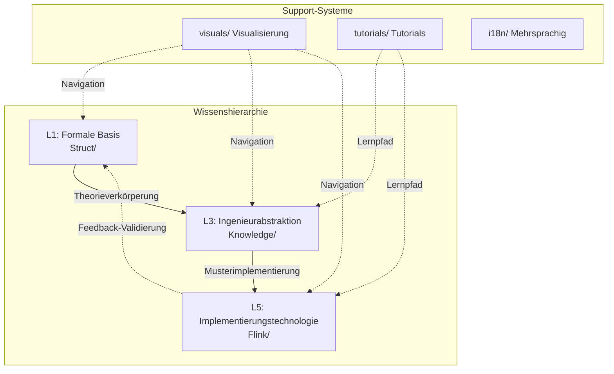
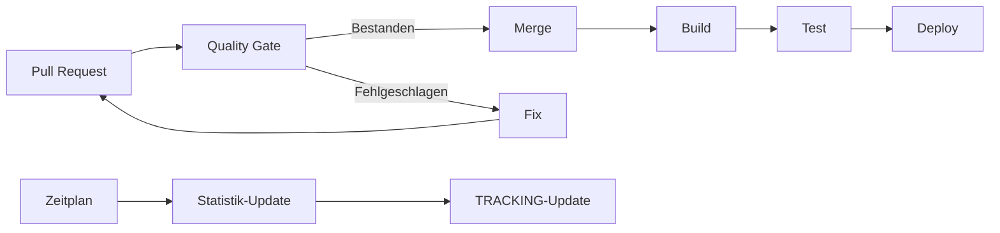

# AnalysisDataFlow Architektur

> **Projekttechnische Architektur und Navigationssystem**
>
> 📐 Dokumentenstruktur | 🔄 Workflows | 🧭 Navigationsstrategie

---

## 1. Übersicht der Projektarchitektur

### 1.1 Kernarchitektur



### 1.2 Navigationsdesign-Prinzipien

| Prinzip | Beschreibung | Implementierung |
|---------|--------------|-----------------|
| **Hierarchische Navigation** | Unterstützt Top-Down-Navigation | Hierarchische Dokumentenstruktur |
| **Verwandte Links** | Unterstützt horizontale Navigation | Querverweis-Links |
| **Visuelle Navigation** | Intuitive Inhaltsexploration | Mermaid-Diagramme, Navigationskarten |
| **Mehrsprachige Unterstützung** | Unterstützung globaler Benutzer | i18n-Dokumentenstruktur |

---

## 2. Detaillierte Dokumentenstruktur

### 2.1 Namenskonventionen

```
{Ebenennummer}.{Sequenznummer}-{Beschreibender Name}.md
```

Beispiel: `01.02-process-calculus-primer.md`

- `01` - Ebene 1 (Grundlagentheorie)
- `02` - 2. Dokument in der Ebene
- `process-calculus-primer` - Beschreibender Name

### 2.2 Verzeichnisstruktur

```
docs/
├── i18n/                     # Mehrsprachige Unterstützung
│   ├── en/                   # Englisch
│   ├── ja/                   # Japanisch
│   ├── de/                   # Deutsch
│   └── fr/                   # Französisch
├── contributing/             # Beitragsleitfäden
├── certification/            # Zertifizierungsbezogen
└── knowledge-graph/          # Wissensgraph

Struct/                       # Formale Theorie
├── 00-INDEX.md
├── 01-foundation/           # Grundlagentheorie
├── 02-properties/           # Eigenschaftsableitung
├── 03-relationships/        # Beziehungsaufbau
├── 04-proofs/               # Formale Beweise
└── 05-comparative/          # Vergleichende Analyse

Knowledge/                    # Ingenieurpraxis
├── 00-INDEX.md
├── 01-concept-atlas/        # Konzeptatlas
├── 02-design-patterns/      # Designmuster
├── 03-business-patterns/    # Geschäftsmuster
├── 04-technology-selection/ # Technologieauswahl
└── 06-frontier/             # Cutting-Edge-Technologie

Flink/                        # Flink-Technologie
├── 00-INDEX.md
├── 01-concepts/             # Grundkonzepte
├── 02-core/                 # Kernmechanismen
├── 03-api/                  # API und SQL
└── 08-roadmap/              # Roadmap
```

---

## 3. CI/CD-Architektur

### 3.1 Workflow-Übersicht



### 3.2 Quality Gate Prüfungen

| Prüfung | Tool | Auslöser |
|---------|------|----------|
| Querverweis-Prüfung | cross-ref-checker-v2.py | PR-Erstellung/Update |
| Sechs-Abschnitt-Validierung | six-section-validator.py | PR-Erstellung/Update |
| Mermaid-Syntax | mermaid-syntax-checker.py | PR-Erstellung/Update |
| Formale Elemente | formal-element-auto-number.py | PR-Erstellung/Update |
| Link-Prüfung | link_checker.py | Geplante Ausführung |

---

## 4. Navigationssystem

### 4.1 Arten der Navigation

1. **Hierarchische Navigation**: Basierend auf Eltern-Kind-Beziehungen
2. **Themennavigation**: Basierend auf Themen
3. **Visuelle Navigation**: Basierend auf Graphen und Karten
4. **Suchnavigation**: Basierend auf Schlüsselwörtern

### 4.2 Navigationsindex

- [NAVIGATION-INDEX.md](../../NAVIGATION-INDEX.md) - Vollständiger Navigationsindex
- [knowledge-graph.html](../../knowledge-graph.html) - Interaktiver Wissensgraph
- [QUICK-START.md](QUICK-START-de.md) - Schnellstartanleitung

---

*Letzte Aktualisierung: 2026-04-11 | Deutsche Übersetzung abgeschlossen*
