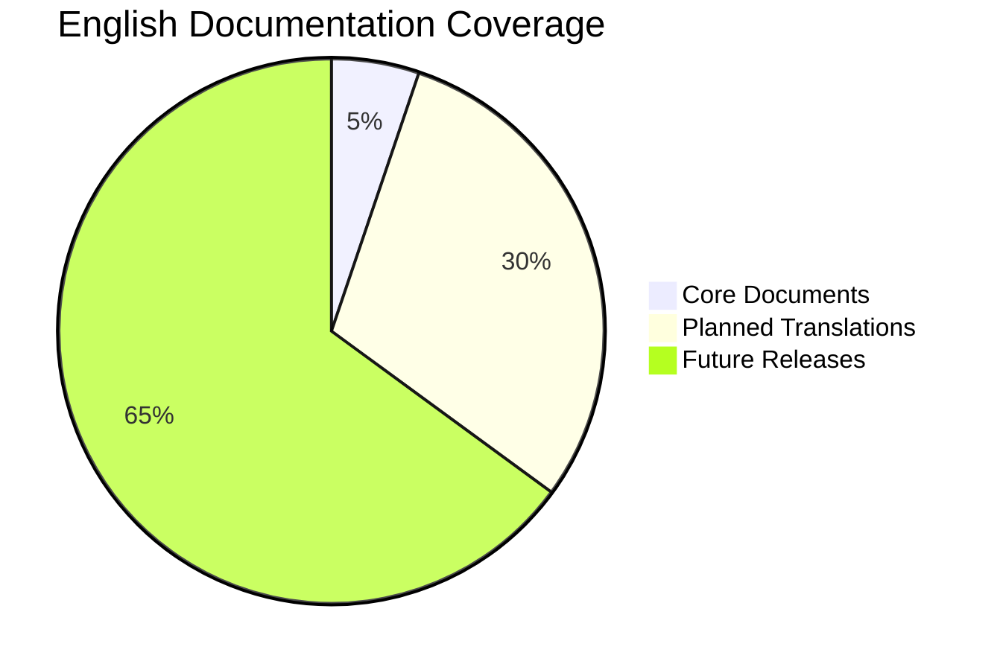

# English Documentation Index

> **Document Position**: English Content Navigation Hub | **Version**: 2026.04 | **Status**: Active

---

## Overview

Welcome to the English documentation hub for **AnalysisDataFlow** - a comprehensive knowledge base for stream computing theory and practice.

**Current Status**: 8 core English documents available, with ongoing expansion planned.

---

## Quick Navigation

### Core English Documents

| Document | Description | Chinese Equivalent |
|----------|-------------|-------------------|
| [README.md](./README.md) | Project overview and introduction | [./README.md](./README.md) |
| [QUICK-START.md](./QUICK-START.md) | Quick start guide for new users | [./QUICK-START.md](./QUICK-START.md) |
| [ARCHITECTURE.md](./ARCHITECTURE.md) | System architecture overview | [./ARCHITECTURE.md](./ARCHITECTURE.md) |
| [GLOSSARY.md](./GLOSSARY.md) | Technical terminology glossary | [./GLOSSARY.md](./GLOSSARY.md) |
| [LEARNING-PATH-GUIDE.md](./LEARNING-PATH-GUIDE.md) | Learning path navigation guide | [./LEARNING-PATH-GUIDE.md](./LEARNING-PATH-GUIDE.md) |
| [TROUBLESHOOTING.md](./TROUBLESHOOTING.md) | Stream computing troubleshooting manual | [./TROUBLESHOOTING.md](./TROUBLESHOOTING.md) |
| [OBSERVABILITY-GUIDE.md](./OBSERVABILITY-GUIDE.md) | Stream processing observability guide | [./OBSERVABILITY-GUIDE.md](./OBSERVABILITY-GUIDE.md) |
| [KNOWLEDGE-GRAPH-GUIDE.md](./KNOWLEDGE-GRAPH-GUIDE.md) | Knowledge graph guide | [./KNOWLEDGE-GRAPH-GUIDE.md](./KNOWLEDGE-GRAPH-GUIDE.md) |

### Directory-Specific Indexes

| Index | Description | Content Count |
|-------|-------------|---------------|
| [STRUCT-INDEX.md](./STRUCT-INDEX.md) | Struct/ formal theory navigation | 43 documents |
| [KNOWLEDGE-INDEX.md](./KNOWLEDGE-INDEX.md) | Knowledge/ engineering practice navigation | 128+ documents |
| [FLINK-INDEX.md](./FLINK-INDEX.md) | Flink/ technology navigation | 178+ documents |

---

## Content Coverage

### Translation Status



### Priority Levels

| Priority | Content Type | Status |
|----------|-------------|--------|
| P0 | Core documentation (README, Quick Start) | ✅ Complete |
| P1 | Architecture and glossary | ✅ Complete |
| P2 | Key theoretical foundations | 🔄 Planned |
| P3 | Design patterns and best practices | 📋 Backlog |
| P4 | Flink-specific guides | 📋 Backlog |

---

## Language Switching

All English documents include navigation links to their Chinese counterparts at the top of each page.

**Switch to Chinese**: Use the language badge at the top of any English document:

```markdown
[](../README.md)
```

---

## Contributing to Translations

We welcome contributions to expand our English documentation. See [CONTRIBUTING-EN.md](../CONTRIBUTING-EN.md) for guidelines.

### Translation Priorities

1. **High Priority**: Core concepts, fundamental theories
2. **Medium Priority**: Design patterns, best practices
3. **Lower Priority**: Case studies, advanced topics

---

## Document Structure

Each English document follows the same six-section template as Chinese documents:

1. **Definitions** - Formal concept definitions
2. **Properties** - Derived lemmas and properties
3. **Relations** - Connections to other concepts
4. **Argumentation** - Supporting analysis
5. **Proof / Engineering Argument** - Complete proofs
6. **Examples** - Practical examples and code
7. **Visualizations** - Mermaid diagrams
8. **References** - Authoritative citations

---

## Roadmap

See [I18N-ROADMAP.md](../I18N-ROADMAP.md) for detailed internationalization plans.

---

## Statistics

| Metric | Count |
|--------|-------|
| English Documents | 8 |
| Total Chinese Documents | 940+ |
| Translation Coverage | ~0.6% |
| Target Coverage (2026) | 10% |

---

*Last updated: 2026-04-14 | Version: v4.1*
