# Struct/ Formal Theory Documentation Guide

> **Document Position**: Struct Directory Navigation Index | **Formalization Level**: L1-L6 Full Coverage | **Version**: 2026.04
>
> 🌐 **中文版** | **English Version**

---

## Introduction

The **Struct/** directory contains the most rigorous formal theory documents in the stream computing domain, following the six-section template specification (Definitions → Properties → Relations → Argumentation → Proof → Examples → Visualizations → References). This document index provides structured navigation for the entire formal theory system.

**Statistics Overview**:

- Total: 43 formal documents
- Theorems: 24 | Definitions: 60 | Lemmas/Propositions: 80+
- Coverage: Process Calculus, Actor Model, Dataflow, Type Theory, Verification Methods

---

## Formalization Level Explanation

| Level | Name | Description | Complexity |
|-------|------|-------------|------------|
| L1 | Conceptual Description | Informal/semi-formal description | Low |
| L2 | Structured Definition | Clear mathematical definitions and notation | Low-Medium |
| L3 | Operational Semantics | Structural Operational Semantics (SOS) | Medium |
| L4 | Denotational Semantics | Domain theory/algebraic semantics | Medium-High |
| L5 | Formal Proof | Theorem-proof structure | High |
| L6 | Mechanized Verification | Coq/TLA+/Iris verification | Very High |

---

## 01-foundation/ Basic Theory (8 Documents)

Establishing the meta-models and core concepts for stream computing formal theory.

| Document | Description | Level |
|----------|-------------|-------|
| [01.01-unified-streaming-theory.md](../../../Struct/01-foundation/01.01-unified-streaming-theory.md) | **Unified Streaming Theory Meta-model (USTM)** — Formal meta-theory integrating Actor, CSP, Dataflow, and Petri Net paradigms, establishing six-layer expressiveness hierarchy | L6 |
| [01.02-process-calculus-primer.md](../../../Struct/01-foundation/01.02-process-calculus-primer.md) | **Process Calculus Fundamentals** — CCS, CSP, π-calculus, session type syntax and operational semantics, establishing expressiveness differences between dynamic/static channel models | L3-L4 |
| [01.03-actor-model-formalization.md](../../../Struct/01-foundation/01.03-actor-model-formalization.md) | **Actor Model Formalization** — Core definitions of Actor, Behavior, Mailbox, ActorRef, supervision trees, and serial processing lemmas | L4-L5 |
| [01.04-dataflow-model-formalization.md](../../../Struct/01-foundation/01.04-dataflow-model-formalization.md) | **Dataflow Model Formalization** — Dataflow graphs, operator semantics, streams as partially ordered multisets, event time/processing time/Watermark, window formalization | L5 |
| [01.05-csp-formalization.md](../../../Struct/01-foundation/01.05-csp-formalization.md) | **CSP Formalization** — CSP core syntax, structural operational semantics, trace/failure/divergence semantics, channels and synchronization primitives | L3 |
| [01.06-petri-net-formalization.md](../../../Struct/01-foundation/01.06-petri-net-formalization.md) | **Petri Net Formalization** — P/T nets, transition firing rules, reachability analysis, Colored Petri Nets (CPN), Timed Petri Nets (TPN) hierarchy | L2-L4 |
| [01.07-session-types.md](../../../Struct/01-foundation/01.07-session-types.md) | **Session Types** — Binary/multi-party session type syntax, duality rules, session and process encoding relationships | L4-L5 |
| [stream-processing-semantics-formalization.md](../../../Struct/01-foundation/stream-processing-semantics-formalization.md) | **Stream Processing Semantics Formalization** — Formal definitions of streams as infinite sequences, time models, semantic mappings | L5-L6 |

---

## 02-properties/ Property Derivation (8 Documents)

System properties, invariants, and theorems derived from basic definitions.

| Document | Description | Level |
|----------|-------------|-------|
| [02.01-determinism-in-streaming.md](../../../Struct/02-properties/02.01-determinism-in-streaming.md) | **Determinism in Streaming Theorem** — Deterministic stream processing system definition, confluence reduction, observable determinism, pure function operator local determinism lemma | L5 |
| [02.02-consistency-hierarchy.md](../../../Struct/02-properties/02.02-consistency-hierarchy.md) | **Consistency Hierarchy** — At-Most-Once/At-Least-Once/Exactly-Once semantics, end-to-end/internal consistency, strong/causal/eventual consistency hierarchy | L5 |
| [02.03-watermark-monotonicity.md](../../../Struct/02-properties/02.03-watermark-monotonicity.md) | **Watermark Monotonicity Theorem** — Event time definition, Watermark lattice structure, minimum preservation monotonicity lemma, late data processing | L5 |
| [02.04-liveness-and-safety.md](../../../Struct/02-properties/02.04-liveness-and-safety.md) | **Liveness and Safety Formalization** — Mathematical foundations of traces and properties, Alpern-Schneider decomposition theorem, fairness assumption hierarchy, LTL/CTL complexity (PSPACE-complete) | L4-L5 |
| [02.05-type-safety-derivation.md](../../../Struct/02-properties/02.05-type-safety-derivation.md) | **Type Safety Derivation** — Featherweight Go (FG), Featherweight Generic Go (FGG), DOT calculus type systems and safety conditions | L5 |
| [02.06-calm-theorem.md](../../../Struct/02-properties/02.06-calm-theorem.md) | **CALM Theorem** — Consistency As Logical Monotonicity, distributed problem monotonicity determination | L5 |
| [02.07-encrypted-stream-processing.md](../../../Struct/02-properties/02.07-encrypted-stream-processing.md) | **Encrypted Stream Processing** — Homomorphic Encryption (HE) formal definitions, partial/fully homomorphic encryption classification, secure computing in stream processing | L5 |
| [02.08-differential-privacy-streaming.md](../../../Struct/02-properties/02.08-differential-privacy-streaming.md) | **Differential Privacy Streaming** — (ε,δ)-differential privacy definition, privacy budget management, streaming noise injection mechanisms | L5 |

---

## 03-relationships/ Relationship Building (5 Documents)

Formal relationships and encoding theory between different models, systems, and languages.

| Document | Description | Level |
|----------|-------------|-------|
| [03.01-actor-to-csp-encoding.md](../../../Struct/03-relationships/03.01-actor-to-csp-encoding.md) | **Actor to CSP Encoding** — Actor→CSP encoding function `[[·]]_A→C`, Mailbox Buffer process encoding, dynamic address passing non-encodability proof | L4-L5 |
| [03.02-flink-to-process-calculus.md](../../../Struct/03-relationships/03.02-flink-to-process-calculus.md) | **Flink to Process Calculus Encoding** — Flink operators to π-calculus processes, dataflow edges to channels, Checkpoint to barrier synchronization protocol encoding | L5 |
| [03.03-expressiveness-hierarchy.md](../../../Struct/03-relationships/03.03-expressiveness-hierarchy.md) | **Expressiveness Hierarchy Theorem** — Expressiveness preorder, six-layer hierarchy (L1-L6) strictness proof, decidability monotonicity law | L3-L6 |
| [03.04-bisimulation-equivalences.md](../../../Struct/03-relationships/03.04-bisimulation-equivalences.md) | **Bisimulation Equivalence Relations** — Strong/weak/branching bisimulation, bisimulation games, congruence relations, relationship between bisimulation and trace equivalence | L3-L4 |
| [03.05-cross-model-mappings.md](../../../Struct/03-relationships/03.05-cross-model-mappings.md) | **Cross-Model Unified Mapping Framework** — Four-layer unified mapping framework, inter-layer Galois connections, cross-layer composition mappings, semantic preservation and refinement relations | L5-L6 |

---

## 04-proofs/ Formal Proofs (7 Documents)

Complete formal proofs of core theorems with rigorous mathematical derivation.

| Document | Description | Level |
|----------|-------------|-------|
| [04.01-flink-checkpoint-correctness.md](../../../Struct/04-proofs/04.01-flink-checkpoint-correctness.md) | **Flink Checkpoint Correctness Proof** — Barrier propagation invariant, state consistency lemma, alignment point uniqueness, orphan message-free guarantee | L5 |
| [04.02-flink-exactly-once-correctness.md](../../../Struct/04-proofs/04.02-flink-exactly-once-correctness.md) | **Flink Exactly-Once Correctness Proof** — End-to-end consistency definition, 2PC protocol formalization, replayable Source and idempotency conditions | L5 |
| [04.03-chandy-lamport-consistency.md](../../../Struct/04-proofs/04.03-chandy-lamport-consistency.md) | **Chandy-Lamport Snapshot Consistency Proof** — Global state definition, Consistent Cut lemma, Marker propagation invariant | L5 |
| [04.04-watermark-algebra-formal-proof.md](../../../Struct/04-proofs/04.04-watermark-algebra-formal-proof.md) | **Watermark Algebra Formal Proof** — Watermark lattice elements, merge operator ⊔ associativity/commutativity/idempotency proofs, complete lattice structure | L5 |
| [04.05-type-safety-fg-fgg.md](../../../Struct/04-proofs/04.05-type-safety-fg-fgg.md) | **FG/FGG Type Safety Proof** — Featherweight Go and Generic Go abstract syntax, type substitution, method resolution, progress and preservation theorems | L5-L6 |
| [04.06-dot-subtyping-completeness.md](../../../Struct/04-proofs/04.06-dot-subtyping-completeness.md) | **DOT Subtyping Completeness Proof** — Paths and path types, nominal/structural types, recursive type expansion, subtyping decision algorithm completeness | L5-L6 |
| [04.07-deadlock-freedom-choreographic.md](../../../Struct/04-proofs/04.07-deadlock-freedom-choreographic.md) | **Choreographic Deadlock Freedom Proof** — Choreographic Programming core concepts, global types, Endpoint Projection (EPP), deadlock freedom guarantee | L5 |

---

## 05-comparative-analysis/ Comparative Analysis (3 Documents)

Systematic comparative research between different languages, models, and methods.

| Document | Description | Level |
|----------|-------------|-------|
| [05.01-go-vs-scala-expressiveness.md](../../../Struct/05-comparative-analysis/05.01-go-vs-scala-expressiveness.md) | **Go vs Scala Expressiveness Comparison** — Type system hierarchy, concurrency primitive abstraction levels, metaprogramming capability differences, Turing completeness equivalence proof | L4-L5 |
| [05.02-expressiveness-vs-decidability.md](../../../Struct/05-comparative-analysis/05.02-expressiveness-vs-decidability.md) | **Expressiveness vs Decidability Trade-off** — Decidable sets, Rice theorem framework, halting problem reduction, six-layer model trade-off analysis | L5 |
| [05.03-encoding-completeness-analysis.md](../../../Struct/05-comparative-analysis/05.03-encoding-completeness-analysis.md) | **Encoding Completeness Analysis** — Encoding criterion system, Full Abstraction, completeness metrics, Faithful Encoding | L4-L5 |

---

## 06-frontier/ Frontier Research (5 Documents)

Latest research directions and open problems in stream computing formal theory.

| Document | Description | Level |
|----------|-------------|-------|
| [06.01-open-problems-streaming-verification.md](../../../Struct/06-frontier/06.01-open-problems-streaming-verification.md) | **Open Problems in Stream Computing Verification** — Verification problem spectrum, decidability boundaries, practical verification challenges, open problem classification (L4-L6) | L4-L6 |
| [06.02-choreographic-streaming-programming.md](../../../Struct/06-frontier/06.02-choreographic-streaming-programming.md) | **Choreographic Stream Programming Frontier** — Choreographic Programming core concepts, Multi-Party Session Types (MPST), global type projection, Choreographic Dataflow graphs | L5 |
| [06.03-ai-agent-session-types.md](../../../Struct/06-frontier/06.03-ai-agent-session-types.md) | **AI Agents and Session Types** — AI Agent formal models, Multi-Agent Session Types (MAST), LLM-Agent interaction protocols, cognitive session types | L5 |
| [06.04-pdot-path-dependent-types.md](../../../Struct/06-frontier/06.04-pdot-path-dependent-types.md) | **pDOT Full Path-Dependent Types** — DOT calculus extension, arbitrary-length path-dependent types, Singleton types, precise object types | L5-L6 |
| [first-person-choreographies.md](../../../Struct/06-frontier/first-person-choreographies.md) | **First-Person Choreographic Programming (1CP)** — First-person Choreographic language, dynamic process creation, session context management | L5 |

---

## 07-tools/ Tool Practice (5 Documents)

Formal verification tools and mechanized proof practice.

| Document | Description | Level |
|----------|-------------|-------|
| [coq-mechanization.md](../../../Struct/07-tools/coq-mechanization.md) | **Coq Mechanized Proofs** — Inductive type definitions, stream computing properties Coq formalization, proof automation strategies | L5-L6 |
| [iris-separation-logic.md](../../../Struct/07-tools/iris-separation-logic.md) | **Iris Higher-Order Concurrent Separation Logic** — Separation logic fundamentals, higher-order ghost state, atomicity lifting, Flink concurrency properties Iris proofs | L6 |
| [model-checking-practice.md](../../../Struct/07-tools/model-checking-practice.md) | **Model Checking Practice** — LTL/CTL temporal logic, SPIN/NuSMV applications, stream computing system model checking methods | L4 |
| [smart-casual-verification.md](../../../Struct/07-tools/smart-casual-verification.md) | **Smart Casual Verification** — Systematic formal specification (TLA+) + automated testing hybrid verification method, Microsoft CCF practice case | L4-L5 |
| [tla-for-flink.md](../../../Struct/07-tools/tla-for-flink.md) | **TLA+ Formal Verification for Flink** — TLA+ specification language, PlusCal algorithms, Flink Checkpoint/Exactly-Once TLA+ specifications and verification | L5 |

---

## 08-standards/ Standards and Specifications (1 Document)

Formal descriptions of stream computing related industry standards.

| Document | Description | Level |
|----------|-------------|-------|
| [streaming-sql-standard.md](../../../Struct/08-standards/streaming-sql-standard.md) | **Streaming SQL Standard** — SQL:2011/2023 stream extensions, window function formalization, time period support, continuous query semantics | L4 |

---

## 09-unified/ Unified Graph (1 Document)

Project-wide unified relationship graph and cross-model integration.

| Document | Description | Level |
|----------|-------------|-------|
| [Unified-Model-Relationship-Graph.md](../../../Struct/Unified-Model-Relationship-Graph.md) | **Unified Model Relationship Graph** — Project-wide unified relationship graph of computational models, including expressiveness hierarchy, encoding relationships, equivalence relations, decision matrices | L4-L5 |

---

## Cross-Directory Dependency Graph

```mermaid
graph TB
    subgraph Foundation["01-foundation Basic Theory"]
        UST[01.01 Unified Streaming Theory]
        PC[01.02 Process Calculus]
        ACT[01.03 Actor Model]
        DF[01.04 Dataflow Model]
        CSP[01.05 CSP Formalization]
        PETRI[01.06 Petri Nets]
        ST[01.07 Session Types]
    end

    subgraph Properties["02-properties Property Derivation"]
        DET[02.01 Determinism]
        CONS[02.02 Consistency Hierarchy]
        WM[02.03 Watermark Monotonicity]
        LS[02.04 Liveness & Safety]
        TS[02.05 Type Safety]
        CALM[02.06 CALM Theorem]
        ENC[02.07 Encrypted Stream Processing]
        DP[02.08 Differential Privacy]
    end

    subgraph Relations["03-relationships Relationship Building"]
        A2C[03.01 Actor→CSP]
        F2P[03.02 Flink→Process Calculus]
        EH[03.03 Expressiveness Hierarchy]
        BIS[03.04 Bisimulation]
        CMM[03.05 Cross-Model Mapping]
    end

    subgraph Proofs["04-proofs Formal Proofs"]
        FCP[04.01 Flink Checkpoint]
        FEO[04.02 Flink Exactly-Once]
        CL[04.03 Chandy-Lamport]
        WA[04.04 Watermark Algebra]
        FG[04.05 FG/FGG Type Safety]
        DOT[04.06 DOT Subtyping]
        DLF[04.07 Deadlock Freedom]
    end

    UST --> EH
    PC --> A2C
    PC --> F2P
    PC --> BIS
    ACT --> A2C
    DF --> F2P
    DF --> DET
    DF --> CONS
    DF --> WM
    CSP --> A2C
    ST --> DLF

    DET --> FCP
    CONS --> FEO
    CONS --> CL
    WM --> WA
    TS --> FG
    TS --> DOT

    EH --> CMM
    BIS --> DLF
    F2P --> FCP
```

---

## Navigation Links

**Root Directory Indexes**:

- [📁 Project Root](../../../README.md) — Project Overview and Quick Start
- [📋 AGENTS.md](../../../AGENTS.md) — Agent Work Context Specification
- [🗺️ NAVIGATION-INDEX.md](../../../NAVIGATION-INDEX.md) — Global Navigation Index

**Other Core Indexes**:

- [📚 Knowledge/Index](../../../Knowledge/00-INDEX.md) — Knowledge Structure Document Navigation
- [⚡ Flink/Index](../../../Flink/00-INDEX.md) — Flink-Specific Document Navigation
- [📖 THEOREM-REGISTRY.md](../../../THEOREM-REGISTRY.md) — Full Library Theorem Registry

**Learning Paths**:

- [🎓 LEARNING-PATH-GUIDE.md](../../../LEARNING-PATH-GUIDE.md) — Learning Path Guide
- [🧮 GLOSSARY.md](../../../GLOSSARY.md) — Glossary (Chinese)
- [🧮 GLOSSARY-EN.md](../../../GLOSSARY-EN.md) — Glossary (English)

---

> **Document Specification**: This document follows the six-section template specification in [AGENTS.md](../../../AGENTS.md)
> **Theorem Numbering**: Uses `{Type}-{Stage}-{DocNum}-{SeqNum}` format (e.g., `Thm-S-01-01`)
> **Last Updated**: 2026-04-08
