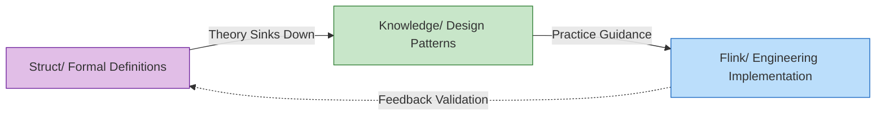
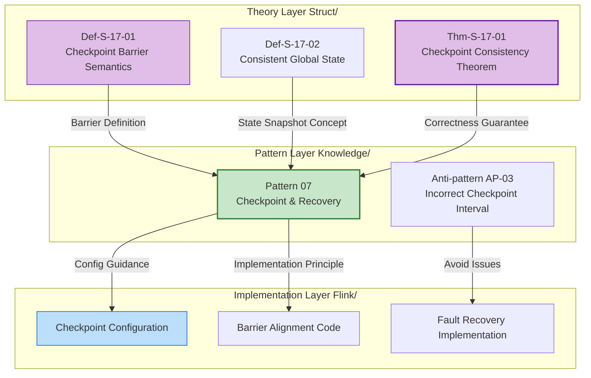

# AnalysisDataFlow Quick Start Guide

> **5-Minute Project Overview | Role-Based Learning Paths | Quick Problem Index**
>
> 📊 **420 Documents | 6,263 Formal Elements | 100% Completeness**
>
> 🌐 **中文版** | **English Version**

---

## 1. 5-Minute Quick Overview

### 1.1 What is AnalysisDataFlow

**AnalysisDataFlow** is a **unified knowledge base** for the stream computing domain—a comprehensive knowledge system from formal theory to full-stack engineering practice.

```
┌─────────────────────────────────────────────────────────────┐
│                    Knowledge Hierarchy Pyramid               │
├─────────────────────────────────────────────────────────────┤
│  L6 Production    │  Flink/ Code, Config, Cases (173 docs)   │
├───────────────────┼─────────────────────────────────────────┤
│  L4-L5 Patterns   │  Knowledge/ Design Patterns (134 docs)   │
├───────────────────┼─────────────────────────────────────────┤
│  L1-L3 Theory     │  Struct/ Theorems, Proofs (43 docs)      │
└───────────────────┴─────────────────────────────────────────┘
```

**Core Values**:

- 🔬 **Theory Support**: Formal theorems guarantee correctness of engineering decisions
- 🛠️ **Practice Guidance**: Complete mapping path from theorems to code
- 🔍 **Problem Diagnosis**: Rapid solution positioning by symptoms

---

### 1.2 Three Main Directories

| Directory | Position | Content Characteristics | For Whom |
|-----------|----------|------------------------|----------|
| **Struct/** | Formal Theory Foundation | Mathematical definitions, theorem proofs, rigorous arguments | Researchers, Architects |
| **Knowledge/** | Engineering Knowledge | Design patterns, business scenarios, technology selection | Architects, Engineers |
| **Flink/** | Flink-Specific Technology | Architecture mechanisms, SQL/API, engineering practices | Developers |

**Knowledge Flow Relationship**:



---

### 1.3 Key Features

#### Six-Section Document Template (Mandatory Structure)

Each core document must contain:

| Section | Content | Example |
|---------|---------|---------|
| 1. Definitions | Strict formal definitions + intuitive explanation | `Def-S-04-04` Watermark Semantics |
| 2. Properties | Lemmas and properties derived from definitions | `Lemma-S-04-02` Monotonicity Lemma |
| 3. Relations | Associations with other concepts/models | Flink→Process Calculus Encoding |
| 4. Argumentation | Auxiliary theorems, counterexample analysis | Boundary condition discussion |
| 5. Proof | Complete proof of main theorems | `Thm-S-17-01` Checkpoint Consistency |
| 6. Examples | Simplified examples, code snippets | Flink configuration examples |
| 7. Visualizations | Mermaid diagrams | Architecture diagrams |
| 8. References | Authoritative sources | VLDB/SOSP papers |

#### Theorem Numbering System

Global unified numbering: `{Type}-{Stage}-{DocNum}-{SeqNum}`

| Example | Meaning | Location |
|---------|---------|----------|
| `Thm-S-17-01` | Struct Stage, Doc 17, 1st Theorem | Checkpoint Correctness Proof |
| `Def-K-02-01` | Knowledge Stage, Doc 02, 1st Definition | Event Time Processing Pattern |
| `Lemma-F-12-02` | Flink Stage, Doc 12, 2nd Lemma | Online Learning Lemma |

**Quick Memory**:

- **Thm** = Theorem | **Def** = Definition | **Lemma** = Lemma | **Prop** = Proposition
- **S** = Struct (Theory) | **K** = Knowledge | **F** = Flink (Implementation)

---

## 2. Role-Based Learning Paths

### 2.1 Architect Path (3-5 Days)

**Goal**: Master system design methodology for technology selection and architectural decisions

```
Day 1-2: Concept Building
├── Struct/01-foundation/01.01-unified-streaming-theory.md
│   └── Focus: Six-layer expressiveness hierarchy (L1-L6)
├── Knowledge/01-concept-atlas/concurrency-paradigms-matrix.md
│   └── Focus: Five concurrency paradigms comparison matrix
└── Knowledge/01-concept-atlas/streaming-models-mindmap.md
    └── Focus: Stream computing model six-dimensional comparison

Day 3-4: Patterns and Selection
├── Knowledge/02-design-patterns/ (Browse all)
│   └── Focus: Relationship diagram of 7 core patterns
├── Knowledge/04-technology-selection/engine-selection-guide.md
│   └── Focus: Stream processing engine selection decision tree
└── Knowledge/04-technology-selection/streaming-database-guide.md
    └── Focus: Stream database comparison matrix

Day 5: Architecture Decisions
├── Flink/01-architecture/flink-1.x-vs-2.0-comparison.md
│   └── Focus: Architecture evolution and migration decisions
└── Struct/03-relationships/03.03-expressiveness-hierarchy.md
    └── Focus: Expressiveness and engineering constraints
```

---

### 2.2 Developer Path (1-2 Weeks)

**Goal**: Master Flink core technologies and develop production-grade stream processing applications

```
Week 1: Quick Start
├── Day 1: Flink/05-vs-competitors/flink-vs-spark-streaming.md
│   └── Flink positioning and advantages
├── Day 2-3: Flink/02-core-mechanisms/time-semantics-and-watermark.md
│   └── Event time, Watermark mechanism
├── Day 4: Knowledge/02-design-patterns/pattern-event-time-processing.md
│   └── Event time processing patterns
└── Day 5: Flink/04-connectors/kafka-integration-patterns.md
    └── Kafka integration best practices

Week 2: Core Mechanisms Deep Dive
├── Day 1-2: Flink/02-core-mechanisms/checkpoint-mechanism-deep-dive.md
│   └── Checkpoint mechanism, fault recovery
├── Day 3: Flink/02-core-mechanisms/exactly-once-end-to-end.md
│   └── Exactly-Once implementation principles
├── Day 4: Flink/02-core-mechanisms/backpressure-and-flow-control.md
│   └── Backpressure handling and flow control
└── Day 5: Flink/06-engineering/performance-tuning-guide.md
    └── Performance tuning in practice
```

---

### 2.3 Researcher Path (2-4 Weeks)

**Goal**: Understand theoretical foundations, master formal methods, conduct innovative research

```
Week 1-2: Theoretical Foundation
├── Struct/01-foundation/01.02-process-calculus-primer.md
│   └── CCS/CSP/π-calculus basics
├── Struct/01-foundation/01.04-dataflow-model-formalization.md
│   └── Dataflow strict formalization
├── Struct/01-foundation/01.03-actor-model-formalization.md
│   └── Actor model formal semantics
└── Struct/02-properties/02.03-watermark-monotonicity.md
    └── Watermark monotonicity theorem

Week 3: Model Relationships and Encoding
├── Struct/03-relationships/03.01-actor-to-csp-encoding.md
│   └── Actor→CSP encoding preservation
├── Struct/03-relationships/03.02-flink-to-process-calculus.md
│   └── Flink→Process calculus encoding
└── Struct/03-relationships/03.03-expressiveness-hierarchy.md
    └── Six-layer expressiveness hierarchy theorem

Week 4: Formal Proofs and Frontier
├── Struct/04-proofs/04.01-flink-checkpoint-correctness.md
│   └── Checkpoint consistency proof
├── Struct/04-proofs/04.02-flink-exactly-once-correctness.md
│   └── Exactly-Once correctness proof
└── Struct/06-frontier/06.02-choreographic-streaming-programming.md
    └── Choreographic programming frontier
```

---

### 2.4 Student Path (1-2 Months)

**Goal**: Gradually build complete knowledge system, from beginner to expert

```
Month 1: Foundation Building
├── Week 1: Concurrent Computing Models
│   ├── Struct/01-foundation/01.02-process-calculus-primer.md
│   ├── Struct/01-foundation/01.03-actor-model-formalization.md
│   └── Struct/01-foundation/01.05-csp-formalization.md
├── Week 2: Stream Computing Basics
│   ├── Struct/01-foundation/01.04-dataflow-model-formalization.md
│   ├── Knowledge/01-concept-atlas/streaming-models-mindmap.md
│   └── Flink/02-core-mechanisms/time-semantics-and-watermark.md
├── Week 3: Core Properties
│   ├── Struct/02-properties/02.01-determinism-in-streaming.md
│   ├── Struct/02-properties/02.02-consistency-hierarchy.md
│   └── Knowledge/02-design-patterns/pattern-event-time-processing.md
└── Week 4: Pattern Practice
    ├── Knowledge/02-design-patterns/ (All)
    └── Knowledge/03-business-patterns/ (Selective)

Month 2: Deepening and Expansion
├── Week 5-6: Flink Engineering Practice
│   ├── Flink/02-core-mechanisms/ (All core documents)
│   └── Flink/06-engineering/performance-tuning-guide.md
├── Week 7: Formal Proof Introduction
│   ├── Struct/04-proofs/04.01-flink-checkpoint-correctness.md
│   └── Struct/04-proofs/04.03-chandy-lamport-consistency.md
└── Week 8: Frontier Exploration
    ├── Knowledge/06-frontier/streaming-databases.md
    └── Knowledge/06-frontier/rust-streaming-ecosystem.md
```

---

## 3. Quick Find Index

### 3.1 Index by Topic

#### Stream Processing Basics

| Topic | Must-Read Documents | Formal Foundation |
|-------|---------------------|-------------------|
| **Event Time Processing** | Knowledge/02-design-patterns/pattern-event-time-processing.md | `Def-S-04-04` Watermark Semantics |
| **Window Computation** | Knowledge/02-design-patterns/pattern-windowed-aggregation.md | `Def-S-04-05` Window Operator |
| **State Management** | Knowledge/02-design-patterns/pattern-stateful-computation.md | `Thm-S-17-01` Checkpoint Consistency |
| **Checkpoint** | Knowledge/02-design-patterns/pattern-checkpoint-recovery.md | `Thm-S-18-01` Exactly-Once Correctness |
| **Consistency Levels** | Struct/02-properties/02.02-consistency-hierarchy.md | `Def-S-08-01~04` AM/AL/EO Semantics |

#### Design Patterns

| Pattern | Use Case | Complexity | Document |
|---------|----------|------------|----------|
| P01 Event Time | Out-of-order data | ★★★☆☆ | pattern-event-time-processing.md |
| P02 Windowed Aggregation | Window aggregation | ★★☆☆☆ | pattern-windowed-aggregation.md |
| P03 CEP | Complex event matching | ★★★★☆ | pattern-cep-complex-event.md |
| P04 Async I/O | External data enrichment | ★★★☆☆ | pattern-async-io-enrichment.md |
| P05 State Management | Stateful computation | ★★★★☆ | pattern-stateful-computation.md |
| P06 Side Output | Data diversion | ★★☆☆☆ | pattern-side-output.md |
| P07 Checkpoint | Fault tolerance | ★★★★★ | pattern-checkpoint-recovery.md |

#### Frontier Technologies

| Technology Direction | Core Document | Tech Stack |
|---------------------|---------------|------------|
| **Streaming Databases** | Knowledge/06-frontier/streaming-databases.md | RisingWave, Materialize |
| **Rust Streaming** | Knowledge/06-frontier/rust-streaming-ecosystem.md | Arroyo, Timeplus |
| **Real-time RAG** | Knowledge/06-frontier/real-time-rag-architecture.md | Flink + Vector DB |
| **Streaming Lakehouse** | Knowledge/06-frontier/streaming-lakehouse-iceberg-delta.md | Flink + Iceberg/Paimon |
| **Edge Streaming** | Knowledge/06-frontier/edge-streaming-patterns.md | Edge computing architecture |
| **Streaming Materialized Views** | Knowledge/06-frontier/streaming-materialized-view-architecture.md | Real-time data warehouse |

---

### 3.2 Index by Problem

#### Checkpoint Related Problems

| Symptom | Solution | Reference Document |
|---------|----------|-------------------|
| Frequent checkpoint timeouts | Enable incremental checkpoints, use RocksDB | checkpoint-mechanism-deep-dive.md |
| Long alignment time | Enable unaligned checkpoint, tune debloating | checkpoint-mechanism-deep-dive.md |
| Slow recovery | Local recovery, incremental recovery | checkpoint-mechanism-deep-dive.md |
| Large state | Incremental checkpoint, state TTL | flink-state-ttl-best-practices.md |

#### Backpressure Handling

| Symptom | Solution | Reference Document |
|---------|----------|-------------------|
| Severe backpressure | Credit-based flow tuning, increase parallelism | backpressure-and-flow-control.md |
| Source backpressure | Downstream slow, add parallelism or optimize | performance-tuning-guide.md |
| Sink backpressure | Batch optimization, async writes | performance-tuning-guide.md |

#### Data Skew

| Symptom | Solution | Reference Document |
|---------|----------|-------------------|
| Hot key | Salting, two-phase aggregation, custom partitioner | performance-tuning-guide.md |
| Window skew | Custom window assigner, allow lateness | pattern-windowed-aggregation.md |

#### Exactly-Once Issues

| Symptom | Solution | Reference Document |
|---------|----------|-------------------|
| Data duplication | Check sink idempotency, 2PC config | exactly-once-end-to-end.md |
| Data loss | Check source replayability, checkpoint interval | exactly-once-end-to-end.md |

#### AI/ML Streaming Problems

| Symptom | Solution | Reference Document |
|---------|----------|-------------------|
| High model inference latency | Async inference, model caching | model-serving-streaming.md |
| Low vector search accuracy | Index optimization, similarity threshold tuning | rag-streaming-architecture.md |
| Insufficient feature freshness | Real-time feature engineering, Feature Store | realtime-feature-engineering-feature-store.md |

---

### 3.3 Common Document Quick Links

#### Core Index Pages

| Index | Purpose | Path |
|-------|---------|------|
| **Project Overview** | Overall project structure | [README.md](../../../README.md) |
| **Struct Index** | Formal theory navigation | [Struct/00-INDEX.md](../../../Struct/00-INDEX.md) |
| **Knowledge Index** | Engineering knowledge navigation | [Knowledge/00-INDEX.md](../../../Knowledge/00-INDEX.md) |
| **Flink Index** | Flink-specific navigation | [Flink/00-INDEX.md](../../../Flink/00-INDEX.md) |
| **Theorem Registry** | Formal elements global index | [THEOREM-REGISTRY.md](../../../THEOREM-REGISTRY.md) |
| **Progress Tracking** | Project progress and stats | [PROJECT-TRACKING.md](../../../PROJECT-TRACKING.md) |

#### Quick Decision References

| Decision Type | Reference Document |
|---------------|-------------------|
| Stream engine selection | Knowledge/04-technology-selection/engine-selection-guide.md |
| Flink vs Spark selection | Flink/05-vs-competitors/flink-vs-spark-streaming.md |
| Flink vs RisingWave selection | Knowledge/04-technology-selection/flink-vs-risingwave.md |
| SQL vs DataStream API | Flink/03-sql-table-api/sql-vs-datastream-comparison.md |
| State backend selection | Flink/06-engineering/state-backend-selection.md |
| Streaming database selection | Knowledge/04-technology-selection/streaming-database-guide.md |

#### Production Troubleshooting

| Problem Type | Troubleshooting Document |
|--------------|-------------------------|
| Checkpoint problems | Flink/02-core-mechanisms/checkpoint-mechanism-deep-dive.md |
| Backpressure issues | Flink/02-core-mechanisms/backpressure-and-flow-control.md |
| Performance tuning | Flink/06-engineering/performance-tuning-guide.md |
| Memory overflow | Flink/06-engineering/performance-tuning-guide.md |
| Exactly-Once failure | Flink/02-core-mechanisms/exactly-once-end-to-end.md |

#### Anti-Pattern Checklist

| Anti-Pattern | Detection Document |
|--------------|-------------------|
| Global state abuse | Knowledge/09-anti-patterns/anti-pattern-01-global-state-abuse.md |
| Watermark misconfiguration | Knowledge/09-anti-patterns/anti-pattern-02-watermark-misconfiguration.md |
| Checkpoint interval misconfig | Knowledge/09-anti-patterns/anti-pattern-03-checkpoint-interval-misconfig.md |
| Hot key skew | Knowledge/09-anti-patterns/anti-pattern-04-hot-key-skew.md |
| Blocking I/O in ProcessFunction | Knowledge/09-anti-patterns/anti-pattern-05-blocking-io-processfunction.md |
| Complete checklist | Knowledge/09-anti-patterns/anti-pattern-checklist.md |

---

## 4. Example: From Theory to Practice

### Knowledge Flow Example: Checkpoint Consistency



### Complete Knowledge Chain

```
┌─────────────────────────────────────────────────────────────────────┐
│                        Checkpoint Knowledge Chain                    │
├─────────────────────────────────────────────────────────────────────┤
│                                                                     │
│  1. Formal Definitions (Struct/)                                    │
│     Def-S-17-01: Checkpoint Barrier Semantics                      │
│     Def-S-17-02: Consistent Global State G = <𝒮, 𝒞>                 │
│     Def-S-17-03: Checkpoint Alignment Definition                    │
│                                                                     │
│           ↓ Theorem Guarantee                                       │
│                                                                     │
│  2. Formal Proofs (Struct/)                                         │
│     Thm-S-17-01: Flink Checkpoint Consistency Theorem               │
│     Lemma-S-17-01: Barrier Propagation Invariant                   │
│     Lemma-S-17-02: State Consistency Lemma                          │
│                                                                     │
│           ↓ Pattern Extraction                                      │
│                                                                     │
│  3. Design Patterns (Knowledge/)                                    │
│     Pattern 07: Checkpoint & Recovery Pattern                       │
│     - Checkpoint interval selection guide                           │
│     - State backend selection matrix                                │
│     - Recovery strategy decision tree                               │
│                                                                     │
│           ↓ Engineering Implementation                              │
│                                                                     │
│  4. Flink Implementation (Flink/)                                   │
│     - Checkpoint configuration parameters                           │
│     - RocksDB state backend configuration                           │
│     - Incremental checkpoint enablement                             │
│     - Unaligned checkpoint configuration                            │
│                                                                     │
│           ↓ Production Validation                                   │
│                                                                     │
│  5. Troubleshooting                                                 │
│     - Checkpoint timeout diagnosis                                  │
│     - Long alignment time handling                                  │
│     - Anti-pattern checklist                                        │
│                                                                     │
└─────────────────────────────────────────────────────────────────────┘
```

---

## 5. Quick FAQ

### 5.1 How to Find Specific Topics

**Method 1: Index Navigation**

1. First consult [Struct/00-INDEX.md](../../../Struct/00-INDEX.md) for theoretical foundations
2. Then consult [Knowledge/00-INDEX.md](../../../Knowledge/00-INDEX.md) for design patterns
3. Finally consult [Flink/00-INDEX.md](../../../Flink/00-INDEX.md) for engineering implementation

**Method 2: Theorem Number Tracking**

1. Find theorem number in [THEOREM-REGISTRY.md](../../../THEOREM-REGISTRY.md)
2. Locate document by number (e.g., `Thm-S-17-01` → Struct/04-proofs/04.01)
3. Cross-reference related definitions and lemmas

**Method 3: Problem-Driven**

1. Consult Section 3.2 "Index by Problem"
2. Match symptoms to solutions
3. Deep read recommended documents

---

### 5.2 How to Understand Theorem Numbers

**Format**: `{Type}-{Stage}-{DocNum}-{SeqNum}`

| Component | Values | Meaning |
|-----------|--------|---------|
| Type | Thm/Def/Lemma/Prop/Cor | Theorem/Definition/Lemma/Proposition/Corollary |
| Stage | S/K/F | Struct/Knowledge/Flink |
| DocNum | 01-99 | Document sequence in directory |
| SeqNum | 01-99 | Element sequence in document |

**Example Parsing**:

- `Thm-S-17-01`: Struct stage, doc 17 in 04-proofs, 1st theorem → Checkpoint Consistency Theorem
- `Def-K-02-01`: Knowledge stage, doc 02 in 02-design-patterns, 1st definition → Event Time Processing Pattern
- `Lemma-F-12-02`: Flink stage, doc 12 in 12-ai-ml, 2nd lemma → Online Learning Lemma

---

### 5.3 How to Contribute

**Contribution Principles**:

1. **Follow six-section template**: Definitions → Properties → Relations → Argumentation → Proof → Examples
2. **Use unified numbering**: New theorems/definitions follow rules, avoid conflicts
3. **Maintain cross-directory references**: Struct definitions → Knowledge patterns → Flink implementation
4. **Add Mermaid diagrams**: At least one visualization per document

---

## Appendix: Quick Reference

### Six-Layer Expressiveness Hierarchy

```
L₆: Turing-Complete (Undecidable) ── λ-calculus, Turing Machine
L₅: Higher-Order (Mostly Undecidable) ── HOπ, Ambient
L₄: Mobile (Partially Undecidable) ── π-calculus, Actor
L₃: Process Algebra (EXPTIME) ── CSP, CCS
L₂: Context-Free (PSPACE) ── PDA, BPA
L₁: Regular (P-Complete) ── FSM, Regex
```

### Consistency Level Quick Reference

| Level | Definition | Implementation | Use Case |
|-------|------------|----------------|----------|
| At-Most-Once (AM) | Effect count ≤ 1 | Deduplication/Idempotency | Log aggregation, monitoring |
| At-Least-Once (AL) | Effect count ≥ 1 | Retry/Replay | Recommendation systems, stats |
| Exactly-Once (EO) | Effect count = 1 | Source+Checkpoint+Tx Sink | Financial transactions, orders |

---

> 📌 **Note**: This document is a quick start guide. For detailed content, please refer to directory indexes and specific documents.
>
> 📅 **Last Updated**: 2026-04-08 | 📝 **Version**: v1.0
