# AnalysisDataFlow Technical Architecture Document

> **Version**: v1.0 | **Last Updated**: 2026-04-03 | **Status**: Production
>
> This document describes the overall technical architecture of the AnalysisDataFlow project, including directory structure, document generation flow, validation system, storage architecture, and extension mechanisms.

---

## Table of Contents

- [AnalysisDataFlow Technical Architecture Document](#analysisdataflow-technical-architecture-document)
  - [Table of Contents](#table-of-contents)
  - [1. Project Overall Architecture](#1-project-overall-architecture)
    - [1.1 Four-Layer Architecture Overview](#11-four-layer-architecture-overview)
    - [1.2 Layer Responsibilities and Interfaces](#12-layer-responsibilities-and-interfaces)
      - [Layer 1: Struct/ - Formal Theory Foundation Layer](#layer-1-struct---formal-theory-foundation-layer)
      - [Layer 2: Knowledge/ - Knowledge Application Layer](#layer-2-knowledge---knowledge-application-layer)
      - [Layer 3: Flink/ - Engineering Implementation Layer](#layer-3-flink---engineering-implementation-layer)
      - [Layer 4: visuals/ - Visualization Navigation Layer](#layer-4-visuals---visualization-navigation-layer)
    - [1.3 Data Flow and Dependencies](#13-data-flow-and-dependencies)
  - [2. Document Generation Architecture](#2-document-generation-architecture)
    - [2.1 Markdown Processing Flow](#21-markdown-processing-flow)
    - [2.2 Mermaid Diagram Rendering](#22-mermaid-diagram-rendering)
    - [2.3 Cross-Reference Resolution](#23-cross-reference-resolution)
  - [3. Validation System Architecture](#3-validation-system-architecture)
    - [3.1 Validation Script Architecture](#31-validation-script-architecture)
    - [3.2 CI/CD Flow](#32-cicd-flow)
    - [3.3 Quality Gates](#33-quality-gates)
  - [4. Storage Architecture](#4-storage-architecture)
    - [4.1 File Organization Structure](#41-file-organization-structure)
    - [4.2 Index System](#42-index-system)
    - [4.3 Version Management](#43-version-management)
  - [5. Extension Architecture](#5-extension-architecture)
    - [5.1 Adding New Documents](#51-adding-new-documents)
    - [5.2 Adding New Visualizations](#52-adding-new-visualizations)
    - [5.3 Adding New Validation Rules](#53-adding-new-validation-rules)
  - [6. Internationalization (i18n) Architecture](#6-internationalization-i18n-architecture)
  - [Appendix](#appendix)
    - [A. Glossary](#a-glossary)
    - [B. Directory Mapping Table](#b-directory-mapping-table)
    - [C. Related Documents](#c-related-documents)

---

## 1. Project Overall Architecture

### 1.1 Four-Layer Architecture Overview

AnalysisDataFlow adopts a **four-layer architecture design**, achieving a complete knowledge system from formal theory to engineering practice:

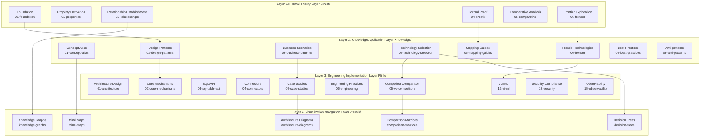

### 1.2 Layer Responsibilities and Interfaces

#### Layer 1: Struct/ - Formal Theory Foundation Layer

| Attribute | Description |
|-----------|-------------|
| **Positioning** | Mathematical definitions, theorem proofs, rigorous arguments |
| **Content Characteristics** | Formal language, axiom systems, proof construction |
| **Document Count** | 43 |
| **Core Output** | 188 theorems, 399 definitions, 158 lemmas |

**Internal Interface Specification**:

```
Input: Academic literature, formal specifications
Output: Def-* (definitions), Thm-* (theorems), Lemma-* (lemmas), Prop-* (propositions)
Contract: Each definition must have unique numbering, each theorem must have complete proof
```

**Subdirectory Responsibilities**:

- `01-foundation/`: USTM, process calculus, Actor, Dataflow fundamentals
- `02-properties/`: Determinism, consistency, Watermark monotonicity, etc.
- `03-relationships/`: Cross-model encoding, expressiveness hierarchy
- `04-proofs/`: Checkpoint, Exactly-Once correctness proofs
- `05-comparative/`: Go vs Scala expressiveness comparison
- `06-frontier/`: Open problems, Choreographic programming, AI Agent formalization

#### Layer 2: Knowledge/ - Knowledge Application Layer

| Attribute | Description |
|-----------|-------------|
| **Positioning** | Design patterns, business scenarios, technology selection |
| **Content Characteristics** | Engineering practices, pattern catalogs, decision frameworks |
| **Document Count** | 110 |
| **Core Output** | 45 design patterns, 15 business scenarios |

**Internal Interface Specification**:

```
Input: Struct/ formal definitions, industry cases, engineering experience
Output: Design pattern catalogs, technology selection guides, business scenario analysis
Contract: Each pattern must associate with formal foundations, each selection must have decision matrix
```

**Subdirectory Responsibilities**:

- `01-concept-atlas/`: Concurrency paradigm matrix, concept atlases
- `02-design-patterns/`: Event time processing, state computation, window aggregation, etc.
- `03-business-patterns/`: Uber/Netflix/Alibaba real cases
- `04-technology-selection/`: Engine selection, storage selection, stream database guides
- `05-mapping-guides/`: Theory to code mapping, migration guides
- `06-frontier/`: A2A protocol, MCP, real-time RAG, stream database ecosystem
- `09-anti-patterns/`: 10 anti-pattern identification and avoidance strategies

#### Layer 3: Flink/ - Engineering Implementation Layer

| Attribute | Description |
|-----------|-------------|
| **Positioning** | Flink specialization, architecture mechanisms, engineering practices |
| **Content Characteristics** | Source analysis, configuration examples, performance tuning |
| **Document Count** | 117 |
| **Core Output** | 107 Flink-related theorems, full core mechanism coverage |

**Internal Interface Specification**:

```
Input: Knowledge/ design patterns, Flink official documentation, source analysis
Output: Architecture documents, mechanism details, case studies, roadmaps
Contract: Each mechanism must have source references, each case must have production verification
```

**Subdirectory Responsibilities**:

- `01-architecture/`: Architecture evolution, disaggregated state analysis
- `02-core-mechanisms/`: Checkpoint, Exactly-Once, Watermark, Delta Join
- `03-sql-table-api/`: SQL optimization, Model DDL, Vector Search
- `04-connectors/`: Kafka, CDC, Iceberg, Paimon integration
- `05-vs-competitors/`: Comparison with Spark, RisingWave
- `06-engineering/`: Performance tuning, cost optimization, testing strategies
- `07-case-studies/`: Finance risk control, IoT, recommendation systems, etc.
- `12-ai-ml/`: Flink ML, online learning, AI Agents
- `13-security/`: TEE, GPU trusted computing
- `15-observability/`: OpenTelemetry, SLO, observability

#### Layer 4: visuals/ - Visualization Navigation Layer

| Attribute | Description |
|-----------|-------------|
| **Positioning** | Decision trees, comparison matrices, mind maps, knowledge graphs |
| **Content Characteristics** | Visual navigation, quick decisions, knowledge overview |
| **Document Count** | 20 |
| **Core Output** | 5 visualization types, 700+ Mermaid diagrams |

**Internal Interface Specification**:

```
Input: Full project documents, theorem dependency relationships, technology selection logic
Output: Decision trees, comparison matrices, mind maps, knowledge graphs
Contract: Each visualization must be navigable to source documents, each decision must have condition branches
```

**Subdirectory Responsibilities**:

- `decision-trees/`: Technology selection decision trees, paradigm selection decision trees
- `comparison-matrices/`: Engine comparison matrices, model comparison matrices
- `mind-maps/`: Knowledge mind maps, complete knowledge graphs
- `knowledge-graphs/`: Concept relationship graphs, theorem dependency graphs
- `architecture-diagrams/`: System architecture diagrams, layered architecture diagrams

### 1.3 Data Flow and Dependencies

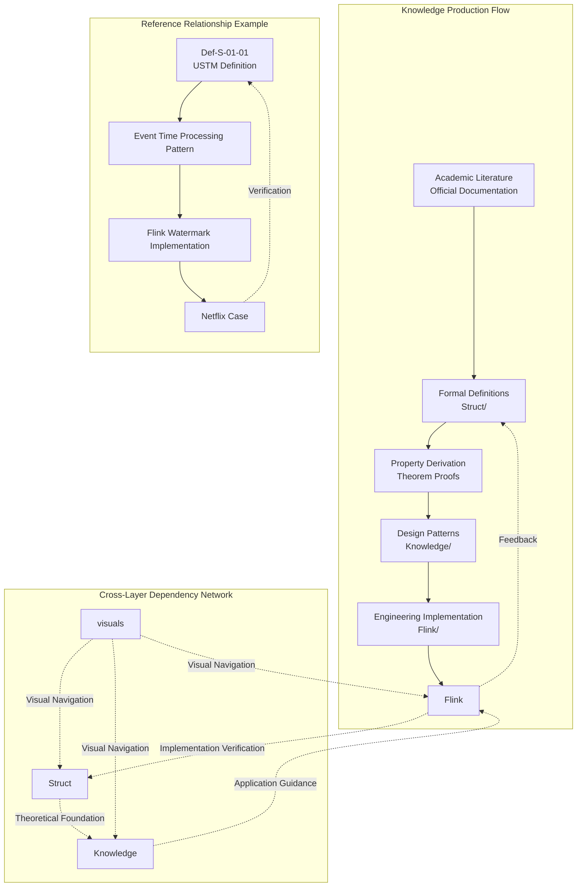

**Dependency Rules**:

1. **Unidirectional Dependency Principle**: Struct → Knowledge → Flink, avoid circular dependencies
2. **Feedback Verification Mechanism**: Flink engineering practices feedback verifies Struct theory
3. **Visualization Navigation**: visuals/ as navigation layer, can reference all layers

---

## 2. Document Generation Architecture

### 2.1 Markdown Processing Flow

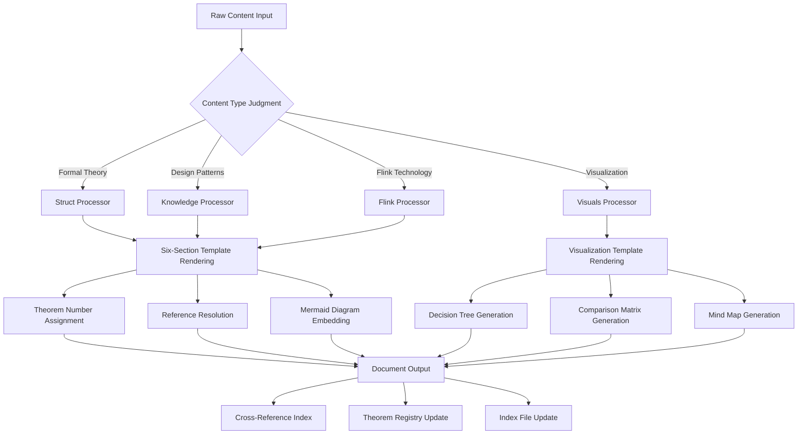

**Processing Stage Descriptions**:

| Stage | Function | Output |
|-------|----------|--------|
| **Content Parsing** | Identify document type, extract metadata | Document object tree |
| **Template Rendering** | Apply six-section or visualization template | Structured Markdown |
| **Number Assignment** | Assign theorem/definition/lemma numbers | Globally unique identifiers |
| **Reference Resolution** | Resolve internal/external references | Link mapping table |
| **Diagram Embedding** | Generate Mermaid diagrams | Visualization code blocks |
| **Index Update** | Update registry and indexes | THEOREM-REGISTRY.md |

### 2.2 Mermaid Diagram Rendering

**Diagram Types and Usage Scenarios**:

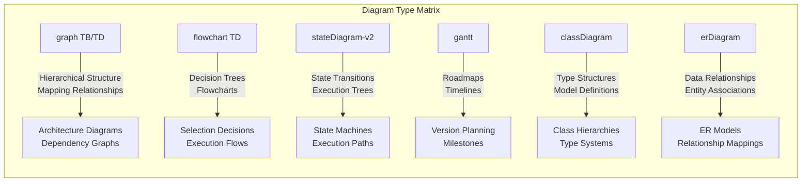

**Diagram Rendering Standards**:

```markdown
## 7. Visualizations (Visualizations)

### 7.1 Hierarchical Structure Diagram

The following diagram shows the hierarchical structure of XXX:

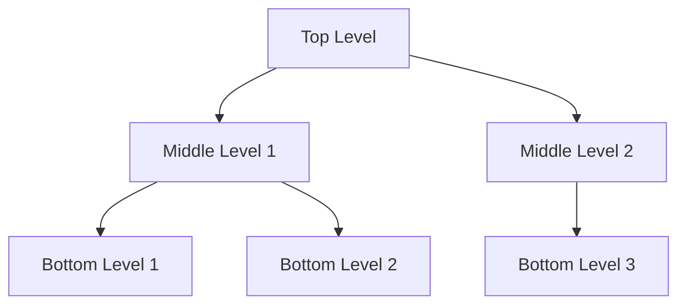

### 7.2 Decision Flow Diagram

The following decision tree helps select XXX:

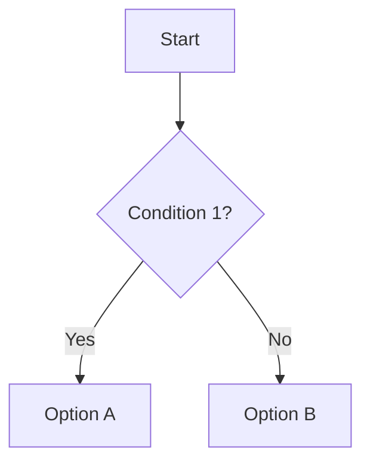

```

**Rendering Rules**:
1. Each diagram must have descriptive text before it
2. Diagrams must have clear type selection rationale
3. Complex diagrams require legend explanations
4. Diagram semantics must be consistent with text descriptions

### 2.3 Cross-Reference Resolution

**Reference Type System**:

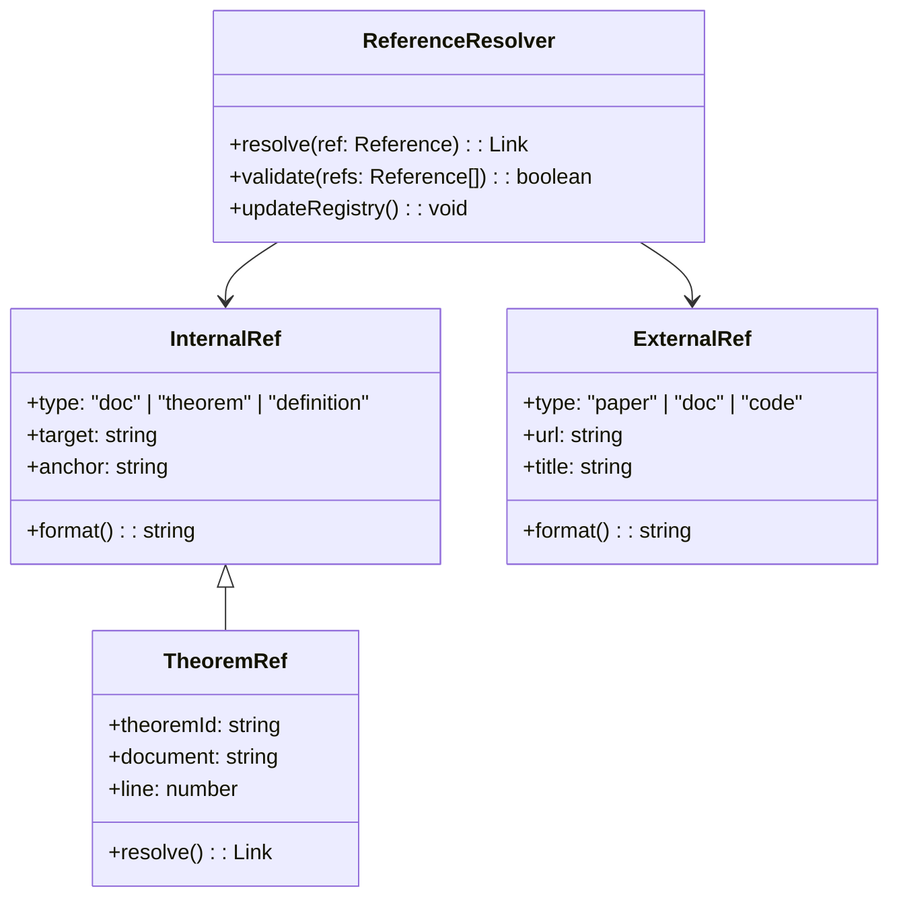

**Reference Format Standards**:

| Reference Type | Format Example | Description |
|----------------|----------------|-------------|
| **Internal Document** | `[Text](Struct/01-foundation/01.01-unified-streaming-theory.md)` | Relative path links |
| **Theorem Reference** | `Thm-S-01-01` | Global theorem number |
| **Definition Reference** | `Def-K-02-05` | Global definition number |
| **External Paper** | `[^n]: Author, "Title", Journal, Year` | End-of-document citation list |
| **Official Documentation** | `[^n]: Apache Flink, "Title", URL` | Authoritative sources preferred |

---

## 3. Validation System Architecture

### 3.1 Validation Script Architecture

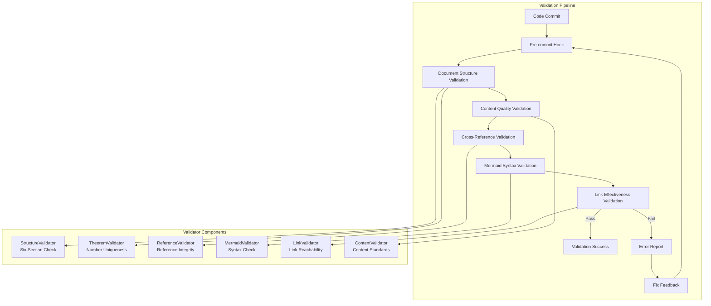

**Validator Detailed Descriptions**:

| Validator | Responsibility | Validation Rules |
|-----------|----------------|------------------|
| **StructureValidator** | Six-section structure check | Must contain 8 sections, correct order |
| **TheoremValidator** | Theorem number uniqueness | Global numbers don't conflict, correct format |
| **ReferenceValidator** | Reference integrity | Internal links valid, external links accessible |
| **MermaidValidator** | Mermaid syntax check | Diagram syntax correct, renderable |
| **LinkValidator** | Link effectiveness | HTTP 200 response, no dead links |
| **ContentValidator** | Content standards | Terminology consistency, unified format |

### 3.2 CI/CD Flow

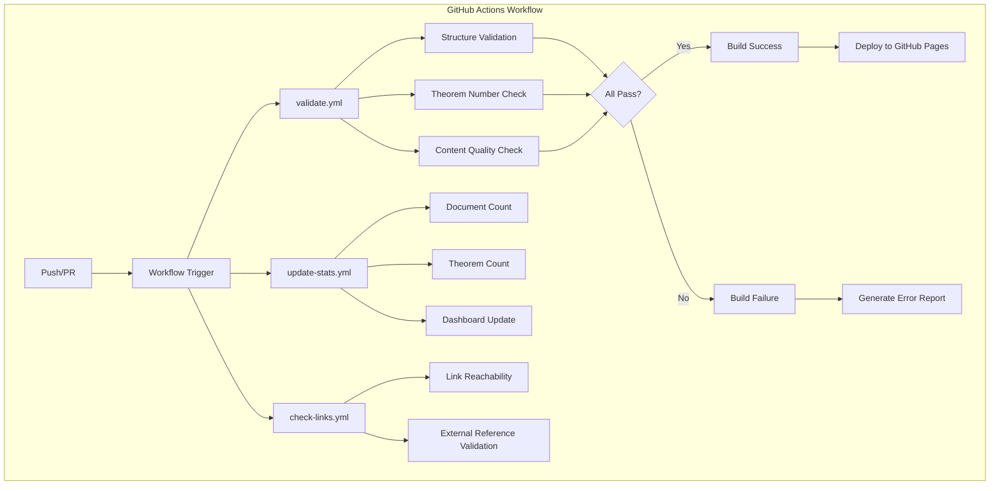

**Workflow Configuration** (`.github/workflows/`):

| Workflow File | Trigger | Responsibility |
|---------------|---------|----------------|
| `validate.yml` | Push, PR | Document structure, theorem number, content quality validation |
| `update-stats.yml` | Push to main | Statistics update, dashboard refresh |
| `check-links.yml` | Daily scheduled | External link effectiveness check |

### 3.3 Quality Gates

```mermaid
flowchart TD
    subgraph "Quality Gate Checkpoints"
        direction TB

        Q1[Gate 1: Six-Section Check] -->|Must contain| Q1a[Concept Definitions]
        Q1 -->|Must contain| Q1b[Property Derivation]
        Q1 -->|Must contain| Q1c[Relationship Establishment]
        Q1 -->|Must contain| Q1d[Argumentation Process]
        Q1 -->|Must contain| Q1e[Formal Proof]
        Q1 -->|Must contain| Q1f[Examples]
        Q1 -->|Must contain| Q1g[Visualizations]
        Q1 -->|Must contain| Q1h[References]

        Q2[Gate 2: Numbering Standards] --> Q2a[Format: Thm-S-XX-XX]
        Q2 --> Q2b[Global Uniqueness]
        Q2 --> Q2c[Sequential Numbers]

        Q3[Gate 3: Visualization Requirements] --> Q3a[At least 1 Mermaid diagram]
        Q3 --> Q3b[Descriptive text before diagram]
        Q3 --> Q3c[Correct syntax]

        Q4[Gate 4: Reference Standards] --> Q4a[External references verifiable]
        Q4 --> Q4b[Internal links valid]
        Q4 --> Q4c[Unified reference format]

        Q5[Gate 5: Terminology Consistency] --> Q5a[Consistent with glossary]
        Q5 --> Q5b[Abbreviation standards]
        Q5 --> Q5c[Chinese-English对照]
    end
```

**Quality Gate Checklist**:

```markdown
## Pre-submission Document Checklist

### Structure Check
- [ ] Contains all 8 sections
- [ ] Correct section order
- [ ] Complete metadata header

### Content Check
- [ ] At least 1 formal definition (Def-*)
- [ ] At least 1 theorem/lemma/proposition
- [ ] At least 1 code/configuration example
- [ ] At least 1 Mermaid diagram

### Reference Check
- [ ] External references use `[^n]` format
- [ ] Internal references use relative paths
- [ ] Theorem references use global numbers

### Numbering Check
- [ ] New theorem numbers globally unique
- [ ] Number format conforms to standard
- [ ] THEOREM-REGISTRY.md updated
```

---

## 4. Storage Architecture

### 4.1 File Organization Structure

```mermaid
graph TB
    subgraph "Project Root Directory"
        Root[AnalysisDataFlow/]

        Root --> Config[Configuration Files]
        Root --> Core[Core Directories]
        Root --> Meta[Metadata]
        Root --> CI[CI/CD]
    end

    subgraph "Configuration Files"
        Config --> README[README.md<br/>Project Overview]
        Config --> AGENTS[AGENTS.md<br/>Agent Specifications]
        Config --> ARCH[ARCHITECTURE.md<br/>Architecture Document]
        Config --> License[LICENSE<br/>License]
    end

    subgraph "Core Directories"
        Core --> Struct[Struct/<br/>43 documents]
        Core --> Knowledge[Knowledge/<br/>110 documents]
        Core --> Flink[Flink/<br/>117 documents]
        Core --> Visuals[visuals/<br/>20 documents]
    end

    subgraph "Metadata"
        Meta --> Tracking[PROJECT-TRACKING.md<br/>Progress Dashboard]
        Meta --> Version[PROJECT-VERSION-TRACKING.md<br/>Version Tracking]
        Meta --> Registry[THEOREM-REGISTRY.md<br/>Theorem Registry]
        Meta --> Reports[FINAL-*.md<br/>Completion Reports]
    end

    subgraph "CI/CD"
        CI --> Workflows[.github/workflows/<br/>Workflow Definitions]
        CI --> Scripts[scripts/<br/>Validation Scripts]
    end
```

**File Naming Convention**:

```
{level}.{number}-{topic-keyword}.md

Examples:
- 01.01-stream-processing-fundamentals.md    (Struct/01-foundation/)
- 02-design-patterns-overview.md             (Knowledge/02-design-patterns/)
- checkpoint-mechanism-deep-dive.md          (Flink/02-core-mechanisms/)
```

### 4.2 Index System

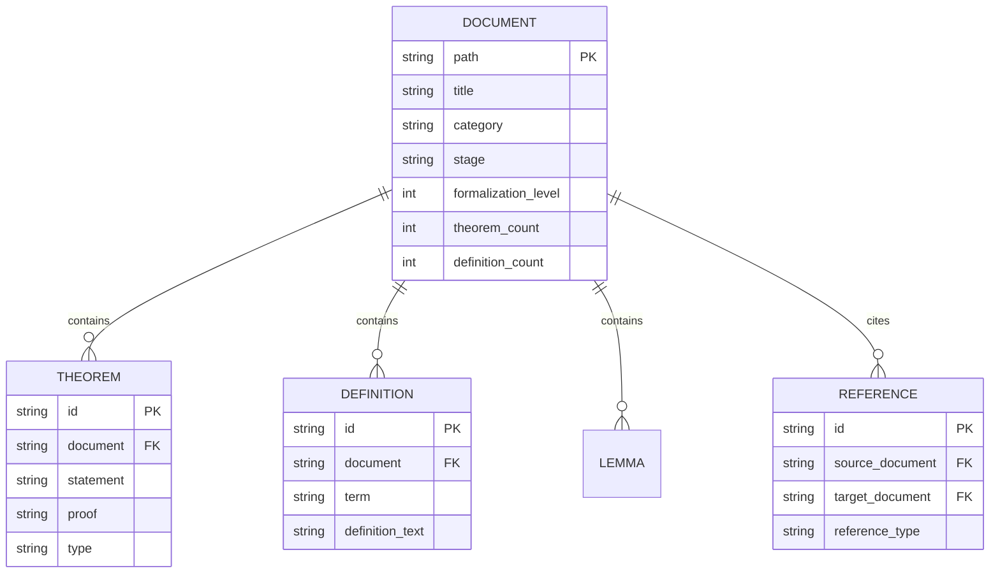

**Index File System**:

| Index File | Responsibility | Update Frequency |
|------------|----------------|------------------|
| `THEOREM-REGISTRY.md` | Full project theorem/definition/lemma registry | Per new document |
| `PROJECT-TRACKING.md` | Progress dashboard, task status | Per iteration |
| `PROJECT-VERSION-TRACKING.md` | Version history, changelog | Per version |
| `Struct/00-INDEX.md` | Struct directory index | Per batch of new documents |
| `Knowledge/00-INDEX.md` | Knowledge directory index | Per batch of new documents |
| `Flink/00-INDEX.md` | Flink directory index | Per batch of new documents |
| `visuals/index-visual.md` | Visualization navigation index | New visualizations |

### 4.3 Version Management

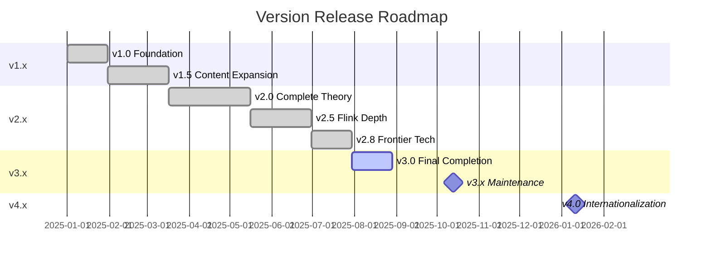

**Version Management Strategy**:

| Version Number | Meaning | Update Content |
|----------------|---------|----------------|
| **Major** (X.0) | Major architecture changes | Directory structure changes, numbering system changes |
| **Minor** (x.X) | Feature expansion | New document batches, new topic coverage |
| **Patch** (x.x.X) | Fix optimization | Error corrections, link updates, format optimization |

---

## 5. Extension Architecture

### 5.1 Adding New Documents

```mermaid
flowchart TD
    subgraph "New Document Addition Flow"
        A[Determine Document Type] --> B{Select Directory}

        B -->|Formal Theory| C[Struct/]
        B -->|Design Patterns| D[Knowledge/]
        B -->|Flink Technology| E[Flink/]
        B -->|Visualization| F[visuals/]

        C --> G[Select Subdirectory<br/>01-08]
        D --> H[Select Subdirectory<br/>01-09]
        E --> I[Select Subdirectory<br/>01-15]
        F --> J[Select Subdirectory<br/>decision-trees etc.]

        G & H & I & J --> K[Assign Number]
        K --> L[Create File<br/>{level}.{number}-{topic}.md]
        L --> M[Apply Six-Section Template]
        M --> N[Assign Theorem Number]
        N --> O[Write Content]
        O --> P[Add Mermaid Diagrams]
        P --> Q[Validate and Submit]
    end
```

**New Document Addition Steps**:

```markdown
## New Document Creation Checklist

### 1. Pre-check
- [ ] Confirm document topic not yet covered
- [ ] Confirm target directory and subdirectory
- [ ] Check for同名 or similar documents to avoid duplication

### 2. File Creation
- [ ] Create file following naming convention
- [ ] Copy six-section template
- [ ] Fill in metadata header

### 3. Content Writing
- [ ] Write concept definitions (at least 1 Def-*)
- [ ] Derive properties (at least 1 Lemma/Prop)
- [ ] Establish relationships (associations with other documents)
- [ ] Write argumentation process
- [ ] Complete formal proof/engineering argument
- [ ] Add examples
- [ ] Create Mermaid diagrams
- [ ] List references

### 4. Number Assignment
- [ ] Register new numbers in THEOREM-REGISTRY.md
- [ ] Ensure numbers globally unique
- [ ] Update all number references in document

### 5. Index Update
- [ ] Update directory 00-INDEX.md
- [ ] Update PROJECT-TRACKING.md
- [ ] Update cross-references in related documents

### 6. Validation Submission
- [ ] Run local validation scripts
- [ ] Pass all quality gates
- [ ] Submit PR and pass CI
```

### 5.2 Adding New Visualizations

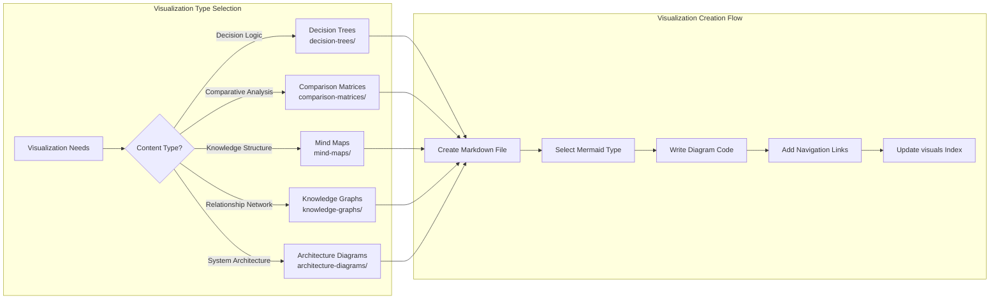

**Visualization Creation Template**:

```markdown
# {Visualization Title}

> Type: {decision-tree | matrix | mindmap | graph | architecture}
> Purpose: {Purpose description}
> Last Updated: YYYY-MM-DD

## Overview

{Description of visualization purpose and applicable scenarios}

## Visualization

```{visualization type}
{Mermaid diagram code}
```

## Usage Guide

### How to Read

{Reading guide}

### Related Documents

- [Related Document 1](Struct/00-INDEX.md)
- [Related Document 2](Flink/00-INDEX.md)

## Changelog

| Date | Changes |
|------|---------|
| YYYY-MM-DD | Initial version |

```

### 5.3 Adding New Validation Rules

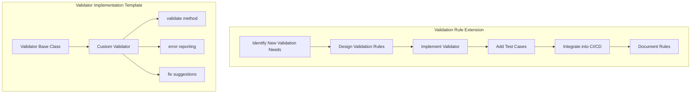

---

## 6. Internationalization (i18n) Architecture

The project supports multilingual content through a structured internationalization system:

```
docs/i18n/
├── ARCHITECTURE.md               # i18n architecture design (this document)
├── README.md                     # i18n module usage guide
├── i18n-content/                 # Multilingual content directory
│   ├── zh/                       # Chinese (source language)
│   ├── en/                       # English
│   └── ...                       # Other languages
├── glossary/                     # Terminology management
│   ├── core-terms.json
│   ├── prohibited-list.json
│   └── domain-terms-en.json
├── workflows/                    # Workflow status
│   ├── translation-queue.json
│   ├── review-queue.json
│   └── version-lock.json
├── templates/                    # Translation templates
│   ├── translation-template.md
│   └── review-checklist.md
└── config/                       # Configuration files
    ├── i18n-config.yaml
    └── languages.json
```

**Translation Workflow**:

1. **Source Language Locking**: When a document enters translation workflow, the source is locked to prevent version inconsistency
2. **Progressive Translation**: Supports partial translation with fallback to source language
3. **Version Synchronization**: Tracks source document changes and flags translations needing updates
4. **Quality Assurance**: Multi-level review process (automated checks, terminology review, technical review)

For detailed i18n architecture, see [docs/i18n/ARCHITECTURE.md](../i18n/ARCHITECTURE.md).

---

## Appendix

### A. Glossary

| Term | English | Description |
|------|---------|-------------|
| 六段式 | Six-Section Template | Document standard structure template |
| USTM | Unified Streaming Theory Model | Unified stream computing theory model |
| Def-* | Definition | Formal definition number prefix |
| Thm-* | Theorem | Theorem number prefix |
| Lemma-* | Lemma | Lemma number prefix |
| Prop-* | Proposition | Proposition number prefix |
| Cor-* | Corollary | Corollary number prefix |

### B. Directory Mapping Table

| Directory Code | Full Path | Purpose |
|----------------|-----------|---------|
| S | Struct/ | Formal Theory |
| K | Knowledge/ | Knowledge Application |
| F | Flink/ | Engineering Implementation |
| V | visuals/ | Visualization Navigation |

### C. Related Documents

- [AGENTS.md](../../AGENTS.md) - Agent Work Context Specifications
- [PROJECT-TRACKING.md](../../PROJECT-TRACKING.md) - Project Progress Tracking
- [THEOREM-REGISTRY.md](../../THEOREM-REGISTRY.md) - Theorem Registry
- [README.md](../../README.md) - Project Overview

---

*This document is maintained by the AnalysisDataFlow Architecture Team, Last Updated: 2026-04-03*
