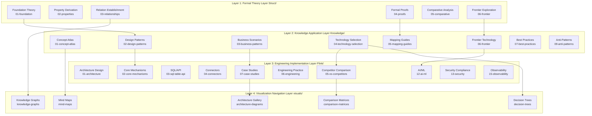
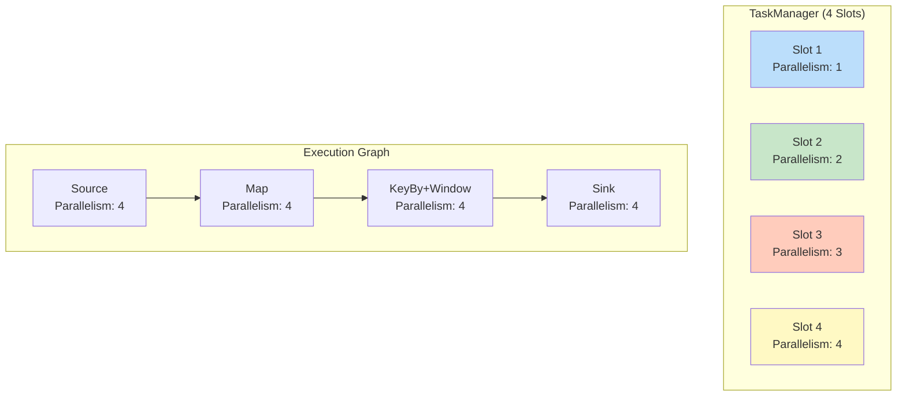

> **状态**: 🔮 前瞻内容 | **风险等级**: 高 | **最后更新**: 2026-04
> 
> 此文档描述的内容处于早期规划阶段，可能与最终实现不符。请以 Apache Flink 官方发布为准。
# AnalysisDataFlow Technical Architecture

> **Version**: v1.0 | **Last Updated**: 2026-04-03 | **Status**: Production
>
> This document describes the overall technical architecture of the AnalysisDataFlow project, including directory structure, document generation workflow, verification system, storage architecture, and extension mechanisms.

---

## Table of Contents

- [AnalysisDataFlow Technical Architecture](#analysisdataflow-technical-architecture)
  - [Table of Contents](#table-of-contents)
  - [1. Overall Project Architecture](#1-overall-project-architecture)
    - [1.1 Four-Layer Architecture Overview](#11-four-layer-architecture-overview)
    - [1.2 Layer Responsibilities and Interfaces](#12-layer-responsibilities-and-interfaces)
      - [Layer 1: Struct/ - Formal Theory Foundation Layer](#layer-1-struct---formal-theory-foundation-layer)
      - [Layer 2: Knowledge/ - Knowledge Application Layer](#layer-2-knowledge---knowledge-application-layer)
      - [Layer 3: Flink/ - Engineering Implementation Layer](#layer-3-flink---engineering-implementation-layer)
      - [Layer 4: visuals/ - Visualization Navigation Layer](#layer-4-visuals---visualization-navigation-layer)
    - [1.3 Data Flow and Dependency Relations](#13-data-flow-and-dependency-relations)
  - [2. Document Generation Architecture](#2-document-generation-architecture)
  - [3. Verification System Architecture](#3-verification-system-architecture)
  - [4. Storage Architecture](#4-storage-architecture)
  - [5. Extension Architecture](#5-extension-architecture)

---

## 1. Overall Project Architecture

### 1.1 Four-Layer Architecture Overview

AnalysisDataFlow adopts a **four-layer architecture design**, implementing a complete knowledge system from formal theory to engineering practice:



---

### 1.2 Layer Responsibilities and Interfaces

#### Layer 1: Struct/ - Formal Theory Foundation Layer

| Attribute | Description |
|-----------|-------------|
| **Positioning** | Mathematical definitions, theorem proofs, rigorous arguments |
| **Content Characteristics** | Formal language, axiomatic systems, proof construction |
| **Document Count** | 43 docs |
| **Core Output** | 188 theorems, 399 definitions, 158 lemmas |

**Internal Interface Specification**:

```
Input: Academic literature, formal specifications
Output: Def-* (definitions), Thm-* (theorems), Lemma-* (lemmas), Prop-* (propositions)
Contract: Each definition must have unique ID, each theorem must have complete proof
```

**Subdirectory Responsibilities**:

- `01-foundation/`: USTM, Process Calculus, Actor, Dataflow foundational theory
- `02-properties/`: Determinism, Consistency, Watermark monotonicity, etc.
- `03-relationships/`: Cross-model encodings, expressiveness hierarchy
- `04-proofs/`: Checkpoint, Exactly-Once correctness proofs
- `05-comparative/`: Go vs Scala expressiveness comparison
- `06-frontier/`: Open problems, Choreographic programming, AI Agent formalization

---

#### Layer 2: Knowledge/ - Knowledge Application Layer

| Attribute | Description |
|-----------|-------------|
| **Positioning** | Design patterns, business scenarios, technology selection |
| **Content Characteristics** | Engineering practice, pattern catalogs, decision frameworks |
| **Document Count** | 110 docs |
| **Core Output** | 45 design patterns, 15 business scenarios |

**Internal Interface Specification**:

```
Input: Struct/ formal definitions, industry cases, engineering experience
Output: Design pattern catalogs, technology selection guides, business scenario analysis
Contract: Each pattern must link to formal foundation, each selection must have decision matrix
```

**Subdirectory Responsibilities**:

- `01-concept-atlas/`: Concurrency paradigm matrices, concept maps
- `02-design-patterns/`: Event time processing, state computation, window aggregation, etc.
- `03-business-patterns/`: Uber/Netflix/Alibaba real-world cases
- `04-technology-selection/`: Engine selection, storage selection, streaming database guides
- `05-mapping-guides/`: Theory-to-code mapping, migration guides
- `06-frontier/`: A2A protocol, MCP, real-time RAG, streaming database ecosystem
- `09-anti-patterns/`: 10 anti-pattern identification and avoidance strategies

---

#### Layer 3: Flink/ - Engineering Implementation Layer

| Attribute | Description |
|-----------|-------------|
| **Positioning** | Flink-specific technology, architecture mechanisms, engineering practice |
| **Content Characteristics** | Source code analysis, configuration examples, performance tuning |
| **Document Count** | 117 docs |
| **Core Output** | 107 Flink-related theorems, core mechanism full coverage |

**Internal Interface Specification**:

```
Input: Knowledge/ design patterns, Flink official docs, source analysis
Output: Architecture docs, mechanism deep dives, case studies, roadmaps
Contract: Each mechanism must have source reference, each case must have production verification
```

**Subdirectory Responsibilities**:

- `01-architecture/`: Architecture evolution, separate state analysis
- `02-core-mechanisms/`: Checkpoint, Exactly-Once, Watermark, Delta Join
- `03-sql-table-api/`: SQL optimization, Model DDL, Vector Search
- `04-connectors/`: Kafka, CDC, Iceberg, Paimon integration
- `05-vs-competitors/`: Comparison with Spark, RisingWave
- `06-engineering/`: Performance tuning, cost optimization, testing strategies
- `07-case-studies/`: Financial risk control, IoT, recommendation systems
- `12-ai-ml/`: Flink ML, online learning, AI Agents
- `13-security/`: TEE, GPU trusted computing
- `15-observability/`: OpenTelemetry, SLO, observability

---

#### Layer 4: visuals/ - Visualization Navigation Layer

| Attribute | Description |
|-----------|-------------|
| **Positioning** | Decision trees, comparison matrices, mind maps, knowledge graphs |
| **Content Characteristics** | Interactive visualization, quick navigation, decision support |
| **Document Count** | 21 docs |

**Internal Interface Specification**:

```
Input: All three layers above
Output: Mermaid diagrams, interactive HTML, decision trees
Contract: Each visualization must be auto-generated or manually verified
```

---

### 1.3 Data Flow and Dependency Relations

```
Academic Papers ──→ Struct/ ──→ Knowledge/ ──→ Flink/ ──→ Production
                      ↑                           ↓
                      └────────── Feedback ───────┘
```

**Dependency Rules**:

1. Struct/ has no dependencies on other layers
2. Knowledge/ may reference Struct/
3. Flink/ may reference both Struct/ and Knowledge/
4. visuals/ references all three layers

---

## 2. Document Generation Architecture

### Markdown Processing Pipeline

```
Raw Markdown → Frontmatter Parsing → Content Validation → Cross-Ref Resolution → Output
```

**Validation Stages**:

1. **Syntax**: Markdown linting, Mermaid syntax check
2. **Structure**: Six-section template compliance
3. **References**: Link resolution, theorem ID validation
4. **Content**: Terminology consistency, formula rendering

---

## 3. Verification System Architecture

### Quality Gates

| Gate | Checks | Enforcement |
|------|--------|-------------|
| **G1: Structure** | Six sections present | CI/CD block |
| **G2: References** | All links valid | CI/CD block |
| **G3: Theorems** | IDs unique, proofs present | CI/CD warning |
| **G4: Terminology** | Consistent with glossary | CI/CD warning |

---

## 4. Storage Architecture

### File Organization

```
.
├── Struct/           # Formal theory (43 docs)
├── Knowledge/        # Practical knowledge (110 docs)
├── Flink/           # Flink technology (117 docs)
├── visuals/         # Visualizations (21 docs)
├── tutorials/       # Tutorials (27 docs)
├── docs/
│   └── i18n/
│       └── en/      # English translations
├── .scripts/        # Automation scripts
└── .github/         # CI/CD workflows
```

---

## 5. Extension Architecture

### Adding New Documents

**Process**:

1. Determine target directory (Struct/Knowledge/Flink)
2. Follow naming convention: `{number}-{kebab-case-title}.md`
3. Apply six-section template
4. Add theorem/definition IDs
5. Update INDEX.md in parent directory
6. Submit for review

### Document Template

```markdown
# Title (English)

> Stage: Directory | Prerequisites: [links] | Formalization Level: Lx

---

## Table of Contents
...

## 1. Definitions
...

## 2. Properties
...

## 3. Relations
...

## 4. Argumentation
...

## 5. Proof / Engineering Argument
...

## 6. Examples
...

## 7. Visualizations
...

## 8. References
...
```

---

## Appendix A: Terminology

| Term | Definition |
|------|------------|
| **USTM** | Unified Stream Computing Theory Meta-model |
| **Checkpoint** | Consistent distributed snapshot |
| **Watermark** | Event time progress indicator |

---

## Appendix B: Directory Mapping

| English Path | Chinese Path |
|--------------|--------------|
| `Struct/01-foundation/` | 形式理论基础 |
| `Knowledge/02-design-patterns/` | 设计模式 |
| `Flink/02-core/` | 核心机制 |

---

*Document Version: 1.0*
*Last Updated: 2026-04-03*

---

## 5. Flink Architecture Components

### 5.1 JobManager

The **JobManager** is the master process coordinating distributed execution:

```
┌─────────────────────────────────────────────────────────────┐
│                        JobManager                             │
├─────────────────────────────────────────────────────────────┤
│  ┌─────────────┐  ┌─────────────┐  ┌─────────────────────┐  │
│  │ Dispatcher  │  │ JobMaster   │  │ ResourceManager     │  │
│  │             │  │             │  │                     │  │
│  │ - Job submission  │ - Job execution  │ - Resource allocation │  │
│  │ - Web UI    │  │   coordination  │  │ - TaskManager mgmt  │  │
│  └─────────────┘  └─────────────┘  └─────────────────────┘  │
└─────────────────────────────────────────────────────────────┘
```

**Key Responsibilities**:

- Receives job submissions (via CLI, REST API, or Web UI)
- Coordinates checkpointing and recovery
- Manages the distributed execution graph
- Communicates with ResourceManager for resource allocation

### 5.2 TaskManager

The **TaskManager** is the worker process executing tasks:

```
┌─────────────────────────────────────────────────────────────┐
│                      TaskManager                              │
├─────────────────────────────────────────────────────────────┤
│  ┌─────────────────────────────────────────────────────────┐ │
│  │                    Memory Management                      │ │
│  │  ┌──────────────┐ ┌──────────────┐ ┌─────────────────┐  │ │
│  │  │ Network      │ │ Managed      │ │ JVM Heap        │  │ │
│  │  │ Memory       │ │ Memory       │ │ (Framework +    │  │ │
│  │  │ (Shuffle)    │ │ (RocksDB)    │ │  User Code)     │  │ │
│  │  └──────────────┘ └──────────────┘ └─────────────────┘  │ │
│  └─────────────────────────────────────────────────────────┘ │
│  ┌─────────────────────────────────────────────────────────┐ │
│  │                    Task Slots                             │ │
│  │  ┌─────┐ ┌─────┐ ┌─────┐ ┌─────┐ ┌─────┐ ┌─────┐      │ │
│  │  │Slot0│ │Slot1│ │Slot2│ │Slot3│ │ ... │ │SlotN│      │ │
│  │  └─────┘ └─────┘ └─────┘ └─────┘ └─────┘ └─────┘      │ │
│  └─────────────────────────────────────────────────────────┘ │
└─────────────────────────────────────────────────────────────┘
```

**Key Responsibilities**:

- Executes individual tasks (operators)
- Maintains local state backends (Heap, RocksDB)
- Participates in checkpointing via state snapshots
- Handles data exchange with other TaskManagers

### 5.3 Slot Management

**Task Slot** is the unit of resource allocation:



**Slot Sharing**: Multiple operators from the same pipeline can share a slot if they have compatible resource requirements.

---

## 6. Deployment Modes

Flink supports multiple deployment modes to fit different use cases:

### 6.1 Session Mode

```
┌─────────────────────────────────────────────────────────────┐
│                    Session Cluster                            │
├─────────────────────────────────────────────────────────────┤
│  ┌─────────────────────────────────────────────────────────┐ │
│  │                    JobManager                             │ │
│  └─────────────────────────────────────────────────────────┘ │
│         ┌─────────────┐    ┌─────────────┐                   │
│         ▼             ▼    ▼             ▼                   │
│  ┌─────────────────────────────────────────────────────────┐ │
│  │              TaskManager Pool                           │ │
│  │  ┌─────────┐ ┌─────────┐ ┌─────────┐ ┌─────────┐       │ │
│  │  │   TM1   │ │   TM2   │ │   TM3   │ │   TM4   │       │ │
│  │  │ 4 slots │ │ 4 slots │ │ 4 slots │ │ 4 slots │       │ │
│  │  └─────────┘ └─────────┘ └─────────┘ └─────────┘       │ │
│  └─────────────────────────────────────────────────────────┘ │
└─────────────────────────────────────────────────────────────┘
```

**Characteristics**:

- Long-running cluster
- Multiple jobs share resources
- Lower per-job startup overhead
- Better resource utilization

### 6.2 Application Mode

```
┌─────────────────────────────────────────────────────────────┐
│                    Application Cluster                        │
├─────────────────────────────────────────────────────────────┤
│  ┌─────────────────────────────────────────────────────────┐ │
│  │  JobManager (Job-specific Main method)                  │ │
│  │  - User code runs on JM                                 │ │
│  │  - Better isolation                                     │ │
│  └─────────────────────────────────────────────────────────┘ │
│  ┌─────────────────────────────────────────────────────────┐ │
│  │              TaskManagers (Job-dedicated)               │ │
│  └─────────────────────────────────────────────────────────┘ │
└─────────────────────────────────────────────────────────────┘
```

**Characteristics**:

- One cluster per application
- Main method runs on JobManager
- Better classloader isolation
- Suitable for multi-tenant environments

### 6.3 Per-Job Mode (Deprecated in Flink 1.15+)

**Characteristics**:

- One cluster per job
- Complete resource isolation
- Higher startup overhead

### 6.4 Kubernetes Native

```yaml
apiVersion: flink.apache.org/v1beta1
kind: FlinkDeployment
metadata:
  name: streaming-job
spec:
  image: my-flink-job:1.0
  flinkVersion: v1.18
  mode: native  # native, standalone

  jobManager:
    resource:
      memory: "2048m"
      cpu: 1
    replicas: 1

  taskManager:
    resource:
      memory: "4096m"
      cpu: 2
    replicas: 3

  job:
    jarURI: local:///opt/flink/usrlib/my-job.jar
    parallelism: 6
    upgradeMode: stateful
    state: running
```

---

## Appendix

### A. Glossary

| Term | Definition |
|------|------------|
| JobManager | Master process coordinating distributed execution |
| TaskManager | Worker process executing tasks |
| Task Slot | Unit of resource allocation in TaskManager |
| ExecutionGraph | Logical representation of job execution plan |
| Checkpoint | Distributed snapshot for fault tolerance |
| State Backend | Storage backend for operator state |

### B. Directory Mapping Table

| Directory | Layer | Purpose |
|-----------|-------|---------|
| Struct/ | Layer 1 | Formal theory |
| Knowledge/ | Layer 2 | Knowledge patterns |
| Flink/ | Layer 3 | Flink implementation |
| visuals/ | Layer 4 | Visual navigation |

### C. Related Documents

- [System Architecture Details](../../ARCHITECTURE.md)
- [Deployment Guide](../../Flink/10-deployment/)
- [Flink Architecture Comparison](../../Flink/01-architecture/)

---

*Merged from en/ARCHITECTURE.md | Last Updated: 2026-04-15*

