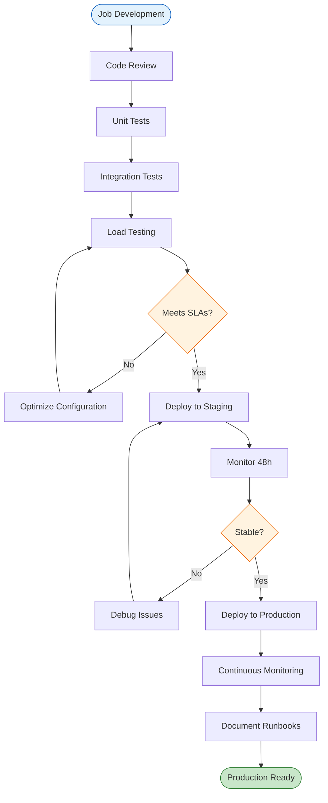
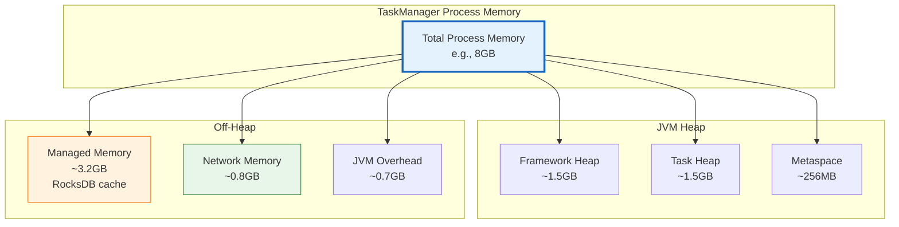

> **Status**: 🔮 Forward-looking | **Risk Level**: High | **Last Updated**: 2026-04
>
> Content described herein is in early planning stages and may differ from final releases. Please refer to official Apache Flink releases for authoritative information.

# Flink Best Practices (English)

> **Stage**: en/ | **Prerequisites**: [Flink Quick Start](./FLINK-QUICK-START.md), [System Architecture](./ARCHITECTURE.md) | **Formality Level**: L3

---

## 1. Definitions

### Def-EN-04: Production Readiness Criteria

A Flink job is considered **production-ready** when it satisfies the following criteria:

$$\text{ProductionReady} = (R_{reliability}, R_{observability}, R_{scalability}, R_{security}, R_{maintainability})$$

Where:

- $R_{reliability}$: Checkpoint success rate $\geq 99\%$, defined recovery procedures
- $R_{observability}$: Metrics, logging, and alerting fully instrumented
- $R_{scalability}$: Validated parallelism boundaries and resource headroom
- $R_{security}$: Network policies, secrets management, and access controls in place
- $R_{maintainability}$: Version-controlled deployment, documented runbooks

### Def-EN-05: Backpressure Severity Levels

**Backpressure** occurs when downstream operators consume data slower than upstream produces it. Severity is quantified as:

$$\text{BackpressureRatio}(op) = \frac{T_{blocked}}{T_{measured}}$$

| Ratio | Severity | Recommended Action |
|-------|----------|-------------------|
| 0% - 10% | Negligible | Monitor only |
| 10% - 30% | Mild | Review sink throughput |
| 30% - 70% | Moderate | Optimize bottleneck operator |
| > 70% | Severe | Scale bottleneck or reduce input rate |

### Def-EN-06: State Size Classifications

Flink job state sizes are categorized as follows:

| Classification | Size Range | Recommended Backend | Checkpoint Interval |
|----------------|-----------|---------------------|---------------------|
| Small state | < 1 GB | HashMapStateBackend | 10s - 60s |
| Medium state | 1 GB - 100 GB | EmbeddedRocksDBStateBackend | 1m - 5m |
| Large state | 100 GB - 1 TB | ForStStateBackend | 5m - 15m |
| Very large state | > 1 TB | Cloud-Native ForSt (Flink 2.3+) | 10m - 30m |

### Def-EN-07: Checkpoint Quality Score

The **Checkpoint Quality Score** ($CQS$) is a composite metric evaluating checkpoint health:

$$CQS = w_1 \cdot SuccessRate + w_2 \cdot \frac{1}{Duration_{norm}} + w_3 \cdot \frac{1}{Size_{norm}}$$

Where $w_1 + w_2 + w_3 = 1$. A $CQS \geq 0.9$ indicates excellent checkpoint health, while $CQS < 0.7$ warrants immediate investigation.

### Def-EN-08: Resource Headroom

**Resource Headroom** is the ratio of unused capacity to provisioned capacity, ensuring the job can absorb traffic spikes without violating SLAs:

$$Headroom = 1 - \frac{Utilization_{avg}}{Utilization_{target}}$$

A production-ready Flink deployment typically maintains $Headroom \geq 0.3$ (30%) for CPU and memory.

## 2. Properties

### Prop-EN-03: Checkpoint Interval Optimization

**Proposition**: The optimal checkpoint interval $\Delta t^*$ minimizes the total cost function:

$$C_{total}(\Delta t) = \frac{C_{checkpoint}}{\Delta t} + \frac{\Delta t}{2} \cdot \lambda_{failure} \cdot C_{replay}$$

Where:

- $C_{checkpoint}$: CPU and I/O cost per checkpoint
- $\lambda_{failure}$: Failure rate (failures per unit time)
- $C_{replay}$: Cost of reprocessing one unit time of data

**Optimal interval**:

$$\Delta t^* = \sqrt{\frac{2 \cdot C_{checkpoint}}{\lambda_{failure} \cdot C_{replay}}}$$

### Prop-EN-04: Network Buffer Configuration

**Proposition**: The minimum network memory $M_{network}$ required to avoid throughput collapse under peak load is:

$$M_{network} \geq \frac{R_{peak} \cdot L_{network} \cdot N_{slots}}{B_{record}}$$

Where:

- $R_{peak}$: Peak throughput (records/second)
- $L_{network}$: End-to-end network latency
- $N_{slots}$: Number of task slots per TaskManager
- $B_{record}$: Average serialized record size

### Lemma-EN-01: Source Parallelism Constraint

**Lemma**: For a Kafka source, the maximum effective parallelism is bounded by the number of topic partitions:

$$p_{source}^{effective} \leq N_{partitions}$$

Assigning $p_{source} > N_{partitions}$ creates idle subtasks and wastes resources.

### Prop-EN-05: Memory Configuration Invariant

**Proposition**: A valid TaskManager memory configuration must satisfy the following inequality:

$$M_{process} \geq M_{heap} + M_{managed} + M_{network} + M_{overhead}$$

Where each term is explicitly configured or derived. Violation of this invariant results in startup failure or runtime `OutOfMemoryError`.

### Prop-EN-06: Backpressure Propagation Monotonicity

**Proposition**: In a Flink DAG, if operator $op_i$ experiences backpressure, then all upstream operators $op_j \in Upstream(op_i)$ will eventually experience backpressure, assuming the network buffers are finite:

$$Backpressure(op_i) \Rightarrow \forall op_j \in Upstream(op_i): \lim_{t \to \infty} Backpressure(op_j, t) = true$$

## 3. Relations

### 3.1 Best Practices and the AnalysisDataFlow Knowledge Hierarchy

```
Struct/ (Formal Theory)
    └── Determinism, Consistency Proofs
        └── Knowledge/ (Design Patterns)
            └── Event Time Processing, Backpressure Mitigation
                └── Flink/ (Implementation)
                    └── This Best Practices Document
```

### 3.2 Relationship to SRE Principles

Flink production best practices align with Google SRE principles [^3]:

| SRE Principle | Flink Application |
|---------------|-------------------|
| Error budgets | Checkpoint failure budget: < 1% per day |
| Observability | Prometheus metrics + structured logging |
| Automation | GitOps deployment, auto-scaling policies |
| Blameless postmortems | Root-cause analysis for every incident |
| Capacity planning | Parallelism headroom, TM pool sizing |

### 3.3 Anti-patterns Relationship

Every best practice has a corresponding anti-pattern in [Knowledge/09-anti-patterns/](../Knowledge/09-anti-patterns/):

| Best Practice | Corresponding Anti-pattern |
|---------------|---------------------------|
| Use event time with watermarks | Ignoring event time, using processing time |
| Right-size parallelism | Setting parallelism to arbitrary large values |
| Enable incremental checkpoints | Taking full checkpoints for large state |
| Monitor backpressure | Deploying without backpressure visibility |

## 4. Argumentation

### 4.1 HashMapStateBackend vs. RocksDB

**Use HashMapStateBackend when**:

- State size is small (< 1 GB per TM)
- Latency requirements are extremely tight (sub-millisecond state access)
- Heap memory is abundant and GC is well-tuned

**Use EmbeddedRocksDBStateBackend when**:

- State size exceeds available heap
- Checkpoint size > 100 MB
- Job requires large keyed state (e.g., session windows)

**Use ForStStateBackend when**:

- Running Flink 2.0+ with demanding state workloads
- Seeking improved memory efficiency over standard RocksDB

### 4.2 When to Enable Unaligned Checkpoints

**Enable unaligned checkpoints** when:

- Checkpoint alignment duration consistently exceeds 1 second
- Pipeline has high parallelism (> 100) with long shuffle paths
- Latency is critical and exactly-once must be preserved

**Avoid unaligned checkpoints** when:

- State size is very large (in-flight buffers consume significant memory)
- Network bandwidth is constrained
- Checkpoint intervals are very short (< 100 ms)

### 4.3 Choosing Between DataStream and Table API

| Criterion | DataStream API | Table API / SQL |
|-----------|---------------|-----------------|
| Control level | Fine-grained | High-level declarative |
| Complex stateful logic | Excellent | Limited |
| Window customization | Full control | Built-in patterns |
| Team expertise | Java/Scala developers | SQL-first analysts |
| Optimization | Manual | Automatic by planner |
| CEP / pattern matching | Native support | SQL MATCH_RECOGNIZE |

**Recommendation**: Start with Table API / SQL for standard analytics; fall back to DataStream API for custom operators and complex state machines.

## 5. Engineering Argument

### Thm-EN-02: Production Configuration Invariant

**Theorem**: A production Flink configuration is valid if and only if the following inequalities are jointly satisfied:

$$\begin{cases}
M_{heap} \geq S_{state}^{heap} + M_{framework} + M_{overhead} \\
M_{managed} \geq S_{state}^{rocksdb} \cdot \rho_{cache} \\
M_{network} \geq N_{slots} \cdot B_{min} \\
\Delta t_{checkpoint} \geq T_{checkpoint}^{max} + T_{barrier}^{max}
\end{cases}$$

Where:
- $M_{heap}$: JVM heap memory
- $M_{managed}$: Off-heap managed memory
- $M_{network}$: Network buffer memory
- $\Delta t_{checkpoint}$: Checkpoint interval
- $T_{checkpoint}^{max}$: Maximum observed checkpoint duration
- $T_{barrier}^{max}$: Maximum barrier alignment time

**Engineering Corollary**: Violation of any single inequality leads to a predictable failure mode:
- Heap violation → OOM, frequent GC pauses
- Managed memory violation → RocksDB slowdown, disk thrashing
- Network memory violation → Backpressure, throughput collapse
- Checkpoint interval violation → Checkpoint timeouts, recovery degradation

## 6. Examples

### 6.1 Production-Ready flink-conf.yaml

```yaml
# ============================================
# Production Flink Configuration Template
# ============================================

# --- Core Execution ---
parallelism.default: 8
pipeline.max-parallelism: 128

# --- Checkpointing ---
execution.checkpointing.interval: 60s
execution.checkpointing.timeout: 600s
execution.checkpointing.min-pause-between-checkpoints: 30s
execution.checkpointing.max-concurrent-checkpoints: 1
execution.checkpointing.unaligned.enabled: false
state.backend.incremental: true
state.checkpoint-storage: filesystem
state.checkpoints.dir: s3://prod-flink-checkpoints

# --- State Backend ---
state.backend: rocksdb
state.backend.rocksdb.memory.managed: true
state.backend.rocksdb.predefined-options: FLASH_SSD_OPTIMIZED
state.backend.rocksdb.checkpoint.transfer.thread.num: 8

# --- Restart Strategy ---
restart-strategy: fixed-delay
restart-strategy.fixed-delay.attempts: 10
restart-strategy.fixed-delay.delay: 10s

# --- Memory ---
taskmanager.memory.process.size: 8192m
taskmanager.memory.managed.fraction: 0.4
taskmanager.memory.network.fraction: 0.1
taskmanager.memory.jvm-overhead.fraction: 0.2

# --- Metrics ---
metrics.reporters: prom
metrics.reporter.prom.class: org.apache.flink.metrics.prometheus.PrometheusReporter
metrics.reporter.prom.port: 9249
```

### 6.2 Backpressure-Resilient Job Structure

```java
import org.apache.flink.streaming.api.environment.StreamExecutionEnvironment;
import org.apache.flink.streaming.api.datastream.DataStream;
import org.apache.flink.connector.kafka.source.KafkaSource;
import org.apache.flink.connector.kafka.sink.KafkaSink;

public class ResilientStreamingJob {
    public static void main(String[] args) throws Exception {
        StreamExecutionEnvironment env =
            StreamExecutionEnvironment.getExecutionEnvironment();

        // Source: Match Kafka partitions for optimal parallelism
        KafkaSource<Event> source = KafkaSource.<Event>builder()
            .setBootstrapServers("kafka:9092")
            .setTopics("events")
            .setGroupId("flink-consumer")
            .setValueOnlyDeserializer(new EventDeserializationSchema())
            .build();

        DataStream<Event> stream = env
            .fromSource(source, WatermarkStrategy.forBoundedOutOfOrderness(
                Duration.ofSeconds(5)), "Kafka Source")
            .setParallelism(24);  // Match topic partition count

        // Processing with moderate parallelism
        DataStream<Result> processed = stream
            .keyBy(Event::getUserId)
            .process(new StatefulEventProcessor())
            .setParallelism(48);

        // Sink: Use async batching to prevent backpressure
        KafkaSink<Result> sink = KafkaSink.<Result>builder()
            .setBootstrapServers("kafka:9092")
            .setRecordSerializer(new ResultSerializer("results"))
            .setDeliveryGuarantee(DeliveryGuarantee.AT_LEAST_ONCE)
            .build();

        processed.sinkTo(sink).setParallelism(12);

        env.execute("Resilient Streaming Job");
    }
}
```

### 6.3 Kubernetes Deployment with Best Practices

```yaml
apiVersion: flink.apache.org/v1beta1
kind: FlinkDeployment
metadata:
  name: production-job
  namespace: flink-production
spec:
  image: flink:1.18.0-scala_2.12-java17
  flinkVersion: v1.18
  mode: native

  jobManager:
    resource:
      memory: "4096m"
      cpu: 2
    replicas: 1

  taskManager:
    resource:
      memory: "8192m"
      cpu: 4
    replicas: 5
    podTemplate:
      spec:
        affinity:
          podAntiAffinity:
            preferredDuringSchedulingIgnoredDuringExecution:
            - weight: 100
              podAffinityTerm:
                labelSelector:
                  matchExpressions:
                  - key: app
                    operator: In
                    values: ["production-job"]
                topologyKey: kubernetes.io/hostname
        containers:
        - name: flink-main-container
          resources:
            limits:
              memory: "10Gi"
              cpu: "4"
            requests:
              memory: "8192Mi"
              cpu: "4"

  flinkConfiguration:
    state.backend: rocksdb
    execution.checkpointing.interval: 60s
    restart-strategy: fixed-delay
    restart-strategy.fixed-delay.attempts: "10"
    metrics.reporters: prom

  job:
    jarURI: local:///opt/flink/usrlib/production-job.jar
    parallelism: 20
    upgradeMode: stateful
    state: running
```

### 6.4 Alerting Rules for Flink

```yaml
# Prometheus alerting rules for Flink production jobs
groups:
- name: flink-alerts
  rules:
  - alert: FlinkCheckpointFailure
    expr: |
      (
        sum(rate(flink_jobmanager_checkpoint_total_time_count{job=~"flink.*"}[5m]))
        -
        sum(rate(flink_jobmanager_checkpoint_number_of_completed_checkpoints{job=~"flink.*"}[5m]))
      ) / sum(rate(flink_jobmanager_checkpoint_total_time_count{job=~"flink.*"}[5m])) > 0.1
    for: 5m
    labels:
      severity: warning
    annotations:
      summary: "Flink checkpoint failure rate > 10%"

  - alert: FlinkBackpressureSevere
    expr: |
      avg(flink_taskmanager_job_task_backPressuredTimeMsPerSecond{job=~"flink.*"}) > 500
    for: 10m
    labels:
      severity: critical
    annotations:
      summary: "Flink task backpressure > 500ms/s average"

  - alert: FlinkJobRestartLoop
    expr: |
      increase(flink_jobmanager_job_numberOfRestarts{job=~"flink.*"}[30m]) > 3
    for: 0m
    labels:
      severity: critical
    annotations:
      summary: "Flink job restarting frequently"
```

## 罪可视化 (Visualizations)

### Production Deployment Checklist



### Memory Allocation Best Practice



### 6.5 Flink REST API for Operational Tasks

```bash
# List running jobs
curl http://localhost:8081/jobs

# Get job metrics
curl http://localhost:8081/jobs/<job-id>/metrics

# Trigger a savepoint
curl -X POST \
  http://localhost:8081/jobs/<job-id>/savepoints \
  -H 'Content-Type: application/json' \
  -d '{"cancel-job": false, "targetDirectory": "/savepoints"}'

# Cancel a job with savepoint
curl -X PATCH \
  http://localhost:8081/jobs/<job-id>?mode=savepoint \
  -H 'Content-Type: application/json' \
  -d '{"targetDirectory": "/savepoints"}'
```

### 6.6 Docker Compose Production Template

```yaml
version: '3.8'

services:
  jobmanager:
    image: flink:1.18.0-scala_2.12-java17
    hostname: jobmanager
    ports:
      - "8081:8081"
    environment:
      - JOB_MANAGER_RPC_ADDRESS=jobmanager
      - FLINK_PROPERTIES=
          jobmanager.memory.process.size=4096m
          metrics.reporters=prom
          metrics.reporter.prom.class=org.apache.flink.metrics.prometheus.PrometheusReporter
    command: jobmanager

  taskmanager:
    image: flink:1.18.0-scala_2.12-java17
    environment:
      - JOB_MANAGER_RPC_ADDRESS=jobmanager
      - FLINK_PROPERTIES=
          taskmanager.memory.process.size=8192m
          taskmanager.numberOfTaskSlots=4
          state.backend=rocksdb
          execution.checkpointing.interval=60s
    command: taskmanager
    deploy:
      replicas: 3
    volumes:
      - ./rocksdb-state:/opt/flink/rocksdb-state

  prometheus:
    image: prom/prometheus:latest
    ports:
      - "9090:9090"
    volumes:
      - ./prometheus.yml:/etc/prometheus/prometheus.yml

  grafana:
    image: grafana/grafana:latest
    ports:
      - "3000:3000"
    environment:
      - GF_SECURITY_ADMIN_PASSWORD=admin
```

### 6.7 Schema Evolution Best Practices

```java
// Use Avro for built-in schema evolution support
@AvroTypeInfo(record = UserEvent.class)
public class UserEvent {
    private String userId;
    private String eventType;
    private long timestamp;
    // Adding new fields with defaults enables backward compatibility
    private String platform = "web";
}

// In Flink SQL, use explicit type casting for safe schema changes
// ALTER TABLE user_events ADD COLUMN platform STRING AFTER event_type;
```

### 6.8 Security Checklist Configuration

```yaml
# Enable SSL for internal communication
security.ssl.internal.enabled: true
security.ssl.internal.keystore: /secrets/flink.keystore
security.ssl.internal.truststore: /secrets/flink.truststore
security.ssl.internal.keystore-password: ${KEYSTORE_PASSWORD}

# Enable authentication for Web UI and REST API
security.auth.enabled: true
security.auth.ldap.url: ldaps://ldap.company.com:636

# Kerberos for Kafka connector
connector.kafka.properties.security.protocol: SASL_SSL
connector.kafka.properties.sasl.mechanism: GSSAPI
connector.kafka.properties.sasl.kerberos.service.name: kafka
```

## 8. References

[^1]: Apache Flink Documentation, "Production Readiness Checklist", 2025. https://nightlies.apache.org/flink/flink-docs-stable/docs/deployment/production_ready/
[^2]: Apache Flink Documentation, "State Backends", 2025. https://nightlies.apache.org/flink/flink-docs-stable/docs/ops/state/state_backends/
[^3]: B. Beyer et al., "Site Reliability Engineering", O'Reilly Media, 2016.
[^4]: Apache Flink Documentation, "Monitoring Backpressure", 2025. https://nightlies.apache.org/flink/flink-docs-stable/docs/ops/monitoring/back_pressure/
[^5]: Apache Flink Documentation, "Checkpointing", 2025. https://nightlies.apache.org/flink/flink-docs-stable/docs/dev/datastream/fault-tolerance/checkpointing/
[^6]: Apache Flink Documentation, "SSL Setup", 2025. https://nightlies.apache.org/flink/flink-docs-stable/docs/deployment/security/ssl_setup/
[^7]: M. Kleppmann, "Designing Data-Intensive Applications", O'Reilly Media, 2017.

## Appendix: Extended Topics

### A.1 Flink Connector Ecosystem Overview

Flink provides a rich ecosystem of connectors for integrating with external systems:

| Connector | Source | Sink | Exactly-Once | Best For |
|-----------|--------|------|--------------|----------|
| Kafka | ✅ | ✅ | ✅ (0.11+) | Primary streaming ingestion |
| Kinesis | ✅ | ✅ | ✅ | AWS-native deployments |
| Pulsar | ✅ | ✅ | ✅ | Multi-tenant messaging |
| JDBC | ✅ | ✅ | ⚠️ (idempotent writes) | Relational databases |
| Elasticsearch | ❌ | ✅ | ❌ | Search indexes |
| Files (Parquet/ORC) | ✅ | ✅ | ✅ | Lakehouse integration |
| Redis | ❌ | ✅ | ❌ | Caching layer |

### A.2 Testing Flink Applications

Flink provides several utilities for testing stream processing logic:

`java
import org.apache.flink.streaming.util.TestBaseUtils;

public class MyJobTest {
    @Test
    public void testWindowAggregation() throws Exception {
        StreamExecutionEnvironment env =
            StreamExecutionEnvironment.getExecutionEnvironment();
        env.setParallelism(1);

        DataStream<Event> input = env.fromElements(
            new Event("user1", 1, Instant.parse("2024-01-01T00:00:00Z")),
            new Event("user1", 2, Instant.parse("2024-01-01T00:00:30Z")),
            new Event("user1", 3, Instant.parse("2024-01-01T00:01:00Z"))
        );

        DataStream<Result> result = input
            .assignTimestampsAndWatermarks(
                WatermarkStrategy.<Event>forMonotonousTimestamps()
                    .withTimestampAssigner((e, ts) -> e.getTimestamp())
            )
            .keyBy(Event::getUserId)
            .window(TumblingEventTimeWindows.of(Time.minutes(1)))
            .aggregate(new SumAggregator());

        // Collect results using DataStreamUtils
        List<Result> results = DataStreamUtils.collect(result);
        assertEquals(1, results.size());
        assertEquals(3, results.get(0).getSum());
    }
}
`

### A.3 Common Pitfalls for Beginners

1. **Forgetting to call env.execute()**: Without this, Flink only builds the execution graph but does not run the job.
2. **Incorrect watermark strategy**: Using orMonotonousTimestamps() with out-of-order data leads to late data drops.
3. **Sharing mutable state in UDFs**: Flink UDFs are serialized and distributed; mutable static fields cause unpredictable behavior.
4. **Mismatched parallelism**: Setting source parallelism higher than Kafka partitions creates idle subtasks.

## Extended Guide: Production Deployment Scenarios

### B.1 Small-Scale Development Cluster

For teams getting started with Flink, a minimal viable production cluster can be deployed on a single node or small VM set:

`yaml
# Minimal docker-compose.yml for team development
version: '3.8'
services:
  jobmanager:
    image: flink:1.18.0-scala_2.12-java17
    ports:
      - "8081:8081"
    environment:
      - JOB_MANAGER_RPC_ADDRESS=jobmanager
    command: jobmanager
  taskmanager:
    image: flink:1.18.0-scala_2.12-java17
    environment:
      - JOB_MANAGER_RPC_ADDRESS=jobmanager
    command: taskmanager
`

Best practices for this scale:
- Use HashMapStateBackend to avoid RocksDB setup complexity
- Disable checkpointing during initial development
- Set parallelism to 1-2 for easy debugging

### B.2 Medium-Scale Production on Kubernetes

For processing 10K-500K events/second with moderate state (1-100 GB):

- Deploy with Flink Kubernetes Operator
- Use RocksDBStateBackend with incremental checkpoints to S3
- Configure HPA for TaskManagers based on CPU (target 70%)
- Set up Prometheus + Grafana for observability
- Use Application Mode for job isolation

### B.3 Large-Scale Multi-Region Deployment

For enterprises processing billions of events daily with TB-level state:

- Deploy separate Flink clusters per region
- Use Kafka MirrorMaker or equivalent for cross-region replication
- Store checkpoints in region-local object storage
- Implement blue-green deployment for zero-downtime upgrades
- Use Cloud-Native ForSt (Flink 2.3+) for cost-effective state tiering

### B.4 Troubleshooting Common Runtime Issues

**Issue: Job fails with ClassNotFoundException for connector classes**
- **Root cause**: The connector jar is not in the classpath of the TaskManager
- **Fix**: Include the connector dependency in your fat jar or mount it to /opt/flink/lib/

**Issue: Watermarks are not advancing and windows never fire**
- **Root cause**: One parallel subtask is not receiving data (e.g., idle Kafka partition)
- **Fix**: Use WatermarkStrategy.withIdleness(Duration.ofMinutes(1))

**Issue: Checkpoint times increase continuously**
- **Root cause**: State size growing without TTL, or slow checkpoint storage
- **Fix**: Enable state TTL, use incremental checkpoints, switch to faster storage

**Issue: High latency despite low CPU usage**
- **Root cause**: Network buffer bloat or GC pauses
- **Fix**: Enable buffer debloat, tune GC settings (G1/ZGC), profile heap usage

## C. Reference: Configuration Parameter Quick Lookup

### C.1 Core Execution Parameters

| Parameter | Default | Description |
|-----------|---------|-------------|
| parallelism.default | 1 | Default parallelism for all operators |
| pipeline.max-parallelism | 128 | Upper bound for rescaling |
| execution.checkpointing.interval | disabled | How often to trigger checkpoints |
| execution.checkpointing.timeout | 10 min | Maximum time for a checkpoint to complete |
|
estart-strategy | fixed-delay | Strategy for recovering from failures |

### C.2 Memory Parameters

| Parameter | Default | Description |
|-----------|---------|-------------|
|  askmanager.memory.process.size | - | Total memory for the TaskManager process |
|  askmanager.memory.managed.fraction | 0.4 | Fraction of process memory for managed off-heap |
|  askmanager.memory.network.fraction | 0.1 | Fraction of process memory for network buffers |
|  askmanager.memory.jvm-overhead.fraction | 0.1 | Fraction reserved for JVM overhead |

### C.3 State Backend Parameters

| Parameter | Default | Description |
|-----------|---------|-------------|
| state.backend | hashmap | State backend implementation |
| state.backend.incremental | false | Whether to enable incremental checkpoints |
| state.checkpoint-storage | jobmanager | Where to store checkpoint data |
| state.checkpoints.dir | - | Filesystem path for checkpoint storage |

### C.4 Network Parameters

| Parameter | Default | Description |
|-----------|---------|-------------|
|  askmanager.memory.network.buffer-debloat.enabled | false | Dynamically reduce buffer sizes for lower latency |
|  askmanager.network.memory.buffer-size | 32768 | Size of each network buffer |
|  askmanager.network.memory.floating-buffers-per-gate | 8 | Extra buffers for credit-based flow control |

### 6.9 Flink on AWS Deployment Best Practices

When deploying Flink on AWS, consider the following recommendations:
- Use **Amazon MSK** (Managed Kafka) for durable, scalable ingestion
- Store checkpoints and savepoints in **S3** with versioning enabled for disaster recovery
- Deploy TaskManagers on **EC2 Spot Instances** for cost savings, keeping JobManager on On-Demand for stability
- Use **Application Load Balancer** in front of the Flink Web UI with OAuth authentication
- Monitor with **CloudWatch** and **Amazon Managed Prometheus** for metrics aggregation

### 6.10 Flink on Azure Deployment Best Practices

For Azure deployments:
- Use **Azure Event Hubs** with Kafka compatibility layer as the source
- Store state snapshots in **Azure Blob Storage** with lifecycle policies
- Deploy on **AKS** (Azure Kubernetes Service) with virtual node scaling for burst capacity
- Integrate **Azure Monitor** and **Application Insights** for distributed tracing
- Use **Azure Key Vault** for managing secrets and SSL certificates

---

*Document Version: v1.0 | Updated: 2026-04-13 | Status: Complete*
