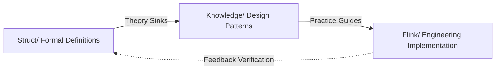
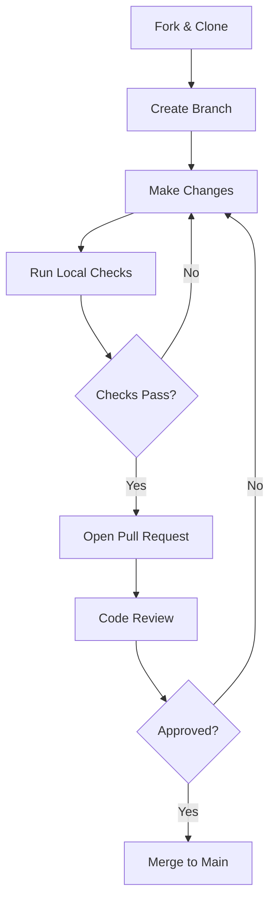
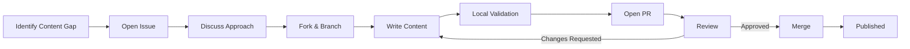
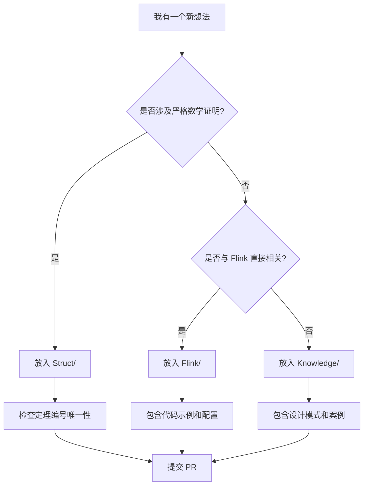
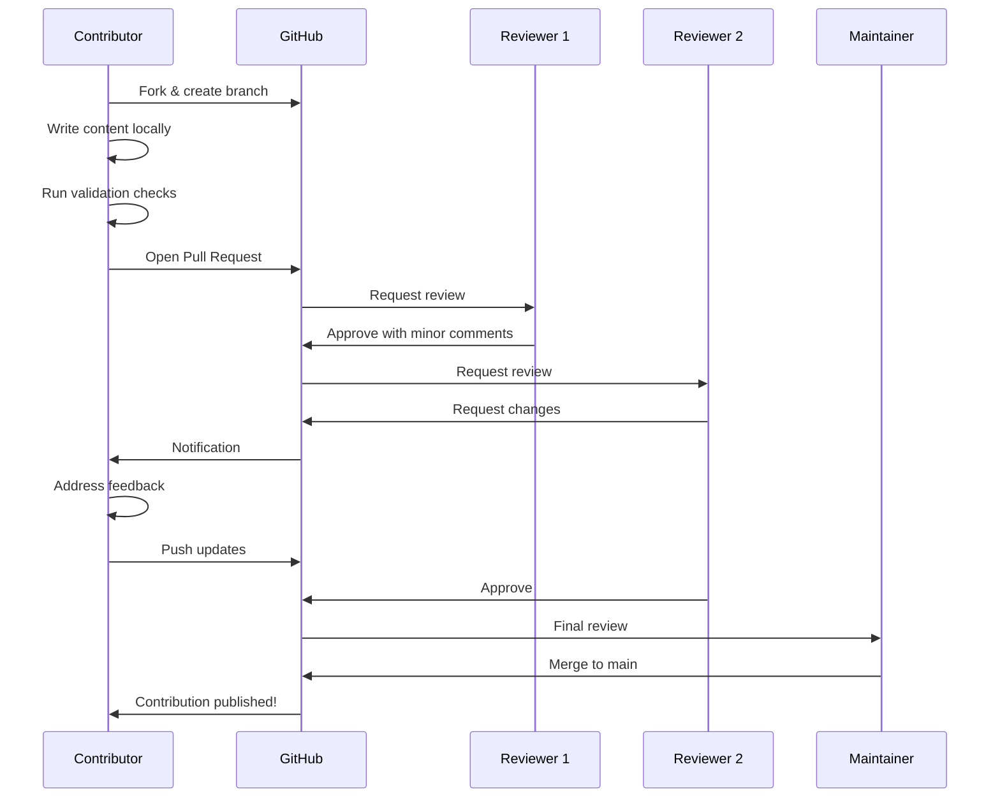

# Contributing to AnalysisDataFlow

> **Stage**: `en/` | **Prerequisites**: [README.md](./README.md), [QUICK-START.md](./QUICK-START.md) | **Formalization Level**: L2

Welcome to the AnalysisDataFlow community! This guide will help you understand how to contribute effectively to our unified knowledge repository for stream computing.

## 1. Project Overview

### Def-EN-01: AnalysisDataFlow Contribution Scope

**AnalysisDataFlow** is a comprehensive knowledge system spanning formal theory, engineering practice, and Flink-specific technology. A contribution $\mathcal{C}$ is defined as any additive change to the knowledge graph:

$$\mathcal{C} = (\mathcal{A}, \mathcal{M}, \mathcal{R}, \mathcal{V})$$

Where:

- $\mathcal{A}$: Author identity and CLA signature
- $\mathcal{M}$: Modified or new Markdown documents
- $\mathcal{R}$: Relationships (cross-references) added to the knowledge graph
- $\mathcal{V}$: Validation status (linting, link checking, theorem numbering)

### Def-EN-02: Contribution Classification

We classify contributions into four tiers based on scope and required review depth:

| Tier | Type | Examples | Reviewers Required |
|------|------|----------|-------------------|
| Tier 1 | Typo / Link fix | Fixing broken URLs, spelling corrections | 1 |
| Tier 2 | Content improvement | Expanding a section, adding examples | 2 |
| Tier 3 | New document | Creating a full article in any directory | 2-3 |
| Tier 4 | Structural change | Modifying templates, AGENTS.md, CI workflows | 3+ |

## 2. Getting Started

### 2.1 Prerequisites

Before making your first contribution, ensure you have:

1. A GitHub account
2. Basic understanding of Markdown and Mermaid
3. Familiarity with the project's three main output directories: `Struct/`, `Knowledge/`, `Flink/`
4. For Tier 3+ contributions, understanding of the six-section template

### 2.2 Fork and Clone

```bash
# Fork the repository on GitHub first, then clone your fork
git clone https://github.com/YOUR_USERNAME/AnalysisDataFlow.git
cd AnalysisDataFlow

# Add the upstream remote
git remote add upstream https://github.com/ORIGINAL_OWNER/AnalysisDataFlow.git
```

### 2.3 Branch Naming Convention

Use descriptive branch names with the following prefixes:

```
docs-{topic}-{brief-description}
fix-{file-or-topic}-{brief-description}
feat-{directory}-{brief-description}
```

Examples:

- `docs-flink-23-cloud-native-enhancements`
- `fix-knowledge-broken-cross-references`
- `feat-struct-add-distributed-consistency-proofs`

## 3. Content Standards

### 3.1 Six-Section Template (Mandatory for Core Documents)

Every core Markdown document in `Struct/`, `Knowledge/`, or `Flink/` must follow this structure:

```markdown
# Title

> Stage: Struct/ | Prerequisites: [link] | Formalization Level: L1-L6

## 1. Definitions
Strict formal definitions + intuitive explanations. At least one `Def-*` label.

## 2. Properties
Lemmas and properties derived from definitions. At least one `Lemma-*` or `Prop-*` label.

## 3. Relations
Connections to other concepts, models, or systems.

## 4. Argumentation
Auxiliary theorems, counter-examples, boundary discussions.

## 5. Proof / Engineering Argument
Complete proof of main theorems or rigorous engineering justification.

## 6. Examples
Simplified examples, code snippets, configuration samples, real-world cases.

## 7. Visualizations
At least one Mermaid diagram.

## 8. References
Centralized bibliography using `[^n]` superscript format.
```

### 3.2 Theorem Numbering System

Use globally unified numbering for `Struct/` and recommended style for other directories:

```markdown
### Thm-S-01-01: Main Theorem Title
...

### Lemma-S-01-02: Supporting Lemma Title
...

### Def-F-04-01: Flink Definition Title
...
```

### 3.3 Mermaid Diagram Requirements

All Mermaid diagrams must:

- Be wrapped in ` ```mermaid ` code blocks
- Have a brief textual explanation before the diagram
- Use appropriate diagram types (`graph TB/TD`, `flowchart TD`, `stateDiagram-v2`, `classDiagram`)

Example:

```markdown
The following diagram illustrates the knowledge flow from theory to practice:



```

## 4. Contribution Workflow

### 4.1 Issue-First Policy

For Tier 3 and Tier 4 contributions, **open an issue first** to discuss the proposed changes. This avoids duplicate work and ensures alignment with project direction.

Issue template selection:
- **Content Gap**: For missing documents or incomplete sections
- **Correction**: For factual errors or outdated information
- **Enhancement**: For structural or tooling improvements

### 4.2 Pull Request Process



### 4.3 PR Description Template

When opening a pull request, use the following template:

```markdown
## Summary
Brief description of what this PR does.

## Changes Made
- Item 1
- Item 2

## Type of Contribution
- [ ] Tier 1: Typo / Link fix
- [ ] Tier 2: Content improvement
- [ ] Tier 3: New document
- [ ] Tier 4: Structural change

## Checklist
- [ ] I have read the AGENTS.md guidelines
- [ ] New documents follow the six-section template
- [ ] All cross-references use relative paths
- [ ] Mermaid diagrams render correctly
- [ ] Theorem / definition numbering is consistent
- [ ] References use `[^n]` format

## Related Issues
Closes #{issue_number}
```


## 5. Local Validation

Before submitting a pull request, run the following validation steps locally:

### 5.1 Link Checking

Ensure all internal cross-references use relative paths and do not point to non-existent files:

```bash
# Example using markdown-link-check (Node.js)
npx markdown-link-check docs/my-new-document.md
```

### 5.2 Mermaid Rendering

Verify that Mermaid diagrams are syntactically correct. You can use the Mermaid Live Editor or the VS Code Mermaid extension:

```bash
# If using the VS Code CLI
code --install-extension bierner.markdown-mermaid
```

### 5.3 Theorem Numbering Consistency

For documents in `Struct/`, ensure theorem and definition numbers do not conflict with existing documents in the same directory. Run the theorem registry check script if available:

```bash
python .scripts/quality-gates/check-theorem-registry.py
```

## 6. Review Process

### 6.1 What Reviewers Look For

Every PR is evaluated against the following dimensions:

| Dimension | Weight | Description |
|-----------|--------|-------------|
| Accuracy | 30% | Factual correctness, up-to-date information |
| Completeness | 25% | Coverage of the six-section template (for core docs) |
| Clarity | 20% | Readable structure, precise terminology |
| Consistency | 15% | Matching project style, correct numbering, valid references |
| Maintainability | 10% | Sustainable diagrams, stable external links |

### 6.2 Addressing Review Feedback

When a reviewer requests changes:

1. Make the requested modifications in your local branch
2. Run the local validation steps again
3. Push the new commits to the same PR branch
4. Reply to each review comment to confirm the change or ask for clarification

**Do not force-push** unless specifically asked, as this makes it harder for reviewers to track incremental changes.

## 7. Special Contribution Types

### 7.1 Adding a New Document to `Struct/`

Documents in `Struct/` are the theoretical foundation of the project. They must include:

- At least one formal definition with a `Def-S-*` label
- At least one lemma or proposition with a `Lemma-S-*` or `Prop-S-*` label
- At least one theorem with a `Thm-S-*` label (for advanced documents)
- Complete proofs or rigorous engineering arguments
- Citations to peer-reviewed papers or authoritative textbooks

### 7.2 Adding a New Document to `Flink/`

Documents in `Flink/` should bridge theory and practice. They must include:

- Architecture diagrams using Mermaid
- Code snippets or configuration examples
- Compatibility notes and version-specific warnings
- Cross-references to `Struct/` for theoretical backing and `Knowledge/` for design patterns

### 7.3 Translating to `en/`

The `en/` directory provides English versions of core project documents. Translation contributions should:

- Preserve the structure and formalization level of the source document
- Use domain-standard English terminology
- Maintain cross-reference paths relative to the `en/` directory
- Add the original document link in the front matter

## 8. Community Guidelines

### 8.1 Code of Conduct

All contributors are expected to adhere to the [Code of Conduct](../docs/contributing/code-of-conduct.md). Be respectful, constructive, and inclusive in all interactions.

### 8.2 Communication Channels

- **GitHub Issues**: For bug reports, content gaps, and feature requests
- **GitHub Discussions**: For open-ended questions and architecture debates
- **Pull Requests**: For concrete code and content changes

### 8.3 Recognition

We recognize contributors in the following ways:

- **CONTRIBUTORS.md**: Listed by username for merged PRs
- **Release Notes**: Highlighted for significant new documents or structural improvements
- **Community Spotlight**: Monthly shout-outs for outstanding contributions

## 9. Visualizations

### 9.1 Contribution Workflow Overview



This diagram illustrates the full lifecycle of a contribution, from identifying a need to seeing the content live in the repository.

## 10. References


### 7.4 Code Review Checklist for Reviewers

When reviewing a pull request, use this checklist to ensure consistent quality:

**Content Accuracy**

- [ ] Facts are correct and citations are provided for claims
- [ ] Code examples compile and match the described behavior
- [ ] Configuration snippets use current syntax and defaults

**Structural Compliance**

- [ ] Core documents follow the six-section template
- [ ] Mermaid diagrams render without syntax errors
- [ ] Cross-references use relative paths

**Style and Consistency**

- [ ] Theorem/definition numbering does not conflict with existing documents
- [ ] File naming uses lowercase hyphenated format
- [ ] References use `[^n]` superscript format

**Accessibility**

- [ ] Complex diagrams have textual explanations
- [ ] Acronyms are defined on first use
- [ ] Code blocks specify the language for syntax highlighting

### 8.4 Frequently Asked Questions for New Contributors

**Q: Can I contribute a translation to a language other than English?**
A: Yes. We maintain i18n directories under `i18n/`. Please coordinate via GitHub Issues first to avoid duplicate translation efforts.

**Q: What if I find a broken link but don't know the correct replacement?**
A: Open an issue describing the broken link and where you found it. Another community member can help identify the correct URL.

**Q: Can I add my company's Flink use case to the case studies?**
A: Absolutely. Case studies are community-driven. Follow the template in `case-studies/README.md` and submit a Tier 3 PR.

**Q: How formal does a `Knowledge/` document need to be?**
A: `Knowledge/` documents should be rigorous but accessible. They need definitions and properties, but full mathematical proofs are optional unless the topic demands them.

**Q: What happens if my PR fails the automated checks?**
A: Our CI pipeline runs link checking and Mermaid syntax validation. If these fail, please fix the issues and push an update. Maintainers will re-run the checks automatically.

## 9. Visualizations

### 9.2 Project Directory Decision Tree



This decision tree helps contributors quickly determine where their new content belongs.

## 10. References


### 7.5 Document Translation Guidelines

When translating existing documents into English for the `en/` directory, adhere to these language-specific guidelines:

**Terminology Consistency**

- Use established English equivalents for domain terms. For example:
  - 流计算 → Stream computing (not "flow computing")
  - 批流一体 → Batch-stream unification
  - 水位线 → Watermark
  - 检查点 → Checkpoint
  - 状态后端 → State backend
- Maintain a project-wide glossary. If you introduce a new term, add it to `en/GLOSSARY.md` in a separate PR.

**Formatting for English Readers**

- Use Oxford commas in lists of three or more items
- Prefer active voice in procedural sections ("Run the script" rather than "The script should be run")
- Use sentence case for headings (e.g., "Code review process" rather than "Code Review Process")
- Spell out acronyms on first use in each document

**Cross-Reference Adaptation**

- Update all relative links to point to `en/` counterparts where available
- If an `en/` version of a linked document does not yet exist, link to the Chinese version with a note: `[中文版本](../path/to/doc.md)`

### 8.5 Contributor Recognition Program

We value every contribution, from typo fixes to major theoretical additions. Our recognition program includes:

**First Contribution Badge**
New contributors who merge their first PR receive a shout-out in the monthly community update and a digital badge they can display on their GitHub profile.

**Area Maintainer Path**
Contributors who consistently improve a specific area (e.g., `Flink/06-ai-ml/` or `Struct/04-proofs/`) may be invited to become an Area Reviewer, with merge rights for that directory subject to maintainer oversight.

**Annual Contributor Awards**
At the end of each year, we recognize outstanding contributors in the following categories:

- **Document of the Year**: Best new document added to the repository
- **Theory-to-Practice Bridge**: Best document connecting `Struct/` to `Flink/`
- **Community Champion**: Most helpful reviewer or mentor

## 10. Extended Examples

### 10.1 Automated Pre-Commit Hook for Link Checking

You can set up a Git pre-commit hook to catch broken internal links before pushing:

```bash
#!/bin/sh
# .git/hooks/pre-commit

echo "Running markdown link check..."

# Check all modified .md files
for file in $(git diff --cached --name-only --diff-filter=ACM | grep '\.md$'); do
    npx markdown-link-check "$file" --quiet
    if [ $? -ne 0 ]; then
        echo "Link check failed for $file"
        exit 1
    fi
done

echo "All checks passed."
```

Save this script as `.git/hooks/pre-commit` and make it executable:

```bash
chmod +x .git/hooks/pre-commit
```

### 10.2 Issue Template for Content Gaps

When opening an issue to report missing content, use this structure in the issue body:

```markdown
## Missing Content Report

### Location
- Directory: `Flink/06-ai-ml/`
- Related documents: `flink-ml-inference-patterns.md`

### Description
There is currently no document covering the integration of Flink with ONNX Runtime for GPU-accelerated inference.

### Expected Content
- Architecture diagram showing Flink + ONNX Runtime on Kubernetes
- Code example for batch inference in a Flink ProcessFunction
- Performance benchmark comparing CPU vs GPU inference latencies

### Priority
- [ ] High (blocks learning path)
- [x] Medium (nice to have)
- [ ] Low (advanced/edge case)
```

### 10.3 Pull Request Discussion Example

Below is an example of a constructive review comment and response:

**Reviewer Comment:**
> The theorem numbering `Thm-F-06-02` conflicts with an existing theorem in `flink-ml-state-management.md`. Please renumber to `Thm-F-06-05` to maintain uniqueness.

**Contributor Response:**
> Good catch! I've updated the numbering to `Thm-F-06-05` and also ran the theorem registry check script to ensure no other conflicts exist. See commit `a1b2c3d`.

This level of specificity and follow-through keeps the review process efficient and collaborative.

## 11. Governance and Decision Making

### 11.1 Content Approval Tiers

| Decision | Required Approval | Typical Timeline |
|----------|-------------------|------------------|
| Tier 1 PR merge | 1 reviewer | 1-3 days |
| Tier 2 PR merge | 2 reviewers | 3-7 days |
| Tier 3 PR merge | 2 reviewers + 1 maintainer | 7-14 days |
| Tier 4 structural change | Majority of maintainers | 14-30 days |
| New directory creation | Majority of maintainers + AGENTS.md update | 14-30 days |

### 11.2 Dispute Resolution

If a contributor and reviewer cannot reach agreement on a PR:

1. Both parties summarize their positions in the PR thread
2. A neutral maintainer is assigned to mediate
3. If consensus cannot be reached within 7 days, the maintainer makes a binding decision based on project values (accuracy, completeness, consistency, clarity)

## 12. Visualizations

### 12.1 Complete Contribution Lifecycle Sequence Diagram



This sequence diagram illustrates the collaborative review process, emphasizing the iterative nature of high-quality contributions.

## 13. References


### 10.4 Step-by-Step Example: Submitting a Tier 3 Document

This walkthrough demonstrates how a contributor named Alex creates and submits a new `Flink/` document from idea to merge.

**Step 1: Identify the Gap**
Alex notices that `Flink/06-ai-ml/` has extensive inference pattern documents but lacks a dedicated guide on model versioning and rollback strategies. Alex opens an issue titled `[Content Gap] Flink ML Model Versioning and Rollback Guide` and receives maintainer approval within two days.

**Step 2: Research and Outline**
Alex drafts an outline following the six-section template:

- Definitions: Model version state, rollback boundary
- Properties: Compatibility lemmas for version switches
- Relations: Links to existing inference and checkpoint documents
- Argumentation: Discussion of hot-swap vs stop-resume strategies
- Proof/Engineering Argument: Formal argument for zero-downtime model updates via broadcast state
- Examples: Java code for broadcast state model switching
- Visualizations: Mermaid state diagram for model lifecycle
- References: Flink docs, ML system design papers

**Step 3: Local Development**
Alex creates a branch `docs-flink-ml-model-versioning` and writes the document in `Flink/06-ai-ml/flink-ml-model-versioning.md`. Alex runs:

```bash
npx markdown-link-check Flink/06-ai-ml/flink-ml-model-versioning.md
python .scripts/quality-gates/check-theorem-registry.py
```

Both checks pass.

**Step 4: Open PR**
Alex submits a PR with the template filled out, linking to the previously opened issue. Two reviewers provide feedback:

- Reviewer 1 suggests adding a configuration example for `MapStateDescriptor` TTL.
- Reviewer 2 points out a broken cross-reference to a document that moved in a recent reorganization.

**Step 5: Address Feedback**
Alex adds the TTL example, fixes the cross-reference, and pushes a new commit. Reviewers approve.

**Step 6: Merge**
A maintainer merges the PR. The document is live, the issue is closed, and Alex is added to `CONTRIBUTORS.md` in the next monthly update.

### 10.5 Markdown Style Quick Reference

To ensure consistency, follow these Markdown conventions:

**Headings**

```markdown
# Document Title (H1, only one per document)
## Major Section (H2)
### Subsection (H3)
#### Detail Level (H4, use sparingly)
```

**Tables**
Use pipe tables with header alignment for readability:

```markdown
| Column A | Column B | Column C |
|----------|----------|----------|
| Value 1  | Value 2  | Value 3  |
```

**Code Blocks**
Always specify the language for syntax highlighting:

```markdown
```java
public class Example { }
```

```

**Mathematical Expressions**
For inline math, use `$$...$$`. For block equations, use separate lines:
```markdown
$$
E = mc^2
$$
```

**Callouts and Admonitions**
Use blockquotes for important notes:

```markdown
> **Note**: This configuration requires Flink 2.3 or later.
```

### 10.6 External Link Maintenance Policy

External links in documentation can rot over time. We mitigate this through:

- **Preferred sources**: Official documentation, DOI-resolved papers, and major publisher sites
- **Archive links**: For blog posts or conference slides, consider linking to an archived version (e.g., archive.org) alongside the original
- **Annual link audit**: Automated CI runs a full link check on the repository every quarter
- **Issue reporting**: If you find a broken link, open a Tier 1 issue or PR to fix it

## 14. References
