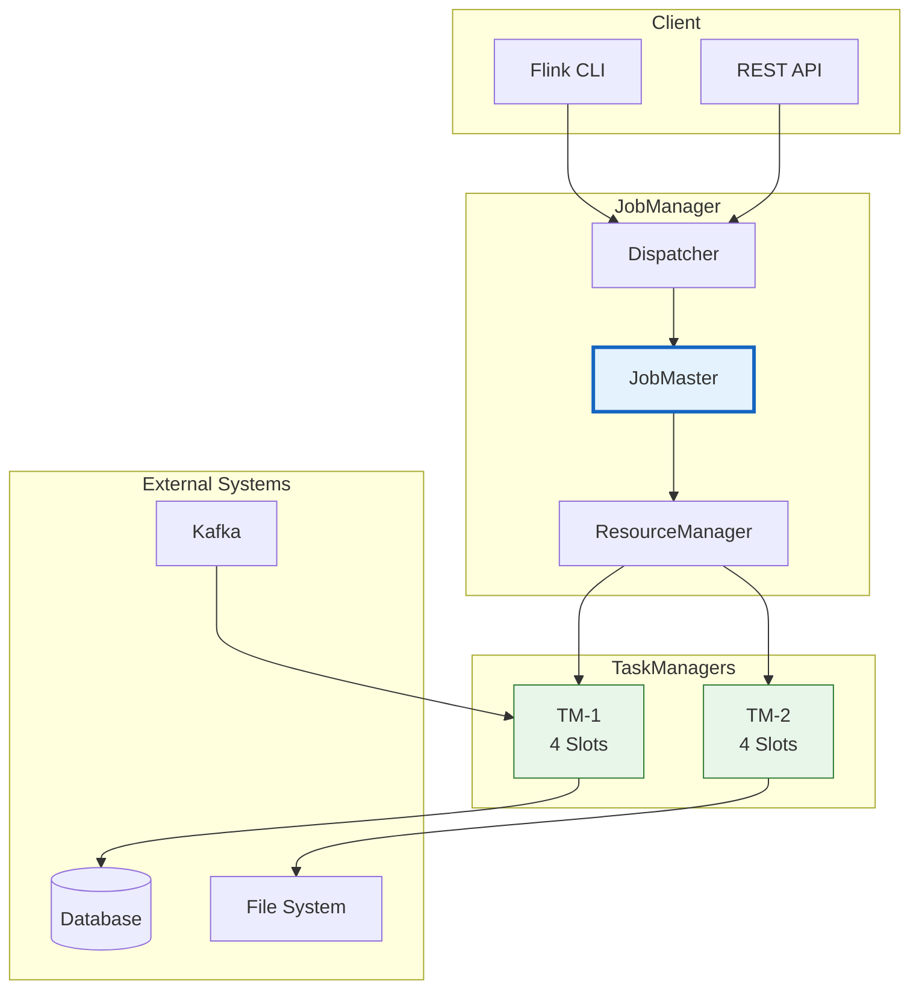
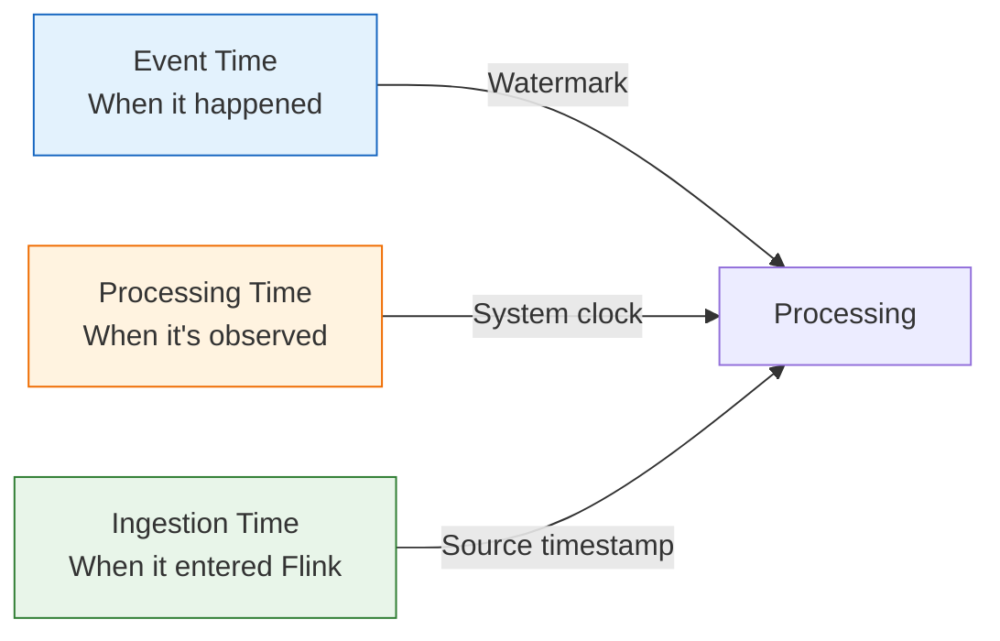

> **Status**: 🔮 Forward-looking | **Risk Level**: High | **Last Updated**: 2026-04
>
> Content described herein is in early planning stages and may differ from final releases. Please refer to official Apache Flink releases for authoritative information.

# Flink Quick Start Guide (English)

> **Stage**: en/ | **Prerequisites**: [AnalysisDataFlow README](./README.md), [System Architecture](./ARCHITECTURE.md) | **Formality Level**: L2

---

## 1. Definitions

### Def-EN-01: Flink Deployment Modes

**Apache Flink** supports three primary deployment modes, each optimized for different operational requirements:

$$\text{DeploymentModes} = \{Session, Application, Per\text{-}Job\}$$

| Mode | Lifecycle | Resource Isolation | Startup Latency | Best For |
|------|-----------|-------------------|-----------------|----------|
| **Session** | Long-running cluster | Shared across jobs | Low (seconds) | Development, multiple small jobs |
| **Application** | One cluster per application | Strong isolation | Medium (tens of seconds) | Production microservices |
| **Per-Job** | One cluster per job | Complete isolation | High (minutes) | Legacy deployments (deprecated in Flink 1.15+) |

### Def-EN-02: Stream Processing Pipeline

A **Flink Stream Processing Pipeline** is defined as a directed acyclic graph (DAG) of transformations applied to an unbounded data stream:

$$Pipeline = (Sources, Transformations, Sinks)$$

Where:

- $Sources$: Data ingestion points (Kafka, files, sockets, etc.)
- $Transformations$: Computational operators (map, filter, window, join)
- $Sinks$: Data emission points (databases, message queues, files)

### Def-EN-03: Parallelism and Slots

**Parallelism** ($p$) is the number of parallel instances of an operator. A **Task Slot** is the unit of resource allocation within a TaskManager:

$$N_{slots}^{TM} \geq \max_{op \in Pipeline}(p_{op})$$

Slot sharing allows multiple operators from the same pipeline to coexist in one slot, improving resource utilization.

### Def-EN-04: Watermark Strategy

A **Watermark Strategy** defines how event-time progress is tracked in a Flink application. It consists of a timestamp assigner and a watermark generator:

$$WatermarkStrategy = (TimestampAssigner, WatermarkGenerator)$$

Common built-in strategies include:

- `forMonotonousTimestamps()`: No out-of-orderness expected
- `forBoundedOutOfOrderness(Duration)`: Maximum expected delay
- `withIdleness(Duration)`: Marks streams as idle if no records arrive

## 2. Properties

### Prop-EN-01: Throughput Scaling with Parallelism

**Proposition**: For a stateless pipeline, throughput $T$ scales approximately linearly with parallelism $p$ up to the source partition limit:

$$T(p) \approx p \cdot T_{single}, \quad \text{for } p \leq N_{partitions}$$

Beyond the source partition count, additional parallelism yields diminishing returns because idle subtasks cannot increase ingestion rate.

### Prop-EN-02: Checkpoint Interval Trade-off

**Proposition**: Let $R$ be the mean time between failures and $\Delta t$ the checkpoint interval. The expected data reprocessing after recovery is bounded by:

$$E[\text{Replay}] \leq \Delta t \cdot \lambda_{input}$$

Where $\lambda_{input}$ is the input data rate. Shorter intervals reduce replay but increase runtime overhead.

### Prop-EN-03: Slot Sharing Efficiency

**Proposition**: When $n$ compatible operators share a single slot, the resource overhead per operator decreases as:

$$Overhead_{per\_op} = \frac{O_{fixed}}{n} + O_{variable}$$

Where $O_{fixed}$ is the fixed JVM and network overhead, and $O_{variable}$ is the per-operator state memory. Therefore, increasing $n$ improves resource density up to the I/O contention limit.

## 3. Relations

### 3.1 Relationship to the Dataflow Model

Flink implements the **Dataflow Model** introduced by Akidau et al. [^2]:

```
Dataflow Model Concepts        Flink Implementations
─────────────────────────────────────────────────────────
Event Time                     Watermark + Timestamp Assigners
Processing Time                System clock-based operators
Windows                        Tumbling, Sliding, Session, Global
Watermarks                     Periodic / Punctuated / Custom
Triggers                       Event-time / Processing-time / Count
```

### 3.2 Relationship to Apache Kafka

Flink and Kafka form a widely adopted **Lambda-less architecture**:

| Layer | Technology | Responsibility |
|-------|-----------|----------------|
| Ingestion | Apache Kafka | Durable, replayable event log |
| Processing | Apache Flink | Stateful stream computation |
| Serving | Various (DB, cache) | Queryable results |

### 3.3 Relationship to Batch Processing

Flink provides a **unified programming model** for both batch and stream processing through its DataSet API (deprecated) and Table API / SQL:

- **Bounded streams** are treated as finite datasets (batch semantics)
- **Unbounded streams** are processed with continuous semantics
- The same SQL query can execute in batch or streaming mode with minimal changes

## 4. Argumentation

### 4.1 When to Choose Flink Over Alternatives

**Choose Flink when**:

- Event-time processing with out-of-order data is required
- Stateful operations with exactly-once guarantees are critical
- Sub-second latency is a hard requirement
- Complex event processing (CEP) or windowed analytics are needed

**Consider alternatives when**:

- Latency requirements are relaxed to minutes (Spark Streaming may suffice)
- The workload is purely micro-batch analytics
- Existing Kafka ecosystem integration is shallow (Kafka Streams may be simpler)

### 4.2 Local Development vs. Production Deployment

| Concern | Local Development | Production |
|---------|------------------|------------|
| Cluster size | Single-node | Multi-node K8s/YARN |
| State backend | HashMapStateBackend | RocksDB / ForSt |
| Checkpointing | Disabled or long intervals | Frequent, to distributed storage |
| Monitoring | Flink Web UI | Prometheus + Grafana |
| Logging | Console | Centralized log aggregation |

## 5. Engineering Argument

### Thm-EN-01: Flink Local Development Equivalence

**Theorem**: A Flink job developed and tested on a local standalone cluster will produce **deterministically identical results** on a distributed cluster, provided that:

1. The same parallelism is used for keyed operations (or a multiple thereof)
2. Identical event-time semantics and watermark strategies are applied
3. Sources are replayable from a deterministic starting offset
4. No non-deterministic user functions are introduced

**Engineering Justification**: Flink's distributed snapshot algorithm [^1] guarantees consistency regardless of cluster topology. The execution graph semantics abstract away physical deployment differences.

## 6. Examples

### 6.1 Maven Project Setup

```xml
<?xml version="1.0" encoding="UTF-8"?>
<project xmlns="http://maven.apache.org/POM/4.0.0"
         xmlns:xsi="http://www.w3.org/2001/XMLSchema-instance"
         xsi:schemaLocation="http://maven.apache.org/POM/4.0.0
                             http://maven.apache.org/xsd/maven-4.0.0.xsd">
    <modelVersion>4.0.0</modelVersion>

    <groupId>com.example</groupId>
    <artifactId>flink-quickstart-en</artifactId>
    <version>1.0-SNAPSHOT</version>

    <properties>
        <maven.compiler.source>17</maven.compiler.source>
        <maven.compiler.target>17</maven.compiler.target>
        <flink.version>1.18.0</flink.version>
    </properties>

    <dependencies>
        <dependency>
            <groupId>org.apache.flink</groupId>
            <artifactId>flink-streaming-java</artifactId>
            <version>${flink.version}</version>
        </dependency>
        <dependency>
            <groupId>org.apache.flink</groupId>
            <artifactId>flink-clients</artifactId>
            <version>${flink.version}</version>
        </dependency>
        <dependency>
            <groupId>org.apache.flink</groupId>
            <artifactId>flink-connector-kafka</artifactId>
            <version>3.2.0-${flink.version}</version>
        </dependency>
    </dependencies>
</project>
```

### 6.2 WordCount in DataStream API

```java
import org.apache.flink.api.common.eventtime.WatermarkStrategy;
import org.apache.flink.api.common.functions.FlatMapFunction;
import org.apache.flink.api.java.tuple.Tuple2;
import org.apache.flink.streaming.api.datastream.DataStream;
import org.apache.flink.streaming.api.environment.StreamExecutionEnvironment;
import org.apache.flink.streaming.api.windowing.assigners.TumblingEventTimeWindows;
import org.apache.flink.streaming.api.windowing.time.Time;
import org.apache.flink.util.Collector;

public class WordCount {
    public static void main(String[] args) throws Exception {
        final StreamExecutionEnvironment env =
            StreamExecutionEnvironment.getExecutionEnvironment();

        // Set global parallelism
        env.setParallelism(2);

        // Create a socket text stream source
        DataStream<String> text = env.socketTextStream("localhost", 9999);

        // Transform: split lines into words and count
        DataStream<Tuple2<String, Integer>> wordCounts = text
            .flatMap(new Tokenizer())
            .assignTimestampsAndWatermarks(
                WatermarkStrategy.<Tuple2<String, Integer>>forMonotonousTimestamps()
                    .withIdleness(Duration.ofSeconds(5))
            )
            .keyBy(value -> value.f0)
            .window(TumblingEventTimeWindows.of(Time.seconds(10)))
            .sum(1);

        wordCounts.print();
        env.execute("Socket Window WordCount");
    }

    public static class Tokenizer implements FlatMapFunction<String, Tuple2<String, Integer>> {
        @Override
        public void flatMap(String value, Collector<Tuple2<String, Integer>> out) {
            for (String word : value.toLowerCase().split("\\W+")) {
                if (word.length() > 0) {
                    out.collect(new Tuple2<>(word, 1));
                }
            }
        }
    }
}
```

### 6.3 Table API / SQL Example

```java
import org.apache.flink.table.api.EnvironmentSettings;
import org.apache.flink.table.api.TableEnvironment;

public class SqlQuickStart {
    public static void main(String[] args) {
        TableEnvironment tEnv = TableEnvironment.create(
            EnvironmentSettings.inStreamingMode()
        );

        // Create a Kafka source table
        tEnv.executeSql("""
            CREATE TABLE user_clicks (
                user_id STRING,
                click_time TIMESTAMP(3),
                page_id STRING,
                WATERMARK FOR click_time AS click_time - INTERVAL '5' SECOND
            ) WITH (
                'connector' = 'kafka',
                'topic' = 'user-clicks',
                'properties.bootstrap.servers' = 'localhost:9092',
                'format' = 'json'
            )
        """);

        // Aggregate clicks per page in 1-minute windows
        tEnv.executeSql("""
            CREATE TABLE page_views (
                page_id STRING PRIMARY KEY NOT ENFORCED,
                view_count BIGINT,
                window_start TIMESTAMP(3)
            ) WITH (
                'connector' = 'jdbc',
                'url' = 'jdbc:postgresql://localhost:5432/analytics',
                'table-name' = 'page_views'
            )
        """);

        tEnv.executeSql("""
            INSERT INTO page_views
            SELECT
                page_id,
                COUNT(*) AS view_count,
                TUMBLE_START(click_time, INTERVAL '1' MINUTE) AS window_start
            FROM user_clicks
            GROUP BY
                page_id,
                TUMBLE(click_time, INTERVAL '1' MINUTE)
        """);
    }
}
```

### 6.4 Kubernetes Deployment with Flink Operator

```yaml
apiVersion: flink.apache.org/v1beta1
kind: FlinkDeployment
metadata:
  name: quickstart-job
spec:
  image: flink:1.18.0-scala_2.12-java17
  flinkVersion: v1.18
  mode: native
  jobManager:
    resource:
      memory: "2048m"
      cpu: 1
  taskManager:
    resource:
      memory: "4096m"
      cpu: 2
    replicas: 2
  job:
    jarURI: local:///opt/flink/usrlib/quickstart-job.jar
    parallelism: 4
    upgradeMode: stateful
    state: running
```

Deploy with:

```bash
kubectl apply -f flink-deployment.yaml
```

### 6.5 Local Standalone Setup

```bash
# Download Flink 1.18.0
curl -LO https://archive.apache.org/dist/flink/flink-1.18.0/flink-1.18.0-bin-scala_2.12.tgz

# Extract
tar -xzf flink-1.18.0-bin-scala_2.12.tgz
cd flink-1.18.0

# Start local cluster
./bin/start-cluster.sh

# Verify Web UI at http://localhost:8081

# Submit a job
./bin/flink run -c WordCount /path/to/your-job.jar

# Stop cluster
./bin/stop-cluster.sh
```

## 7. Visualizations

### Flink Architecture Overview



### Time Semantics in Flink



### 6.6 Flink SQL Client Quick Start

The Flink SQL Client provides an interactive shell for running SQL queries without writing Java code:

```bash
# Start SQL Client
./bin/sql-client.sh

# Inside the SQL Client
Flink SQL> CREATE TABLE orders (
>   order_id BIGINT,
>   product_id STRING,
>   amount DECIMAL(10, 2),
>   order_time TIMESTAMP(3)
> ) WITH (
>   'connector' = 'kafka',
>   'topic' = 'orders',
>   'properties.bootstrap.servers' = 'localhost:9092',
>   'format' = 'json'
> );

Flink SQL> SELECT product_id, SUM(amount) AS total
> FROM orders
> GROUP BY product_id;
```

### 6.7 PyFlink Quick Start

```python
from pyflink.datastream import StreamExecutionEnvironment
from pyflink.table import StreamTableEnvironment

# Create environments
env = StreamExecutionEnvironment.get_execution_environment()
t_env = StreamTableEnvironment.create(env)

# Create a simple table
t_env.execute_sql("""
    CREATE TABLE clicks (
        user STRING,
        url STRING,
        c_time TIMESTAMP(3)
    ) WITH (
        'connector' = 'datagen',
        'rows-per-second' = '10'
    )
""")

# Run a streaming query
result = t_env.sql_query("""
    SELECT url, COUNT(*) AS cnt
    FROM clicks
    GROUP BY url
""")

result.execute().print()
```

### 6.8 Gradle Project Setup

```groovy
plugins {
    id 'java'
    id 'application'
}

repositories {
    mavenCentral()
}

ext {
    flinkVersion = '1.18.0'
}

dependencies {
    implementation "org.apache.flink:flink-streaming-java:${flinkVersion}"
    implementation "org.apache.flink:flink-clients:${flinkVersion}"
    implementation "org.apache.flink:flink-connector-kafka:3.2.0-${flinkVersion}"
}

application {
    mainClass = 'WordCount'
}
```

### 6.9 Common Troubleshooting

| Issue | Likely Cause | Solution |
|-------|-------------|----------|
| `ClassNotFoundException` | Missing connector dependency | Add the correct connector jar to dependencies |
| `NoResourceAvailableException` | Insufficient TaskManagers | Start more TaskManagers or reduce parallelism |
| High checkpoint duration | Large state or slow storage | Enable incremental checkpoints, use faster storage |
| Backpressure on sink | Downstream system too slow | Increase sink parallelism, enable batching |

## 8. References

[^1]: Apache Flink Documentation, "What is Apache Flink?", 2025. <https://nightlies.apache.org/flink/flink-docs-stable/docs/concepts/overview/>
[^2]: T. Akidau et al., "The Dataflow Model", PVLDB, 8(12), 2015.

## Appendix: Extended Topics

### A.1 Flink Connector Ecosystem Overview

Flink provides a rich ecosystem of connectors for integrating with external systems:

| Connector | Source | Sink | Exactly-Once | Best For |
|-----------|--------|------|--------------|----------|
| Kafka | ✅ | ✅ | ✅ (0.11+) | Primary streaming ingestion |
| Kinesis | ✅ | ✅ | ✅ | AWS-native deployments |
| Pulsar | ✅ | ✅ | ✅ | Multi-tenant messaging |
| JDBC | ✅ | ✅ | ⚠️ (idempotent writes) | Relational databases |
| Elasticsearch | ❌ | ✅ | ❌ | Search indexes |
| Files (Parquet/ORC) | ✅ | ✅ | ✅ | Lakehouse integration |
| Redis | ❌ | ✅ | ❌ | Caching layer |

### A.2 Testing Flink Applications

Flink provides several utilities for testing stream processing logic:

`java
import org.apache.flink.streaming.util.TestBaseUtils;

public class MyJobTest {
    @Test
    public void testWindowAggregation() throws Exception {
        StreamExecutionEnvironment env =
            StreamExecutionEnvironment.getExecutionEnvironment();
        env.setParallelism(1);

        DataStream<Event> input = env.fromElements(
            new Event("user1", 1, Instant.parse("2024-01-01T00:00:00Z")),
            new Event("user1", 2, Instant.parse("2024-01-01T00:00:30Z")),
            new Event("user1", 3, Instant.parse("2024-01-01T00:01:00Z"))
        );

        DataStream<Result> result = input
            .assignTimestampsAndWatermarks(
                WatermarkStrategy.<Event>forMonotonousTimestamps()
                    .withTimestampAssigner((e, ts) -> e.getTimestamp())
            )
            .keyBy(Event::getUserId)
            .window(TumblingEventTimeWindows.of(Time.minutes(1)))
            .aggregate(new SumAggregator());

        // Collect results using DataStreamUtils
        List<Result> results = DataStreamUtils.collect(result);
        assertEquals(1, results.size());
        assertEquals(3, results.get(0).getSum());
    }
}
`

### A.3 Common Pitfalls for Beginners

1. **Forgetting to call env.execute()**: Without this, Flink only builds the execution graph but does not run the job.
2. **Incorrect watermark strategy**: Using orMonotonousTimestamps() with out-of-order data leads to late data drops.
3. **Sharing mutable state in UDFs**: Flink UDFs are serialized and distributed; mutable static fields cause unpredictable behavior.
4. **Mismatched parallelism**: Setting source parallelism higher than Kafka partitions creates idle subtasks.

## Extended Guide: Production Deployment Scenarios

### B.1 Small-Scale Development Cluster

For teams getting started with Flink, a minimal viable production cluster can be deployed on a single node or small VM set:

`yaml

# Minimal docker-compose.yml for team development

version: '3.8'
services:
  jobmanager:
    image: flink:1.18.0-scala_2.12-java17
    ports:
      - "8081:8081"
    environment:
      - JOB_MANAGER_RPC_ADDRESS=jobmanager
    command: jobmanager
  taskmanager:
    image: flink:1.18.0-scala_2.12-java17
    environment:
      - JOB_MANAGER_RPC_ADDRESS=jobmanager
    command: taskmanager
`

Best practices for this scale:

- Use HashMapStateBackend to avoid RocksDB setup complexity
- Disable checkpointing during initial development
- Set parallelism to 1-2 for easy debugging

### B.2 Medium-Scale Production on Kubernetes

For processing 10K-500K events/second with moderate state (1-100 GB):

- Deploy with Flink Kubernetes Operator
- Use RocksDBStateBackend with incremental checkpoints to S3
- Configure HPA for TaskManagers based on CPU (target 70%)
- Set up Prometheus + Grafana for observability
- Use Application Mode for job isolation

### B.3 Large-Scale Multi-Region Deployment

For enterprises processing billions of events daily with TB-level state:

- Deploy separate Flink clusters per region
- Use Kafka MirrorMaker or equivalent for cross-region replication
- Store checkpoints in region-local object storage
- Implement blue-green deployment for zero-downtime upgrades
- Use Cloud-Native ForSt (Flink 2.3+) for cost-effective state tiering

### B.4 Troubleshooting Common Runtime Issues

**Issue: Job fails with ClassNotFoundException for connector classes**

- **Root cause**: The connector jar is not in the classpath of the TaskManager
- **Fix**: Include the connector dependency in your fat jar or mount it to /opt/flink/lib/

**Issue: Watermarks are not advancing and windows never fire**

- **Root cause**: One parallel subtask is not receiving data (e.g., idle Kafka partition)
- **Fix**: Use WatermarkStrategy.withIdleness(Duration.ofMinutes(1))

**Issue: Checkpoint times increase continuously**

- **Root cause**: State size growing without TTL, or slow checkpoint storage
- **Fix**: Enable state TTL, use incremental checkpoints, switch to faster storage

**Issue: High latency despite low CPU usage**

- **Root cause**: Network buffer bloat or GC pauses
- **Fix**: Enable buffer debloat, tune GC settings (G1/ZGC), profile heap usage

## C. Reference: Configuration Parameter Quick Lookup

### C.1 Core Execution Parameters

| Parameter | Default | Description |
|-----------|---------|-------------|
| parallelism.default | 1 | Default parallelism for all operators |
| pipeline.max-parallelism | 128 | Upper bound for rescaling |
| execution.checkpointing.interval | disabled | How often to trigger checkpoints |
| execution.checkpointing.timeout | 10 min | Maximum time for a checkpoint to complete |
|
estart-strategy | fixed-delay | Strategy for recovering from failures |

### C.2 Memory Parameters

| Parameter | Default | Description |
|-----------|---------|-------------|
|  askmanager.memory.process.size | - | Total memory for the TaskManager process |
|  askmanager.memory.managed.fraction | 0.4 | Fraction of process memory for managed off-heap |
|  askmanager.memory.network.fraction | 0.1 | Fraction of process memory for network buffers |
|  askmanager.memory.jvm-overhead.fraction | 0.1 | Fraction reserved for JVM overhead |

### C.3 State Backend Parameters

| Parameter | Default | Description |
|-----------|---------|-------------|
| state.backend | hashmap | State backend implementation |
| state.backend.incremental | false | Whether to enable incremental checkpoints |
| state.checkpoint-storage | jobmanager | Where to store checkpoint data |
| state.checkpoints.dir | - | Filesystem path for checkpoint storage |

### C.4 Network Parameters

| Parameter | Default | Description |
|-----------|---------|-------------|
|  askmanager.memory.network.buffer-debloat.enabled | false | Dynamically reduce buffer sizes for lower latency |
|  askmanager.network.memory.buffer-size | 32768 | Size of each network buffer |
|  askmanager.network.memory.floating-buffers-per-gate | 8 | Extra buffers for credit-based flow control |

### 6.10 Advanced Window Operations

Flink provides several types of windows for grouping streaming data:

- **Tumbling Windows**: Fixed-size, non-overlapping windows. Ideal for periodic aggregations.
- **Sliding Windows**: Fixed-size windows that overlap. Useful for moving averages.
- **Session Windows**: Dynamic windows based on activity gaps. Great for user session analysis.
- **Global Windows**: A single window for all data. Requires a custom trigger to emit results.

`java
// Sliding window example
DataStream<Result> sliding = stream
    .keyBy(Event::getUserId)
    .window(SlidingEventTimeWindows.of(Time.minutes(10), Time.minutes(5)))
    .aggregate(new AverageAggregator());
`

### 6.11 Handling Late Data

In event-time processing, late data can arrive after the watermark has passed. Flink provides strategies:

- **Side Outputs**: Route late data to a separate stream for special handling
- **Allowed Lateness**: Extend window state retention to accommodate late arrivals

`java
OutputTag<Event> lateDataTag = new OutputTag<Event>("late-data"){};

DataStream<Result> result = stream
    .keyBy(Event::getUserId)
    .window(TumblingEventTimeWindows.of(Time.minutes(1)))
    .allowedLateness(Time.seconds(30))
    .sideOutputLateData(lateDataTag)
    .aggregate(new SumAggregator());
`

### 6.12 Using Flink with Iceberg Tables

Apache Iceberg provides a modern table format that integrates well with Flink for both streaming and batch queries:

`sql
-- Create an Iceberg catalog
CREATE CATALOG iceberg_catalog WITH (
  'type' = 'iceberg',
  'catalog-type' = 'hadoop',
  'warehouse' = 's3://my-bucket/iceberg-warehouse',
  'property-version' = '1'
);

USE CATALOG iceberg_catalog;

-- Create a streaming table backed by Iceberg
CREATE TABLE user_events (
  user_id STRING,
  event_type STRING,
  event_time TIMESTAMP(3)
) WITH (
  'write.format.default' = 'parquet',
  'write.metadata.compression-codec' = 'gzip'
);
`

Key benefits of Flink + Iceberg:

- **Time travel queries**: Query historical snapshots using AS OF SYSTEM TIME
- **Schema evolution**: Add, drop, or rename columns without rewriting data
- **Hidden partitioning**: Partitioning is transparent to queries and auto-managed
- **Streaming ingestion**: Flink can continuously append data to Iceberg tables

### 6.13 Next Steps After Quick Start

After completing this quick start, we recommend the following learning path:

1. Study Flink's **time semantics** and watermark strategies in depth
2. Learn about **stateful stream processing** and available state backends
3. Explore the **Table API and SQL** for declarative data pipelines
4. Read the production deployment and best practices guides
5. Experiment with advanced topics such as CEP (Complex Event Processing) and AI/ML integration

The official Apache Flink documentation and the AnalysisDataFlow knowledge base provide comprehensive resources for each of these topics.

For additional learning materials, code samples, and community support, visit the official Apache Flink website and the AnalysisDataFlow GitHub repository.
Happy stream processing!
Thank you for reading.
Good luck.
Welcome
---

*Document Version: v1.0 | Updated: 2026-04-13 | Status: Complete*
