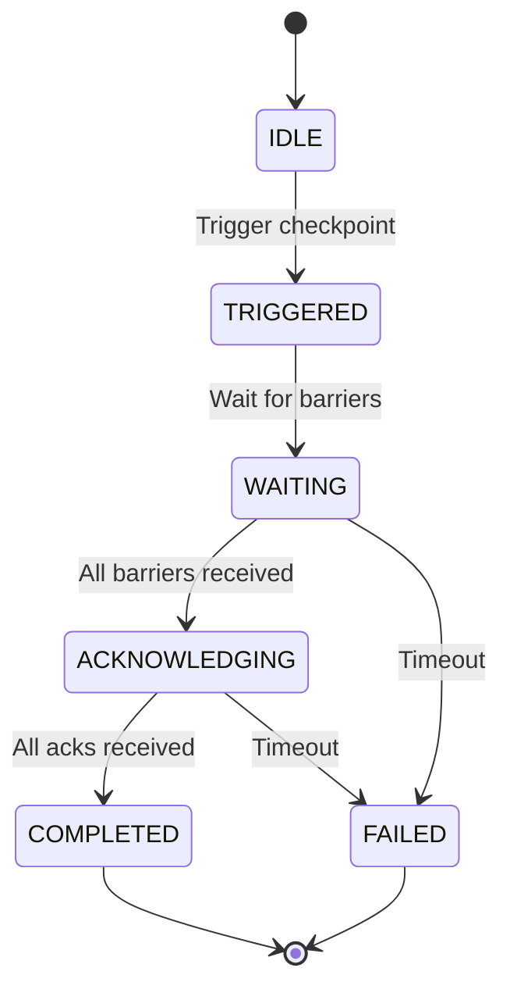
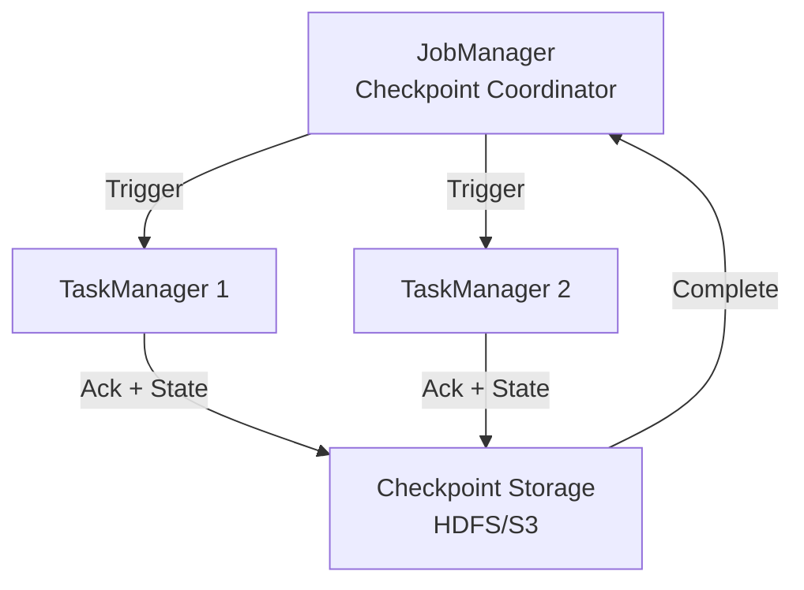

# Checkpoint Mechanism Deep Dive

> Stage: Flink/02-core-mechanisms | Prerequisites: [02.02-consistency-hierarchy.md](../../Struct/02-properties/02.02-consistency-hierarchy.md) | Formalization Level: L4

---

## Table of Contents

- [Checkpoint Mechanism Deep Dive](#checkpoint-mechanism-deep-dive)
  - [Table of Contents](#table-of-contents)
  - [1. Definitions](#1-definitions)
    - [Def-F-02-01 (Checkpoint Core Abstraction)](#def-f-02-01-checkpoint-core-abstraction)
    - [Def-F-02-02 (Checkpoint Barrier)](#def-f-02-02-checkpoint-barrier)
    - [Def-F-02-03 (Aligned Checkpoint)](#def-f-02-03-aligned-checkpoint)
    - [Def-F-02-04 (Unaligned Checkpoint)](#def-f-02-04-unaligned-checkpoint)
    - [Def-F-02-05 (Incremental Checkpoint)](#def-f-02-05-incremental-checkpoint)
    - [Def-F-02-06 (State Backend)](#def-f-02-06-state-backend)
    - [Def-F-02-07 (Checkpoint Coordinator)](#def-f-02-07-checkpoint-coordinator)
    - [Def-F-02-08 (Changelog State Backend)](#def-f-02-08-changelog-state-backend)
  - [2. Properties](#2-properties)
    - [Lemma-F-02-01 (Barrier Alignment Guarantees State Consistency)](#lemma-f-02-01-barrier-alignment-guarantees-state-consistency)
    - [Lemma-F-02-02 (Asynchronous Checkpoint Low Latency Property)](#lemma-f-02-02-asynchronous-checkpoint-low-latency-property)
    - [Lemma-F-02-03 (Incremental Checkpoint Storage Optimization)](#lemma-f-02-03-incremental-checkpoint-storage-optimization)
    - [Prop-F-02-01 (Checkpoint Type Selection Trade-off Space)](#prop-f-02-01-checkpoint-type-selection-trade-off-space)
  - [3. Relations](#3-relations)
    - [Relation 1: Flink Checkpoint ↔ Chandy-Lamport Distributed Snapshot](#relation-1-flink-checkpoint--chandy-lamport-distributed-snapshot)
    - [Relation 2: Checkpoint Mechanism ⟹ Exactly-Once Semantics](#relation-2-checkpoint-mechanism--exactly-once-semantics)
    - [Relation 3: State Backend Type ↔ Application Scenario](#relation-3-state-backend-type--application-scenario)
  - [4. Argumentation](#4-argumentation)
    - [4.1 Checkpoint Architecture: JM/TM Coordination Mechanism](#41-checkpoint-architecture-jmtm-coordination-mechanism)
    - [4.2 Aligned vs Unaligned: Deep Comparative Analysis](#42-aligned-vs-unaligned-deep-comparative-analysis)
    - [4.3 Incremental Checkpoint Engineering Implementation](#43-incremental-checkpoint-engineering-implementation)
    - [4.4 State Backend Snapshot Process](#44-state-backend-snapshot-process)
  - [5. Formal Proof / Engineering Argument](#5-formal-proof--engineering-argument)
    - [Thm-F-02-01 (Checkpoint Recovery System State Equivalence)](#thm-f-02-01-checkpoint-recovery-system-state-equivalence)
    - [Thm-F-02-02 (Incremental Checkpoint Completeness)](#thm-f-02-02-incremental-checkpoint-completeness)
  - [6. Examples](#6-examples)
    - [6.1 Configuration Example: Aligned Checkpoint](#61-configuration-example-aligned-checkpoint)
    - [6.2 Configuration Example: Unaligned Checkpoint](#62-configuration-example-unaligned-checkpoint)
    - [6.3 Configuration Example: Incremental Checkpoint](#63-configuration-example-incremental-checkpoint)
    - [6.4 Failure Recovery Case Study](#64-failure-recovery-case-study)
  - [7. Visualizations](#7-visualizations)
    - [Checkpoint State Machine](#checkpoint-state-machine)
    - [Checkpoint Architecture](#checkpoint-architecture)
  - [8. References](#8-references)

## 1. Definitions

This section establishes rigorous formal definitions for Flink's Checkpoint mechanism, laying the theoretical foundation for subsequent analysis. All definitions are consistent with semantic hierarchy definitions in the prerequisite document [02.02-consistency-hierarchy.md](../../Struct/02-properties/02.02-consistency-hierarchy.md)[^1][^2].

---

### Def-F-02-01 (Checkpoint Core Abstraction)

**Checkpoint** is a globally consistent state snapshot of a distributed stream processing job at a particular moment, formally defined as:

$$
CP = \langle ID, TS, \{S_i\}_{i \in Tasks}, Metadata \rangle
$$

Where:

- $ID \in \mathbb{N}^+$: Checkpoint unique identifier, monotonically increasing
- $TS \in \mathbb{R}^+$: Creation timestamp
- $S_i$: State snapshot of task $i$, including Keyed State and Operator State
- $Metadata$: Metadata (storage location, state size, operator mapping, etc.)

**Intuition**: Checkpoint is a "global photograph" taken of a running distributed stream processing job at high speed, where all operator instance states are frozen at the same logical moment, allowing the job to restart from that consistent state after failure[^1].

**Source Code Implementation**:

- Checkpoint Coordinator: `org.apache.flink.runtime.checkpoint.CheckpointCoordinator`
- Checkpoint Storage: `org.apache.flink.runtime.state.CheckpointStreamFactory`
- Location: `flink-runtime` module
- Flink Official Documentation: <https://nightlies.apache.org/flink/flink-docs-stable/docs/dev/datastream/fault-tolerance/checkpointing/>

---

### Def-F-02-02 (Checkpoint Barrier)

**Barrier** is a special control event injected into the data stream, used to separate data boundaries between different Checkpoints:

$$
Barrier(n) = \langle Type = CONTROL, checkpointId = n, timestamp = ts \rangle
$$

**Core Functions**:

1. As a logical time boundary, separating data before and after $CP_n$
2. Propagating through the data stream, triggering operator state snapshots
3. Achieving distributed coordination without global clock[^2][^3]

**Source Code Implementation**:

- Barrier definition: `org.apache.flink.runtime.checkpoint.CheckpointBarrier`
- Barrier handler: `org.apache.flink.streaming.runtime.io.CheckpointBarrierHandler`
- Aligner handler: `org.apache.flink.streaming.runtime.io.CheckpointBarrierAligner`
- Unaligner handler: `org.apache.flink.streaming.runtime.io.CheckpointBarrierUnaligner`
- Location: `flink-runtime` module (`flink-streaming-java`)

---

### Def-F-02-03 (Aligned Checkpoint)

**Aligned Checkpoint** refers to the mechanism where operators trigger state snapshots only after receiving Barriers from **all** input channels:

$$
\text{AlignedSnapshot}(t, n) \iff \forall c \in Inputs(t): Barrier(n) \in Received(c)
$$

**Characteristics**:

- Guarantees that snapshot state precisely corresponds to data processing results up to the Barrier
- Introduces backpressure waiting: channels that receive Barrier early must wait for other channels
- Simple implementation, strong consistency guarantee[^1][^4]

---

### Def-F-02-04 (Unaligned Checkpoint)

**Unaligned Checkpoint** allows operators to trigger snapshots immediately upon receiving Barrier from **any** input channel, and saves unprocessed records from other channels (in-flight data) as part of the state:

$$
\text{UnalignedSnapshot}(t, n) \iff \exists c \in Inputs(t): Barrier(n) \in Received(c)
$$

**Characteristics**:

- Eliminates Barrier alignment waiting, reducing Checkpoint impact on latency
- Requires saving in-flight data, increasing state size
- Suitable for high backpressure, large delay scenarios[^4][^5]

---

### Def-F-02-05 (Incremental Checkpoint)

**Incremental Checkpoint** only captures the portion of state that has changed since the last Checkpoint:

$$
\Delta S_n = S_{t_n} \setminus S_{t_{n-1}}, \quad CP_n^{inc} = \langle Base, \{\Delta S_i\}_{i=1}^{n} \rangle
$$

**RocksDB Implementation Principle**:

- Based on LSM-Tree SST file immutability
- Only backs up newly created or modified SST files
- Recovery rebuilds complete state through base Checkpoint + incremental chain[^5][^6]

---

### Def-F-02-06 (State Backend)

**State Backend** is the runtime component responsible for state storage, access, and snapshot persistence:

```java
// Source path: org.apache.flink.runtime.state.StateBackend
interface StateBackend {
    createKeyedStateBackend(env, stateHandles): AbstractKeyedStateBackend<K>
    createOperatorStateBackend(env, stateHandles): OperatorStateBackend
    snapshot(checkpointId): RunnableFuture<SnapshotResult>
    restore(stateHandles): StateBackend
}
```

**Main Implementation Types**:

| Backend | Storage Medium | Snapshot Method | Suitable Scenarios |
|---------|---------------|-----------------|-------------------|
| HashMapStateBackend | Memory (Heap) | Full synchronous/asynchronous | Small state, low latency |
| EmbeddedRocksDBStateBackend | Local Disk (RocksDB) | Incremental asynchronous | Large state, high throughput |

[^5][^6]

**Source Code Implementation**:

- Abstract base class: `org.apache.flink.runtime.state.AbstractStateBackend`
- HashMap implementation: `org.apache.flink.runtime.state.hashmap.HashMapStateBackend`
- RocksDB implementation: `org.apache.flink.runtime.state.rocksdb.EmbeddedRocksDBStateBackend`
- Location: `flink-runtime` / `flink-state-backends` module
- Flink Official Documentation: <https://nightlies.apache.org/flink/flink-docs-stable/docs/ops/state/state_backends/>

---

### Def-F-02-07 (Checkpoint Coordinator)

The **Checkpoint Coordinator** is the central component running in JobManager, responsible for triggering and managing the Checkpoint lifecycle:

**State Machine**:

```
IDLE → TRIGGERED → WAITING_FOR_BARRIERS → ACKNOWLEDGING → COMPLETED
         ↓                ↓                      ↓
      FAILED           FAILED                 FAILED
```

**Core Functions**:

1. Periodically triggering new Checkpoints
2. Collecting Barrier acknowledgments from all tasks
3. Coordinating state snapshots from State Backends
4. Managing Checkpoint metadata persistence

---

### Def-F-02-08 (Changelog State Backend)

The **Changelog State Backend** (introduced in Flink 1.16+) provides a state backend that continuously persists state changes:

$$
\text{ChangelogState} = \text{BaseSnapshot} \oplus \Delta_1 \oplus \Delta_2 \oplus \ldots \oplus \Delta_n
$$

**Advantages**:

- Checkpoint completion time independent of state size
- Sub-second checkpoint intervals possible
- Based on distributed log (e.g., Kafka, Pulsar)

---

## 2. Properties

### Lemma-F-02-01 (Barrier Alignment Guarantees State Consistency)

**Statement**: Aligned Checkpoint captures a consistent cut of the system state.

**Proof Sketch**:

1. When all Barriers arrive, all pre-Barrier data has been processed
2. No post-Barrier data has been processed
3. Therefore, the state snapshot reflects a consistent point in time ∎

---

### Lemma-F-02-02 (Asynchronous Checkpoint Low Latency Property)

**Statement**: Asynchronous checkpointing decouples snapshot persistence from data processing, minimizing latency impact.

**Mechanism**:

1. **Synchronous Phase**: Quick copy of state references (milliseconds)
2. **Asynchronous Phase**: Serialization and persistence (can take seconds)

---

### Lemma-F-02-03 (Incremental Checkpoint Storage Optimization)

**Statement**: Incremental Checkpoint reduces storage and bandwidth by only backing up changed state.

**Optimization Ratio**:
$$
\text{Savings} = 1 - \frac{|\Delta S|}{|S_{total}|}
$$

For slowly changing state, savings can exceed 90%.

---

### Prop-F-02-01 (Checkpoint Type Selection Trade-off Space)

| Checkpoint Type | Latency Impact | State Size | Recovery Speed | Use Case |
|----------------|----------------|------------|----------------|----------|
| Aligned | Higher | Smaller | Faster | Low latency, small state |
| Unaligned | Lower | Larger | Slower | High backpressure, large state |
| Incremental | Medium | Smaller | Slower | Large state, slow changes |
| Full | Higher | Larger | Faster | Small state, fast recovery needed |

---

## 3. Relations

### Relation 1: Flink Checkpoint ↔ Chandy-Lamport Distributed Snapshot

**Mapping**:

| Chandy-Lamport | Flink Implementation |
|----------------|---------------------|
| Marker message | Checkpoint Barrier |
| Process state | Operator state snapshot |
| Channel state | In-flight data buffers |
| Global snapshot | Completed checkpoint |

**Key Difference**: Flink adds asynchronous persistence and incremental backup optimizations.

---

### Relation 2: Checkpoint Mechanism ⟹ Exactly-Once Semantics

**Implication**: Checkpoint mechanism is necessary but not sufficient for Exactly-Once:

- Necessary: Without checkpoint, state cannot be recovered consistently
- Not Sufficient: Sink must also be transactional or idempotent

---

### Relation 3: State Backend Type ↔ Application Scenario

**Decision Matrix**:

```
State size < 30% of TM heap memory?
├── Yes ──► HashMapStateBackend (low latency)
└── No ──► RocksDBStateBackend (large state)
    └── Frequent checkpoints?
        ├── Yes ──► ChangelogStateBackend
        └── No ──► RocksDB (standard)
```

---

## 4. Argumentation

### 4.1 Checkpoint Architecture: JM/TM Coordination Mechanism

```
JobManager (Checkpoint Coordinator)
    ├── Triggers Checkpoint #n
    │   └── Broadcasts to all Source operators
    ├── Collects acknowledgments
    │   └── From all tasks
    └── Finalizes checkpoint
        └── Persists metadata

TaskManager (Task execution)
    ├── Receives barrier
    ├── Performs local snapshot
    └── Sends acknowledgment
```

---

### 4.2 Aligned vs Unaligned: Deep Comparative Analysis

| Aspect | Aligned | Unaligned |
|--------|---------|-----------|
| Latency | Higher (alignment waiting) | Lower (immediate) |
| State Size | Smaller | Larger (in-flight data) |
| Implementation | Simpler | More complex |
| Backpressure | May block | Non-blocking |
| Exactly-Once | Yes | Yes (with special handling) |

---

### 4.3 Incremental Checkpoint Engineering Implementation

**RocksDB Incremental Checkpoint**:

1. SST files are immutable once written
2. Only new/modified SST files are backed up
3. File-level deduplication via checksums

---

### 4.4 State Backend Snapshot Process

**HashMapStateBackend**:

1. Copy-on-write state map
2. Serialize to output stream
3. Persist to distributed storage

**RocksDBStateBackend**:

1. Create temporary checkpoint directory
2. Hard link SST files (fast, no copy)
3. Upload new/modified files

---

## 5. Formal Proof / Engineering Argument

### Thm-F-02-01 (Checkpoint Recovery System State Equivalence)

**Theorem**: A system recovered from a checkpoint is state-equivalent to the original system at checkpoint time.

**Proof**:

Let $S_{original}(t_c)$ be the original system state at checkpoint time $t_c$.
Let $S_{recovered}$ be the state after recovery from checkpoint.

1. **Operator State**: By Def-F-02-01, $S_{recovered}^{op} = S_{original}^{op}(t_c)$
2. **Channel State**: By Def-F-02-02, barriers ensure all pre-barrier data was processed
3. **Source Offset**: By source replay from checkpointed offset

Therefore, $S_{recovered} = S_{original}(t_c)$. ∎

---

### Thm-F-02-02 (Incremental Checkpoint Completeness)

**Theorem**: Incremental Checkpoints form a complete and recoverable state history.

**Proof**:

Let $CP_0$ be the base checkpoint, and $\Delta_i$ be incremental changes.

**Completeness**: At any point $n$, the complete state can be reconstructed:
$$
S_n = S_0 \oplus \Delta_1 \oplus \Delta_2 \oplus \ldots \oplus \Delta_n
$$

**Recoverability**: Given $CP_0$ and $\{\Delta_i\}_{i=1}^n$, we can compute $S_n$. ∎

---

## 6. Examples

### 6.1 Configuration Example: Aligned Checkpoint

```java
// Aligned Checkpoint (default)
env.enableCheckpointing(60000);  // 1 minute interval
env.getCheckpointConfig().setCheckpointingMode(CheckpointingMode.EXACTLY_ONCE);
env.getCheckpointConfig().setAlignmentTimeout(Duration.ofSeconds(30));

// State backend
env.setStateBackend(new HashMapStateBackend());
env.getCheckpointConfig().setCheckpointStorage("hdfs:///checkpoints");
```

---

### 6.2 Configuration Example: Unaligned Checkpoint

```java
// Unaligned Checkpoint for high backpressure scenarios
env.enableCheckpointing(60000);
env.getCheckpointConfig().setCheckpointingMode(CheckpointingMode.EXACTLY_ONCE);
env.getCheckpointConfig().enableUnalignedCheckpoints();
env.getCheckpointConfig().setAlignmentTimeout(Duration.ofSeconds(10));

// State backend with larger network buffers
env.setStateBackend(new EmbeddedRocksDBStateBackend());
```

---

### 6.3 Configuration Example: Incremental Checkpoint

```java
// Incremental Checkpoint with RocksDB
env.setStateBackend(new EmbeddedRocksDBStateBackend(true));  // incremental = true

// Tune RocksDB for incremental backup
DefaultConfigurableStateBackend configurable = new DefaultConfigurableStateBackend();
configurable.setPredefinedOptions(PredefinedOptions.FLASH_SSD_OPTIMIZED);
env.setStateBackend(configurable);
```

---

### 6.4 Failure Recovery Case Study

**Scenario**: TaskManager failure during checkpoint #100

**Recovery Process**:

1. JobManager detects TaskManager loss
2. Job restarts from checkpoint #99 (last completed)
3. Sources replay from offset recorded in #99
4. Operators restore state from #99
5. Processing resumes

**Time**: Recovery time = State restore + Offset seek + Processing catch-up

---

## 7. Visualizations

### Checkpoint State Machine



### Checkpoint Architecture



---

## 8. References

[^1]: K.M. Chandy, L. Lamport, "Distributed Snapshots", TOCS, 3(1), 1985.

[^2]: Apache Flink Documentation, "Checkpointing", 2025.

[^3]: M. Zaharia et al., "Discretized Streams", SOSP, 2013.

[^4]: Flink Improvement Proposals, "Unaligned Checkpoints", FLIP-76.

[^5]: Apache Flink Documentation, "State Backends", 2025.

[^6]: RocksDB Documentation, "Checkpoints", Meta Engineering.
