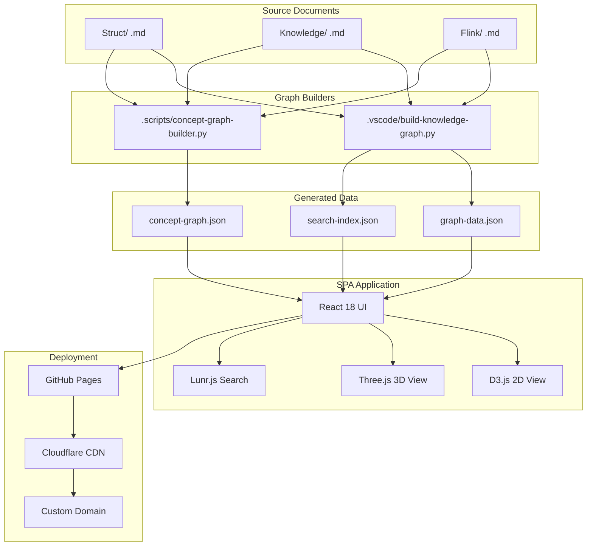
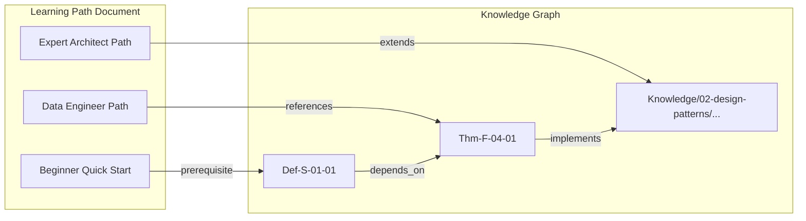

> **Status**: 🔮 Forward-looking Content | **Risk Level**: Medium | **Last Updated**: 2026-04
>
> Content described in this document is in active development. Please refer to the latest deployed version for the most accurate visualization.

# Knowledge Graph Guide

> **Document Position**: English Content | **Version**: v2.0 | **Status**: Active | **Updated**: 2026-04-14
>
> A comprehensive guide to the AnalysisDataFlow interactive knowledge graph — covering graph concepts, generation workflows, deployment options, and query patterns for navigating 10,000+ formalized stream computing elements.

## Quick Navigation

```
┌─────────────────────────────────────────────────────────────────────────────┐
│                     Knowledge Graph Guide Quick Reference                     │
├─────────────────┬─────────────────┬─────────────────┬─────────────────────────┤
│  🌐 What is KG  │  🔧 Generation  │  🚀 Deployment  │    🔍 Query & Usage     │
├─────────────────┼─────────────────┼─────────────────┼─────────────────────────┤
│ • Concept Map   │ • build-kg.py   │ • GitHub Pages  │ • Node Types (D-02)     │
│ • Theorem Graph │ • concept-      │ • CNAME Config  │ • Edge Types (D-03)     │
│ • Doc Relations │   graph-builder │ • Cloudflare    │ • Search Syntax         │
│   (D-01)        │   (Sec 2)       │   (Sec 3)       │   (Sec 4)               │
└─────────────────┴─────────────────┴─────────────────┴─────────────────────────┘
```

---

## 1. What is the Knowledge Graph

### Def-EN-KG-01: Knowledge Graph

The **AnalysisDataFlow Knowledge Graph** ($\mathcal{KG}$) is an interactive visualization system that maps the relationships between documents, theorems, definitions, and design patterns across the project.

Formally:

$$\mathcal{KG} = \langle V, E, L, \Phi \rangle$$

where:

- $V$: Set of nodes representing concepts, documents, theorems, definitions, and patterns
- $E \subseteq V \times V \times R$: Set of directed edges with relation types $R$
- $L$: Layout function positioning nodes in 2D/3D space
- $\Phi$: Query and filtering interface enabling user exploration

### Core Capabilities

| Capability | Description | Example Use Case |
|------------|-------------|------------------|
| **Concept Atlas** | Navigate formal definitions and theorems across `Struct/` | Find all theorems depending on `Def-S-01-01` |
| **Theorem Dependency** | Trace proof chains and logical dependencies | Visualize the dependency path of `Thm-F-04-01` |
| **Document Relations** | Discover cross-references between `Flink/`, `Knowledge/`, and `Struct/` | Jump from a Flink checkpoint doc to its formal proof |
| **Learning Path** | Follow pre-computed recommended study routes | Beginner → Dataflow Expert → Flink Architect |

### Technology Stack

| Technology | Purpose |
|------------|---------|
| React 18 | UI framework |
| D3.js v7 | 2D graph visualization and force simulation |
| Three.js | 3D immersive graph exploration |
| TensorFlow.js | Client-side AI for recommendations |
| Lunr.js | Full-text search index |

---

## 2. How to Generate

### Def-EN-KG-02: Graph Generation Pipeline

The knowledge graph is produced by two complementary builders:

$$Pipeline_{KG} = Build_{docs} \circ Build_{concepts}$$

### 2.1 Document Graph Builder

**Script**: `.vscode/build-knowledge-graph.py`

**What it does**:

1. Scans all `.md` files in `Struct/`, `Knowledge/`, and `Flink/`
2. Extracts document nodes with titles and categories
3. Identifies theorems (`Thm-*`), definitions (`Def-*`), lemmas (`Lemma-*`), propositions (`Prop-*`), and corollaries (`Cor-*`)
4. Parses dependency declarations (e.g., `前置依赖:` / `Prerequisites:`)
5. Emits `graph-data.json` in GraphJSON format

**Usage**:

```bash
# Generate the full graph
python .vscode/build-knowledge-graph.py

# Generate with custom output path
python .vscode/build-knowledge-graph.py --output KNOWLEDGE-GRAPH/data/graph-data.json

# Print statistics only
python .vscode/build-knowledge-graph.py --stats
```

**Sample output**:

```json
{
  "nodes": [
    { "id": "Struct/01-foundation/01.01-stream-semantics.md", "label": "Stream Semantics", "category": "Struct" },
    { "id": "Thm-S-01-01", "label": "Event Time Monotonicity", "category": "theorem" }
  ],
  "edges": [
    { "source": "Thm-S-01-01", "target": "Struct/01-foundation/01.01-stream-semantics.md", "relation": "defined_in" },
    { "source": "Flink/02-core/checkpoint-mechanism.md", "target": "Thm-S-01-01", "relation": "references" }
  ]
}
```

### 2.2 Concept Graph Builder

**Script**: `.scripts/concept-graph-builder.py`

**What it does**:

1. Extracts formal definitions and theorems using regex patterns
2. Builds a concept-level network with semantic relations (`depends_on`, `implements`, `extends`, `references`, `similar_to`)
3. Exports Neo4j-compatible Cypher statements and a JSON graph

**Usage**:

```bash
# Build concept graph from project root
python .scripts/concept-graph-builder.py --base-path .

# Export to Neo4j Cypher
python .scripts/concept-graph-builder.py --base-path . --output-format cypher --output kg-concepts.cypher
```

**Relation keywords detected**:

| Relation | Chinese Keywords | English Keywords |
|----------|------------------|------------------|
| `depends_on` | 依赖, 基于, 需要 | depends on, requires |
| `implements` | 实现, 实例化 | implements, realizes |
| `extends` | 扩展, 继承 | extends, generalizes |
| `references` | 引用, 参见, 详见 | references, see also |
| `similar_to` | 类似, 等同于 | similar to, analogous to |
| `contrasts_with` | 对比, 不同于 | vs, compared to, contrasts with |

### 2.3 Automated CI Generation

The graph is regenerated automatically on every push via GitHub Actions:

```yaml
# .github/workflows/deploy-knowledge-graph.yml (excerpt)
- name: Build Knowledge Graph
  run: |
    python .vscode/build-knowledge-graph.py --output KNOWLEDGE-GRAPH/data/graph-data.json
    python .scripts/concept-graph-builder.py --base-path . --output-format json --output KNOWLEDGE-GRAPH/data/concept-graph.json
```

---

## 3. How to Deploy

### Def-EN-KG-03: Deployment Architecture

The knowledge graph is deployed as a static single-page application (SPA) with the following architecture:

$$\mathcal{D}_{KG} = \langle SPA, CDN, DNS, Search \rangle$$

### 3.1 GitHub Pages Deployment

**Prerequisites**:

- GitHub repository admin access
- Optional: custom domain and DNS management rights
- Optional: Cloudflare account for CDN acceleration

**Steps**:

1. Navigate to **Settings > Pages** in the GitHub repository
2. Set **Source** to "GitHub Actions"
3. Push changes to `KNOWLEDGE-GRAPH/` or trigger `.github/workflows/deploy-knowledge-graph.yml`
4. The workflow builds and deploys the SPA automatically

**Default URL**:

```
https://<username>.github.io/AnalysisDataFlow/
```

### 3.2 Custom Domain & CNAME

1. Edit `KNOWLEDGE-GRAPH/CNAME`:

   ```
   kg.analysisdataflow.io
   ```

2. Add a DNS `CNAME` record:

   ```
   kg.analysisdataflow.io → <username>.github.io/AnalysisDataFlow
   ```

3. In **Settings > Pages**, enter the custom domain and verify
4. Enable **"Enforce HTTPS"**

### 3.3 Cloudflare CDN Acceleration

1. Add the custom domain to Cloudflare
2. Point DNS records to GitHub Pages
3. Enable optimizations:
   - **Auto Minify** (HTML/CSS/JS)
   - **Brotli** compression
   - **Always Use HTTPS**
   - **Rocket Loader** (optional, evaluate Three.js compatibility)

### 3.4 Algolia DocSearch Integration

1. Apply at [https://docsearch.algolia.com/apply/](https://docsearch.algolia.com/apply/)
2. Update `KNOWLEDGE-GRAPH/index.html` search configuration:

```javascript
const searchConfig = {
  appId: 'YOUR_APP_ID',
  apiKey: 'YOUR_SEARCH_API_KEY',
  indexName: 'analysisdataflow',
};
```

---

## 4. How to Query

### Node Types

| Node Type | Color | Description | Example |
|-----------|-------|-------------|---------|
| `document-struct` | 🔵 Blue | Formal theory document | `Struct/01-foundation/...` |
| `document-knowledge` | 🟢 Green | Engineering practice document | `Knowledge/02-design-patterns/...` |
| `document-flink` | 🟠 Orange | Flink-specific document | `Flink/02-core/...` |
| `theorem` | 🔴 Red | Formal theorem | `Thm-S-01-01` |
| `definition` | 🟣 Purple | Formal definition | `Def-F-15-01` |
| `lemma` | 🔵 Cyan | Supporting lemma | `Lemma-S-02-01` |
| `proposition` | 🩷 Pink | Derived proposition | `Prop-K-03-01` |
| `corollary` | ⚪ Gray | Logical corollary | `Cor-S-02-01` |

### Edge (Relation) Types

| Edge Type | Meaning | Example |
|-----------|---------|---------|
| `depends_on` | Prerequisite relationship | `Thm-S-01-02` → `Def-S-01-01` |
| `references` | Citation or cross-reference | `Flink/.../checkpoint.md` → `Thm-S-01-01` |
| `extends` | Generalization or inheritance | `Knowledge/.../advanced-pattern.md` → `Knowledge/.../basic-pattern.md` |
| `proves` | Proof relationship | `Thm-S-01-01` → `Prop-S-01-01` |
| `implements` | Engineering realization of theory | `Flink/.../exactly-once.md` → `Thm-S-03-01` |
| `similar_to` | Conceptual similarity | `Def-F-15-01` ↔ `Def-K-05-01` |

### Search Syntax

The knowledge graph supports Lunr.js-powered search with advanced syntax:

| Syntax | Meaning | Example |
|--------|---------|---------|
| `category:flink` | Filter by category | `category:flink checkpoint` |
| `type:theorem` | Filter by node type | `type:theorem exactly-once` |
| `"event time"` | Exact phrase match | `"event time" watermark` |
| `-failure` | Exclude term | `checkpoint -failure` |

**Keyboard shortcuts**:

| Key | Action |
|-----|--------|
| `/` | Focus search box |
| `Esc` | Clear search |
| `Enter` | Open first result |
| `↑ / ↓` | Navigate results |
| `?` | Show help |
| `R` | Reset view |
| `3` | Toggle 3D mode |

---

## 5. Integration

### Prop-EN-KG-01: Knowledge Graph Completeness

**Proposition**: The knowledge graph is complete with respect to the three primary output directories if every document contains at least one indexed formal element or cross-reference.

$$\forall d \in \{Struct, Knowledge, Flink\}, \forall doc \in d: |\text{indexed\_elements}(doc)| \geq 1 \Rightarrow doc \in V_{KG}$$

Current coverage (as of 2026-04):

- `Struct/`: 75+ documents, 380+ theorems, 835+ definitions
- `Knowledge/`: 240+ documents, 80+ theorems, 230+ definitions
- `Flink/`: 390+ documents, 700+ theorems, 1900+ definitions

### Prop-EN-KG-02: Learning Path Integration

**Proposition**: Embedding the knowledge graph into learning paths improves navigation efficiency by reducing the number of manual search operations required to traverse prerequisite chains.

**Mechanism**:

1. Each learning path node links directly to its corresponding knowledge graph node
2. Prerequisite edges in the graph are surfaced as "Previous Topic" / "Next Topic" buttons in learning path documents
3. Graph-based recommendations suggest the nearest unvisited dependent node

### Integration Patterns

**Pattern 1: Inline Concept Cards**

In Markdown documents, concept references can be enriched with hover cards powered by the graph API:

```markdown
See [Thm-S-01-01](?kg=Thm-S-01-01) for the formal proof.
```

**Pattern 2: Embedded Graph Widget**

A minimal iframe or Web Component can embed the local graph view:

```html
<iframe
  src="https://<username>.github.io/AnalysisDataFlow/?focus=Thm-F-04-01&depth=2"
  width="100%"
  height="400px"
></iframe>
```

**Pattern 3: Documentation Navigation Sidebar**

The graph data can drive a dynamic sidebar that shows:

- Upstream prerequisites
- Downstream dependents
- Related theorems/definitions
- Suggested next reads

---

## 6. Examples

### Example 1: Find all theorems used by a Flink document

```python
import json

with open('KNOWLEDGE-GRAPH/data/graph-data.json') as f:
    data = json.load(f)

target_doc = "Flink/02-core/checkpoint-mechanism-deep-dive.md"

# Find all theorem nodes referenced by this document
refs = [
    e['source'] for e in data['edges']
    if e['target'] == target_doc and e['relation'] == 'references'
]

theorems = [n for n in data['nodes'] if n['id'] in refs and 'Thm-' in n['id']]
for t in theorems:
    print(f"{t['id']}: {t['label']}")
```

### Example 2: Build a prerequisite chain

```python
from collections import deque

def prerequisite_chain(node_id, data, max_depth=3):
    chain = []
    queue = deque([(node_id, 0)])
    visited = {node_id}

    while queue:
        current, depth = queue.popleft()
        if depth >= max_depth:
            continue
        for e in data['edges']:
            if e['target'] == current and e['relation'] == 'depends_on':
                if e['source'] not in visited:
                    visited.add(e['source'])
                    chain.append((e['source'], current))
                    queue.append((e['source'], depth + 1))
    return chain

chain = prerequisite_chain("Thm-F-04-01", data)
for prereq, target in chain:
    print(f"{prereq} -> {target}")
```

### Example 3: Local HTTP server for testing

```bash
# Serve the knowledge graph locally
python -m http.server 8000 --directory KNOWLEDGE-GRAPH/

# Access at
open http://localhost:8000/
```

---

## 7. Visualizations

### Knowledge Graph System Architecture

The following diagram shows the complete architecture from source documents to deployed visualization:



### Learning Path to Graph Integration



---

## 8. References


---

*Document Version: v1.0 | Last Updated: 2026-04-14 | Formal Elements: 3 Definitions, 2 Propositions*
