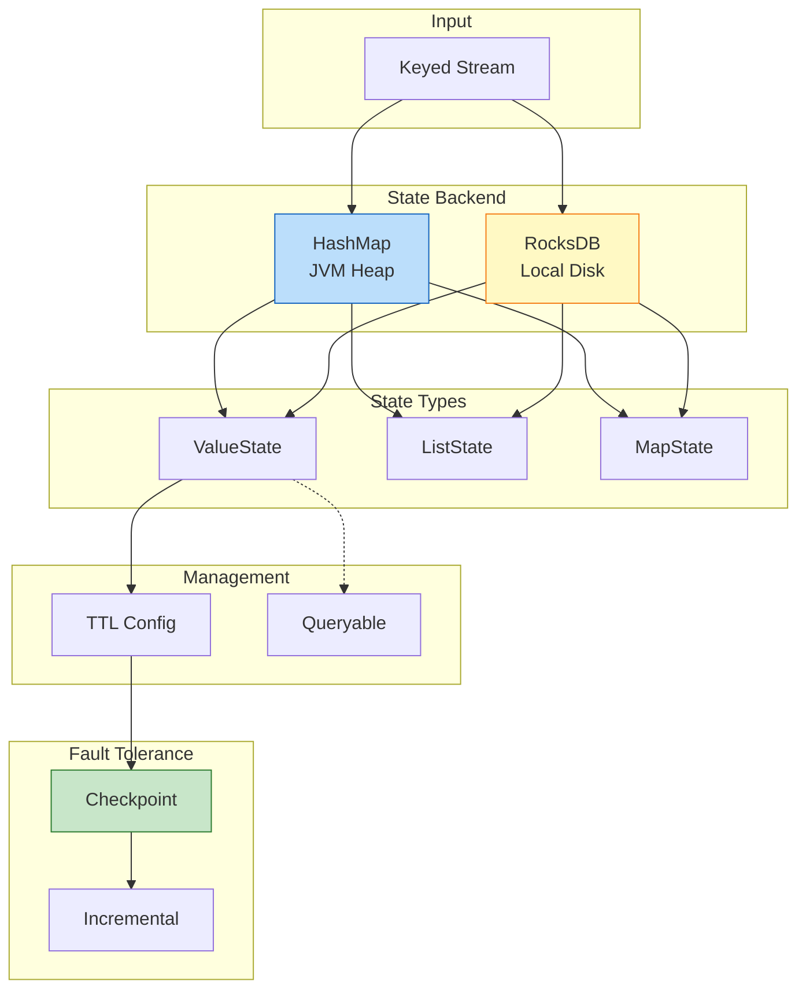

# Design Pattern: Stateful Computation

> **Pattern ID**: 05/7 | **Series**: Knowledge/02-design-patterns | **Formalization Level**: L4-L5
>
> This pattern addresses the core conflict between **state consistency**, **fault recovery**, and **large-scale state management** in distributed stream processing.

---

## Table of Contents

- [Design Pattern: Stateful Computation](#design-pattern-stateful-computation)
  - [Table of Contents](#table-of-contents)
  - [1. Problem / Context](#1-problem--context)
    - [1.1 Challenges of Distributed Stateful Computation](#11-challenges-of-distributed-stateful-computation)
    - [1.2 Core Conflict Triangle](#12-core-conflict-triangle)
  - [2. Solution](#2-solution)
    - [2.1 Core Concept Definitions](#21-core-concept-definitions)
    - [2.2 State Backend Selection](#22-state-backend-selection)
    - [2.3 State TTL (Time-To-Live)](#23-state-ttl-time-to-live)
    - [2.4 State Partitioning](#24-state-partitioning)
    - [2.5 Queryable State](#25-queryable-state)
    - [2.6 State Management Architecture](#26-state-management-architecture)
  - [3. Implementation](#3-implementation)
    - [3.1 Keyed State Basic Usage](#31-keyed-state-basic-usage)
    - [3.2 State TTL Configuration](#32-state-ttl-configuration)
    - [3.3 State Backend Configuration](#33-state-backend-configuration)
    - [3.4 Queryable State Implementation](#34-queryable-state-implementation)
  - [4. When to Use](#4-when-to-use)
    - [4.1 Recommended](#41-recommended)
    - [4.2 Not Recommended](#42-not-recommended)
  - [5. Related Patterns](#5-related-patterns)
  - [6. Formal Guarantees](#6-formal-guarantees)
    - [6.1 Dependent Formal Definitions](#61-dependent-formal-definitions)
    - [6.2 Satisfied Formal Properties](#62-satisfied-formal-properties)
    - [6.3 Property Preservation During Pattern Composition](#63-property-preservation-during-pattern-composition)
    - [6.4 Boundary Conditions and Constraints](#64-boundary-conditions-and-constraints)
    - [6.5 Formal Characteristics of State Backends](#65-formal-characteristics-of-state-backends)
  - [7. References](#7-references)

---

## 1. Problem / Context

### 1.1 Challenges of Distributed Stateful Computation

In distributed stream processing, stateful computation requires maintaining context information across events:

| Challenge Dimension | Problem Description | Typical Impact |
|--------------------|---------------------|----------------|
| **Fault Consistency** | How to recover state when node fails | Exactly-Once semantics violation |
| **State Scale** | Storage and access of massive key-value pairs | OOM, GC pauses |
| **State Expiration** | Cleanup of invalid states | State bloat |
| **External Query** | External access to runtime state | Insufficient observability |

**Formal Description**: Let the operator state at time $t$ be $S_t(o_i)$, stateful computation satisfies:

$$
\text{Output}(o_i, r_j, t) = f(r_j, S_{t-1}(o_i))
$$

That is, output depends on historically accumulated state, making fault recovery must precisely restore historical state.

### 1.2 Core Conflict Triangle

```
         Consistency
              ▲
             /|\
            / | \
           /  |  \
          /   |   \
Low Latency ◄──────────────► Large Scale
```

- Strong consistency requires Barrier alignment, increasing latency
- Large-scale state requires disk storage, high access latency
- Low latency requires in-memory computation, limiting state scale

---

## 2. Solution

### 2.1 Core Concept Definitions

**Operator State**: Bound to operator instance, all records share the same state [^1]

**Keyed State**: Partitioned by key, each key has an independent state copy [^1]:

$$
S_{keyed}: (TaskInstance \times Key) \to StateValue
$$

**State Backend**: Abstraction layer responsible for state storage, access, and snapshots [^2]:

$$
\mathcal{B} = (S_{storage}, \Phi_{access}, \Psi_{snapshot}, \Omega_{recovery})
$$

### 2.2 State Backend Selection

| Characteristic | HashMapStateBackend | RocksDBStateBackend |
|----------------|---------------------|---------------------|
| Storage Location | JVM Heap | Local Disk |
| State Capacity | Several MB - Several GB | TB Level |
| Access Latency | ~10-100 ns | 1-100 μs |
| Incremental Checkpoint | ❌ Not supported | ✅ Native support |

**Selection Decision Tree** [^9]:

```
State size < 30% of TM heap memory ?
├── Yes ──► HashMapStateBackend (Low latency)
└── No ──► RocksDBStateBackend (Large state)
```

### 2.3 State TTL (Time-To-Live)

TTL defines the survival period of state [^6]:

$$
\text{Valid}(S_k, t) \iff t - \text{LastAccess}(S_k) < TTL
$$

**Cleanup Strategies**:

| Strategy | Trigger Timing | Applicable Backend |
|----------|---------------|-------------------|
| Full Snapshot | During Checkpoint | Universal |
| Incremental | During state access | Universal |
| RocksDB Compaction | During compaction | RocksDB specific |

### 2.4 State Partitioning

Keyed State is distributed by key hash to parallel subtasks [^4]:

$$
\text{Partition}(key) = hash(key) \mod parallelism
$$

**Guarantee**: All records of the same key are routed to the same subtask, ensuring serialization of state updates.

**State Types** [^1]:

| Type | Description | Scenario |
|------|-------------|----------|
| ValueState | Single value state | Counters |
| ListState | List state | History records |
| MapState | Map structure | Key-value collections |
| ReducingState | Reducible state | Incremental aggregation |

### 2.5 Queryable State

Allows external clients to read operator state via RPC [^8]:

```
Client ──RPC──► Queryable State Server ◄──Local── Task Manager
                                                │
                                                ▼
                                          Keyed State
```

**Limitations**: Read-only access, only supports Keyed State, high network overhead.

### 2.6 State Management Architecture



---

## 3. Implementation

### 3.1 Keyed State Basic Usage

```scala
class UserVisitCounter extends ProcessFunction[UserEvent, UserStats] {
  private var visitCountState: ValueState[Long] = _

  override def open(parameters: Configuration): Unit = {
    val descriptor = new ValueStateDescriptor[Long](
      "visit-count", classOf[Long]
    )
    visitCountState = getRuntimeContext.getState(descriptor)
  }

  override def processElement(
    event: UserEvent,
    ctx: Context,
    out: Collector[UserStats]
  ): Unit = {
    val currentCount = Option(visitCountState.value()).getOrElse(0L)
    val newCount = currentCount + 1
    visitCountState.update(newCount)
    out.collect(UserStats(event.userId, newCount))
  }
}
```

### 3.2 State TTL Configuration

```scala
val ttlConfig = StateTtlConfig
  .newBuilder(Time.minutes(30))
  .setUpdateType(OnCreateAndWrite)
  .setStateVisibility(NeverReturnExpired)
  .cleanupFullSnapshot()
  .build()

val descriptor = new ValueStateDescriptor[SessionInfo](
  "session", classOf[SessionInfo]
)
descriptor.enableTimeToLive(ttlConfig)
```

### 3.3 State Backend Configuration

**HashMapStateBackend** (Small state):

```scala
env.setStateBackend(new HashMapStateBackend())
env.getCheckpointConfig.setCheckpointStorage("hdfs:///checkpoints")
```

**RocksDBStateBackend** (Large state + Incremental) [^9]:

```scala
val rocksDbBackend = new EmbeddedRocksDBStateBackend(true) // true=incremental
env.setStateBackend(rocksDbBackend)
env.getCheckpointConfig.setCheckpointStorage("hdfs:///checkpoints")
```

### 3.4 Queryable State Implementation

```scala
val descriptor = new ValueStateDescriptor[UserProfile](
  "user-profile", classOf[UserProfile]
)
descriptor.setQueryable("queryable-user-profile")
```

External query [^8]:

```scala
val client = new QueryableStateClient("jobmanager", 9069)
val future = client.getKvState(
  jobId, "queryable-user-profile", "user_123",
  keySerializer, stateDescriptor
)
```

---

## 4. When to Use

### 4.1 Recommended

| Scenario | Reason | Configuration |
|----------|--------|---------------|
| Session Window | Maintain session across events | ValueState + TTL |
| Cumulative Metrics | Daily/Monthly cumulative statistics | ReducingState + Incremental Checkpoint |
| CEP Pattern Matching | NFA state machine | MapState + Short TTL |
| Deduplication Filtering | Precise deduplication | ValueState + Expiration cleanup |

### 4.2 Not Recommended

| Scenario | Reason | Alternative |
|----------|--------|-------------|
| Pure stateless transformation | No state needed | map/filter |
| Large object cache | Not suitable for caching | Redis |
| Cross-job sharing | Job isolation | External database |

---

## 5. Related Patterns

| Pattern | Relation | Description |
|---------|----------|-------------|
| **Pattern 01: Event Time** | Depends | Stateful computation depends on Event Time semantics [^10] |
| **Pattern 02: Windowed Aggregation** | Depends | Windows internally use Keyed State [^11] |
| **Pattern 07: Checkpoint** | Depends | Checkpoint is the foundation of fault tolerance [^2][^9] |

**Formal Relations** [^12]:

The formal foundation of this pattern is in [`Struct/02-properties/02.05-type-safety-derivation.md`](../../../../../USTM-F-Reconstruction/archive/original-struct/02-properties/02.05-type-safety-derivation.md), where FGG generic properties provide theoretical foundation for Keyed State type safety.

```
Knowledge Relations:
Struct/02-properties/02.05-type-safety-derivation.md
├── FGG Generics ──► KeyedState<T> Type Safety
└── DOT Path Dependence ──► State-Key Binding

Flink/02-core/
├── checkpoint-mechanism-deep-dive.md
├── exactly-once-end-to-end.md
└── time-semantics-and-watermark.md
```

---

## 6. Formal Guarantees

This section establishes the formal connection between the Stateful Computation pattern and the Struct/ theory layer.

### 6.1 Dependent Formal Definitions

| Definition ID | Name | Source | Role in This Pattern |
|---------------|------|--------|---------------------|
| **Def-S-03-01** | Classic Actor Quadruple | Struct/01.03 | Concurrent model foundation for Keyed State: ⟨α, b, m, σ⟩ |
| **Def-S-04-01** | Dataflow Graph (DAG) | Struct/01.04 | Stateful operators as stateful vertices ⟨V, E, P, Σ, 𝕋⟩ |
| **Def-S-17-02** | Consistent Global State | Struct/04.01 | State captured by Checkpoint must form a consistent cut |
| **Def-S-18-05** | Idempotency | Struct/04.02 | State update replay needs to satisfy idempotency |

### 6.2 Satisfied Formal Properties

| Theorem/Lemma ID | Name | Source | Guarantee |
|------------------|------|--------|-----------|
| **Thm-S-03-01** | Actor Local Determinism Theorem | Struct/01.03 | Single key state update serialization guarantees local determinism |
| **Lemma-S-03-01** | Actor Mailbox Serial Processing Lemma | Struct/01.03 | Messages of same key processed by FIFO |
| **Thm-S-17-01** | Checkpoint Consistency Theorem | Struct/04.01 | State snapshot forms consistent global state |
| **Thm-S-18-01** | Exactly-Once Correctness Theorem | Struct/04.02 | State recovery + Source replay = Exactly-Once |
| **Lemma-S-18-03** | State Recovery Consistency Lemma | Struct/04.02 | Recovered state consistent with state at some moment before failure |

### 6.3 Property Preservation During Pattern Composition

**Stateful Computation + Event Time Composition**:

- State access can combine event timestamps to implement time window states
- Watermark-driven state expiration cleanup (TTL)

**Stateful Computation + Checkpoint Composition**:

- State backend implements snapshot requirements of Thm-S-17-01
- Incremental Checkpoint optimization does not change consistency guarantees

**Stateful Computation + Windowed Aggregation Composition**:

- Window state uses Keyed State implementation
- Window trigger state and computation state stored separately

### 6.4 Boundary Conditions and Constraints

| Constraint Condition | Formal Description | Violation Consequence |
|---------------------|-------------------|----------------------|
| Key Partition Fixed | hash(k) mod parallelism unchanged | Key drift, state loss |
| State Size Finite | |S| < ∞ | OOM, job crash |
| TTL Configuration Reasonable | TTL < Checkpoint interval × N | State bloat, increased recovery time |
| Concurrent Access Isolation | Single key single thread access | Data race, state corruption |

### 6.5 Formal Characteristics of State Backends

| Backend Type | Storage Model | Consistency Guarantee | Applicable Scenario |
|--------------|---------------|----------------------|---------------------|
| HashMapStateBackend | In-memory KV | Thm-S-17-01 | Small state (<100MB) |
| RocksDBStateBackend | LSM-Tree | Thm-S-17-01 | Large state (TB level) |

---

## 7. References

[^1]: Flink State Documentation. <https://nightlies.apache.org/flink/flink-docs-stable/docs/dev/datastream/fault-tolerance/state/>

[^2]: Carbone et al., "State Management in Apache Flink," *PVLDB*, 2017.

[^6]: Flink State TTL. <https://nightlies.apache.org/flink/flink-docs-stable/docs/dev/datastream/fault-tolerance/state/#state-time-to-live-ttl>

[^8]: Flink Queryable State. <https://nightlies.apache.org/flink/flink-docs-stable/docs/dev/datastream/fault-tolerance/queryable_state//>

[^9]: Flink State Backend Selection. [Flink/06-engineering/state-backend-selection.md](../../../../../Flink/09-practices/09.03-performance-tuning/state-backend-selection.md)

[^10]: Flink Time Semantics. [Flink/02-core/time-semantics-and-watermark.md](../../Flink/02-core/time-semantics-and-watermark.md)

[^11]: Flink Checkpoint Mechanism. [Flink/02-core/checkpoint-mechanism-deep-dive.md](../../Flink/02-core/checkpoint-mechanism-deep-dive.md)

[^12]: Type Safety Derivation. [Struct/02-properties/02.05-type-safety-derivation.md](../../../../../USTM-F-Reconstruction/archive/original-struct/02-properties/02.05-type-safety-derivation.md)

---

*Document Version: v1.0 | Last Updated: 2026-04-02*
