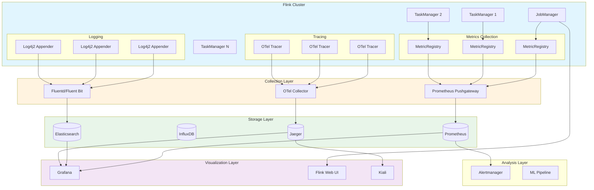
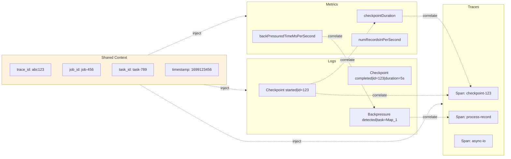

> **Status**: 🔮 Forward-looking Content | **Risk Level**: High | **Last Updated**: 2026-04
>
> Content described in this document is in early planning stages and may differ from final implementation. Please refer to official Apache Flink releases for authoritative information.

# Stream Processing Observability Guide

> **Applicable Version**: v2.8+ | **Scope**: Flink/Dataflow Stream Computing Systems | **Updated**: 2026-04-14

## Quick Navigation

```
┌─────────────────────────────────────────────────────────────────────────────┐
│                    Observability Pillar Quick Reference Index                 │
├─────────────────┬─────────────────┬─────────────────┬─────────────────────────┤
│  📊 Metrics     │  📝 Logging     │  🔗 Tracing     │    🔔 Alerting          │
├─────────────────┼─────────────────┼─────────────────┼─────────────────────────┤
│ • 5-Layer Arch  │ • Structured    │ • Span Semantics│ • Rule Model            │
│   (D-01)        │   (D-03)        │   (D-04)        │   (D-05)                │
│ • Metric Types  │ • MDC Context   │ • Sampling      │ • SLO/SLI               │
│   (D-02)        │   (E-02)        │   (P-03)        │   (E-03)                │
│ • Scope Levels  │ • Aggregation   │ • Jaeger Config │ • Alertmanager          │
│   (D-03)        │   (E-01)        │   (E-02)        │   (E-03)                │
└─────────────────┴─────────────────┴─────────────────┴─────────────────────────┘
```

---

## 1. Concepts / Definitions

### Def-EN-OBS-01: Observability Architecture

The stream processing observability system is defined as a five-layer architecture model $\mathcal{O}_{stream}$:

$$\mathcal{O}_{stream} = \langle \mathcal{L}_{collection}, \mathcal{L}_{transmission}, \mathcal{L}_{storage}, \mathcal{L}_{analysis}, \mathcal{L}_{visualization} \rangle$$

| Layer | Component | Responsibility |
|-------|-----------|--------------|
| **Collection** $\mathcal{L}_{collection}$ | Metrics Reporter, Log Appender, Tracer | Raw signal generation and capture |
| **Transmission** $\mathcal{L}_{transmission}$ | Pushgateway, OTel Collector, Fluentd | Data aggregation and routing |
| **Storage** $\mathcal{L}_{storage}$ | Prometheus, InfluxDB, Elasticsearch, Jaeger | Time-series persistence |
| **Analysis** $\mathcal{L}_{analysis}$ | Alertmanager, Grafana, ML Pipeline | Anomaly detection and root-cause analysis |
| **Visualization** $\mathcal{L}_{visualization}$ | Grafana Dashboards, Flink Web UI | Human-computer interaction interface |

### Def-EN-OBS-02: Metric Type Taxonomy

The stream processing metrics system $\mathcal{M}$ is classified into four semantic types:

$$\mathcal{M} = \mathcal{M}_{counter} \cup \mathcal{M}_{gauge} \cup \mathcal{M}_{histogram} \cup \mathcal{M}_{meter}$$

**Counter**

$$M_{counter}: \mathcal{T} \rightarrow \mathbb{N}, \quad \text{monotonically increasing, resettable}$$

Typical metrics: `numRecordsInTotal`, `numFailedCheckpoints`

**Gauge**

$$M_{gauge}: \mathcal{T} \rightarrow \mathbb{R}, \quad \text{arbitrary variation}$$

Typical metrics: `heapMemoryUsed`, `checkpointDuration`, `numRecordsInPerSecond`

**Histogram**

$$M_{histogram}: \mathcal{T} \times \mathcal{B} \rightarrow \mathbb{N}, \quad \mathcal{B} = \{b_1, b_2, ..., b_n\}$$

Typical metrics: `latencyHistogram`, `checkpointSizeDistribution`

**Meter**

$$M_{meter}: \mathcal{T} \rightarrow \mathbb{R}^+, \quad \text{rate computation}$$

Typical metrics: `recordsInPerSecond`, `bytesOutPerSecond`

### Def-EN-OBS-03: Metric Scope Hierarchy

Flink metrics are organized by scope $\mathcal{S}$ into a hierarchical namespace:

$$\mathcal{S} = \{ \mathcal{S}_{cluster}, \mathcal{S}_{jobmanager}, \mathcal{S}_{taskmanager}, \mathcal{S}_{job}, \mathcal{S}_{task}, \mathcal{S}_{operator} \}$$

**Namespace conventions**:

```
<hostname>.jobmanager.<metric_name>
<hostname>.taskmanager.<tm_id>.<job_name>.<operator_name>.<subtask_index>.<metric_name>
```

**Complete metric identifier**:

$$ID_{metric} = \langle scope, name, dimensions \rangle$$

where $dimensions$ is the set of tag key-value pairs used for multi-dimensional analysis.

### Def-EN-OBS-04: Distributed Tracing Semantics

The stream processing tracing model $\mathcal{T}_{stream}$ extends the standard OpenTelemetry model:

$$\mathcal{T}_{stream} = \langle S_{source}, S_{operator}, S_{sink}, S_{checkpoint}, S_{watermark} \rangle$$

**Span type definitions**:

| Span Type | Semantics | Attribute Set |
|-----------|-----------|---------------|
| $S_{source}$ | Data source read | `record.count`, `source.name`, `split.id` |
| $S_{operator}$ | Operator processing | `operator.name`, `subtask.index`, `records.processed` |
| $S_{sink}$ | Data write-out | `sink.name`, `records.written`, `write.latency` |
| $S_{checkpoint}$ | Checkpoint lifecycle | `checkpoint.id`, `checkpoint.type`, `duration` |
| $S_{watermark}$ | Watermark propagation | `watermark.value`, `triggered.windows` |

### Def-EN-OBS-05: Alerting Rule Model

An alerting rule $\mathcal{A}$ is defined as a condition-action mapping:

$$\mathcal{A} = \langle \mathcal{C}_{condition}, \mathcal{C}_{duration}, \mathcal{A}_{action}, \mathcal{P}_{priority} \rangle$$

**Condition expression**:

$$\mathcal{C}_{condition}: \mathbb{M} \times \mathcal{T} \rightarrow \{0, 1\}$$

**Alert state machine**:

```
Inactive --[condition=true]--> Pending --[duration>for]--> Firing
    ↑                              |
    └----------[condition=false]---┘
```

### Def-EN-OBS-06: SLO/SLI Formalization

**Service Level Indicator (SLI)**:

$$SLI: \mathcal{M}_{window} \rightarrow \mathbb{R}$$

where $\mathcal{M}_{window}$ is the set of metrics within a sliding window of size $w$.

**Service Level Objective (SLO)**:

$$SLO := P(SLI \geq threshold) \geq target$$

**Error Budget (EB)**:

$$EB = (1 - target) \times window$$

---

## 2. Properties

### Prop-EN-OBS-01: Metric Completeness

**Proposition**: The Flink built-in metric system covers all key operational dimensions.

$$\forall d \in \{throughput, latency, reliability, resource, state\}, \exists \mathcal{M}_d \subset \mathcal{M}_{flink}$$

**Proof sketch**:

| Dimension | Metric Subset | Completeness Verification |
|-----------|---------------|---------------------------|
| Throughput | `numRecordsIn/OutPerSecond` | Every record is counted on ingress/egress |
| Latency | `currentOutputWatermark`, `latency` markers | Watermark-driven latency computation |
| Reliability | `checkpointDuration`, `numFailedCheckpoints` | Full checkpoint lifecycle monitoring |
| Resource | `Memory/CPU/Network` metrics | JVM and system-level coverage |
| State | `stateSize`, `stateAccessLatency` | State-backend built-in statistics |

### Prop-EN-OBS-02: Metric Cardinality Boundary

**Proposition**: Unbounded cardinality in metric dimensions leads to storage explosion and query degradation.

Let $C$ be the cardinality of a metric and $N$ the number of time series:

$$N = \prod_{i=1}^{k} |D_i|$$

where $D_i$ is the set of unique values for dimension $i$. In production:

- User IDs, session IDs, or raw timestamps as dimensions must be avoided
- Recommended max cardinality per metric: $\leq 10^5$ series for Prometheus
- High-cardinality dimensions should be moved to traces or logs

### Prop-EN-OBS-03: Trace Sampling Strategy

**Proposition**: The optimal trace sampling rate balances observability coverage against overhead.

$$SamplingRate = \min(1, \frac{C_{budget}}{R_{throughput} \times C_{per\_trace}})$$

where $C_{budget}$ is the acceptable tracing overhead, $R_{throughput}$ is the record throughput, and $C_{per\_trace}$ is the cost per trace.

**Adaptive sampling algorithm**:

```
if (throughput > HIGH_THRESHOLD) {
    rate = BASE_RATE / (throughput / BASE_THROUGHPUT);
} else if (error_rate > ERROR_THRESHOLD) {
    rate = 1.0;  // Full sampling on errors
} else {
    rate = BASE_RATE;
}
```

### Prop-EN-OBS-04: Structured Logging Benefit

**Proposition**: Structured logs improve query performance and correlation accuracy compared to plain text logs.

**Evidence**:

- Query parsing overhead: $O(1)$ for JSON fields vs. $O(n)$ for regex parsing
- Correlation accuracy: MDC-injected `trace_id` enables 100% exact join with traces
- Aggregation efficiency: LogQL/Elasticsearch can index nested fields directly

---

## 3. Relations

### Metrics vs Tracing vs Logging Relationship Matrix

| Dimension | Metrics | Tracing | Logging |
|-----------|---------|---------|---------|
| **Data volume** | Low (aggregated) | Medium (sampled) | High (every event) |
| **Query pattern** | Time-series aggregation | Request path analysis | Free-text search |
| **Retention** | Days to weeks | Days | Weeks to months |
| **Cardinality tolerance** | Low | Medium | High |
| **Best for** | Trends, thresholds | Latency attribution | Root-cause details |

### OpenTelemetry Integration Mapping

```
Flink Job
    │
    ├── OpenTelemetry Agent ──► OTel Collector ──┬─► Prometheus (Metrics)
    │                                            ├─► Jaeger (Traces)
    │                                            ├─► Loki/ES (Logs)
    │                                            └─► OTLP Backend
    │
    └── Custom Reporter ──────► Direct Export ───► APM Vendor
```

**Flink Metric Reporter → OTel Signal mapping**:

| Flink Reporter | OTel Signal | Mapping Rule |
|----------------|-------------|--------------|
| `MetricReporter` | Metric | Gauge → ObservableGauge, Counter → ObservableCounter |
| `SpanExporter` | Trace | InternalSpan → SpanData |
| `Log4j Appender` | Log | LogEvent → LogRecord |

### Web UI to Observability Backend Mapping

| Web UI Page | Backend Source | Refresh Frequency | Precision |
|-------------|----------------|-------------------|-----------|
| Job Overview | JobManager REST API | Real-time | Second-level |
| Task Metrics | TaskManager Metrics | 5s | Second-level |
| Checkpoint Stats | Checkpoint Coordinator | Event-driven | Exact |
| Backpressure | Thread Stack Sampling | 10s | Estimated |
| Flame Graph | Async Profiler | Manual trigger | Sampled |

---

## 4. Argumentation

### 4.1 Pull vs Push Mode Trade-off

| Dimension | Pull (Prometheus) | Push (InfluxDB/OTel) |
|-----------|-------------------|----------------------|
| Discovery | Service discovery / static config | Client-initiated push |
| Network topology | Server must reach client | Client needs outbound only |
| Firewall friendliness | Requires open ports | Outbound connections only |
| Short-lived tasks | Requires Pushgateway | Native support |
| Multi-replica | Requires external coordination | Natural deduplication |

**Recommendation**:

- Long-running clusters: Prometheus Pull mode
- Dynamic / K8s environments: Pushgateway or OTel Push
- Multi-tenant scenarios: Isolated namespaces + label separation

### 4.2 Observability Cost vs Coverage Trade-off

The total cost of observability $C_{total}$ can be modeled as:

$$C_{total} = C_{collection} + C_{transmission} + C_{storage} + C_{analysis}$$

**Coverage** $Cov$ is the fraction of system states distinguishable from observability signals:

$$Cov = \frac{|\{ s \in \mathbb{S} \mid \pi^{-1}(s) \neq \emptyset \}|}{|\mathbb{S}|}$$

**Trade-off curves**:

- **Metrics**: Low cost, low coverage of fine-grained states
- **Logs**: High cost, high coverage of event details
- **Traces**: Medium cost, high coverage of request paths (when sampled appropriately)

**Optimal mix** (engineering rule of thumb):

- 70% of value from metrics (trend detection, threshold alerts)
- 20% from logs (error investigation, audit)
- 10% from traces (latency attribution, dependency analysis)

---

## 5. Engineering Argument

### Thm-EN-OBS-01: End-to-End Observability Completeness

**Theorem**: If a Flink cluster is configured with Metrics, Logging, and Tracing signals, and they are correlated through unified Resource tags, the system satisfies end-to-end observability completeness.

**Proof**:

1. **Signal coverage completeness**:
   $$\mathcal{M}_{flink} \supseteq \{m_{checkpoint}, m_{latency}, m_{throughput}, m_{resource}, m_{state}\}$$
   Flink built-in metrics cover all critical operational dimensions.

2. **Log completeness**:
   $$\forall e \in \{start, stop, fail, configure\}, \exists l \in \mathcal{L}: event(l) = e$$
   Key lifecycle events are recorded by structured logs.

3. **Trace completeness**:
   $$\forall path \in \mathcal{P}_{dataflow}, \exists trace \in \mathcal{T}: coverage(trace, path) \geq \theta$$
   Sampling strategies ensure critical path coverage.

4. **Correlation completeness**:
   $$\forall s \in \mathcal{S}, \exists (m, l, t): resource(m) = resource(l) = resource(t) = s$$
   Unified Resource tags enable signal correlation.

∎

### Thm-EN-OBS-02: Backpressure Root-Cause Localization

**Theorem**: By analyzing the mathematical relationships of operator-level metrics, the backpressure root-cause operator can be located in $O(n)$ time, where $n$ is the number of operators.

**Proof**:

Define the throughput ratio $\rho_i$ for operator $Op_i$:

$$\rho_i = \frac{numRecordsOutPerSecond_i}{numRecordsInPerSecond_i}$$

**Properties**:

- If $\rho_i < 1$: the operator is a backpressure source or bottleneck
- If $\rho_i \approx 1$: the operator processes normally
- If $\rho_i > 1$ (burst): possible window trigger or buffer release

**Algorithm**:

1. Traverse the topology from Source
2. Find the first operator satisfying $\rho_i < threshold$
3. Verify that `backPressuredTimeMsPerSecond` > 0
4. This operator is the bottleneck

Time complexity is $O(n)$ because only a single pass is required.

∎

### Flink Observability Best Practices

**Practice 1: Layered Metric Strategy**

- System metrics (JVM, CPU, network) at 10-60s intervals for capacity planning
- Flink runtime metrics at 1-10s intervals for operational health
- Business metrics event-driven for real-time analytics

**Practice 2: Trace Context in Logs**

Always inject `trace_id` and `span_id` into MDC so that every log line can be joined with traces:

```java
MDC.put("trace_id", TraceContext.getCurrentTraceId());
MDC.put("span_id", TraceContext.getCurrentSpanId());
```

**Practice 3: Alert Fatigue Prevention**

- Group alerts by `alertname`, `job_name`, `severity`
- Use inhibition rules: a failed-job alert suppresses task-level latency alerts
- Set `repeat_interval` to at least 1 hour for non-critical alerts

---

## 6. Examples

### 6.1 Prometheus + Grafana Configuration

**flink-conf.yaml**:

```yaml
# Prometheus Reporter configuration
metrics.reporters: promgateway
metrics.reporter.promgateway.class: org.apache.flink.metrics.prometheus.PrometheusPushGatewayReporter
metrics.reporter.promgateway.host: prometheus-pushgateway.monitoring.svc.cluster.local
metrics.reporter.promgateway.port: 9091
metrics.reporter.promgateway.jobName: flink-job-${JOB_NAME}
metrics.reporter.promgateway.randomJobNameSuffix: true
metrics.reporter.promgateway.deleteOnShutdown: false
metrics.reporter.promgateway.interval: 30 SECONDS

# Scope configuration
metrics.scope.jm: "<host>.jobmanager"
metrics.scope.jm.job: "<host>.jobmanager.<job_name>"
metrics.scope.tm: "<host>.taskmanager.<tm_id>"
metrics.scope.tm.job: "<host>.taskmanager.<tm_id>.<job_name>"
metrics.scope.task: "<host>.taskmanager.<tm_id>.<job_name>.<task_name>.<subtask_index>"
metrics.scope.operator: "<host>.taskmanager.<tm_id>.<job_name>.<operator_name>.<subtask_index>"
```

**Prometheus scrape configuration**:

```yaml
scrape_configs:
  - job_name: 'flink-metrics'
    static_configs:
      - targets: ['prometheus-pushgateway:9091']
    metrics_path: /metrics
    scrape_interval: 15s
```

**Grafana dashboard JSON snippet**:

```json
{
  "dashboard": {
    "title": "Flink Observability - Core Metrics",
    "refresh": "30s",
    "panels": [
      {
        "id": 1,
        "title": "Throughput (records/sec)",
        "type": "timeseries",
        "targets": [
          {
            "expr": "sum by (job_name) (flink_taskmanager_job_task_numRecordsInPerSecond)",
            "legendFormat": "Input - {{ job_name }}"
          },
          {
            "expr": "sum by (job_name) (flink_taskmanager_job_task_numRecordsOutPerSecond)",
            "legendFormat": "Output - {{ job_name }}"
          }
        ]
      },
      {
        "id": 2,
        "title": "Checkpoint Duration",
        "type": "timeseries",
        "targets": [
          {
            "expr": "flink_jobmanager_checkpoint_lastCheckpointDuration / 1000",
            "legendFormat": "Duration - {{ job_name }}"
          }
        ],
        "fieldConfig": {
          "defaults": {
            "unit": "s",
            "thresholds": {
              "steps": [
                {"color": "green", "value": 0},
                {"color": "yellow", "value": 30},
                {"color": "red", "value": 60}
              ]
            }
          }
        }
      }
    ]
  }
}
```

### 6.2 Jaeger Tracing Configuration

**Maven dependencies**:

```xml
<dependency>
    <groupId>io.opentelemetry</groupId>
    <artifactId>opentelemetry-api</artifactId>
    <version>1.35.0</version>
</dependency>
<dependency>
    <groupId>io.opentelemetry</groupId>
    <artifactId>opentelemetry-sdk</artifactId>
    <version>1.35.0</version>
</dependency>
<dependency>
    <groupId>io.opentelemetry</groupId>
    <artifactId>opentelemetry-exporter-otlp</artifactId>
    <version>1.35.0</version>
</dependency>
```

**Flink configuration** (`flink-conf.yaml`):

```yaml
# OpenTelemetry Tracing configuration
tracing.enabled: true
tracing.exporter.type: otlp
tracing.exporter.otlp.endpoint: http://jaeger-collector:4317
tracing.sampler.type: parentbased_traceidratio
tracing.sampler.arg: 0.1

# Span attribute configuration
tracing.span.include-input-records: true
tracing.span.include-output-records: true
tracing.span.include-backpressure: true
```

**Java programmatic configuration**:

```java
import io.opentelemetry.api.OpenTelemetry;
import io.opentelemetry.api.trace.Tracer;
import io.opentelemetry.exporter.otlp.trace.OtlpGrpcSpanExporter;
import io.opentelemetry.sdk.OpenTelemetrySdk;
import io.opentelemetry.sdk.trace.SdkTracerProvider;
import io.opentelemetry.sdk.trace.export.BatchSpanProcessor;
import io.opentelemetry.sdk.trace.samplers.Sampler;

public class FlinkTracingConfig {
    public static OpenTelemetry configureOpenTelemetry(String jaegerEndpoint) {
        OtlpGrpcSpanExporter spanExporter = OtlpGrpcSpanExporter.builder()
            .setEndpoint(jaegerEndpoint)
            .setTimeout(30, TimeUnit.SECONDS)
            .build();

        BatchSpanProcessor spanProcessor = BatchSpanProcessor.builder(spanExporter)
            .setMaxQueueSize(2048)
            .setMaxExportBatchSize(512)
            .setScheduleDelay(1000, TimeUnit.MILLISECONDS)
            .build();

        Sampler sampler = Sampler.parentBased(Sampler.traceIdRatioBased(0.1));

        SdkTracerProvider tracerProvider = SdkTracerProvider.builder()
            .addSpanProcessor(spanProcessor)
            .setSampler(sampler)
            .setResource(Resource.create(Attributes.of(
                ResourceAttributes.SERVICE_NAME, "flink-job",
                ResourceAttributes.SERVICE_VERSION, "1.0.0"
            )))
            .build();

        return OpenTelemetrySdk.builder()
            .setTracerProvider(tracerProvider)
            .build();
    }
}
```

### 6.3 Alertmanager Alerting Rules YAML

**prometheus-rules.yml**:

```yaml
groups:
  - name: flink_critical
    interval: 30s
    rules:
      # Checkpoint failure alert
      - alert: FlinkCheckpointFailed
        expr: |
          increase(flink_jobmanager_checkpoint_numberOfFailedCheckpoints[5m]) > 0
        for: 1m
        labels:
          severity: critical
          category: reliability
        annotations:
          summary: "Flink Job Checkpoint Failed"
          description: "Job {{ $labels.job_name }} has failed checkpoints in the last 5 minutes"

      # Checkpoint timeout alert
      - alert: FlinkCheckpointDurationHigh
        expr: |
          flink_jobmanager_checkpoint_lastCheckpointDuration / 1000 > 60
        for: 2m
        labels:
          severity: warning
          category: performance
        annotations:
          summary: "Flink Checkpoint Duration Too High"
          description: "Checkpoint duration is {{ $value }}s for job {{ $labels.job_name }}"

      # Job failure alert
      - alert: FlinkJobFailed
        expr: |
          flink_jobmanager_job_status{status="FAILED"} == 1
        for: 0s
        labels:
          severity: critical
          category: availability
        annotations:
          summary: "Flink Job Failed"
          description: "Job {{ $labels.job_name }} has failed"

  - name: flink_performance
    interval: 30s
    rules:
      # Backpressure detection
      - alert: FlinkBackpressureHigh
        expr: |
          avg by (job_name, task_name) (
            flink_taskmanager_job_task_backPressuredTimeMsPerSecond
          ) > 200
        for: 3m
        labels:
          severity: warning
          category: performance
        annotations:
          summary: "Flink Task Backpressure Detected"
          description: "Task {{ $labels.task_name }} in job {{ $labels.job_name }} has high backpressure"

      # High latency alert
      - alert: FlinkLatencyHigh
        expr: |
          flink_taskmanager_job_task_operator_latency > 5000
        for: 5m
        labels:
          severity: warning
          category: performance
        annotations:
          summary: "Flink Processing Latency High"
          description: "Operator latency is {{ $value }}ms for {{ $labels.operator_name }}"

      # Watermark lag alert
      - alert: FlinkWatermarkLagHigh
        expr: |
          (
            time() * 1000 - flink_taskmanager_job_task_operator_currentOutputWatermark
          ) / 1000 > 300
        for: 5m
        labels:
          severity: warning
          category: performance
        annotations:
          summary: "Flink Watermark Lagging"
          description: "Watermark is lagging by {{ $value }} seconds"

  - name: flink_resources
    interval: 30s
    rules:
      # JVM heap usage
      - alert: FlinkJVMHeapUsageHigh
        expr: |
          flink_jobmanager_Status_JVM_Memory_Heap_Used
          / flink_jobmanager_Status_JVM_Memory_Heap_Committed > 0.9
        for: 5m
        labels:
          severity: critical
          category: resource
        annotations:
          summary: "Flink JVM Heap Usage Critical"
          description: "JVM heap usage is {{ $value | humanizePercentage }}"

      # GC pause time
      - alert: FlinkGCPauseHigh
        expr: |
          increase(flink_jobmanager_Status_JVM_GarbageCollector_G1_Young_Generation_Time[5m]) > 5000
        for: 3m
        labels:
          severity: warning
          category: resource
        annotations:
          summary: "Flink GC Pause Too Long"
          description: "GC pause time is {{ $value }}ms in 5 minutes"
```

**Alertmanager configuration snippet** (`alertmanager.yml`):

```yaml
global:
  slack_api_url: '${SLACK_WEBHOOK_URL}'

route:
  receiver: 'default'
  group_by: ['alertname', 'job_name', 'severity']
  group_wait: 30s
  group_interval: 5m
  repeat_interval: 4h

  routes:
    - match:
        severity: critical
      receiver: 'pagerduty-critical'
      continue: true
    - match:
        category: performance
      receiver: 'dev-slack'
      group_wait: 5m

receivers:
  - name: 'default'
    email_configs:
      - to: 'platform-team@company.com'
  - name: 'pagerduty-critical'
    pagerduty_configs:
      - service_key: '${PAGERDUTY_SERVICE_KEY}'
  - name: 'dev-slack'
    slack_configs:
      - channel: '#streaming-alerts'
        title: 'Flink Performance Alert'
        text: '{{ .Annotations.summary }}'

inhibit_rules:
  - source_match:
      alertname: FlinkJobFailed
    target_match_re:
      alertname: Flink.*High|Flink.*Drop
    equal: ['job_name']
```

---

## 7. Visualizations

### Flink Observability Architecture

The following diagram illustrates the complete observability pipeline for a Flink streaming cluster:



### Metrics-Logs-Traces Correlation View



---

## 8. References


---

*Document Version: v1.0 | Last Updated: 2026-04-14 | Formal Elements: 6 Definitions, 4 Propositions, 2 Theorems*
