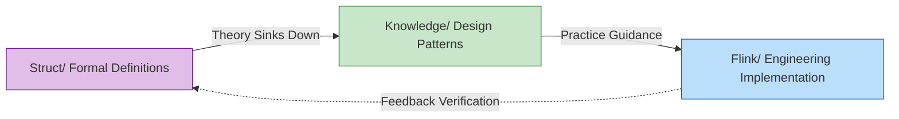
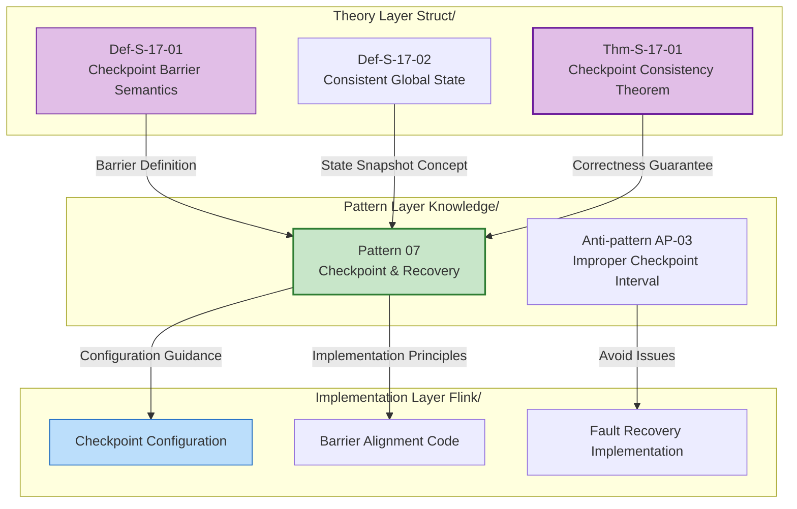

# AnalysisDataFlow Quick Start Guide

> **5 Minutes to Understand the Project | Role-Based Custom Paths | Quick Issue Index**
>
> 📊 **254 Documents | 945 Formalized Elements | 100% Completion**

---

## 1. Quick Overview in 5 Minutes

### 1.1 What is this Project

**AnalysisDataFlow** is a **unified knowledge base** for stream computing—from formal theory to engineering practice full-stack knowledge system.

```
┌─────────────────────────────────────────────────────────────┐
│                    Knowledge Hierarchy Pyramid               │
├─────────────────────────────────────────────────────────────┤
│  L6 Production Implementation │  Flink/ Code, Config, Cases (116 docs)       │
├───────────────────────────────┼─────────────────────────────────────────────┤
│  L4-L5 Patterns               │  Knowledge/ Design Patterns, Tech Selection (102 docs) │
├───────────────────────────────┼─────────────────────────────────────────────┤
│  L1-L3 Theory                 │  Struct/ Theorems, Proofs, Formal Definitions (43 docs) │
└───────────────────────────────┴─────────────────────────────────────────────┘
```

**Core Values**:

- 🔬 **Theoretical Support**: Formal theorems guarantee correctness of engineering decisions
- 🛠️ **Practical Guidance**: Complete mapping path from theorem to code
- 🔍 **Issue Diagnosis**: Rapidly locate solutions by symptoms

---

### 1.2 Three-Directory Structure

| Directory | Positioning | Content Characteristics | Suitable For |
|-----------|-------------|------------------------|--------------|
| **Struct/** | Formal Theory Foundation | Mathematical definitions, theorem proofs, rigorous arguments | Researchers, Architects |
| **Knowledge/** | Engineering Practice Knowledge | Design patterns, business scenarios, technology selection | Architects, Engineers |
| **Flink/** | Flink Specialization | Architecture mechanisms, SQL/API, engineering practices | Development Engineers |

**Knowledge Flow Relationship**:



---

### 1.3 Core Features

#### Six-Section Document Template (Mandatory Structure)

Each core document must contain:

| Section | Content | Example |
|---------|---------|---------|
| 1. Concept Definitions | Strict formal definitions + intuitive explanations | `Def-S-04-04` Watermark semantics |
| 2. Property Derivation | Lemmas and properties derived from definitions | `Lemma-S-04-02` Monotonicity lemma |
| 3. Relationship Establishment | Associations with other concepts/models | Flink→Process Calculus encoding |
| 4. Argumentation Process | Auxiliary theorems, counterexample analysis | Boundary condition discussion |
| 5. Formal Proof | Complete proof of main theorems | `Thm-S-17-01` Checkpoint consistency |
| 6. Examples | Simplified examples, code snippets | Flink configuration examples |
| 7. Visualizations | Mermaid diagrams | Architecture diagrams, flowcharts |
| 8. References | Authoritative source citations | VLDB/SOSP papers |

#### Theorem Numbering System

Globally unified numbering: `{Type}-{Stage}-{Document Number}-{Sequence Number}`

| Number Example | Meaning | Location |
|----------------|---------|----------|
| `Thm-S-17-01` | Struct stage, doc 17, theorem 1 | Checkpoint correctness proof |
| `Def-K-02-01` | Knowledge stage, doc 02, definition 1 | Event Time Processing pattern |
| `Thm-F-12-01` | Flink stage, doc 12, theorem 1 | Online learning parameter convergence |

**Quick Memory**:

- **Thm** = Theorem | **Def** = Definition | **Lemma** = Lemma | **Prop** = Proposition
- **S** = Struct (Theory) | **K** = Knowledge (Knowledge) | **F** = Flink (Implementation)

---

## 2. Role-Based Reading Paths

### 2.1 Architect Path (3-5 days)

**Goal**: Master system design methodology, conduct technology selection and architecture decisions

```
Day 1-2: Concept Foundation
├── Struct/01-foundation/01.01-unified-streaming-theory.md
│   └── Focus: Six-layer expressiveness hierarchy (L1-L6)
├── Knowledge/01-concept-atlas/concurrency-paradigms-matrix.md
│   └── Focus: Five major concurrency paradigm comparison matrix
└── Knowledge/01-concept-atlas/streaming-models-mindmap.md
    └── Focus: Six-dimensional stream computing model comparison

Day 3-4: Patterns and Selection
├── Knowledge/02-design-patterns/ (Browse all)
│   └── Focus: Relationship diagram of 7 core patterns
├── Knowledge/04-technology-selection/engine-selection-guide.md
│   └── Focus: Stream processing engine selection decision tree
└── Knowledge/04-technology-selection/streaming-database-guide.md
    └── Focus: Stream database comparison matrix

Day 5: Architecture Decisions
├── Flink/01-architecture/flink-1.x-vs-2.0-comparison.md
│   └── Focus: Architecture evolution and migration decisions
└── Struct/03-relationships/03.03-expressiveness-hierarchy.md
    └── Focus: Expressiveness and engineering constraints
```

---

### 2.2 Development Engineer Path (1-2 weeks)

**Goal**: Master Flink core technologies, able to develop production-grade stream processing applications

```
Week 1: Quick Start
├── Day 1: Flink/05-vs-competitors/flink-vs-spark-streaming.md
│   └── Flink positioning and advantages
├── Day 2-3: Flink/02-core-mechanisms/time-semantics-and-watermark.md
│   └── Event time, Watermark mechanism
├── Day 4: Knowledge/02-design-patterns/pattern-event-time-processing.md
│   └── Event time processing patterns
└── Day 5: Flink/04-connectors/kafka-integration-patterns.md
    └── Kafka integration best practices

Week 2: Core Mechanisms Deep Dive
├── Day 1-2: Flink/02-core-mechanisms/checkpoint-mechanism-deep-dive.md
│   └── Checkpoint mechanism, fault recovery
├── Day 3: Flink/02-core-mechanisms/exactly-once-end-to-end.md
│   └── Exactly-Once implementation principles
├── Day 4: Flink/02-core-mechanisms/backpressure-and-flow-control.md
│   └── Backpressure handling and flow control
└── Day 5: Flink/06-engineering/performance-tuning-guide.md
    └── Performance tuning practice
```

---

### 2.3 Researcher Path (2-4 weeks)

**Goal**: Understand theoretical foundations, master formal methods, able to conduct innovative research

```
Week 1-2: Theoretical Foundation
├── Struct/01-foundation/01.02-process-calculus-primer.md
│   └── CCS/CSP/π-calculus fundamentals
├── Struct/01-foundation/01.04-dataflow-model-formalization.md
│   └── Dataflow strict formalization
├── Struct/01-foundation/01.03-actor-model-formalization.md
│   └── Actor model formal semantics
└── Struct/02-properties/02.03-watermark-monotonicity.md
    └── Watermark monotonicity theorem

Week 3: Model Relationships and Encoding
├── Struct/03-relationships/03.01-actor-to-csp-encoding.md
│   └── Actor→CSP encoding preservation
├── Struct/03-relationships/03.02-flink-to-process-calculus.md
│   └── Flink→Process Calculus encoding
└── Struct/03-relationships/03.03-expressiveness-hierarchy.md
    └── Six-layer expressiveness hierarchy theorem

Week 4: Formal Proofs and Frontier
├── Struct/04-proofs/04.01-flink-checkpoint-correctness.md
│   └── Checkpoint consistency proof
├── Struct/04-proofs/04.02-flink-exactly-once-correctness.md
│   └── Exactly-Once correctness proof
└── Struct/06-frontier/06.02-choreographic-streaming-programming.md
    └── Choreographic programming frontier
```

---

### 2.4 Student Path (1-2 months)

**Goal**: Gradually build complete knowledge system, from beginner to expert

```
Month 1: Foundation Building
├── Week 1: Concurrent Computing Models
│   ├── Struct/01-foundation/01.02-process-calculus-primer.md
│   ├── Struct/01-foundation/01.03-actor-model-formalization.md
│   └── Struct/01-foundation/01.05-csp-formalization.md
├── Week 2: Stream Computing Fundamentals
│   ├── Struct/01-foundation/01.04-dataflow-model-formalization.md
│   ├── Knowledge/01-concept-atlas/streaming-models-mindmap.md
│   └── Flink/02-core-mechanisms/time-semantics-and-watermark.md
├── Week 3: Core Properties
│   ├── Struct/02-properties/02.01-determinism-in-streaming.md
│   ├── Struct/02-properties/02.02-consistency-hierarchy.md
│   └── Knowledge/02-design-patterns/pattern-event-time-processing.md
└── Week 4: Pattern Practice
    ├── Knowledge/02-design-patterns/ (All)
    └── Knowledge/03-business-patterns/ (Selective)

Month 2: Deep Dive and Expansion
├── Week 5-6: Flink Engineering Practice
│   ├── Flink/02-core-mechanisms/ (All core documents)
│   └── Flink/06-engineering/performance-tuning-guide.md
├── Week 7: Formal Proof Introduction
│   ├── Struct/04-proofs/04.01-flink-checkpoint-correctness.md
│   └── Struct/04-proofs/04.03-chandy-lamport-consistency.md
└── Week 8: Frontier Exploration
    ├── Knowledge/06-frontier/streaming-databases.md
    └── Knowledge/06-frontier/rust-streaming-ecosystem.md
```

---

## 3. Quick Lookup Index

### 3.1 Topic-Based Index

#### Stream Processing Fundamentals

| Topic | Must-Read Documents | Formal Foundation |
|-------|--------------------|--------------------|
| **Event Time Processing** | Knowledge/02-design-patterns/pattern-event-time-processing.md | `Def-S-04-04` Watermark semantics |
| **Window Computation** | Knowledge/02-design-patterns/pattern-windowed-aggregation.md | `Def-S-04-05` Window operators |
| **State Management** | Knowledge/02-design-patterns/pattern-stateful-computation.md | `Thm-S-17-01` Checkpoint consistency |
| **Checkpoint** | Knowledge/02-design-patterns/pattern-checkpoint-recovery.md | `Thm-S-18-01` Exactly-Once correctness |
| **Consistency Levels** | Struct/02-properties/02.02-consistency-hierarchy.md | `Def-S-08-01~04` AM/AL/EO semantics |

#### Design Patterns

| Pattern | Application Scenario | Complexity | Document |
|---------|---------------------|------------|----------|
| P01 Event Time | Out-of-order data processing | ★★★☆☆ | pattern-event-time-processing.md |
| P02 Windowed Aggregation | Window aggregation computation | ★★☆☆☆ | pattern-windowed-aggregation.md |
| P03 CEP | Complex event matching | ★★★★☆ | pattern-cep-complex-event.md |
| P04 Async I/O | External data association | ★★★☆☆ | pattern-async-io-enrichment.md |
| P05 State Management | Stateful computation | ★★★★☆ | pattern-stateful-computation.md |
| P06 Side Output | Data diversion | ★★☆☆☆ | pattern-side-output.md |
| P07 Checkpoint | Fault tolerance | ★★★★★ | pattern-checkpoint-recovery.md |

#### Frontier Technologies

| Technology Direction | Core Documents | Tech Stack |
|---------------------|---------------|------------|
| **Stream Databases** | Knowledge/06-frontier/streaming-databases.md | RisingWave, Materialize |
| **Rust Stream Ecosystem** | Knowledge/06-frontier/rust-streaming-ecosystem.md | Arroyo, Timeplus |
| **Real-time RAG** | Knowledge/06-frontier/real-time-rag-architecture.md | Flink + Vector Databases |
| **Streaming Lakehouse** | Knowledge/06-frontier/streaming-lakehouse-iceberg-delta.md | Flink + Iceberg/Paimon |
| **Edge Stream Processing** | Knowledge/06-frontier/edge-streaming-patterns.md | Edge computing architecture |
| **Streaming Materialized Views** | Knowledge/06-frontier/streaming-materialized-view-architecture.md | Real-time data warehouse |

---

### 3.2 Issue-Based Index

#### Checkpoint-Related Issues

| Issue Symptom | Solution | Reference Document |
|---------------|----------|--------------------|
| Checkpoint frequent timeouts | Enable incremental Checkpoint, use RocksDB | checkpoint-mechanism-deep-dive.md |
| Alignment time too long | Enable Unaligned Checkpoint, adjust debloating | checkpoint-mechanism-deep-dive.md |
| Slow recovery | Local recovery, incremental recovery | checkpoint-mechanism-deep-dive.md |
| State too large | Incremental Checkpoint, state TTL | flink-state-ttl-best-practices.md |

#### Backpressure Handling

| Issue Symptom | Solution | Reference Document |
|---------------|----------|--------------------|
| Severe backpressure | Credit-based flow control tuning, increase parallelism | backpressure-and-flow-control.md |
| Source backpressure | Slow downstream processing, need more parallelism or optimization | performance-tuning-guide.md |
| Sink backpressure | Batch optimization, async writes | performance-tuning-guide.md |

#### Data Skew

| Issue Symptom | Solution | Reference Document |
|---------------|----------|--------------------|
| Hot key | Salting, two-phase aggregation, custom partitioner | performance-tuning-guide.md |
| Window skew | Custom window assigner, allowed lateness | pattern-windowed-aggregation.md |

#### Exactly-Once Issues

| Issue Symptom | Solution | Reference Document |
|---------------|----------|--------------------|
| Data duplication | Check Sink idempotency, 2PC configuration | exactly-once-end-to-end.md |
| Data loss | Check Source replayability, Checkpoint interval | exactly-once-end-to-end.md |

#### AI/ML Stream Processing Issues

| Issue Symptom | Solution | Reference Document |
|---------------|----------|--------------------|
| High model inference latency | Async inference, model caching | model-serving-streaming.md |
| Low vector retrieval accuracy | Index optimization, similarity threshold adjustment | rag-streaming-architecture.md |
| Insufficient feature freshness | Real-time feature engineering, Feature Store | realtime-feature-engineering-feature-store.md |

---

### 3.3 Frequently Used Document Quick Links

#### Core Index Pages

| Index | Purpose | Path |
|-------|---------|------|
| **Project Overview** | Overall project structure understanding | [README.md](./README.md) |
| **Struct Index** | Formal theory navigation | [Struct/00-INDEX.md](./Struct/00-INDEX.md) |
| **Knowledge Index** | Engineering practice knowledge navigation | [Knowledge/00-INDEX.md](./Knowledge/00-INDEX.md) |
| **Flink Index** | Flink specialization navigation | [Flink/00-INDEX.md](./Flink/00-INDEX.md) |
| **Theorem Registry** | Formalized elements global index | [THEOREM-REGISTRY.md](./THEOREM-REGISTRY.md) |
| **Progress Tracking** | Project progress and statistics | [PROJECT-TRACKING.md](./PROJECT-TRACKING.md) |

#### Quick Decision References

| Decision Type | Reference Document |
|---------------|--------------------|
| Stream processing engine selection | Knowledge/04-technology-selection/engine-selection-guide.md |
| Flink vs Spark selection | Flink/05-vs-competitors/flink-vs-spark-streaming.md |
| Flink vs RisingWave selection | Knowledge/04-technology-selection/flink-vs-risingwave.md |
| SQL vs DataStream API | Flink/03-sql-table-api/sql-vs-datastream-comparison.md |
| State backend selection | Flink/06-engineering/state-backend-selection.md |
| Stream database selection | Knowledge/04-technology-selection/streaming-database-guide.md |

#### Production Troubleshooting

| Issue Type | Troubleshooting Document |
|------------|--------------------------|
| Checkpoint issues | Flink/02-core-mechanisms/checkpoint-mechanism-deep-dive.md |
| Backpressure issues | Flink/02-core-mechanisms/backpressure-and-flow-control.md |
| Performance tuning | Flink/06-engineering/performance-tuning-guide.md |
| Memory overflow | Flink/06-engineering/performance-tuning-guide.md |
| Exactly-Once failure | Flink/02-core-mechanisms/exactly-once-end-to-end.md |

#### Anti-pattern Checklist

| Anti-pattern | Detection Document |
|--------------|--------------------|
| Global state abuse | Knowledge/09-anti-patterns/anti-pattern-01-global-state-abuse.md |
| Improper Watermark configuration | Knowledge/09-anti-patterns/anti-pattern-02-watermark-misconfiguration.md |
| Improper Checkpoint interval | Knowledge/09-anti-patterns/anti-pattern-03-checkpoint-interval-misconfig.md |
| Unhandled hot key | Knowledge/09-anti-patterns/anti-pattern-04-hot-key-skew.md |
| ProcessFunction blocking I/O | Knowledge/09-anti-patterns/anti-pattern-05-blocking-io-processfunction.md |
| Complete checklist | Knowledge/09-anti-patterns/anti-pattern-checklist.md |

---

## 4. Example: From Theory to Practice

### Knowledge Flow Example: Checkpoint Consistency



### Complete Knowledge Chain

```
┌─────────────────────────────────────────────────────────────────────┐
│                        Checkpoint Knowledge Chain                    │
├─────────────────────────────────────────────────────────────────────┤
│                                                                     │
│  1. Formal Definitions (Struct/)                                    │
│     Def-S-17-01: Checkpoint Barrier Semantics                     │
│     Def-S-17-02: Consistent Global State G = <𝒮, 𝒞>                │
│     Def-S-17-03: Checkpoint Alignment Definition                   │
│                                                                     │
│           ↓ Theorem Guarantee                                       │
│                                                                     │
│  2. Formal Proofs (Struct/)                                         │
│     Thm-S-17-01: Flink Checkpoint Consistency Theorem              │
│     Lemma-S-17-01: Barrier Propagation Invariant                   │
│     Lemma-S-17-02: State Consistency Lemma                          │
│                                                                     │
│           ↓ Pattern Extraction                                      │
│                                                                     │
│  3. Design Patterns (Knowledge/)                                    │
│     Pattern 07: Checkpoint & Recovery Pattern                       │
│     - Checkpoint interval selection guide                          │
│     - State backend selection matrix                               │
│     - Recovery strategy decision tree                              │
│                                                                     │
│           ↓ Engineering Implementation                              │
│                                                                     │
│  4. Flink Implementation (Flink/)                                   │
│     - Checkpoint configuration parameters                          │
│     - RocksDB state backend configuration                          │
│     - Incremental Checkpoint enablement                            │
│     - Unaligned Checkpoint configuration                           │
│                                                                     │
│           ↓ Production Verification                                 │
│                                                                     │
│  5. Troubleshooting                                                 │
│     - Checkpoint timeout diagnosis                                 │
│     - Alignment time too long handling                             │
│     - Anti-pattern checklist                                        │
│                                                                     │
└─────────────────────────────────────────────────────────────────────┘
```

### Code Mapping Example

**Theorem** `Thm-S-17-01`: Barrier alignment guarantees consistent cut

↓ Mapping

**Pattern** Pattern 07: Checkpoint interval = max(processing latency tolerance, state size/bandwidth)

↓ Mapping

**Flink Configuration**:

```yaml
# flink-conf.yaml
execution.checkpointing.interval: 10s      # Calculated based on theorem
execution.checkpointing.timeout: 60s       # state size/bandwidth + margin
execution.checkpointing.mode: EXACTLY_ONCE # Thm-S-17-01 guarantee
state.backend: rocksdb                     # Large state scenarios
state.backend.incremental: true            # Optimize transfer
```

---

## 5. Frequently Asked Questions

### 5.1 How to Find Specific Topics

**Method 1: Index Navigation**

1. First consult [Struct/00-INDEX.md](./Struct/00-INDEX.md) for theoretical foundations
2. Then consult [Knowledge/00-INDEX.md](./Knowledge/00-INDEX.md) for design patterns
3. Finally consult [Flink/00-INDEX.md](./Flink/00-INDEX.md) for engineering implementation

**Method 2: Theorem Number Tracking**

1. Look up theorem numbers in [THEOREM-REGISTRY.md](./THEOREM-REGISTRY.md)
2. Locate documents by number (e.g., `Thm-S-17-01` → Struct/04-proofs/04.01)
3. Cross-reference related definitions and lemmas

**Method 3: Issue-Driven**

1. Consult Section 3.2 "Issue-Based Index"
2. Match symptoms to solutions
3. Deep read recommended documents

---

### 5.2 How to Understand Theorem Numbering

**Number Format**: `{Type}-{Stage}-{Document Number}-{Sequence Number}`

| Component | Values | Meaning |
|-----------|--------|---------|
| Type | Thm/Def/Lemma/Prop/Cor | Theorem/Definition/Lemma/Proposition/Corollary |
| Stage | S/K/F | Struct/Knowledge/Flink |
| Document Number | 01-99 | Document sequence in directory |
| Sequence Number | 01-99 | Element sequence in document |

**Example Parsing**:

- `Thm-S-17-01`: Struct stage, 04-proofs directory, doc 17, theorem 1 → Checkpoint consistency theorem
- `Def-K-02-01`: Knowledge stage, 02-design-patterns directory, definition 1 → Event Time Processing pattern
- `Lemma-F-12-02`: Flink stage, 12-ai-ml directory, lemma 2 → Online learning related lemma

---

### 5.3 How to Contribute Content

**Contribution Principles**:

1. **Follow the six-section template**: Concept Definitions → Property Derivation → Relationship Establishment → Argumentation Process → Formal Proof → Examples
2. **Use unified numbering**: Number new theorems/definitions by rules, avoid conflicts
3. **Maintain cross-directory references**: Struct definitions → Knowledge patterns → Flink implementation
4. **Add Mermaid diagrams**: At least one visualization per document

**Contribution Workflow**:

1. Check [PROJECT-TRACKING.md](./PROJECT-TRACKING.md) for project status
2. Read [AGENTS.md](./AGENTS.md) for coding standards
3. Create documents in corresponding directories, follow naming: `{level}.{number}-{topic}.md`
4. Update relevant index files (00-INDEX.md)
5. Update theorem registry (THEOREM-REGISTRY.md)

**Quality Gates**:

- References must be verifiable (prefer DOI or stable URLs)
- Mermaid diagrams must pass syntax validation
- Code examples must be runnable
- Formal definitions must be mathematically rigorous

---

## Appendix: Quick Reference

### Six-Layer Expressiveness Hierarchy

```
L₆: Turing-Complete (Fully Undecidable) ── λ-calculus, Turing Machine
L₅: Higher-Order (Mostly Undecidable) ── HOπ, Ambient
L₄: Mobile (Partially Undecidable) ── π-calculus, Actor
L₃: Process Algebra (EXPTIME) ── CSP, CCS
L₂: Context-Free (PSPACE) ── PDA, BPA
L₁: Regular (P-Complete) ── FSM, Regex
```

### Consistency Level Quick Reference

| Level | Definition | Implementation Mechanism | Application Scenario |
|-------|------------|-------------------------|---------------------|
| At-Most-Once (AM) | Effect count ≤ 1 | Deduplication/Idempotency | Log aggregation, monitoring |
| At-Least-Once (AL) | Effect count ≥ 1 | Retry/Replay | Recommendation systems, statistics |
| Exactly-Once (EO) | Effect count = 1 | Source+Checkpoint+Transactional Sink | Financial transactions, orders |

### Core Document Quick Reference

| Scenario | First Entry | Second Entry | Third Entry |
|----------|-------------|--------------|-------------|
| Theory introduction | Struct/01-foundation/01.01 | Struct/01-foundation/01.02 | Struct/00-INDEX |
| Flink introduction | Flink/05-vs-competitors/flink-vs-spark | Flink/02-core-mechanisms/time-semantics | Flink/00-INDEX |
| Pattern learning | Knowledge/02-design-patterns/pattern-event-time | Knowledge/00-INDEX | Select by scenario |
| Issue troubleshooting | Section 3.2 Issue-Based Index | Flink/00-INDEX troubleshooting | Anti-pattern checklist |
| Frontier technologies | Knowledge/06-frontier/ | PROJECT-TRACKING.md | Select by interest |

---

> 📌 **Note**: This document is a quick start guide. For detailed content, please refer to directory indexes and specific documents.
>
> 📅 **Last Updated**: 2026-04-03 | 📝 **Version**: v1.0
