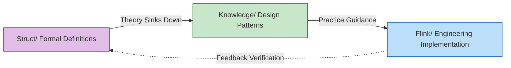

# AnalysisDataFlow Quick Start Guide

> **5-Minute Project Overview | Role-Based Learning Paths | Quick Problem Index**
>
> 📊 **254 Documents | 945 Formal Elements | 100% Completion**

---

## 1. 5-Minute Quick Overview

### 1.1 What is this Project

**AnalysisDataFlow** is the **Unified Knowledge Base** for the stream computing domain — a full-stack knowledge system from formal theory to engineering practice.

```
┌─────────────────────────────────────────────────────────────┐
│                    Knowledge Hierarchy Pyramid                │
├─────────────────────────────────────────────────────────────┤
│  L6 Production  │  Flink/ Code, Config, Cases (116 docs)      │
├─────────────────┼───────────────────────────────────────────┤
│  L4-L5 Patterns │  Knowledge/ Design Patterns, Tech Selection │
├─────────────────┼───────────────────────────────────────────┤
│  L1-L3 Theory   │  Struct/ Theorems, Proofs, Formal Definitions│
└─────────────────┴───────────────────────────────────────────┘
```

**Core Value**:

- 🔬 **Theory Support**: Formal theorems guarantee correctness of engineering decisions
- 🛠️ **Practice Guidance**: Complete mapping path from theorem to code
- 🔍 **Problem Diagnosis**: Rapid solution positioning by symptom

---

### 1.2 Three-Directory Structure

| Directory | Positioning | Content Characteristics | For Whom |
|-----------|-------------|------------------------|----------|
| **Struct/** | Formal Theory Foundation | Mathematical definitions, theorem proofs, rigorous arguments | Researchers, Architects |
| **Knowledge/** | Engineering Practice Knowledge | Design patterns, business scenarios, technology selection | Architects, Engineers |
| **Flink/** | Flink-Specific Technology | Architecture mechanisms, SQL/API, engineering practice | Development Engineers |

**Knowledge Flow**:



---

### 1.3 Core Features

#### Six-Section Document Template (Mandatory Structure)

Each core document must contain:

| Section | Content | Example |
|---------|---------|---------|
| 1. Definitions | Strict formal definition + intuitive explanation | `Def-S-04-04` Watermark semantics |
| 2. Properties | Lemmas and properties derived from definitions | `Lemma-S-04-02` Monotonicity lemma |
| 3. Relations | Connections with other concepts/models | Flink→Process Calculus encoding |
| 4. Argumentation | Auxiliary theorems, counterexample analysis | Boundary condition discussion |
| 5. Proof | Complete proof of main theorem | `Thm-S-17-01` Checkpoint consistency |
| 6. Examples | Simplified instances, code snippets | Flink configuration examples |
| 7. Visualizations | Mermaid diagrams | Architecture diagrams, flowcharts |
| 8. References | Authoritative source citations | VLDB/SOSP papers |

#### Theorem Numbering System

Globally unified numbering: `{Type}-{Stage}-{Document Number}-{Sequence Number}`

| Number Example | Meaning | Location |
|----------------|---------|----------|
| `Thm-S-17-01` | Struct Stage, Doc 17, 1st Theorem | Checkpoint correctness proof |
| `Def-K-02-01` | Knowledge Stage, Doc 02, 1st Definition | Event Time Processing pattern |
| `Thm-F-12-01` | Flink Stage, Doc 12, 1st Theorem | Online learning parameter convergence |

**Quick Memory**:

- **Thm** = Theorem | **Def** = Definition | **Lemma** = Lemma | **Prop** = Proposition
- **S** = Struct (Theory) | **K** = Knowledge (Knowledge) | **F** = Flink (Implementation)

---

## 2. Role-Based Learning Paths

### 2.1 Architect Path (3-5 Days)

**Goal**: Master system design methodology, perform technology selection and architecture decisions

```
Day 1-2: Concept Foundation
├── Struct/01-foundation/01.01-unified-streaming-theory.md
│   └── Focus: Six-layer expressiveness hierarchy (L1-L6)
├── Knowledge/01-concept-atlas/concurrency-paradigms-matrix.md
│   └── Focus: Five concurrency paradigms comparison matrix
└── Knowledge/01-concept-atlas/streaming-models-mindmap.md
    └── Focus: Six-dimensional stream computing model comparison

Day 3-4: Patterns and Selection
├── Knowledge/02-design-patterns/ (Browse all)
│   └── Focus: Relationship diagram of 7 core patterns
├── Knowledge/04-technology-selection/engine-selection-guide.md
│   └── Focus: Stream processing engine selection decision tree
└── Knowledge/04-technology-selection/streaming-database-guide.md
    └── Focus: Streaming database comparison matrix

Day 5: Architecture Decisions
├── Flink/01-architecture/flink-1.x-vs-2.0-comparison.md
│   └── Focus: Architecture evolution and migration decisions
└── Struct/03-relationships/03.03-expressiveness-hierarchy.md
    └── Focus: Expressiveness and engineering constraints
```

---

### 2.2 Development Engineer Path (1-2 Weeks)

**Goal**: Master Flink core technologies, capable of developing production-grade stream processing applications

```
Week 1: Quick Start
├── Day 1: Flink/05-vs-competitors/flink-vs-spark-streaming.md
│   └── Flink positioning and advantages
├── Day 2-3: Flink/02-core/time-semantics-and-watermark.md
│   └── Event time, Watermark mechanism
├── Day 4: Knowledge/02-design-patterns/pattern-event-time-processing.md
│   └── Event time processing pattern
└── Day 5: Flink/04-connectors/kafka-integration-patterns.md
    └── Kafka integration best practices

Week 2: Core Mechanisms Deep Dive
├── Day 1-2: Flink/02-core/checkpoint-mechanism-deep-dive.md
│   └── Checkpoint mechanism, fault recovery
├── Day 3: Flink/02-core/exactly-once-end-to-end.md
│   └── Exactly-Once implementation principles
├── Day 4: Flink/02-core/backpressure-and-flow-control.md
│   └── Backpressure handling and flow control
└── Day 5: Flink/06-engineering/performance-tuning-guide.md
    └── Performance tuning in practice
```

---

### 2.3 Researcher Path (2-4 Weeks)

**Goal**: Understand theoretical foundations, master formal methods, capable of conducting innovative research

```
Week 1-2: Theoretical Foundation
├── Struct/01-foundation/01.02-process-calculus-primer.md
│   └── CCS/CSP/π-calculus foundations
├── Struct/01-foundation/01.04-dataflow-model-formalization.md
│   └── Dataflow strict formalization
├── Struct/01-foundation/01.03-actor-model-formalization.md
│   └── Actor model formal semantics
└── Struct/02-properties/02.03-watermark-monotonicity.md
    └── Watermark monotonicity theorem

Week 3: Model Relations and Encodings
├── Struct/03-relationships/03.01-actor-to-csp-encoding.md
│   └── Actor→CSP encoding preservation
├── Struct/03-relationships/03.02-flink-to-process-calculus.md
│   └── Flink→Process calculus encoding
└── Struct/03-relationships/03.03-expressiveness-hierarchy.md
    └── Six-layer expressiveness hierarchy theorem

Week 4: Formal Proofs and Frontier
├── Struct/04-proofs/04.01-flink-checkpoint-correctness.md
│   └── Checkpoint consistency proof
├── Struct/04-proofs/04.02-flink-exactly-once-correctness.md
│   └── Exactly-Once correctness proof
└── Struct/06-frontier/06.02-choreographic-streaming-programming.md
    └── Choreographic programming frontier
```

---

### 2.4 Student Path (1-2 Months)

**Goal**: Gradually build complete knowledge system, from beginner to expert

```
Month 1: Foundation Building
├── Week 1: Concurrent Computing Models
│   ├── Struct/01-foundation/01.02-process-calculus-primer.md
│   ├── Struct/01-foundation/01.03-actor-model-formalization.md
│   └── Struct/01-foundation/01.05-csp-formalization.md
├── Week 2: Stream Computing Foundations
│   ├── Struct/01-foundation/01.04-dataflow-model-formalization.md
│   ├── Knowledge/01-concept-atlas/streaming-models-mindmap.md
│   └── Flink/02-core/time-semantics-and-watermark.md
└── Week 3: Core Properties
    ├── Struct/02-properties/02.01-determinism-in-streaming.md
    ├── Struct/02-properties/02.02-consistency-hierarchy.md
    └── Knowledge/02-design-patterns/pattern-windowed-aggregation.md

Month 2: Practice and Frontier
├── Week 5-6: Flink Practice
│   ├── Flink tutorials
│   └── Case studies
└── Week 7-8: Frontier Technologies
    ├── Knowledge/06-frontier/
    └── Flink/12-ai-ml/
```

---

## 3. Quick Problem Index

### Common Problems by Category

#### Checkpoint Issues

- [Checkpoint timeout](../../../Flink/02-core/checkpoint-mechanism-deep-dive.md#checkpoint-timeout)
- [Incremental checkpoint not working](../../../Flink/02-core/checkpoint-mechanism-deep-dive.md#incremental-checkpoint)

#### Watermark Issues

- [Watermark not advancing](../../../Flink/02-core/time-semantics-and-watermark.md#watermark-stuck)
- [Late data handling](../../../Knowledge/02-design-patterns/pattern-event-time-processing.md#late-data)

#### Performance Issues

- [Backpressure diagnosis](../../../Flink/02-core/backpressure-and-flow-control.md)
- [State backend selection](../../../Flink/02-core/flink-state-management-complete-guide.md)

---

## 4. Recommended Reading Order

### Minimum Reading (1 Day)

1. This Quick Start Guide
2. [Struct/01.01-unified-streaming-theory.md](../../../USTM-F-Reconstruction/archive/original-struct/01-foundation/01.01-unified-streaming-theory.md) - Overview
3. [Flink/02-core/checkpoint-mechanism-deep-dive.md](../../../Flink/02-core/checkpoint-mechanism-deep-dive.md) - Core mechanism

### Essential Reading (1 Week)

Add to minimum:
4. [Knowledge/02-design-patterns/pattern-event-time-processing.md](../../../Knowledge/02-design-patterns/pattern-event-time-processing.md)
5. [Struct/02-properties/02.02-consistency-hierarchy.md](../../../USTM-F-Reconstruction/archive/original-struct/02-properties/02.02-consistency-hierarchy.md)
6. [Flink/02-core/exactly-once-semantics-deep-dive.md](../../../Flink/02-core/exactly-once-semantics-deep-dive.md)

### Complete Reading (1 Month)

All documents in priority order as listed in project tracking.

---

## 5. How to Use This Knowledge Base

### Search Strategies

1. **By Keyword**: Use the search function in your editor/IDE
2. **By Theorem Number**: Look up in [THEOREM-REGISTRY.md](../../../THEOREM-REGISTRY.md)
3. **By Topic**: Follow the navigation in each section's INDEX.md

### Cross-Reference Navigation

Documents link to each other using relative paths:

```markdown
See [Def-S-04-01](../../../USTM-F-Reconstruction/archive/original-struct/01-foundation/01.04-dataflow-model-formalization.md#def-s-04-01)
```

### Version Information

Each document includes:

- **Version**: When it was last updated
- **Prerequisites**: Documents you should read first
- **Formalization Level**: L1 (conceptual) to L6 (Turing-complete)

---

*Last Updated: 2026-04-09*
*Translation Version: 1.0*
