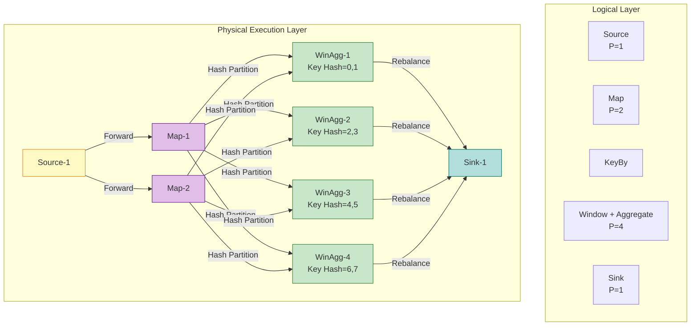
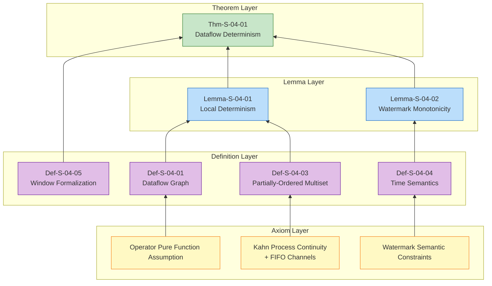

# Dataflow Model Formalization

> Stage: Struct/01-foundation | Prerequisites: [01.01-unified-streaming-theory.md](./01.01-unified-streaming-theory.md) | Formalization Level: L5

---

## Table of Contents

- [Dataflow Model Formalization](#dataflow-model-formalization)
  - [Table of Contents](#table-of-contents)
  - [1. Definitions](#1-definitions)
    - [Def-S-04-01 (Dataflow Graph)](#def-s-04-01-dataflow-graph)
    - [Def-S-04-02 (Operator Semantics)](#def-s-04-02-operator-semantics)
    - [Def-S-04-03 (Stream as Partially-Ordered Multiset)](#def-s-04-03-stream-as-partially-ordered-multiset)
    - [Def-S-04-04 (Event Time, Processing Time, and Watermark)](#def-s-04-04-event-time-processing-time-and-watermark)
    - [Def-S-04-05 (Window Formalization)](#def-s-04-05-window-formalization)
  - [2. Properties](#2-properties)
    - [Lemma-S-04-01 (Operator Local Determinism)](#lemma-s-04-01-operator-local-determinism)
    - [Lemma-S-04-02 (Watermark Monotonicity)](#lemma-s-04-02-watermark-monotonicity)
    - [Prop-S-04-01 (State Operator Idempotency Condition)](#prop-s-04-01-state-operator-idempotency-condition)
  - [3. Relations](#3-relations)
    - [Relation 1: Dataflow Model `⊃` Kahn Process Network (KPN)](#relation-1-dataflow-model-kahn-process-network-kpn)
    - [Relation 2: Synchronous Dataflow (SDF) `⊂` Dynamic Dataflow (DDF) `≈` Dataflow Model](#relation-2-synchronous-dataflow-sdf-dynamic-dataflow-ddf-dataflow-model)
    - [Relation 3: Dataflow Theoretical Model `↦` Flink Runtime Implementation](#relation-3-dataflow-theoretical-model-flink-runtime-implementation)
  - [4. Argumentation](#4-argumentation)
    - [4.1 Determinism of Computation on Partially-Ordered Multisets](#41-determinism-of-computation-on-partially-ordered-multisets)
    - [4.2 Watermark Semantics and Window Closure Boundaries](#42-watermark-semantics-and-window-closure-boundaries)
    - [4.3 Counterexample Construction for Breaking Determinism](#43-counterexample-construction-for-breaking-determinism)
  - [5. Proof / Engineering Argument](#5-proof-engineering-argument)
    - [Thm-S-04-01 (Dataflow Determinism Theorem)](#thm-s-04-01-dataflow-determinism-theorem)
  - [6. Examples](#6-examples)
    - [Example 6.1: WordCount Dataflow Formalization](#example-61-wordcount-dataflow-formalization)
    - [Counterexample 6.1: Counting Errors Due to FIFO Violation](#counterexample-61-counting-errors-due-to-fifo-violation)
    - [Counterexample 6.2: High Latency Due to Improper Watermark Delay](#counterexample-62-high-latency-due-to-improper-watermark-delay)
  - [7. Visualizations](#7-visualizations)
    - [Dataflow Graph Structure](#dataflow-graph-structure)
    - [Concept Dependencies and Proof Tree](#concept-dependencies-and-proof-tree)
  - [8. References](#8-references)

## 1. Definitions

This section establishes the rigorous formal foundation of the Dataflow model, covering dataflow graphs, operator semantics, partially-ordered multiset representation of streams, time semantics, and window formalization. All definitions serve as the foundation for subsequent property derivation and correctness proofs.

### Def-S-04-01 (Dataflow Graph)

A **Dataflow Graph** is a directed acyclic graph (DAG) defined as a quintuple:

$$
\mathcal{G} = (V, E, P, \Sigma, \mathbb{T})
$$

The semantics of each component are as follows:

| Symbol | Type | Semantics |
|--------|------|-----------|
| $V = V_{src} \cup V_{op} \cup V_{sink}$ | Finite set | Vertex set, divided into data sources, operators, and sinks |
| $E \subseteq V \times V \times \mathbb{L}$ | Labeled directed edges | Data dependency relations, label $\ell \in \mathbb{L}$ represents partition strategy |
| $P: V \to \mathbb{N}^+$ | Parallelism function | Assigns positive integer parallelism to each operator |
| $\Sigma: V \to \mathcal{P}(\text{Stream})$ | Stream type signature | Assigns input/output stream type sets to each vertex |
| $\mathbb{T}$ | Time domain | Value range of event time, typically $\mathbb{N}$ or $\mathbb{R}^+$ |

**Constraints**:

1. **Acyclicity**: $\forall k \geq 1, E^k \cap \{(v,v) \mid v \in V\} = \emptyset$;
2. **Source-Sink Existence**: $\exists v_{src}, v_{sink} \in V$ such that $\text{in-degree}(v_{src}) = 0$ and $\text{out-degree}(v_{sink}) = 0$;
3. **Parallelism Consistency**: For edge $(u, v) \in E$, the downstream vertex $v$'s input partition count must be compatible with upstream $u$'s output partition count.

**Intuitive Explanation**: The Dataflow graph is the skeleton of a stream computing program at the logical level, describing where data comes from, what transformations it undergoes, where it eventually goes, and how many parallel instances each transformation needs. It is the bridge connecting high-level APIs to low-level execution engines [^1][^3].

**Definition Motivation**: Without abstracting computation as a DAG with parallelism, we cannot formally analyze data dependencies, parallelism allocation, global consistency snapshot coverage, or state distribution among parallel instances.

---

### Def-S-04-02 (Operator Semantics)

An **Operator** is a computation unit that transforms data streams, defined as a quadruple:

$$
Op = (f_{compute}, \Sigma_{in}, \Sigma_{out}, \tau_{trigger})
$$

Where:

- $f_{compute}: \mathcal{D}^* \times \mathcal{S} \to \mathcal{D}^* \times \mathcal{S}$ is the computation function, mapping input record sequences and current state to output sequences and new state;
- $\Sigma_{in}$ / $\Sigma_{out}$ are input/output port type signatures;
- $\tau_{trigger}: \mathcal{S} \times \mathbb{T} \to \{\text{FIRE}, \text{CONTINUE}\}$ is an optional trigger predicate for window operators.

Standard operator types in the Dataflow model and their formal semantics:

| Operator Type | Semantics | Formal Definition |
|--------------|-----------|-------------------|
| **Source** | Produces streams from unbounded data sources | $\text{Source}(s): \emptyset \to \text{Stream}\langle\mathcal{D}\rangle$ |
| **Map**$(f)$ | One-to-one transformation | $\forall e \in \text{Input}, \; \text{output}(e) = f(e)$ |
| **FlatMap**$(f)$ | One-to-many expansion | $\forall e \in \text{Input}, \; \text{output}(e) = \text{flatten}(f(e))$ |
| **KeyBy**$(\kappa)$ | Key-based logical partitioning | $\forall e \in \text{Input}, \; \text{partition}(e) = \text{hash}(\kappa(e)) \bmod P(v)$ |
| **Window**$(w, t)$ | Window assignment and triggering | $\forall e \in \text{Input}, \; W(e) = w(t_e(e))$; triggers when $t(wid, w)$ is satisfied |
| **Reduce**$(\oplus)$ | Aggregation reduction | $\text{Reduce}(S) = \bigoplus_{e \in S} e$ (requires $\oplus$ to be associative) |
| **Sink** | Data persistence | $\text{Sink}: \text{Stream}\langle\mathcal{D}\rangle \to \emptyset$ |

**Intuitive Explanation**: Operators are the "processing nodes" in a Dataflow graph. Stateless operators (Map/FlatMap) transform elements one by one; stateful operators (KeyBy/Window/Reduce) group by key and aggregate over time windows. Distinguishing stateless from stateful operators is a prerequisite for analyzing fault tolerance and consistency [^2][^3].

**Definition Motivation**: Abstracting operators from concrete programming interfaces allows unified analysis of semantic differences between per-record computation and batch aggregation. The introduction of trigger predicates enables window operators to be incorporated into the same framework without requiring a separate formal system [^1].

---

### Def-S-04-03 (Stream as Partially-Ordered Multiset)

In the Dataflow model, a **Stream** is not a simple sequence, but a **multiset** (bag, allowing duplicate elements) with a temporal partial order relation. Formally:

$$
\mathcal{S} = (M, \mu, \preceq, t_e, t_p)
$$

Where:

- $M \subseteq \mathcal{D} \times \mathbb{T} \times \mathbb{T}$ is the record set, each record $r = \langle \text{payload}, t_{event}, t_{proc} \rangle$;
- $\mu: M \to \mathbb{N}^+$ is the **multiplicity function**, allowing records with identical payload and timestamp to exist in multiple forms;
- $t_e: M \to \mathbb{T}$ is the **event time** mapping, $t_e(r)$ represents the time when record $r$ occurred in business logic;
- $t_p: M \to \mathbb{T}$ is the **processing time** mapping, $t_p(r)$ represents the moment when record $r$ is processed by the system;
- $\preceq \subseteq M \times M$ is the **event time partial order relation**, defined as:
  $$
  r_1 \preceq r_2 \iff t_e(r_1) < t_e(r_2) \lor (t_e(r_1) = t_e(r_2) \land r_1 = r_2)
  $$
  When $t_e(r_1) = t_e(r_2)$ and $r_1 \neq r_2$, $r_1$ and $r_2$ are **concurrent**, denoted $r_1 \parallel r_2$.

**Stream Processing Order** is a total order $\prec_{proc}$, which is some **linear extension** of the partial order $\preceq$, i.e.:
$$
r_1 \preceq r_2 \implies r_1 \prec_{proc} r_2 \lor r_1 \parallel r_2
$$
But due to network disorder, $\prec_{proc}$ may be inconsistent with $\preceq$ — this is precisely why stream computing requires the Watermark mechanism.

**Intuitive Explanation**: A stream is a collection of data that continuously arrives over time. Defining streams as partially-ordered multisets rather than simple sequences emphasizes the decoupling between the intrinsic order of event time and the extrinsic order of processing time. Event time is an inherent property of the record itself, while processing time is an observation of the machine clock [^1][^6].

**Definition Motivation**: Without distinguishing these two time semantics and treating streams as partially-ordered structures, we cannot formally handle out-of-order data, late data, or window trigger conditions. The introduction of event time is the core characteristic that distinguishes stream computing from batch computing, enabling systems to produce deterministic results even when arrival is unordered [^3][^7].

---

### Def-S-04-04 (Event Time, Processing Time, and Watermark)

Time semantics in the Dataflow model consist of three core concepts:

**Event Time**:
$$
t_e: \mathcal{D} \to \mathbb{T}
$$
Represents the time when a data element occurred at its source, carried by the data itself, and is the only reliable source of business logic time.

**Processing Time**:
$$
t_p: () \to \mathbb{T}_{wall}
$$
Represents the moment when an element is actually processed by an operator instance, determined by the local system clock of the distributed machine.

**Watermark**:
$$
w: \text{Stream} \to \mathbb{T} \cup \{+\infty\}
$$
Watermark is a special progress indicator whose semantic constraint is:
$$
\forall r \in \mathcal{S}, \quad \text{if } t_e(r) \leq w(\mathcal{S}) \text{, then } r \text{ has arrived or will never arrive.}
$$

Watermark generation strategies include:

- **Periodic Watermark**: $w(t) = \max_{r \in \text{observed}} t_e(r) - L$, where $L$ is the maximum out-of-orderness tolerance;
- **Punctuated Watermark**: Explicitly injected by special events (punctuations);
- **Monotonic Watermark**: $w(t) = \max_{r \in \text{observed}} t_e(r)$, assuming data source is strictly ordered by event time.

**Intuitive Explanation**: Watermark is a "lower bound estimate" of event time progress in distributed stream processing systems. It tells downstream operators: "All events with timestamps less than or equal to the current Watermark should have arrived." Window operators rely on Watermark to determine when it is safe to close windows and output results [^1][^2].

**Definition Motivation**: In distributed environments, event arrival order is inconsistent with generation order. Elevating Watermark from an implementation detail to a core component of formal semantics is a necessary condition for subsequent proofs of window triggering correctness.

---

### Def-S-04-05 (Window Formalization)

A **Window Operator** divides the infinite event time domain into finite time buckets, defined as a quadruple:

$$
\text{WindowOp} = (W, A, T, F)
$$

Where:

- $W: \mathcal{D} \to \mathcal{P}(\text{WindowID})$ is the **Window Assigner**, mapping each record to a set of window identifiers;
- $A: \text{WindowID} \to \text{Accumulator}$ is the **Window State**, maintaining an accumulator for each window;
- $T: \text{WindowID} \times \mathbb{T} \to \{\text{FIRE}, \text{CONTINUE}\}$ is the **Trigger**, determining when to output window results;
- $F \in \mathbb{T}$ is the **Allowed Lateness**, representing the time range after window closure during which late events can still be accepted.

For event time window $wid = [t_{start}, t_{end})$, its trigger condition is:
$$
T(wid, w) = \text{FIRE} \iff w \geq t_{end} + F
$$

The semantic output of a window is:
$$
\text{Output}(wid) = \bigoplus_{\{r \in \mathcal{S} \mid wid \in W(r) \land t_e(r) \leq w(\tau_{fire})\}} r
$$
Where $\tau_{fire}$ is the first moment when the trigger condition is satisfied.

Standard window type formalizations:

| Window Type | Definition | Example |
|-------------|------------|---------|
| **Tumbling Window** | $[n\delta, (n+1)\delta)$ | Fixed size, non-overlapping |
| **Sliding Window** | $[n \cdot \text{slide}, n \cdot \text{slide} + \delta)$ | Fixed size, can overlap |
| **Session Window** | Dynamic, defined by activity gap | Closes when no activity exceeds gap |

**Intuitive Explanation**: Windows are the bridge from "per-record computation" to "batch aggregation" in stream computing. They divide infinite stream data into finite time buckets, enabling aggregation, joins, and other batch processing operations to be defined on streams [^1][^3].

**Definition Motivation**: Explicitly defining window trigger conditions as functions of Watermark and allowed lateness directly leads to the theorem that "Watermark monotonicity guarantees window result correctness." This is one of the most important theoretical guarantees of the Dataflow model in engineering practice.

---

## 2. Properties

From the above definitions, this section derives key local properties of the Dataflow model.

### Lemma-S-04-01 (Operator Local Determinism)

**Statement**: In Dataflow graph $\mathcal{G}$, if operator $op \in V_{op}$'s computation function $f_{compute}$ is a pure function (no external side effects, no non-deterministic input), and its input stream as a partially-ordered multiset is fixed, then for given input, $op$'s output stream is uniquely determined.

**Derivation**:

1. From Def-S-04-02, operator output only depends on its input records and current state;
2. If $f_{compute}$ is a pure function, then for the same input and state, output must be the same;
3. From Def-S-04-01, partition strategy is deterministic for given record $r$ and parallel topology (Hash partitioning is deterministic);
4. Therefore, the input multiset received by each operator instance is deterministic;
5. Due to functional mapping determinism, output multiset is also uniquely determined. ∎

> **Inference [Model→Implementation]**: Operator local determinism means systems like Flink can adopt out-of-order execution, speculative execution, or dynamic rescheduling optimizations at runtime without breaking result correctness [^4][^7].

---

### Lemma-S-04-02 (Watermark Monotonicity)

**Statement**: During Dataflow graph execution, any operator instance's current Watermark $w_v$ is monotonically non-decreasing over processing time:
$$
\forall v \in V, \; \forall \tau_1 < \tau_2, \quad w_v(\tau_1) \leq w_v(\tau_2)
$$

**Derivation**:

1. From Def-S-04-04, Source operator-generated Watermark is based on the maximum observed event time minus delay estimation. As new records continuously arrive, the maximum observed event time is non-decreasing, therefore Source's Watermark is monotonically non-decreasing;
2. For single-input operators (Map, Filter), output Watermark directly passes through input Watermark, monotonicity is preserved;
3. For multi-input operators (Join, CoGroup), output Watermark takes the minimum of all input Watermarks: $w_{out} = \min_i w_{in_i}$. The minimum function is monotonic in its arguments: if all input $w_{in_i}$ are non-decreasing, then their minimum is also non-decreasing;
4. Since Dataflow graph is an acyclic DAG (Def-S-04-01), by topological sort induction, all operators' Watermarks in the graph are monotonically non-decreasing. ∎

> **Inference [Control→Execution]**: Watermark monotonicity requires the execution layer to guarantee control records (Watermarks) are propagated in FIFO order through network channels, without reordering or loss [^2][^3].

---

### Prop-S-04-01 (State Operator Idempotency Condition)

**Statement**: If a Keyed state operator's state transition function $\delta$ satisfies associativity, and records of the same key are always routed to the same parallel instance, then the operator's replay after fault recovery is idempotent.

**Derivation**:

1. Let $R_k$ be the set of records belonging to key $k$. In fault-free continuous processing, final state is $s'(k) = \text{fold}(\delta, s(k), R_k)$;
2. Since $\delta$ satisfies associativity, $\text{fold}(\delta, s(k), R_k)$'s result is independent of processing order (only depends on record set);
3. From Def-S-04-02, KeyBy's Hash partitioning guarantees all records of $R_k$ are always processed by the same task instance;
4. After fault recovery, even if replay changes record order, as long as $R_k$'s set is unchanged, final state is consistent with the fault-free case;
5. Therefore, replay is idempotent. ∎

> **Inference [Execution→Data]**: The idempotency condition is the data-layer foundation for end-to-end Exactly-Once semantics. It requires state aggregation operations (sum, count, max) to be based on accumulative functions satisfying associativity [^2][^6].

---

## 3. Relations

This section establishes strict relationships between the Dataflow model and other computational models and engineering implementations.

### Relation 1: Dataflow Model `⊃` Kahn Process Network (KPN)

**Argument**:

- **Encoding Existence**: Each process in a Kahn network can be encoded as an operator in a Dataflow graph, FIFO channels correspond to edges in Dataflow graph. Kahn process's blocking read corresponds to trigger rules depending on data availability in Dataflow, non-blocking write corresponds to unconditional record production [^4].
- **Separation Result**: The Dataflow model supports explicit parallelism function $P$, partition strategies, stateful window aggregation, and unified event time semantics — concepts that don't exist in classical KPN. KPN assumes single-process sequential execution and unbounded FIFO, while Dataflow model explicitly handles parallel instances and finite buffers.
- **Conclusion**: Kahn network is a theoretical subset of the Dataflow model; Dataflow model adds engineering-required extensions for parallelization, state management, and time semantics on top of KPN.

### Relation 2: Synchronous Dataflow (SDF) `⊂` Dynamic Dataflow (DDF) `≈` Dataflow Model

**Argument**:

- **Encoding Existence**: SDF is a special case of DDF — when all nodes in DDF have static trigger rules and constant production-consumption rates, DDF degenerates into SDF [^5]. Flink's DataStream API (supporting iteration, dynamic branching) essentially belongs to the DDF category, therefore Dataflow Model's expressiveness `⊇` DDF `⊇` SDF.
- **Static vs Dynamic**: SDF's static schedulability (compile-time determination of scheduling tables and buffer bounds) makes it the theoretical foundation for batch mode (bounded streams); DDF's Turing completeness enables it to express general stream computing, but at the cost of generally undecidable scheduling analysis [^7].
- **Conclusion**: The Dataflow model is compatible with both SDF subsets (for static optimization) and DDF supersets (for general expression), serving as a unified framework connecting theoretical analysis and engineering implementation.

### Relation 3: Dataflow Theoretical Model `↦` Flink Runtime Implementation

**Argument**:

- **Three-Layer Graph Transformation**: Flink Runtime transforms the logical Dataflow graph into three-layer execution graphs: StreamGraph (logical graph) → JobGraph (job graph, merging chainable operators) → ExecutionGraph (execution graph, unfolding parallel instances and binding to Slots) [^3].
- **Semantic Preservation**: StreamGraph to JobGraph operator chaining is equivalent to function composition, introducing or eliminating no record-level semantics; JobGraph to ExecutionGraph parallel unfolding preserves partition strategy determinism (Flink counterpart of Lemma 4.2).
- **State Mapping**: Flink's `KeyedStateBackend` (e.g., `HeapKeyedStateBackend`, `RocksDBKeyedStateBackend`) implements the state space $\mathcal{S}$ and state transition function $\delta$ in the Dataflow model.
- **Time Mapping**: Flink's `WatermarkGenerator` and `WindowOperator` respectively implement Watermark semantics and window trigger conditions from Def-S-04-04 and Def-S-04-05.

> **Inference [Theory→Model]**: Kahn network's determinism (theory layer) guarantees that the Dataflow model (model layer) can serve as the correctness foundation for stream computing; DDF's Turing completeness (model layer) means Flink (implementation layer) cannot rely on static tools to completely detect all deadlocks [^4][^5][^7].

---

## 4. Argumentation

This section provides auxiliary lemmas, counterexample analysis, and boundary discussions to prepare for the strict proof of the main theorem.

### 4.1 Determinism of Computation on Partially-Ordered Multisets

In batch processing models, data is viewed as a set or bag, and computation results are independent of element order. In stream processing models, due to the introduction of event time partial order $\preceq$, computation determinism depends on respecting the partial order structure.

**Key Observation**: For stateless operator Map$(f)$, since $f$ is applied element-wise, the concurrent relationship $r_1 \parallel r_2$ of records does not affect output — the output multiset is simply $\{f(r) \mid r \in \mathcal{S}\}$. But for stateful operator Reduce$(\oplus)$, the situation is more complex: if $\oplus$ satisfies both associativity and commutativity, results are independent of processing order; if only associativity is satisfied, results depend on the linear extension order of records, but since records of the same key are routed to the same instance (Def-S-04-02), the linear extension seen by that instance is deterministic, therefore final results remain deterministic.

### 4.2 Watermark Semantics and Window Closure Boundaries

**Boundary Discussion**: Watermark $w$'s semantics is "all events with event time $\leq w$ have arrived or will never arrive" (Def-S-04-04). This is a **probabilistic guarantee** rather than an absolute guarantee — for periodic Watermark strategy $w(t) = \max t_e - L$, if there exists a late event $r$ satisfying $t_e(r) \leq w$ but actually arriving after $w$, then that event will be dropped or sent to side output.

This means:

- When $L$ (maximum out-of-orderness tolerance) **equals or exceeds** actual out-of-orderness, window results are **complete and correct**;
- When $L$ **is less than** actual out-of-orderness, window results are **deterministic but incomplete** (late events are missed);
- When $L$ **is much greater than** actual out-of-orderness, window results are complete but **high latency**.

This boundary condition is the formal embodiment of the Dataflow model's "correctness-latency-cost" triangular trade-off [^1].

### 4.3 Counterexample Construction for Breaking Determinism

**Counterexample Analysis 1: Non-FIFO Channel Causes Determinism Collapse**

Assume an edge $(u, v)$ in a Dataflow graph is implemented as an out-of-order queue (rather than FIFO). Consider $u$ sending record sequence $\langle r_1, r_2 \rangle$ (where $t_e(r_1) < t_e(r_2)$), but $v$ receives in order $\langle r_2, r_1 \rangle$. If $v$ is a stateful operator Reduce$(\oplus)$ and $\oplus$ does not satisfy commutativity, then the two processing orders may produce different final states.

This violates the Dataflow model's implicit assumption about channel ordering, causing **Lemma S-04-01's premise to fail**, thereby breaking **Theorem S-04-01's** global determinism conclusion.

**Counterexample Analysis 2: Dynamic Topology Changes Introduce Unrepresentable Intermediate States**

The parallelism function $P: V \to \mathbb{N}^+$ in Dataflow graph $\mathcal{G}$ is static in formalization. In engineering practice, Flink supports stopping jobs via Savepoint, modifying parallelism, then resuming. But during rescaling, state needs to migrate from old task instances to new task instances, and the system briefly enters a hybrid state of "partial old graph, partial new graph." This intermediate state has no counterpart in the static DAG formalization, so its correctness cannot be proved — this is a known formalization gap between model expressiveness and engineering implementation [^3][^7].

---

## 5. Proof / Engineering Argument

### Thm-S-04-01 (Dataflow Determinism Theorem)

**Statement**: Given a Dataflow graph $\mathcal{G} = (V, E, P, \Sigma, \mathbb{T})$, if it satisfies:

1. All operators $op \in V_{op}$'s computation functions $f_{compute}$ are pure functions (no external side effects);
2. All data flow edges $e \in E$ guarantee FIFO transmission order;
3. Input sources produce fixed partially-ordered multisets (i.e., event time partial order structure $M_{in}$ is deterministic);

Then for given input, the Dataflow graph's output stream (as a partially-ordered multiset) is **uniquely determined**, independent of specific scheduling strategy, execution speed, or parallel instance activation order.

**Proof**:

**Step 1: Establish Local Determinism**

By Lemma-S-04-01, for any operator $op \in V$, if its input multiset and current state are deterministic, then its output multiset and updated state are uniquely determined. This is because we assume $f_{compute}$ is a pure function, and for given record $r$, partition strategy output is deterministic (Def-S-04-01).

**Step 2: Establish Topological Induction Base Case**

Consider topological sort $v_1, v_2, \ldots, v_n$ of the Dataflow graph (guaranteed to exist by Def-S-04-01's acyclicity).

- For base case $v_1$ (Source operator), its output is directly determined by fixed input multiset $M_{in}$. Since $M_{in}$'s event time partial order $\preceq$ is deterministic, Source's produced stream (including Watermark generation strategy) is also deterministic.
- Source's output is transmitted through FIFO edge $e = (v_1, v_2)$. By FIFO assumption, the record order received by downstream operators may be inconsistent with event time partial order, but for each specific edge, the record arrival sequence is the unique linear preservation of Source's output sequence.

**Step 3: Establish Topological Induction Step**

Assume outputs of all operators at layers $1, 2, \ldots, k-1$ are already uniquely determined. Consider operator $v_k$ at layer $k$:

- $v_k$'s input comes from one or more operators at layer $k-1$. By induction hypothesis, these upstream operators' outputs are already uniquely determined;
- By FIFO assumption, record sequences transmitted on each input edge are deterministic;
- Therefore, the input multiset received by $v_k$ (union of all input edges) is deterministic;
- By Step 1's local determinism, $v_k$'s output multiset is also uniquely determined.

**Step 4: Handle Multi-Input Operator Watermark**

For multi-input operators (Join, CoGroup), output Watermark is $w_{out} = \min_i w_{in_i}$ (Def-S-04-04). By Lemma-S-04-02, each input Watermark is monotonically non-decreasing, therefore the minimum is also monotonically non-decreasing. Watermark determinism guarantees window trigger timing determinism (Def-S-04-05), thereby guaranteeing window operator output multiset determinism.

**Step 5: Conclusion**

By mathematical induction, from Source layer to Sink layer, all operators' outputs in the Dataflow graph are uniquely determined. Therefore, the entire graph's final output (result stream produced by Sink) is deterministic, independent of specific scheduling strategy, execution speed, or relative speed of parallel instances. ∎

> **Inference [Theory→Model]**: The Dataflow determinism theorem guarantees that: as long as operator purity and channel FIFO are maintained, systems can safely adopt dynamic scheduling, out-of-order execution, speculative execution, and other runtime optimizations without breaking result correctness [^1][^4][^7].
>
> **Inference [Model→Implementation]**: This theorem provides the theoretical foundation for Flink's Checkpoint fault tolerance mechanism — even if faults cause replay and rescheduling, recovered output remains consistent with fault-free continuous processing output (assuming state transition functions satisfy associativity, see Prop-S-04-01) [^2][^6].

---

## 6. Examples

### Example 6.1: WordCount Dataflow Formalization

Consider a simplified event time WordCount stream processing job:

```java

// [伪代码片段 - 不可直接运行] 仅展示核心逻辑
import org.apache.flink.streaming.api.datastream.DataStream;
import org.apache.flink.streaming.api.windowing.time.Time;

DataStream<String> text = env.socketTextStream("localhost", 9999);

DataStream<Tuple2<String, Integer>> wordCounts = text
    .flatMap(new Tokenizer())           // FlatMap: sentence → word list
    .keyBy(value -> value.f0)           // KeyBy: group by word
    .window(TumblingEventTimeWindows.of(Time.seconds(5)))
    .aggregate(new CountAggregate());   // Window aggregation count

wordCounts.print();
```

**Formalization Expansion**:

1. **Dataflow Graph Construction**:
   - $V = \{\text{Source}, \text{FlatMap}, \text{KeyBy/Window}, \text{Aggregate}, \text{Sink}\}$
   - $E = \{(\text{Source}, \text{FlatMap}), (\text{FlatMap}, \text{KeyBy/Window}), (\text{KeyBy/Window}, \text{Aggregate}), (\text{Aggregate}, \text{Sink})\}$
   - $P(\text{FlatMap}) = 2, P(\text{KeyBy/Window}) = 4, P(\text{Aggregate}) = 4$

2. **Stream Formalization**:
   Input stream $\mathcal{S}_{in}$ contains records like $(\text{"hello world"}, t_e=1000, t_p=1002)$. After FlatMap, two records are produced: $(\text{"hello"}, t_e=1000, t_p=1003)$ and $(\text{"world"}, t_e=1000, t_p=1003)$. Their event time partial order relationship: since $t_e$ is the same, these two records are concurrent ($r_{hello} \parallel r_{world}$).

3. **KeyBy Partitioning**:
   Let Hash("hello") % 4 = 1, Hash("world") % 4 = 3. Then $r_{hello}$ is routed to Aggregate instance 1, $r_{world}$ to instance 3. Since records of the same word are always hashed to the same instance, each instance's counter state is deterministic.

4. **Window Triggering**:
   Window assigner $W$ maps event time $t_e=1000$ to window $[0, 5000)$. When Watermark advances to $w \geq 5000 + F$ ($F$ is allowed lateness), trigger $T$ returns FIRE, window state $A([0, 5000))$ outputs $(\text{"hello"}, count), (\text{"world"}, count)$.

5. **Determinism Verification**:
   Regardless of how fast FlatMap's two parallel instances execute, regardless of whether "hello" or "world" is processed first, as long as the input multiset is fixed, the final counts of "hello" and "world" in window [0,5000) are uniquely determined. This is directly guaranteed by Thm-S-04-01.

---

### Counterexample 6.1: Counting Errors Due to FIFO Violation

**Scenario**: Assume the network channel from FlatMap → KeyBy undergoes record reordering for some reason. Input is two records: $(\text{"A"}, t_e=1)$ and $(\text{"A"}, t_e=2)$, but due to disorder, KeyBy instance receives the $t_e=2$ record first, then the $t_e=1$ record.

If Aggregate operator is implemented as a non-commutative subtraction accumulator (e.g., state update is $s := s + (t_e \times 1)$, i.e., time-weighted counting), then:

- FIFO correct order: $s = 1 + 2 = 3$
- Out-of-order arrival: $s = 2 + 1 = 3$ (coincidentally same in this example, but change to multiplication and it's different: $1 \times 2 = 2$ vs $2 \times 1 = 2$. Better example with fractions: $s := s + 1/t_e$ is order-independent. Even better example with string concatenation: $s := s \oplus \text{str}(t_e)$. Correct: "1" + "2" = "12"; Out-of-order: "2" + "1" = "21".

**Analysis**:

- **Violated Premise**: Thm-S-04-01 requires edges to guarantee FIFO transmission order. This example violates this premise through channel reordering.
- **Resulting Anomaly**: For non-commutative state transition functions (e.g., string concatenation), out-of-order arrival leads to different final states ("12" vs "21"), determinism is broken.
- **Conclusion**: Engineering implementations must guarantee FIFO semantics of network channels, otherwise Kahn/Dataflow theoretical guarantees fail. Flink maintains FIFO order within single partitions through Netty's TCP connections and sequence number mechanisms [^3][^4].

---

### Counterexample 6.2: High Latency Due to Improper Watermark Delay

**Scenario**: Configure Watermark strategy as `forBoundedOutOfOrderness(Duration.ofSeconds(60))`, i.e., maximum out-of-orderness tolerance $L = 60$ seconds. Window is 5-second tumbling event time window, allowed lateness $F = 0$.

**Execution Timeline**:

| Actual Time | Event Time | Watermark Value | Window State |
|-------------|------------|-----------------|--------------|
| 0s | 0s | -60s | [0,5) Accumulating |
| 5s | 5s | -55s | [0,5) Still not triggered |
| ... | ... | ... | ... |
| 60s | 60s | 0s | [0,5) Still not triggered |
| 65s | 65s | 5s | **[0,5) Triggered!** |

**Analysis**:

- All events in window [0,5) have fully arrived at event time 5s, but because Watermark always lags maximum event time by 60 seconds, the window is not triggered until actual time 65s.
- **Violated Premise**: Watermark delay $L$ should match actual data out-of-orderness. In this example $L=60$ seconds is much greater than actual out-of-orderness (assuming data arrives basically on time).
- **Resulting Anomaly**: Results are correct but latency is extremely high, losing the low-latency advantage of stream processing.
- **Conclusion**: Watermark delay parameter is an explicit trade-off between "result completeness" and "result latency", requiring dynamic calibration based on data source characteristics [^1][^2].

---

## 7. Visualizations

### Dataflow Graph Structure

The following diagram shows a typical Dataflow graph topology, including Source, parallel-expanded Map operator, KeyBy-partitioned Window-Aggregate operator, and final Sink. This diagram embodies the core structure from logical graph to physical execution in the Dataflow model.



**Diagram Explanation**:

- Yellow nodes represent data sources, responsible for producing unbounded streams and initial Watermarks;
- Purple nodes represent stateless transformation operators (Map), distributing one-to-one or round-robin via Forward partitioning;
- Green nodes represent stateful window aggregation operators, routing records of the same Key to the same parallel instance through Hash partitioning — this is key to state consistency;
- Cyan nodes represent data sinks, aggregating all upstream results through Rebalance.

---

### Concept Dependencies and Proof Tree



**Diagram Explanation**:

- Bottom yellow nodes are irreducible theoretical axioms;
- Middle purple nodes are the core formalization definitions of this document;
- Blue nodes are auxiliary lemmas connecting definitions to theorems;
- Top green node is the Dataflow determinism theorem, whose proof depends on topological induction and composition of local determinism.

---

## 8. References

[^1]: T. Akidau et al., "The Dataflow Model: A Practical Approach to Balancing Correctness, Latency, and Cost in Massive-Scale, Unbounded, Out-of-Order Data Processing," *PVLDB*, 8(12), 2015.

[^2]: T. Akidau et al., "MillWheel: Fault-Tolerant Stream Processing at Internet Scale," *VLDB*, 2013.

[^3]: Apache Flink Documentation, "Flink Architecture," 2025. <https://nightlies.apache.org/flink/flink-docs-stable/docs/concepts/flink-architecture/>

[^4]: G. Kahn, "The semantics of a simple language for parallel programming," *IFIP*, 1974.

[^5]: E.A. Lee and D.G. Messerschmitt, "Synchronous data flow," *Proc. IEEE*, 1987.

[^6]: K.M. Chandy and L. Lamport, "Distributed Snapshots: Determining Global States of Distributed Systems," *ACM Trans. Comput. Syst.*, 3(1), 1985.

[^7]: P. Carbone et al., "Apache Flink: Stream and Batch Processing in a Single Engine," *IEEE Data Eng. Bull.*, 38(4), 2015.

---

*Document Version: v1.0 | Last Updated: 2026-04-02 | Status: Complete*
