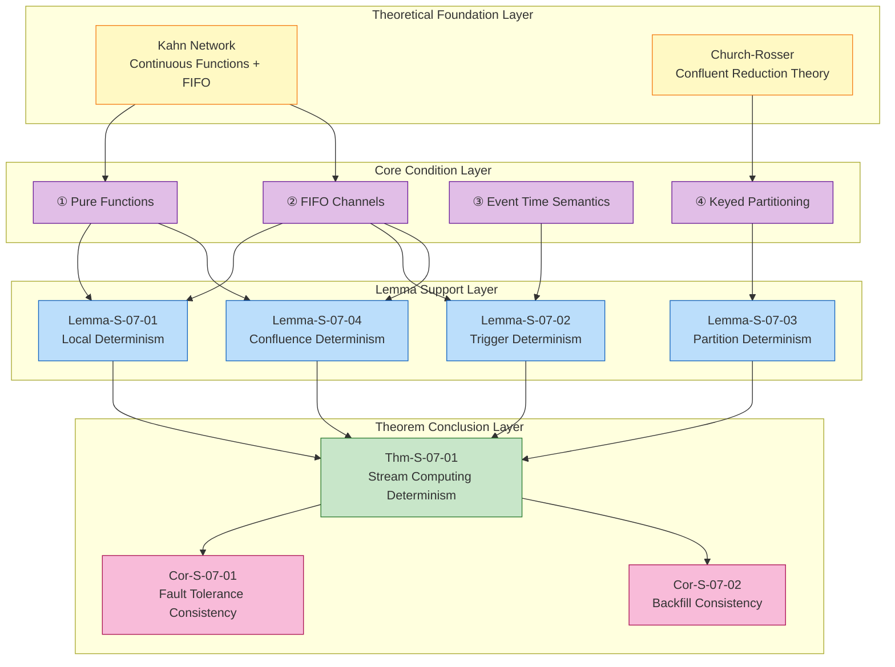
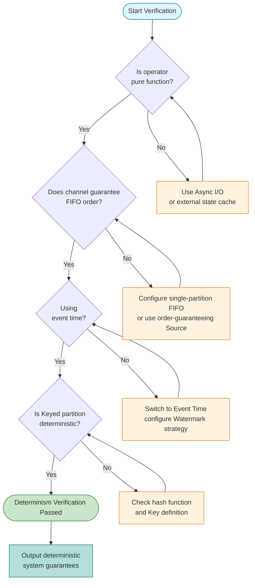
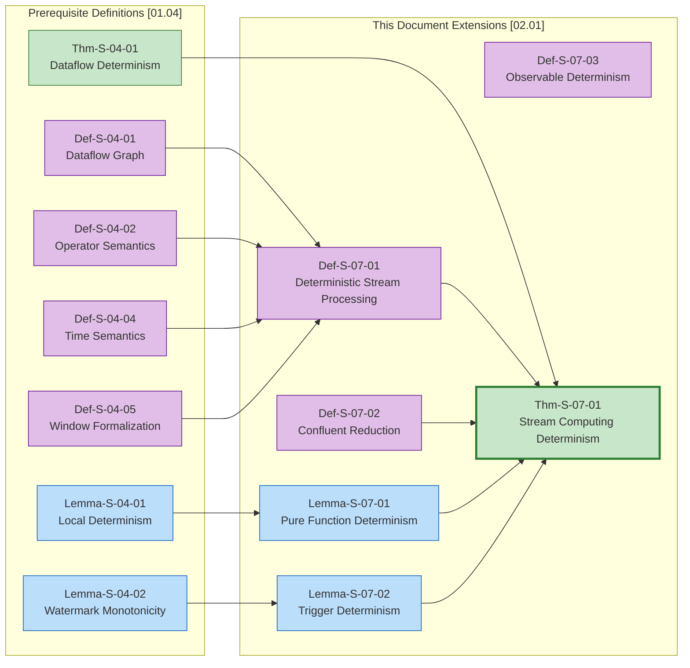

# Determinism in Streaming Computation

> Stage: Struct/02-properties | Prerequisites: [01.04-dataflow-model-formalization.md](../01-foundation/01.04-dataflow-model-formalization.md) | Formalization Level: L5

---

## Table of Contents

- [Determinism in Streaming Computation](#determinism-in-streaming-computation)
  - [Table of Contents](#table-of-contents)
  - [1. Definitions](#1-definitions)
    - [Def-S-07-01 (Deterministic Stream Processing System)](#def-s-07-01-deterministic-stream-processing-system)
    - [Def-S-07-02 (Confluent Reduction)](#def-s-07-02-confluent-reduction)
    - [Def-S-07-03 (Observable Determinism)](#def-s-07-03-observable-determinism)
    - [Def-S-07-04 (Race-Free Condition)](#def-s-07-04-race-free-condition)
  - [2. Properties](#2-properties)
    - [Lemma-S-07-01 (Pure Function Operator Local Determinism)](#lemma-s-07-01-pure-function-operator-local-determinism)
    - [Lemma-S-07-02 (Watermark Monotonicity Guarantees Trigger Determinism)](#lemma-s-07-02-watermark-monotonicity-guarantees-trigger-determinism)
    - [Lemma-S-07-03 (Partition Hash Determinism)](#lemma-s-07-03-partition-hash-determinism)
    - [Lemma-S-07-04 (Confluent System Global Determinism)](#lemma-s-07-04-confluent-system-global-determinism)
    - [Lemma-S-07-05 (Pure Function + FIFO + Event Time → Observable Determinism)](#lemma-s-07-05-pure-function--fifo--event-time--observable-determinism)
    - [Lemma-S-07-06 (Race-Free ↔ Keyed Partition State Isolation)](#lemma-s-07-06-race-free--keyed-partition-state-isolation)
    - [Lemma-S-07-07 (Associative Aggregation Functions Insensitive to Replay Order)](#lemma-s-07-07-associative-aggregation-functions-insensitive-to-replay-order)
  - [3. Relations](#3-relations)
    - [Relation 1: Deterministic Stream Processing `≃` Kahn Network Determinism](#relation-1-deterministic-stream-processing--kahn-network-determinism)
    - [Relation 2: Confluent Reduction `⇒` Dataflow Determinism](#relation-2-confluent-reduction--dataflow-determinism)
    - [Relation 3: Observable Determinism `⊂` Semantic Determinism](#relation-3-observable-determinism--semantic-determinism)
  - [4. Argumentation](#4-argumentation)
    - [4.1 Boundary Conditions of Pure Functionality](#41-boundary-conditions-of-pure-functionality)
    - [4.2 FIFO Assumption Violation Scenarios](#42-fifo-assumption-violation-scenarios)
    - [4.3 Trade-offs Between Event Time and Processing Time](#43-trade-offs-between-event-time-and-processing-time)
  - [5. Proof / Engineering Argument](#5-proof--engineering-argument)
    - [Thm-S-07-01 (Stream Computing Determinism Theorem)](#thm-s-07-01-stream-computing-determinism-theorem)
    - [Corollaries](#corollaries)
  - [6. Examples](#6-examples)
    - [Example 6.1: WordCount Determinism Verification](#example-61-wordcount-determinism-verification)
    - [Counterexample 6.1: Non-Deterministic Source Causes Inconsistent Results](#counterexample-61-non-deterministic-source-causes-inconsistent-results)
    - [Counterexample 6.2: External API Calls Introduce Non-Determinism](#counterexample-62-external-api-calls-introduce-non-determinism)
  - [7. Visualizations](#7-visualizations)
    - [Determinism Condition Hierarchy](#determinism-condition-hierarchy)
    - [Determinism Verification Flowchart](#determinism-verification-flowchart)
    - [Cross-Reference Relationship Graph](#cross-reference-relationship-graph)
  - [8. References](#8-references)

## 1. Definitions

This section establishes the strict formal foundation for stream computing determinism. Determinism is the fundamental guarantee enabling stream computing systems to support repeatable execution, fault recovery, and correctness verification. We define determinism from three complementary perspectives: system semantics, reduction theory, and observable behavior.

---

### Def-S-07-01 (Deterministic Stream Processing System)

A **Deterministic Stream Processing System** is defined as a sextuple:

$$
\mathcal{D} = (\mathcal{G}, \mathcal{F}, \mathcal{C}, \mathcal{T}, \mathcal{W}, \mathcal{O})
$$

The semantics of each component are as follows:

| Symbol | Type | Semantics |
|--------|------|-----------|
| $\mathcal{G}$ | Dataflow Graph | Basic computation topology, satisfying Def-S-04-01 |
| $\mathcal{F}$ | Pure function set | All operators $op \in V_{op}$'s computation functions $f_{compute}$ are pure functions |
| $\mathcal{C}$ | Channel constraints | All data flow edges $e \in E$ satisfy FIFO (First-In-First-Out) transmission semantics |
| $\mathcal{T}$ | Time semantics | Uses Event Time as logical time baseline |
| $\mathcal{W}$ | Watermark mechanism | Monotonically non-decreasing watermark advancement strategy |
| $\mathcal{O}$ | Output equivalence | Output comparison function, defining when two outputs are considered equivalent |

**Determinism Condition**: For any two execution instances $\mathcal{E}_1$ and $\mathcal{E}_2$, if input history $H_{in}$ is the same, then:

$$
\forall \mathcal{E}_1, \mathcal{E}_2: \quad H_{in}(\mathcal{E}_1) = H_{in}(\mathcal{E}_2) \implies \mathcal{O}(\text{Output}(\mathcal{E}_1), \text{Output}(\mathcal{E}_2)) = \text{true}
$$

**Intuitive Explanation**: Deterministic stream processing systems guarantee "same input produces same output", regardless of execution speed, scheduling order, parallelism configuration, or fault recovery path changes. This is the theoretical cornerstone for stream computing to support replay, backfill, and versioning [^1][^4].

**Definition Motivation**: Without explicitly defining determinism conditions, we cannot formally prove the correctness of fault tolerance mechanisms — replay after fault recovery must produce results consistent with the original execution. Determinism is also the core premise of batch-stream unification [^7].

---

### Def-S-07-02 (Confluent Reduction)

In the reduction semantics framework of stream computing, **Confluent Reduction** describes the convergence property of computation paths. Given reduction relation $\to$ (representing single-step computation advancement), we define:

**Confluence** (Church-Rosser Property):

$$
\forall s, t, u: \quad s \to^* t \land s \to^* u \implies \exists v: t \to^* v \land u \to^* v
$$

Where $s \to^* t$ represents reaching $t$ from $s$ through zero or more reduction steps.

**Local Confluence**:

$$
\forall s, t, u: \quad s \to t \land s \to u \implies \exists v: t \to^* v \land u \to^* v
$$

**Diamond Property** — Sufficient condition for strong confluence:

$$
\forall s, t, u: \quad s \to t \land s \to u \land t \neq u \implies \exists v: t \to v \land u \to v
$$

**Intuitive Explanation**: Confluent reduction means "all roads lead to the same destination" — regardless of what order or concurrent path intermediate steps take, as long as starting from the same state, they can eventually converge to a common successor state. This is consistent with Kahn network determinism [^4][^5].

**Definition Motivation**: Modeling stream computing as a reduction system allows borrowing mature theories from lambda calculus and term rewriting systems (TRS). Confluence is a direct tool for proving "scheduling independence".

---

### Def-S-07-03 (Observable Determinism)

**Observable Determinism** defines system behavior consistency from an external observer's perspective:

Let observation function $\text{Obs}: \text{Execution} \to \text{ObservableTrace}$ map execution to observable traces, then a system satisfies observable determinism if and only if:

$$
\forall \mathcal{E}_1, \mathcal{E}_2: \quad H_{in}(\mathcal{E}_1) = H_{in}(\mathcal{E}_2) \implies \text{Obs}(\mathcal{E}_1) = \text{Obs}(\mathcal{E}_2)
$$

Observable trace constituent elements:

| Element | Definition | Determinism Requirement |
|---------|------------|-------------------------|
| Output record sequence | Ordered list of records emitted by Sink operator | Sequence content must be identical |
| Output timestamps | Event time when records are emitted by Sink | Timestamps must be identical |
| Window trigger timing | FIRE event time of each window | Trigger timing must be identical |
| State snapshots | State values at Checkpoint moments | Snapshot content must be identical |

**Key Distinction**: Internal execution details (thread scheduling, buffer states, intermediate record order) can differ, but **all observable external behavior** must be consistent.

**Intuitive Explanation**: Observable determinism is the property most concerned with in engineering practice. Users don't care about temporary states of operator internal buffers, only whether final results output to databases or message queues are correct and repeatable [^2][^6].

**Definition Motivation**: Strict semantic determinism may be too demanding (requiring every intermediate state to be identical). Observable determinism provides a more practical standard, allowing systems to perform internal optimizations (out-of-order execution, speculative execution) while guaranteeing result correctness.

---

### Def-S-07-04 (Race-Free Condition)

A **Race Condition** in stream computing refers to non-deterministic behavior caused by execution timing uncertainty. Formally, a race condition exists when:

$$
\exists r_1, r_2 \in \mathcal{S}, op \in V_{op}: \quad r_1 \parallel r_2 \land \text{State}(op, r_1) \cap \text{State}(op, r_2) \neq \emptyset
$$

That is, two concurrent records access and potentially modify the same state unit. A system satisfies the **Race-Free Condition** if and only if:

1. **Partition Isolation**: For any Keyed state operator, concurrent records $r_1 \parallel r_2$ have different key values: $\kappa(r_1) \neq \kappa(r_2)$
2. **Atomic Updates**: State modification operations are atomic and indivisible
3. **Happens-Before Visibility**: If $r_1$'s state update must be visible to $r_2$, there exists an explicit happens-before edge

**Intuitive Explanation**: The race-free condition eliminates "timing-sensitive" hazards — even if two records arrive simultaneously, since they access different state partitions (or updates are atomic), results will not depend on arrival order.

---

## 2. Properties

This section derives key properties of stream computing determinism from the above definitions, laying the foundation for theorem proofs.

---

### Lemma-S-07-01 (Pure Function Operator Local Determinism)

**Statement**: In deterministic stream processing system $\mathcal{D}$, if operator $op$'s computation function $f \in \mathcal{F}$ is a pure function, and input channels satisfy FIFO semantics, then for deterministic input sequence $S_{in}$, output sequence $S_{out}$ is uniquely determined.

**Derivation**:

1. From Def-S-04-02, operator output depends on input records and current state;
2. From Def-S-07-01's pure function assumption, $f$ has no external side effects, for the same input $(r, s)$, output $(r', s')$ must be the same;
3. By FIFO semantics, input sequence order is deterministic — even with network disorder, FIFO channels guarantee receive order equals send order;
4. Therefore, operators process deterministic input sequences in order, producing deterministic output sequences. ∎

**Corollary**: Pure function operators naturally support out-of-order execution optimizations — systems can freely schedule operator instance execution order, as long as record order on each channel is not changed, results will not change.

---

### Lemma-S-07-02 (Watermark Monotonicity Guarantees Trigger Determinism)

**Statement**: Under event time semantics, if Watermark generation strategy satisfies monotonic non-decrease (Def-S-04-04), then window trigger timing is deterministic.

**Derivation**:

1. From Def-S-04-05, window trigger condition is $T(wid, w) = \text{FIRE} \iff w \geq t_{end} + F$;
2. From Lemma-S-04-02, any operator instance's Watermark is monotonically non-decreasing over processing time;
3. For given input history, Watermark advancement path is uniquely determined — it completely depends on the maximum event time of observed records;
4. Therefore, the first moment satisfying $w \geq t_{end} + F$ is deterministic, window trigger timing is determined. ∎

---

### Lemma-S-07-03 (Partition Hash Determinism)

**Statement**: If KeyBy partitioning uses deterministic hash function $h: \mathcal{K} \to \{0, 1, \ldots, P-1\}$, then record-to-parallel-instance mapping is deterministic.

**Derivation**:

1. Let partition function be $\pi(r) = h(\kappa(r)) \bmod P(v)$;
2. For given key $k$, $h(k)$ is deterministic (hash function is pure);
3. Parallelism $P(v)$ is fixed at job startup;
4. Therefore, $\pi(r)$ always returns the same instance index for records with the same key, partition mapping is deterministic. ∎

**Engineering Significance**: Flink uses MurmurHash 3 as the default hash function, which satisfies determinism requirements, guaranteeing KeyBy state isolation correctness [^3].

---

### Lemma-S-07-04 (Confluent System Global Determinism)

**Statement**: If a stream computing system's reduction semantics satisfy confluence (Def-S-07-02), and initial states are the same, then regardless of how reduction paths are chosen, they can eventually reach a common terminal state (or infinite execution produces the same limiting behavior).

**Derivation**:

1. By confluence definition, any two reduction paths starting from the same state can converge to a common successor;
2. By induction, this property extends to reduction sequences of arbitrary length;
3. For finite execution, final state is unique;
4. For infinite execution (unbounded streams), all fair scheduling strategies produce the same observable traces (guaranteed by Kahn network continuity). ∎

---

### Lemma-S-07-05 (Pure Function + FIFO + Event Time → Observable Determinism)

**Statement**: If operators satisfy pure functionality, input channels satisfy FIFO, and timestamps are deterministic, then the system satisfies observable determinism.

**Derivation**:

1. **Pure Functionality Guarantees Same Input Produces Same Output**: By Def-S-07-01, operator computation function $f_{compute} \in \mathcal{F}$ is a pure function, with no external side effects, no randomness. For the same input record $r$ and current state $s$, output $(r', s') = f_{compute}(r, s)$ must be the same.

2. **FIFO Guarantees Input Order Determinism**: By Def-S-07-01's channel constraint $\mathcal{C}$, all data flow edges $e \in E$ satisfy FIFO transmission semantics. That is, receive order equals send order, regardless of network delay variations, input sequence relative order is deterministic.

3. **Event Time Guarantees Timestamp Semantic Determinism**: By Def-S-07-01's time semantics $\mathcal{T}$, the system uses event time as the logical time baseline. Event timestamps are inherent properties of records, not varying with processing time or execution environment, guaranteeing determinism of window assignment and trigger logic.

4. **Combination Guarantees Global Observable Behavior Determinism**:
   - From step 1, each operator's local computation is deterministic;
   - From step 2, data transfer order between operators is deterministic;
   - From step 3, time-driven computation (window triggering) is deterministic;
   - Combining Lemma-S-07-01 through Lemma-S-07-04, the system's complete data flow from Source to Sink produces deterministic observable traces. ∎

**Engineering Significance**: This lemma is a condensed expression of Thm-S-07-01's core conditions, directly usable for engineering verification — just check pure functionality, FIFO, and event time three conditions to determine if the system has observable determinism.

---

### Lemma-S-07-06 (Race-Free ↔ Keyed Partition State Isolation)

**Statement**: A system satisfies the race-free condition if and only if all state access is isolated through Keyed partitioning.

**Derivation**:

**Forward Proof** (Keyed Partition → Race-Free):

1. Let operator $op$ adopt Keyed partition strategy, partition function $\pi(r) = h(\kappa(r)) \bmod P(v)$ (Lemma-S-07-03);
2. For any two concurrent records $r_1 \parallel r_2$, if $\kappa(r_1) \neq \kappa(r_2)$, then $\pi(r_1) \neq \pi(r_2)$;
3. Therefore $r_1$ and $r_2$ are routed to different parallel instances;
4. Each Keyed state unit can only be accessed by records with the same key, state spaces of different keys are disjoint;
5. By Def-S-07-04, no concurrent records access the same state unit case exists, system satisfies race-free condition.

**Reverse Proof** (Race-Free → Keyed Partition):

1. Assume system satisfies race-free condition (Def-S-07-04), i.e., no $r_1 \parallel r_2$ exists such that $\text{State}(op, r_1) \cap \text{State}(op, r_2) \neq \emptyset$;
2. If state access is not isolated through Keyed partitioning, then two records $r_1, r_2$ with different keys ($\kappa(r_1) \neq \kappa(r_2)$) might access the same state unit;
3. When $r_1 \parallel r_2$, a race condition would occur, contradicting the assumption;
4. Therefore, race-free condition requires all state access to be isolated through Keyed partitioning.

In summary, system satisfies race-free condition if and only if all state access is isolated through Keyed partitioning. ∎

**Corollary**: Keyed partitioning is not only an engineering means to achieve state isolation, but also a necessary and sufficient condition for guaranteeing race-freedom. This explains why Flink's KeyedProcessFunction requires explicit Key selector declaration.

---

### Lemma-S-07-07 (Associative Aggregation Functions Insensitive to Replay Order)

**Statement**: If an aggregation function satisfies associativity, then different record processing orders produce the same result.

**Derivation**:

Let aggregation function $A: \mathcal{S} \times \mathcal{V} \to \mathcal{S}$ satisfy associativity, i.e., for any state $s \in \mathcal{S}$ and values $v_1, v_2 \in \mathcal{V}$:

$$
A(A(s, v_1), v_2) = A(A(s, v_2), v_1)
$$

**Inductive Proof**:

- **Base Case** (single record): For any $v_1$, result of $A(s, v_1)$ is uniquely determined.

- **Inductive Hypothesis**: Assume for any permutation of $n$ records, aggregation result is the same.

- **Inductive Step** ($n+1$ records):
  1. Let record set be $\{v_1, v_2, \ldots, v_{n+1}\}$;
  2. Consider two processing orders: $\sigma = (v_{i_1}, v_{i_2}, \ldots, v_{i_{n+1}})$ and $\sigma' = (v_{j_1}, v_{j_2}, \ldots, v_{j_{n+1}})$;
  3. Let $v_{i_{n+1}} = v_{j_{n+1}} = v_k$ (i.e., last record processed is the same in both orders);
  4. By inductive hypothesis, aggregation results of first $n$ records are the same: $s_n = A(\ldots A(s, v_{i_1})\ldots, v_{i_n}) = A(\ldots A(s, v_{j_1})\ldots, v_{j_n})$;
  5. Therefore final result is both $A(s_n, v_k)$, both orders produce the same result.

- **Swap Case** (last records differ):
  1. Let $\sigma$ process $v_a$ last, $\sigma'$ process $v_b$ last ($v_a \neq v_b$);
  2. $\sigma$ can be reordered to $(\ldots, v_b, \ldots, v_a)$, where $v_b$ appears second-to-last;
  3. By associativity, $A(A(s_{n-1}, v_b), v_a) = A(A(s_{n-1}, v_a), v_b)$;
  4. Through finite swaps, any permutation can be converted to another while keeping results unchanged.

Therefore, if aggregation function satisfies associativity, different record processing orders produce the same result. ∎

**Engineering Application**: Flink's AggregateFunction interface requires implementing `add()` method, typical implementations like `SUM`, `COUNT`, `MIN`, `MAX` all satisfy associativity. This guarantees that even if fault recovery replay changes record processing order, window aggregation results remain consistent.

---

## 3. Relations

This section establishes strict relationships between determinism concepts and other computational models and theoretical frameworks.

---

### Relation 1: Deterministic Stream Processing `≃` Kahn Network Determinism

**Argument**:

- **Theoretical Foundation Equivalence**: Def-S-07-01's determinism conditions directly inherit Kahn network's core theorem [^4]. Kahn's proof of "continuous functions + FIFO channels → unique output history" is the theoretical prototype of Thm-S-07-01.
- **Engineering Extensions**: Deterministic stream processing systems add explicit parallelism function $P$, partition strategy $\pi$, and event time semantics $\mathcal{T}$ on top of Kahn. These extensions preserve determinism invariance — as long as Def-S-07-01's sextuple constraints are satisfied, the extended system's output history remains unique.
- **Formal Embedding**: There exists a determinism-preserving encoding function $\text{Encode}: \text{KPN} \to \mathcal{D}$, such that:
  $$
  \text{Output}_{KPN}(K) = \text{Output}_{\mathcal{D}}(\text{Encode}(K))
  $$

---

### Relation 2: Confluent Reduction `⇒` Dataflow Determinism

**Argument**:

- **Theoretical Implication**: If stream computing's reduction semantics satisfy confluence (Def-S-07-02), then the corresponding Dataflow system necessarily satisfies determinism (Def-S-07-01). This is a direct application of the Church-Rosser theorem.
- **Contrapositive**: If a Dataflow system exhibits non-determinism (same input produces different output), then its underlying reduction semantics necessarily do not satisfy confluence — there exist reduction branches starting from the same state that cannot converge.
- **Practical Corollary**: In engineering, confluence can be determined by checking whether the system has race conditions (Def-S-07-04). Race-free Keyed partition systems necessarily satisfy confluent reduction.

---

### Relation 3: Observable Determinism `⊂` Semantic Determinism

**Argument**:

- **Strict Weakening**: Semantic determinism requires every intermediate computation state to be identical; observable determinism only requires external visible outputs to be identical.
- **Separation Result**: There exist systems satisfying observable determinism but not semantic determinism. For example, two Map operators can swap execution order (producing different intermediate states), as long as their output sets are identical, final Sink output will be the same.
- **Engineering Mapping**: Flink's operator chaining optimization preserves observable determinism — execution order of operators within a chain may be reordered, but final output remains unchanged [^3][^7].

---

## 4. Argumentation

This section provides auxiliary lemmas, counterexample analysis, and boundary discussions to prepare for the strict proof of the determinism theorem.

---

### 4.1 Boundary Conditions of Pure Functionality

**Boundary Discussion**: Operator function "purity" has granularity differences in practice:

| Purity Level | Allowed Operations | Determinism Guarantee | Example |
|--------------|-------------------|----------------------|---------|
| **Strict Pure Function** | Only depends on input and state, no external I/O | Fully deterministic | `map(x => x * 2)` |
| **Quasi-Pure Function** | Allows reading configuration constants (fixed at startup) | Deterministic | `map(x => x * config.factor)` |
| **Timing-Dependent Function** | Depends on processing timestamp | Non-deterministic | `map(x => x if now() < deadline)` |
| **Non-Pure Function** | Calls external services, random numbers | Non-deterministic | `map(x => fetchFromAPI(x))` |

Thm-S-07-01's determinism guarantee only applies to strict pure functions and quasi-pure functions. Timing-dependent and non-pure functions require other mechanisms (versioned external state, recording random number seeds) to restore determinism.

---

### 4.2 FIFO Assumption Violation Scenarios

**Counterexample Analysis**: Network layer reordering causes determinism collapse

Consider a simple counting operator:

```
Input: [A, B, A]
State: counter := counter + 1 for each input
```

- **FIFO Correct Execution**: counter sequence = [1, 2, 3], final state = 3
- **Network Out-of-Order Execution** (B arrives before first A): counter sequence = [1, 2, 3], final state still 3

In this example, since addition satisfies commutativity, disorder does not change final result. But if state update does not satisfy commutativity:

```
State: buffer := buffer ++ str(input)  // String concatenation
```

- **FIFO Correct Execution**: buffer = "ABA"
- **Out-of-Order Execution** (B arrives before first A): buffer = "BAA"

**Conclusion**: FIFO channel assumption is a necessary condition for determinism. Flink guarantees single-partition FIFO semantics through TCP connection in-order delivery and Netty's network buffer management [^3].

---

### 4.3 Trade-offs Between Event Time and Processing Time

**Boundary Discussion**: Determinism comparison of three time semantics

| Time Semantics | Determinism | Latency | Applicable Scenarios |
|----------------|-------------|---------|---------------------|
| **Event Time** | ✓ Deterministic | Affected by Watermark delay | Log analysis, financial auditing |
| **Processing Time** | ✗ Non-deterministic | Lowest | Approximate real-time, monitoring alerts |
| **Ingestion Time** | △ Partially deterministic | Medium | Scenarios with controlled data sources |

**Processing Time Non-Determinism Sources**:

- Machine clock drift
- Network delay variations
- Scheduling delay fluctuations
- Garbage collection pauses

Thm-S-07-01 requires adopting Event Time semantics, anchoring logical time to data's own attributes, thereby isolating runtime environment uncertainty.

---

## 5. Proof / Engineering Argument

### Thm-S-07-01 (Stream Computing Determinism Theorem)

**Statement**: Given a deterministic stream processing system $\mathcal{D} = (\mathcal{G}, \mathcal{F}, \mathcal{C}, \mathcal{T}, \mathcal{W}, \mathcal{O})$ (Def-S-07-01), if it satisfies:

1. **Pure Functionality**: All operators $op \in V_{op}$'s computation functions $f_{compute} \in \mathcal{F}$ are pure functions (no external side effects, no randomness);
2. **FIFO Channels**: All data flow edges $e \in E$ satisfy FIFO transmission semantics (Def-S-07-01's $\mathcal{C}$ constraint);
3. **Event Time Processing**: System adopts event time semantics $\mathcal{T}$, window triggering determined by monotonic Watermark $\mathcal{W}$;
4. **No Shared State**: Keyed state operators guarantee state isolation through deterministic partitioning (Lemma-S-07-03);

Then for given input history $H_{in}$, the system's output observation trace $\text{Obs}(\mathcal{E})$ is **uniquely determined**, independent of execution scheduling, speed, or fault recovery path.

**Proof**:

**Step 1: Establish Local Determinism Base Case**

By Lemma-S-07-01, each pure function operator produces deterministic output sequence under FIFO input conditions. This establishes the "operator-level" determinism foundation.

**Step 2: Establish Topological Induction Framework**

Consider topological sort $v_1, v_2, \ldots, v_n$ of Dataflow graph $\mathcal{G}$ (guaranteed to exist by Def-S-04-01's acyclicity).

- **Base Case** (Source operator): Source's output is determined by fixed input history $H_{in}$ and deterministic watermark generation strategy. Since $H_{in}$'s event time partial order is fixed, Source's produced stream (including Watermark) is also deterministic.
- **Edge Transmission**: Source's output is transmitted to downstream through FIFO channel. By FIFO assumption, record arrival sequence received by downstream operators may be inconsistent with event time partial order, but for each specific edge, record arrival sequence is the unique linear preservation of Source's output sequence.

**Step 3: Induction Step — Determinism Propagation Through Operator Chain**

Assume outputs of first $k-1$ operators are already uniquely determined. Consider operator $v_k$ at position $k$:

- $v_k$'s input comes from one or more operators at layer $k-1$;
- By induction hypothesis, these upstream operators' outputs are already uniquely determined;
- By FIFO assumption, record sequences transmitted on each input edge are deterministic;
- Therefore, input multiset received by $v_k$ (union of all input edges) is deterministic;
- By Step 1's local determinism, $v_k$'s output multiset is also uniquely determined.

**Step 4: Window Operator Trigger Determinism**

For stateful window operators (Def-S-04-05):

- By Lemma-S-07-02, Watermark monotonicity guarantees unique window trigger timing;
- Record set received by window state accumulator $A$ is guaranteed deterministic by Step 3;
- Aggregation function associativity (Prop-S-04-01) guarantees even if replay changes record order, final result is the same;
- Therefore, both window output records and trigger timing are deterministic.

**Step 5: Multi-Input Operator Confluence Determinism**

For multi-input operators like Join/CoGroup:

- Each input stream is guaranteed deterministic by Step 3;
- Output Watermark $w_{out} = \min_i w_{in_i}$ (Def-S-04-04);
- Minimum function is a deterministic operation;
- Join/group operations produce fixed output sets on fixed input sets.

**Step 6: Global Conclusion**

By mathematical induction, from Source layer to Sink layer, all operators' outputs are uniquely determined. Therefore, Sink's final output trace is uniquely determined.

For fault recovery scenarios:

- Checkpoint captures deterministic state snapshots (by Steps 1-5, state when processing to some Watermark is deterministic);
- After recovery, replay from Checkpoint, input history $H_{in}$ is unchanged (replayable Source guarantee);
- By above induction, replay-produced output is consistent with original execution.

Therefore, output observation trace is independent of execution scheduling, speed, or fault recovery path. ∎

---

### Corollaries

**Cor-S-07-01 (Fault Tolerance Consistency)**: Stream processing systems satisfying Thm-S-07-01 conditions produce output completely consistent with fault-free continuous execution after fault recovery.

**Cor-S-07-02 (Backfill Consistency)**: Replay (backfill) processing of historical data produces the same results as original processing, supporting result versioning.

**Cor-S-07-03 (Parallelism Independence)**: Changing operator parallelism (through Savepoint recovery) does not change final output, while maintaining KeyBy partition semantics.

---

## 6. Examples

### Example 6.1: WordCount Determinism Verification

Consider an event time WordCount job:

```java

import org.apache.flink.streaming.api.datastream.DataStream;
import org.apache.flink.streaming.api.windowing.time.Time;

DataStream<Event> events = env.addSource(kafkaSource);

events
    .keyBy(event -> event.word)
    .window(TumblingEventTimeWindows.of(Time.minutes(1)))
    .aggregate(new CountAggregate())
    .addSink(new RedisSink());
```

**Determinism Condition Verification**:

1. **Pure Functionality**: `CountAggregate` implements `create() -> add() -> getResult()`, all are pure functions;
2. **FIFO Channel**: Kafka Source to KeyBy partition maintains FIFO within single partition;
3. **Event Time Processing**: Uses `TumblingEventTimeWindows`, triggering determined by Watermark;
4. **State Isolation**: `keyBy(event.word)` guarantees same word is routed to same parallel instance.

**Execution Scenario Comparison**:

| Scenario | Execution Condition | Output Result | Determinism Verification |
|----------|---------------------|---------------|--------------------------|
| Normal Execution | No fault | word=hello, count=100 @ [0, 60s) | Baseline result |
| Slow Execution | Added delay | Same | Output not affected by speed |
| Fault Recovery | TM crash then recovery | Same | Checkpoint guarantee |
| Parallelism Expansion | From 4 to 8 | Same | Hash partition consistency |

---

### Counterexample 6.1: Non-Deterministic Source Causes Inconsistent Results

**Scenario**: Using system timestamp as event time

```java

import org.apache.flink.streaming.api.datastream.DataStream;

// Counterexample: Non-deterministic Source
DataStream<Event> events = env.addSource(ctx -> {
    while (running) {
        String line = socket.readLine();
        // Error: Using processing time as event time
        Event event = new Event(line, System.currentTimeMillis());
        ctx.collect(event);
    }
});
```

**Problem Analysis**:

- Each replay, `System.currentTimeMillis()` returns different values;
- Records are assigned to different time windows;
- Same input produces different output, determinism is broken.

**Fix**:

```java

import org.apache.flink.streaming.api.datastream.DataStream;

// Correct: Extract event time from data
DataStream<Event> events = env.addSource(kafkaSource)
    .assignTimestampsAndWatermarks(
        WatermarkStrategy.<Event>forBoundedOutOfOrderness(...)
            .withTimestampAssigner((event, timestamp) -> event.getEventTime())
    );
```

---

### Counterexample 6.2: External API Calls Introduce Non-Determinism

**Scenario**: Calling external services in Map operator

```java

import org.apache.flink.streaming.api.datastream.DataStream;

// Counterexample: Non-pure function operator
DataStream<EnrichedEvent> enriched = events
    .map(event -> {
        // External API call: results may change over time
        UserProfile profile = userService.lookup(event.userId);
        return new EnrichedEvent(event, profile);
    });
```

**Problem Analysis**:

- `userService.lookup()` results may change over time (user updates profile);
- Different user profiles may be obtained during replay;
- Results are not repeatable.

**Fix Solutions**:

1. **Async I/O with Versioning**: Use Flink Async I/O, and record external state version/timestamp;
2. **External State Caching**: Cache query results in state backend, Checkpoint includes cache;
3. **Deterministic Replay**: Use State Externalization to save external call results.

---

## 7. Visualizations

### Determinism Condition Hierarchy

The following diagram shows the dependency relationships and verification hierarchy of four core determinism conditions in Thm-S-07-01:



**Diagram Explanation**:

- **Yellow nodes**: Theoretical foundation, Kahn network determinism is the fundamental basis of this document;
- **Purple nodes**: Four core conditions, all must be satisfied simultaneously to guarantee system determinism;
- **Blue nodes**: Supporting lemmas, transforming core conditions into verifiable local properties;
- **Green node**: Main theorem, complete statement of stream computing determinism theorem;
- **Pink nodes**: Practical corollaries, directly guiding fault tolerance and backfill design in engineering practice.

---

### Determinism Verification Flowchart

The following diagram shows how to verify stream processing job determinism in engineering practice:



**Diagram Explanation**:

- Diamond nodes represent verification checkpoints for four core conditions;
- Orange nodes represent fix solutions, remediation paths when conditions are not satisfied;
- Green node represents verification passed, system has determinism guarantee;
- Flowchart can be directly used for determinism checklists in CI/CD.

---

### Cross-Reference Relationship Graph

The following diagram shows formal dependencies between this document and prerequisite document [01.04-dataflow-model-formalization.md](../01-foundation/01.04-dataflow-model-formalization.md):



**Diagram Explanation**:

- Left purple nodes are core definitions from prerequisite document [01.04];
- Right purple nodes are new definitions and lemmas in this document;
- Thick-bordered green node (Thm-S-07-01) is this document's core contribution, inheriting Thm-S-04-01 and extending to the complete stream computing determinism framework;
- Solid arrows represent formal dependency relationships.

---

## 8. References

[^1]: T. Akidau et al., "The Dataflow Model: A Practical Approach to Balancing Correctness, Latency, and Cost in Massive-Scale, Unbounded, Out-of-Order Data Processing," *PVLDB*, 8(12), 2015.

[^2]: T. Akidau et al., "MillWheel: Fault-Tolerant Stream Processing at Internet Scale," *VLDB*, 2013.

[^3]: Apache Flink Documentation, "Time Characteristics," 2025. <https://nightlies.apache.org/flink/flink-docs-stable/docs/concepts/time/>

[^4]: G. Kahn, "The semantics of a simple language for parallel programming," *IFIP Congress*, 1974.

[^5]: J. C. M. Baeten and W. P. Weijland, "Process Algebra," *Cambridge Tracts in Theoretical Computer Science*, 1990.

[^6]: K. M. Chandy and L. Lamport, "Distributed Snapshots: Determining Global States of Distributed Systems," *ACM Trans. Comput. Syst.*, 3(1), 1985.

[^7]: P. Carbone et al., "Apache Flink: Stream and Batch Processing in a Single Engine," *IEEE Data Eng. Bull.*, 38(4), 2015.

---

*Document Version: v1.0 | Last Updated: 2026-04-02 | Status: Complete*
