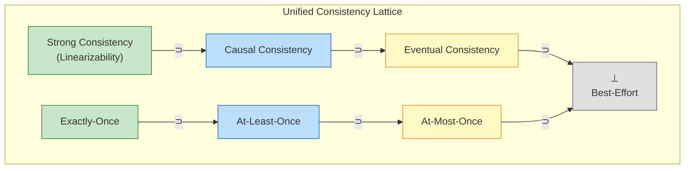
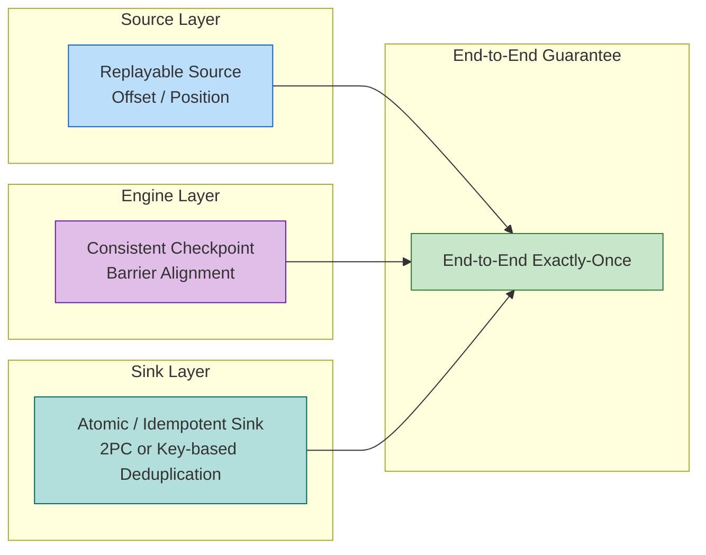

# Consistency Hierarchy in Streaming

> Stage: Struct/02-properties | Prerequisites: [01.04-dataflow-model-formalization.md](../01-foundation/01.04-dataflow-model-formalization.md) | Formalization Level: L5

---

## Table of Contents

- [Consistency Hierarchy in Streaming](#consistency-hierarchy-in-streaming)
  - [Table of Contents](#table-of-contents)
  - [1. Definitions](#1-definitions)
    - [Def-S-08-01 (Dataflow Execution Trace)](#def-s-08-01-dataflow-execution-trace)
    - [Def-S-08-02 (At-Most-Once Semantics)](#def-s-08-02-at-most-once-semantics)
    - [Def-S-08-03 (At-Least-Once Semantics)](#def-s-08-03-at-least-once-semantics)
    - [Def-S-08-04 (Exactly-Once Semantics)](#def-s-08-04-exactly-once-semantics)
    - [Def-S-08-05 (End-to-End Consistency)](#def-s-08-05-end-to-end-consistency)
    - [Def-S-08-06 (Internal Consistency)](#def-s-08-06-internal-consistency)
    - [Def-S-08-07 (Strong Consistency)](#def-s-08-07-strong-consistency)
    - [Def-S-08-08 (Causal Consistency)](#def-s-08-08-causal-consistency)
    - [Def-S-08-09 (Eventual Consistency)](#def-s-08-09-eventual-consistency)
  - [2. Properties](#2-properties)
    - [Lemma-S-08-01 (Exactly-Once Implies At-Least-Once)](#lemma-s-08-01-exactly-once-implies-at-least-once)
    - [Lemma-S-08-02 (Exactly-Once Implies At-Most-Once)](#lemma-s-08-02-exactly-once-implies-at-most-once)
    - [Lemma-S-08-03 (Complementary Error Bounds of At-Least-Once and At-Most-Once)](#lemma-s-08-03-complementary-error-bounds-of-at-least-once-and-at-most-once)
    - [Lemma-S-08-04 (Strong Consistency Implies Causal Consistency)](#lemma-s-08-04-strong-consistency-implies-causal-consistency)
    - [Lemma-S-08-05 (Causal Consistency Implies Eventual Consistency)](#lemma-s-08-05-causal-consistency-implies-eventual-consistency)
    - [Prop-S-08-01 (Decomposition of End-to-End Consistency)](#prop-s-08-01-decomposition-of-end-to-end-consistency)
  - [3. Relations](#3-relations)
    - [Relation 1: Connection Between Dataflow Determinism Theorem and Consistency Hierarchy](#relation-1-connection-between-dataflow-determinism-theorem-and-consistency-hierarchy)
    - [Relation 2: Internal Consistency `≈` Chandy-Lamport Distributed Snapshots](#relation-2-internal-consistency--chandy-lamport-distributed-snapshots)
    - [Relation 3: Relationship Between Exactly-Once Semantics and Linearizability](#relation-3-relationship-between-exactly-once-semantics-and-linearizability)
  - [4. Argumentation](#4-argumentation)
    - [Lemma 4.1 (Source Replayability Guarantees No Loss)](#lemma-41-source-replayability-guarantees-no-loss)
    - [Lemma 4.2 (Barrier Alignment Guarantees Snapshot Consistency)](#lemma-42-barrier-alignment-guarantees-snapshot-consistency)
    - [Counterexample 4.1 (Internal Consistent ≠ End-to-End Consistent)](#counterexample-41-internal-consistent--end-to-end-consistent)
    - [Boundary Discussion 4.2 (Compensating Capability of Idempotent Sinks)](#boundary-discussion-42-compensating-capability-of-idempotent-sinks)
  - [5. Proofs](#5-proofs)
    - [Thm-S-08-01 (Necessary Conditions for Exactly-Once Under Network Partition)](#thm-s-08-01-necessary-conditions-for-exactly-once-under-network-partition)
    - [Thm-S-08-02 (End-to-End Exactly-Once Correctness Theorem)](#thm-s-08-02-end-to-end-exactly-once-correctness-theorem)
    - [Thm-S-08-03 (Unified Consistency Hierarchy Implication Chain)](#thm-s-08-03-unified-consistency-hierarchy-implication-chain)
  - [6. Examples](#6-examples)
    - [Example 6.1: Flink Kafka End-to-End Exactly-Once](#example-61-flink-kafka-end-to-end-exactly-once)
    - [Example 6.2: Idempotent HBase Sink for Exactly-Once](#example-62-idempotent-hbase-sink-for-exactly-once)
    - [Counterexample 6.3: Non-Idempotent HTTP Sink Breaks At-Most-Once](#counterexample-63-non-idempotent-http-sink-breaks-at-most-once)
    - [Counterexample 6.4: Source Offset Early Commit Breaks At-Least-Once](#counterexample-64-source-offset-early-commit-breaks-at-least-once)
  - [7. Visualizations](#7-visualizations)
    - [Unified Consistency Lattice](#unified-consistency-lattice)
    - [End-to-End Consistency Composition](#end-to-end-consistency-composition)
  - [8. References](#8-references)

## 1. Definitions

This section establishes strict mathematical definitions for the consistency hierarchy of stream computing systems on top of the Dataflow model's formal foundation. All definitions depend on the characterization of Dataflow graphs, operator semantics, partially-ordered multisets, and event time from prerequisite document [01.04-dataflow-model-formalization.md](../01-foundation/01.04-dataflow-model-formalization.md) [^4][^6].

---

### Def-S-08-01 (Dataflow Execution Trace)

Let $\mathcal{G} = (V, E, P, \Sigma, \mathbb{T})$ be a Dataflow graph (see Def-S-04-01). Its **global execution trace** $\mathcal{T}$ is defined as an alternating sequence of global states and system events:

$$
\mathcal{T} = \langle s_0, e_1, s_1, e_2, s_2, \dots, e_n, s_n \rangle
$$

Where global state $s_i$ contains three parts:

- **Operator States**: $\{ \sigma_v^{(i)} \}_{v \in V_{op}}$, recording each operator's local state at time $i$;
- **Channel States**: $\{ Q_c^{(i)} \}_{c \in E}$, recording in-flight message sequences on each data channel $c$;
- **Source Offsets**: $\{ o_{src}^{(i)} \}_{src \in V_{src}}$, recording external system positions (e.g., Kafka offset) already acknowledged as consumed by each Source operator.

System events $e_i$ belong to the following set:

$$
e_i \in \{ \text{Process}(v, r), \; \text{BarrierArrive}(v, c, k), \; \text{CheckpointTrigger}(k), \; \text{SinkCommit}(T_k) \}
$$

Corresponding respectively to: operator $v$ processing record $r$, Barrier $k$ arriving at channel $c$, triggering the $k$-th Checkpoint, and Sink committing transaction $T_k$.

**Intuitive Explanation**: The execution trace is a "film strip" of all dynamic behavior of a Dataflow graph at runtime. By tracing the trace, we can precisely know when each record is processed by which operator, how each operator's state evolves, and when each Sink exposes results to the external world [^1][^2].

**Definition Motivation**: Without painting runtime as a trace, we cannot formalize "exactly once" — because "once" must be countable in the time dimension. This definition unifies discrete Checkpoint events with continuous data processing in the same temporal framework, providing a common metric for subsequent consistency hierarchy comparisons.

---

### Def-S-08-02 (At-Most-Once Semantics)

Given an input record set $I$ and an execution trace $\mathcal{T}$, let observation function $\mathcal{O}(\mathcal{T})$ extract the multiset of all output records that have been **committed to and visible in external systems** by Sink in $\mathcal{T}$. For any input record $r \in I$, define its **causal influence count** as:

$$
c(r, \mathcal{T}) = |\{ o \in \mathcal{O}(\mathcal{T}) \mid \text{caused\_by}(o, r) \}|
$$

Where $\text{caused\_by}(o, r)$ indicates output record $o$'s generation causally depends on input record $r$'s processing (i.e., $r$ contributed to $o$'s generation via some Dataflow path).

A stream computing system satisfies **At-Most-Once** semantics if and only if:

$$
\forall r \in I. \; c(r, \mathcal{T}) \leq 1
$$

**Intuitive Explanation**: Each input data's impact on the final external world occurs **at most once**. The system allows data to be lost during transmission or processing (i.e., $c(r, \mathcal{T}) = 0$), but absolutely prohibits the same record from producing two or more visible side effects. At-Most-Once is the loosest level of consistency guarantee, commonly used for monitoring metrics, log sampling, and other scenarios tolerant of small losses [^3][^5].

**Definition Motivation**: At-Most-Once eliminates all deduplication, retry, and transaction overhead in exchange for lowest latency and highest throughput. Formalizing this semantics as an upper bound on causal influence count allows the engineering goal of "no duplicates" to directly interface with correctness proofs of fault tolerance mechanisms.

---

### Def-S-08-03 (At-Least-Once Semantics)

A stream computing system satisfies **At-Least-Once** semantics if and only if:

$$
\forall r \in I. \; c(r, \mathcal{T}) \geq 1
$$

**Intuitive Explanation**: Each input data's impact on the final external world occurs **at least once**. The system does not allow permanent data loss (i.e., $c(r, \mathcal{T}) \geq 1$), but may cause the same record to be processed multiple times in fault recovery or retry scenarios, resulting in duplicate side effects. At-Least-Once is the basic guarantee provided by most stream processing engines (e.g., Flink in default configuration), applicable to log aggregation, event-driven microservices, and other scenarios [^1][^5].

**Definition Motivation**: In distributed environments, network partitions, node failures, or timeout retries are the norm. At-Least-Once simplifies fault tolerance protocol design by allowing duplicates — the system only needs to ensure "each message is eventually processed" without handling complex deduplication logic. This definition strictly mathematizes the engineering trade-off between "no loss" and "possible duplicates".

---

### Def-S-08-04 (Exactly-Once Semantics)

A stream computing system satisfies **Exactly-Once** semantics if and only if:

$$
\forall r \in I. \; c(r, \mathcal{T}) = 1
$$

**Intuitive Explanation**: Each input data's impact on the final external world occurs **exactly once**. The system neither loses data (excluding $c(r) = 0$) nor produces duplicate side effects (excluding $c(r) \geq 2$). Exactly-Once is the core requirement for business scenarios with extremely high correctness demands such as financial transactions, billing systems, and inventory deductions [^3][^5].

**Definition Motivation**: Exactly-Once does not mean "each record is physically processed by the machine only once" — this is impossible in distributed fault recovery. It emphasizes **observational equivalence**: regardless of how many faults, replays, or reschedules the system experiences, the state changes finally observed by external systems are completely consistent with the state changes obtained when each record is processed exactly once in an ideal fault-free environment. This definition elevates semantic guarantee from "message delivery count" to "observable uniqueness of side effect".

---

### Def-S-08-05 (End-to-End Consistency)

For a complete stream processing job $J = (Src, Ops, Snk)$, **End-to-End Consistency** refers to the consistency guarantee of the entire pipeline from external data source to external data sink. Specifically, end-to-end Exactly-Once consists of the conjunction of three sub-properties:

$$
\text{End-to-End-EO}(J) \iff \text{Replayable}(Src) \land \text{ConsistentCheckpoint}(Ops) \land \text{AtomicOutput}(Snk)
$$

Where:

- **$\text{Replayable}(Src)$**: Source supports re-reading data from persistent position markers (offset / position). After failure, Source can replay from the offset recorded by the most recent successful Checkpoint.
- **$\text{ConsistentCheckpoint}(Ops)$**: The engine internally captures consistent global states of all operators through distributed snapshots (e.g., Chandy-Lamport algorithm), so that after recovery, internal states are consistent with fault-free execution to the same moment [^2].
- **$\text{AtomicOutput}(Snk)$**: Sink writes to external systems satisfy atomicity (transactional commit) or idempotency, ensuring that duplicate processing does not result in duplicate visible output.

**Intuitive Explanation**: End-to-End Consistency is not an isolated mechanism within the stream processing engine, but the result of **collaboration among Source, engine, and Sink**. If only engine-internal Exactly-Once is guaranteed, while Source offsets are committed early or Sink is non-idempotent, then data may be lost before entering the engine or duplicated after leaving the engine [^1][^5].

**Definition Motivation**: A common misconception in engineering practice is equating Flink's Checkpoint mechanism with end-to-end Exactly-Once. This definition explicitly extends consistency boundaries to external systems, forcing architecture designers to implement corresponding fault tolerance protocols on both Source and Sink sides.

---

### Def-S-08-06 (Internal Consistency)

**Internal Consistency** refers to the consistency of a stream processing engine's internal operator states with global snapshots after fault recovery. Formally, let $\mathcal{G}_k$ be the global snapshot captured by the $k$-th Checkpoint, then:

$$
\text{Internal-Consistency}(Ops) \iff \forall k. \; \text{Consistent}(\mathcal{G}_k) \land \text{NoOrphans}(\mathcal{G}_k) \land \text{Reachable}(\mathcal{G}_k)
$$

Where $\text{Consistent}(\mathcal{G}_k)$, $\text{NoOrphans}(\mathcal{G}_k)$, and $\text{Reachable}(\mathcal{G}_k)$ correspond to the three core properties of the Chandy-Lamport distributed snapshot algorithm: consistent cut, no orphan messages, and state reachability [^2].

**Intuitive Explanation**: Internal Consistency answers the question "After recovery, are the engine's internal states valid?" It doesn't care whether Sink has already committed duplicate data to external systems, or whether Source has irrevocably discarded offsets.

**Definition Motivation**: Distinguishing internal consistency from end-to-end consistency is key to understanding stream computing fault tolerance mechanisms. Internal consistency is a **necessary but not sufficient condition** for end-to-end consistency. It provides an independent verification target for Checkpoint algorithm correctness, while also revealing why certain systems (e.g., jobs with Checkpoint enabled but using non-transactional Sinks) still experience data duplication or loss.

---

### Def-S-08-07 (Strong Consistency)

In the context of distributed state sharing, **Strong Consistency** (also called Linearizability) requires all operations to have a unique linearization point in global history, such that any external observer sees execution order completely consistent with real-time order [^8]. Formally, for any operation sequence $\langle op_1, op_2, \dots \rangle$ acting on shared state $S$ in a stream processing system:

$$
\forall op_i, op_j.\; \text{if } t_{\text{real}}(op_i) \prec t_{\text{real}}(op_j) \text{ then } op_i \prec_S op_j
$$

Where $\prec_S$ is the serial order consistently recognized by all processes. Strong consistency is the strongest element in the distributed consistency lattice.

**Intuitive Explanation**: Strong consistency means the system behaves like a single-threaded replica, all read/write operations take effect atomically, with no concurrent conflicts or visibility delays. For stream computing, when Sink writes results to external shared storage, strong consistency ensures all subsequent readers immediately see the latest results.

**Definition Motivation**: Incorporating strong consistency into the unified framework can clarify the upper bound of stream computing's Exactly-Once semantics when outputting externally — only when external systems themselves provide linearizability can end-to-end Exactly-Once be equivalent to strong consistency.

---

### Def-S-08-08 (Causal Consistency)

**Causal Consistency** requires systems to at least preserve the order of operations with causal dependency relationships. If operation $op_i$ precedes $op_j$ in the happens-before relation (denoted $op_i \prec_{hb} op_j$), then the order observed by any process must satisfy $op_i \prec_{obs} op_j$; for concurrent, causally unrelated operations, different processes may observe different orders. Formally:

$$
\forall op_i, op_j.\; op_i \prec_{hb} op_j \implies op_i \prec_{obs} op_j
$$

**Intuitive Explanation**: Causal consistency relaxes the requirement for global real-time order, only requiring causally related events to be seen in causal order. In stream computing, if two records pass through the same operator or have data dependencies, their output order must be preserved downstream; records from different sources with no connection can be processed in any order.

**Definition Motivation**: Many distributed stream processing systems (e.g., Flink's parallel operators) naturally satisfy causal consistency but not necessarily strong consistency. Explicitly defining causal consistency can explain why systems can still produce deterministic results without global locks.

---

### Def-S-08-09 (Eventual Consistency)

**Eventual Consistency** guarantees that if no new update operations occur for a period of time, all replicas will eventually converge to the same state [^7]. Formally, let $S_p(t)$ be the state replica observed by process $p$ at time $t$, then:

$$
\forall p, q.\; \left( \lim_{t \to \infty} \text{Updates}(t) = \emptyset \right) \implies \left( \lim_{t \to \infty} S_p(t) = \lim_{t \to \infty} S_q(t) \right)
$$

**Intuitive Explanation**: Eventual consistency only promises that all replicas will be consistent in the long run, making no guarantees about real-time, causal order, or correctness of values read during convergence. It is the weakest element in the distributed consistency lattice, commonly found in cross-region replication, cache systems, and certain Sinks without transaction guarantees.

**Definition Motivation**: At the very end of stream computing pipelines, if external systems can only provide eventual consistency (e.g., Elasticsearch, certain Cassandra configurations), then even if Flink implements Exactly-Once internally, end-to-end semantics can only degrade to eventual consistency. This definition clarifies the lower bound of system capabilities.

---

## 2. Properties

This section derives basic logical relationships and error bounds among consistency hierarchy levels from Section 1 definitions.

---

### Lemma-S-08-01 (Exactly-Once Implies At-Least-Once)

**Statement**: If a stream computing system satisfies Exactly-Once semantics for input set $I$, then the system necessarily satisfies At-Least-Once semantics.

**Proof**:

By Def-S-08-04, Exactly-Once requires:

$$
\forall r \in I. \; c(r, \mathcal{T}) = 1
$$

Since $1 \geq 1$, the above directly implies:

$$
\forall r \in I. \; c(r, \mathcal{T}) \geq 1
$$

Which is exactly the At-Least-Once semantics defined by Def-S-08-03. ∎

> **Inference [Theory→Model]**: Exactly-Once adds the constraint of "no duplicates" on top of At-Least-Once. Therefore, any system implementing Exactly-Once must first solve the data loss problem (through replayable Source and consistent Checkpoint), then introduce deduplication or transaction mechanisms [^1][^5].

---

### Lemma-S-08-02 (Exactly-Once Implies At-Most-Once)

**Statement**: If a stream computing system satisfies Exactly-Once semantics for input set $I$, then the system necessarily satisfies At-Most-Once semantics.

**Proof**:

By Def-S-08-04, Exactly-Once requires:

$$
\forall r \in I. \; c(r, \mathcal{T}) = 1
$$

Since $1 \leq 1$, the above directly implies:

$$
\forall r \in I. \; c(r, \mathcal{T}) \leq 1
$$

Which is exactly the At-Most-Once semantics defined by Def-S-08-02. ∎

> **Inference [Theory→Model]**: Exactly-Once similarly adds the constraint of "no loss" on top of At-Most-Once. Therefore, any system implementing Exactly-Once must ensure data can be replayed during fault recovery, rather than simply skipping [^3][^5].

---

### Lemma-S-08-03 (Complementary Error Bounds of At-Least-Once and At-Most-Once)

To uniformly analyze the three semantics, define two error metrics for single record $r$:

- **Loss Error**: $\varepsilon_{\text{loss}}(r) = \max(0, 1 - c(r, \mathcal{T}))$
- **Duplicate Error**: $\varepsilon_{\text{dup}}(r) = \max(0, c(r, \mathcal{T}) - 1)$

Then the three semantics can be equivalently characterized as:

| Semantics Level | Error Constraints |
|-----------------|-------------------|
| At-Most-Once | $\forall r. \; \varepsilon_{\text{dup}}(r) = 0$ |
| At-Least-Once | $\forall r. \; \varepsilon_{\text{loss}}(r) = 0$ |
| Exactly-Once | $\forall r. \; \varepsilon_{\text{loss}}(r) = 0 \land \varepsilon_{\text{dup}}(r) = 0$ |

**Statement**: Exactly-Once's error constraint set equals the intersection of At-Least-Once and At-Most-Once error constraint sets.

**Proof**:

Let $C_{\text{EO}}$, $C_{\text{AL}}$, $C_{\text{AM}}$ be the error constraint sets corresponding to the three semantics respectively.

- $C_{\text{AM}} = \{ (\varepsilon_{\text{loss}}, \varepsilon_{\text{dup}}) \mid \forall r, \varepsilon_{\text{dup}}(r) = 0 \}$
- $C_{\text{AL}} = \{ (\varepsilon_{\text{loss}}, \varepsilon_{\text{dup}}) \mid \forall r, \varepsilon_{\text{loss}}(r) = 0 \}$
- $C_{\text{EO}} = \{ (\varepsilon_{\text{loss}}, \varepsilon_{\text{dup}}) \mid \forall r, \varepsilon_{\text{loss}}(r) = 0 \land \varepsilon_{\text{dup}}(r) = 0 \}$

Clearly:

$$
C_{\text{EO}} = C_{\text{AL}} \cap C_{\text{AM}}
$$

That is, Exactly-Once is equivalent to simultaneously satisfying "no loss" and "no duplicates". ∎

> **Inference [Model→Implementation]**: From an engineering implementation perspective, At-Least-Once and At-Most-Once correspond to two independent fault tolerance axes — **replay axis** (solving loss) and **deduplication axis** (solving duplicates). Exactly-Once implementation must simultaneously invest mechanisms on both axes (Checkpoint + transaction/idempotency) [^1][^3][^5].

---

### Lemma-S-08-04 (Strong Consistency Implies Causal Consistency)

**Statement**: If a distributed system satisfies Strong Consistency (Def-S-08-07), then the system necessarily satisfies Causal Consistency (Def-S-08-08).

**Proof**:

By strong consistency definition, all operations have a unique serial order $\prec_S$ in global history consistent with real time. The happens-before relation $\prec_{hb}$ is a subset of real-time partial order (i.e., $op_i \prec_{hb} op_j$ means $op_i$ physically or logically precedes $op_j$). Therefore:

$$
op_i \prec_{hb} op_j \implies op_i \prec_S op_j
$$

And strong consistency requires the order $\prec_{obs}$ observed by all processes to be exactly $\prec_S$. Thus:

$$
op_i \prec_{hb} op_j \implies op_i \prec_{obs} op_j
$$

This is exactly the definition of causal consistency. ∎

> **Inference [Theory→Model]**: Strong consistency is a sufficient condition for causal consistency. Any stream processing output (e.g., writing to strongly consistent databases) implemented through global locks or single-primary replication naturally inherits causal consistency.

---

### Lemma-S-08-05 (Causal Consistency Implies Eventual Consistency)

**Statement**: If a distributed system satisfies Causal Consistency (Def-S-08-08), then the system necessarily satisfies Eventual Consistency (Def-S-08-09).

**Proof**:

Causal consistency requires all causally dependent operations to be observed in the same order by all processes. Consider a finite operation sequence; after stopping new updates, each process applies all operations in the same causal order, and their final states depend only on the operation sequence content rather than the observing process. Therefore:

$$
\lim_{t \to \infty} S_p(t) = \text{Apply}(\text{AllOps}, \prec_{hb})
$$

This limit is independent of process $p$, so for all processes $p, q$, $\lim_{t \to \infty} S_p(t) = \lim_{t \to \infty} S_q(t)$. This is exactly the definition of eventual consistency. ∎

> **Inference [Model→Implementation]**: In engineering implementation, causal consistency usually depends on vector clocks or logical timestamps. As long as systems continuously propagate and merge these timestamps, eventual consistency is automatically satisfied as a byproduct.

---

### Prop-S-08-01 (Decomposition of End-to-End Consistency)

**Statement**: For stream processing job $J = (Src, Ops, Snk)$, end-to-end Exactly-Once holds if and only if internal consistency, Source replayability, and Sink atomicity simultaneously hold.

**Proof**:

**$(\Rightarrow)$ Direction**:

Assume $\text{End-to-End-EO}(J)$ holds. By Def-S-08-05:

1. $\text{Replayable}(Src)$ holds directly;
2. $\text{AtomicOutput}(Snk)$ holds directly;
3. If internal consistency does not hold, then recovered operator states may be in inconsistent cuts with orphan messages or unreachable states. At this point, even if Source replay is correct, operators may produce different outputs than ideal execution, causing $c(r, \mathcal{T}) \neq 1$, contradicting end-to-end Exactly-Once. Therefore $\text{ConsistentCheckpoint}(Ops)$ must hold.

**$(\Leftarrow)$ Direction**:

Assume three sub-properties hold simultaneously. By internal consistency, recovered operator states are equivalent to fault-free execution to some consistent cut (see Def-S-08-06 and Chandy-Lamport theorem [^2]). By Source replayability, all data arriving after Checkpoint can be completely replayed, guaranteeing $c(r) \geq 1$. By Sink atomicity (transaction or idempotency), duplicate processing does not produce duplicate external visible output, guaranteeing $c(r) \leq 1$. Combining both, $c(r) = 1$, i.e., end-to-end Exactly-Once holds. ∎

---

## 3. Relations

This section establishes strict mappings between the consistency hierarchy and Dataflow formal models, distributed snapshot theory, and linearizability.

---

### Relation 1: Connection Between Dataflow Determinism Theorem and Consistency Hierarchy

The **Thm-S-04-01 (Dataflow Determinism Theorem)** in prerequisite document [01.04-dataflow-model-formalization.md](../01-foundation/01.04-dataflow-model-formalization.md) states: under the premise of operator pure functions, channel FIFO, and fixed input partially-ordered multisets, Dataflow graph output is uniquely determined, independent of scheduling strategy [^4][^6].

**Argument**:

- This theorem provides a **baseline** for consistency hierarchy comparisons: $\mathcal{T}_{\text{ideal}}$ (ideal fault-free execution trace) output is unique.
- At-Most-Once allows output to be a **sub-multiset** of $\mathcal{O}(\mathcal{T}_{\text{ideal}})$ (possibly missing some records);
- At-Least-Once allows output to be a **super-multiset** of $\mathcal{O}(\mathcal{T}_{\text{ideal}})$ (possibly containing duplicate records);
- Exactly-Once requires output to **equal** $\mathcal{O}(\mathcal{T}_{\text{ideal}})$.

Therefore, the consistency hierarchy can be understood as: upper bound control of **deviation degree** between system output and ideal Dataflow deterministic output.

---

### Relation 2: Internal Consistency `≈` Chandy-Lamport Distributed Snapshots

**Argument**:

Flink's Checkpoint mechanism is semantically equivalent to the Chandy-Lamport distributed snapshot algorithm [^2]. The specific correspondence is as follows:

| Flink Concept | Chandy-Lamport Concept |
|---------------|------------------------|
| Checkpoint Barrier | Marker message |
| Operator state snapshot | Process local state recording |
| Barrier alignment condition | "Record state after receiving markers from all input edges" |
| Global Checkpoint | Global consistent snapshot $\mathcal{G}$ |

By the Chandy-Lamport consistency theorem (see [04.03-chandy-lamport-consistency.md](../04-proofs/04.03-chandy-lamport-consistency.md)), this snapshot satisfies consistent cut, no orphan messages, and state reachability [^2]. Therefore:

$$
\text{Flink-Checkpoint} \approx \text{Chandy-Lamport-Snapshot}
$$

Thus:

$$
\text{Internal-Consistency}(Ops) \iff \text{Consistent}(\mathcal{G}) \land \text{NoOrphans}(\mathcal{G}) \land \text{Reachable}(\mathcal{G})
$$

---

### Relation 3: Relationship Between Exactly-Once Semantics and Linearizability

**Argument**:

Exactly-Once semantics can be viewed as a restricted instance of **Linearizability** in stream processing scenarios:

- Linearizability requires each operation to have a unique **linearization point** in system history, making all operations appear atomically executed;
- For Exactly-Once, each input record $r$'s side effect generation on Sink can also be viewed as an "operation", with its linearization point being the moment of Sink transaction commit or idempotent write taking effect;
- Therefore, Exactly-Once guarantees each $r$'s side effect operation is linearized **exactly once** in global history.

Formally:

$$
\text{Exactly-Once}(J) \implies \text{Linearizable}(\{ \text{SideEffect}(r) \mid r \in I \})
$$

But the converse does not hold: linearizability only guarantees correctness of operation order, not that no operations are omitted (i.e., does not guarantee At-Least-Once) [^3].

---

## 4. Argumentation

This section provides auxiliary lemmas, counterexample analysis, and boundary discussions to prepare for main theorems in Section 5.

---

### Lemma 4.1 (Source Replayability Guarantees No Loss)

**Statement**: If Source supports replay from persisted offset, and Flink persists Source's current offset at each successful Checkpoint, then no data is lost after fault recovery.

**Proof**:

1. **Premise Analysis**: Let the last successfully completed Checkpoint be $C_n$, with Source offset $o_n$ recorded in it.
2. **Construction/Derivation**: After failure occurs, job recovers from $C_n$, Source is reset to offset $o_n$. Since Source is replayable, all records from $o_n$ can be re-read.
3. **Conclusion**: Data arriving after $C_n$ will be reprocessed, therefore no data is permanently lost. ∎

> **Inference [Execution→Data]**: This lemma directly corresponds to the "no loss" axis in At-Least-Once semantics. Regardless of Sink's deduplication capability, as long as Source is replayable and Checkpoint is bound to offset, data will be processed at least once [^1][^5].

---

### Lemma 4.2 (Barrier Alignment Guarantees Snapshot Consistency)

**Statement**: In barrier alignment mode, each operator $v$ performs state snapshot only after receiving Barrier $b_{id}$ from all input channels. This snapshot captures $v$'s state after processing all data belonging to before Checkpoint $id$.

**Proof**:

1. **Premise Analysis**: Let operator $v$ have $k$ input channels $ch_1, \dots, ch_k$.
2. **Construction/Derivation**: Barrier $b_{id}$ divides each channel's data stream into two parts — records before $b_{id}$ and records after $b_{id}$. The alignment condition requires $v$ to trigger snapshot after processing all $b_{id}$-before records from all $k$ channels.
3. **Conclusion**: Therefore snapshot state contains no processing effects of any $b_{id}$-after records, nor omits any processing effects of $b_{id}$-before records. The snapshot corresponds to a consistent cut in logical time, satisfying Chandy-Lamport algorithm consistency requirements [^2]. ∎

> **Inference [Theory→Implementation]**: Barrier alignment is Flink's core mechanism for implementing internal consistency. It ensures recovered operator states are equivalent to fault-free execution to the same logical moment, providing the foundation for Dataflow determinism theorem (Thm-S-04-01) to continue in fault scenarios [^4][^6].

---

### Counterexample 4.1 (Internal Consistent ≠ End-to-End Consistent)

**Scenario**: A Flink job uses replayable Kafka Source and has Aligned Checkpoint enabled, but Sink is a simple HTTP POST call (non-transactional, non-idempotent).

**Execution Timeline**:

1. Record $r$ is read by Source, processed by operators, arrives at Sink.
2. Sink executes `httpClient.post(url, result_of_r)`, external system has received and processed this request.
3. At this point Checkpoint $C_n$ has not yet completed (may still be waiting for downstream Barrier alignment).
4. Job suddenly fails, Checkpoint $C_n$ fails.
5. Upon recovery, job rolls back to previous successful Checkpoint $C_{n-1}$ state.
6. Source replays from offset recorded by $C_{n-1}$, record $r$ is processed again.
7. Sink sends the same HTTP POST request again.

**Analysis**:

- **Internal Consistency**: Since Checkpoint mechanism is correct, recovered operator states are consistent.
- **End-to-End Consistency**: External system observes two side effects of $r$, i.e., $c(r, \mathcal{T}) = 2$, violating Exactly-Once and At-Most-Once.

**Conclusion**: Internal consistency alone is insufficient to guarantee end-to-end Exactly-Once. Sink must be transactional or idempotent to transform engine-internal consistency into externally visible consistency [^1][^3][^5].

---

### Boundary Discussion 4.2 (Compensating Capability of Idempotent Sinks)

In some scenarios, Sink does not support 2PC (e.g., HBase, file systems). End-to-end Exactly-Once can then be achieved through **idempotency**.

**Key Observation**: If Sink write operation $f$ satisfies:

$$
\forall r, S. \; f(r, f(r, S)) = f(r, S)
$$

Then after fault recovery, even if record $r$ is processed multiple times and written to Sink multiple times, multiple writes have the same effect as a single write. Combining Lemma 4.1 (no loss) and Lemma 4.2 (internal consistency), the system's final output effect is equivalent to Exactly-Once.

**Boundary Risks**:

1. **Concurrent Modifications**: If external systems process duplicate writes while other concurrent writes modify the same key, read-modify-write based idempotent operations may fail.
2. **State Scope**: Idempotency usually depends on external system primary keys or version numbers. If Sink writes involve cross-key atomic updates (e.g., multi-table transactions), single-key idempotency alone cannot guarantee global consistency.

Therefore, idempotent Sink is a **sufficient but not necessary** alternative path to transactional Sink, applicable to key-value stores or file systems without transaction support [^1][^3][^5].

---

## 5. Proofs

### Thm-S-08-01 (Necessary Conditions for Exactly-Once Under Network Partition)

**Statement**: In a distributed stream processing system with network partitions, if the system wishes to guarantee Exactly-Once state consistency (Def-S-08-04), then at least one of the following three mechanisms must be satisfied [^7][^8]:

1. **Idempotent Sink**: Sink write operations satisfy idempotency, such that duplicate processing of the same record does not produce additional visible side effects;
2. **Transactional 2PC**: Sink and engine atomize output through two-phase commit protocol, making each Checkpoint period's output either all visible or all invisible;
3. **Deterministic Replay**: System can precisely replay input record sequences from consistent global snapshots, and post-replay computation paths are completely consistent with original paths, thereby canceling duplicates through internal state.

**Formal Statement**:

Let $\mathcal{P}$ indicate system has network partition, $\text{EO}(J)$ indicate job $J$ satisfies Exactly-Once semantics, then:

$$
\mathcal{P} \land \text{EO}(J) \implies \text{Idempotent}(Snk) \lor \text{Transactional2PC}(Snk) \lor \text{DeterministicReplay}(J)
$$

**Proof**:

**Step 1: Analyze Failure Modes Caused by Network Partition**

Two types of failures may occur under network partition [^7]:

- **Sink-side Partition**: Communication interruption between Coordinator (e.g., Flink JobManager) and Sink participants, causing Sink to be unable to confirm whether transaction has been committed. If transaction has been partially committed, duplicate commit instructions may be received after recovery.
- **Source/Engine-side Partition**: Offset synchronization failure between Source and engine, or internal Barrier alignment timeout causing Checkpoint failure. After recovery, system must replay data from previous successful Checkpoint.

Regardless of partition type, **duplicate processing** (i.e., some record $r$ being processed multiple times) is unavoidable: because partition may cause confirmation of processed records to be lost, and system must replay to avoid loss.

**Step 2: Exclude Case Where None of Three Mechanisms Are Satisfied**

Assume system uses neither idempotent Sink, nor transactional 2PC, nor deterministic replay. Consider record $r$ processed between Checkpoint $C_{n-1}$ and $C_n$ and arriving at Sink:

- Since no idempotency, each Sink write of $r$ produces new visible side effects;
- Since no transactional 2PC, Sink writes cannot align with Checkpoint boundaries, $r$ may already be externally visible before $C_n$ completes;
- Since no deterministic replay, recovered operator states may be inconsistent with original paths, unable to cancel duplicate effects through state.

Therefore, when network partition causes $r$ to be replayed, $c(r, \mathcal{T}) \geq 2$, i.e., Exactly-Once is broken.

**Step 3: Constructive Proof — Any Single Mechanism Can Restore Exactly-Once**

- **If Sink is Idempotent**: Even if $r$ is processed $k \geq 1$ times, by idempotency $\text{write}(r, \text{write}(r, S)) = \text{write}(r, S)$, final effect is the same as a single write, so $c(r, \mathcal{T}) = 1$.
- **If Sink Uses Transactional 2PC**: Transaction commit aligns with Checkpoint boundaries. Records of committed transactions will not be replayed (Source offset has advanced), records of uncommitted transactions are aborted and reprocessed after recovery, therefore externally visible effect occurs exactly once.
- **If System Supports Deterministic Replay**: Even if records are replayed, since global snapshots are consistent and computation paths are deterministic, post-replay operator states are logically equivalent to original paths. If Sink side effects depend only on final state, duplicate processing does not change final state, thus $c(r, \mathcal{T}) = 1$.

**Step 4: Conclusion**

Under network partition, duplicate processing is unavoidable system behavior. If the system wishes to guarantee Exactly-Once, it must eliminate duplicate processing side effects through at least idempotent Sink, transactional 2PC, or deterministic replay. Therefore:

$$
\mathcal{P} \land \text{EO}(J) \implies \text{Idempotent}(Snk) \lor \text{Transactional2PC}(Snk) \lor \text{DeterministicReplay}(J)
$$

∎

---

### Thm-S-08-02 (End-to-End Exactly-Once Correctness Theorem)

**Statement**: Let stream processing job $J = (Src, Ops, Snk)$ satisfy the following conditions:

1. $Src$ is replayable (Def-S-08-05);
2. $Ops$ uses barrier-aligned Checkpoint mechanism and satisfies internal consistency (Def-S-08-06);
3. $Snk$ satisfies atomic output (transactional 2PC or idempotent write).

Then $J$ guarantees end-to-end Exactly-Once semantics.

**Proof**:

We need to prove: $\forall r \in I. \; c(r, \mathcal{T}) = 1$.

**Step 1: No Loss (At-Least-Once)**

By Lemma 4.1, replayable Source guarantees replay from the offset of the last successful Checkpoint $C_n$ after fault recovery. Therefore all records arriving after $C_n$ will be reprocessed. No record is permanently lost, i.e.:

$$
\forall r \in I. \; c(r, \mathcal{T}) \geq 1
$$

**Step 2: No Duplicates (At-Most-Once)**

Consider any record $r$. Let $r$ be read by Source and flow through operators between Checkpoint $C_{n-1}$ and $C_n$, finally arriving at Sink.

- If Sink adopts transactional protocol:
  - Sink transaction $T_n$ enters pre-committed state (data written but not visible).
  - If $C_n$ completes successfully, JobManager calls $T_n$.commit(). At this point $r$'s effect is externally visible.
  - If job fails after $C_n$ success and recovers:
    - Job state recovers to $C_n$ snapshot.
    - Source starts from offset recorded by $C_n$, will not replay $r$ (since $r$ was acknowledged before $C_n$).
    - Operator will not reprocess $r$.
    - Sink will not resubmit $T_n$ (or even if resubmitted, idempotent commit guarantees no duplicate effect).
  - If job fails before $C_n$ completes:
    - Job recovers to $C_{n-1}$ state.
    - Source replays from $C_{n-1}$ offset, $r$ will be reprocessed.
    - But $T_n$ will be abort(), previous pre-committed $r$ effect is rolled back, not externally visible.
    - Reprocessed $r$ enters new transaction $T_n'$, eventually committed through new Checkpoint.

- If Sink adopts idempotency rather than transaction:
  - By Boundary Discussion 4.2, duplicate writes of the same record have their effects canceled.
  - Therefore regardless of which stage fault occurs, $r$'s visible effect on external system does not exceed once.

In summary, under any fault recovery path, $r$'s visible effect on external system satisfies:

$$
\forall r \in I. \; c(r, \mathcal{T}) \leq 1
$$

**Step 3: Combination**

By Step 1 and Step 2, $\forall r \in I, c(r, \mathcal{T}) \geq 1 \land c(r, \mathcal{T}) \leq 1$, therefore:

$$
\forall r \in I. \; c(r, \mathcal{T}) = 1
$$

This is exactly the definition of Exactly-Once. ∎

---

### Thm-S-08-03 (Unified Consistency Hierarchy Implication Chain)

**Statement**: In distributed stream computing systems, the following two implication chains strictly hold:

1. **Exactly-Once ⊃ At-Least-Once ⊃ At-Most-Once**: By Lemma-S-08-01 and Lemma-S-08-02, Exactly-Once implies At-Least-Once and At-Most-Once respectively, with their conjunction squeezing out Exactly-Once.
2. **Strong Consistency ⊃ Causal Consistency ⊃ Eventual Consistency**: By Lemma-S-08-04 and Lemma-S-08-05, strong consistency implies causal consistency, and causal consistency implies eventual consistency.

**Proof**:

Direct reference to corresponding lemmas completes the proof. ∎

---

## 6. Examples

This section verifies the above theoretical results through Flink engineering examples.

---

### Example 6.1: Flink Kafka End-to-End Exactly-Once

The following code demonstrates standard configuration for end-to-end Exactly-Once in Flink: Kafka Source combined with Checkpoint offset commit, and Kafka Sink's two-phase commit (2PC) [^1][^5].

```java
// 1. Kafka Source: Replayable, offset committed with Checkpoint
FlinkKafkaConsumer<String> source = new FlinkKafkaConsumer<>(
    "input-topic",
    new SimpleStringSchema(),
    properties
);
source.setCommitOffsetsOnCheckpoints(true);

// 2. Flink Processing Logic
DataStream<Result> processed = env
    .addSource(source)
    .map(new ProcessingMap())
    .keyBy(Result::getKey)
    .window(TumblingEventTimeWindows.of(Time.seconds(5)))
    .aggregate(new ResultAggregate());

// 3. Kafka Sink: Enable EXACTLY_ONCE semantics (internally uses 2PC)
FlinkKafkaProducer<Result> sink = new FlinkKafkaProducer<>(
    "output-topic",
    new ResultSerializer(),
    properties,
    FlinkKafkaProducer.Semantic.EXACTLY_ONCE
);

processed.addSink(sink);
```

**Formal Verification**:

1. **Source Replayability**: `setCommitOffsetsOnCheckpoints(true)` ensures Kafka offset is only committed when Checkpoint succeeds. After failure, offset rolls back to the position of the last successful Checkpoint, satisfying Lemma 4.1's no-loss condition.
2. **Internal Consistency**: Flink's Aligned Checkpoint captures consistent global state through Barrier alignment, satisfying Lemma 4.2 and Def-S-08-06.
3. **Sink Atomicity**: `FlinkKafkaProducer.Semantic.EXACTLY_ONCE` internally maps each Checkpoint period to a Kafka transaction (Kafka Transactional IDs). Transaction is committed when Checkpoint succeeds, aborted when failed, satisfying Thm-S-08-02's atomic output condition.

Therefore, this configuration guarantees end-to-end Exactly-Once.

---

### Example 6.2: Idempotent HBase Sink for Exactly-Once

For external systems without distributed transaction support (e.g., HBase), Exactly-Once can be achieved through idempotent writes.

```java
public class IdempotentHBaseSink implements SinkFunction<Event> {
    @Override
    public void invoke(Event value, Context context) {
        // Use event ID as RowKey for uniqueness
        String rowKey = value.getId();
        Put put = new Put(Bytes.toBytes(rowKey));
        put.addColumn(
            Bytes.toBytes("cf"),
            Bytes.toBytes("payload"),
            Bytes.toBytes(value.toString())
        );
        // Duplicate Put of same RowKey overwrites same value, effect unchanged
        hbaseTable.put(put);
    }
}
```

**Formal Verification**:

- HBase's `Put` operation uses RowKey as unique identifier. Duplicate execution of `put(put)` for the same RowKey overwrites the original value (if value is the same, state is unchanged).
- Therefore this Sink satisfies idempotency condition: $\text{write}(r, \text{write}(r, S)) = \text{write}(r, S)$.
- Combining Flink internal Checkpoint (Lemma 4.2) and Kafka Source replayability (Lemma 4.1), according to Thm-S-08-02, this job is equivalent to end-to-end Exactly-Once in effect.

---

### Counterexample 6.3: Non-Idempotent HTTP Sink Breaks At-Most-Once

```java
class HttpSink implements SinkFunction<Record> {
    @Override
    public void invoke(Record value, Context context) {
        // No transaction, no idempotency guarantee
        httpClient.post("https://api.example.com/charge", value);
    }
}
```

**Scenario**: Financial transaction flow processing, each record triggers an account deduction HTTP request.

**Analysis**:

- **Violated Premise**: Sink is non-transactional (HTTP POST cannot be rolled back), non-idempotent (duplicate POST causes multiple deductions).
- **Resulting Anomaly**: Before Checkpoint $C_n$ succeeds, Sink has already sent deduction request. After job failure and recovery to $C_{n-1}$, record is replayed and deduction request is sent again. User is deducted multiple times, i.e., $c(r, \mathcal{T}) \geq 2$.
- **Conclusion**: Non-transactional, non-idempotent Sink cannot guarantee end-to-end Exactly-Once or At-Most-Once.

---

### Counterexample 6.4: Source Offset Early Commit Breaks At-Least-Once

```java
class EagerKafkaSource implements SourceFunction<Record> {
    @Override
    public void run(SourceContext<Record> ctx) {
        while (running) {
            Record r = kafkaConsumer.poll();
            ctx.collect(r);
            // Error: Commit offset before Checkpoint success
            kafkaConsumer.commitSync();
        }
    }
}
```

**Scenario**: Kafka Source commits offset immediately after each record is collected, rather than waiting for Checkpoint success.

**Analysis**:

- **Violated Premise**: Source offset commit is not synchronized with Flink Checkpoint. Def-S-08-05 requires Source to be replayable and offset bound to Checkpoint.
- **Resulting Anomaly**:
  1. Records $r_1, r_2, r_3$ are read and collected.
  2. Source immediately commits offset = 3.
  3. Checkpoint $C_n$ triggers, but not yet complete (operator state snapshot in progress).
  4. Job fails, Checkpoint $C_n$ fails.
  5. Upon recovery, Source reads from Kafka, finds offset is already 3, therefore will not replay $r_1, r_2, r_3$.
  6. But Flink internal state recovers to $C_{n-1}$, processing effects of $r_1, r_2, r_3$ are lost, i.e., $c(r, \mathcal{T}) = 0$.
- **Conclusion**: Source offset early commit breaks the "no loss" guarantee, causing At-Least-Once to fail.

---

## 7. Visualizations

### Unified Consistency Lattice

The following diagram shows the lattice structure of six core consistency guarantees in stream computing systems. The left side is the state consistency dimension (Strong → Causal → Eventual), the right side is the delivery guarantee dimension (Exactly-Once → At-Least-Once → At-Most-Once), converging at the Best-Effort node at the bottom, forming a complete consistency partial order lattice.



**Diagram Explanation**:

- **Green nodes** (Strong Consistency, Exactly-Once) represent strongest guarantees, respectively the peaks of the state consistency and delivery semantics dimensions.
- **Blue nodes** (Causal Consistency, At-Least-Once) are intermediate layer guarantees, satisfying availability and correctness requirements for most engineering scenarios.
- **Yellow nodes** (Eventual Consistency, At-Most-Once) are the weakest acceptable guarantees, commonly used for latency-sensitive scenarios or those tolerant of small inconsistencies.
- **Gray node** (⊥ Best-Effort) is the common lower bound of the lattice structure, representing the baseline state with no consistency promise.

---

### End-to-End Consistency Composition

The following diagram shows the three necessary components of end-to-end Exactly-Once and their collaborative relationships.



**Diagram Explanation**:

- **Blue node** represents Source layer replayability, responsible for eliminating data loss.
- **Purple node** represents engine layer Checkpoint consistency, responsible for reconstructing consistent internal state after fault recovery.
- **Cyan node** represents Sink layer atomicity or idempotency, responsible for eliminating duplicate external visible output.
- All three are indispensable, together constituting end-to-end Exactly-Once (green node).

---

## 8. References

[^1]: Apache Flink Documentation, "Checkpointing" and "Exactly-Once Semantics", 2025. <https://nightlies.apache.org/flink/flink-docs-stable/docs/dev/datastream/fault-tolerance/checkpointing/>

[^2]: K. M. Chandy and L. Lamport, "Distributed Snapshots: Determining Global States of Distributed Systems," *ACM Trans. Comput. Syst.*, 3(1), 1985.

[^3]: M. Kleppmann, *Designing Data-Intensive Applications*, O'Reilly Media, 2017. (Chapter 11: Stream Processing)

[^4]: T. Akidau et al., "The Dataflow Model: A Practical Approach to Balancing Correctness, Latency, and Cost in Massive-Scale, Unbounded, Out-of-Order Data Processing," *PVLDB*, 8(12), 2015.

[^5]: Apache Flink Documentation, "Consistency Guarantees", 2025. <https://nightlies.apache.org/flink/flink-docs-stable/docs/learn-flink/fault_tolerance/>

[^6]: P. Carbone et al., "Apache Flink: Stream and Batch Processing in a Single Engine," *IEEE Data Eng. Bull.*, 38(4), 2015.

[^7]: E. Brewer, "Towards Robust Distributed Systems," *PODC*, 2000. (CAP Theorem)

[^8]: L. Lamport, "The Part-Time Parliament," *ACM Trans. Comput. Syst.*, 16(2), 1998. (Paxos)

---

*Document Version: v1.0 | Last Updated: 2026-04-02 | Status: Complete*
