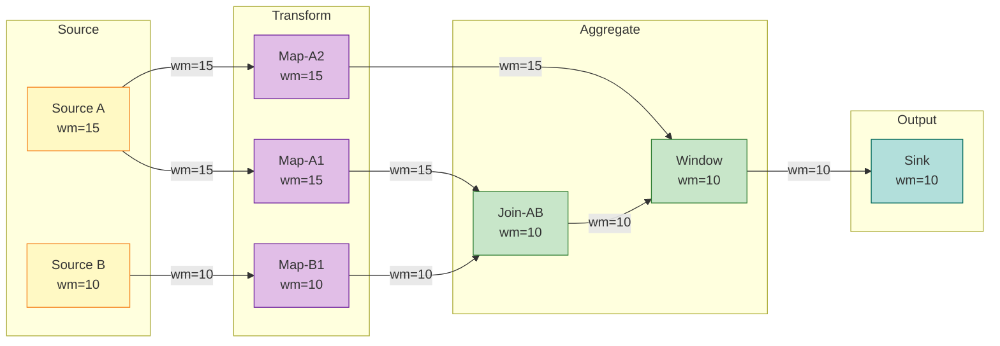

# Watermark Monotonicity Theorem

> Stage: Struct/02-properties | Prerequisites: [01.04-dataflow-model-formalization.md](../01-foundation/01.04-dataflow-model-formalization.md) | Formalization Level: L5

---

## Table of Contents

- [Watermark Monotonicity Theorem](#watermark-monotonicity-theorem)
  - [Table of Contents](#table-of-contents)
  - [1. Definitions](#1-definitions)
    - [Def-S-09-01 (Event Time)](#def-s-09-01-event-time)
    - [Def-S-09-02 (Watermark)](#def-s-09-02-watermark)
    - [Late Data](#late-data)
    - [Window Trigger](#window-trigger)
  - [2. Properties](#2-properties)
    - [Lemma-S-09-01 (Minimum Preserves Monotonicity)](#lemma-s-09-01-minimum-preserves-monotonicity)
  - [3. Relations](#3-relations)
    - [Relation 1: Connection Between Watermark Monotonicity and Dataflow Model Formalization](#relation-1-connection-between-watermark-monotonicity-and-dataflow-model-formalization)
    - [Relation 2: Watermark Monotonicity and Kahn Process Network Partial Order](#relation-2-watermark-monotonicity-and-kahn-process-network-partial-order)
    - [Relation 3: Watermark Monotonicity and Checkpoint Consistency](#relation-3-watermark-monotonicity-and-checkpoint-consistency)
  - [4. Argumentation](#4-argumentation)
    - [4.1 Stream Prefix-Based Partial Order Induction Framework](#41-stream-prefix-based-partial-order-induction-framework)
    - [4.2 Boundary Discussion on Idle Sources and Watermark Progress](#42-boundary-discussion-on-idle-sources-and-watermark-progress)
    - [4.3 Counterexample Construction for Breaking Monotonicity](#43-counterexample-construction-for-breaking-monotonicity)
  - [5. Proof / Engineering Argument](#5-proof--engineering-argument)
    - [Thm-S-09-01 (Watermark Monotonicity Theorem)](#thm-s-09-01-watermark-monotonicity-theorem)
      - [Step 1: Base Case — Source Operator Watermark Monotonicity](#step-1-base-case--source-operator-watermark-monotonicity)
      - [Step 2: Inductive Hypothesis](#step-2-inductive-hypothesis)
      - [Step 3: Induction Step — Monotonicity Preservation of $k$-th Operator](#step-3-induction-step--monotonicity-preservation-of-k-th-operator)
        - [Case A: Single-Input Single-Output Operators (Map, Filter, FlatMap, etc.)](#case-a-single-input-single-output-operators-map-filter-flatmap-etc)
        - [Case B: Multi-Input Single-Output Operators (Join, Union, CoGroup, etc.)](#case-b-multi-input-single-output-operators-join-union-cogroup-etc)
      - [Step 4: Conclusion](#step-4-conclusion)
    - [Corollaries](#corollaries)
  - [6. Examples](#6-examples)
    - [Example 6.1: Watermark Monotonic Progression in Three-Operator DAG](#example-61-watermark-monotonic-progression-in-three-operator-dag)
    - [Counterexample 6.2: Non-Monotonic Watermark Causes Duplicate Window Triggers](#counterexample-62-non-monotonic-watermark-causes-duplicate-window-triggers)
  - [7. Visualizations](#7-visualizations)
  - [8. References](#8-references)

## 1. Definitions

This section establishes strict formal foundations for the Watermark Monotonicity Theorem. All definitions are based on event time semantics and directly serve subsequent lemma derivation and theorem proofs.

### Def-S-09-01 (Event Time)

Let $\text{Record}$ be the set of all possible records in a stream, $\mathbb{T} = \mathbb{R}_{\geq 0}$ be the time domain. Event time is a mapping from records to the time domain:

$$
t_e: \text{Record} \to \mathbb{T}
$$

For any record $r \in \text{Record}$, $t_e(r)$ represents the timestamp when the record occurred in business logic, attached by the data source when generating the record, and cannot be modified by the stream processing system during subsequent processing.

**Intuitive Explanation**: Event time is the "business occurrence time" carried by the data itself, completely decoupled from when data arrives at the system or when it is processed. It is the only reliable time baseline for guaranteeing result determinism on out-of-order streams [^1][^3].

**Definition Motivation**: In distributed environments, network delays, backpressure, and retransmissions cause records' physical arrival order to be inconsistent with their event time order. Event time decouples computation semantics from physical transmission, a necessary prerequisite for stream processing correctness.

---

### Def-S-09-02 (Watermark)

Watermark is a special progress indicator injected by stream processing systems into data streams, formalized as a monotonic function from data streams to the time domain:

$$
wm: \text{Stream} \to \mathbb{T} \cup \{+\infty\}
$$

Let the currently observed watermark value be $w$, its semantic assertion is:

$$
\forall r \in \text{Stream}_{\text{future}}. \; t_e(r) \geq w \lor \text{Late}(r, w)
$$

That is: all records with event time strictly less than $w$ have either arrived and been processed, or have been judged as "late" by the system and will no longer be accepted by the target window.

**Watermark Generation Strategy**: At the Source side, the most common periodic generation strategy is

$$
wm(t) = \max_{r \in \text{Observed}(t)} t_e(r) - \delta
$$

Where $\delta \geq 0$ is the system's tolerated maximum out-of-orderness boundary, $\text{Observed}(t)$ represents the set of all records received by Source up to processing time $t$.

**Intuitive Explanation**: Watermark is a "progress signal" issued by the system, telling downstream operators "data with event time less than or equal to the current Watermark will not arrive normally anymore" [^1][^2].

**Definition Motivation**: On infinite streams, systems can never determine "whether there is still older data that hasn't arrived." Watermark transforms infinite waiting into a decidable progress advancement mechanism through the introduction of bounded uncertainty assumptions, enabling windows to trigger and output results within finite delay.

---

### Late Data

Given a configured allowed lateness parameter $L \geq 0$, the "late" judgment predicate for record $r$ relative to current watermark $w$ is defined as:

$$
\text{Late}(r, w) \iff t_e(r) \leq w - L
$$

When $L = 0$, the judgment condition simplifies to $t_e(r) \leq w$. When $L > 0$, the system retains a grace period after watermark passes window end time, allowing records with event time falling in $[w-L, w]$ range to be re-included in window computation [^2][^3].

---

### Window Trigger

Let window $W$ be a left-closed, right-open interval $W = [t_{\text{start}}, t_{\text{end}}) \subseteq \mathbb{T}$ on the event time axis. Watermark-based window trigger $Tr$ is the predicate determining when a window transitions from "active" to "outputtable" state:

$$
Tr(W, w) \in \{\text{FIRE}, \text{CONTINUE}\}
$$

Its formal definition is:

$$
Tr(W, w) = \text{FIRE} \iff w \geq t_{\text{end}}(W) + L
$$

Where $L$ is the allowed lateness parameter. The trigger depends only on current watermark value $w$ and the window's own end time $t_{\text{end}}(W)$, independent of processing time or arrival order.

**Intuitive Explanation**: The trigger is the window's "alarm clock", determining when the system sends window-aggregated results downstream. Watermark monotonicity guarantees this "alarm clock" only rings once, thereby guaranteeing result uniqueness [^1][^3].

---

## 2. Properties

### Lemma-S-09-01 (Minimum Preserves Monotonicity)

Let $A^{(1)}, A^{(2)}, \ldots, A^{(n)}$ be $n$ monotonically non-decreasing sequences, where $A^{(i)} = \langle a^{(i)}_1, a^{(i)}_2, \ldots \rangle$ satisfies $\forall k: a^{(i)}_k \leq a^{(i)}_{k+1}$. Define sequence $C = \langle c_1, c_2, \ldots \rangle$ as:

$$
c_k = \min_{1 \leq i \leq n} a^{(i)}_k
$$

Then $C$ is also a monotonically non-decreasing sequence, i.e., $\forall k: c_k \leq c_{k+1}$.

**Proof**:

For any moments $k$ and $k+1$:

1. By assumption, each input sequence is monotonically non-decreasing, therefore $\forall i: a^{(i)}_k \leq a^{(i)}_{k+1}$.
2. Consider $c_k = \min_i a^{(i)}_k$. Assume without loss of generality that this minimum is achieved by some index $j$, i.e., $c_k = a^{(j)}_k$.
3. Then $c_k = a^{(j)}_k \leq a^{(j)}_{k+1}$.
4. And $c_{k+1} = \min_i a^{(i)}_{k+1} \leq a^{(j)}_{k+1}$.
5. Combining steps 3 and 4, we get $c_k \leq c_{k+1}$.

By arbitrariness of $k$, $C$ is monotonically non-decreasing. ∎

**Semantic Explanation**: In Flink and other multi-input operators, output Watermark is usually the minimum of all input Watermarks. This lemma guarantees: even if multiple upstream streams have unsynchronized progress, the minimum operation itself does not break Watermark monotonicity.

---

## 3. Relations

### Relation 1: Connection Between Watermark Monotonicity and Dataflow Model Formalization

This document's Watermark Monotonicity Theorem is a strict deepening and independent proof of **Def-S-04-04** and **Lemma-S-04-02** in [01.04-dataflow-model-formalization.md](../01-foundation/01.04-dataflow-model-formalization.md).

- **Encoding Existence**: Def-S-04-04 defines Watermark as progress indicator $w: \text{Stream} \to \mathbb{T} \cup \{+\infty\}$. Def-S-09-02 in this document explicitly introduces late data predicate and allowed lateness parameter on this basis, making semantic assertions more complete.
- **Separation Result**: Lemma-S-04-02 gives derivation of Watermark monotonic non-decrease in Dataflow graphs through topological sort induction. Thm-S-09-01 in this document further provides **stream prefix-based inductive proof** for Source operators, elevating monotonicity guarantee to L5 formalization level.

> **Inference [Model→Property]**: Watermark semantic constraints in Dataflow model (Def-S-04-04) combined with operator local determinism (Lemma-S-04-01) jointly imply global Watermark monotonicity (Thm-S-09-01), and global monotonicity is in turn a key premise of **Thm-S-04-01** (Dataflow Determinism Theorem).

### Relation 2: Watermark Monotonicity and Kahn Process Network Partial Order

**Argument**:

Kahn Process Network (KPN) determinism is built on FIFO channels and process continuous functions. After Dataflow model introduces event time partial order, physical arrival order may be inconsistent with event time partial order. Watermark monotonicity can be viewed as a **scalar lower-bound synchronization mechanism** on event time partial order, explicitly transforming infinite stream partial order advancement into monotonically non-decreasing scalar sequences.

Therefore, Watermark monotonicity is a necessary extension of KPN deterministic semantics in stream processing scenarios **allowing finite disorder**. Without monotonicity guarantee, window trigger timing would depend on the specific timing of out-of-order arrival, thereby breaking result determinism.

### Relation 3: Watermark Monotonicity and Checkpoint Consistency

**Argument**:

Flink's Checkpoint mechanism is based on the Chandy-Lamport distributed snapshot algorithm. Each operator in the snapshot must persist its current Watermark $w_{\text{checkpointed}}$, with $w_{\text{recovered}} = w_{\text{checkpointed}}$ upon recovery.

If recovered Watermark could restart from a value smaller than $w_{\text{checkpointed}}$, already triggered windows might trigger again, causing duplicate output and breaking Exactly-Once semantics. Therefore, Checkpoint consistency requires Watermark monotonicity to be **persisted into checkpoint state** [^2][^3].

---

## 4. Argumentation

This section provides auxiliary lemmas, counterexample analysis, and boundary discussions to prepare for the strict proof of the Watermark Monotonicity Theorem.

### 4.1 Stream Prefix-Based Partial Order Induction Framework

Let Source $s$'s observed record set before processing time $t$ be $R(t) \subseteq \text{Record}$. Since the system continuously receives new data, $R(t)$ monotonically expands over time: $t_1 < t_2 \implies R(t_1) \subseteq R(t_2)$. For periodic Watermark generation strategy $\wm_s(t) = \max_{r \in R(t)} t_e(r) - \delta$, function $g(R) = \max_{r \in R} t_e(r)$ is monotonic with respect to set inclusion. Therefore, $\wm_s(t)$ is monotonically non-decreasing with respect to processing time $t$. This observation constitutes the core of the "base case" in subsequent theorem proofs — we will prove Source Watermark monotonicity through induction on stream prefixes.

### 4.2 Boundary Discussion on Idle Sources and Watermark Progress

In multi-input operators, output Watermark is usually defined as the minimum of all active input Watermarks: $\wm_{\text{out}}(t) = \min_{j \in \text{Active}(t)} \wm_{\text{in}_j}(t)$. If input source $k$ has no output during interval $[t_0, t_0 + \Delta]$, the system can mark it as idle and remove it from minimum calculation.

**Boundary Analysis**:

- If idle sources are not removed, their stagnant Watermark would propagate through minimum to block entire DAG progress, causing watermark to not grow for a long time, and downstream windows cannot trigger.
- As long as active inputs' Watermarks are monotonically non-decreasing, Lemma-S-09-01 still applies. Therefore, the idle source mechanism is a necessary compensation strategy to **prevent global progress from being dragged down by local silence**, without breaking monotonicity guarantees.

### 4.3 Counterexample Construction for Breaking Monotonicity

**Counterexample**: Suppose an operator incorrectly implements Watermark propagation logic, making its output Watermark equal to input Watermark minus a random perturbation $\epsilon(t) > 0$: $\wm_{\text{out}}(t) = \wm_{\text{in}}(t) - \epsilon(t)$.

Consider $t_1 < t_2$: input watermark increases from 10 to 12, if $\epsilon(t_1)=1, \epsilon(t_2)=5$, then output watermark decreases from 9 to 7, monotonicity is broken.

**Consequences**: When Watermark regresses, downstream windows may have already triggered output for $[0, 9)$ based on $w=9$. If Watermark falls back to $w=7$, the system either retriggers the window causing duplicate output (breaking Exactly-Once), or ignores the regression causing semantic assertions to contradict already-triggered windows. Therefore, Watermark monotonic non-decrease is a **core invariant** of stream processing system state consistency [^1][^2].

---

## 5. Proof / Engineering Argument

### Thm-S-09-01 (Watermark Monotonicity Theorem)

Let $\mathcal{G} = (V, E, P, \Sigma, \mathbb{T})$ be a Dataflow DAG with event time semantics (satisfying all constraints of Def-S-04-01 in [01.04-dataflow-model-formalization.md](../01-foundation/01.04-dataflow-model-formalization.md)). For any operator $v \in V$ in the graph, let its output Watermark sequence be $\{w_v(t)\}_{t \in \mathbb{T}}$ (where $t$ is processing time or discrete stream prefix index), then this sequence satisfies monotonic non-decrease:

$$
\forall v \in V, \; \forall t_1 \leq t_2: \quad w_v(t_1) \leq w_v(t_2)
$$

That is: **Watermark generated by Source is monotonically non-decreasing, and this property is preserved after flowing through any operator**.

---

**Proof**:

We use **structural induction** (structural induction) on Dataflow graph $\mathcal{G}$'s topological sort. Let $v_1, v_2, \ldots, v_{|V|}$ be a topological sort of $\mathcal{G}$ (guaranteed to exist by Def-S-04-01's acyclicity).

#### Step 1: Base Case — Source Operator Watermark Monotonicity

Consider any Source operator $s \in V_{\text{src}}$. Let $R_s(t)$ be the set of records observed by Source $s$ up to processing time $t$. According to Def-S-09-02, Source's periodic Watermark generation strategy is $w_s(t) = \max_{r \in R_s(t)} t_e(r) - \delta_s$, where $\delta_s \geq 0$ is the fixed maximum out-of-orderness tolerance parameter.

**Induction on Stream Prefix**:

- **Base Case**: When $t = t_0$ (system startup time), $R_s(t_0) = \emptyset$, $w_s(t_0) = -\infty$. For any $t \geq t_0$, $w_s(t) \geq w_s(t_0)$ obviously holds.
- **Induction Step**: Assume monotonicity holds at time $t$. Consider newly received record set $\Delta R = R_s(t+\Delta t) \setminus R_s(t)$.
  - If $\Delta R = \emptyset$, then $w_s(t+\Delta t) = w_s(t)$.
  - If $\Delta R \neq \emptyset$, then $\max_{r \in R_s(t+\Delta t)} t_e(r) \geq \max_{r \in R_s(t)} t_e(r)$, subtracting $\delta_s$ from both sides gives $w_s(t+\Delta t) \geq w_s(t)$.

By induction, Source operator's Watermark sequence is monotonically non-decreasing. ∎(Base Case)

#### Step 2: Inductive Hypothesis

Assume for the first $k-1$ operators $v_1, v_2, \ldots, v_{k-1}$ in topological sort, their output Watermarks all satisfy monotonic non-decrease property. That is:

$$
\forall j < k, \; \forall t_1 \leq t_2: \quad w_{v_j}(t_1) \leq w_{v_j}(t_2)
$$

#### Step 3: Induction Step — Monotonicity Preservation of $k$-th Operator

Consider the $k$-th operator $v_k$. Discuss in two cases according to operator type:

##### Case A: Single-Input Single-Output Operators (Map, Filter, FlatMap, etc.)

Let $v_k$'s only upstream input be $u$. According to Def-S-04-02, such operators do not reorder records in time, propagation rule is $w_{v_k}(t) = w_u(t) - d_{\text{proc}}$, where $d_{\text{proc}} \geq 0$ is fixed processing delay.

By inductive hypothesis, $w_u(t)$ is monotonically non-decreasing. For any $t_1 \leq t_2$: $w_u(t_1) \leq w_u(t_2) \implies w_{v_k}(t_1) \leq w_{v_k}(t_2)$.

Therefore, single-input operators preserve Watermark monotonicity. ∎(Case A)

##### Case B: Multi-Input Single-Output Operators (Join, Union, CoGroup, etc.)

Let $v_k$ have $m \geq 2$ upstream inputs $u_1, \ldots, u_m$. According to Def-S-04-04, multi-input operator's output Watermark is the minimum of all inputs: $w_{v_k}(t) = \min_i w_{u_i}(t)$.

By inductive hypothesis, each $w_{u_i}(t)$ is monotonically non-decreasing. By **Lemma-S-09-01**, $w_{v_k}(t)$ is also a monotonically non-decreasing sequence. ∎(Case B)

#### Step 4: Conclusion

By mathematical induction, for every operator $v_k$ in the topological sort, its output Watermark is monotonically non-decreasing. Therefore:

$$
\boxed{\forall v \in V, \; \forall t_1 \leq t_2: \quad w_v(t_1) \leq w_v(t_2)}
$$

∎

---

### Corollaries

The following important conclusions directly follow from Thm-S-09-01:

**Corollary 1 (Window Trigger Uniqueness)**: If window $W$ is triggered based on Watermark ($\text{Trigger}(W, w) = \text{FIRE} \iff w \geq t_{\text{end}}(W) + L$), then after window first triggers, it will not re-trigger first output for the same window due to Watermark advancing again.

*Proof*: Let window first trigger at $w_k$, then $w_k \geq t_{\text{end}}(W) + L$. By Thm-S-09-01, for all subsequent watermarks $w_j$ ($j > k$), $w_j \geq w_k \geq t_{\text{end}}(W) + L$. Once trigger condition is satisfied, it remains permanently true, and will not output the same window result again in "first trigger" manner. ∎

**Corollary 2 (Result Completeness)**: If Watermark $w$ satisfies completeness assertion (Def-S-09-02), and window $W$ triggers when $w \geq t_{\text{end}}(W) + L$, then window result contains all records with event time in $W$ and not judged as late.

*Proof*: For any record $r$ satisfying $t_{\text{start}}(W) \leq t_e(r) < t_{\text{end}}(W) \leq w$. By Watermark assertion, $t_e(r) < w$ means $r$ has arrived or has been judged as late. If $r$ is not judged as late, it has been assigned to window $W$ and participated in aggregation computation. ∎

**Corollary 3 (Checkpoint Recovery Safety)**: Under Flink's Checkpoint mechanism, recovered Watermark will not regress, therefore already-triggered windows will not re-trigger duplicate output, and Exactly-Once semantics are maintained [^2][^3].

---

## 6. Examples

### Example 6.1: Watermark Monotonic Progression in Three-Operator DAG

Consider a simplified event time stream processing job with Dataflow graph containing Source-1 ($S_1$), Map-1 ($M_1$), Window-Aggregate-1 ($W_1$). Source adopts periodic Watermark strategy, $\delta = 2$ seconds; Map passes through Watermark; Window is tumbling window $[0, 10)$, $L = 0$.

| $t$ | Record | $t_e$ | $\max t_e$ | $w_{S_1}$ | $w_{M_1}$ | State |
|-----|--------|-------|------------|-----------|-----------|-------|
| 0 | $r_1$ | 3 | 3 | 1 | 1 | [0,10) Accumulating |
| 1 | $r_2$ | 5 | 5 | 3 | 3 | [0,10) Accumulating |
| 2 | $r_3$ | 7 | 7 | 5 | 5 | [0,10) Accumulating |
| 3 | $r_4$ | 4 | 7 | 5 | 5 | [0,10) Accumulating (Out-of-order but no regression) |
| 4 | $r_5$ | 9 | 9 | 7 | 7 | [0,10) Accumulating |
| 5 | $r_6$ | 11 | 11 | 9 | 9 | [0,10) Not triggered |
| 6 | $r_7$ | 12 | 12 | 10 | 10 | **[0,10) Triggered** |

**Analysis**: At $t=3$, $r_4$ arrives out-of-order, but $\max t_e$ is still 7, Watermark does not regress, demonstrating monotonicity. At $t=6$, $w=10$ first satisfies trigger condition, window outputs result. By Thm-S-09-01, subsequent Watermark will not be less than 10, will not re-trigger.

### Counterexample 6.2: Non-Monotonic Watermark Causes Duplicate Window Triggers

Suppose a developer incorrectly sets output Watermark to current record event time minus a random value in custom `ProcessFunction`:

```java
// [伪代码片段 - 不可直接运行] 仅展示核心逻辑
// Incorrect implementation example
public void onWatermark(Watermark wm, Context ctx, Collector<Out> out) {
    long randomDelay = (long)(Math.random() * 5);
    ctx.emitWatermark(new Watermark(currentElementTimestamp - randomDelay));
}
```

| Step | Upstream $w$ | Element $t_e$ | Random Delay | Output $w$ | Consequence |
|------|--------------|---------------|--------------|------------|-------------|
| 1 | 10 | 12 | 2 | 10 | Window [0,10) triggers |
| 2 | 11 | 13 | 4 | 9 | **Watermark regresses!** |
| 3 | 12 | 14 | 1 | 13 | May re-trigger |

**Analysis**: At step 2, Watermark regresses from 10 to 9, causing triggered window state to contradict progress indicator semantics. At step 3, if the system does not defend against duplicate triggers, Exactly-Once semantics will be broken. Therefore, any custom operator emitting Watermark must guarantee output value is not less than the maximum value previously emitted [^2][^3].

---

## 7. Visualizations

The following diagram shows Watermark propagation in a typical Dataflow DAG. Yellow nodes are Sources, purple are Maps, green are Join/Windows, cyan is Sink.



**Diagram Explanation**: Source A's Watermark is 15, Source B is 10. Map operators directly pass through input Watermark. Join-AB as a multi-input operator outputs Watermark taking minimum $\min(15, 10) = 10$. Window operator receives multiple inputs and similarly converges to 10. Sink receives Watermark 10, indicating records with event time $\leq 10$ have been completely processed. This diagram intuitively shows the engineering implementation of **Thm-S-09-01**: although different branches in the DAG have different progress, each node's local Watermark sequence maintains monotonic non-decrease.

---

## 8. References

[^1]: T. Akidau et al., "The Dataflow Model: A Practical Approach to Balancing Correctness, Latency, and Cost in Massive-Scale, Unbounded, Out-of-Order Data Processing," *PVLDB*, 8(12), 2015.

[^2]: Apache Flink Documentation, "Event Time and Watermarks," 2025. <https://nightlies.apache.org/flink/flink-docs-stable/docs/concepts/time/>

[^3]: P. Carbone et al., "Apache Flink: Stream and Batch Processing in a Single Engine," *IEEE Data Engineering Bulletin*, 38(4), 2015.

---

*Document Version: v1.0 | Last Updated: 2026-04-02 | Status: Complete*
