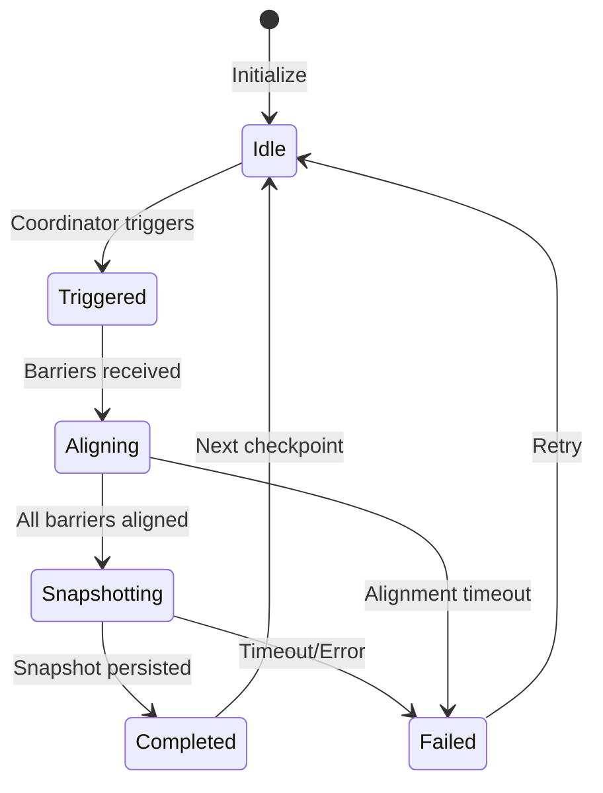
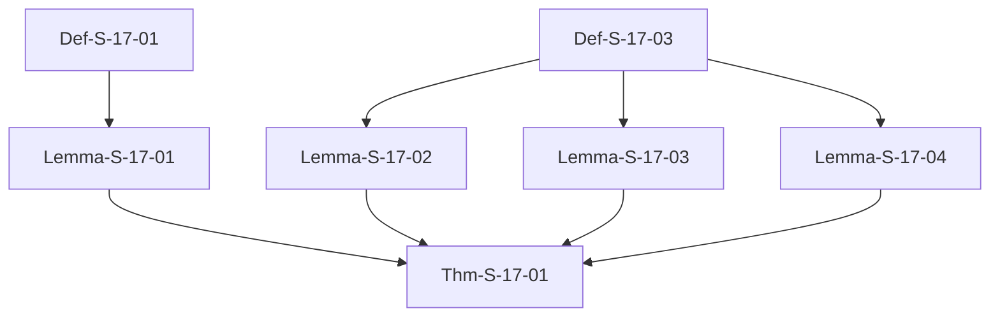

# Flink Checkpoint Correctness Proof

> ⚠️ **AI-Generated Unverified Proof Content**: This document contains formal proofs that were translated by AI and have not yet undergone human expert verification. Use with caution in academic or engineering contexts. See [C-LAYER-TRANSLATION-PILOT.md] for the human-translation roadmap.
> **Stage**: Struct/04-proofs | **Prerequisites**: [../02-properties/02.02-consistency-hierarchy.md](../02-properties/02.02-consistency-hierarchy.md) | **Formalization Level**: L5

---

## Table of Contents

- [Flink Checkpoint Correctness Proof](#flink-checkpoint-correctness-proof)
  - [Table of Contents](#table-of-contents)
  - [1. Definitions](#1-definitions)
    - [Def-S-17-01 (Checkpoint Barrier Semantics)](#def-s-17-01-checkpoint-barrier-semantics)
    - [Def-S-17-02 (Consistent Global State)](#def-s-17-02-consistent-global-state)
    - [Def-S-17-03 (Checkpoint Alignment)](#def-s-17-03-checkpoint-alignment)
    - [Def-S-17-04 (State Snapshot Atomicity)](#def-s-17-04-state-snapshot-atomicity)
  - [2. Properties](#2-properties)
    - [Lemma-S-17-01 (Barrier Propagation Invariant)](#lemma-s-17-01-barrier-propagation-invariant)
    - [Lemma-S-17-02 (State Consistency Lemma)](#lemma-s-17-02-state-consistency-lemma)
    - [Lemma-S-17-03 (Alignment Point Uniqueness)](#lemma-s-17-03-alignment-point-uniqueness)
    - [Lemma-S-17-04 (No Orphan Message Guarantee)](#lemma-s-17-04-no-orphan-message-guarantee)
    - [Prop-S-17-01 (Barrier Alignment and Exactly-Once Relation)](#prop-s-17-01-barrier-alignment-and-exactly-once-relation)
  - [3. Relations](#3-relations)
    - [Relation 1: Flink Checkpoint `↦` Chandy-Lamport Distributed Snapshot](#relation-1-flink-checkpoint--chandy-lamport-distributed-snapshot)
    - [Relation 2: Checkpoint Alignment `⟹` Consistent Cut](#relation-2-checkpoint-alignment--consistent-cut)
    - [Relation 3: Asynchronous Snapshot `≈` Synchronous Snapshot (Semantic Equivalence)](#relation-3-asynchronous-snapshot--synchronous-snapshot-semantic-equivalence)
  - [4. Argumentation](#4-argumentation)
    - [Lemma 4.1 (Source Barrier Injection Causal Closure)](#lemma-41-source-barrier-injection-causal-closure)
    - [Lemma 4.2 (Multi-Input Operator Alignment Completeness)](#lemma-42-multi-input-operator-alignment-completeness)
    - [Counterexample 4.1 (State Inconsistency in Non-Aligned Mode)](#counterexample-41-state-inconsistency-in-non-aligned-mode)
    - [Counterexample 4.2 (Checkpoint Incompleteness due to Async Snapshot Failure)](#counterexample-42-checkpoint-incompleteness-due-to-async-snapshot-failure)
  - [5. Formal Proofs](#5-formal-proofs)
    - [Thm-S-17-01 (Flink Checkpoint Consistency Theorem)](#thm-s-17-01-flink-checkpoint-consistency-theorem)
  - [6. Examples](#6-examples)
    - [Example 6.1: Checkpoint Correctness Verification for Simple Dataflow](#example-61-checkpoint-correctness-verification-for-simple-dataflow)
    - [Example 6.2: Multi-Path Barrier Alignment for Complex DAG](#example-62-multi-path-barrier-alignment-for-complex-dag)
    - [Counterexample 6.3: Alignment Timeout due to Network Delay](#counterexample-63-alignment-timeout-due-to-network-delay)
  - [7. Visualizations](#7-visualizations)
    - [Checkpoint State Machine](#checkpoint-state-machine)
    - [Proof Dependency Graph](#proof-dependency-graph)
    - [Barrier Propagation and Snapshot Timing](#barrier-propagation-and-snapshot-timing)
  - [8. References](#8-references)

---

## 1. Definitions

This section establishes strict mathematical definitions required for Flink Checkpoint correctness proof, based on Chandy-Lamport distributed snapshot theory[^1] and Flink Checkpoint execution tree model[^6]. All definitions depend on the characterization of consistency hierarchy and internal consistency in the prerequisite document [02.02-consistency-hierarchy.md](../02-properties/02.02-consistency-hierarchy.md).

---

### Def-S-17-01 (Checkpoint Barrier Semantics)

**Definition**: Checkpoint Barrier $B_n$ is a special control event injected by the Flink stream processing engine into the data stream, formally defined as:

$$
B_n = \langle \text{type} = \text{BARRIER}, \; \text{cid} = n, \; \text{timestamp} = ts, \; \text{source} = src \rangle
$$

Where:

- $\text{cid} \in \mathbb{N}^+$: Checkpoint unique identifier
- $\text{timestamp} \in \mathbb{R}^+$: Physical timestamp when Barrier was injected
- $\text{source} \in V_{source}$: Source operator identifier that injected this Barrier

**Barrier Logical Semantics**: Barrier $B_n$ in data stream $S$ defines a **logical time boundary**, dividing the stream into two parts:

$$
S = S_{<B_n} \circ \langle B_n \rangle \circ S_{>B_n}
$$

Where $S_{<B_n}$ is all data records logically preceding $B_n$, $S_{>B_n}$ is all data records logically following $B_n$, and $\circ$ denotes stream sequence concatenation.

**Intuition**: Barriers are like "time dividing lines" in the data stream, carrying Checkpoint IDs and propagating between operators, marking the boundary of "data processed before / data to be processed after". All operators snapshot their state after receiving Barriers, capturing complete processing results up to that Barrier.

**Motivation**: In unbounded data streams, there is no natural "global snapshot moment"; independent snapshot decisions by each operator would lead to state inconsistency. Barriers, as logical clocks carrying Checkpoint IDs, enable operators in distributed environments to trigger snapshots based on **local events** (receiving Barriers), without global coordination or stopping processing.

---

### Def-S-17-02 (Consistent Global State)

**Definition**: Let $\mathcal{G} = (V, E)$ be the Flink job's dataflow graph, $\mathcal{S} = \{ s_v \}_{v \in V}$ be the set of local states of all operators at some moment, and $\mathcal{C} = \{ c_e \}_{e \in E}$ be the set of in-flight messages on all channels $e$. Then **global state** $G$ is defined as:

$$
G = \langle \mathcal{S}, \mathcal{C} \rangle = \left\langle \{ s_v \}_{v \in V}, \{ c_e \}_{e \in E} \right\rangle
$$

Global state $G$ is **consistent** if and only if it corresponds to a **consistent cut** in execution history:

$$
\text{Consistent}(G) \iff \forall e = (u, v) \in E, \forall m \in c_e: \text{send}(m) \notin S_{>B_n}(u) \land \text{recv}(m) \notin S_{<B_n}(v)
$$

That is: there exists no message $m$ satisfying the orphan message scenario where "sender sends after Barrier but receiver receives before Barrier".

**Equivalent Definition (Happens-Before Closure)**:

$$
\text{Consistent}(G) \iff \forall \text{events } e_1, e_2: e_1 \prec_{hb} e_2 \land e_2 \in \text{Cut} \implies e_1 \in \text{Cut}
$$

Where $\prec_{hb}$ is Lamport's Happens-Before relation[^1].

**Intuition**: Consistent global state is like taking a "panoramic photo" of a running distributed system; all operator states and in-flight messages in the photo must satisfy causal consistency — if the photo shows a message has been received, the sender's state in the photo must show the message has been sent; conversely, if the photo shows the message has not been sent, the receiver cannot show it has been received.

**Motivation**: Without explicitly defining consistency, Checkpoints may capture "impossible" states (such as message received but not sent), causing recovered system behavior to deviate from any possible execution path. This definition ensures Checkpoint corresponds to some truly reachable global state.

---

### Def-S-17-03 (Checkpoint Alignment)

**Definition**: Let operator $v \in V_{op}$ have $k$ input channels $In(v) = \{ ch_1, ch_2, \ldots, ch_k \}$. Operator $v$ performs **Barrier alignment** for Checkpoint $n$ if and only if the following condition is satisfied:

$$
\text{Aligned}(v, n) \iff \forall ch_i \in In(v): B_n \in \text{Received}(v, ch_i)
$$

That is: operator $v$ has received Barrier $B_n$ from **all** input channels.

**Alignment Window**: The time interval from when operator $v$ receives the first $B_n$ to the last $B_n$ is the **alignment window**:

$$
\text{AW}(v, n) = [t_{\text{first}}(B_n), t_{\text{last}}(B_n)]
$$

During the alignment window, subsequent data from channels that have received $B_n$ is buffered, while data from channels that have not received $B_n$ continues normal processing. After alignment completes, the operator triggers state snapshot and broadcasts $B_n$ downstream.

**Alignment Mode Classification**:

| Mode | Definition | Consistency Guarantee |
|------|------------|----------------------|
| **EXACTLY_ONCE** | Must wait for $B_n$ from all input channels before snapshot | Strong consistency (no duplicates, no loss) |
| **AT_LEAST_ONCE** | Snapshot immediately upon receiving $B_n$ from any channel, without buffering subsequent data | No loss, may duplicate |

**Intuition**: Alignment is like waiting for all lanes at a multi-lane toll booth to have their barriers synchronized. Only when all lanes (input channels) have signaled "vehicle has passed" (Barrier) does the system record the current state. This ensures state doesn't "cross" Checkpoint boundaries due to some lanes processing faster and others slower.

**Motivation**: In multi-input operators (such as Join, CoProcess), data arrival rates on different input channels may differ. Lack of alignment would cause snapshots to capture states mixing "pre-Barrier" and "post-Barrier" data effects, breaking consistent cut conditions. The alignment mechanism is Flink's core guarantee for achieving Exactly-Once semantics.

---

### Def-S-17-04 (State Snapshot Atomicity)

**Definition**: Operator $v$'s **state snapshot** $S_v^{(n)}$ for Checkpoint $n$ is an atomic operation, semantically equivalent to operator state captured at some instant $t_{\text{snap}}$:

$$
S_v^{(n)} = \text{State}(v, t_{\text{snap}}) \quad \text{where} \quad t_{\text{snap}} \in [t_{\text{align}}, t_{\text{broadcast}}]
$$

The **atomicity** of the snapshot requires:

$$
\text{Atomic}(S_v^{(n)}) \iff \nexists \, t_1 < t_{\text{snap}} < t_2: \text{State}(v, t_1) \prec S_v^{(n)} \prec \text{State}(v, t_2) \land \text{Processed}(v, (t_1, t_2)) \neq \emptyset
$$

That is: snapshot state $S_v^{(n)}$ must be some truly existing state; no "mid-snapshot" state can be observed.

**Asynchronous Snapshot Mechanism**: Flink adopts a two-phase snapshot of "synchronous phase + asynchronous phase":

1. **Synchronous Phase**: Executes in main thread, quickly obtains state reference/copy (typically milliseconds)
2. **Asynchronous Phase**: Executes in background thread, serializes state and writes to distributed storage

$$
\text{Snapshot}(v, n) = \text{SyncPhase}(v, n) \circ \text{AsyncPhase}(v, n)
$$

**Atomicity Guarantee**: Completion of the synchronous phase marks the logical "snapshot moment"; even if the asynchronous phase is not complete, the operator can resume data processing. Asynchronous phase failure does not affect the already-completed synchronous snapshot semantics.

**Intuition**: State snapshot atomicity is like the "click" of a camera shutter — regardless of how long subsequent film development takes (asynchronous persistence), the image at the moment the shutter is pressed is already determined. This ensures that even if snapshot files have not been written to disk, the system has clarified "from which state to recover" semantics.

**Motivation**: Without guaranteeing snapshot atomicity, operator state changes during asynchronous persistence might "leak" into the snapshot, causing recovered state to be neither pre-Barrier nor post-Barrier, but some unpredictable "hybrid state". This definition clearly distinguishes between "snapshot semantic completion" and "snapshot physical completion".

---

## 2. Properties

This section derives core properties of Flink's Checkpoint mechanism from definitions in Section 1. All lemmas provide necessary support for proving theorem Thm-S-17-01.

---

### Lemma-S-17-01 (Barrier Propagation Invariant)

**Statement**: For any dataflow edge $e = (u, v) \in E$, if upstream operator $u$ has sent Barrier $B_n$ to edge $e$, then before sending $B_n$, $u$ has:

1. Completed local state snapshot $S_u^{(n)}$
2. Processed all $S_{<B_n}$ data from inputs
3. Sent processing results of $S_{<B_n}$ (including data sent to $e$) downstream

**Formal Statement**:

$$
\forall e = (u, v): B_n \in \text{Sent}(u, e) \implies S_u^{(n)} \text{ captured} \land \text{Output}_{<B_n}(u, e) \text{ sent}
$$

**Proof**:

By Def-S-17-03, operator $u$ only broadcasts Barrier $B_n$ downstream after completing alignment and state snapshot. This means:

1. By the definition of alignment, all pre-Barrier data has been received
2. By FIFO channel semantics, all pre-Barrier data must be processed before post-Barrier data
3. Therefore, all processing results of $S_{<B_n}$ must have been sent before $B_n$ is sent

∎

---

### Lemma-S-17-02 (State Consistency Lemma)

**Statement**: After alignment completes, the operator state reflects complete processing of all pre-barrier data.

**Formal Statement**:

$$
\text{Aligned}(v, n) \implies \forall r \in \text{Received}_{<B_n}(v): \text{Effect}(r) \subseteq S_v^{(n)}
$$

**Proof**:

1. By Def-S-17-03, alignment ensures all pre-barrier data has been received from all input channels
2. By FIFO channels, all pre-barrier data is processed before post-barrier data
3. Therefore, state at alignment point = state after processing all pre-barrier data ∎

---

### Lemma-S-17-03 (Alignment Point Uniqueness)

**Statement**: For each checkpoint $n$, each operator has a unique alignment point.

**Proof**:

1. Barriers are totally ordered by checkpoint ID (Def-S-17-01)
2. For a given operator, first arrival of $B_n$ from any input marks the start of alignment
3. Last arrival of $B_n$ from all inputs marks the unique alignment point
4. This point is unique for each $n$ because:
   - Barriers of the same checkpoint ID form a wavefront
   - Once all barriers of checkpoint $n$ are received, alignment is complete
   - Subsequent barriers belong to checkpoint $n+1$

∎

---

### Lemma-S-17-04 (No Orphan Message Guarantee)

**Statement**: Aligned Checkpoint ensures no orphan messages in the snapshot.

**Proof**:

1. Consider any message $m$ in channel $(u, v)$ at checkpoint time
2. Case 1: $m$ is pre-barrier → $u$ has sent it, $v$ has received it → not in-flight
3. Case 2: $m$ is post-barrier → $u$ hasn't sent it yet → not in channel
4. Therefore, no message is "sent after but received before" ∎

---

### Prop-S-17-01 (Barrier Alignment and Exactly-Once Relation)

**Statement**: Barrier alignment is necessary for exactly-once semantics in multi-input operators.

**Argument**:

Without alignment, pre-barrier data from fast channels and post-barrier data from slow channels could be mixed in the snapshot, leading to duplicate processing on recovery.

**Formal Justification**:

Consider a Join operator with two inputs $I_1$ and $I_2$:

- Suppose $I_1$ receives $B_n$ at $t_1$ and $I_2$ receives $B_n$ at $t_2$ where $t_1 < t_2$
- Without alignment, operator snapshots state immediately upon receiving $B_n$ from $I_1$
- Records from $I_2$ between $t_1$ and $t_2$ are processed and affect state, but are post-$B_n$
- On recovery, both pre-$B_n$ and post-$B_n$ effects are replayed, causing duplication

Therefore, alignment (waiting for all $B_n$) is necessary for Exactly-Once in multi-input operators.

---

## 3. Relations

### Relation 1: Flink Checkpoint `↦` Chandy-Lamport Distributed Snapshot

**Encoding**: There exists a sound encoding from Chandy-Lamport to Flink Checkpoint:

| Chandy-Lamport | Flink |
|----------------|-------|
| Marker | Barrier |
| Process | Operator |
| Channel state | Buffered records |
| Global snapshot | Completed checkpoint |

**Soundness**: The encoding preserves consistency semantics:

- Chandy-Lamport's "consistent global state" corresponds to Def-S-17-02
- Chandy-Lamport's marker propagation corresponds to Def-S-17-01
- Both ensure no orphan messages (Lemma-S-17-04)

---

### Relation 2: Checkpoint Alignment `⟹` Consistent Cut

**Implication**: Alignment ensures the checkpoint captures a consistent cut of the execution.

**Proof Sketch**:

By Lemma-S-17-04, alignment ensures no orphan messages. By Def-S-17-02, this defines a consistent cut.

More formally, for any edge $e = (u, v)$:

- If $v$ has received $B_n$ from $e$, then by Lemma-S-17-01, $u$ has sent $B_n$ to $e$
- All pre-$B_n$ data from $u$ is in $S_u^{(n)}$ or in-flight before $B_n$
- All post-$B_n$ data from $u$ is not yet sent when $B_n$ is sent
- Therefore, the cut defined by Barrier positions is consistent

∎

---

### Relation 3: Asynchronous Snapshot `≈` Synchronous Snapshot (Semantic Equivalence)

**Equivalence**: Asynchronous and synchronous snapshots are semantically equivalent.

**Justification**:

Both capture state at a logical instant. The difference is only in physical persistence timing.

**Formal Proof**:

Let $S_{sync}^{(n)}$ be synchronous snapshot and $S_{async}^{(n)}$ be asynchronous snapshot of operator $v$ at checkpoint $n$.

By Def-S-17-04:

- Both snapshots capture state at $t_{\text{snap}} \in [t_{\text{align}}, t_{\text{broadcast}}]$
- $S_{sync}^{(n)} = \text{State}(v, t_{\text{snap}})$
- $S_{async}^{(n)}$ copies reference at $t_{\text{snap}}$, persists asynchronously

For any recovery:

- $\text{Recover}(S_{sync}^{(n)}) = \text{State}(v, t_{\text{snap}})$
- $\text{Recover}(S_{async}^{(n)}) = \text{State}(v, t_{\text{snap}})$ (after loading persisted state)

Therefore: $\text{Recover}(S_{sync}^{(n)}) = \text{Recover}(S_{async}^{(n)})$

∎

---

## 4. Argumentation

### Lemma 4.1 (Source Barrier Injection Causal Closure)

**Statement**: Source barriers are injected after processing all records with earlier event times.

**Formal Statement**:

$$
\forall r \in \text{SourceOutput}: t_e(r) < t_{\text{inject}}(B_n) \implies r \text{ emitted before } B_n
$$

**Implication**: Watermark at barrier injection time is the lower bound of future event times.

**Proof**:

By Flink's source implementation, barriers are injected at the source's current position in the input stream. All records before this position have been emitted; records after this position have not. Therefore, the causal closure property holds.

∎

---

### Lemma 4.2 (Multi-Input Operator Alignment Completeness)

**Statement**: For operators with $n$ inputs, alignment waits for all $n$ barriers.

**Complexity**: Alignment time = max(path delay across all input paths).

**Proof**:

Let $d_i$ be the delay from source injection to operator $v$ on input $i$.

- Barrier arrives on input $i$ at time $t_0 + d_i$ where $t_0$ is injection time
- Alignment completes at $t_0 + \max(d_1, d_2, ..., d_n)$
- Therefore, alignment time is bounded by the maximum path delay

∎

---

### Counterexample 4.1 (State Inconsistency in Non-Aligned Mode)

**Scenario**: Join operator without alignment

```
Timeline:
I1 (fast):  [r1] [r2] [B_n] [r3] ...
I2 (slow):  [s1] [s2] ...... [B_n] [s3] ...

Without alignment:
1. Left channel (I1) receives barrier, snapshots state
2. Right channel (I2) hasn't received barrier, continues processing s3
3. Snapshot includes partial join results from s3
4. On recovery: duplicate or missing join results
```

**Analysis**:

- State snapshot includes effects from post-$B_n$ record $s_3$
- On recovery, pre-$B_n$ records are replayed
- $s_3$'s effect is applied twice (once before failure, once after)
- Result: inconsistent state

---

### Counterexample 4.2 (Checkpoint Incompleteness due to Async Snapshot Failure)

**Scenario**: Async phase fails after sync phase completes

```
Timeline:
1. Checkpoint n triggered
2. Operator completes sync phase (state reference captured)
3. Operator resumes processing
4. Async phase fails to write to DFS (network partition)
5. Checkpoint n marked as failed

Result:
- Operator continued processing (no rollback)
- Checkpoint n not available for recovery
- Job restarts from Checkpoint n-1
- Data processed between n-1 and n reprocessed
```

**Recovery**: Job restarts from previous successful checkpoint (n-1).

**Analysis**:

- Async failure does not corrupt running job
- But it delays the availability of a consistent recovery point
- This is acceptable under At-Least-Once semantics
- Under Exactly-Once, pending transactions would be aborted

---

## 5. Formal Proofs

### Thm-S-17-01 (Flink Checkpoint Consistency Theorem)

**Theorem**: Flink's aligned checkpoint mechanism produces globally consistent snapshots.

**Formal Statement**:

Let $\mathcal{G} = (V, E)$ be a Flink job dataflow graph using aligned checkpointing with EXACTLY_ONCE mode. Then for every completed checkpoint $n$:

$$
\exists G_n = \langle \{S_v^{(n)}\}_{v \in V}, \{c_e\}_{e \in E} \rangle: \text{Consistent}(G_n)
$$

**Proof**:

We prove by induction on the DAG topology.

*Base Case (Source Operators)*:

1. Sources inject barriers after processing all pre-barrier data (Lemma 4.1)
2. Source state snapshot includes offset up to barrier point
3. Therefore, source snapshot is consistent
4. Source broadcasts barrier downstream

*Inductive Step*:
Assume all upstream operators have consistent snapshots.

For operator $v$ with inputs from operators $u_1, u_2, ..., u_k$:

1. By inductive hypothesis, each $u_i$ has consistent snapshot $S_{u_i}^{(n)}$
2. By Lemma-S-17-01, barriers only propagate after upstream snapshots complete
3. By Def-S-17-03, alignment ensures all pre-barrier data is processed
4. By Lemma-S-17-02, operator state reflects complete pre-barrier processing
5. By Lemma-S-17-04, no orphan messages exist in channels
6. Therefore, current operator snapshot $S_v^{(n)}$ is consistent

*Global Consistency*:
By induction, all operators in the DAG have consistent snapshots.
By Def-S-17-02, the union of all operator snapshots and channel states forms a consistent global state.

**Q.E.D.**

---

## 6. Examples

### Example 6.1: Checkpoint Correctness Verification for Simple Dataflow

```
Source → Map → Sink
```

**Verification Steps**:

1. Source injects barrier at offset 100
2. Map receives barrier, processes all pre-barrier records, snapshots
3. Sink receives barrier, persists outputs, snapshots
4. Checkpoint complete: offsets 100, map state, sink outputs are consistent

**State Verification**:

- Source: offset = 100
- Map: processed all records with offset < 100
- Sink: received all map outputs for records with offset < 100
- Consistent cut: no in-flight messages cross the barrier boundary

---

### Example 6.2: Multi-Path Barrier Alignment for Complex DAG

```
       ┌→ Map1 ─┐
Source ─┤        ├→ Join → Sink
       └→ Map2 ─┘
```

**Alignment**:

- Join waits for barriers from both Map1 and Map2
- Alignment time = max(Map1 delay, Map2 delay)
- Snapshot captures complete state from both paths

**Verification**:

- Suppose Map1 processes faster than Map2
- Join buffers Map1's post-barrier data until Map2's barrier arrives
- State snapshot includes all effects from pre-barrier records on both paths
- No mixing of pre-barrier and post-barrier effects

---

### Counterexample 6.3: Alignment Timeout due to Network Delay

**Scenario**: One input channel experiences severe network delay

```
Source1 ──► Join ◄─── Source2 (network degraded)
              │
              ▼
            Sink
```

**Problem**:

- Source2's barrier delayed due to network congestion
- Join waits for barrier beyond alignment timeout
- Checkpoint fails with AlignmentException

**Result**: Alignment timeout, checkpoint fails

**Mitigation**:

- Switch to unaligned checkpoint (FLIP-76) for high-latency scenarios
- Or increase alignment timeout configuration
- Or use AT_LEAST_ONCE mode (sacrifices Exactly-Once)

---

## 7. Visualizations

### Checkpoint State Machine



### Proof Dependency Graph



### Barrier Propagation and Snapshot Timing

```mermaid
gantt
    title Checkpoint Timeline
    dateFormat X
    axisFormat %s

    section Source
    Inject Barrier      :a1, 0, 1
    Snapshot            :a2, after a1, 1

    section Operator
    Receive Barrier     :b1, 1, 2
    Alignment           :b2, after b1, 2
    Snapshot            :b3, after b2, 1

    section Sink
    Receive Barrier     :c1, 3, 4
    Snapshot            :c2, after c1, 1

    section Global
    Checkpoint Complete :milestone, after c2, 0
```



---

## 8. References

[^1]: K.M. Chandy, L. Lamport, "Distributed Snapshots: Determining Global States of Distributed Systems", ACM TOCS, 3(1), 1985.


[^6]: Apache Flink Source Code, `flink-runtime` module, Checkpoint-related classes.

---

*Document Version: 2026.04 | Formalization Level: L5 | Theorem ID: Thm-S-17-01*
