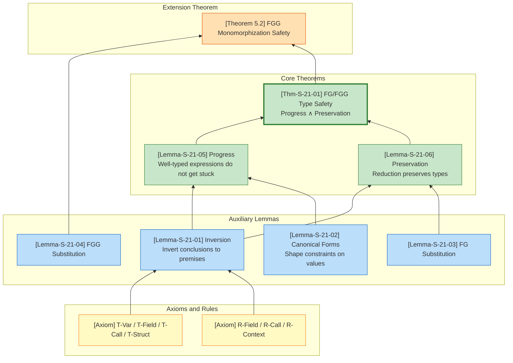
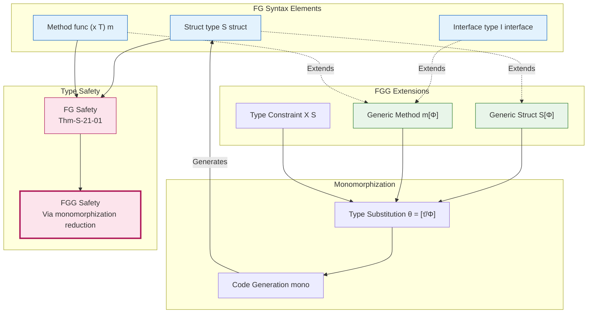

# Type Safety Proof for FG/FGG

> 📝 **Framework Document**: This is an AI-generated framework for human translators. All proof sections are marked with `<!-- PROOF: TO BE COMPLETED BY FORMAL EXPERT -->` and must be filled by a person with formal methods background.

> **Chapter Position**: This chapter formally proves the type safety of Featherweight Go (FG) and Featherweight Generic Go (FGG), establishing the strict mathematical guarantee that well-typed programs cannot get stuck.
>
> **Prerequisites**: [`../02-properties/02.05-type-safety-derivation.md`](../02-properties/02.05-type-safety-derivation.md)

---

## Table of Contents

- [Type Safety Proof for FG/FGG](#type-safety-proof-for-fgfgg)
  - [Table of Contents](#table-of-contents)
  - [1. Definitions](#1-definitions)
    - [1.1 FG Abstract Syntax](#11-fg-abstract-syntax)
    - [1.2 FGG Abstract Syntax](#12-fgg-abstract-syntax)
    - [1.3 Type Substitution](#13-type-substitution)
    - [1.4 Method Resolution](#14-method-resolution)
    - [1.5 FG/FGG Small-Step Operational Semantics (SOS)](#15-fgfgg-small-step-operational-semantics-sos)
  - [2. Properties](#2-properties)
    - [2.1 FG/FGG Typing Rules](#21-fgfgg-typing-rules)
  - [3. Relations](#3-relations)
    - [3.1 Relationship between FG and FGG](#31-relationship-between-fg-and-fgg)
    - [3.2 Monomorphization Semantic Relation](#32-monomorphization-semantic-relation)
  - [4. Argumentation](#4-argumentation)
    - [4.1 Inversion Lemma](#41-inversion-lemma)
    - [4.2 Canonical Forms Lemma](#42-canonical-forms-lemma)
    - [4.3 Substitution Lemma](#43-substitution-lemma)
  - [5. Formal Proofs](#5-formal-proofs)
    - [5.1 Progress Theorem](#51-progress-theorem)
    - [5.2 Preservation Theorem](#52-preservation-theorem)
    - [5.3 FG/FGG Type Safety Theorem](#53-fgfgg-type-safety-theorem)
    - [5.4 FGG Monomorphization Correctness](#54-fgg-monomorphization-correctness)
  - [6. Examples](#6-examples)
    - [6.1 Positive Example: FG Type Derivation and Reduction](#61-positive-example-fg-type-derivation-and-reduction)
    - [6.2 Positive Example: FGG Generic Type Derivation](#62-positive-example-fgg-generic-type-derivation)
    - [6.3 Negative Example: Type Assertion Failure](#63-negative-example-type-assertion-failure)
    - [6.4 Negative Example: FGG Constraint Violation](#64-negative-example-fgg-constraint-violation)
  - [7. Visualizations](#7-visualizations)
    - [7.1 Type Safety Proof Structure Diagram](#71-type-safety-proof-structure-diagram)
    - [7.2 FG-FGG Syntax and Proof Dependency Diagram](#72-fg-fgg-syntax-and-proof-dependency-diagram)
  - [8. References](#8-references)

## 1. Definitions

### 1.1 FG Abstract Syntax

**Definition Def-S-21-01 (FG Abstract Syntax)**[^1][^2]:

FG is the minimal core subset of the Go language, stripped of pointers, slices, channels, goroutines, and other features, retaining only structs, interfaces, methods, field access, and type assertions:

$$
\begin{array}{llcl}
\text{Types} & t, u & ::= & t_S \mid t_I \\
\text{Expressions} & e & ::= & x \mid e.f \mid e.(t) \mid t_S\{f_1: e_1, ..., f_n: e_n\} \mid e.m(e_1, ..., e_n) \\
\text{Values} & v & ::= & t_S\{f_1: v_1, ..., f_n: v_n\} \\
\text{Declarations} & D & ::= & \text{type } t_S \text{ struct } \{f_1 \, u_1, ..., f_n \, u_n\} \\
  & & \mid & \text{type } t_I \text{ interface } \{m_1(M_1), ..., m_k(M_k)\} \\
  & & \mid & \text{func } (x \, t) \, m(x_1 \, u_1, ...) \, u_r \, \{ \text{return } e \}
\end{array}
$$

**Notation Conventions**:

- $t_S$ denotes a struct type, defined by a struct declaration
- $t_I$ denotes an interface type, defined by an interface declaration
- $x$ denotes a variable, drawn from the environment $\Gamma$
- $e.f$ denotes field selection, $e.(t)$ denotes type assertion
- $t_S\{\bar{f}: \bar{e}\}$ denotes struct literal construction
- $e.m(\bar{e})$ denotes method invocation

**Intuitive Explanation**: The FG syntax is deliberately minimal, stripping away all advanced features of Go except structural subtyping. The struct type $t_S$ is the sole value constructor; the interface type $t_I$ defines a set of method specifications; method invocation achieves dynamic dispatch through structural subtyping matching.

---

### 1.2 FGG Abstract Syntax

**Definition Def-S-21-02 (FGG Generic Extension)**[^3]:

FGG introduces type parameters, type constraints, and monomorphization semantics on top of FG:

$$
\begin{array}{llcl}
\text{Type Parameters} & \Phi & ::= & \epsilon \mid \Phi, X \, S \\
\text{Type Arguments} & \tau, \sigma & ::= & X \mid n[\bar{\tau}] \\
\text{Type Constraints} & S & ::= & \text{any} \mid \text{interface } \{M_1, ..., M_k\} \\
\text{Generic Struct} & & & \text{type } t_S[\Phi] \text{ struct } \{f_1 \, u_1, ...\} \\
\text{Generic Interface} & & & \text{type } t_I[\Phi] \text{ interface } \{...\} \\
\text{Generic Method} & & & \text{func } (x \, t[\bar{\tau}]) \, m[\Phi](...) \, u_r \, \{\text{return } e\}
\end{array}
$$

**Intuitive Explanation**: FGG's type parameters $\Phi$ allow struct, interface, and method declarations to be parameterized over types. Type constraints $S$ restrict the set of types that can be instantiated. Monomorphization is a compile-time strategy that translates generic programs into non-generic FG programs, guaranteeing zero runtime overhead.

---

### 1.3 Type Substitution

**Definition Def-S-21-03 (Type Substitution)**:

Type substitution $\theta = [\bar{\tau}/\bar{X}]$ is a mapping from type variables to concrete types:

$$
\begin{array}{lcl}
\theta(X_i) & = & \tau_i \\
\theta(n[\tau_1, ..., \tau_k]) & = & n[\theta(\tau_1), ..., \theta(\tau_k)]
\end{array}
$$

**Substitution on Expressions**:

$$
\begin{array}{lcl}
\theta(x) & = & x \\
\theta(e.f) & = & \theta(e).f \\
\theta(e.(t)) & = & \theta(e).(\theta(t)) \\
\theta(n[\bar{\tau}]\{\bar{f}: \bar{e}\}) & = & n[\theta(\bar{\tau})]\{\bar{f}: \theta(\bar{e})\} \\
\theta(e.m[\bar{\sigma}](\bar{e})) & = & \theta(e).m[\theta(\bar{\sigma})](\theta(\bar{e}))
\end{array}
$$

---

### 1.4 Method Resolution

**Definition Def-S-21-04 (Method Resolution)**:

$$
method(n[\bar{\tau}], m) = func(x \, n[\bar{X}]) \, m[\Phi](...) \, u_r \, \{e\}[\bar{\tau}/\bar{X}]
$$

**Method Satisfaction**: A type $t$ satisfies the method specification $m(\bar{x}: \bar{u}) \, u_r$ if and only if $method(t, m)$ exists and the signature is compatible:

$$
\forall i: param_i' <: param_i \land return <: return'
$$

(Contravariant in parameters, covariant in return type.)

---

### 1.5 FG/FGG Small-Step Operational Semantics (SOS)

**Evaluation Contexts**:

$$
E ::= [] \mid E.f \mid E.(t) \mid t_S\{..., f_i: E, ...\} \mid E.m(\bar{e}) \mid v.m(..., E, ...)
$$

**FG Core Reduction Rules**:

$$
\boxed{
\begin{array}{ll}
\text{(R-Field)} & t_S\{..., f_i: v_i, ...\}.f_i \longrightarrow v_i \\[8pt]
\text{(R-Call)} & v.m(v_1, ..., v_n) \longrightarrow e[v/x, v_1/x_1, ..., v_n/x_n] \\
& \text{where } method(t_S, m) = func(x \, t_S) \, m(...) \, ... \, \{\text{return } e\} \\[8pt]
\text{(R-Assert-Success)} & t_S\{...\}.(t_S) \longrightarrow t_S\{...\} \\[8pt]
\text{(R-Context)} & \dfrac{e \longrightarrow e'}{E[e] \longrightarrow E[e']}
\end{array}
}
$$

**FGG Core Reduction Rules**:

$$
\boxed{
\begin{array}{ll}
\text{(R-Field-G)} & n[\bar{\tau}]\{..., f_i: v_i, ...\}.f_i \longrightarrow v_i \\[8pt]
\text{(R-Call-G)} & v.m[\bar{\sigma}](v_1, ...) \longrightarrow \theta(e)[v/x, v_1/x_1, ...] \\
& \text{where } \theta = [\bar{\tau}/\bar{X}][\bar{\sigma}/\Phi], \, v = n[\bar{\tau}]\{...\} \\[8pt]
\text{(R-Context-G)} & \dfrac{e \longrightarrow e'}{E[e] \longrightarrow E[e']}
\end{array}
}
$$

---

## 2. Properties

### 2.1 FG/FGG Typing Rules

**FG Core Typing Rules**:

$$
\boxed{
\begin{array}{c}
\dfrac{\Gamma(x) = t}{\Gamma \vdash x : t} \text{ (T-Var)} \\[10pt]
\dfrac{\Gamma \vdash e : t_S \quad (f \, u) \in fields(t_S)}{\Gamma \vdash e.f : u} \text{ (T-Field)} \\[10pt]
\dfrac{\forall i: \Gamma \vdash e_i : u_i \quad fields(t_S) = [\bar{f}: \bar{u}]}{\Gamma \vdash t_S\{\bar{f}: \bar{e}\} : t_S} \text{ (T-Struct)} \\[10pt]
\dfrac{\Gamma \vdash e : t \quad method(t, m) = (\bar{x}: \bar{u}) \rightarrow v \quad \forall i: \Gamma \vdash e_i : u_i' \land u_i' <: u_i}{\Gamma \vdash e.m(\bar{e}) : v} \text{ (T-Call)}
\end{array}
}
$$

**FGG Typing Judgment Form**: $\Delta; \Gamma \vdash_{FGG} e : t$, where $\Delta$ is the type parameter environment and $\Gamma$ is the variable environment.

**FGG Constraint Satisfaction Rule**:

$$
\dfrac{\forall m \in S: \tau \text{ implements } m}{\Delta \vdash \tau \text{ satisfies } S} \text{ (Sat)}
$$

---

## 3. Relations

### 3.1 Relationship between FG and FGG

**Relation**: FGG $>$ FG (FGG strictly extends FG)

| Feature | FG | FGG | Description |
|---------|-----|-----|-------------|
| Struct | ✓ | ✓ | Basic value type |
| Interface | ✓ | ✓ | Set of method specifications |
| Method | ✓ | ✓ | Receiver-bound function |
| Type Parameters | ✗ | ✓ | Generic support added in FGG |
| Type Constraints | ✗ | ✓ | Constraint satisfaction added in FGG |
| Monomorphization | ✗ | ✓ | FGG compile-time translation strategy |

**Conclusion**: FGG strictly contains the expressive power of FG, and monomorphization establishes a semantics-preserving translation from FGG to FG.

---

### 3.2 Monomorphization Semantic Relation

**Relation**: $mono(P)$ — the translation from FGG to FG

$$
mono(P) = \bigcup_{\langle decl, \bar{\tau} \rangle \in Inst(P)} mono(decl, \bar{\tau})
$$

where $Inst(P)$ is the set of all type instantiation sites in program $P$.

**Semantics Preservation**: If $e \longrightarrow_{FGG} e'$, then $mono(e) \longrightarrow_{FG}^* mono(e')$.

---

## 4. Argumentation

### 4.1 Inversion Lemma

**Lemma Lemma-S-21-01 (Inversion Lemma)**:

From the conclusion of a typing judgment, the premise structure can be inverted:

$$
\dfrac{\Gamma \vdash x : t}{\Gamma(x) = t}
$$

$$
\dfrac{\Gamma \vdash e.f_i : t_i}{\exists t: \Gamma \vdash e : t \land fields(t) = [..., f_i: t_i, ...]}
$$

$$
\dfrac{\Gamma \vdash e.m(\bar{e}) : u}{\exists t: \Gamma \vdash e : t \land method(t, m) = (...) \rightarrow u \land \forall i: \Gamma \vdash e_i : t_i' \land t_i' <: t_i}
$$

<!-- PROOF: TO BE COMPLETED BY FORMAL EXPERT -->

> **Proof Placeholder**: The rigorous proof for Lemma-S-21-01 (Inversion Lemma) is to be completed here.
> The original Chinese proof involves the following key steps that must be carefully verified:
>
> 1. Establish the uniqueness of FG/FGG typing rules (each expression constructor corresponds to exactly one typing rule).
> 2. Show that from the conclusion of each rule, the premises are uniquely determined.
> 3. Apply this uniqueness to invert the typing judgment for variables, field access, and method calls.
>
> Original proof sketch (Chinese): "由 FG/FGG 类型规则的唯一性（每种表达式构造对应唯一类型规则），直接从规则前提可得。∎"

---

### 4.2 Canonical Forms Lemma

**Lemma Lemma-S-21-02 (Canonical Forms)**:

If $\vdash v : t_S$ and $type(t_S) = struct\{\bar{f}: \bar{t}\}$, then:

$$
v = t_S\{\bar{f}: \bar{v}\} \land \forall i: \vdash v_i : t_i
$$

If $\vdash v : t_I$, then $\exists t_S: t_S <: t_I \land v = t_S\{...\}$.

<!-- PROOF: TO BE COMPLETED BY FORMAL EXPERT -->

> **Proof Placeholder**: The rigorous proof for Lemma-S-21-02 (Canonical Forms) is to be completed here.
> The original Chinese proof involves the following key steps that must be carefully verified:
>
> 1. Identify that the only value constructor in FG/FGG is the struct literal.
> 2. Apply the T-Struct rule to show that each field must have the declared type or a subtype.
> 3. Argue that interfaces are not value constructors, so any value of interface type must be a concrete struct implementing that interface.
>
> Original proof sketch (Chinese): "FG/FGG 中唯一的值构造子是结构体字面值。由 T-Struct 规则，每个字段必须具有声明类型或其子类型。接口本身不是值构造子，因此接口类型的值必须是实现该接口的具体结构体。∎"

---

### 4.3 Substitution Lemma

**Lemma Lemma-S-21-03 (FG Substitution Lemma)**:

$$
\dfrac{\Gamma, x: t \vdash e : u \quad \Gamma \vdash v : t}{\Gamma \vdash e[v/x] : u}
$$

<!-- PROOF: TO BE COMPLETED BY FORMAL EXPERT -->

> **Proof Placeholder**: The rigorous proof for Lemma-S-21-03 (FG Substitution Lemma) is to be completed here.
> The original Chinese proof involves the following key steps that must be carefully verified:
>
> 1. **Base cases**: Prove the lemma for $e = x$ (substitution yields $v$, which is well-typed by premise) and $e = y \neq x$ (substitution is a no-op).
> 2. **Inductive steps**: For $e = e_0.f$, use the induction hypothesis on $e_0$ and apply T-Field.
> 3. For $e = e_0.m(\bar{e})$, use the induction hypothesis on the receiver and arguments, then apply T-Call.
> 4. For $e = t_S\{\bar{f}: \bar{e}\}$, use the induction hypothesis on each field expression, then apply T-Struct.
>
> Original proof sketch (Chinese):
> "对 $e$ 的结构进行结构归纳。
> **基本情况**: $e = x$: $x[v/x] = v$，由前提 $\Gamma \vdash v : t = u$；$e = y \neq x$: $y[v/x] = y$，类型不变。
> **归纳步骤**: $e = e_0.f$: 由归纳假设，$\Gamma \vdash e_0[v/x] : t_S$ 且 $(f \, u) \in fields(t_S)$；$e = e_0.m(\bar{e})$: 由归纳假设，方法调用保持类型；$e = t_S\{\bar{f}: \bar{e}\}$: 每个字段替换后保持类型。∎"

---

**Lemma Lemma-S-21-04 (FGG Type Substitution Lemma)**:

If $\Delta; \Gamma \vdash_{FGG} e : t$ and $\theta$ satisfies the constraints, then:

$$
\theta(\Delta); \theta(\Gamma) \vdash_{FGG} \theta(e) : \theta(t)
$$

<!-- PROOF: TO BE COMPLETED BY FORMAL EXPERT -->

> **Proof Placeholder**: The rigorous proof for Lemma-S-21-04 (FGG Type Substitution Lemma) is to be completed here.
> The original Chinese proof involves the following key steps that must be carefully verified:
>
> 1. Proceed by structural induction on the expression $e$.
> 2. For variables, show that substitution on the environment guarantees well-typedness.
> 3. For method calls, show that substituting type arguments preserves parameter type matching.
> 4. For struct construction, show that substituting type arguments preserves the correspondence of field types.
> 5. Ensure the constraint satisfaction condition guarantees the legality of substituting type parameters.
>
> Original proof sketch (Chinese): "对表达式 $e$ 的结构进行归纳。变量替换由环境定义保证；方法调用替换保持参数类型匹配；结构体构造替换保持字段类型对应。约束满足条件保证类型参数替换的合法性。∎"

---

## 5. Formal Proofs

### 5.1 Progress Theorem

**Lemma Lemma-S-21-05 (Progress Theorem)**:

If $\vdash e : T$ (or $\Delta; \Gamma \vdash_{FGG} e : T$), then:

$$
\text{either } e \in Value \text{ or } \exists e'. \, e \longrightarrow e'
$$

<!-- PROOF: TO BE COMPLETED BY FORMAL EXPERT -->

> **Proof Placeholder**: The rigorous proof for Lemma-S-21-05 (Progress Theorem) is to be completed here.
> The original Chinese proof involves the following key steps that must be carefully verified:
>
> 1. **Case 1 (Struct construction)**: By induction hypothesis, each $e_i$ is either a value or reducible. If all are values, the whole expression is a value; otherwise, the whole expression reduces by R-Context.
> 2. **Case 2 (Field access)**: If $e$ reduces, apply R-Context. If $e = v$ is a value, apply Canonical Forms to show $v$ is a struct literal, then reduce by R-Field.
> 3. **Case 3 (Method call)**: If any subexpression reduces, apply R-Context. If all are values $v.m(\bar{v})$, apply the Inversion Lemma to show $method$ exists, then reduce by R-Call.
> 4. **Case 4 (Generic method call)**: Similar to Case 3, but using R-Call-G and the FGG method resolution rule.
> 5. **Case 5 (Type assertion)**: If $e$ reduces, apply R-Context. If $e = v$ is a value, either the assertion succeeds (R-Assert-Success) or fails with panic (a defined dynamic error, not stuck).
>
> Original proof sketch (Chinese):
> "对类型判断的结构进行结构归纳。
> **案例 1: 结构体构造**...若全是值，则整体是值；否则由 R-Context 整个表达式可规约。
> **案例 2: 字段访问**...若 $e = v$ 是值，由标准形式引理...由 R-Field 规约到 $v_i$。
> **案例 3: 方法调用**...若全是值...由反演引理 $method$ 存在，由 R-Call 规约到方法体替换。
> **案例 4: 泛型方法调用**...若全是值，由标准形式和反演引理...由 R-Call-G 规约。
> **案例 5: 类型断言**...若 $t' = t$，由 R-Assert-Success 规约到 $v$；若 $t' \neq t$，触发 panic（语言定义的动态错误，非 stuck）。∎"

---

### 5.2 Preservation Theorem

**Lemma Lemma-S-21-06 (Preservation / Subject Reduction)**:

If $\vdash e : T$ and $e \longrightarrow e'$, then $\vdash e' : T$.

<!-- PROOF: TO BE COMPLETED BY FORMAL EXPERT -->

> **Proof Placeholder**: The rigorous proof for Lemma-S-21-06 (Preservation Theorem) is to be completed here.
> The original Chinese proof involves the following key steps that must be carefully verified:
>
> 1. **Case R-Field**: Use the Inversion Lemma on the struct literal to get field types, then apply subtyping transitivity to show the extracted field has the required type.
> 2. **Case R-Call**: Use the Inversion Lemma to resolve the method body type, apply the FG Substitution Lemma (Lemma-S-21-03) to substitute actual arguments, and use subtyping to conclude.
> 3. **Case R-Call-G**: Combine the FGG Type Substitution Lemma (Lemma-S-21-04) with the FG Substitution Lemma to handle generic method instantiation and argument substitution.
> 4. **Case R-Context**: Use the induction hypothesis on the inner reduction $e_1 \longrightarrow e_1'$, then perform structural induction on the evaluation context $E$ to show typing is preserved.
>
> Original proof sketch (Chinese):
> "对归约关系 $e \longrightarrow e'$ 进行规则归纳。
> **案例 R-Field**: ...由子类型传递性，$\vdash v_i : T_i$。
> **案例 R-Call**: ...由替换引理，$\vdash e_{body}[v/x, \bar{v}/\bar{x}] : T_r' <: T_r$。
> **案例 R-Call-G**: ...由反演引理和类型替换引理...由子类型保持性，返回类型保持。
> **案例 R-Context**: ...对 $E$ 结构归纳，证明上下文保持类型。∎"

---

### 5.3 FG/FGG Type Safety Theorem

**Theorem Thm-S-21-01 (FG/FGG Type Safety)**:

FG/FGG satisfies type safety: well-typed programs cannot get stuck.

$$
\text{If } \vdash e : T \text{ and } e \longrightarrow^* e' \text{, then } e' \in Value \lor \exists e''. \, e' \longrightarrow e''
$$

<!-- PROOF: TO BE COMPLETED BY FORMAL EXPERT -->

> **Proof Placeholder**: The rigorous proof for Thm-S-21-01 (FG/FGG Type Safety) is to be completed here.
> The original Chinese proof involves the following key steps that must be carefully verified:
>
> 1. Apply Preservation (Lemma-S-21-06) to show that every reduction step of a well-typed expression yields another well-typed expression of the same type.
> 2. Apply Progress (Lemma-S-21-05) to show that every well-typed expression is either a value or can take a reduction step.
> 3. Combine (1) and (2) by induction on the reduction sequence $e \longrightarrow^* e'$ to conclude that no reachable state can be stuck (non-value and non-reducible).
>
> Original proof sketch (Chinese): "由 Preservation（Lemma-S-21-06）和 Progress（Lemma-S-21-05）直接组合。1. Preservation 保证：良类型程序的归约后继保持良类型。2. Progress 保证：良类型表达式要么是值，要么可规约。3. 因此，任何可达状态不会 stuck 在非值且不可规约的状态。∎"

---

### 5.4 FGG Monomorphization Correctness

**Theorem Theorem 5.2 (FGG Monomorphization Preserves Type Safety)**:

If $P$ is a well-typed FGG program, then:

1. $mono(P)$ is a well-typed FG program
2. The execution of $P$ cannot get stuck

<!-- PROOF: TO BE COMPLETED BY FORMAL EXPERT -->

> **Proof Sketch Placeholder**: The rigorous proof sketch for Theorem 5.2 (FGG Monomorphization Preserves Type Safety) is to be completed here.
> The original Chinese proof sketch involves the following key steps that must be carefully verified:
>
> 1. **Instantiation-point well-typedness**: Show that each instantiation site generates well-typed FG declarations, using Lemma-S-21-04 (FGG Type Substitution Lemma).
> 2. **Method lookup preservation**: Prove that method lookup in the monomorphized program corresponds to method lookup in the original FGG program.
> 3. **FG type safety**: Apply Thm-S-21-01 to conclude that $mono(P)$ cannot get stuck.
> 4. **Semantic equivalence**: Appeal to the monomorphization semantic equivalence to show that $P$ and $mono(P)$ behave identically, thus $P$ cannot get stuck.
>
> Original proof sketch (Chinese): "1. 实例化点良类型性: 由 Lemma-S-21-04，每个实例化点生成良类型的 FG 声明。2. 方法查找保持: 单态化后的方法查找与原 FGG 方法查找对应。3. FG 类型安全: 由 Thm-S-21-01，$mono(P)$ 不会 stuck。4. 语义等价: 由单态化语义等价性，$P$ 与 $mono(P)$ 行为一致，故 $P$ 不会 stuck。∎"

---

## 6. Examples

### 6.1 Positive Example: FG Type Derivation and Reduction

```go
type Adder struct { value int }
func (a Adder) Add(x int) int { return a.value + x }
// Expression: Adder{value: 5}.Add(3)
```

**Type Derivation Tree**:

$$
\dfrac{
  \dfrac{\vdash 5 : int}{\vdash Adder\{value: 5\} : Adder} \text{ (T-Struct)}
  \quad method(Adder, Add) = (x: int) \rightarrow int
  \quad \vdash 3 : int
}{\vdash Adder\{value: 5\}.Add(3) : int} \text{ (T-Call)}
$$

**Reduction Sequence**:

$$
\begin{array}{l}
Adder\{value: 5\}.Add(3) \\
\longrightarrow (a.value + x)[Adder\{value: 5\}/a, 3/x] \quad \text{(R-Call)} \\
= Adder\{value: 5\}.value + 3 \\
\longrightarrow 5 + 3 \quad \text{(R-Field)} \\
\longrightarrow 8
\end{array}
$$

---

### 6.2 Positive Example: FGG Generic Type Derivation

```go
type Box[T any] struct { value T }
func (b Box[T]) Get() T { return b.value }
// Expression: Box[int]{value: 42}.Get()
```

**Type Derivation**:

$$
\Delta; \Gamma \vdash Box[int]\{value: 42\} : Box[int] \vdash Box[int]\{value: 42\}.Get() : int
$$

**Monomorphized FG Program**:

```go
type Box_int struct { value int }
func (b Box_int) Get() int { return b.value }
```

---

### 6.3 Negative Example: Type Assertion Failure

```go
type Dog struct{}
type Cat struct{}
var x interface{} = Dog{}
_ = x.(Cat)  // panic: interface conversion
```

**Analysis**: The expression `x.(Cat)` is well-typed (T-Assert permits any type assertion), but the runtime assertion fails and triggers a panic. This is not a violation of type safety—panic is a dynamically defined error mechanism of the language, not a stuck state. The Progress theorem still holds.

---

### 6.4 Negative Example: FGG Constraint Violation

```go
type Adder[T interface { ~int | ~float64 }] struct { value T }
// Error: string does not satisfy the constraint
var a Adder[string] = Adder[string]{value: "hello"}
```

**Analysis**: The FGG type checker rejects this program at the instantiation site `Adder[string]`. The underlying type of `string` is neither `int` nor `float64`, so it does not satisfy the constraint. The constraint system ensures such errors are caught at compile time.

---

## 7. Visualizations

### 7.1 Type Safety Proof Structure Diagram



---

### 7.2 FG-FGG Syntax and Proof Dependency Diagram



---

## 8. References

[^1]: Griesemer, R., Hu, R., Kokke, W., Lange, J., Taylor, I. L., Tonino, B., ... & Yu, D. (2020). Featherweight Go. *Proceedings of the ACM on Programming Languages*, 4(OOPSLA), 149:1-149:29. <https://doi.org/10.1145/3428217>

[^2]: The Go Programming Language Specification. (2024). <https://go.dev/ref/spec>

[^3]: Griesemer, R., Hu, R., Kokke, W., Lange, J., Taylor, I. L., Tonino, B., ... & Yu, D. (2021). Featherweight Generic Go. *Proceedings of the ACM on Programming Languages*, 5(OOPSLA), 1-30. <https://doi.org/10.1145/3485514>

---

**Document Metadata**:

- **Chapter**: 04-proofs/04.05-type-safety-fg-fgg
- **Definition Count**: 4 (Def-S-21-01 ~ Def-S-21-04)
- **Lemma Count**: 6 (Lemma-S-21-01 ~ Lemma-S-21-06)
- **Theorem Count**: 2 (Thm-S-21-01, Theorem 5.2)
- **Cross-reference**: [`../02-properties/02.05-type-safety-derivation.md`](../02-properties/02.05-type-safety-derivation.md)
- **Sources**: Griesemer et al. (FGG paper) [^1][^3], Go spec [^2]
