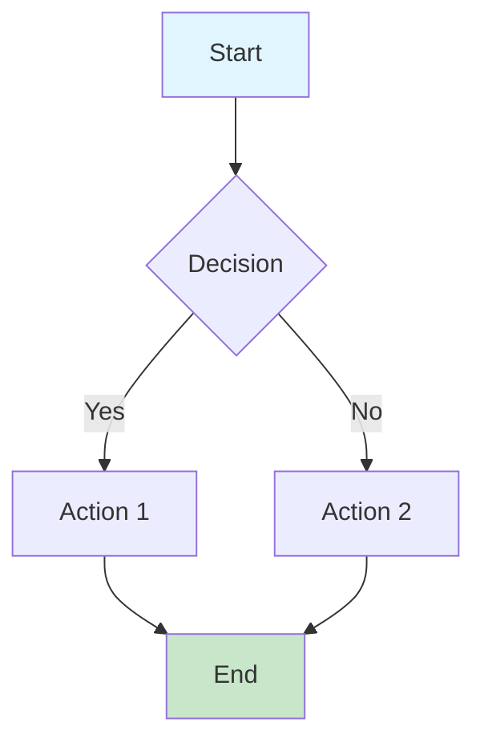
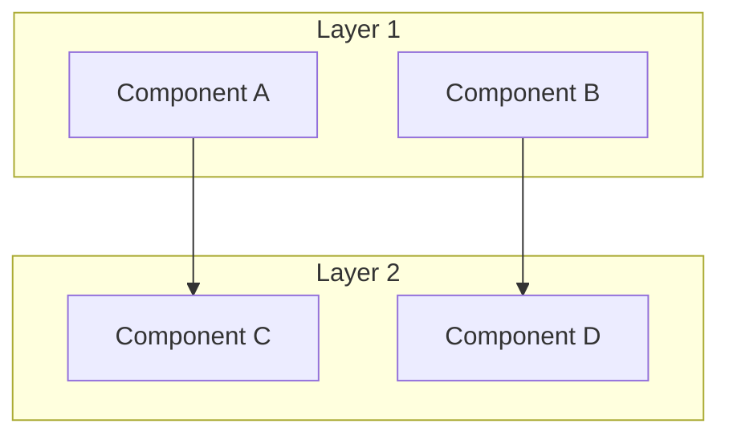

# Document Title

> **Status**: 🟢 Stable / 🟡 Draft / 🔮 Preview | **Risk Level**: Low/Medium/High | **Last Updated**: 2026-04

[](../path/to/chinese/version.md) [](./TEMPLATE.md)

[](../../)
[](../../AGENTS.md)

> **Document Position**: [Struct/Knowledge/Flink]/[Subcategory] | **Prerequisites**: [List prerequisites] | **Formality Level**: L[1-6]

Brief introduction to the topic. Explain what this document covers and why it matters.

---

## Table of Contents

- [Document Title](#document-title)
  - [Table of Contents](#table-of-contents)
  - [1. Definitions](#1-definitions)
    - [Def-X-XX-01: \[Concept Name\]](#def-x-xx-01-concept-name)
    - [Def-X-XX-02: \[Another Concept\]](#def-x-xx-02-another-concept)
  - [2. Properties](#2-properties)
    - [Lemma-X-XX-01: \[Property Name\]](#lemma-x-xx-01-property-name)
    - [Prop-X-XX-01: \[Proposition Name\]](#prop-x-xx-01-proposition-name)
  - [3. Relations](#3-relations)
    - [Relation 1: \[Concept A\] to \[Concept B\]](#relation-1-concept-a-to-concept-b)
    - [Relation 2: \[Another Relationship\]](#relation-2-another-relationship)
  - [4. Argumentation](#4-argumentation)
    - [4.1 \[Topic of Argumentation\]](#41-topic-of-argumentation)
    - [4.2 \[Another Topic\]](#42-another-topic)
  - [5. Proof / Engineering Argument](#5-proof--engineering-argument)
    - [Thm-X-XX-01: \[Theorem Name\]](#thm-x-xx-01-theorem-name)
    - [Engineering Argument: \[Engineering Decision\]](#engineering-argument-engineering-decision)
  - [6. Examples](#6-examples)
    - [Example 1: \[Simple Example\]](#example-1-simple-example)
    - [Example 2: \[Real-World Scenario\]](#example-2-real-world-scenario)
  - [7. Visualizations](#7-visualizations)
    - [Figure 1: \[Diagram Title\]](#figure-1-diagram-title)
    - [Figure 2: \[Another Diagram\]](#figure-2-another-diagram)
  - [8. References](#8-references)
    - [Recommended Reading](#recommended-reading)
  - [Cross-References](#cross-references)
  - [Document Metadata](#document-metadata)

---

## 1. Definitions

### Def-X-XX-01: [Concept Name]

**Definition**: Formal mathematical or technical definition of the concept.

**Formal Representation**:

```
Mathematical notation or formal syntax
```

**Intuitive Explanation**: Provide a clear, accessible explanation for practitioners.

**Key Components**:

| Component | Symbol | Description |
|-----------|--------|-------------|
| Component 1 | $A$ | Description of component 1 |
| Component 2 | $B$ | Description of component 2 |

### Def-X-XX-02: [Another Concept]

[Continue with additional definitions as needed...]

---

## 2. Properties

### Lemma-X-XX-01: [Property Name]

**Statement**: Clear statement of the lemma or property.

**Proof Sketch**: Brief outline of the proof approach.

**Implications**: Why this property matters in practice.

### Prop-X-XX-01: [Proposition Name]

**Statement**: Clear statement of the proposition.

**Justification**: Supporting reasoning.

---

## 3. Relations

### Relation 1: [Concept A] to [Concept B]

Describe how these concepts relate to each other.

```
[Concept A] --(relationship type)--> [Concept B]
```

**Mapping Table**:

| Concept A | Concept B | Relationship |
|-----------|-----------|--------------|
| Element A1 | Element B1 | Maps to |
| Element A2 | Element B2 | Equivalent to |

### Relation 2: [Another Relationship]

[Continue with additional relations...]

---

## 4. Argumentation

### 4.1 [Topic of Argumentation]

Present the reasoning process, including:

- Auxiliary theorems or lemmas
- Counterexample analysis
- Boundary condition discussions
- Constructive explanations

### 4.2 [Another Topic]

[Continue with additional argumentation...]

---

## 5. Proof / Engineering Argument

### Thm-X-XX-01: [Theorem Name]

**Theorem Statement**: Formal statement of the theorem.

**Proof**:

**Base Case**: [Proof for base case]

**Inductive Step**: [Inductive reasoning]

**Conclusion**: ∎

### Engineering Argument: [Engineering Decision]

**Decision**: What design choice was made?

**Context**: What constraints and requirements influenced this decision?

**Alternatives Considered**: What other options were evaluated?

**Justification**: Why was this option selected?

**Trade-offs**: What are the benefits and drawbacks?

---

## 6. Examples

### Example 1: [Simple Example]

**Scenario**: Describe the example scenario.

**Code**:

```java
// Example code snippet
StreamExecutionEnvironment env =
    StreamExecutionEnvironment.getExecutionEnvironment();

// Configuration
env.enableCheckpointing(60000);
```

**Explanation**: Walk through what the example demonstrates.

### Example 2: [Real-World Scenario]

**Context**: Production scenario or complex use case.

**Implementation**: More complex code or configuration.

**Results**: Expected outcomes and behaviors.

---

## 7. Visualizations

### Figure 1: [Diagram Title]

Brief explanation of what the diagram illustrates.



### Figure 2: [Another Diagram]



---

## 8. References


### Recommended Reading

| Resource | Type | Description |
|----------|------|-------------|
| [Link to related doc] | Document | Brief description |
| `https://example.com` | External | Brief description |

---

## Cross-References

- **Previous**: [Link to prerequisite document]
- **Next**: [Link to follow-up document]
- **Related**: [Link to related document]

---

## Document Metadata

- **Author**: [Name or Team]
- **Reviewers**: [Names]
- **Formality Level**: L[1-6]
- **Prerequisites**: [List prerequisite documents]
- **Target Audience**: [Engineers/Researchers/Architects]
- **Document Template Version**: v1.0

---

> **Document Standard**: This document follows the [AGENTS.md] six-section template.
>
> **Theorem Numbering**: Uses `{Type}-{Stage}-{DocNum}-{SeqNum}` format (e.g., `Thm-S-01-01`)
>
> **Last Updated**: 2026-04-12 | **Version**: v1.0
