> **Status**: 🔮 Forward-looking Content | **Risk Level**: High | **Last Updated**: 2026-04
>
> Content described in this document is in early planning stages and may differ from final implementation. Please refer to official Apache Flink releases for authoritative information.
>
# Stream Computing System Troubleshooting Manual

> **Applicable Version**: v2.8+ | **Scope**: Flink/Dataflow Stream Computing Systems | **Updated**: 2026-04-14

## Quick Navigation

```
┌───────────────────────────────────────────────────────────────────────────────┐
│                      Problem Category Quick Reference Index                   │
├─────────────────┬─────────────────┬─────────────────┬─────────────────────────┤
│ 🔥 Performance │  ⚖️ Consistency │  💾 Checkpoint │    🔧 Resource Issues   │
├─────────────────┼─────────────────┼─────────────────┼─────────────────────────┤
│ • High Latency  │ • Data Loss     │ • Timeout       │ • OOM                   │
│   (P-01)        │   (C-01)        │   (K-01)        │   (R-01)                │
│ • Low Throughput│ • Data Duplic.  │ • Failure       │ • Frequent GC           │
│   (P-02)        │   (C-02)        │   (K-02)        │   (R-02)                │
│ • Severe Backp. │ • Out-of-Order  │ • Large State   │ • Disk Full             │
│   (P-03)        │   (C-03)        │   (K-03)        │   (R-03)                │
│ • Data Skew     │ • Late Data     │ • Recovery Fail │ • Network Issues        │
│   (P-04)        │   (C-04)        │   (K-04)        │   (R-04)                │
└─────────────────┴─────────────────┴─────────────────┴─────────────────────────┘
```

---

## 1. Problem Diagnosis Process

### 1.1 Problem Tree Decision Diagram

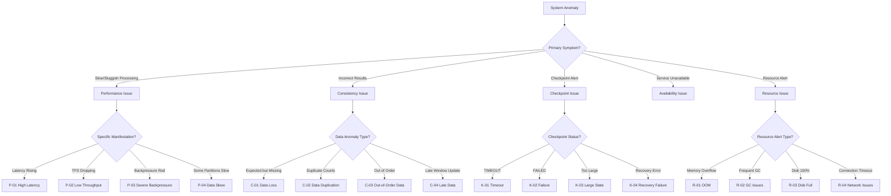

### 1.2 Diagnostic Checklist

| Check Item | Command/Method | Normal Range | Anomaly Indicator |
|------------|----------------|--------------|-------------------|
| CPU Usage | Flink UI / Metrics | < 70% | > 80% sustained |
| Memory Usage | JVM Metrics | < 80% Heap | > 90% Heap |
| GC Frequency | GC log analysis | < 1/min | > 5/min |
| Checkpoint Duration | Flink UI Checkpoints | < 1 min | > timeout |
| Backpressure Status | Flink UI Backpressure | OK/LOW | HIGH |
| Network Latency | ping/netstat | < 10ms | > 100ms |
| Disk I/O | iostat | < 80% util | 100% util |
| Data Latency | Watermark lag | < window size | > 2x window |

---

## 2. Performance Issue Troubleshooting

### P-01: High Latency

#### Symptom Identification

| Symptom | Detection Location | Severity |
|---------|-------------------|----------|
| End-to-end latency continuously rising | Flink UI Metrics: `latency` | 🔴 High |
| Watermark lag increasing | Flink UI Watermarks | 🔴 High |
| Window trigger delay | Business output monitoring | 🟡 Medium |
| Downstream consumer timeout | Downstream system logs | 🔴 High |

#### Root Cause Analysis

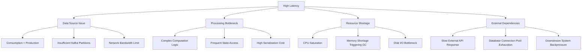

#### Solutions

| Priority | Solution | Implementation Steps | Expected Effect |
|----------|----------|---------------------|-----------------|
| 1 | Increase Parallelism | `setParallelism(n)` | Linear throughput improvement |
| 2 | Optimize Serialization | Switch to Avro/Protobuf | Reduce serialization time by 30-50% |
| 3 | Pre-aggregation Optimization | Use MapState local aggregation | Reduce state access frequency |
| 4 | Async I/O | Refactor with `AsyncFunction` | Eliminate blocking waits |
| 5 | Adjust Buffer | `taskmanager.memory.network.fraction` | Reduce backpressure propagation |

#### Preventive Measures

```yaml
# flink-conf.yaml recommended configuration
# 1. Network buffer configuration
taskmanager.memory.network.fraction: 0.2
taskmanager.memory.network.min: 2gb
taskmanager.memory.network.max: 8gb

# 2. Checkpoint interval (balance latency and recovery)
execution.checkpointing.interval: 30s
execution.checkpointing.min-pause-between-checkpoints: 30s

# 3. Backpressure sampling frequency
web.backpressure.refresh-interval: 60000
```

---

### P-02: Low Throughput

#### Symptom Identification

| Symptom | Detection Metric | Threshold |
|---------|-----------------|-----------|
| TPS below expected | `numRecordsInPerSecond` | < 80% of target |
| Low CPU utilization | Task CPU Usage | < 50% |
| Network bandwidth not saturated | Network IO | < 60% |
| High disk I/O wait | `iowait` | > 30% |

#### Root Cause Analysis

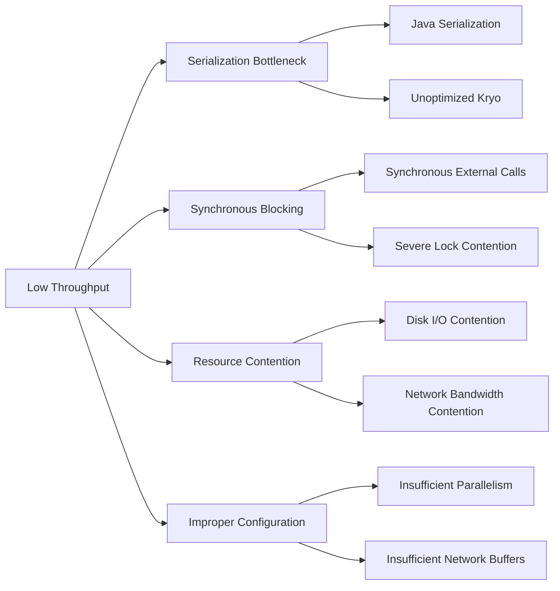

#### Solutions

| Problem Type | Diagnostic Method | Solution | Verification Metric |
|--------------|-------------------|----------|---------------------|
| Serialization Bottleneck | CPU flame graph analysis | Register Kryo serializers | Serialization time decreases |
| Synchronous Blocking | Thread dump analysis | Async I/O refactoring | Thread blocking reduced |
| GC Impact | GC log analysis | Adjust heap memory/G1GC | GC time < 5% |
| Disk Bottleneck | iostat monitoring | SSD replacement/RocksDB tuning | I/O wait decreases |
| Network Bottleneck | iftop monitoring | Compression/batch sending | Network utilization improves |

#### Code-level Optimization Example

```java
// ❌ Inefficient: synchronous external call

import org.apache.flink.streaming.api.datastream.DataStream;

public class SyncFunction extends RichMapFunction<String, Result> {
    @Override
    public Result map(String value) {
        return externalService.call(value); // blocking!
    }
}

// ✅ Efficient: asynchronous external call
public class AsyncExternalCall extends AsyncFunction<String, Result> {
    @Override
    public void asyncInvoke(String input, ResultFuture<Result> resultFuture) {
        CompletableFuture.supplyAsync(() -> externalService.call(input))
            .thenAccept(result -> resultFuture.complete(Collections.singleton(result)));
    }
}

// Usage
DataStream<Result> result = AsyncDataStream.unorderedWait(
    inputStream,
    new AsyncExternalCall(),
    1000, // timeout
    TimeUnit.MILLISECONDS,
    100   // concurrent requests
);
```

---

### P-03: Severe Backpressure

#### Symptom Identification

| Symptom | UI Manifestation | Impact |
|---------|-----------------|--------|
| Backpressure status HIGH | Flink UI shows red backpressure | Upstream slowdown, latency increase |
| Output buffer full | `outPoolUsage=100%` | Data accumulation |
| Backpressure cascading | Multiple operators backpressured | End-to-end latency |

#### Root Cause Localization Process

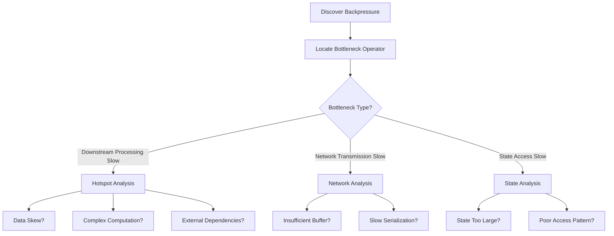

#### Solution Matrix

| Bottleneck Position | Diagnostic Method | Quick Relief | Root Cause Fix |
|---------------------|-------------------|--------------|----------------|
| Sink End | Check last operator | Increase Sink parallelism | Batch write optimization |
| Aggregation Operator | Check Window state | Increase window pre-aggregation | Two-phase aggregation |
| Join Operator | Check Join state | Increase cache size | Optimize join strategy |
| Network Layer | Buffer usage rate | Increase network buffers | Optimize serialization |

#### Backpressure Mitigation Configuration

```java

// [伪代码片段 - 不可直接运行] 仅展示核心逻辑
import org.apache.flink.streaming.api.datastream.DataStream;
import org.apache.flink.streaming.api.windowing.time.Time;

// Code-level optimization
env.setBufferTimeout(100); // Reduce buffer wait time

// Operator chain optimization (avoid unnecessary serialization)
DataStream<Result> result = input
    .map(new FastMapper())     // chained
    .filter(new FastFilter())  // chained
    .keyBy(KeySelector)        // break chain (needs shuffle)
    .window(TumblingEventTimeWindows.of(Time.minutes(1)))
    .aggregate(new OptimizedAggregate()); // chained

// Disable operator chaining (debug only, use with caution in production)
// env.disableOperatorChaining();
```

---

### P-04: Data Skew

#### Symptom Identification

| Symptom | Detection Method | Criterion |
|---------|-----------------|-----------|
| Some subtasks processing slowly | Flink UI Subtask comparison | Slowest/fastest > 3x |
| Certain keys accumulating | Key distribution monitoring | Hot key ratio > 50% |
| Individual Task Heap high | Task memory monitoring | Difference > 2x |

#### Skew Type Analysis

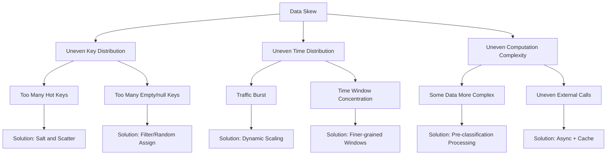

#### Solution Details

| Skew Type | Solution | Implementation | Applicable Scenario |
|-----------|----------|----------------|---------------------|
| Key Hotspot | Salt and Scatter | `key + random(0, N)` | Aggregation operations |
| Key Hotspot | Two-phase Aggregation | Local agg + Global agg | Sum/Count operations |
| Key Hotspot | Custom Partitioner | Implement Partitioner | Specific business logic |
| Time Burst | Dynamic Window | SessionWindow + Gap | Event-type data |
| Time Burst | Traffic Shaping | Buffer queue | Acceptable latency |

#### Two-phase Aggregation Code Example

```java

// [伪代码片段 - 不可直接运行] 仅展示核心逻辑
import org.apache.flink.streaming.api.datastream.DataStream;
import org.apache.flink.api.common.functions.AggregateFunction;
import org.apache.flink.streaming.api.windowing.time.Time;

// Phase 1: Salted local aggregation
DataStream<LocalAgg> localAgg = source
    .map(new RichMapFunction<Event, Event>() {
        private int salt;
        @Override
        public void open(Configuration parameters) {
            salt = getRuntimeContext().getIndexOfThisSubtask();
        }
        @Override
        public Event map(Event value) {
            // Salt: original key + salt
            value.setSaltedKey(value.getKey() + "_" + (value.getKey().hashCode() % 10));
            return value;
        }
    })
    .keyBy(Event::getSaltedKey)
    .window(TumblingEventTimeWindows.of(Time.seconds(10)))
    .aggregate(new LocalAggregateFunction());

// Phase 2: Desalted global aggregation
DataStream<Result> globalAgg = localAgg
    .map(e -> { e.setOriginalKey(e.getSaltedKey().split("_")[0]); return e; })
    .keyBy(LocalAgg::getOriginalKey)
    .window(TumblingEventTimeWindows.of(Time.seconds(10)))
    .aggregate(new GlobalAggregateFunction());
```

---

## 3. Consistency Issue Troubleshooting

### C-01: Data Loss

#### Symptom Identification

| Symptom | Verification Method | Severity |
|---------|--------------------|----------|
| Input/output count mismatch | Source Counter vs Sink Counter | 🔴 Critical |
| Business data missing | End-to-end reconciliation | 🔴 Critical |
| Missing window results | Expected window has no output | 🟡 Medium |

#### Data Loss Cause Analysis Tree

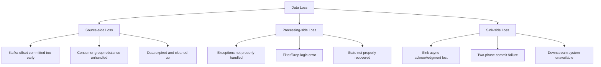

#### Diagnosis and Resolution

| Loss Position | Diagnostic Method | Root Cause | Solution |
|---------------|-------------------|------------|----------|
| Source | Compare Kafka offset | At-Most-Once config | Enable Checkpoint |
| Transformation | Exception logs | Exception swallowed | Try-Catch + Side Output |
| Sink | Downstream reconciliation | At-Least-Once config | Enable Exactly-Once |
| State Recovery | Historical Checkpoint comparison | State incompatibility | State migration strategy |

#### Anti-Data-Loss Configuration Checklist

```yaml
# 1. Checkpoint configuration (must enable)
execution.checkpointing.mode: EXACTLY_ONCE
execution.checkpointing.interval: 30s
execution.checkpointing.min-pause-between-checkpoints: 30s
execution.checkpointing.max-concurrent-checkpoints: 1
execution.checkpointing.externalized-checkpoint-retention: RETAIN_ON_CANCELLATION

# 2. State Backend configuration
state.backend: rocksdb
state.backend.incremental: true
state.checkpoint-storage: filesystem
state.checkpoints.dir: hdfs://namenode:8020/flink-checkpoints

# 3. Restart strategy (ensure failure restart)
restart-strategy: fixed-delay
restart-strategy.fixed-delay.attempts: 10
restart-strategy.fixed-delay.delay: 10s

# 4. Kafka Source configuration (Exactly-Once)
properties.group.id: flink-consumer-group
properties.isolation.level: read_committed
scan.startup.mode: group-offsets
```

---

### C-02: Data Duplication

#### Symptom Identification

| Symptom | Detection Method | Common Scenario |
|---------|-----------------|-----------------|
| Count results too high | Idempotency check failure | At-Least-Once mode |
| Duplicate event IDs | Unique constraint violation | After failure recovery |
| Duplicate window outputs | Downstream deduplication failure | After Checkpoint failure |

#### Duplication Generation Mechanism

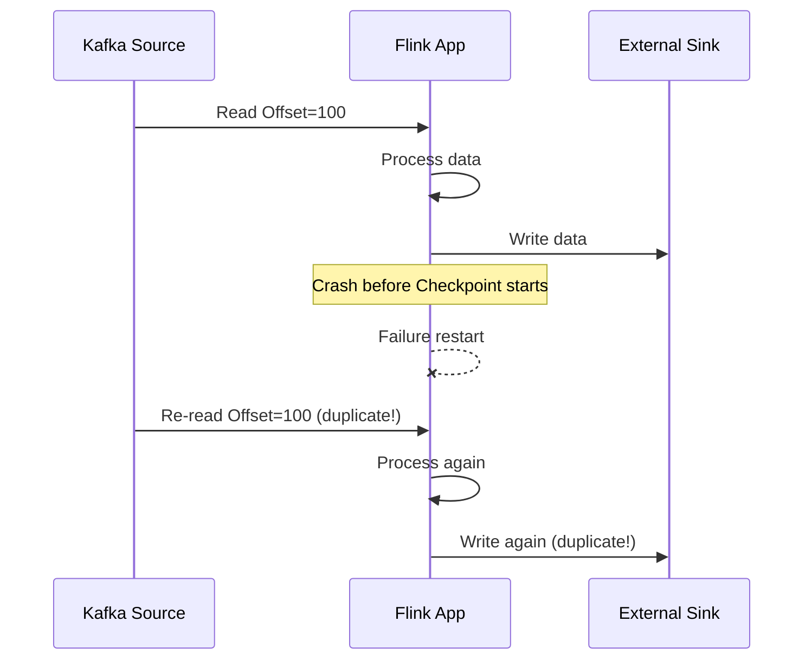

#### Deduplication Strategy Matrix

| Strategy | Implementation Complexity | Performance Impact | Applicable Scenario |
|----------|--------------------------|--------------------|---------------------|
| Idempotent Sink | Low | None | Systems supporting idempotent writes |
| Transactional Sink | Medium | Low | Systems supporting transactions |
| Event-time Deduplication | Medium | Medium | Acceptable latency allowed |
| Bloom Filter | Low | Low | Sufficient memory available |
| External Storage Deduplication | High | High | Strong consistency required |

#### Implementation Examples

```java
// Option 1: Idempotent Sink (recommended)

import org.apache.flink.api.common.state.ValueState;
import org.apache.flink.api.common.state.ValueStateDescriptor;
import org.apache.flink.api.common.typeinfo.Types;
import org.apache.flink.streaming.api.windowing.time.Time;

public class IdempotentSink extends RichSinkFunction<Event> {
    private transient RedisClient redis;

    @Override
    public void invoke(Event value, Context context) {
        String dedupKey = value.getEventId();
        // Use SETNX for idempotency
        Boolean success = redis.setnx(dedupKey, "1", Duration.ofHours(24));
        if (success) {
            // Actual write
            writeToDatabase(value);
        }
    }
}

// Option 2: Event-time Deduplication (state-based)
public class DeduplicateFunction extends KeyedProcessFunction<String, Event, Event> {
    private ValueState<Long> lastEventTimeState;

    @Override
    public void open(Configuration parameters) {
        StateTtlConfig ttlConfig = StateTtlConfig
            .newBuilder(Time.hours(24))
            .setUpdateType(StateTtlConfig.UpdateType.OnCreateAndWrite)
            .setStateVisibility(StateTtlConfig.StateVisibility.NeverReturnExpired)
            .build();

        ValueStateDescriptor<Long> descriptor = new ValueStateDescriptor<>("lastEventTime", Types.LONG);
        descriptor.enableTimeToLive(ttlConfig);
        lastEventTimeState = getRuntimeContext().getState(descriptor);
    }

    @Override
    public void processElement(Event value, Context ctx, Collector<Event> out) throws Exception {
        Long lastTime = lastEventTimeState.value();
        long currentTime = value.getEventTime();

        // Only process newer data
        if (lastTime == null || currentTime > lastTime) {
            lastEventTimeState.update(currentTime);
            out.collect(value);
        }
    }
}
```

---

### C-03: Out-of-Order Data

#### Symptom Identification

| Symptom | Detection Method | Business Impact |
|---------|-----------------|-----------------|
| Window triggers too early | Watermark monitoring | Incomplete aggregation |
| Time sequence disorder | Business order validation | Incorrect analysis results |
| State computation anomaly | State value jumps | Incorrect cumulative results |

#### Out-of-Order Processing Mechanism

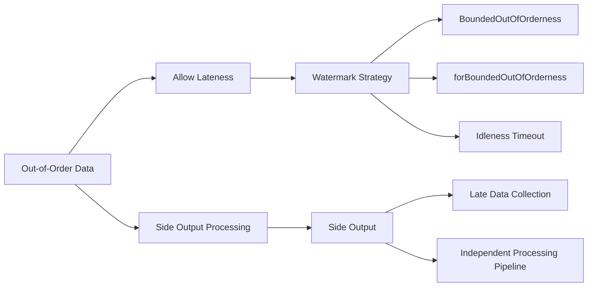

#### Solutions

| Solution | Configuration Parameter | Applicable Latency | Notes |
|----------|------------------------|--------------------|-------|
| Bounded Lateness | `forBoundedOutOfOrderness(delay)` | < minute-level | Trade-off between latency and timeliness |
| Processing Time | `assignAscendingTimestamps()` | None | For testing only |
| Side Output | `output(Tag, stream)` | Any | Requires additional processing logic |
| Incremental Window | `allowedLateness()` | Within window period | Increased memory consumption |

#### Complete Watermark Configuration

```java

// [伪代码片段 - 不可直接运行] 仅展示核心逻辑
import org.apache.flink.streaming.api.datastream.DataStream;
import org.apache.flink.api.common.eventtime.WatermarkStrategy;
import org.apache.flink.api.common.functions.AggregateFunction;
import org.apache.flink.streaming.api.windowing.time.Time;

// Reasonable Watermark strategy
WatermarkStrategy<Event> strategy = WatermarkStrategy
    .<Event>forBoundedOutOfOrderness(Duration.ofSeconds(30))  // Max out-of-order delay
    .withIdleness(Duration.ofMinutes(5))                       // Idleness detection
    .withTimestampAssigner((event, timestamp) -> event.getEventTime());

DataStream<Event> withTimestamps = stream.assignTimestampsAndWatermarks(strategy);

// Window configuration (allow late data)
OutputTag<Event> lateDataTag = new OutputTag<Event>("late-data"){};

SingleOutputStreamOperator<Result> result = withTimestamps
    .keyBy(Event::getKey)
    .window(TumblingEventTimeWindows.of(Time.minutes(1)))
    .allowedLateness(Time.minutes(10))      // Allow 10 minutes lateness
    .sideOutputLateData(lateDataTag)        // Excess goes to side output
    .aggregate(new MyAggregateFunction());

// Process late data
DataStream<Event> lateData = result.getSideOutput(lateDataTag);
lateData.addSink(new LateDataHandler());
```

---

### C-04: Late Data

#### Symptom Identification

| Symptom | Detection Method | Root Cause |
|---------|-----------------|------------|
| Window results updated later | Downstream data version comparison | Late data triggers window recalculation |
| Slow Watermark advancement | `currentOutputWatermark` | Some partitions have no data |
| Continuous state growth | State Size monitoring | Late data buffer accumulation |

#### Late Data Processing Strategy

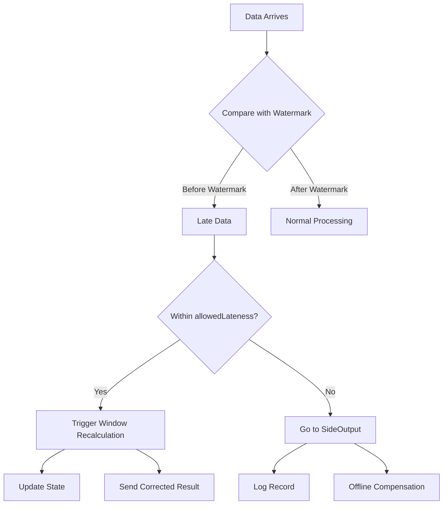

#### Production Environment Recommended Configuration

```java
// Late data handling complete example

import org.apache.flink.streaming.api.environment.StreamExecutionEnvironment;
import org.apache.flink.streaming.api.datastream.DataStream;
import org.apache.flink.streaming.api.windowing.time.Time;

public class LateDataHandlingJob {

    public static void main(String[] args) throws Exception {
        StreamExecutionEnvironment env = StreamExecutionEnvironment.getExecutionEnvironment();

        // Side output tag
        final OutputTag<Event> lateDataOutputTag = new OutputTag<Event>("LATE_DATA"){};

        DataStream<Event> source = env
            .fromSource(kafkaSource,
                WatermarkStrategy
                    .<Event>forBoundedOutOfOrderness(Duration.ofMinutes(1))
                    .withTimestampAssigner((e, ts) -> e.getTimestamp()),
                "Kafka Source");

        SingleOutputStreamOperator<WindowResult> windowed = source
            .keyBy(Event::getUserId)
            .window(TumblingEventTimeWindows.of(Time.minutes(5)))
            .allowedLateness(Time.minutes(10))      // Allow 10 minutes lateness
            .sideOutputLateData(lateDataOutputTag)  // Excess goes to side output
            .process(new ProcessWindowFunction<Event, WindowResult, String, TimeWindow>() {
                @Override
                public void process(String key, Context context,
                        Iterable<Event> elements, Collector<WindowResult> out) {
                    // Window computation logic
                    WindowResult result = compute(elements);
                    result.setWindowStart(context.window().getStart());
                    result.setIsUpdate(context.window().maxTimestamp() <
                        context.currentWatermark()); // Mark if update
                    out.collect(result);
                }
            });

        // Main output: normal window results
        windowed.addSink(new MainResultSink());

        // Side output: late data
        windowed.getSideOutput(lateDataOutputTag)
            .addSink(new LateDataMetricsSink());  // Monitor late data volume

        // Correction stream: for downstream updates
        windowed.filter(r -> r.isUpdate())
            .addSink(new CorrectionSink());

        env.execute();
    }
}
```

---

## 4. Checkpoint Issue Troubleshooting

### K-01: Checkpoint Timeout

#### Symptom Identification

| Symptom | Detection Location | Threshold |
|---------|-------------------|-----------|
| Checkpoint duration continuously increasing | Flink UI Checkpoints | > configured timeout |
| Checkpoint status TIMEOUT | Flink UI | Multiple consecutive times |
| TaskManager logs show TimeoutException | TaskManager logs | - |

#### Timeout Cause Analysis

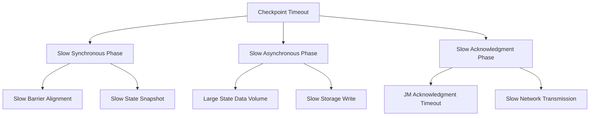

#### Solutions

| Phase | Problem | Solution | Configuration Parameter |
|-------|---------|----------|------------------------|
| Synchronous | Slow barrier alignment | Enable Unaligned Checkpoint | `execution.checkpointing.unaligned: true` |
| Synchronous | Slow sync snapshot | Reduce sync snapshot state | Use incremental Checkpoint |
| Asynchronous | Large state | State compression | `state.backend.rocksdb.compression: SNAPPY` |
| Asynchronous | Slow write | Improve storage performance | Use SSD/HDFS |
| Acknowledgment | JM pressure | Increase JM resources | `jobmanager.memory.process.size` |

#### Unaligned Checkpoint Configuration

```yaml
# Unaligned Checkpoint (solves timeout under backpressure)
execution.checkpointing.unaligned: true
execution.checkpointing.unaligned.max-subtasks-per-channel-state-file: 5
execution.checkpointing.max-aligned-checkpoint-size: 1mb

# Note: Unaligned Checkpoint increases memory and network overhead
# Suitable for severe backpressure with small state
```

---

### K-02: Checkpoint Failure

#### Symptom Identification

| Symptom | Detection Method | Common Errors |
|---------|-----------------|---------------|
| Checkpoint status FAILED | Flink UI | Write failure/timeout |
| Exception logs | JM/TM logs | IOException/TimeoutException |
| Checkpoint count drops sharply | Metrics monitoring | Failure rate > 10% |

#### Failure Cause Classification

| Error Type | Typical Exception | Solution |
|------------|-------------------|----------|
| Storage failure | `HdfsSnapshotFailure` | Check HDFS permissions/space |
| Network failure | `ConnectTimeoutException` | Check network connectivity |
| Memory failure | `OutOfMemoryError` | Increase TM memory |
| State corruption | `StateMigrationException` | Check state compatibility |

#### Failure Recovery Process

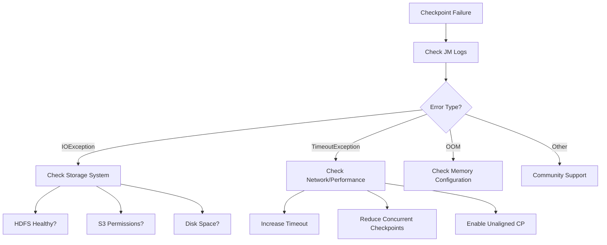

---

### K-03: Large State

#### Symptom Identification

| Symptom | Detection Metric | Recommended Threshold |
|---------|-----------------|----------------------|
| Large checkpoint volume | Checkpointed Data Size | > 10GB |
| Long checkpoint time | Checkpoint Duration | > 5 minutes |
| High TM memory pressure | Heap/RocksDB memory | > 80% |
| Long recovery time | Restore Time | > Checkpoint duration |

#### State Optimization Strategies

| Strategy | Implementation | Effect |
|----------|---------------|--------|
| State TTL | `StateTtlConfig` | Automatically clean expired data |
| Incremental Checkpoint | `state.backend.incremental: true` | Only transfer changed data |
| State Compression | RocksDB compression config | Reduce storage volume |
| Local Recovery | `state.backend.local-recovery: true` | Accelerate failure recovery |
| State Sharding | Custom KeyGroup | Parallel recovery |

#### RocksDB Tuning Configuration

```yaml
# RocksDB state backend optimization
state.backend: rocksdb
state.backend.incremental: true
state.backend.local-recovery: true

# RocksDB memory tuning
state.backend.rocksdb.memory.managed: true
state.backend.rocksdb.memory.fixed-per-slot: 256mb
state.backend.rocksdb.memory.high-prio-pool-ratio: 0.1

# RocksDB thread tuning
state.backend.rocksdb.threads.threads-number: 4

# Compression configuration
state.backend.rocksdb.compression: SNAPPY
state.backend.rocksdb.compression-per-level: [NONE, NONE, SNAPPY, SNAPPY]
```

#### State Monitoring Metrics

```java
// Custom state size monitoring
public class MonitoredFunction extends RichFlatMapFunction<String, Result> {
    private transient ListState<MyState> state;
    private transient Histogram stateSizeHistogram;

    @Override
    public void open(Configuration parameters) {
        state = getRuntimeContext().getListState(new ListStateDescriptor<>("my-state", MyState.class));
        stateSizeHistogram = getRuntimeContext()
            .getMetricGroup()
            .histogram("stateSize", new DropwizardHistogramWrapper(
                new com.codahale.metrics.Histogram(new SlidingWindowReservoir(500))));
    }

    @Override
    public void flatMap(String value, Collector<Result> out) throws Exception {
        // Periodically estimate state size
        Iterable<MyState> states = state.get();
        int count = 0;
        for (MyState s : states) {
            count++;
        }
        stateSizeHistogram.update(count);
    }
}
```

---

### K-04: Recovery Failure

#### Symptom Identification

| Symptom | Detection Location | Impact |
|---------|-------------------|--------|
| Job cannot recover from Checkpoint | JM logs | Requires reprocessing historical data |
| State Migration Exception | Startup logs | State incompatibility |
| ClassNotFoundException | Recovery logs | Class version inconsistency |

#### Recovery Failure Types

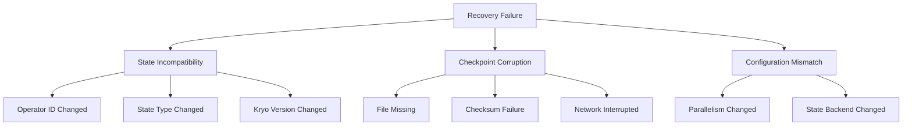

#### Recovery Strategies

| Scenario | Solution | Command/Configuration |
|----------|----------|----------------------|
| Operator structure change | Specify UID | `.uid("unique-id")` |
| Version upgrade | State Migration | Implement `StateMigration` interface |
| Checkpoint corruption | Use earlier Checkpoint | `-s hdfs://path/to/earlier-checkpoint` |
| Parallelism change | Redistribute | Use `--allowNonRestoredState` |

---

## 5. Resource Issue Troubleshooting

### R-01: OOM (Out of Memory)

#### Symptom Identification

| Symptom | Detection Location | Error Message |
|---------|-------------------|---------------|
| JVM OOM | TaskManager logs | `java.lang.OutOfMemoryError: Java heap space` |
| Direct memory OOM | Logs | `OutOfMemoryError: Direct buffer memory` |
| Metaspace OOM | Logs | `OutOfMemoryError: Metaspace` |
| Container killed | K8s events | `OOMKilled` |

#### OOM Type Analysis

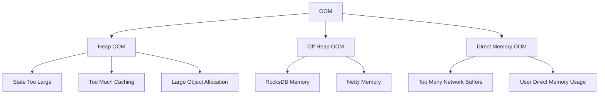

#### OOM Solution Matrix

| OOM Type | Quick Relief | Root Cause Fix | Configuration Parameter |
|----------|--------------|----------------|------------------------|
| Heap OOM | Increase Heap memory | Optimize state usage | `taskmanager.memory.task.heap.size` |
| Off-Heap OOM | Increase Off-Heap memory | Reduce RocksDB memory | `taskmanager.memory.task.off-heap.size` |
| Direct OOM | Increase direct memory | Optimize network buffers | `taskmanager.memory.network.max` |
| Metaspace OOM | Increase Metaspace | Reduce dynamic class loading | `taskmanager.memory.jvm-metaspace.size` |

#### Memory Configuration Template

```yaml
# TaskManager memory configuration
# (Total memory = Framework memory + Task memory + Network memory + JVM overhead)
taskmanager.memory.process.size: 8gb

# Task heap memory (user code + state)
taskmanager.memory.task.heap.size: 2gb

# Task Off-Heap memory (RocksDB, etc.)
taskmanager.memory.task.off-heap.size: 2gb

# Network memory (data transfer buffers)
taskmanager.memory.network.min: 1gb
taskmanager.memory.network.max: 2gb

# JVM Metaspace
taskmanager.memory.jvm-metaspace.size: 512mb

# JVM overhead (stack space, direct memory, etc.)
taskmanager.memory.jvm-overhead.min: 1gb
taskmanager.memory.jvm-overhead.max: 2gb
```

---

### R-02: Frequent GC

#### Symptom Identification

| Symptom | Detection Method | Threshold |
|---------|-----------------|-----------|
| High GC time ratio | GC logs | > 10% |
| Frequent Full GC | GC logs | > 1/min |
| Long GC pauses | GC logs | > 5s |
| Throughput degradation | Business metrics | Significant decline |

#### GC Optimization Strategies

| GC Algorithm | Applicable Scenario | Configuration | Notes |
|--------------|--------------------|---------------|-------|
| G1GC | Large heap (>4GB) | `-XX:+UseG1GC` | Default recommendation |
| ZGC | Ultra-low latency requirements | `-XX:+UseZGC` | JDK 11+ |
| Shenandoah | Low latency requirements | `-XX:+UseShenandoahGC` | JDK 12+ |
| ParallelGC | Throughput priority | `-XX:+UseParallelGC` | Batch processing scenarios |

#### G1GC Recommended Configuration

```yaml
# flink-conf.yaml
env.java.opts.taskmanager: >
  -XX:+UseG1GC
  -XX:MaxGCPauseMillis=100
  -XX:+UnlockExperimentalVMOptions
  -XX:+UseCGroupMemoryLimitForHeap
  -XX:+ParallelRefProcEnabled
  -XX:InitiatingHeapOccupancyPercent=35
  -XX:G1HeapRegionSize=16m
  -XX:G1ReservePercent=15
  -XX:+DisableExplicitGC
  -XX:+HeapDumpOnOutOfMemoryError
  -XX:HeapDumpPath=/var/log/flink/heap-dumps/
  -Xlog:gc*:file=/var/log/flink/gc.log::filecount=10,filesize=10m
```

#### GC Monitoring Metrics

```java
// Custom GC monitoring
public class GCMonitor implements Runnable {
    private final MetricGroup metricGroup;

    @Override
    public void run() {
        List<GarbageCollectorMXBean> gcBeans = ManagementFactory.getGarbageCollectorMXBeans();
        for (GarbageCollectorMXBean gcBean : gcBeans) {
            long count = gcBean.getCollectionCount();
            long time = gcBean.getCollectionTime();

            metricGroup.gauge("gc." + gcBean.getName() + ".count", () -> count);
            metricGroup.gauge("gc." + gcBean.getName() + ".time", () -> time);
        }
    }
}
```

---

### R-03: Disk Full

#### Symptom Identification

| Symptom | Detection Method | Common Location |
|---------|-----------------|-----------------|
| Disk usage 100% | `df -h` | Checkpoint directory |
| Checkpoint failure | Error logs | Write failure |
| RocksDB errors | Logs | SST file creation failure |
| Log write failure | System logs | Log directory full |

#### Disk Usage Analysis

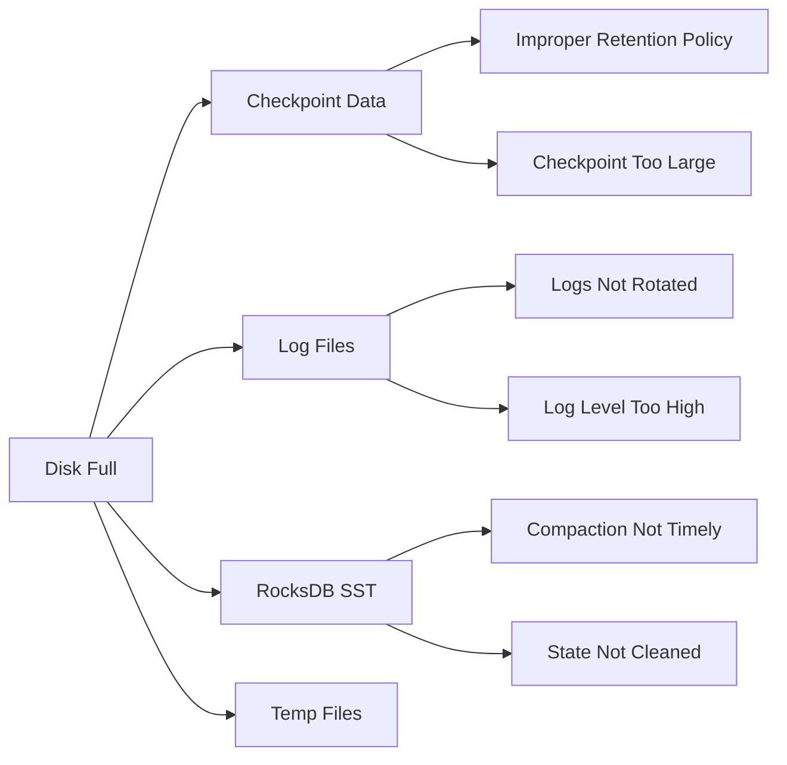

#### Solutions

| Problem | Solution | Configuration/Command |
|---------|----------|----------------------|
| Checkpoint too large | Clean old checkpoints | `execution.checkpointing.max-retained-checkpoints: 10` |
| Logs too large | Configure log rotation | Configure `RollingFileAppender` in `log4j.properties` |
| RocksDB bloat | Configure TTL | `StateTtlConfig` |
| Temp files | Regular cleanup | `cron` job to clean `/tmp` |

#### Log Rotation Configuration

```properties
# log4j.properties
appender.rolling.type = RollingFile
appender.rolling.name = RollingFileAppender
appender.rolling.fileName = ${sys:log.file}
appender.rolling.filePattern = ${sys:log.file}.%i
appender.rolling.layout.type = PatternLayout
appender.rolling.layout.pattern = %d{yyyy-MM-dd HH:mm:ss,SSS} %-5p %-60c %x - %m%n
appender.rolling.policies.type = Policies
appender.rolling.policies.size.type = SizeBasedTriggeringPolicy
appender.rolling.policies.size.size = 500MB
appender.rolling.strategy.type = DefaultRolloverStrategy
appender.rolling.strategy.max = 10
```

---

### R-04: Network Issues

#### Symptom Identification

| Symptom | Detection Method | Error Manifestation |
|---------|-----------------|---------------------|
| Connection timeout | Logs | `ConnectionTimeoutException` |
| Connection reset | Logs | `ConnectionResetException` |
| Network partition | Cluster monitoring | TaskManager disconnect |
| Insufficient bandwidth | Network monitoring | Low transfer rate |

#### Network Issue Diagnosis

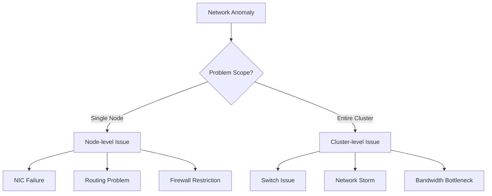

#### Network Optimization Configuration

```yaml
# Flink network configuration
# Network buffers (backpressure control)
taskmanager.memory.network.fraction: 0.15
taskmanager.memory.network.min: 1gb
taskmanager.memory.network.max: 4gb

# Network timeout
akka.ask.timeout: 30s
akka.lookup.timeout: 30s
akka.client.timeout: 60s

# Retry configuration
akka.transport.heartbeat.interval: 10s
akka.transport.heartbeat.pause: 60s
akka.transport.heartbeat.threshold: 12

# Data compression (bandwidth-constrained scenarios)
execution.checkpointing.enable-unnecessary-channels-compression: true
pipeline.compression: LZ4
blob.fetch.backlog: 1000
blob.fetch.num-concurrent: 50
```

---

## 6. Emergency Response Handbook

### 6.1 Emergency Recovery Process

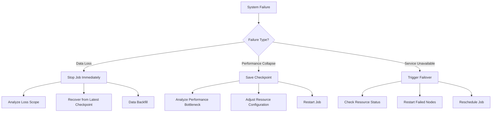

### 6.2 Common Diagnostic Commands

```bash
#!/bin/bash
# Flink fault diagnosis script

echo "=== Flink Cluster Health Check ==="

# 1. Check JobManager
echo "--- JobManager Status ---"
curl -s http://localhost:8081/config | jq .

# 2. Check TaskManager
echo "--- TaskManager List ---"
curl -s http://localhost:8081/taskmanagers | jq '.taskmanagers[] | {id, slotsNumber, freeSlots, cpuCores, physicalMemory}'

# 3. Check running jobs
echo "--- Running Jobs ---"
curl -s http://localhost:8081/jobs | jq '.jobs[] | select(.status == "RUNNING")'

# 4. Check Checkpoint status
echo "--- Checkpoint Status ---"
JOB_ID=$(curl -s http://localhost:8081/jobs | jq -r '.jobs[0].id')
curl -s http://localhost:8081/jobs/${JOB_ID}/checkpoints | jq '{counts: .counts, latest: .latest}'

# 5. Check backpressure
echo "--- Backpressure Status ---"
curl -s http://localhost:8081/jobs/${JOB_ID}/vertices | jq '.vertices[] | {id, name, metrics: .metrics}'

echo "=== Check Complete ==="
```

### 6.3 Quick Fix Checklist

| Problem | Quick Fix | Permanent Fix |
|---------|-----------|---------------|
| Latency Spike | Increase parallelism | Optimize processing logic |
| Checkpoint Failure | Increase timeout | Optimize state/storage |
| OOM | Increase memory | Memory leak investigation |
| Severe Backpressure | Increase buffer | Eliminate bottleneck operator |
| Data Loss | Enable Exactly-Once | End-to-end reconciliation |

---

## 7. Monitoring and Alerting Configuration

### 7.1 Key Metrics Monitoring

```yaml
# Recommended monitoring metrics configuration
metrics:
  # Latency metrics
  - name: flink_jobmanager_job_latency
    threshold: "> 10000"  # 10 seconds
    severity: warning

  - name: flink_taskmanager_job_task_backPressuredTimeMsPerSecond
    threshold: "> 200"    # 20% time backpressured
    severity: critical

  # Checkpoint metrics
  - name: flink_jobmanager_job_numberOfFailedCheckpoints
    threshold: "> 0"
    severity: critical

  - name: flink_jobmanager_job_lastCheckpointDuration
    threshold: "> 60000"  # 60 seconds
    severity: warning

  # Resource metrics
  - name: flink_taskmanager_Status_JVM_Memory_Heap_Used
    threshold: "> 0.8"    # 80% heap memory
    severity: warning

  - name: flink_taskmanager_Status_JVM_GarbageCollector_G1_Young_Generation_Time
    threshold: "> 5000"   # 5 seconds GC time
    severity: critical
```

### 7.2 Log Keyword Monitoring

| Keyword | Level | Meaning | Response Action |
|---------|-------|---------|-----------------|
| `OutOfMemoryError` | CRITICAL | Memory overflow | Scale up/restart immediately |
| `Checkpoint expired` | WARNING | Checkpoint timeout | Adjust configuration |
| `BackPressure` | WARNING | Backpressure warning | Performance optimization |
| `Connection refused` | WARNING | Connection failure | Check network/service |
| `State migration` | INFO | State migration | Monitor recovery progress |

---

## 8. References and Appendix

### 8.1 Flink Version Compatibility

| Flink Version | Recommended JDK | Recommended Scala | State Backend |
|---------------|-----------------|-------------------|---------------|
| 1.17+ | JDK 11/17 | 2.12/2.13 | RocksDB |
| 1.15-1.16 | JDK 11 | 2.12 | RocksDB/Heap |
| 1.13-1.14 | JDK 8/11 | 2.12 | RocksDB |

### 8.2 Related Document Links

- [Flink Official Docs - Tuning Guide](https://nightlies.apache.org/flink/flink-docs-stable/docs/ops/performance/tuning/)
- [Flink Official Docs - Checkpoint Troubleshooting](https://nightlies.apache.org/flink/flink-docs-stable/docs/ops/state/checkpointing_under_backpressure/)
- [RocksDB Tuning Guide](https://github.com/facebook/rocksdb/wiki/RocksDB-Tuning-Guide)

---

## Update History

| Version | Date | Updates | Author |
|---------|------|---------|--------|
| v1.0 | 2026-04-14 | English translation of complete troubleshooting system | Kimi Code |

---

*This manual is based on Apache Flink 1.17+; some content applies to other stream computing systems*
