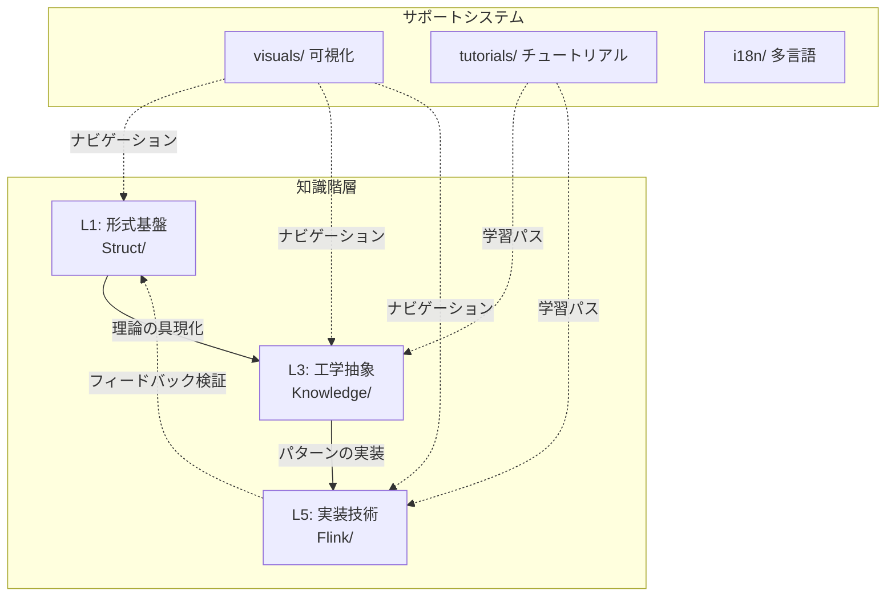
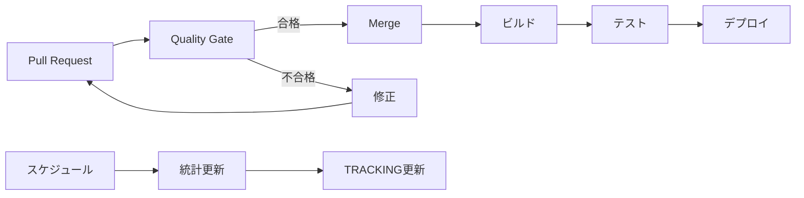

# AnalysisDataFlow アーキテクチャ

> **プロジェクト技術アーキテクチャとナビゲーションシステム**
>
> 📐 ドキュメント構造 | 🔄 ワークフロー | 🧭 ナビゲーション戦略

---

## 1. プロジェクトアーキテクチャの概要

### 1.1 核心アーキテクチャ



### 1.2 ナビゲーション設計の原則

| 原則 | 説明 | 実装 |
|------|------|------|
| **階層的ナビゲーション** | トップダウンのナビゲーションをサポート | 階層的ドキュメント構造 |
| **関連リンク** | 横断的ナビゲーションをサポート | 相互参照リンク |
| **視覚的ナビゲーション** | 直感的なコンテンツ探索 | Mermaid図表、ナビゲーションマップ |
| **多言語サポート** | グローバルユーザーへの対応 | i18nドキュメント構造 |

---

## 2. ドキュメント構造の詳細

### 2.1 命名規則

```
{層番号}.{シーケンス番号}-{説明的名称}.md
```

例：`01.02-process-calculus-primer.md`

- `01` - 第1層（基礎理論）
- `02` - 層内の第2文書
- `process-calculus-primer` - 説明的名称

### 2.2 ディレクトリ構造

```
docs/
├── i18n/                     # 多言語サポート
│   ├── en/                   # 英語
│   ├── ja/                   # 日本語
│   ├── de/                   # ドイツ語
│   └── fr/                   # フランス語
├── contributing/             # 貢献ガイド
├── certification/            # 認定関連
└── knowledge-graph/          # 知識グラフ

Struct/                       # 形式理論
├── 00-INDEX.md
├── 01-foundation/           # 基礎理論
├── 02-properties/           # 性質導出
├── 03-relationships/        # 関係構築
├── 04-proofs/               # 形式証明
└── 05-comparative/          # 比較分析

Knowledge/                    # 工学実践
├── 00-INDEX.md
├── 01-concept-atlas/        # 概念地図
├── 02-design-patterns/      # デザインパターン
├── 03-business-patterns/    # ビジネスパターン
├── 04-technology-selection/ # 技術選定
└── 06-frontier/             # 最先端技術

Flink/                        # Flink技術
├── 00-INDEX.md
├── 01-concepts/             # 基本概念
├── 02-core/                 # 核心メカニズム
├── 03-api/                  # APIとSQL
└── 08-roadmap/              # ロードマップ
```

---

## 3. CI/CDアーキテクチャ

### 3.1 ワークフロー概要



### 3.2 品質ゲートチェック

| チェック | ツール | トリガー |
|---------|--------|---------|
| 交叉参照チェック | cross-ref-checker-v2.py | PR作成/更新 |
| 六段式検証 | six-section-validator.py | PR作成/更新 |
| Mermaid構文 | mermaid-syntax-checker.py | PR作成/更新 |
| 形式要素 | formal-element-auto-number.py | PR作成/更新 |
| リンクチェック | link_checker.py | 定期実行 |

---

## 4. ナビゲーションシステム

### 4.1 ナビゲーションの種類

1. **階層的ナビゲーション**: 親子関係に基づく
2. **テーマナビゲーション**: トピックに基づく
3. **視覚的ナビゲーション**: グラフとマップに基づく
4. **検索ナビゲーション**: キーワードに基づく

### 4.2 ナビゲーションインデックス

- [NAVIGATION-INDEX.md](../../NAVIGATION-INDEX.md) - 完全なナビゲーション索引
- [knowledge-graph.html](../../knowledge-graph.html) - インタラクティブ知識グラフ
- [QUICK-START.md](QUICK-START-ja.md) - クイックスタートガイド

---

*最終更新: 2026-04-11 | 日本語版翻訳完了*
