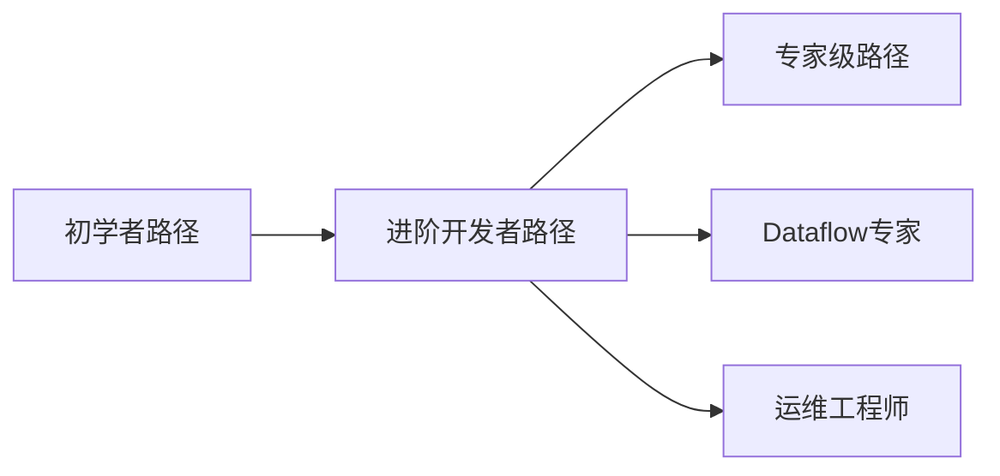

# AnalysisDataFlow 知识图谱 v2.0

> 流计算理论与Flink实践的交互式可视化探索工具

🔗 **在线访问**: `https://<username>.github.io/AnalysisDataFlow/`

---

## 📖 简介

AnalysisDataFlow 知识图谱是一个**交互式可视化工具**，帮助您：

- 🔍 **探索** 流计算的形式化理论 (Struct/)
- 📚 **学习** 设计模式与最佳实践 (Knowledge/)
- ⚡ **掌握** Apache Flink 核心机制 (Flink/)
- 🎯 **发现** 定理、定义、引理之间的关系

### 核心特性

| 特性 | 描述 | 状态 |
|------|------|------|
| 🔮 交互式图谱 | 缩放、拖拽、筛选、高亮 | ✅ 可用 |
| 🔍 语义搜索 | 基于Lunr.js的全文搜索 | ✅ 可用 |
| 📊 3D可视化 | Three.js驱动的立体视图 | ✅ 可用 |
| 📚 学习路径 | 预计算的推荐学习路线 | ✅ 可用 |
| 🌐 离线访问 | Service Worker缓存支持 | ✅ 可用 |
| 📱 移动端适配 | 响应式设计 | ✅ 可用 |

---

## 🚀 快速开始

### 访问方式

#### 方式1: 直接访问 (推荐)

```
https://<username>.github.io/AnalysisDataFlow/
```

#### 方式2: 本地运行

```bash
# 克隆仓库
git clone https://github.com/<username>/AnalysisDataFlow.git
cd AnalysisDataFlow

# 启动本地服务器
python -m http.server 8000

# 访问 http://localhost:8000/knowledge-graph-site/
```

#### 方式3: Docker运行

```bash
# 构建镜像
docker build -t knowledge-graph -f docker/kg.Dockerfile .

# 运行容器
docker run -p 8080:80 knowledge-graph
```

---

## 📚 用户指南

### 1. 界面概览

```
┌─────────────────────────────────────────────────────────────┐
│  🔍 搜索栏                                    [主题] [帮助]  │
├─────────────┬───────────────────────────────────────────────┤
│             │                                               │
│   筛选器    │                                               │
│   ───────── │              知识图谱可视化区域               │
│   ☑ Struct  │                                               │
│   ☑ Flink   │           ┌─────────┐    ┌─────────┐         │
│   ☑ Knowledge│          │ 定理    │────│ 定义    │         │
│             │           └─────────┘    └─────────┘         │
│   图例      │                  │                           │
│   ───────── │            ┌─────┴─────┐                     │
│   🔵 Struct │            │ Knowledge │                     │
│   🟢 Flink  │            └───────────┘                     │
│   🟡 ...    │                                               │
│             │                                               │
├─────────────┴───────────────────────────────────────────────┤
│  📊 统计: 28节点 | 20连接 | 8类别              [缩放控制]   │
└─────────────────────────────────────────────────────────────┘
```

### 2. 交互操作

#### 基础导航

| 操作 | 鼠标 | 触摸 |
|------|------|------|
| 平移 | 拖拽空白处 | 单指滑动 |
| 缩放 | 滚轮 | 双指捏合 |
| 选择节点 | 单击 | 点击 |
| 多选 | Shift+单击 | 长按后点击 |

#### 节点操作

```javascript
// 单击节点 - 查看详情
node.on('click', (d) => {
    showNodeDetails(d);
    highlightRelated(d);
});

// 双击节点 - 展开/折叠
node.on('dblclick', (d) => {
    toggleNodeExpansion(d);
});

// 右键节点 - 上下文菜单
node.on('contextmenu', (d) => {
    showContextMenu(d);
});
```

### 3. 搜索功能

#### 基本搜索

```
搜索框输入: "checkpoint"
结果: 匹配 Checkpoint机制、Checkpoint配置等相关节点
```

#### 高级搜索语法

| 语法 | 说明 | 示例 |
|------|------|------|
| `category:flink` | 按类别筛选 | `category:flink state` |
| `type:theorem` | 按类型筛选 | `type:theorem exactly-once` |
| `"精确匹配"` | 精确短语 | `"event time"` |
| `-排除词` | 排除词 | `checkpoint -failure` |

#### 搜索快捷键

| 快捷键 | 功能 |
|--------|------|
| `/` | 聚焦搜索框 |
| `Esc` | 清除搜索 |
| `Enter` | 打开第一个结果 |
| `↑/↓` | 导航结果 |

### 4. 学习路径

#### 内置学习路径



#### 路径详情

| 路径 | 难度 | 时长 | 适合人群 |
|------|------|------|----------|
| 初学者路径 | ⭐ | 20h | 流计算新手 |
| 进阶开发者路径 | ⭐⭐ | 40h | 有基础经验的开发者 |
| 专家级路径 | ⭐⭐⭐ | 60h | 架构师、研究员 |
| Dataflow专家 | ⭐⭐⭐ | 35h | 模型研究者 |
| Flink运维工程师 | ⭐⭐ | 30h | 运维人员 |

#### 路径使用

1. **选择路径**: 点击侧边栏 "学习路径"
2. **查看步骤**: 展开路径查看详细学习步骤
3. **追踪进度**: 标记已完成的内容
4. **获取推荐**: 根据您的选择获取个性化推荐

### 5. 3D可视化

#### 切换3D视图

```
点击工具栏 [3D] 按钮或按快捷键 '3'
```

#### 3D导航

| 操作 | 鼠标 | 键盘 |
|------|------|------|
| 旋转 | 左键拖拽 | 方向键 |
| 平移 | 右键拖拽 | WASD |
| 缩放 | 滚轮 | +/- |
| 重置视图 | 双击 | R |

### 6. 筛选与过滤

#### 类别筛选

```javascript
// 显示/隐藏类别
const filters = {
    struct: true,      // 形式理论
    knowledge: true,   // 知识结构
    flink: true,       // Flink专项
    theorem: true,     // 定理
    definition: true,  // 定义
    lemma: true,       // 引理
    proposition: true, // 命题
    corollary: true    // 推论
};
```

#### 关系筛选

- `depends` - 依赖关系
- `relates` - 关联关系
- `extends` - 扩展关系
- `proves` - 证明关系

---

## 🔧 功能说明

### 数据统计面板

底部统计栏显示实时数据：

```
┌─────────────┬─────────────┬─────────────┬─────────────┐
│  28 节点    │   20 连接   │    8 类别   │  v2.0.0    │
└─────────────┴─────────────┴─────────────┴─────────────┘
```

### 节点详情面板

点击节点后显示：

```
┌─────────────────────────────────────┐
│  📘 Checkpoint机制                  │
│  ─────────────────────────────────  │
│  类别: Flink                        │
│  类型: 概念                         │
│  引用: Thm-F-02-01                  │
│                                     │
│  描述: Flink的分布式快照机制,      │
│  用于实现exactly-once语义。         │
│                                     │
│  [查看文档] [查看源码] [相关节点]   │
└─────────────────────────────────────┘
```

### 键盘快捷键

| 快捷键 | 功能 |
|--------|------|
| `?` | 显示快捷键帮助 |
| `F` | 切换全屏 |
| `R` | 重置视图 |
| `S` | 聚焦搜索框 |
| `L` | 切换标签显示 |
| `1-9` | 切换预设视图 |
| `Ctrl/Cmd + S` | 导出当前视图为图片 |
| `Ctrl/Cmd + F` | 查找节点 |

---

## 🌐 离线使用

### Service Worker

知识图谱支持离线访问：

```javascript
// 首次访问时自动注册Service Worker
if ('serviceWorker' in navigator) {
    navigator.serviceWorker.register('/service-worker.js');
}
```

### 离线能力

- ✅ 完整图谱数据缓存
- ✅ 搜索索引缓存
- ✅ 学习路径数据缓存
- ✅ 上次浏览状态恢复

### 更新检测

```javascript
// 检测到新版本时提示
if (newVersionAvailable) {
    showNotification('新版本可用,点击刷新');
}
```

---

## 📱 移动端适配

### 响应式布局

| 屏幕尺寸 | 布局调整 |
|----------|----------|
| < 768px | 侧边栏折叠为抽屉 |
| 768-1024px | 紧凑侧边栏 |
| > 1024px | 完整布局 |

### 触摸手势

- **单指滑动**: 平移图谱
- **双指捏合**: 缩放
- **双击**: 放大/重置
- **长按**: 显示节点菜单

---

## 🎯 使用场景

### 场景1: 学习流计算基础

```
1. 打开知识图谱
2. 选择 "初学者路径"
3. 点击第一个节点开始学习
4. 跟随路径逐步深入
```

### 场景2: 查找特定定理

```
1. 按 '/' 打开搜索
2. 输入 "Thm-S-01-01"
3. 查看定理详情
4. 浏览相关定义和证明
```

### 场景3: 理解概念关系

```
1. 找到目标节点
2. 查看入边/出边连接
3. 使用高亮模式显示路径
4. 导出关系图
```

### 场景4: 准备技术分享

```
1. 切换到3D视图
2. 定位到相关主题区域
3. 使用截图功能保存视图
4. 导出数据用于PPT
```

---

## 🔗 相关资源

### 项目文档

- [部署指南](../../KNOWLEDGE-GRAPH-DEPLOYMENT-GUIDE.md)
- [定理注册表](../../THEOREM-REGISTRY.md)
- [项目跟踪](../../PROJECT-TRACKING.md)

### 外部链接

- [Apache Flink 官方文档](https://nightlies.apache.org/flink/)
- [D3.js 文档](https://d3js.org/)
- [Three.js 文档](https://threejs.org/)

---

## ❓ 常见问题

### Q: 搜索为什么没有结果？

A: 请检查：

1. 网络连接是否正常
2. 是否已等待索引加载完成（首次访问）
3. 尝试使用更通用的关键词

### Q: 如何导出数据？

A: 使用快捷键 `Ctrl+S` 导出图片，或通过浏览器控制台访问 `window.graphData` 获取JSON数据。

### Q: 支持哪些浏览器？

A: 支持现代浏览器：

- Chrome 80+
- Firefox 75+
- Safari 13+
- Edge 80+

### Q: 数据多久更新一次？

A: 数据随GitHub仓库自动更新，通常每次推送后2-3分钟内生效。

---

## 🤝 贡献

欢迎提交Issue和PR：

```bash
# 提交Bug报告
https://github.com/<username>/AnalysisDataFlow/issues/new?template=bug_report.yml

# 提交功能建议
https://github.com/<username>/AnalysisDataFlow/issues/new?template=feature_request.yml
```

---

## 📄 许可证

本项目采用 [MIT 许可证](../../LICENSE)。

---

> 📝 **最后更新**: 2026-04-08 | **文档版本**: v2.0.0
