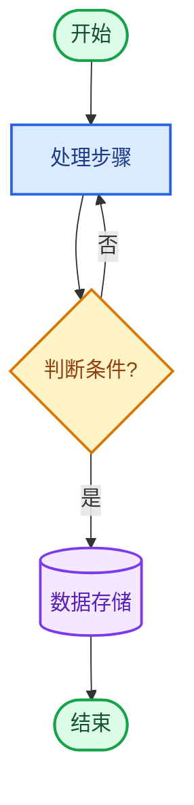
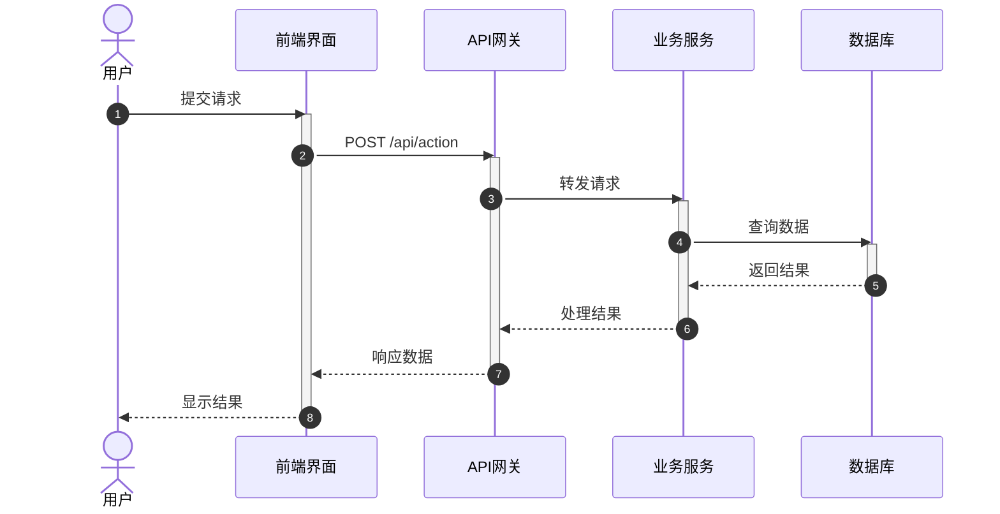
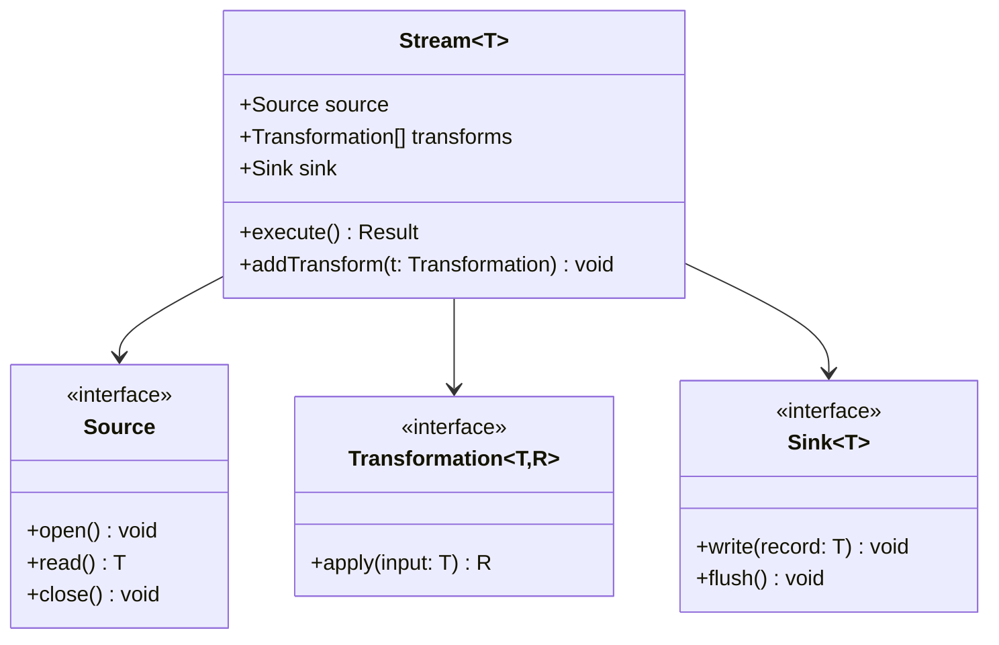
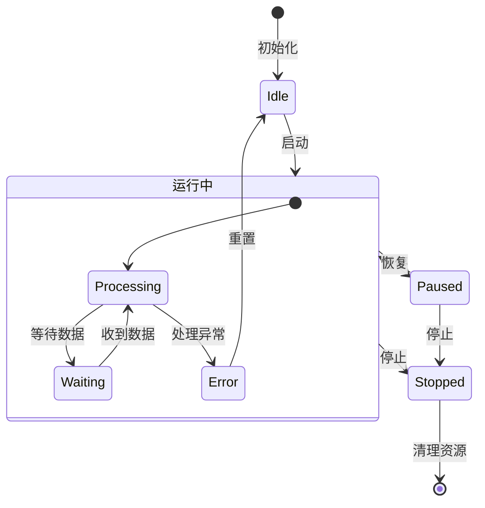
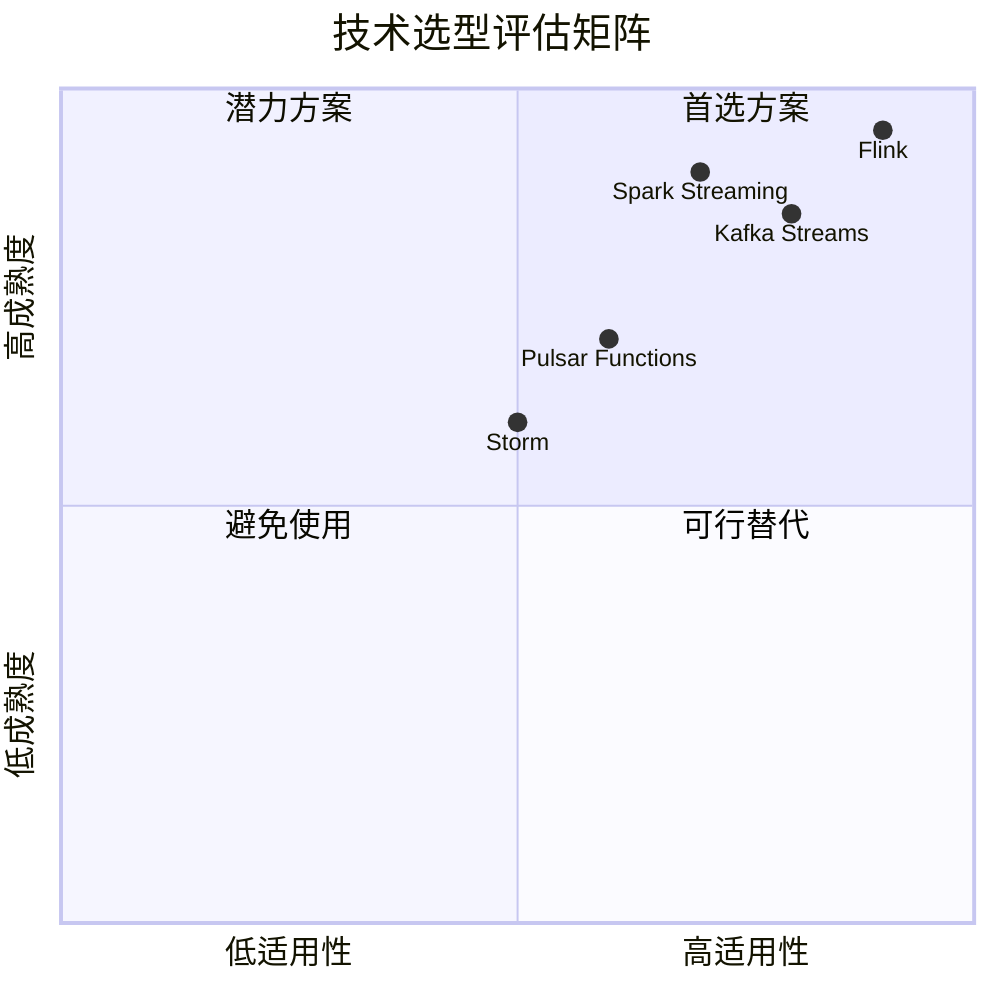
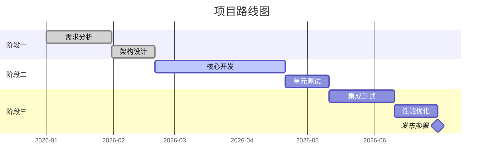
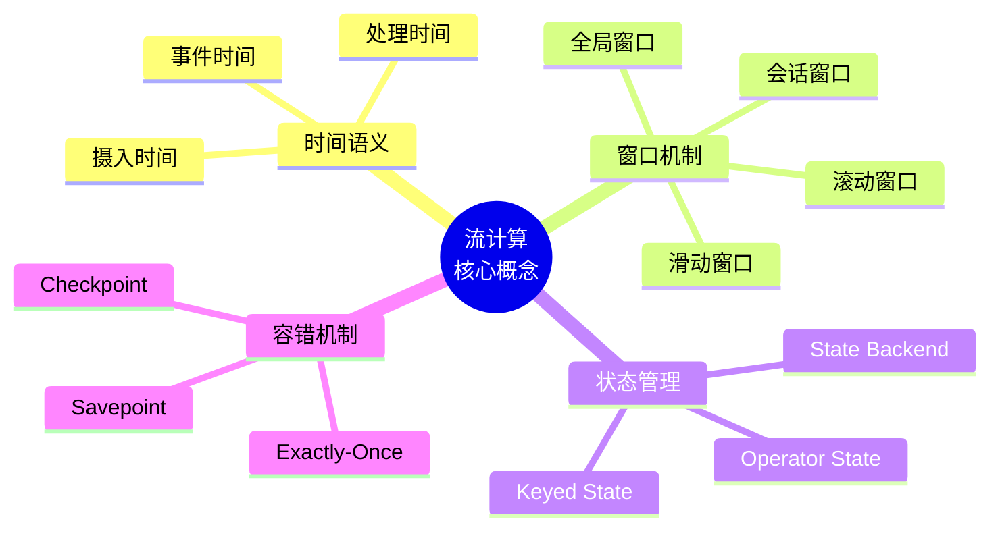
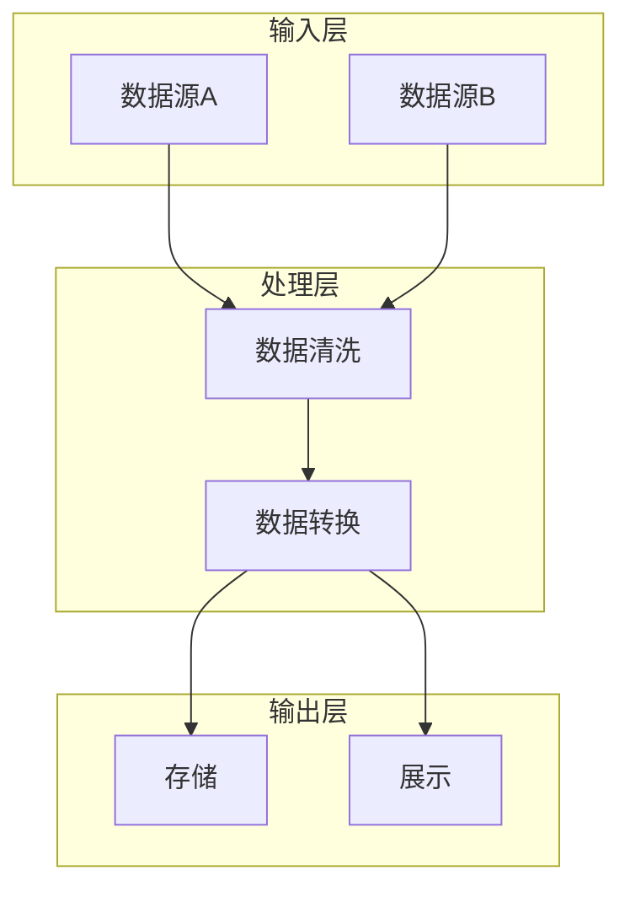
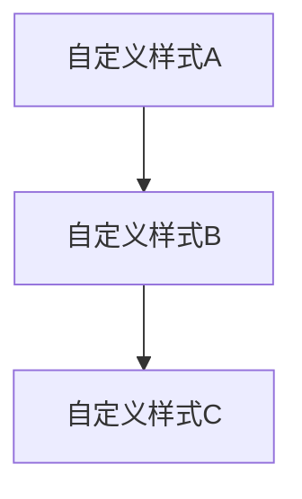

# Mermaid 图表风格指南

> 版本: v1.0 | 最后更新: 2026-04-12 | 适用范围: AnalysisDataFlow 项目

## 1. 基本原则

### 1.1 一致性

- 所有图表必须使用统一的配色方案
- 节点形状和样式遵循类型约定
- 文字大小写规范统一

### 1.2 可读性

- 图表宽度控制在 1200px 以内
- 节点文字不超过 20 个中文字符或 40 个英文字符
- 复杂图表应分层或分块展示

### 1.3 语法正确性

- 所有图表必须通过 Mermaid 语法验证
- 避免使用实验性功能
- 使用标准字符集（UTF-8）

## 2. 配色规范

### 2.1 标准配色表

```css
/* 主色调 */
--color-primary: #2563eb;        /* 蓝色 - 主要流程 */
--color-secondary: #7c3aed;      /* 紫色 - 次要/辅助 */
--color-success: #16a34a;        /* 绿色 - 成功/完成 */
--color-warning: #ea580c;        /* 橙色 - 警告/注意 */
--color-error: #dc2626;          /* 红色 - 错误/失败 */
--color-info: #0891b2;           /* 青色 - 信息/说明 */

/* 中性色 */
--color-neutral-100: #f3f4f6;    /* 浅灰 - 背景 */
--color-neutral-200: #e5e7eb;    /* 中浅灰 */
--color-neutral-700: #374151;    /* 中深灰 - 文字 */
--color-neutral-900: #111827;    /* 深灰 - 标题 */
```

### 2.2 节点配色约定

| 节点类型 | 填充色 | 边框色 | 文字色 |
|---------|--------|--------|--------|
| 开始/结束 | `#dcfce7` | `#16a34a` | `#14532d` |
| 处理/操作 | `#dbeafe` | `#2563eb` | `#1e3a8a` |
| 判断/决策 | `#fef3c7` | `#d97706` | `#92400e` |
| 数据/输入 | `#f3e8ff` | `#7c3aed` | `#5b21b6` |
| 外部系统 | `#ccfbf1` | `#0891b2` | `#115e59` |
| 错误/异常 | `#fee2e2` | `#dc2626` | `#991b1b` |

## 3. 图表类型规范

### 3.1 流程图 (Flowchart)



**规范要点：**

- 使用 `flowchart` 而非 `graph`（支持更多方向）
- 方向使用 TD（自上而下）或 LR（从左到右）
- 判断节点使用菱形 `{}`
- 开始/结束节点使用圆角矩形 `([])`

### 3.2 时序图 (Sequence Diagram)



**规范要点：**

- 使用 `autonumber` 自动编号
- 明确标注 activate/deactivate
- 异步消息使用虚线 `-->>`
- 参与者命名使用中文

### 3.3 类图 (Class Diagram)



**规范要点：**

- 泛型使用 `~T~` 表示
- 接口使用 `<<interface>>` 标注
- 访问修饰符：`+` public, `-` private, `#` protected
- 关系箭头：`-->` 关联, `--|>` 继承, `--o` 聚合, `--*` 组合

### 3.4 状态图 (State Diagram)



**规范要点：**

- 初始状态使用 `[*]`
- 状态名使用中文
- 复合状态使用嵌套定义
- 转换标注动作

### 3.5 象限图 (Quadrant Chart)



**规范要点：**

- 坐标范围 [0, 1]
- 标题说明评估维度
- 象限命名清晰
- 数据点标注技术名称

### 3.6 甘特图 (Gantt Chart)



**规范要点：**

- 使用标准日期格式
- 任务状态标注：done, active, crit
- 关键里程碑使用 milestone
- 合理分组 section

### 3.7 思维导图 (Mindmap)



**规范要点：**

- 根节点使用 `((文字))` 圆形
- 层级缩进两个空格
- 支持 `<br/>` 换行
- 避免层级过深（最多4层）

## 4. 命名规范

### 4.1 节点ID

- 使用有意义的英文或拼音
- 驼峰命名：`processData`, `checkCondition`
- 避免单字符ID（流程简单时除外）

### 4.2 显示文字

- 中文文档使用中文标注
- 保持简洁，不超过20字符
- 必要时使用 `<br/>` 换行

### 4.3 注释规范

- 使用 `%%` 添加注释
- 复杂逻辑前添加说明
- 样式类定义集中放置

## 5. 高级技巧

### 5.1 子图 (Subgraph)



### 5.2 点击交互 (Click Events)


### 5.3 字体和样式自定义



## 6. 质量检查清单

在提交图表前，请确认：

- [ ] 图表语法正确，能够正常渲染
- [ ] 使用了统一的配色方案
- [ ] 文字清晰可读，无重叠
- [ ] 逻辑流向清晰（通常从上到下或从左到右）
- [ ] 复杂图表已适当分解
- [ ] 添加了必要的说明文字
- [ ] 引用的外部链接有效

## 7. 常见问题

### Q1: 图表渲染失败

**A**: 检查特殊字符转义，确保使用标准 UTF-8 编码

### Q2: 节点文字重叠

**A**: 使用 `<br/>` 换行，或调整图表方向

### Q3: 图表过大

**A**: 使用子图分组，或拆分为多个图表

### Q4: 样式不生效

**A**: 确认 classDef 定义在节点使用之前

---

*本文档是 AnalysisDataFlow 项目可视化规范的一部分，所有贡献者请遵守。*
