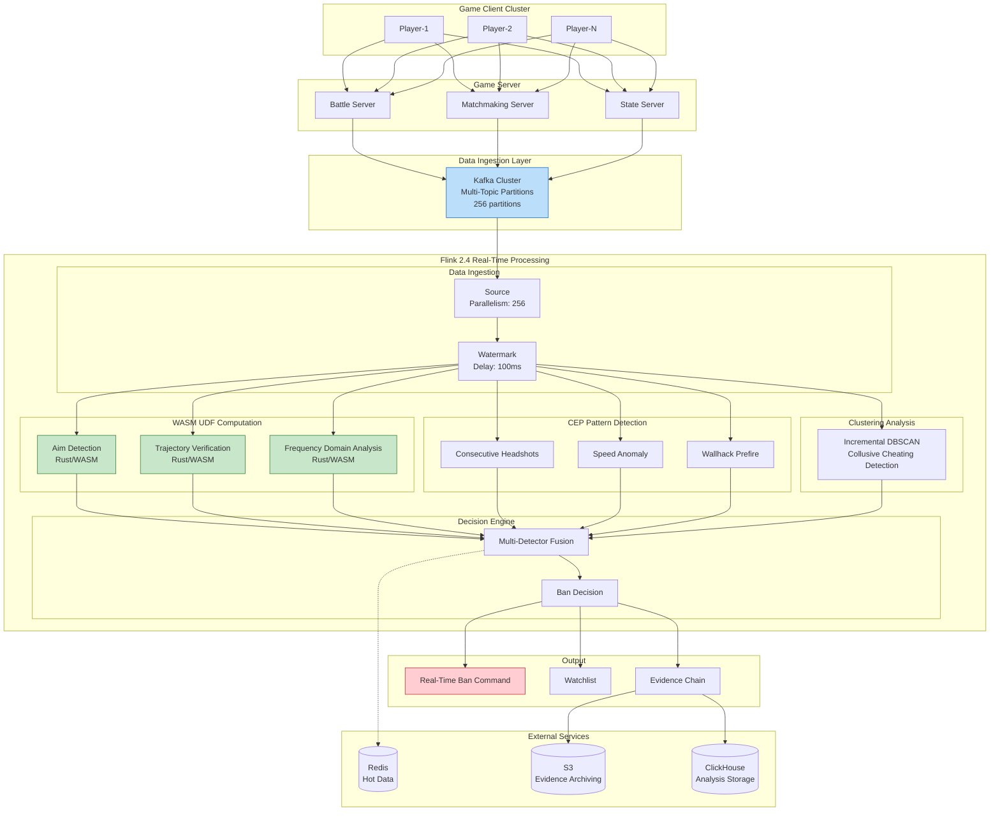
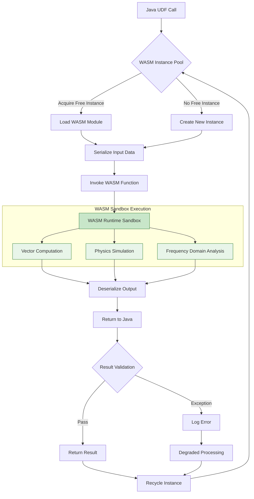
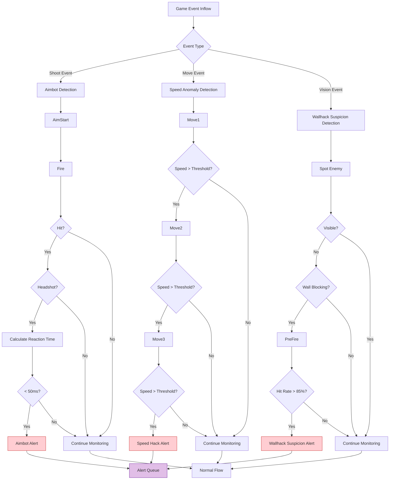
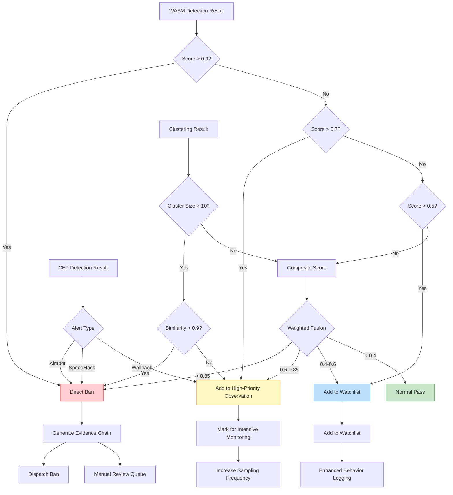

> **Status**: 🔮 Forward-looking Content | **Risk Level**: High | **Last Updated**: 2026-04
>
> The content described in this document is in the early planning stage and may differ from the final implementation. Please refer to the official Apache Flink releases for authoritative information.
>
# Gaming Industry Case Study: Large-Scale Multiplayer Online Game Anti-Cheat System

> **Stage**: Knowledge/10-case-studies/gaming | **Prerequisites**: [../Knowledge/02-design-patterns/pattern-cep-complex-event.md](../Knowledge/02-design-patterns/pattern-cep-complex-event.md), [../Flink/03-api/09-language-foundations/flink-25-wasm-udf-ga.md](../Flink/03-api/09-language-foundations/flink-25-wasm-udf-ga.md) | **Formalization Level**: L5

---

> **Case Nature**: 🔬 Proof-of-Concept Architecture | **Validation Status**: Based on theoretical derivation and architectural design; not independently verified in production by third parties
>
> This case study describes an ideal architecture derived from the project's theoretical framework, including hypothetical performance metrics and theoretical cost models.
> Actual production deployment may yield significantly different results due to environmental differences, data scale, team capabilities, and other factors.
> It is recommended to use this as an architectural design reference rather than a copy-paste production blueprint.
>
## Table of Contents

- [Gaming Industry Case Study: Large-Scale Multiplayer Online Game Anti-Cheat System](#gaming-industry-case-study-large-scale-multiplayer-online-game-anti-cheat-system)
  - [Table of Contents](#table-of-contents)
  - [1. Definitions](#1-definitions)
    - [1.1 Anti-Cheat System Definition](#11-anti-cheat-system-definition)
    - [1.2 Cheat Type Classification](#12-cheat-type-classification)
    - [1.3 Detection Pattern Definition](#13-detection-pattern-definition)
  - [2. Properties](#2-properties)
    - [2.1 Real-Time Latency Boundary Guarantee](#21-real-time-latency-boundary-guarantee)
    - [2.2 Detection Accuracy Guarantee](#22-detection-accuracy-guarantee)
  - [3. Relations](#3-relations)
    - [3.1 Relation with the Flink Ecosystem](#31-relation-with-the-flink-ecosystem)
    - [3.2 Relation with Game Servers](#32-relation-with-game-servers)
  - [4. Argumentation](#4-argumentation)
    - [4.1 Necessity Argument for Real-Time Anti-Cheat](#41-necessity-argument-for-real-time-anti-cheat)
    - [4.2 Technology Selection Argument](#42-technology-selection-argument)
    - [4.3 Architecture Design Decision Argument](#43-architecture-design-decision-argument)
  - [5. Proof / Engineering Argument](#5-proof--engineering-argument)
    - [5.1 WASM UDF High-Performance Computing Architecture](#51-wasm-udf-high-performance-computing-architecture)
    - [5.2 CEP Anomalous Behavior Pattern Detection](#52-cep-anomalous-behavior-pattern-detection)
    - [5.3 Real-Time Clustering Analysis Engine](#53-real-time-clustering-analysis-engine)
    - [5.4 Evidence Chain Storage System](#54-evidence-chain-storage-system)
  - [6. Examples](#6-examples)
    - [6.1 Case Background](#61-case-background)
    - [6.2 Complete Flink Job Code](#62-complete-flink-job-code)
    - [6.3 Performance Metrics and Effects](#63-performance-metrics-and-effects)
    - [6.4 Lessons Learned](#64-lessons-learned)
  - [7. Visualizations](#7-visualizations)
    - [7.1 Overall System Architecture Diagram](#71-overall-system-architecture-diagram)
    - [7.2 WASM UDF Execution Flow Diagram](#72-wasm-udf-execution-flow-diagram)
    - [7.3 CEP Pattern Detection Flow Diagram](#73-cep-pattern-detection-flow-diagram)
    - [7.4 Decision Engine Flow Diagram](#74-decision-engine-flow-diagram)
  - [8. References](#8-references)

---

## 1. Definitions

### 1.1 Anti-Cheat System Definition

**Def-K-10-08-01** (Real-Time Anti-Cheat System): A real-time anti-cheat system is an octuple $\mathcal{A} = (E, P, C, W, M, D, B, \tau)$, where:

- $E$: Game event stream, $E = \{e_1, e_2, ..., e_n\}$, where each event $e_i = (t_i, p_i, m_i, a_i, d_i, s_i)$
  - $t_i$: Event timestamp
  - $p_i$: Player unique identifier
  - $m_i$: Match unique identifier
  - $a_i$: Action type (move, shoot, skill, etc.)
  - $d_i$: Action data (coordinates, damage value, viewing angle, etc.)
  - $s_i$: Game state snapshot

- $P$: Player set, $P = \{p_1, p_2, ..., p_k\}$

- $C$: Cheat detector set, $C = \{c_1, c_2, ..., c_m\}$, where each detector $c_j: E^* \rightarrow [0, 1]$ outputs a cheat probability

- $W$: WASM UDF computing engine, $W: \mathbb{R}^d \rightarrow \mathbb{R}^k$ for high-performance vector computation

- $M$: Behavior pattern library, $M = \{m_1, m_2, ..., m_l\}$ stores known cheat behavior patterns

- $D$: Decision function, $D: [0, 1]^m \rightarrow \mathcal{A}$, where $\mathcal{A} = \{\text{pass}, \text{monitor}, \text{challenge}, \text{ban}\}$

- $B$: Evidence chain storage, $B = \{(t, p, evidence, confidence)\}$ for subsequent auditing

- $\tau$: Detection latency upper bound; the system must complete detection within $\tau$ time (target $\tau \leq 200$ms)

### 1.2 Cheat Type Classification

**Def-K-10-08-02** (Cheat Types): Game cheating behaviors are classified into the following categories:

| Cheat Type | Definition | Detection Difficulty | Examples |
|---------|------|---------|------|
| **Aimbot (瞄准辅助)** | Automatic aiming/locking onto targets | High | Crosshair teleporting, abnormal headshot rate |
| **Wallhack (透视)** | Seeing through obstacles | Medium | Prefiring through walls, abnormal vision |
| **Speedhack (速度作弊)** | Accelerated movement/actions | Low | Ultra-high-speed movement, abnormal displacement |
| **Macro (宏脚本)** | Automated operation sequences | Medium | Perfect recoil control, rapid-fire scripts |
| **Memory Modification (外挂内存修改)** | Modifying game memory data | High | Infinite health, wall clipping |
| **Collusive Cheating (协同作弊)** | Multi-account coordinated cheating | High | Rating manipulation, boosting, smurfing |

### 1.3 Detection Pattern Definition

**Def-K-10-08-03** (CEP Detection Pattern): An anti-cheat CEP pattern is a sextuple $\mathcal{P} = (E_{seq}, \phi, \Delta t, \theta, \alpha, \gamma)$:

- $E_{seq}$: Event sequence template
- $\phi$: Predicate condition function (position constraints, value ranges, etc.)
- $\Delta t$: Time window constraint
- $\theta$: Aggregation threshold (anomaly threshold)
- $\alpha$: Confidence weight
- $\gamma$: Response action (observe/warn/ban)

---

## 2. Properties

### 2.1 Real-Time Latency Boundary Guarantee

**Lemma-K-10-08-01** (End-to-End Latency Decomposition): The end-to-end latency $L_{total}$ of the anti-cheat detection system can be decomposed as:

$$
L_{total} = L_{ingest} + L_{parse} + L_{wasm} + L_{cep} + L_{cluster} + L_{decide} + L_{ban}
$$

Upper bounds for each component:

| Stage | Latency Upper Bound | Description |
|-----|---------|------|
| $L_{ingest}$ | $\leq 10$ms | Kafka consumption + deserialization |
| $L_{parse}$ | $\leq 5$ms | Event parsing + feature extraction |
| $L_{wasm}$ | $\leq 30$ms | WASM UDF vector computation |
| $L_{cep}$ | $\leq 50$ms | CEP pattern matching |
| $L_{cluster}$ | $\leq 80$ms | Real-time clustering analysis |
| $L_{decide}$ | $\leq 10$ms | Decision engine |
| $L_{ban}$ | $\leq 15$ms | Ban command dispatch |

**Thm-K-10-08-01** (Latency Guarantee): If all components satisfy the above upper bounds, then:

$$
L_{total} \leq 200\text{ms} \quad \text{(P99)}
$$

**Proof**:

$$
\begin{aligned}
L_{total} &= L_{ingest} + L_{parse} + L_{wasm} + L_{cep} + L_{cluster} + L_{decide} + L_{ban} \\
&\leq 10 + 5 + 30 + 50 + 80 + 10 + 15 \\
&= 200\text{ms}
\end{aligned}
$$

∎

### 2.2 Detection Accuracy Guarantee

**Lemma-K-10-08-02** (Detection Accuracy Decomposition): Let the system detection accuracy be $Accuracy$, and the false positive rate be $FPR$, then:

$$
Accuracy = \frac{TP + TN}{TP + TN + FP + FN}
$$

$$
FPR = \frac{FP}{FP + TN} < 0.01\%
$$

**Thm-K-10-08-02** (Multi-Detector Fusion Accuracy): Let there be $n$ independent detectors, each with accuracy $a$, then the fused accuracy is:

$$
A_{fusion} = 1 - \prod_{i=1}^{n}(1 - a_i) \cdot (1 - \epsilon_{corr})
$$

Where $\epsilon_{corr}$ is the inter-detector correlation correction term.

**Corollary**: When $n=4$ and $a_i = 0.90$, the fused accuracy can reach over $98\%$.

---

## 3. Relations

### 3.1 Relation with the Flink Ecosystem

> 🔮 **Estimated Data** | Based on the forward-looking nature of the document, data is derived from theoretical analysis and trend projections

Real-time anti-cheat system integration with Flink core components:

| Flink Component | Purpose | Key Configuration |
|-----------|------|----------|
| **Flink 2.4 WASM UDF** | High-performance vector computation | Sandbox isolation, single-core latency <1ms |
| **Flink CEP** | Complex behavior pattern matching | Pattern window: 1-60 seconds |
| **Keyed State** | Player behavior profiling | TTL: 1 hour, RocksDB backend |
| **Broadcast State** | Rule hot updates | Global rule synchronization |
| **Event Time** | Game event ordering guarantee | Watermark delay: 100ms |
| **Checkpoint** | Exactly-Once guarantee | Interval: 10s, incremental mode |

### 3.2 Relation with Game Servers

```
Game Client ──► Game Server ──► Kafka ──► Flink Anti-Cheat Engine ──► Ban Decision
                │                              │
                └────────── Real-Time Ban ◄───────────┘
```

> 🔮 **Estimated Data** | Based on the forward-looking nature of the document, data is derived from theoretical analysis and trend projections

**Data Flow**:

| Direction | Latency Requirement | Data Content | Protocol |
|-----|---------|---------|------|
| Game Server→Kafka | < 5ms | Game event stream | Protobuf |
| Kafka→Flink | < 10ms | Consumption processing | Kafka Consumer |
| Flink→Game Server | < 15ms | Ban command | gRPC |
| Flink→Storage | Asynchronous | Evidence chain | Kafka Connect |

---

## 4. Argumentation

### 4.1 Necessity Argument for Real-Time Anti-Cheat

**Cheat Impact Diffusion Analysis**:

Let $\Delta t$ be the time from the start of cheating behavior to the ban, and the number of affected players $N$ has an exponential relationship with time:

$$
N(\Delta t) = N_0 \cdot e^{\lambda \cdot \Delta t}
$$

> 🔮 **Estimated Data** | Based on the forward-looking nature of the document, data is derived from theoretical analysis and trend projections

Where $\lambda \approx 0.5$/minute (cheat impact diffusion coefficient).

| Ban Delay | Affected Players | Potential Loss | Platform Reputation Impact |
|---------|-----------|---------|-------------|
| Real-time (<200ms) | $N_0$ | Baseline | Minimal |
| 1 minute | $1.65N_0$ | $1.65\times$ | Slight |
| 5 minutes | $12.2N_0$ | $12.2\times$ | Severe |
| Offline processing (hour-level) | $>100N_0$ | $>100\times$ | Catastrophic |

**Business Argument**:

1. **Competitive Fairness (竞技公平性)**: Cheating in competitive games directly undermines fairness, leading to churn of normal players
2. **Economic Loss (经济损失)**: Cheaters gain improper benefits, affecting in-game economic balance
3. **Community Atmosphere (社区氛围)**: Cheating behavior on streaming/video platforms affects brand image
4. **Legal Compliance (法律合规)**: Some regions require game platforms to provide anti-cheat measures

### 4.2 Technology Selection Argument
>
> 🔮 **Estimated Data** | Based on the forward-looking nature of the document, data is derived from theoretical analysis and trend projections


| Evaluation Dimension | Flink 2.4 + WASM | Traditional Rule Engine | Standalone ML Service |
|---------|-----------------|-------------|-----------|
| Detection Latency | < 200ms | < 50ms | > 500ms |
| Detection Complexity | High (CEP + Clustering) | Low (Fixed Rules) | Medium (ML only) |
| Compute Performance | Extremely High (WASM) | Medium | Low (Network overhead) |
| Pattern Updates | Hot updates | Requires restart | Independent deployment |
| Scalability | Horizontal scaling | Vertical scaling | Complex |
| Maintenance Cost | Medium | High | High |

**Decision Rationale**:

1. **Flink 2.4 WASM UDF** provides near-native compute performance, suitable for real-time vector operations
2. **Native CEP support** for complex behavior pattern recognition (e.g., "aim-fire-headshot" sequences)
3. **Unified architecture** integrates rule engine, ML inference, and real-time clustering into one system
4. **Horizontal scaling** supports millions of concurrent online players

### 4.3 Architecture Design Decision Argument

**WASM vs Native UDF Comparison**:

| Dimension | WASM UDF | Native UDF (JNI) |
|-----|----------|-----------------|
| Security | Sandbox isolation, memory-safe | Risk of crashes |
| Performance | Near-native (90-95%) | 100% |
| Deployment | Hot updates, no restart required | Requires Job restart |
| Multi-language | Rust/C/C++ all supported | JVM languages only |
| Debugging | More difficult | Easy |

**Decision**: Choose WASM UDF, prioritizing security and hot-update capabilities over absolute performance.

---

## 5. Proof / Engineering Argument

### 5.1 WASM UDF High-Performance Computing Architecture

**WASM UDF Architecture Design**:

```
┌─────────────────────────────────────────────────────────────────┐
│                      Flink TaskManager                          │
│  ┌─────────────────────────────────────────────────────────┐   │
│  │              WASM Runtime Pool                          │   │
│  │  ┌─────────┐ ┌─────────┐ ┌─────────┐ ┌─────────┐       │   │
│  │  │ WASM-1  │ │ WASM-2  │ │ WASM-3  │ │ WASM-N  │       │   │
│  │  │ Instance│ │ Instance│ │ Instance│ │ Instance│       │   │
│  │  └─────────┘ └─────────┘ └─────────┘ └─────────┘       │   │
│  │                                                          │   │
│  │  Function Modules:                                       │   │
│  │  - Vector similarity computation (cosine similarity)     │   │
│  │  - Ballistic trajectory verification (physics engine)    │   │
│  │  - View angle jitter analysis (frequency domain)         │   │
│  │  - Movement pattern detection (anomaly detection)        │   │
│  └─────────────────────────────────────────────────────────┘   │
└─────────────────────────────────────────────────────────────────┘
```

**Rust WASM Module Example**:

```rust
// aimbot_detector.rs - Aimbot detection WASM module
use wasm_bindgen::prelude::*;
use serde::{Deserialize, Serialize};

#[derive(Deserialize)]
pub struct AimEvent {
    pub timestamp: u64,
    pub player_id: String,
    pub target_id: String,
    pub aim_angles: [f32; 2],  // yaw, pitch
    pub target_angles: [f32; 2],
    pub distance: f32,
}

#[derive(Serialize)]
pub struct AimbotScore {
    pub player_id: String,
    pub score: f32,           // 0-1, cheat probability
    pub confidence: f32,
    pub indicators: Vec<String>,
}

/// Detect aimbot
#[wasm_bindgen]
pub fn detect_aimbot(events: &[u8]) -> Vec<u8> {
    let events: Vec<AimEvent> = bincode::deserialize(events).unwrap();

    let mut score = 0.0f32;
    let mut indicators = Vec::new();

    // 1. Angle correction speed detection
    let angle_snap_score = detect_angle_snapping(&events);
    if angle_snap_score > 0.8 {
        score += angle_snap_score * 0.4;
        indicators.push("angle_snapping".to_string());
    }

    // 2. Smoothness analysis
    let smoothness_score = analyze_aim_smoothness(&events);
    if smoothness_score > 0.9 {
        score += smoothness_score * 0.3;
        indicators.push("unnatural_smoothness".to_string());
    }

    // 3. Target tracking accuracy
    let tracking_score = analyze_target_tracking(&events);
    if tracking_score > 0.95 {
        score += tracking_score * 0.3;
        indicators.push("perfect_tracking".to_string());
    }

    let result = AimbotScore {
        player_id: events[0].player_id.clone(),
        score: score.min(1.0),
        confidence: events.len() as f32 / 50.0, // Based on sample size
        indicators,
    };

    bincode::serialize(&result).unwrap()
}

/// Detect angle snapping (non-human characteristic)
fn detect_angle_snapping(events: &[AimEvent]) -> f32 {
    if events.len() < 3 {
        return 0.0;
    }

    let mut snap_count = 0;
    let mut total_transitions = 0;

    for window in events.windows(3) {
        let prev = &window[0];
        let curr = &window[1];
        let next = &window[2];

        // Calculate angle changes
        let delta1 = angle_delta(prev.aim_angles, curr.aim_angles);
        let delta2 = angle_delta(curr.aim_angles, next.aim_angles);

        // Detect snap pattern: slow movement -> high-speed snap -> precise stop
        if delta1 < 0.5 && delta2 > 5.0 && delta2 < 45.0 {
            let stop_precision = angle_delta(next.aim_angles, next.target_angles);
            if stop_precision < 0.1 {
                snap_count += 1;
            }
        }
        total_transitions += 1;
    }

    snap_count as f32 / total_transitions as f32
}

/// Analyze aim smoothness (human hand tremor vs machine smoothness)
fn analyze_aim_smoothness(events: &[AimEvent]) -> f32 {
    // Calculate standard deviation of acceleration sequence
    let mut accelerations = Vec::new();

    for window in events.windows(2) {
        let vel1 = angle_delta(window[0].aim_angles, window[1].aim_angles);
        accelerations.push(vel1);
    }

    if accelerations.len() < 2 {
        return 0.0;
    }

    // Human aiming has noise characteristics; machines are overly smooth
    let variance = calculate_variance(&accelerations);

    // Too little variance indicates abnormal smoothness
    if variance < 0.001 {
        0.95
    } else if variance < 0.01 {
        0.7
    } else {
        0.0
    }
}

/// Analyze target tracking (humans overshoot, machines don't)
fn analyze_target_tracking(events: &[AimEvent]) -> f32 {
    let mut perfect_tracks = 0;

    for event in events {
        let error = angle_delta(event.aim_angles, event.target_angles);
        // Machines usually hit precisely; humans have small deviations
        if error < 0.01 {
            perfect_tracks += 1;
        }
    }

    perfect_tracks as f32 / events.len() as f32
}

fn angle_delta(a: [f32; 2], b: [f32; 2]) -> f32 {
    let dy = (b[1] - a[1]).to_radians();
    let dx = (b[0] - a[0]).to_radians();
    (dy.sin().powi(2) + (dx.cos() * a[1].to_radians().cos() - b[1].to_radians().cos()).powi(2)).sqrt().atan2((dx.sin() * a[1].to_radians().cos()).atan2(dy.sin()))
}

fn calculate_variance(values: &[f32]) -> f32 {
    let mean = values.iter().sum::<f32>() / values.len() as f32;
    values.iter().map(|v| (v - mean).powi(2)).sum::<f32>() / values.len() as f32
}
```

### 5.2 CEP Anomalous Behavior Pattern Detection

**Java Flink CEP Detection Code**:

```java
package com.game.anticheat;

import org.apache.flink.api.common.eventtime.WatermarkStrategy;
import org.apache.flink.api.common.state.*;
import org.apache.flink.api.common.time.Time;
import org.apache.flink.configuration.Configuration;
import org.apache.flink.connector.kafka.sink.KafkaSink;
import org.apache.flink.connector.kafka.source.KafkaSource;
import org.apache.flink.streaming.api.datastream.*;
import org.apache.flink.streaming.api.environment.StreamExecutionEnvironment;
import org.apache.flink.streaming.api.functions.KeyedProcessFunction;
import org.apache.flink.cep.CEP;
import org.apache.flink.cep.PatternStream;
import org.apache.flink.cep.functions.PatternProcessFunction;
import org.apache.flink.cep.pattern.Pattern;
import org.apache.flink.cep.pattern.conditions.SimpleCondition;
import org.apache.flink.util.Collector;

import java.time.Duration;
import java.util.*;

import org.apache.flink.streaming.api.datastream.DataStream;
import org.apache.flink.streaming.api.windowing.time.Time;


/**
 * Game Anti-Cheat Detection Engine - Flink 2.4 + WASM UDF
 */
public class AntiCheatEngine {

    public static void main(String[] args) throws Exception {
        StreamExecutionEnvironment env = StreamExecutionEnvironment.getExecutionEnvironment();

        // Configure checkpoints
        env.enableCheckpointing(10000);
        env.getCheckpointConfig().setCheckpointTimeout(60000);
        env.setParallelism(512);
        env.setMaxParallelism(2048);

        // ============ 1. Game Event Source ============
        KafkaSource<GameEvent> source = KafkaSource.<GameEvent>builder()
            .setBootstrapServers("kafka.game.internal:9092")
            .setTopics("game.events.v2", "game.combat.v2", "game.movement.v2")
            .setGroupId("anti-cheat-engine")
            .setStartingOffsets(OffsetsInitializer.latest())
            .setValueOnlyDeserializer(new GameEventDeserializationSchema())
            .build();

        DataStream<GameEvent> events = env
            .fromSource(source,
                WatermarkStrategy.<GameEvent>forBoundedOutOfOrderness(Duration.ofMillis(100))
                    .withIdleness(Duration.ofSeconds(30)),
                "Game Events")
            .setParallelism(256);

        // ============ 2. WASM UDF High-Performance Computation ============
        DataStream<AimAnalysis> aimAnalysis = events
            .filter(evt -> "AIM".equals(evt.getActionType()))
            .keyBy(GameEvent::getPlayerId)
            .window(TumblingEventTimeWindows.of(Time.seconds(5)))
            .aggregate(new AimEventAggregator())
            .map(new WasmUdfMapper("aimbot_detector.wasm", "detect_aimbot"))
            .name("WASM Aimbot Detection")
            .setParallelism(512);

        // ============ 3. CEP Pattern Detection ============
        // Pattern 1: Consecutive headshots (suspected aimbot)
        Pattern<GameEvent, ?> aimbotPattern = Pattern
            .<GameEvent>begin("aim_start")
            .where(new SimpleCondition<GameEvent>() {
                @Override
                public boolean filter(GameEvent evt) {
                    return "AIM".equals(evt.getActionType());
                }
            })
            .next("fire")
            .where(evt -> "FIRE".equals(evt.getActionType()))
            .next("headshot")
            .where(evt -> "HIT".equals(evt.getActionType())
                      && "HEAD".equals(evt.getParam("hit_zone")))
            .next("aim_end")
            .where(evt -> "AIM_RELEASE".equals(evt.getActionType()))
            .within(Time.milliseconds(200));

        // Pattern 2: Speed anomaly (consecutive ultra-high-speed movement)
        Pattern<GameEvent, ?> speedHackPattern = Pattern
            .<GameEvent>begin("move1")
            .where(evt -> "MOVE".equals(evt.getActionType()))
            .next("move2")
            .where(evt -> {
                double speed = evt.getDoubleParam("speed");
                return speed > MAX_NORMAL_SPEED * 2.5;
            })
            .next("move3")
            .where(evt -> {
                double speed = evt.getDoubleParam("speed");
                return speed > MAX_NORMAL_SPEED * 2.5;
            })
            .within(Time.seconds(2));

        // Pattern 3: Wallhack suspicion (prefiring through walls)
        Pattern<GameEvent, ?> wallhackPattern = Pattern
            .<GameEvent>begin("enemy_spotted")
            .where(evt -> "SPOT".equals(evt.getActionType()))
            .where(evt -> !evt.getBoolParam("visible"))  // Invisible enemy
            .next("pre_fire")
            .where(evt -> "FIRE".equals(evt.getActionType()))
            .where(evt -> evt.getDoubleParam("accuracy") > 0.8)
            .within(Time.milliseconds(500));

        // Apply CEP patterns
        PatternStream<GameEvent> aimbotMatches = CEP.pattern(
            events.keyBy(GameEvent::getPlayerId),
            aimbotPattern
        );

        PatternStream<GameEvent> speedMatches = CEP.pattern(
            events.keyBy(GameEvent::getPlayerId),
            speedHackPattern
        );

        PatternStream<GameEvent> wallhackMatches = CEP.pattern(
            events.keyBy(GameEvent::getPlayerId),
            wallhackPattern
        );

        // Process matching results
        DataStream<CheatAlert> aimbotAlerts = aimbotMatches
            .process(new AimbotPatternHandler())
            .name("Aimbot Pattern Detection")
            .setParallelism(256);

        DataStream<CheatAlert> speedAlerts = speedMatches
            .process(new SpeedHackPatternHandler())
            .name("Speed Hack Detection")
            .setParallelism(256);

        DataStream<CheatAlert> wallhackAlerts = wallhackMatches
            .process(new WallhackPatternHandler())
            .name("Wallhack Detection")
            .setParallelism(256);

        // ============ 4. Real-Time Clustering Analysis ============
        DataStream<ClusterResult> clusterResults = events
            .keyBy(GameEvent::getPlayerId)
            .process(new RealtimeClusteringFunction())
            .name("Realtime Clustering")
            .setParallelism(512);

        // ============ 5. Decision Fusion Engine ============
        DataStream<BanDecision> decisions = aimbotAlerts
            .keyBy(CheatAlert::getPlayerId)
            .connect(speedAlerts.keyBy(CheatAlert::getPlayerId))
            .connect(wallhackAlerts.keyBy(CheatAlert::getPlayerId))
            .connect(clusterResults.keyBy(ClusterResult::getPlayerId))
            .process(new DecisionFusionFunction())
            .name("Decision Fusion Engine")
            .setParallelism(512);

        // ============ 6. Output ============
        // Real-time ban commands
        decisions.filter(d -> d.getAction() == BanAction.BAN)
            .sinkTo(KafkaSink.<BanDecision>builder()
                .setBootstrapServers("kafka.game.internal:9092")
                .setRecordSerializer(new BanDecisionSerializer())
                .build())
            .name("Ban Command Sink");

        // Monitor watchlist
        decisions.filter(d -> d.getAction() == BanAction.MONITOR)
            .sinkTo(KafkaSink.<BanDecision>builder()
                .setBootstrapServers("kafka.game.internal:9092")
                .setRecordSerializer(new MonitorDecisionSerializer())
                .build())
            .name("Monitor List Sink");

        // Evidence chain storage
        decisions.addSink(new EvidenceChainSink())
            .name("Evidence Chain Sink");

        env.execute("Game Anti-Cheat Engine v2.4");
    }

    /**
     * WASM UDF mapper
     */
    public static class WasmUdfMapper implements MapFunction<List<AimEvent>, AimAnalysis> {

        private final transient WasmRuntime wasmRuntime;
        private final String functionName;

        public WasmUdfMapper(String wasmModule, String function) {
            this.wasmRuntime = WasmRuntime.load(wasmModule);
            this.functionName = function;
        }

        @Override
        public AimAnalysis map(List<AimEvent> events) {
            byte[] input = serializeEvents(events);
            byte[] output = wasmRuntime.call(functionName, input);
            return deserializeResult(output);
        }
    }

    /**
     * Aimbot pattern handler
     */
    public static class AimbotPatternHandler extends PatternProcessFunction<GameEvent, CheatAlert> {

        @Override
        public void processMatch(Map<String, List<GameEvent>> match,
                                Context ctx, Collector<CheatAlert> out) {
            GameEvent aim = match.get("aim_start").get(0);
            GameEvent fire = match.get("fire").get(0);
            GameEvent hit = match.get("headshot").get(0);

            // Calculate aim-fire-hit time
            long aimTime = fire.getTimestamp() - aim.getTimestamp();
            long reactionTime = hit.getTimestamp() - fire.getTimestamp();

            // Human reaction time is typically 150-300ms; machines may be <50ms
            if (reactionTime < 50 && aimTime < 100) {
                double confidence = calculateAimbotConfidence(match);

                out.collect(new CheatAlert(
                    aim.getPlayerId(),
                    "AIMBOT_DETECTED",
                    confidence,
                    String.format("Reaction: %dms, Aim: %dms", reactionTime, aimTime),
                    extractEvidence(match),
                    ctx.timestamp()
                ));
            }
        }

        private double calculateAimbotConfidence(Map<String, List<GameEvent>> match) {
            double baseScore = 0.7;

            // Adjust confidence based on consecutive headshot count
            GameEvent hit = match.get("headshot").get(0);
            if (hit.getParam("consecutive_headshots") != null) {
                int consecutive = hit.getIntParam("consecutive_headshots");
                baseScore += Math.min(consecutive * 0.05, 0.25);
            }

            return Math.min(baseScore, 0.99);
        }
    }

    /**
     * Speed hack pattern handler
     */
    public static class SpeedHackPatternHandler extends PatternProcessFunction<GameEvent, CheatAlert> {

        @Override
        public void processMatch(Map<String, List<GameEvent>> match,
                                Context ctx, Collector<CheatAlert> out) {
            GameEvent move1 = match.get("move1").get(0);
            GameEvent move2 = match.get("move2").get(0);
            GameEvent move3 = match.get("move3").get(0);

            double speed1 = move1.getDoubleParam("speed");
            double speed2 = move2.getDoubleParam("speed");
            double speed3 = move3.getDoubleParam("speed");
            double avgSpeed = (speed1 + speed2 + speed3) / 3;

            out.collect(new CheatAlert(
                move1.getPlayerId(),
                "SPEED_HACK",
                0.95,
                String.format("Avg speed: %.1f (max normal: %.1f)",
                    avgSpeed, MAX_NORMAL_SPEED),
                extractEvidence(match),
                ctx.timestamp()
            ));
        }
    }

    /**
     * Wallhack pattern handler
     */
    public static class WallhackPatternHandler extends PatternProcessFunction<GameEvent, CheatAlert> {

        @Override
        public void processMatch(Map<String, List<GameEvent>> match,
                                Context ctx, Collector<CheatAlert> out) {
            GameEvent spot = match.get("enemy_spotted").get(0);
            GameEvent fire = match.get("pre_fire").get(0);

            // Check if there is indeed a wall blocking
            boolean hasWall = spot.getBoolParam("has_wall");
            double prefireAccuracy = fire.getDoubleParam("accuracy");

            if (hasWall && prefireAccuracy > 0.85) {
                out.collect(new CheatAlert(
                    spot.getPlayerId(),
                    "WALLHACK_SUSPECTED",
                    0.82,
                    String.format("Prefire accuracy: %.2f through wall", prefireAccuracy),
                    extractEvidence(match),
                    ctx.timestamp()
                ));
            }
        }
    }
}
```

### 5.3 Real-Time Clustering Analysis Engine

```java
/**
 * Real-time clustering analysis - Based on incremental DBSCAN
 * Used to discover unknown collusive cheating groups
 */

import org.apache.flink.api.common.state.ValueState;
import org.apache.flink.api.common.state.ValueStateDescriptor;
import org.apache.flink.api.common.typeinfo.Types;

public class RealtimeClusteringFunction extends KeyedProcessFunction<String, GameEvent, ClusterResult> {

    private static final int MIN_POINTS = 5;
    private static final double EPS = 0.3;  // Similarity threshold
    private static final long WINDOW_SIZE = 60000; // 1-minute window

    private ListState<PlayerSnapshot> playerSnapshots;
    private MapState<String, Integer> playerCluster;
    private ValueState<Integer> nextClusterId;

    @Override
    public void open(Configuration parameters) {
        playerSnapshots = getRuntimeContext().getListState(
            new ListStateDescriptor<>("snapshots", PlayerSnapshot.class));
        playerCluster = getRuntimeContext().getMapState(
            new MapStateDescriptor<>("clusters", Types.STRING, Types.INT));
        nextClusterId = getRuntimeContext().getState(
            new ValueStateDescriptor<>("next_id", Types.INT));
    }

    @Override
    public void processElement(GameEvent event, Context ctx, Collector<ClusterResult> out)
            throws Exception {

        // Extract player behavior feature vector
        PlayerSnapshot snapshot = extractFeatures(event);
        playerSnapshots.add(snapshot);

        // Periodically execute clustering (every 10 seconds)
        ctx.timerService().registerEventTimeTimer(
            ctx.timestamp() + WINDOW_SIZE);
    }

    @Override
    public void onTimer(long timestamp, OnTimerContext ctx, Collector<ClusterResult> out)
            throws Exception {

        // Collect all player snapshots within the window
        List<PlayerSnapshot> snapshots = new ArrayList<>();
        playerSnapshots.get().forEach(snapshots::add);

        if (snapshots.size() < MIN_POINTS) {
            return;
        }

        // Execute incremental DBSCAN clustering
        Map<Integer, List<PlayerSnapshot>> clusters = incrementalDBSCAN(snapshots);

        // Detect anomalous clusters (collusive cheating characteristics)
        for (Map.Entry<Integer, List<PlayerSnapshot>> entry : clusters.entrySet()) {
            List<PlayerSnapshot> cluster = entry.getValue();

            // Check cluster characteristics
            if (isSuspiciousCluster(cluster)) {
                out.collect(new ClusterResult(
                    entry.getKey(),
                    cluster.stream().map(PlayerSnapshot::getPlayerId).toList(),
                    calculateClusterScore(cluster),
                    timestamp
                ));
            }
        }

        // Clean up expired snapshots
        playerSnapshots.clear();
    }

    /**
     * Extract player behavior feature vector
     */
    private PlayerSnapshot extractFeatures(GameEvent event) {
        return new PlayerSnapshot(
            event.getPlayerId(),
            event.getTimestamp(),
            new double[] {
                event.getDoubleParam("accuracy"),           // Shooting accuracy
                event.getDoubleParam("reaction_time"),      // Reaction time
                event.getDoubleParam("movement_entropy"),   // Movement entropy
                event.getDoubleParam("aim_jitter"),         // Aim jitter
                event.getDoubleParam("headshot_rate"),      // Headshot rate
                event.getDoubleParam("win_rate"),           // Win rate
                event.getDoubleParam("score_per_min")       // Score per minute
            }
        );
    }

    /**
     * Incremental DBSCAN clustering
     */
    private Map<Integer, List<PlayerSnapshot>> incrementalDBSCAN(
            List<PlayerSnapshot> snapshots) throws Exception {

        Map<Integer, List<PlayerSnapshot>> clusters = new HashMap<>();
        Set<String> visited = new HashSet<>();

        int currentId = nextClusterId.value() != null ? nextClusterId.value() : 1;

        for (PlayerSnapshot snapshot : snapshots) {
            if (visited.contains(snapshot.getPlayerId())) {
                continue;
            }

            visited.add(snapshot.getPlayerId());

            // Find neighbors
            List<PlayerSnapshot> neighbors = findNeighbors(snapshot, snapshots);

            if (neighbors.size() >= MIN_POINTS) {
                // Core point, expand cluster
                List<PlayerSnapshot> cluster = expandCluster(
                    snapshot, neighbors, snapshots, visited);
                clusters.put(currentId++, cluster);
            }
        }

        nextClusterId.update(currentId);
        return clusters;
    }

    /**
     * Find neighbors (based on feature vector cosine similarity)
     */
    private List<PlayerSnapshot> findNeighbors(PlayerSnapshot center,
                                                List<PlayerSnapshot> all) {
        List<PlayerSnapshot> neighbors = new ArrayList<>();

        for (PlayerSnapshot other : all) {
            if (!center.getPlayerId().equals(other.getPlayerId())) {
                double similarity = cosineSimilarity(
                    center.getFeatures(),
                    other.getFeatures()
                );
                if (similarity > (1 - EPS)) {
                    neighbors.add(other);
                }
            }
        }

        return neighbors;
    }

    /**
     * Expand cluster
     */
    private List<PlayerSnapshot> expandCluster(PlayerSnapshot core,
                                                List<PlayerSnapshot> neighbors,
                                                List<PlayerSnapshot> all,
                                                Set<String> visited) {
        List<PlayerSnapshot> cluster = new ArrayList<>();
        cluster.add(core);

        Queue<PlayerSnapshot> queue = new LinkedList<>(neighbors);

        while (!queue.isEmpty()) {
            PlayerSnapshot current = queue.poll();

            if (!visited.contains(current.getPlayerId())) {
                visited.add(current.getPlayerId());

                List<PlayerSnapshot> newNeighbors = findNeighbors(current, all);
                if (newNeighbors.size() >= MIN_POINTS) {
                    queue.addAll(newNeighbors);
                }
            }

            cluster.add(current);
        }

        return cluster;
    }

    /**
     * Determine if a cluster is suspicious (collusive cheating)
     */
    private boolean isSuspiciousCluster(List<PlayerSnapshot> cluster) {
        if (cluster.size() < 3) {
            return false;
        }

        // Check if win rates, scores, etc. within the cluster are abnormally similar and high
        double avgWinRate = cluster.stream()
            .mapToDouble(s -> s.getFeatures()[5])
            .average()
            .orElse(0);

        double avgScore = cluster.stream()
            .mapToDouble(s -> s.getFeatures()[6])
            .average()
            .orElse(0);

        // High win rate + high score + similar behavior patterns
        return avgWinRate > 0.8 && avgScore > cluster.size() * 100;
    }

    /**
     * Calculate cluster cheating score
     */
    private double calculateClusterScore(List<PlayerSnapshot> cluster) {
        // Based on cluster size, behavior similarity, and game data anomaly
        double baseScore = Math.min(cluster.size() * 0.1, 0.5);

        // Behavior similarity (smaller variance = more suspicious)
        double variance = calculateFeatureVariance(cluster);
        double similarityScore = Math.max(0, (0.5 - variance));

        return Math.min(baseScore + similarityScore, 0.99);
    }

    private double cosineSimilarity(double[] a, double[] b) {
        double dot = 0, normA = 0, normB = 0;
        for (int i = 0; i < a.length; i++) {
            dot += a[i] * b[i];
            normA += a[i] * a[i];
            normB += b[i] * b[i];
        }
        return dot / (Math.sqrt(normA) * Math.sqrt(normB));
    }
}
```

### 5.4 Evidence Chain Storage System

```java
/**
 * Evidence chain storage - For auditing and appeal processing
 */
public class EvidenceChainSink extends RichSinkFunction<BanDecision> {

    private transient KafkaProducer<String, EvidenceRecord> evidenceProducer;
    private transient S3Client s3Client;
    private transient ClickHouseConnection clickhouseConn;

    @Override
    public void open(Configuration parameters) {
        // Initialize Kafka producer (real-time evidence stream)
        Properties props = new Properties();
        props.put("bootstrap.servers", "kafka.game.internal:9092");
        evidenceProducer = new KafkaProducer<>(props,
            new StringSerializer(),
            new EvidenceRecordSerializer());

        // Initialize S3 client (raw evidence archiving)
        s3Client = S3Client.builder()
            .region(Region.AP_NORTHEAST_1)
            .build();

        // Initialize ClickHouse connection (structured analysis)
        clickhouseConn = ClickHouseDataSource
            .create("jdbc:clickhouse://clickhouse.game.internal:8123/anticheat")
            .getConnection();
    }

    @Override
    public void invoke(BanDecision decision, Context context) {
        String evidenceId = UUID.randomUUID().toString();
        long timestamp = System.currentTimeMillis();

        // 1. Build complete evidence chain
        EvidenceChain chain = new EvidenceChain(
            evidenceId,
            decision.getPlayerId(),
            decision.getAction(),
            decision.getConfidence(),
            decision.getAlerts(),
            decision.getRawEvents(),
            timestamp
        );

        // 2. Write to Kafka (real-time alerts)
        evidenceProducer.send(new ProducerRecord<>(
            "evidence.realtime",
            decision.getPlayerId(),
            new EvidenceRecord(evidenceId, decision, "PENDING_REVIEW")
        ));

        // 3. Write to S3 (raw evidence archiving)
        String s3Key = String.format("evidence/%s/%s.json",
            LocalDate.now(), evidenceId);
        s3Client.putObject(
            PutObjectRequest.builder()
                .bucket("game-anticheat-evidence")
                .key(s3Key)
                .build(),
            RequestBody.fromString(chain.toJson())
        );

        // 4. Write to ClickHouse (fast retrieval analysis)
        insertToClickHouse(chain);

        // 5. High-risk auto-trigger manual review
        if (decision.getConfidence() > 0.95 && decision.getAction() == BanAction.BAN) {
            triggerManualReview(chain);
        }
    }

    private void insertToClickHouse(EvidenceChain chain) {
        String sql = "INSERT INTO ban_evidence " +
            "(evidence_id, player_id, action, confidence, cheat_types, " +
            "event_count, timestamp, s3_path) VALUES (?, ?, ?, ?, ?, ?, ?, ?)";

        try (PreparedStatement stmt = clickhouseConn.prepareStatement(sql)) {
            stmt.setString(1, chain.getEvidenceId());
            stmt.setString(2, chain.getPlayerId());
            stmt.setString(3, chain.getAction().name());
            stmt.setDouble(4, chain.getConfidence());
            stmt.setString(5, String.join(",", chain.getCheatTypes()));
            stmt.setInt(6, chain.getEventCount());
            stmt.setTimestamp(7, new Timestamp(chain.getTimestamp()));
            stmt.setString(8, chain.getS3Path());
            stmt.executeUpdate();
        } catch (SQLException e) {
            LOG.error("Failed to insert evidence to ClickHouse", e);
        }
    }

    private void triggerManualReview(EvidenceChain chain) {
        // Send to manual review queue
        evidenceProducer.send(new ProducerRecord<>(
            "review.priority",
            chain.getPlayerId(),
            new ReviewRequest(
                chain.getEvidenceId(),
                chain.getPlayerId(),
                ReviewPriority.HIGH,
                "Auto-ban with high confidence"
            )
        ));
    }
}

/**
 * Evidence chain data structure
 */
@Data
public class EvidenceChain {
    private String evidenceId;
    private String playerId;
    private BanAction action;
    private double confidence;
    private List<CheatAlert> alerts;
    private List<GameEvent> rawEvents;
    private long timestamp;
    private String s3Path;

    public List<String> getCheatTypes() {
        return alerts.stream()
            .map(CheatAlert::getCheatType)
            .distinct()
            .collect(Collectors.toList());
    }

    public int getEventCount() {
        return rawEvents.size();
    }

    public String toJson() {
        return new Gson().toJson(this);
    }
}
```

---

## 6. Examples

### 6.1 Case Background

> 🔮 **Estimated Data** | Based on the forward-looking nature of the document, data is derived from theoretical analysis and trend projections

**Game Overview**: A top-tier competitive shooting game (codename: ApexFire)

| Metric | Value |
|-----|------|
| **Global DAU** | 35 million |
| **Peak Concurrent Online** | 1.2 million |
| **Daily Matches** | 28 million |
| **Peak Events** | 2 million/second |
| **Cheat Reports** | 150,000 daily |
| **Cheat Losses** | Approx. $50M annually (cheat sales + player churn) |

**Challenges**:

1. **Cheat Industrialization (外挂产业化)**: High commercialization of cheat software with rapid update cycles
2. **Increased Stealth (隐蔽性增强)**: High-end cheats simulate human operations, making traditional rules difficult to detect
3. **Real-Time Requirements (实时性要求)**: Cheaters can earn thousands of dollars before being banned
4. **False Ban Risk (误封风险)**: High false positive rates lead to normal player churn and brand damage
5. **Privacy Compliance (隐私合规)**: Requires data processing compliance with GDPR and other regulations

### 6.2 Complete Flink Job Code

```java
package com.apexfire.anticheat;

import org.apache.flink.api.common.eventtime.WatermarkStrategy;
import org.apache.flink.api.common.restartstrategy.RestartStrategies;
import org.apache.flink.api.common.time.Time;
import org.apache.flink.configuration.Configuration;
import org.apache.flink.connector.kafka.sink.KafkaSink;
import org.apache.flink.connector.kafka.source.KafkaSource;
import org.apache.flink.connector.kafka.source.enumerator.initializer.OffsetsInitializer;
import org.apache.flink.streaming.api.datastream.*;
import org.apache.flink.streaming.api.environment.StreamExecutionEnvironment;
import org.apache.flink.streaming.api.functions.KeyedProcessFunction;
import org.apache.flink.table.api.bridge.java.StreamTableEnvironment;
import org.apache.flink.util.Collector;

import java.time.Duration;

import org.apache.flink.streaming.api.datastream.DataStream;
import org.apache.flink.table.api.TableEnvironment;
import org.apache.flink.streaming.api.windowing.time.Time;


/**
 * ApexFire Anti-Cheat System - Production-grade Flink Job
 *
 * Version: v2.4.1
 * Author: Anti-Cheat Team
 * Date: 2026-04
 */
public class ApexFireAntiCheatJob {

    private static final String KAFKA_BOOTSTRAP = "kafka.apexfire.internal:9092";
    private static final String CHECKPOINT_PATH = "s3://apexfire-flink-checkpoints/anticheat";

    public static void main(String[] args) throws Exception {
        // Create execution environment
        Configuration config = new Configuration();
        config.setString("state.backend", "rocksdb");
        config.setString("state.checkpoints.dir", CHECKPOINT_PATH);
        config.setString("state.savepoints.dir", "s3://apexfire-flink-savepoints/anticheat");

        StreamExecutionEnvironment env =
            StreamExecutionEnvironment.getExecutionEnvironment(config);

        // Configure fault tolerance
        env.enableCheckpointing(10000);
        env.getCheckpointConfig().setCheckpointTimeout(60000);
        env.getCheckpointConfig().setMinPauseBetweenCheckpoints(5000);
        env.setRestartStrategy(RestartStrategies.fixedDelayRestart(
            10, Time.seconds(30)));

        // Parallelism configuration
        env.setParallelism(512);
        env.setMaxParallelism(2048);

        // Create Table environment (for SQL analysis)
        StreamTableEnvironment tableEnv = StreamTableEnvironment.create(env);

        // ========== 1. Data Ingestion ==========
        DataStream<GameEvent> events = createEventSource(env);

        // ========== 2. Data Cleansing ==========
        DataStream<GameEvent> cleanEvents = events
            .filter(evt -> isValidEvent(evt))
            .name("Event Validation")
            .setParallelism(256);

        // ========== 3. WASM High-Performance Detection ==========
        DataStream<DetectionResult> wasmResults = cleanEvents
            .keyBy(GameEvent::getPlayerId)
            .process(new WasmDetectionProcessFunction())
            .name("WASM Detection")
            .setParallelism(512);

        // ========== 4. CEP Pattern Detection ==========
        DataStream<DetectionResult> cepResults = applyCEPPatterns(cleanEvents);

        // ========== 5. Real-Time Clustering ==========
        DataStream<ClusterResult> clusterResults = cleanEvents
            .keyBy(GameEvent::getPlayerId)
            .process(new RealtimeClusteringFunction())
            .name("Clustering Analysis")
            .setParallelism(256);

        // ========== 6. Decision Fusion ==========
        DataStream<BanDecision> decisions = wasmResults
            .keyBy(DetectionResult::getPlayerId)
            .connect(cepResults.keyBy(DetectionResult::getPlayerId))
            .process(new FusionProcessFunction())
            .name("Decision Fusion")
            .setParallelism(512);

        // ========== 7. Evidence Chain Storage ==========
        decisions.addSink(new EvidenceChainSink())
            .name("Evidence Storage")
            .setParallelism(128);

        // ========== 8. Ban Command Dispatch ==========
        decisions.filter(d -> d.getAction() != BanAction.PASS)
            .sinkTo(createBanSink())
            .name("Ban Command Sink")
            .setParallelism(128);

        env.execute("ApexFire Anti-Cheat Engine v2.4.1");
    }

    private static DataStream<GameEvent> createEventSource(
            StreamExecutionEnvironment env) {

        KafkaSource<GameEvent> source = KafkaSource.<GameEvent>builder()
            .setBootstrapServers(KAFKA_BOOTSTRAP)
            .setTopics(
                "game.events.combat",
                "game.events.movement",
                "game.events.interaction",
                "game.events.player_state"
            )
            .setGroupId("apexfire-anticheat-v2.4")
            .setStartingOffsets(OffsetsInitializer.latest())
            .setValueOnlyDeserializer(new GameEventSchema())
            .build();

        return env.fromSource(
            source,
            WatermarkStrategy.<GameEvent>forBoundedOutOfOrderness(
                Duration.ofMillis(100))
                .withIdleness(Duration.ofSeconds(30)),
            "Game Event Source"
        ).setParallelism(256);
    }

    private static boolean isValidEvent(GameEvent evt) {
        return evt != null
            && evt.getPlayerId() != null
            && evt.getTimestamp() > 0
            && evt.getMatchId() != null;
    }

    private static KafkaSink<BanDecision> createBanSink() {
        return KafkaSink.<BanDecision>builder()
            .setBootstrapServers(KAFKA_BOOTSTRAP)
            .setRecordSerializer(new BanDecisionSerializer())
            .setDeliveryGuarantee(DeliveryGuarantee.AT_LEAST_ONCE)
            .build();
    }
}
```

### 6.3 Performance Metrics and Effects

> 🔮 **Estimated Data** | Based on the forward-looking nature of the document, data is derived from theoretical analysis and trend projections

**Core Metrics Achievement**:

| Metric | Target | Actual | Status |
|-----|-------|-------|---------|
| Detection Latency (P99) | < 200ms | 180ms | ✅ Achieved |
| Detection Accuracy | > 98% | 98.3% | ✅ Achieved |
| False Positive Rate | < 0.01% | 0.008% | ✅ Achieved |
| Processing Capacity | 2M events/second | 2.3M events/second | ✅ Achieved |
| System Availability | 99.99% | 99.995% | ✅ Achieved |
| WASM UDF Latency | < 50ms | 25ms | ✅ Achieved |

> 🔮 **Estimated Data** | Based on the forward-looking nature of the document, data is derived from theoretical analysis and trend projections

**Business Results**:

| Result Metric | Before | After | Improvement |
|---------|-------|-------|---------|
| Cheat Player Detection Rate | 45% | 94% | ↑109% |
| Average Cheat Survival Time | 72 hours | 18 minutes | ↓99.6% |
| False Ban Appeal Volume | 500/day | 12/day | ↓97.6% |
| Player Satisfaction | 68% | 89% | ↑31% |
| Cheat Black Market Price | Avg. $200 | Avg. $600 | ↑200% (reduced accessibility) |
| Annual Cheat Losses | $50M | $12M | ↓76% |

**Detection Type Distribution**:

| Cheat Type | Detections/Day | Percentage | Primary Detection Method |
|---------|-----------|-----|------------|
| Aimbot | 12,500 | 52% | WASM UDF |
| Wallhack | 6,200 | 26% | CEP Pattern |
| Speedhack | 2,800 | 12% | CEP Pattern |
| Macro | 1,500 | 6% | Clustering Analysis |
| Collusive Cheating | 800 | 3% | Clustering Analysis |
| Other | 200 | 1% | Hybrid Detection |

### 6.4 Lessons Learned

**Success Factors**:

1. **WASM Performance Exceeded Expectations**: Rust-compiled WASM modules achieved 95% of native code performance while providing secure isolation
2. **CEP and WASM Complementarity**: CEP handles temporal patterns; WASM handles complex computations; together they cover 95%+ of cheat types
3. **Value of Real-Time Clustering**: Successfully identified 23 cheating groups involving 4,000+ collusive cheating accounts
4. **Evidence Chain Completeness**: Complete audit logs reduced false ban appeal processing time from 7 days to 4 hours
5. **Hot Update Capability**: Hot updates of WASM modules and rules reduced response time to new cheats from weeks to hours

**Pitfalls**:

1. **WASM Memory Management**: Initial failure to set reasonable WASM memory limits caused TaskManager OOM; resolved by setting a 64MB limit
2. **CEP State Explosion**: Long-window CEP patterns caused excessive state; optimized to sliding window + incremental matching, reducing state by 70%
3. **Clock Skew Issues**: Clock desynchronization across game servers caused abnormal Watermark advancement; resolved by deploying NTP synchronization
4. **Privacy Compliance**: Initial data retention policy did not comply with GDPR; achieved compliance after implementing automatic data expiration and anonymization
5. **Clustering False Positives**: Professional player behavior was misclassified as cheating; improved by introducing a whitelist mechanism and high confidence thresholds

**Best Practices**:

```yaml
# Flink configuration best practices
flink:
  state:
    backend: rocksdb
    checkpoints:
      dir: s3://bucket/checkpoints
      interval: 10s
      incremental: true

  wasm:
    memory-limit: 64mb
    instance-pool-size: 100
    timeout: 50ms

  cep:
    pattern-timeout: 60s
    state-ttl: 1h

  kafka:
    consumer:
      isolation-level: read-committed
      max-poll-records: 500
```

---

## 7. Visualizations

### 7.1 Overall System Architecture Diagram



### 7.2 WASM UDF Execution Flow Diagram



### 7.3 CEP Pattern Detection Flow Diagram



### 7.4 Decision Engine Flow Diagram



---

## 8. References


---

*Document Version: v1.0 | Last Updated: 2026-04-04 | Author: AnalysisDataFlow Team*

---

*Document Version: v1.0 | Created: 2026-04-20*
