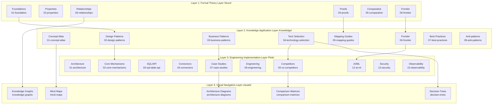
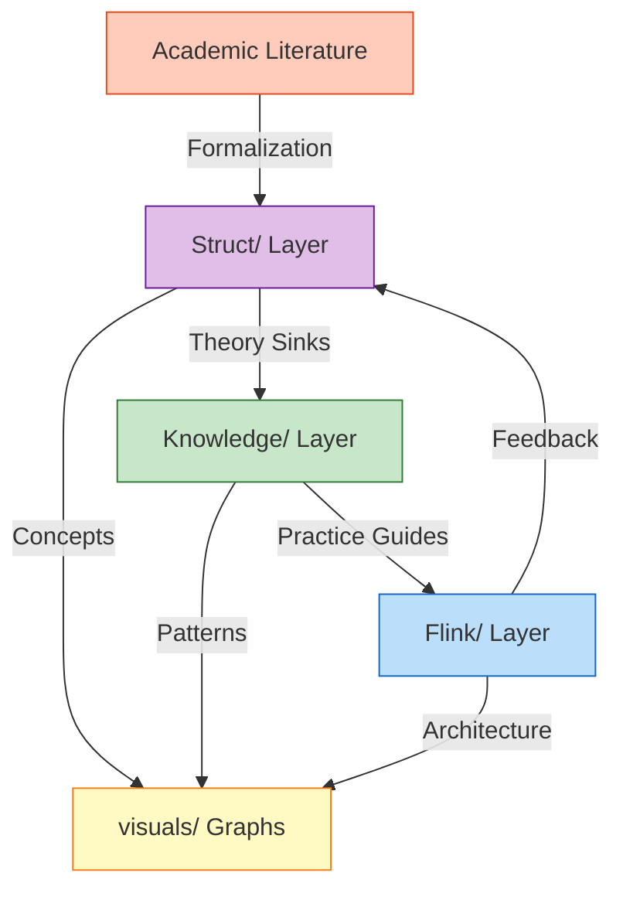
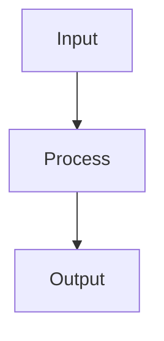
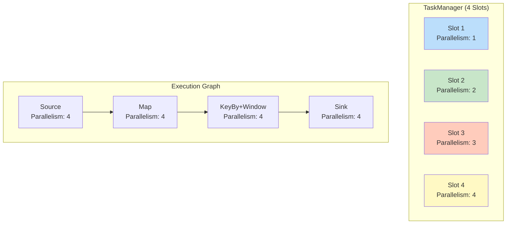

> **状态**: 🔮 前瞻内容 | **风险等级**: 高 | **最后更新**: 2026-04
>
> 此文档描述的内容处于早期规划阶段，可能与最终实现不符。请以 Apache Flink 官方发布为准。
>
# AnalysisDataFlow System Architecture

> **Version**: v1.1 | **Last Updated**: 2026-04-11 | **Status**: Production | **Project Status**: 100% Complete ✅
>
> This document describes the overall technical architecture of the AnalysisDataFlow project, including directory structure, document generation workflow, verification systems, storage architecture, and extension mechanisms.

---

## Table of Contents

- [AnalysisDataFlow System Architecture](#analysisdataflow-system-architecture)
  - [Table of Contents](#table-of-contents)
  - [1. Project Overall Architecture](#1-project-overall-architecture)
    - [1.1 Four-Layer Architecture Overview](#11-four-layer-architecture-overview)
    - [1.2 Layer Responsibilities and Interfaces](#12-layer-responsibilities-and-interfaces)
      - [Layer 1: Struct/ - Formal Theory Foundation Layer](#layer-1-struct---formal-theory-foundation-layer)
      - [Layer 2: Knowledge/ - Knowledge Application Layer](#layer-2-knowledge---knowledge-application-layer)
      - [Layer 3: Flink/ - Engineering Implementation Layer](#layer-3-flink---engineering-implementation-layer)
    - [1.3 Data Flow and Dependencies](#13-data-flow-and-dependencies)
  - [2. Document Generation Architecture](#2-document-generation-architecture)
    - [2.1 Markdown Processing Pipeline](#21-markdown-processing-pipeline)
    - [2.2 Mermaid Diagram Rendering](#22-mermaid-diagram-rendering)
  - [4. Storage Architecture](#4-storage-architecture)
    - [4.1 File Organization](#41-file-organization)
    - [4.2 Index System](#42-index-system)
  - [5. Flink Architecture Components](#5-flink-architecture-components)
    - [5.1 JobManager](#51-jobmanager)
    - [5.2 TaskManager](#52-taskmanager)
    - [5.3 Slot Management](#53-slot-management)
  - [6. Deployment Modes](#6-deployment-modes)
    - [6.1 Session Mode](#61-session-mode)
    - [6.2 Application Mode](#62-application-mode)
    - [6.3 Per-Job Mode (Deprecated in Flink 1.15+)](#63-per-job-mode-deprecated-in-flink-115)
    - [6.4 Kubernetes Native](#64-kubernetes-native)
  - [Appendix](#appendix)
    - [A. Glossary](#a-glossary)
    - [B. Directory Mapping Table](#b-directory-mapping-table)
    - [C. Related Documents](#c-related-documents)
  - [References](#references)

---

## 1. Project Overall Architecture

### 1.1 Four-Layer Architecture Overview

AnalysisDataFlow adopts a **four-layer architecture design**, implementing a complete knowledge system from formal theory to engineering practice:



### 1.2 Layer Responsibilities and Interfaces

#### Layer 1: Struct/ - Formal Theory Foundation Layer

| Attribute | Description |
|-----------|-------------|
| **Positioning** | Mathematical definitions, theorem proofs, rigorous arguments |
| **Content Characteristics** | Formal languages, axiomatic systems, proof constructions |
| **Document Count** | 43 documents |
| **Core Output** | 380 theorems, 835 definitions |
| **Status** | ✅ 100% Complete |

**Internal Interface Specification**:

```
Input: Academic literature, formal specifications
Output: Def-* (Definition), Thm-* (Theorem), Lemma-* (Lemma), Prop-* (Proposition)
Contract: Each definition must have a unique ID; each theorem must have a complete proof
```

**Subdirectory Responsibilities**:

- `01-foundation/`: USTM, Process Calculus, Actor, Dataflow fundamentals
- `02-properties/`: Determinism, consistency, Watermark monotonicity, etc.
- `03-relationships/`: Cross-model encoding, expressiveness hierarchy
- `04-proofs/`: Checkpoint, Exactly-Once correctness proofs
- `05-comparative/`: Go vs Scala expressiveness comparison
- `06-frontier/`: Open problems, Choreographic programming, AI Agent formalization
- `07-tools/`: TLA+, Coq, Smart Casual verification tools

#### Layer 2: Knowledge/ - Knowledge Application Layer

| Attribute | Description |
|-----------|-------------|
| **Positioning** | Design patterns, business scenarios, technology selection |
| **Content Characteristics** | Pattern catalogs, scenario analysis, decision frameworks |
| **Document Count** | 134 documents |
| **Core Output** | 65 theorems, 139 definitions |
| **Status** | ✅ 100% Complete |

**Internal Interface Specification**:

```
Input: Def-*, Thm-* from Struct/
Output: Pattern implementations, decision trees, mapping guides
Contract: Each pattern must trace back to theoretical foundations
```

**Subdirectory Responsibilities**:

- `01-concept-atlas/`: Concept maps, paradigm matrices
- `02-design-patterns/`: 7 core stream processing patterns
- `03-business-patterns/`: Financial risk control, IoT, real-time recommendation
- `04-technology-selection/`: Engine selection decision trees, comparison matrices
- `06-frontier/`: A2A, streaming databases, AI Agents
- `07-best-practices/`: Production best practices
- `09-anti-patterns/`: Common mistakes and mitigation

#### Layer 3: Flink/ - Engineering Implementation Layer

| Attribute | Description |
|-----------|-------------|
| **Positioning** | Flink-specific architecture, mechanisms, API, engineering |
| **Content Characteristics** | Code examples, configurations, case studies |
| **Document Count** | 178 documents |
| **Core Output** | 681 theorems, 1840 definitions |
| **Status** | ✅ 100% Complete |

**Internal Interface Specification**:

```
Input: Patterns from Knowledge/, formal guarantees from Struct/
Output: Executable code, configuration templates, deployment guides
Contract: Each implementation must align with theoretical principles
```

**Subdirectory Responsibilities**:

- `01-architecture/`: 1.x vs 2.x/3.0, storage-compute separation, cloud-native
- `02-core-mechanisms/`: Checkpoint, Exactly-Once, Watermark
- `03-sql-table-api/`: SQL and Table API reference
- `04-connectors/`: CDC, Debezium, Paimon, Iceberg
- `05-vs-competitors/`: RisingWave, Spark Streaming, Kafka Streams comparison
- `06-engineering/`: Cost optimization, testing, performance tuning
- `12-ai-ml/`: AI Agents, TGN, multimodal processing

### 1.3 Data Flow and Dependencies



---

## 2. Document Generation Architecture

### 2.1 Markdown Processing Pipeline

```
Raw Markdown → Frontmatter Parser → Content Validator →
Cross-ref Resolver → Mermaid Renderer → HTML/PDF Exporter
```

### 2.2 Mermaid Diagram Rendering

All diagrams use Mermaid syntax embedded in Markdown:

```markdown


```

Supported diagram types:
- `graph TB/TD` — Hierarchical structures, mapping relationships
- `flowchart TD` — Decision trees, flowcharts
- `gantt` — Roadmaps, timelines
- `stateDiagram-v2` — State transitions, execution trees
- `classDiagram` — Type/model structures

---

## 3. Verification System Architecture

### 3.1 Verification Script Architecture

```

┌─────────────────────────────────────────────────────────────┐
│                     Verification Pipeline                     │
├─────────────────────────────────────────────────────────────┤
│  1. Link Checker       → Validates all internal/external links │
│  2. Cross-ref Validator → Checks theorem/definition references │
│  3. Mermaid Linter     → Validates diagram syntax             │
│  4. Structure Checker  → Ensures 6-section template compliance │
│  5. Statistic Updater  → Updates theorem counts, badges       │
└─────────────────────────────────────────────────────────────┘

```

### 3.2 CI/CD Pipeline

```yaml
# .github/workflows/pr-quality-gate.yml
name: PR Quality Gate

on:
  pull_request:
    paths:
      - '**.md'

jobs:
  quality-check:
    runs-on: ubuntu-latest
    steps:
      - uses: actions/checkout@v4

      - name: Check Links
        run: python .scripts/link-checker/check-links.py

      - name: Validate Cross-references
        run: python .scripts/quality-gates/validate-cross-refs.py

      - name: Check Mermaid Syntax
        run: python .scripts/quality-gates/check-mermaid.py

      - name: Verify Document Structure
        run: python .scripts/quality-gates/check-structure.py
```

---

## 4. Storage Architecture

### 4.1 File Organization

| Directory | Purpose | Size |
|-----------|---------|------|
| `Struct/` | Formal theory documents | ~2 MB |
| `Knowledge/` | Knowledge and patterns | ~8 MB |
| `Flink/` | Flink-specific content | ~12 MB |
| `visuals/` | Diagrams and visualizations | ~2 MB |
| `.scripts/` | Automation tools | ~1 MB |
| `en/` | English translations | ~500 KB |

### 4.2 Index System

- **INDEX.md**: Master navigation index
- **THEOREM-REGISTRY.md**: Complete theorem/definition registry
- **NAVIGATION-INDEX.md**: Quick lookup by topic
- **knowledge-graph.html**: Interactive concept relationship graph

---

## 5. Flink Architecture Components

### 5.1 JobManager

The **JobManager** is the master process coordinating distributed execution:

```
┌─────────────────────────────────────────────────────────────┐
│                        JobManager                             │
├─────────────────────────────────────────────────────────────┤
│  ┌─────────────┐  ┌─────────────┐  ┌─────────────────────┐  │
│  │ Dispatcher  │  │ JobMaster   │  │ ResourceManager     │  │
│  │             │  │             │  │                     │  │
│  │ - Job submission  │ - Job execution  │ - Resource allocation │  │
│  │ - Web UI    │  │   coordination  │  │ - TaskManager mgmt  │  │
│  └─────────────┘  └─────────────┘  └─────────────────────┘  │
└─────────────────────────────────────────────────────────────┘
```

**Key Responsibilities**:

- Receives job submissions (via CLI, REST API, or Web UI)
- Coordinates checkpointing and recovery
- Manages the distributed execution graph
- Communicates with ResourceManager for resource allocation

### 5.2 TaskManager

The **TaskManager** is the worker process executing tasks:

```
┌─────────────────────────────────────────────────────────────┐
│                      TaskManager                              │
├─────────────────────────────────────────────────────────────┤
│  ┌─────────────────────────────────────────────────────────┐ │
│  │                    Memory Management                      │ │
│  │  ┌──────────────┐ ┌──────────────┐ ┌─────────────────┐  │ │
│  │  │ Network      │ │ Managed      │ │ JVM Heap        │  │ │
│  │  │ Memory       │ │ Memory       │ │ (Framework +    │  │ │
│  │  │ (Shuffle)    │ │ (RocksDB)    │ │  User Code)     │  │ │
│  │  └──────────────┘ └──────────────┘ └─────────────────┘  │ │
│  └─────────────────────────────────────────────────────────┘ │
│  ┌─────────────────────────────────────────────────────────┐ │
│  │                    Task Slots                             │ │
│  │  ┌─────┐ ┌─────┐ ┌─────┐ ┌─────┐ ┌─────┐ ┌─────┐      │ │
│  │  │Slot0│ │Slot1│ │Slot2│ │Slot3│ │ ... │ │SlotN│      │ │
│  │  └─────┘ └─────┘ └─────┘ └─────┘ └─────┘ └─────┘      │ │
│  └─────────────────────────────────────────────────────────┘ │
└─────────────────────────────────────────────────────────────┘
```

**Key Responsibilities**:

- Executes individual tasks (operators)
- Maintains local state backends (Heap, RocksDB)
- Participates in checkpointing via state snapshots
- Handles data exchange with other TaskManagers

### 5.3 Slot Management

**Task Slot** is the unit of resource allocation:



**Slot Sharing**: Multiple operators from the same pipeline can share a slot if they have compatible resource requirements.

---

## 6. Deployment Modes

Flink supports multiple deployment modes to fit different use cases:

### 6.1 Session Mode

```
┌─────────────────────────────────────────────────────────────┐
│                    Session Cluster                            │
├─────────────────────────────────────────────────────────────┤
│  ┌─────────────────────────────────────────────────────────┐ │
│  │                    JobManager                             │ │
│  └─────────────────────────────────────────────────────────┘ │
│         ┌─────────────┐    ┌─────────────┐                   │
│         ▼             ▼    ▼             ▼                   │
│  ┌─────────────────────────────────────────────────────────┐ │
│  │              TaskManager Pool                           │ │
│  │  ┌─────────┐ ┌─────────┐ ┌─────────┐ ┌─────────┐       │ │
│  │  │   TM1   │ │   TM2   │ │   TM3   │ │   TM4   │       │ │
│  │  │ 4 slots │ │ 4 slots │ │ 4 slots │ │ 4 slots │       │ │
│  │  └─────────┘ └─────────┘ └─────────┘ └─────────┘       │ │
│  └─────────────────────────────────────────────────────────┘ │
└─────────────────────────────────────────────────────────────┘
```

**Characteristics**:

- Long-running cluster
- Multiple jobs share resources
- Lower per-job startup overhead
- Better resource utilization

### 6.2 Application Mode

```
┌─────────────────────────────────────────────────────────────┐
│                    Application Cluster                        │
├─────────────────────────────────────────────────────────────┤
│  ┌─────────────────────────────────────────────────────────┐ │
│  │  JobManager (Job-specific Main method)                  │ │
│  │  - User code runs on JM                                 │ │
│  │  - Better isolation                                     │ │
│  └─────────────────────────────────────────────────────────┘ │
│  ┌─────────────────────────────────────────────────────────┐ │
│  │              TaskManagers (Job-dedicated)               │ │
│  └─────────────────────────────────────────────────────────┘ │
└─────────────────────────────────────────────────────────────┘
```

**Characteristics**:

- One cluster per application
- Main method runs on JobManager
- Better classloader isolation
- Suitable for multi-tenant environments

### 6.3 Per-Job Mode (Deprecated in Flink 1.15+)

**Characteristics**:

- One cluster per job
- Complete resource isolation
- Higher startup overhead

### 6.4 Kubernetes Native

```yaml
apiVersion: flink.apache.org/v1beta1
kind: FlinkDeployment
metadata:
  name: streaming-job
spec:
  image: my-flink-job:1.0
  flinkVersion: v1.18
  mode: native  # native, standalone

  jobManager:
    resource:
      memory: "2048m"
      cpu: 1
    replicas: 1

  taskManager:
    resource:
      memory: "4096m"
      cpu: 2
    replicas: 3

  job:
    jarURI: local:///opt/flink/usrlib/my-job.jar
    parallelism: 6
    upgradeMode: stateful
    state: running
```

---

## Appendix

### A. Glossary

| Term | Definition |
|------|------------|
| JobManager | Master process coordinating distributed execution |
| TaskManager | Worker process executing tasks |
| Task Slot | Unit of resource allocation in TaskManager |
| ExecutionGraph | Logical representation of job execution plan |
| Checkpoint | Distributed snapshot for fault tolerance |
| State Backend | Storage backend for operator state |

### B. Directory Mapping Table

| Directory | Layer | Purpose |
|-----------|-------|---------|
| Struct/ | Layer 1 | Formal theory |
| Knowledge/ | Layer 2 | Knowledge patterns |
| Flink/ | Layer 3 | Flink implementation |
| visuals/ | Layer 4 | Visual navigation |

### C. Related Documents

- [System Architecture Details](../ARCHITECTURE.md)
- [Deployment Guide](../Flink/10-deployment/)
- [Flink Architecture Comparison](../Flink/01-architecture/)

---

## References
