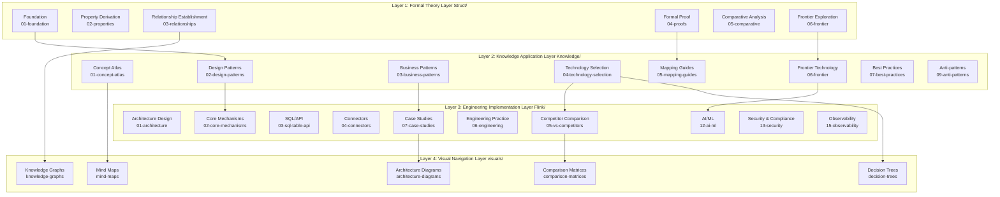
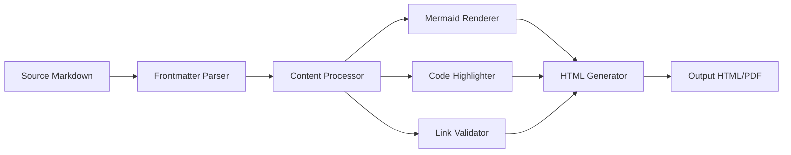
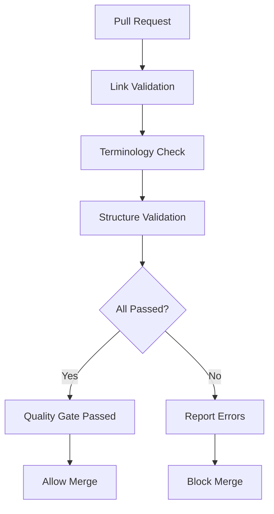

# AnalysisDataFlow Technical Architecture Document

> **Version**: v1.0 | **Updated**: 2026-04-03 | **Status**: Production
>
> This document describes the overall technical architecture of the AnalysisDataFlow project, including directory structure, document generation workflow, validation system, storage architecture, and extension mechanisms.

---

## Table of Contents

- [AnalysisDataFlow Technical Architecture Document](#analysisdataflow-technical-architecture-document)
  - [Table of Contents](#table-of-contents)
  - [1. Project Overall Architecture](#1-project-overall-architecture)
    - [1.1 Four-Layer Architecture Overview](#11-four-layer-architecture-overview)
    - [1.2 Layer Responsibilities and Interfaces](#12-layer-responsibilities-and-interfaces)
      - [Layer 1: Struct/ - Formal Theory Foundation Layer](#layer-1-struct---formal-theory-foundation-layer)
      - [Layer 2: Knowledge/ - Knowledge Application Layer](#layer-2-knowledge---knowledge-application-layer)
      - [Layer 3: Flink/ - Engineering Implementation Layer](#layer-3-flink---engineering-implementation-layer)
      - [Layer 4: visuals/ - Visual Navigation Layer](#layer-4-visuals---visual-navigation-layer)
  - [2. Document Generation Architecture](#2-document-generation-architecture)
    - [2.1 Markdown Processing Pipeline](#21-markdown-processing-pipeline)
    - [2.2 Document Standards](#22-document-standards)
  - [3. Validation System Architecture](#3-validation-system-architecture)
    - [3.1 Validation Script Architecture](#31-validation-script-architecture)
    - [3.2 CI/CD Pipeline](#32-cicd-pipeline)
    - [3.3 Quality Gates](#33-quality-gates)
  - [4. Storage Architecture](#4-storage-architecture)
    - [4.1 File Organization](#41-file-organization)
    - [4.2 Index System](#42-index-system)
  - [5. Extension Architecture](#5-extension-architecture)
    - [5.1 Adding New Documents](#51-adding-new-documents)
    - [5.2 Adding New Visualizations](#52-adding-new-visualizations)
  - [Appendix](#appendix)
    - [A. Glossary](#a-glossary)
    - [B. Directory Mapping](#b-directory-mapping)

---

## 1. Project Overall Architecture

### 1.1 Four-Layer Architecture Overview

AnalysisDataFlow adopts a **four-layer architecture design**, implementing a complete knowledge system from formal theory to engineering practice:



### 1.2 Layer Responsibilities and Interfaces

#### Layer 1: Struct/ - Formal Theory Foundation Layer

| Attribute | Description |
|-----------|-------------|
| **Positioning** | Mathematical definitions, theorem proofs, rigorous arguments |
| **Content Characteristics** | Formal language, axiom systems, proof construction |
| **Document Count** | 43 |
| **Core Output** | 188 theorems, 399 definitions, 158 lemmas |

**Interface Contract**:

- Output: Formal definitions, theorem statements, proof sketches
- Consumed by: Knowledge/ (for pattern abstraction)

#### Layer 2: Knowledge/ - Knowledge Application Layer

| Attribute | Description |
|-----------|-------------|
| **Positioning** | Design patterns, technical selection, best practices |
| **Content Characteristics** | Scenario-driven, decision-oriented, comparative analysis |
| **Document Count** | 134 |
| **Core Output** | 65 patterns, 48 decision trees, 32 selection guides |

**Interface Contract**:

- Input: Theoretical foundations from Struct/
- Output: Practical patterns, selection frameworks
- Consumed by: Flink/ (for implementation guidance)

#### Layer 3: Flink/ - Engineering Implementation Layer

| Attribute | Description |
|-----------|-------------|
| **Positioning** | Flink-specific technology, code examples, configuration guides |
| **Content Characteristics** | Hands-on, production-ready, version-specific |
| **Document Count** | 173 |
| **Core Output** | 226 definitions, 111 theorems, 450+ code examples |

**Interface Contract**:

- Input: Patterns and selection frameworks from Knowledge/
- Output: Implementation details, configuration templates

#### Layer 4: visuals/ - Visual Navigation Layer

| Attribute | Description |
|-----------|-------------|
| **Positioning** | Visual navigation, decision support, knowledge discovery |
| **Content Characteristics** | Interactive, graphical, hierarchical |
| **Document Count** | 21 |
| **Core Output** | 21 decision trees, 15 comparison matrices, 12 knowledge graphs |

---

## 2. Document Generation Architecture

### 2.1 Markdown Processing Pipeline



### 2.2 Document Standards

**8-Section Template** (Mandatory for Core Documents):

1. **Concept Definitions** - Formal definitions with numbering
2. **Property Derivation** - Lemmas and derived properties
3. **Relationship Establishment** - Mappings to other models
4. **Argumentation Process** - Supporting theorems, counter-examples
5. **Formal Proof / Engineering Argument** - Main theorem proofs
6. **Example Verification** - Code snippets, configuration examples
7. **Visualizations** - Mermaid diagrams
8. **References** - Citations in `[^n]` format

---

## 3. Validation System Architecture

### 3.1 Validation Script Architecture

```
.scripts/
├── validation/
│   ├── validate-links.py          # Link integrity check
│   ├── validate-terminology.py    # Terminology consistency
│   ├── validate-mermaid.py        # Mermaid syntax validation
│   ├── validate-structure.py      # Document structure check
│   └── validate-references.py     # Citation format validation
└── ci/
    ├── pre-commit-hook.sh         # Pre-commit checks
    └── quality-gate.py            # PR quality gate
```

### 3.2 CI/CD Pipeline



### 3.3 Quality Gates

| Gate | Description | Threshold |
|------|-------------|-----------|
| Link Integrity | All internal links valid | 100% |
| Terminology Consistency | Core terms used consistently | 100% |
| Structure Compliance | Follows 8-section template | Core docs: 100% |
| Mermaid Syntax | All diagrams renderable | 100% |

---

## 4. Storage Architecture

### 4.1 File Organization

```
AnalysisDataFlow/
├── Struct/                    # Formal theory documents
│   ├── 01-foundation/         # Mathematical foundations
│   ├── 02-models/             # Concurrency models
│   ├── 03-semantics/          # Time semantics
│   ├── 04-fault-tolerance/    # Fault tolerance theory
│   └── 05-executors/          # Executor models
├── Knowledge/                 # Engineering knowledge
│   ├── 02-design-patterns/    # Design patterns
│   ├── 03-scenarios/          # Business scenarios
│   ├── 04-selection/          # Technical selection
│   └── 05-best-practices/     # Best practices
├── Flink/                     # Flink-specific
│   ├── 01-overview/           # Overview
│   ├── 02-core/               # Core mechanisms
│   ├── 03-api/                # API reference
│   └── 04-runtime/            # Runtime
├── visuals/                   # Visualizations
├── i18n/                      # Internationalization
│   ├── en/                    # English version
│   └── zh/                    # Chinese version
└── .scripts/                  # Automation scripts
```

### 4.2 Index System

| Index File | Purpose | Update Frequency |
|------------|---------|------------------|
| `00-INDEX.md` | Directory overview | Per release |
| `NAVIGATION-INDEX.md` | Global navigation | Weekly |
| `THEOREM-REGISTRY.md` | Theorem lookup | Per document |
| `cross-ref-report.md` | Cross-reference status | Daily (CI) |

---

## 5. Extension Architecture

### 5.1 Adding New Documents

1. **Determine Layer**: Struct/ (theory), Knowledge/ (patterns), or Flink/ (implementation)
2. **Follow Template**: Use 8-section structure
3. **Assign Numbering**: Use global theorem numbering system
4. **Add References**: Include citations in `[^n]` format
5. **Run Validation**: Execute validation scripts
6. **Update Index**: Add to directory 00-INDEX.md

### 5.2 Adding New Visualizations

1. **Choose Type**: Decision tree, comparison matrix, mind map, or knowledge graph
2. **Use Mermaid**: Prefer Mermaid for maintainability
3. **Follow Style Guide**: Use color coding per layer
4. **Add Navigation**: Link from relevant documents

---

## Appendix

### A. Glossary

| Term | Definition |
|------|------------|
| **Stream Processing** | Real-time computation on unbounded data streams |
| **Event Time** | Timestamp when an event actually occurred |
| **Watermark** | Timestamp marker indicating event time progress |
| **Checkpoint** | Globally consistent snapshot of distributed system state |
| **Backpressure** | Flow control mechanism for handling downstream slowdown |

### B. Directory Mapping

| Chinese Name | English Name | Purpose |
|--------------|--------------|---------|
| 形式理论基础 | Formal Theory Foundation | Mathematical rigor |
| 知识应用 | Knowledge Application | Practical patterns |
| 工程实现 | Engineering Implementation | Production code |
| 可视化导航 | Visual Navigation | Interactive guidance |

---

*For Chinese version, see [ARCHITECTURE.md](../ARCHITECTURE.md)*
