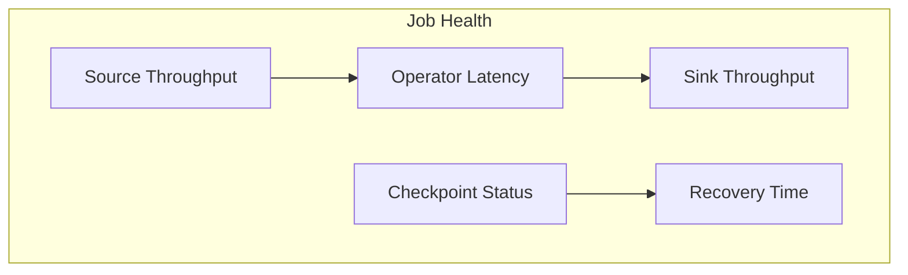
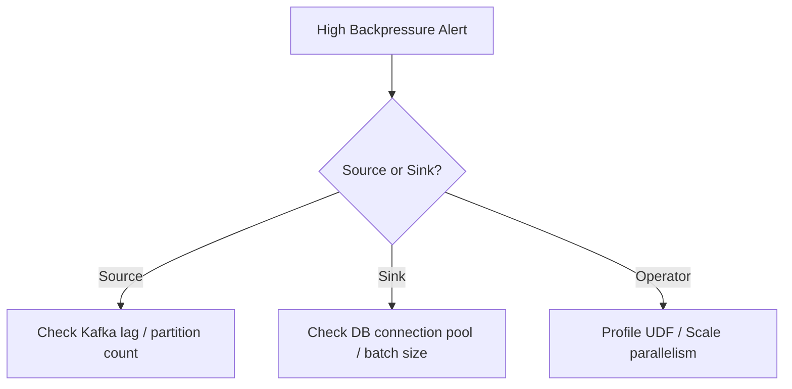

# Streaming Observability Guide

> **Language**: English | **Source**: [Knowledge/07-best-practices/07.03-troubleshooting-guide.md](../Knowledge/07-best-practices/07.03-troubleshooting-guide.md) | **Last Updated**: 2026-04-21

---

## The Three Pillars

### Metrics

| Metric | What It Tells You | Alert Threshold |
|--------|-------------------|-----------------|
| **Throughput** | Records processed per second | Drop > 20% |
| **Latency (p99)** | End-to-end processing delay | > 2× SLA |
| **Backpressure** | Ratio of backpressured tasks | > 30% |
| **Checkpoint Duration** | Time to complete checkpoint | > 50% of interval |
| **Watermark Lag** | Event time vs processing time | > 5 minutes |

### Logs

```
# Structured logging pattern
{"timestamp":"2026-04-21T10:00:00Z",
 "level":"WARN",
 "task":"Source: Kafka[0]",
 "message":"Watermark lag exceeded threshold",
 "lag_ms":320000,
 "topic":"events",
 "partition":3}
```

### Traces

| Span | Duration Indicator |
|------|-------------------|
| `source.read` | External system latency |
| `operator.process` | UDF execution time |
| `state.access` | State backend I/O latency |
| `sink.write` | Downstream system latency |

## Key Dashboards

### Job Overview



### Backpressure Drill-Down



## Alerting Rules

```yaml
# Prometheus-style alerting
- alert: FlinkCheckpointTimeout
  expr: flink_jobmanager_checkpoint_duration_time > 300000
  for: 2m
  labels:
    severity: critical
  annotations:
    summary: "Checkpoint duration exceeds 5 minutes"

- alert: FlinkHighBackpressure
  expr: flink_taskmanager_job_task_backPressuredTimeMsPerSecond > 200
  for: 5m
  labels:
    severity: warning
```

## References
