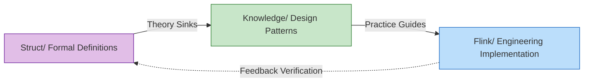

# AnalysisDataFlow Quick Start Guide

> **Get Started in 5 Minutes | Role-Based Learning Paths | Quick Problem Index**
>
> 📊 **254 Documents | 945 Formalized Elements | 100% Completion**

---

## 1. Understanding the Project in 5 Minutes

### 1.1 What is This Project

**AnalysisDataFlow** is a **unified knowledge repository** for the stream computing domain—a full-stack knowledge system spanning from formal theory to engineering practice.

```
┌─────────────────────────────────────────────────────────────┐
│                    Knowledge Hierarchy Pyramid                │
├─────────────────────────────────────────────────────────────┤
│  L6 Production    │  Flink/ Code, configuration, cases (178 docs) │
├───────────────────┼─────────────────────────────────────────────┤
│  L4-L5 Patterns   │  Knowledge/ Design patterns, tech selection (134 docs) │
├───────────────────┼─────────────────────────────────────────────┤
│  L1-L3 Theory     │  Struct/ Theorems, proofs, formal definitions (43 docs) │
└───────────────────┴─────────────────────────────────────────────┘
```

**Core Values**:

- 🔬 **Theoretical Support**: Formal theorems guarantee correctness of engineering decisions
- 🛠️ **Practical Guidance**: Complete mapping path from theorems to code
- 🔍 **Problem Diagnosis**: Quick solutions by symptom-based location

---

### 1.2 Three Major Directory Structure

| Directory | Positioning | Content Characteristics | Best For |
|-----------|-------------|------------------------|----------|
| **Struct/** | Formal Theory Foundation | Mathematical definitions, theorem proofs, rigorous arguments | Researchers, Architects |
| **Knowledge/** | Engineering Practice Knowledge | Design patterns, business scenarios, technology selection | Architects, Engineers |
| **Flink/** | Flink-Specific Technology | Architecture mechanisms, SQL/API, engineering practice | Development Engineers |

**Knowledge Flow Relationship**:



---

### 1.3 Core Features

#### Six-Section Document Template (Mandatory Structure)

Each core document must include:

| Section | Content | Example |
|---------|---------|---------|
| 1. Concept Definitions | Strict formal definitions + intuitive explanations | `Def-S-04-04` Watermark semantics |
| 2. Property Derivation | Lemmas and properties derived from definitions | `Lemma-S-04-02` Monotonicity lemma |
| 3. Relationship Establishment | Associations with other concepts/models | Flink→Process Calculus encoding |
| 4. Argumentation Process | Auxiliary theorems, counterexample analysis | Boundary condition discussion |
| 5. Formal Proof | Complete proofs of main theorems | `Thm-S-17-01` Checkpoint consistency |
| 6. Example Verification | Simplified examples, code snippets | Flink configuration examples |
| 7. Visualizations | Mermaid diagrams | Architecture diagrams, flowcharts |
| 8. References | Authoritative source citations | VLDB/SOSP papers |

#### Theorem Numbering System

Global unified numbering: `{Type}-{Stage}-{Document-Number}-{Sequence-Number}`

| Example | Meaning | Location |
|---------|---------|----------|
| `Thm-S-17-01` | Struct stage, document 17, theorem 1 | Checkpoint correctness proof |
| `Def-K-02-01` | Knowledge stage, document 02, definition 1 | Event Time Processing pattern |
| `Thm-F-12-01` | Flink stage, document 12, theorem 1 | Online learning parameter convergence |

**Quick Memory**:

- **Thm** = Theorem | **Def** = Definition | **Lemma** = Lemma | **Prop** = Proposition
- **S** = Struct (Theory) | **K** = Knowledge | **F** = Flink (Implementation)

---

## 2. Role-Based Reading Paths

### 2.1 Architect Path (3-5 Days)

**Goal**: Master system design methodology, perform technology selection and architecture decisions

```
Day 1-2: Concept Building
├── Struct/01-foundation/01.01-unified-streaming-theory.md
│   └── Focus: Six-layer expressiveness hierarchy (L1-L6)
├── Knowledge/01-concept-atlas/concurrency-paradigms-matrix.md
│   └── Focus: Five major concurrency paradigm comparison matrix
└── Knowledge/01-concept-atlas/streaming-models-mindmap.md
    └── Focus: Six-dimensional stream computing model comparison

Day 3-4: Patterns and Selection
├── Knowledge/02-design-patterns/ (Browse all)
│   └── Focus: Relationship diagram of 7 core patterns
├── Knowledge/04-technology-selection/engine-selection-guide.md
│   └── Focus: Stream processing engine selection decision tree
└── Knowledge/04-technology-selection/streaming-database-guide.md
    └── Focus: Streaming database comparison matrix

Day 5: Architecture Decisions
├── Flink/01-architecture/flink-1.x-vs-2.0-comparison.md
│   └── Focus: Architecture evolution and migration decisions
└── Struct/03-relationships/03.03-expressiveness-hierarchy.md
    └── Focus: Expressiveness and engineering constraints
```

---

### 2.2 Development Engineer Path (1-2 Weeks)

**Goal**: Master Flink core technologies, capable of developing production-grade stream processing applications

```
Week 1: Quick Start
├── Day 1: Flink/05-vs-competitors/flink-vs-spark-streaming.md
│   └── Flink positioning and advantages
├── Day 2-3: Flink/02-core/time-semantics-and-watermark.md
│   └── Event time, Watermark mechanism
├── Day 4: Knowledge/02-design-patterns/pattern-event-time-processing.md
│   └── Event time processing pattern
└── Day 5: Flink/04-connectors/kafka-integration-patterns.md
    └── Kafka integration best practices

Week 2: Core Mechanisms Deep Dive
├── Day 1-2: Flink/02-core/checkpoint-mechanism-deep-dive.md
│   └── Checkpoint mechanism, fault recovery
├── Day 3: Flink/02-core/exactly-once-end-to-end.md
│   └── Exactly-Once implementation principles
├── Day 4: Flink/02-core/backpressure-and-flow-control.md
│   └── Backpressure handling and flow control
└── Day 5: Flink/06-engineering/performance-tuning-guide.md
    └── Performance tuning in practice
```

---

### 2.3 Researcher Path (2-4 Weeks)

**Goal**: Understand theoretical foundations, master formal methods, conduct innovative research

```
Week 1-2: Theoretical Foundations
├── Struct/01-foundation/01.02-process-calculus-primer.md
│   └── CCS/CSP/π-calculus foundations
├── Struct/01-foundation/01.04-dataflow-model-formalization.md
│   └── Dataflow strict formalization
├── Struct/01-foundation/01.03-actor-model-formalization.md
│   └── Actor model formal semantics
└── Struct/02-properties/02.03-watermark-monotonicity.md
    └── Watermark monotonicity theorem

Week 3: Model Relationships and Encoding
├── Struct/03-relationships/03.01-actor-to-csp-encoding.md
│   └── Actor→CSP encoding preservation
├── Struct/03-relationships/03.02-flink-to-process-calculus.md
│   └── Flink→Process Calculus encoding
└── Struct/03-relationships/03.03-expressiveness-hierarchy.md
    └── Six-layer expressiveness hierarchy theorem

Week 4: Formal Proofs and Frontier
├── Struct/04-proofs/04.01-flink-checkpoint-correctness.md
│   └── Checkpoint consistency proof
├── Struct/04-proofs/04.02-flink-exactly-once-correctness.md
│   └── Exactly-Once correctness proof
└── Struct/06-frontier/06.02-choreographic-streaming-programming.md
    └── Choreographic programming frontier
```

---

### 2.4 Student Path (1-2 Months)

**Goal**: Gradually build a complete knowledge system, from beginner to expert

```
Month 1: Foundation Building
├── Week 1: Concurrent Computing Models
│   ├── Struct/01-foundation/01.02-process-calculus-primer.md
│   ├── Struct/01-foundation/01.03-actor-model-formalization.md
│   └── Struct/01-foundation/01.05-csp-formalization.md
├── Week 2: Stream Computing Fundamentals
│   ├── Struct/01-foundation/01.04-dataflow-model-formalization.md
│   ├── Knowledge/01-concept-atlas/streaming-models-mindmap.md
│   └── Flink/02-core/time-semantics-and-watermark.md
├── Week 3: Core Properties
│   ├── Struct/02-properties/02.01-determinism-analysis.md
│   ├── Struct/02-properties/02.02-consistency-levels.md
│   └── Struct/02-properties/02.03-watermark-monotonicity.md
└── Week 4: Design Patterns
    └── Knowledge/02-design-patterns/ (Read all 7 core patterns)

Month 2: Practical Application
├── Week 5: Flink Core
│   ├── Flink/02-core/checkpoint-mechanism-deep-dive.md
│   ├── Flink/02-core/exactly-once-end-to-end.md
│   └── Flink/02-core/backpressure-and-flow-control.md
├── Week 6: Connectors and Integration
│   ├── Flink/04-connectors/kafka-integration-patterns.md
│   └── Flink/04-connectors/cdc-connectors-guide.md
├── Week 7: Engineering Practice
│   ├── Flink/06-engineering/performance-tuning-guide.md
│   └── Flink/06-engineering/testing-strategy.md
└── Week 8: Frontier Technologies
    └── Knowledge/06-frontier/ (Choose topics of interest)
```

---

## 3. Your First Flink Program

### 3.1 Prerequisites

Before running your first Flink program, ensure you have:

- Java 11 or higher installed
- Apache Maven 3.6+ or Gradle 7+
- An IDE (IntelliJ IDEA recommended)

### 3.2 Project Setup

Create a new Maven project with the following `pom.xml`:

```xml
<?xml version="1.0" encoding="UTF-8"?>
<project xmlns="http://maven.apache.org/POM/4.0.0"
         xmlns:xsi="http://www.w3.org/2001/XMLSchema-instance"
         xsi:schemaLocation="http://maven.apache.org/POM/4.0.0
                             http://maven.apache.org/xsd/maven-4.0.0.xsd">
    <modelVersion>4.0.0</modelVersion>

    <groupId>com.example</groupId>
    <artifactId>flink-quickstart</artifactId>
    <version>1.0-SNAPSHOT</version>
    <packaging>jar</packaging>

    <properties>
        <maven.compiler.source>11</maven.compiler.source>
        <maven.compiler.target>11</maven.compiler.target>
        <flink.version>1.18.0</flink.version>
    </properties>

    <dependencies>
        <!-- Flink Core -->
        <dependency>
            <groupId>org.apache.flink</groupId>
            <artifactId>flink-streaming-java</artifactId>
            <version>${flink.version}</version>
        </dependency>
        <dependency>
            <groupId>org.apache.flink</groupId>
            <artifactId>flink-clients</artifactId>
            <version>${flink.version}</version>
        </dependency>
    </dependencies>
</project>
```

### 3.3 WordCount Example

Create `WordCount.java`:

```java
import org.apache.flink.api.common.eventtime.WatermarkStrategy;
import org.apache.flink.api.common.functions.FlatMapFunction;
import org.apache.flink.api.java.tuple.Tuple2;
import org.apache.flink.streaming.api.datastream.DataStream;
import org.apache.flink.streaming.api.environment.StreamExecutionEnvironment;
import org.apache.flink.streaming.api.windowing.assigners.TumblingEventTimeWindows;
import org.apache.flink.streaming.api.windowing.time.Time;
import org.apache.flink.util.Collector;

public class WordCount {
    public static void main(String[] args) throws Exception {
        // 1. Create execution environment
        final StreamExecutionEnvironment env =
            StreamExecutionEnvironment.getExecutionEnvironment();

        // 2. Set parallelism (default: number of CPU cores)
        env.setParallelism(2);

        // 3. Create data source (socket stream)
        DataStream<String> text = env.socketTextStream("localhost", 9999);

        // 4. Transform: split lines into words and count
        DataStream<Tuple2<String, Integer>> wordCounts = text
            .flatMap(new Tokenizer())
            .keyBy(value -> value.f0)
            .window(TumblingEventTimeWindows.of(Time.seconds(5)))
            .sum(1);

        // 5. Print results to stdout
        wordCounts.print();

        // 6. Execute the job
        env.execute("Socket Window WordCount");
    }

    // Tokenizer: splits lines into (word, 1) tuples
    public static class Tokenizer implements FlatMapFunction<String, Tuple2<String, Integer>> {
        @Override
        public void flatMap(String value, Collector<Tuple2<String, Integer>> out) {
            // Normalize and split the line
            String[] words = value.toLowerCase().split("\\W+");

            // Emit (word, 1) for each word
            for (String word : words) {
                if (word.length() > 0) {
                    out.collect(new Tuple2<>(word, 1));
                }
            }
        }
    }
}
```

### 3.4 Running the Program

**Step 1**: Start a socket server

```bash
nc -lk 9999
```

**Step 2**: Run the Flink program from your IDE or using Maven:

```bash
mvn compile exec:java -Dexec.mainClass="WordCount"
```

**Step 3**: Type sentences in the socket server and observe the output.

---

## 4. Flink Installation Guide

### 4.1 Local Standalone Setup

**Download and Extract**:

```bash
# Download Flink 1.18.0
curl -LO https://archive.apache.org/dist/flink/flink-1.18.0/flink-1.18.0-bin-scala_2.12.tgz

# Extract
tar -xzf flink-1.18.0-bin-scala_2.12.tgz
cd flink-1.18.0
```

**Start Local Cluster**:

```bash
# Start cluster
./bin/start-cluster.sh

# Check Web UI at http://localhost:8081
```

**Submit Job**:

```bash
./bin/flink run -c WordCount /path/to/your-job.jar
```

**Stop Cluster**:

```bash
./bin/stop-cluster.sh
```

### 4.2 Docker Setup

```bash
# Pull Flink image
docker pull flink:1.18.0-scala_2.12

# Run job manager
docker run -d --name flink-jobmanager \
  -p 8081:8081 \
  -e JOB_MANAGER_RPC_ADDRESS=jobmanager \
  flink:1.18.0-scala_2.12 jobmanager

# Run task manager
docker run -d --name flink-taskmanager \
  --link flink-jobmanager:jobmanager \
  -e JOB_MANAGER_RPC_ADDRESS=jobmanager \
  flink:1.18.0-scala_2.12 taskmanager
```

### 4.3 Kubernetes Setup

```bash
# Using Flink Kubernetes Operator
helm repo add flink-operator-repo https://downloads.apache.org/flink/flink-kubernetes-operator-1.6.0/
helm install flink-kubernetes-operator flink-operator-repo/flink-kubernetes-operator

# Deploy a Flink job
kubectl apply -f - <<EOF
apiVersion: flink.apache.org/v1beta1
kind: FlinkDeployment
metadata:
  name: wordcount-job
spec:
  image: flink:1.18
  flinkVersion: v1.18
  jobManager:
    resource:
      memory: "2048m"
      cpu: 1
  taskManager:
    resource:
      memory: "2048m"
      cpu: 1
  job:
    jarURI: local:///opt/flink/examples/streaming/WordCount.jar
    parallelism: 2
EOF
```

---

## 5. Monitoring and Observability

### 5.1 Web UI

Flink provides a comprehensive Web UI at `http://localhost:8081` with:

- Job overview and status
- Task execution details
- Checkpoint statistics
- Backpressure monitoring
- Metrics visualization

### 5.2 Metrics Integration

```java
// Enable Prometheus metrics reporter
Configuration conf = new Configuration();
conf.setString("metrics.reporters", "prometheus");
conf.setString("metrics.reporter.prometheus.class",
    "org.apache.flink.metrics.prometheus.PrometheusReporter");
conf.setString("metrics.reporter.prometheus.port", "9249");

StreamExecutionEnvironment env =
    StreamExecutionEnvironment.getExecutionEnvironment(conf);
```

### 5.3 Logging Configuration

```yaml
# log4j2.properties
rootLogger.level = INFO
rootLogger.appenderRef.console.ref = ConsoleAppender

# Flink specific logging
logger.flink.name = org.apache.flink
logger.flink.level = INFO
```

---

## 6. Next Steps

After completing this quick start:

1. **Explore Core Concepts**: Deep dive into [time semantics](../Flink/02-core/time-semantics-and-watermark.md) and [checkpointing](../Flink/02-core/checkpoint-mechanism-deep-dive.md)
2. **Learn Design Patterns**: Study the [7 core stream processing patterns](../Knowledge/02-design-patterns/)
3. **Build Real Applications**: Follow the [case studies](../Flink/07-case-studies/)
4. **Master Production Deployment**: Read the [production deployment guide](../Flink/10-deployment/)

---

## References
