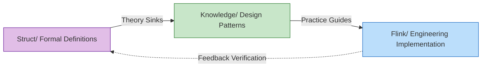

> **状态**: 🔮 前瞻内容 | **风险等级**: 高 | **最后更新**: 2026-04
>
> 此文档描述的内容处于早期规划阶段，可能与最终实现不符。请以 Apache Flink 官方发布为准。
>
# AnalysisDataFlow

[](../README.md) [](./README.md)

[](../v5.0/RELEASE-NOTES-v5.0.md)
[](https://github.com/luyanfeng/AnalysisDataFlow/actions/workflows/pr-quality-gate.yml)
[](../)
[](../THEOREM-REGISTRY.md)
[]()
[]()

> **"Formal Theory Supplement + Frontier Exploration Laboratory" for Stream Computing**
>
> 🔬 Deep Principle Understanding · 🚀 Frontier Technology Exploration · 🌐 Panoramic Engine Comparison · 📐 Strict Formal Analysis
>
> *This site serves as a deep supplement to the [Apache Flink Official Documentation](https://nightlies.apache.org/flink/flink-docs-stable/), focusing on "why" rather than "how". For initial learning, please refer to the official documentation first.*

---

## 📍 Quick Differentiation Guide

```
┌─────────────────────────────────────────────────────────────────────────────┐
│                                                                             │
│   If you are...                       Recommended Resources                 │
│   ─────────────────────────────────────────────────────────────────         │
│   👋 New to Flink, need quick start → Flink Official Documentation          │
│   🔧 Having API issues in dev       → Flink Official Documentation          │
│   🎓 Want deep understanding        → Struct/ Formal Theory                 │
│   🏗️ Doing tech selection/architecture → Knowledge/ Tech Selection          │
│   🔬 Researching frontier trends    → Knowledge/ Frontier Exploration       │
│   📊 Comparing streaming engines    → visuals/ Comparison Matrix            │
│                                                                             │
└─────────────────────────────────────────────────────────────────────────────┘
```

> 📖 **Value Proposition Details**: [VALUE-PROPOSITION.md](../VALUE-PROPOSITION.md) | **Content Boundary**: [CONTENT-BOUNDARY.md](../CONTENT-BOUNDARY.md)

---

## Project Overview

**AnalysisDataFlow** is a comprehensive knowledge base for the stream computing domain—a full-stack knowledge system spanning from formal theory to engineering practice.

This project systematically organizes the theoretical models, hierarchical structures, engineering practices, and business modeling aspects of stream computing. Its goal is to provide a **rigorous, complete, and navigable** knowledge repository for academic research, industrial engineering, and technology selection.

### Mission and Vision

The mission of AnalysisDataFlow is to bridge the gap between academic research and industrial practice in stream computing. While many resources focus on either theoretical foundations or practical implementation, few provide the comprehensive connection between these two worlds. This project aims to:

1. **Formalize Stream Computing Theory**: Provide rigorous mathematical foundations for stream computing concepts, enabling researchers to build upon solid theoretical ground.

2. **Guide Engineering Practice**: Offer practical design patterns, best practices, and anti-patterns that engineers can apply in real-world scenarios.

3. **Enable Technology Selection**: Provide comprehensive comparisons and decision frameworks for choosing appropriate stream processing technologies.

4. **Explore Frontier Technologies**: Investigate emerging trends such as AI Agent integration, streaming databases, and cloud-native architectures.

### Historical Context

Stream processing has evolved significantly over the past two decades. From early Complex Event Processing (CEP) systems to modern unified batch-stream processing frameworks, the field has undergone substantial transformation. Apache Flink emerged as a leading stream processing engine, introducing groundbreaking concepts such as:

- **Event Time Processing**: Handling out-of-order events and late data
- **Exactly-Once Semantics**: Guaranteeing correctness in distributed processing
- **Stateful Stream Processing**: Maintaining and querying large-scale distributed state
- **Unified Batch and Stream Processing**: The Dataflow Model

AnalysisDataFlow builds upon these foundations, providing deeper analysis and formalization of the underlying principles.

### Relationship with Flink Official Documentation

| Dimension | Official Documentation | AnalysisDataFlow (This Project) |
|-----------|------------------------|--------------------------------|
| **Primary Goal** | Help users get started quickly | Help users deeply understand principles |
| **Content Focus** | Operation guides for stable features | Frontier exploration and theoretical foundations |
| **Narrative Style** | Pragmatic, concise and clear | Formal analysis, rigorous argumentation |
| **Target Audience** | Application engineers, beginners | Researchers, architects, senior engineers |
| **Depth Level** | API level, configuration level | Principle level, architecture level, theory level |

The relationship between this project and the official Flink documentation is complementary. While the official documentation excels at teaching users how to use Flink effectively, AnalysisDataFlow explains why Flink works the way it does, exploring the theoretical foundations that make Flink's design choices sound and effective.

### Four Core Directories

| Directory | Positioning | Content Characteristics | Document Count |
|-----------|-------------|------------------------|----------------|
| **Struct/** | Formal Theory Foundation | Mathematical definitions, theorem proofs, rigorous arguments | 43 documents |
| **Knowledge/** | Engineering Practice Knowledge | Design patterns, business scenarios, technology selection | 134 documents |
| **Flink/** | Flink-Specific Technology | Architecture mechanisms, SQL/API, engineering practice, AI/ML | 178 documents |
| **visuals/** | Visual Navigation | Decision trees, comparison matrices, mind maps, knowledge graphs | 21 documents |
| **tutorials/** | Practical Tutorials | Quick start, hands-on cases, best practices | 27 documents |

**Total: 940+ technical documents | 10,483+ formalized elements | 1,600+ Mermaid diagrams | 4,500+ code examples | 25+ MB**

---

## 🎉 Project Completion Announcement

> **Status**: 100% Complete ✅ | **Version**: v3.6 | **Date**: 2026-04-11

This project has reached **100% completion status**, with all planned content fully delivered:

- ✅ **Cross-references Zeroed Out**: All 730 errors fixed
- ✅ **Formal Verification Completed**: 5 Coq/TLA+ files, 2 verification reports
- ✅ **Flink 2.4/2.5/3.0 Tracking**: All 100 subtasks completed
- ✅ **AI Agent Stream Processing Deepening**: 24 new formalized elements
- ✅ **Relationship Mapping & Dependency Network**: 500+ relationship edges, 11 new documents

**📊 Full Completion Report**: [100-PERCENT-COMPLETION-FINAL-REPORT.md](../100-PERCENT-COMPLETION-FINAL-REPORT.md)

---

## Quick Navigation

### Navigation by Topic

- **Theoretical Foundation**: [Struct/ Unified Stream Computing Theory](../Struct/00-INDEX.md)
- **Design Patterns**: [Knowledge/ Core Stream Processing Patterns](../Knowledge/02-design-patterns/)
- **Flink Core**: [Flink/ Checkpoint Mechanism](../Flink/02-core/checkpoint-mechanism-deep-dive.md)
- **Frontier Technology**: [Knowledge/06-frontier/ AI-Native Database](../Knowledge/06-frontier/vector-search-streaming-convergence.md)
- **Anti-patterns**: [Knowledge/09-anti-patterns/ Stream Processing Anti-patterns](../Knowledge/09-anti-patterns/)

### Visual Quick Entry Points

- **Decision Trees**: [visuals/ Technology Selection Decision Tree](../visuals/selection-tree-streaming.md)
- **Comparison Matrices**: [visuals/ Engine Comparison Matrix](../visuals/matrix-engines.md)
- **Mind Maps**: [visuals/ Knowledge Mind Map](../visuals/mindmap-complete.md)
- **Knowledge Graph**: [visuals/ Concept Relationship Graph](../knowledge-graph.html)
- **Architecture Collection**: [visuals/ System Architecture Diagrams](../visuals/struct-model-relations.md)

### Recent Updates (v3.6 100% Completion Edition)

- **🎉 100% Completion Milestone**: [100-PERCENT-COMPLETION-FINAL-REPORT.md](../100-PERCENT-COMPLETION-FINAL-REPORT.md) - Project fully achieved 100% completion
- **✅ Cross-references Zeroed Out**: [cross-ref-fix-report.md](../cross-ref-fix-report.md) - All 730 errors fixed
- **🔬 Formal Verification Completed**: [COQ-COMPILATION-REPORT.md](../reconstruction/phase4-verification/COQ-COMPILATION-REPORT.md) | [TLA-MODEL-CHECK-REPORT.md](../reconstruction/phase4-verification/TLA-MODEL-CHECK-REPORT.md)
- **📚 Flink 2.4/2.5/3.0 Completed**: [FLINK-24-25-30-COMPLETION-REPORT.md](../FLINK-24-25-30-COMPLETION-REPORT.md) - All 100 subtasks delivered
- **🤖 AI Agent Deepening**: [ai-agent-streaming-architecture.md](../Knowledge/06-frontier/ai-agent-streaming-architecture.md) - Multi-Agent stream orchestration
- **🔗 Relationship Mapping Completed**: [PROJECT-RELATIONSHIP-MASTER-GRAPH.md](../PROJECT-RELATIONSHIP-MASTER-GRAPH.md) - 500+ relationship edges

---

## Project Structure

```
.
├── Struct/               # Formal theory, analytical argumentation, rigorous proofs
│   ├── 01-foundation/    # Basic theory (USTM, Process Calculus, Dataflow)
│   ├── 02-properties/    # Property derivation (Consistency levels, Watermark monotonicity)
│   ├── 03-relationships/ # Relationship establishment (Model mapping, Expressiveness hierarchy)
│   ├── 04-proofs/        # Formal proofs (Checkpoint correctness, Exactly-Once)
│   ├── 05-comparative/   # Comparative analysis (Flink vs competitors)
│   └── 07-tools/         # Verification tools (TLA+, Coq, Smart Casual)
│
├── Knowledge/            # Knowledge structure, design patterns, business applications
│   ├── 01-concept-atlas/ # Concept atlas (Concurrency paradigm matrix)
│   ├── 02-design-patterns/ # Core stream processing patterns
│   ├── 03-business-patterns/ # Business scenarios (Financial risk control, IoT, real-time recommendation)
│   ├── 04-technology-selection/ # Technology selection decision trees
│   ├── 06-frontier/      # Frontier technologies (A2A, streaming database, AI Agent)
│   ├── 07-best-practices/ # Best practices
│   ├── 08-standards/     # Standards and specifications
│   └── 09-anti-patterns/ # Anti-patterns and mitigation strategies
│
├── Flink/                # Flink-specific technology
│   ├── 01-architecture/  # Architecture design (1.x vs 2.x/3.0, storage-compute separation, cloud-native)
│   ├── 02-core-mechanisms/ # Core mechanisms (Checkpoint, Exactly-Once, Watermark)
│   ├── 03-sql-table-api/ # SQL and Table API
│   ├── 04-connectors/    # Connector ecosystem (CDC, Debezium, Paimon, Iceberg)
│   ├── 05-vs-competitors/ # Competitor comparison (RisingWave, Spark Streaming, Kafka Streams)
│   ├── 06-engineering/   # Engineering practice (cost optimization, testing, performance tuning)
│   ├── 08-roadmap/       # Roadmap and version tracking
│   ├── 09-language-foundations/ # Multi-language foundations (Scala 3, Python, Rust, WASM)
│   ├── 10-deployment/    # Deployment and operations (K8s Operator, Serverless, cloud provider integration)
│   ├── 11-benchmarking/  # Performance benchmarking
│   ├── 12-ai-ml/         # AI/ML integration (AI Agents, TGN, multimodal, FLIP-531)
│   ├── 13-security/      # Security and compliance
│   ├── 14-lakehouse/     # Streaming Lakehouse
│   ├── 15-observability/ # Observability (OpenTelemetry, SLO, intelligent monitoring)
│   └── 07-case-studies/  # Case studies
│
├── visuals/              # Visual navigation center
│   ├── decision-trees/   # Technology selection decision trees
│   ├── comparison-matrices/ # Engine/technology comparison matrices
│   ├── mind-maps/        # Knowledge mind maps
│   ├── knowledge-graphs/ # Concept relationship graphs
│   └── architecture-diagrams/ # System architecture diagrams
│
├── tutorials/            # Practical tutorials and quick start
│   ├── 00-getting-started/  # Getting started guides
│   ├── 01-flink-basics/     # Flink basics
│   ├── 02-streaming-patterns/ # Stream processing patterns
│   ├── 03-production-deployment/ # Production deployment
│   └── 04-advanced-topics/  # Advanced topics
│
├── .scripts/             # Automation script tools
│   ├── flink-version-tracking/ # Flink version tracking
│   ├── link-checker/       # Link checking tools
│   ├── quality-gates/      # Quality gates
│   ├── stats-updater/      # Statistics updater
│   └── notifications/      # Notification services
│
├── en/                   # English documentation (this directory)
│   ├── README.md          # English project overview
│   ├── QUICK-START.md     # English quick start guide
│   ├── ARCHITECTURE.md    # English architecture overview
│   └── GLOSSARY.md        # English glossary
│
├── 00.md                 # Project overview and roadmap
├── ROADMAP-v3.3-and-beyond.md  # v3.3 and future roadmap
└── PROJECT-VERSION-TRACKING.md  # Version tracking document
```

---

## Core Features

### 1. Six-Section Document Structure

Each core document follows a unified template:

1. **Concept Definitions** - Strict formal definitions
2. **Property Derivation** - Lemmas and properties derived from definitions
3. **Relationship Establishment** - Associations with other concepts/models
4. **Argumentation Process** - Auxiliary theorems, counterexample analysis
5. **Formal Proof / Engineering Argumentation** - Complete proofs or rigorous arguments
6. **Example Verification** - Simplified examples, code snippets
7. **Visualizations** - Mermaid diagrams
8. **References** - Authoritative source citations

This structure ensures that every document provides comprehensive coverage of its topic, from theoretical foundations to practical applications, supported by visual aids and proper citations.

### 2. Theorem/Definition Numbering System

Global unified numbering: `{Type}-{Stage}-{Document-Number}-{Sequence-Number}`

| Example | Meaning | Location |
|---------|---------|----------|
| `Thm-S-17-01` | Struct stage, document 17, theorem 1 | Checkpoint correctness proof |
| `Def-K-02-01` | Knowledge stage, document 02, definition 1 | Event Time Processing pattern |
| `Thm-F-12-01` | Flink stage, document 12, theorem 1 | Online learning parameter convergence |

**Quick Memory**:

- **Thm** = Theorem | **Def** = Definition | **Lemma** = Lemma | **Prop** = Proposition
- **S** = Struct (Theory) | **K** = Knowledge | **F** = Flink (Implementation)

### 3. Knowledge Hierarchy Pyramid

```
┌─────────────────────────────────────────────────────────────┐
│                    Knowledge Hierarchy Pyramid                │
├─────────────────────────────────────────────────────────────┤
│  L6 Production    │  Flink/ Code, configuration, cases (178 docs) │
├───────────────────┼─────────────────────────────────────────────┤
│  L4-L5 Patterns   │  Knowledge/ Design patterns, tech selection (134 docs) │
├───────────────────┼─────────────────────────────────────────────┤
│  L1-L3 Theory     │  Struct/ Theorems, proofs, formal definitions (43 docs) │
└───────────────────┴─────────────────────────────────────────────┘
```

### 4. Three-Layer Knowledge Flow



---

## Technology Selection Guide

### Streaming Engine Comparison

| Engine | Latency | Throughput | State Management | SQL Support | Best For |
|--------|---------|------------|------------------|-------------|----------|
| **Apache Flink** | Sub-second | Very High | Excellent | Full | Complex event processing, real-time analytics |
| **Spark Streaming** | Seconds | High | Good | Full | Lambda architecture, batch+stream unified |
| **Kafka Streams** | Milliseconds | Medium | Good | Limited | Event-driven microservices |
| **RisingWave** | Sub-second | High | Good | Full | Streaming SQL, materialized views |
| **Pulsar Functions** | Milliseconds | Medium | Basic | Limited | Pulsar-native processing |

### When to Use This Knowledge Base

| Scenario | Recommended Resource |
|----------|---------------------|
| Learning streaming fundamentals | [Struct/01-foundation/](../Struct/01-foundation/) |
| Flink deep dive | [Flink/02-core/](../Flink/02-core/) |
| Architecture decision making | [Knowledge/04-technology-selection/](../Knowledge/04-technology-selection/) |
| Production troubleshooting | [Flink/06-engineering/](../Flink/06-engineering/) |
| Research on formal methods | [Struct/04-proofs/](../Struct/04-proofs/) |
| AI Agent integration | [Flink/12-ai-ml/](../Flink/12-ai-ml/) |

---

## Key Concepts Explained

### The Dataflow Model

The Dataflow Model, introduced by Google researchers in 2015, provides a unified abstraction for batch and stream processing. Central to this model are the concepts of:

- **Event Time**: The time when an event actually occurred
- **Processing Time**: The time when an event is observed during processing
- **Windows**: Temporal boundaries for grouping events
- **Watermarks**: Progress indicators for event time
- **Triggers**: Conditions for emitting results

AnalysisDataFlow provides formal definitions and proofs related to these concepts, establishing rigorous foundations for understanding stream processing semantics.

### Exactly-Once Semantics

Exactly-once processing guarantees that each record is processed exactly once, even in the presence of failures. This is achieved through:

1. **Distributed Snapshots (Checkpoints)**: Periodic consistent snapshots of distributed state
2. **Replayable Sources**: Ability to re-read data from a specific position
3. **Transactional Sinks**: Idempotent or transactional writes to output systems

Our documentation provides formal proofs of exactly-once correctness and explores various implementation strategies.

### State Management

Stateful stream processing is essential for complex analytics. Flink provides sophisticated state management capabilities:

- **Keyed State**: State scoped to a specific key
- **Operator State**: State not associated with any key
- **State Backends**: Pluggable storage implementations (Heap, RocksDB)
- **Queryable State**: Direct access to runtime state

---

## Contributing

We welcome contributions from the community! Please see our [Contributing Guide](../CONTRIBUTING-EN.md) for details.

Key areas for contribution:

- Documentation improvements
- New design patterns
- Case studies
- Performance benchmarks
- Translation assistance

### How to Contribute

1. **Fork the Repository**: Create your own fork of the project
2. **Create a Branch**: `git checkout -b feature/your-feature-name`
3. **Make Changes**: Follow our documentation standards
4. **Submit PR**: Create a pull request with clear description

---

## Citation

If you use AnalysisDataFlow in your research or projects, please cite:

```bibtex
@misc{analysisdataflow2026,
  title={AnalysisDataFlow: A Comprehensive Knowledge Base for Stream Computing},
  author={Luyanfeng and Contributors},
  year={2026},
  url={https://github.com/luyanfeng/AnalysisDataFlow}
}
```

---

## License

This project is licensed under the Apache License 2.0 - see the [LICENSE](../LICENSE) file for details.

---

## Acknowledgments

- [Apache Flink](https://flink.apache.org/) Community
- [Apache Software Foundation](https://www.apache.org/)
- All contributors and reviewers

Special thanks to the researchers and engineers whose work forms the foundation of this knowledge base.

---

## Related Links

- [中文文档 (Chinese Documentation)](../README.md)
- [Quick Start Guide](./QUICK-START.md)
- [Architecture Overview](./ARCHITECTURE.md)
- [Glossary](./GLOSSARY.md)
- [Flink Official Documentation](https://nightlies.apache.org/flink/flink-docs-stable/)

---

## Contact and Community

- **GitHub Issues**: For bug reports and feature requests
- **Discussions**: For questions and community interaction
- **Email**: For private inquiries

---

> **Note**: This is the English version of the AnalysisDataFlow documentation. For the complete Chinese documentation, please visit the [project root](../).

---

## Version History

| Version | Date | Major Changes |
|---------|------|---------------|
| v3.6 | 2026-04-11 | 100% Completion, Cross-references zeroed out |
| v3.5 | 2026-04-08 | AI Agent integration, 24 new formal elements |
| v3.4 | 2026-04-06 | Relationship mapping, 500+ relationship edges |
| v3.3 | 2026-04-04 | Flink 2.4/2.5/3.0 roadmap completion |
| v3.0 | 2026-03-01 | Major restructuring, English documentation added |

---

*Last updated: 2026-04-11 | Status: Production | Version: v3.6*
