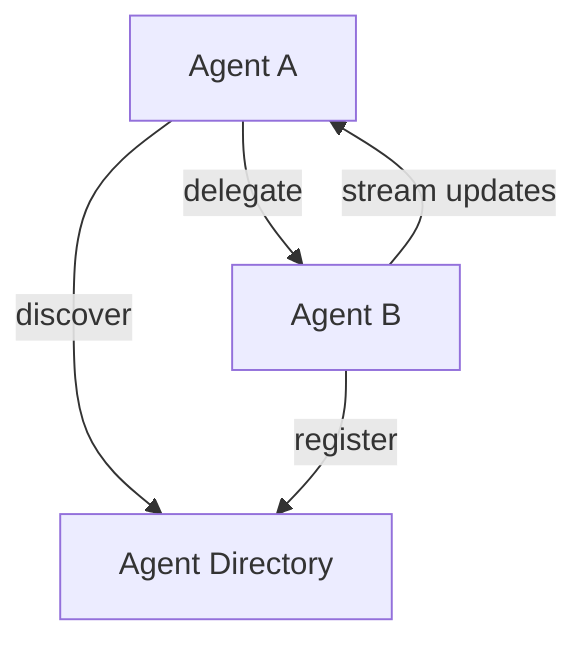

# Google A2A Protocol Formal Analysis

> **Stage**: Knowledge/06-frontier | **Prerequisites**: [MCP Protocol](mcp-protocol-formal-specification.md) | **Formal Level**: L4-L5
>
> **Protocol Version**: A2A 2025-04
>
> Formal analysis of Google's Agent-to-Agent protocol: architecture, discovery, task delegation, and security model.

---

## 1. Definitions

**Def-K-A2A-01: A2A Protocol Architecture**

Standardized communication mechanism for AI Agent interaction, supporting capability discovery, task delegation, async collaboration, and enterprise security.

**Def-K-A2A-02: Agent Discovery**

Mechanism for agents to advertise and discover capabilities:

$$
\text{Discovery}(A_i, A_j) = \{(cap, schema) \mid cap \in \text{Capabilities}(A_j) \land \text{match}(cap, \text{Need}(A_i))\}
$$

**Def-K-A2A-03: Task Delegation**

Transfer of task execution from one agent to another with atomic commitment.

**Def-K-A2A-04: Security Model**

Authentication, authorization, and audit framework for inter-agent communication.

---

## 2. Properties

**Prop-K-A2A-01: Agent Discovery Completeness**

All compatible agent pairs can discover each other within bounded rounds.

**Prop-K-A2A-02: Task Delegation Atomicity**

Task delegation follows atomic commit semantics: either fully accepted or fully rejected.

**Prop-K-A2A-03: Multi-Agent Collaboration Consistency**

Distributed task state remains consistent across all participating agents.

---

## 3. Relations

- **vs MCP**: A2A is agent-to-agent; MCP is model-to-tool.
- **vs Traditional RPC**: A2A supports async, stateful, long-running tasks.
- **with Streaming**: A2A task updates can be streamed via SSE.

---

## 4. Argumentation

**Protocol Design Choices**:

| Choice | Option A | Option B | Selected |
|--------|----------|----------|----------|
| Transport | JSON-RPC 2.0 | gRPC | JSON-RPC |
| Streaming | SSE | WebSocket | SSE |
| Task State | Stateful | Stateless | Stateful |

**Boundary Conditions**:

- Large-scale discovery: Requires registry service
- Task state explosion: Needs TTL and cleanup
- Security boundaries: OAuth 2.0 + mTLS

---

## 5. Engineering Argument

**Thm-K-A2A-01 (Task Delegation Correctness)**: Task delegation is correct if and only if the delegator receives exactly one of {accepted, rejected, timeout} and the delegatee's state reflects the task outcome.

**Thm-K-A2A-02 (Collaboration Security)**: Multi-agent collaboration is secure if all agents authenticate via mutual TLS and authorize actions via capability tokens.

---

## 6. Examples

```json
// A2A Agent Card (capability advertisement)
{
  "name": "数据分析Agent",
  "url": "https://agent.example.com/a2a",
  "version": "1.0",
  "capabilities": {
    "streaming": true,
    "pushNotifications": false
  },
  "skills": [
    {
      "id": "sql_analysis",
      "name": "SQL数据分析",
      "parameters": {
        "query": {"type": "string"},
        "database": {"type": "string"}
      }
    }
  ],
  "authentication": {
    "schemes": ["OAuth2"]
  }
}
```

---

## 7. Visualizations

**A2A Architecture**:



---

## 8. References
