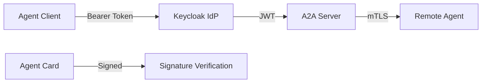

# A2A v0.3 Security Enhancements: Bearer Token, Keycloak, and mTLS

> **Stage**: Knowledge/06-frontier | **Prerequisites**: [A2A Protocol Analysis](../Knowledge/06-frontier/a2a-protocol-agent-communication.md), [MCP Protocol](../Knowledge/06-frontier/mcp-protocol-agent-streaming.md) | **Formal Level**: L3-L4
> **Status**: ✅ Released | **A2A v0.3**: April 2026 | **Last Updated**: 2026-04-21

---

## 1. Definitions

### Def-EN-06-01: A2A v0.3 Security Model

**Definition**: A2A v0.3 (April 2026) introduces three critical security enhancements for enterprise multi-Agent deployments:

$$
\mathcal{S}_{a2a}^{v0.3} = \langle \mathcal{I}_{bearer}, \mathcal{S}_{card}, \mathcal{M}_{mtls} \rangle
$$

| Component | Symbol | Description |
|-----------|--------|-------------|
| **Bearer Token Auth** | $\mathcal{I}_{bearer}$ | OAuth 2.0 Bearer token authentication with Keycloak integration |
| **Security Card Signing** | $\mathcal{S}_{card}$ | Digital signatures for Agent Cards to prevent tampering |
| **mTLS Enterprise** | $\mathcal{M}_{mtls}$ | Mutual TLS with mandatory client certificate verification |

---

### Def-EN-06-02: Task Security Lifecycle (TSL)

**Definition**: TSL defines the secure state transitions for A2A tasks from creation to completion:

$$
\text{TSL} = \langle \mathcal{T}, \Sigma_{sec}, \rightarrow_{sec}, \sigma_0, \mathcal{V}_{auth} \rangle
$$

**State Machine**:

```
unauthenticated --(Bearer Token Validation)--> authenticated
authenticated --(Permission Check/Role Mapping)--> authorized
authorized --(Task Execution)--> executing
executing --(Audit Logging)--> audited
```

---

## 2. Properties

### Lemma-EN-06-01: Bearer Token Freshness

**Statement**: Bearer tokens in A2A v0.3 have bounded freshness:

$$
\forall t_{token}: t_{current} - t_{issued} < TTL_{token}
$$

Default TTL: 1 hour for access tokens, 30 days for refresh tokens.

---

## 3. Relations

### 3.1 A2A v0.3 vs v1.0 Security Comparison

| Dimension | A2A v0.3 (Apr 2026) | A2A v1.0 (Early 2026) |
|-----------|---------------------|----------------------|
| Authentication | Bearer Token + Keycloak | OAuth 2.0, API Keys |
| Transport | mTLS (enterprise) | HTTPS (optional) |
| Agent Card | Digital signatures | Unsigned JSON |
| Audit | Standardized events | No standard |

---

## 4. Engineering Argument

### Why A2A v0.3 Security Matters

Enterprise deployments require:

1. **Identity Federation**: Keycloak integration enables SSO across Agent ecosystems
2. **Tamper Evidence**: Signed Agent Cards prevent MITM attacks on capability declarations
3. **Zero-Trust Networking**: mTLS ensures both client and server identity verification

---

## 5. Examples

### 5.1 Keycloak Authentication Implementation

```python
# A2A v0.3 Bearer Token + Keycloak
from a2a import A2AClient
import keycloak

class SecureA2AClient(A2AClient):
    def __init__(self, keycloak_url, realm, client_id):
        self.keycloak = keycloak.KeycloakOpenID(
            server_url=keycloak_url,
            realm_name=realm,
            client_id=client_id
        )

    async def authenticate(self) -> str:
        token = self.keycloak.token("user", "password")
        return token["access_token"]

    async def send_secure_task(self, agent_card, task):
        token = await self.authenticate()
        headers = {"Authorization": f"Bearer {token}"}
        return await self.send_task(agent_card, task, headers=headers)
```

### 5.2 Security Card Signing

```json
{
  "name": "SecureAnalyticsAgent",
  "url": "https://analytics.example.com/a2a",
  "signature": {
    "algorithm": "Ed25519",
    "public_key": "base64_encoded_pubkey",
    "signature": "base64_encoded_signature"
  }
}
```

---

## 6. Visualizations

### A2A v0.3 Security Architecture



---

## 7. References
