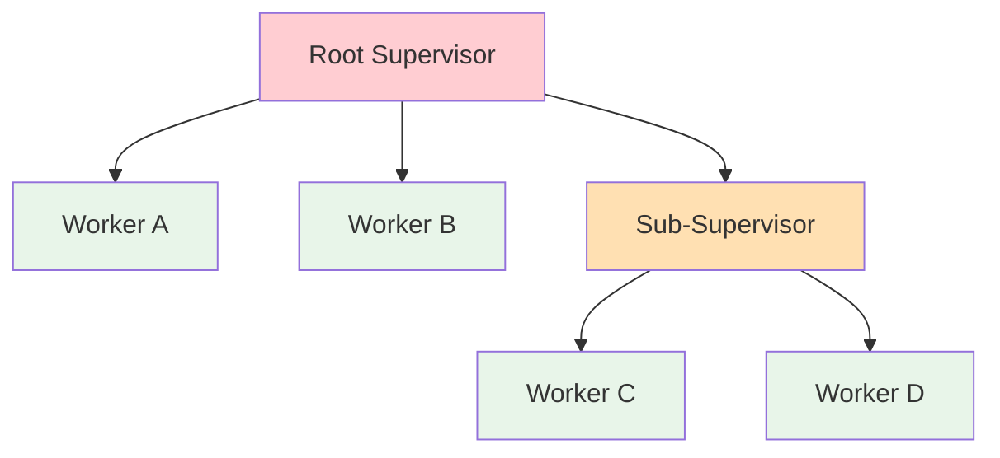

# Actor Model Formalization

> **Stage**: Struct | **Prerequisites**: [Process Calculus Primer](process-calculus-primer.md) | **Formalization Level**: L4-L5
> **Translation Date**: 2026-04-21

## Abstract

The **Actor Model** is a foundational paradigm for concurrent and distributed computation. This document provides a rigorous formalization of the classic Actor model, its behavioral semantics, and key properties including local determinism and supervision tree liveness.

---

## 1. Definitions

### Def-S-03-01. Actor (Classic Actor Model)

An actor is defined as a 4-tuple:

$$\mathcal{A}_{\text{classic}} = (\alpha, b, m, \sigma)$$

where:

- $\alpha \in \text{ActorID}$: unique identifier
- $b: \text{Msg} \times \Sigma \to \text{Behavior} \times \Sigma \times \mathcal{P}(\text{Msg} \times \text{ActorID})$: behavior function
- $m \in \text{Msg}^*$: mailbox (ordered sequence of messages)
- $\sigma \in \Sigma$: local state

### Def-S-03-02. Behavior

A **behavior** $b$ is a mapping from (message, state) to a triple (new behavior, new state, outgoing messages):

$$b(m, \sigma) = (b', \sigma', \{(m_1, \alpha_1), \ldots, (m_k, \alpha_k)\})$$

The behavior may change after processing each message (become semantics).

### Def-S-03-03. Mailbox

The **mailbox** $m$ is an ordered sequence of messages with the following operations:

- $\text{enqueue}(m, \text{msg})$: append message to mailbox
- $\text{dequeue}(m)$: remove and return the first message
- $\text{peek}(m)$: return the first message without removal

**Fairness property**: Every enqueued message is eventually dequeued (no infinite overtaking).

### Def-S-03-04. ActorRef

An **ActorRef** is an opaque, unforgeable reference to an actor. It supports only one operation:

$$\text{send}: \text{ActorRef} \times \text{Msg} \to \text{Unit}$$

**Location transparency**: The sender cannot distinguish between local and remote actors based on the ActorRef alone.

### Def-S-03-05. Supervision Tree

A **supervision tree** is a hierarchical structure $(V, E, s, r)$ where:

- $V \subseteq \text{ActorID}$: set of supervised actors
- $E \subseteq V \times V$: parent-child supervision edges
- $s: V \to \{\text{OneForOne}, \text{OneForAll}, \text{RestForOne}\}$: restart strategy
- $r: V \to \mathbb{N} \times \mathbb{T}$: restart limits (max restarts within time window)

---

## 2. Properties

### Lemma-S-03-01. Mailbox Serial Processing Lemma

For any actor $\mathcal{A}$ with mailbox $m = [\text{msg}_1, \text{msg}_2, \ldots]$, messages are processed in FIFO order. Given the same initial state $\sigma_0$ and identical message sequence, the final state is deterministic.

**Proof.** Direct consequence of the actor semantics: only one behavior invocation executes at a time, and mailbox ordering is preserved. ∎

### Lemma-S-03-02. Supervision Tree Fault Propagation Boundedness

In a supervision tree of depth $d$, a fault at level $i$ can affect at most the subtree rooted at the parent of the failing actor.

**Proof.** By construction of supervision strategies: faults bubble up to the immediate supervisor; the supervisor decides the restart scope based on $s(v)$. ∎

### Prop-S-03-01. ActorRef Opacity Implies Location Transparency

If ActorRef is truly opaque (no inspectable location information), then the sender's semantics cannot depend on the physical location of the target actor.

**Proof.** By contradiction: suppose sender semantics depend on location. Then there exist two actors with identical behavior but different locations yielding different sender results. This requires the sender to extract location from ActorRef—violating opacity. ∎

---

## 3. Relations

### Relation 1: Classic Actor $\subset$ Erlang Actor

Erlang actors extend the classic model with:

- Selective receive (pattern matching on mailbox)
- Links and monitors (bidirectional and unidirectional fault notification)
- Hot code loading (dynamic behavior replacement)

### Relation 2: Actor Model $\subset$ Asynchronous $\pi$-Calculus

Every Actor computation can be encoded in the asynchronous $\pi$-calculus. The encoding maps:

- Actor identity $\to$ channel name
- Message send $\to$ asynchronous channel output
- Behavior $\to$ replicated input process

### Relation 3: Erlang/OTP $\approx$ Akka Actor (Core Semantic Bisimulation)

The core semantics of Erlang/OTP and Akka Typed are weakly bisimilar for the common subset of features (spawn, send, receive, link, monitor).

### Relation 4: Actor Model $\leftrightarrow$ Dataflow Model (Turing-Complete Equivalence)

Both models are Turing-complete. There exist mutual encodings:

- Actor $\to$ Dataflow: map actors to operators, message sends to data channels
- Dataflow $\to$ Actor: map operators to actors, streams to message sequences

---

## 4. Argumentation

### 4.1 Why Mailbox Serial Processing is the Foundation of Actor Determinism

Serial processing guarantees that:

1. No race conditions exist within a single actor
2. State mutations are atomic at the message level
3. The only source of non-determinism is message delivery order

This is the **maximum determinism achievable** in an asynchronous distributed system.

### 4.2 Breaking the Determinism Boundary

Determinism is violated when:

- **Shared mutable state**: Actor accesses global mutable variables
- **Selective receive with timeouts**: Timeout handling introduces wall-clock dependency
- **Side effects in behavior**: I/O operations with non-deterministic results

### 4.3 Supervision Tree Depth vs. Restart Intensity Trade-off

| Depth | Granularity | Recovery Speed | Cascade Risk |
|-------|-------------|----------------|--------------|
| Shallow (1-2) | Coarse | Fast | High |
| Medium (3-5) | Balanced | Moderate | Moderate |
| Deep (6+) | Fine | Slow | Low |

---

## 5. Proofs

### Thm-S-03-01. Local Determinism Under Serial Mailbox Processing

For any actor $\mathcal{A} = (\alpha, b, m, \sigma)$ with deterministic behavior $b$ and initial state $\sigma_0$, if the mailbox processing order is fixed, then the sequence of states $(\sigma_0, \sigma_1, \ldots)$ is uniquely determined.

**Proof.** By induction on the number of processed messages.

- **Base case**: Before any message, state is $\sigma_0$ (unique).
- **Inductive step**: Assume state $\sigma_k$ is unique after $k$ messages. The $(k+1)$-th message $\text{msg}_{k+1}$ triggers $b(\text{msg}_{k+1}, \sigma_k) = (b', \sigma_{k+1}, \text{msgs}_{\text{out}})$. Since $b$ is deterministic and $\sigma_k$ is unique (by IH), $\sigma_{k+1}$ is unique. ∎

### Thm-S-03-02. Supervision Tree Liveness

In a well-formed supervision tree where:

1. Restart limits are finite ($r_{\max} < \infty$)
2. Persistent faults are escalated to higher levels
3. The root supervisor has a terminal restart policy

Then, with probability 1, the system either:

- Recovers to a stable state (no further restarts), or
- Terminates gracefully (root supervisor gives up)

**Proof Sketch.** Model as a Markov chain where states represent (actor health, restart count). Finite restart limits ensure the chain is absorbing. By the fundamental theorem of absorbing Markov chains, absorption occurs with probability 1. ∎

---

## 6. Examples

### Example 1: Akka Typed Counter Actor

```scala
// Scala / Akka Typed
sealed trait Command
final case class Increment() extends Command
final case class GetValue(replyTo: ActorRef[Int]) extends Command

val counter: Behavior[Command] = {
  def behavior(count: Int): Behavior[Command] =
    Behaviors.receiveMessage {
      case Increment() => behavior(count + 1)
      case GetValue(replyTo) =>
        replyTo ! count
        Behaviors.same
    }
  behavior(0)
}
```

### Example 2: Erlang OTP Supervision Tree

```erlang
% Erlang supervisor specification
init([]) ->
    SupFlags = #{strategy => one_for_all,
                 intensity => 5,
                 period => 10},
    ChildSpecs = [
        #{id => worker1,
          start => {worker1, start_link, []},
          restart => permanent,
          shutdown => 5000},
        #{id => worker2,
          start => {worker2, start_link, []},
          restart => transient,
          shutdown => 5000}
    ],
    {ok, {SupFlags, ChildSpecs}}.
```

---

## 7. Visualizations



**Supervision tree hierarchy**: Faults bubble up to the nearest supervisor with restart policy.

---

## 8. References
