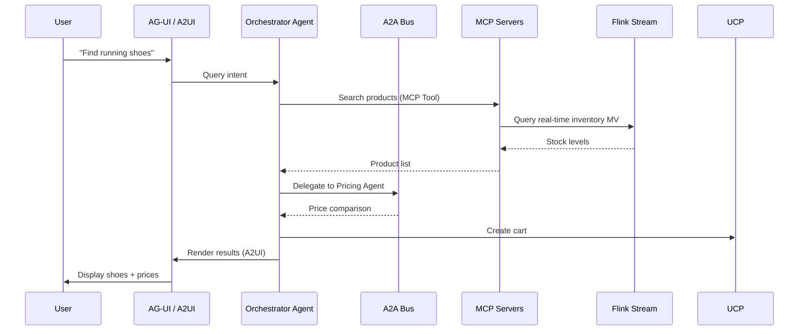

# AI Agent Protocol Stack (2026)

> **Language**: English | **Source**: [Knowledge/06-frontier/ai-agent-protocol-stack-2026.md](../Knowledge/06-frontier/ai-agent-protocol-stack-2026.md) | **Last Updated**: 2026-04-21

---

## 1. Definitions

### Def-K-06-EN-460: AI Agent Protocol Stack

The 2026 Agent interoperability six-layer protocol system:

$$
\text{Agent-Stack}_{2026} \triangleq \langle \text{MCP}, \text{A2A}, \text{UCP}, \text{AP2}, \text{A2UI}, \text{AG-UI} \rangle
$$

| Protocol | Full Name | Scope | Direction | Core Abstraction |
|----------|-----------|-------|-----------|-----------------|
| **MCP** | Model Context Protocol | Agent ↔ Tool/Data | Client → Server | Resources, Tools, Prompts |
| **A2A** | Agent-to-Agent Protocol | Agent ↔ Agent | Peer-to-peer | Tasks, Messages, Artifacts |
| **UCP** | Unified Commerce Protocol | Agent ↔ Commerce | Standardized commerce | Product, Cart, Order |
| **AP2** | Agent Payment Protocol | Agent ↔ Payment | Payment authorization | Intent, Authorization, Receipt |
| **A2UI** | Agent-to-User Interface | Agent → UI | What to render | Component, Layout, Content |
| **AG-UI** | Agent Graphical UI | Agent → User | How to render | Stream, Animation, Interaction |

### Def-K-06-EN-461: Protocol Layering Model

```
┌─────────────────────────────────────────────┐
│  Presentation Layer: A2UI / AG-UI            │
│  (User-facing rendering & interaction)       │
├─────────────────────────────────────────────┤
│  Application Layer: A2A / UCP / AP2          │
│  (Agent coordination & commerce)             │
├─────────────────────────────────────────────┤
│  Data Layer: MCP                             │
│  (Tool access & context retrieval)           │
├─────────────────────────────────────────────┤
│  Transport Layer: HTTP/SSE / gRPC / WebRTC   │
│  (Underlying communication)                  │
└─────────────────────────────────────────────┘
```

## 2. Comparison Matrix

| Dimension | MCP | A2A | UCP | AP2 | A2UI | AG-UI |
|-----------|-----|-----|-----|-----|------|-------|
| **Maturity** | High | Medium | Low | Low | Low | Low |
| **Spec status** | Released v1.0 | v0.3 draft | Proposal | Proposal | Proposal | Proposal |
| **Primary author** | Anthropic | Google | Community | Community | Community | Community |
| **Flink integration** | Source/Sink | Message bus | — | — | — | — |

## 3. Streaming Integration

| Protocol | Flink Role | Integration Pattern |
|----------|-----------|---------------------|
| **MCP** | Real-time data layer | MCP Resource → Flink Source; Flink MV → MCP Resource |
| **A2A** | Reliable message bus | Flink DataStream transports A2A messages with exactly-once |
| **UCP** | Transaction stream | Flink processes order events for inventory/compliance |
| **AP2** | Audit log pipeline | Flink aggregates payment events for reconciliation |

## 4. E-Commerce Agent Example



## References

[^1]: Google Developers Blog, "The Agent Stack", 2026.
[^2]: Anthropic MCP Specification, https://modelcontextprotocol.io/
[^3]: Google A2A Protocol, https://google.github.io/A2A/
