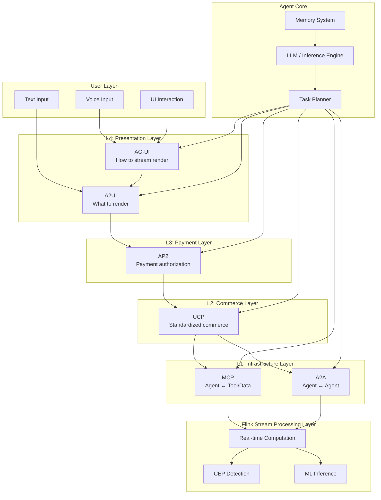
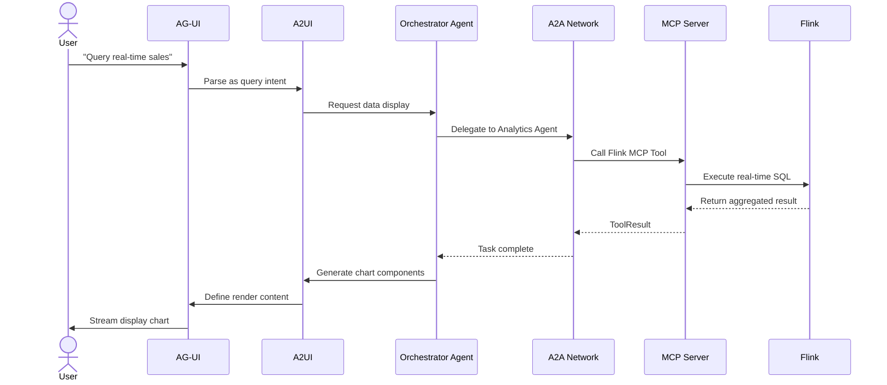
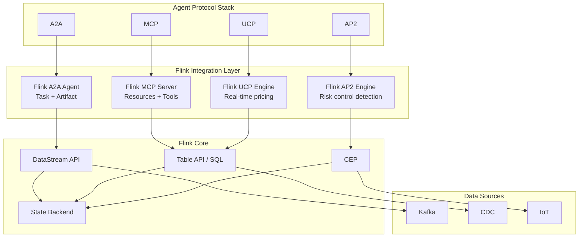

# AI Agent Protocol Stack Layered Architecture (2026)

> **Status**: ✅ Published | **Risk Level**: Medium | **Last Updated**: 2026-04-21
>
> This document systematically reviews the six major protocol stacks in the AI Agent domain for 2026: MCP, A2A, UCP, AP2, A2UI, and AG-UI, analyzing their layered positioning, comparison matrix, and integration points with Flink stream processing.
>
> **Stage**: Knowledge/06-frontier | **Prerequisites**: [MCP Protocol Analysis](mcp-protocol-agent-streaming.md), [A2A Protocol Analysis](a2a-protocol-agent-communication.md) | **Formalization Level**: L3-L4

## Table of Contents

- [AI Agent Protocol Stack Layered Architecture (2026)](#ai-agent-protocol-stack-layered-architecture-2026)
  - [Table of Contents](#table-of-contents)
  - [1. Definitions](#1-definitions)
    - [Def-EN-06-03: AI Agent Protocol Stack (Six-Protocol Stack)](#def-en-06-03-ai-agent-protocol-stack-six-protocol-stack)
    - [Def-EN-06-04: Protocol Layering Model](#def-en-06-04-protocol-layering-model)
    - [Def-EN-06-05: Streaming Protocol Integration Point](#def-en-06-05-streaming-protocol-integration-point)
  - [2. Properties](#2-properties)
    - [Lemma-EN-06-02: Protocol Orthogonality](#lemma-en-06-02-protocol-orthogonality)
    - [Prop-EN-06-02: Layered Composition Security](#prop-en-06-02-layered-composition-security)
  - [3. Relations](#3-relations)
    - [3.1 Six-Protocol Comparison Matrix](#31-six-protocol-comparison-matrix)
    - [3.2 Protocol-to-Stream-Processing Mapping](#32-protocol-to-stream-processing-mapping)
    - [3.3 Protocol Collaboration Scenarios](#33-protocol-collaboration-scenarios)
  - [4. Argumentation](#4-argumentation)
    - [4.1 Why a Six-Layer Protocol Stack?](#41-why-a-six-layer-protocol-stack)
    - [4.2 Engineering Trade-offs in Protocol Selection](#42-engineering-trade-offs-in-protocol-selection)
  - [5. Proof / Engineering Argument](#5-proof--engineering-argument)
    - [Thm-EN-06-02: Protocol Stack Completeness Theorem](#thm-en-06-02-protocol-stack-completeness-theorem)
  - [6. Examples](#6-examples)
    - [6.1 E-commerce Agent Full Protocol Stack Example](#61-e-commerce-agent-full-protocol-stack-example)
    - [6.2 Flink as Protocol Stack Data Layer](#62-flink-as-protocol-stack-data-layer)
  - [7. Visualizations](#7-visualizations)
    - [7.1 Six-Protocol Layered Architecture Diagram](#71-six-protocol-layered-architecture-diagram)
    - [7.2 Protocol Interaction Sequence Diagram](#72-protocol-interaction-sequence-diagram)
    - [7.3 Flink Integration Panorama](#73-flink-integration-panorama)
  - [8. References](#8-references)

---

## 1. Definitions

### Def-EN-06-03: AI Agent Protocol Stack (Six-Protocol Stack)

The **AI Agent Protocol Stack** is a six-layer protocol system for Agent interoperability proposed by the Google Developers Blog in 2026[^1], formally defined as:

$$
\text{Agent-Stack}_{2026} \triangleq \langle \text{MCP}, \text{A2A}, \text{UCP}, \text{AP2}, \text{A2UI}, \text{AG-UI} \rangle
$$

Definitions and positioning of each protocol:

| Protocol | Full Name | Positioning | Communication Direction | Core Abstraction |
|----------|-----------|-------------|------------------------|------------------|
| **MCP** | Model Context Protocol | Agent ↔ Tool/Data | Client → Server | Resources, Tools, Prompts |
| **A2A** | Agent-to-Agent Protocol | Agent ↔ Agent | Peer collaboration | Tasks, Messages, Artifacts |
| **UCP** | Unified Commerce Protocol | Agent ↔ Commerce | Standardized commerce | Product, Cart, Order |
| **AP2** | Agent Payment Protocol | Agent ↔ Payment | Payment authorization | Intent, Authorization, Receipt |
| **A2UI** | Agent-to-User Interface | Agent → UI | What to render | Component, Layout, Content |
| **AG-UI** | Agent Graphical UI | Agent → User | How to render | Stream, Animation, Interaction |

**Protocol Evolution Timeline**:

| Time | Event |
|------|-------|
| 2024-11 | Anthropic releases MCP |
| 2025-04 | Google releases A2A |
| 2025-06 | Linux Foundation establishes LF A2A Project |
| 2025-12 | Anthropic donates MCP to Linux Foundation AAIF |
| 2026-03 | Google Developers Blog proposes six-layer protocol stack[^1] |
| 2026-04 | A2A v0.3 releases security enhancements; MCP reaches 97M+ monthly downloads[^2][^3] |

### Def-EN-06-04: Protocol Layering Model

The **Protocol Layering Model** maps the six protocols to an OSI-style hierarchical structure:

$$
\text{Layer}(p) = \begin{cases}
L_1 & \text{if } p \in \{\text{MCP}, \text{A2A}\} \quad \text{(Infrastructure Layer)} \\
L_2 & \text{if } p = \text{UCP} \quad \text{(Commerce Protocol Layer)} \\
L_3 & \text{if } p = \text{AP2} \quad \text{(Payment Protocol Layer)} \\
L_4 & \text{if } p \in \{\text{A2UI}, \text{AG-UI}\} \quad \text{(Presentation Layer)}
\end{cases}
$$

**Layer Responsibilities**:

```
┌─────────────────────────────────────────────┐
│  L4: Presentation Layer                     │
│  ├─ A2UI: Defines what to render            │
│  └─ AG-UI: Defines how to stream render     │
├─────────────────────────────────────────────┤
│  L3: Payment Layer                          │
│  └─ AP2: Payment authorization & settlement │
├─────────────────────────────────────────────┤
│  L2: Commerce Layer                         │
│  └─ UCP: Standardized product/service trade │
├─────────────────────────────────────────────┤
│  L1: Infrastructure Layer                   │
│  ├─ MCP: Agent ↔ Tool/Data                  │
│  └─ A2A: Agent ↔ Agent (collaboration)      │
└─────────────────────────────────────────────┘
```

### Def-EN-06-05: Streaming Protocol Integration Point

The **Streaming Protocol Integration Point (SPIP)** defines the interaction position between stream processing systems (Flink/RisingWave) and the Agent protocol stack:

$$
\text{SPIP} \triangleq \langle \mathcal{F}, \mathcal{P}_{target}, \phi_{bind}, \psi_{data} \rangle
$$

Where:

- $\mathcal{F}$: Flink stream processing system
- $\mathcal{P}_{target}$: Target protocol layer $\{\text{MCP}, \text{A2A}, \text{UCP}\}$
- $\phi_{bind}$: Binding mode (Server / Client / Bridge)
- $\psi_{data}$: Data mapping function

**Integration Matrix**:

| Protocol | Flink Role | Integration Mode | Data Mapping |
|----------|-----------|------------------|--------------|
| **MCP** | MCP Server | Stream data as Resource/Tool | DataStream → Resource URI |
| **A2A** | Remote Agent | Flink as Specialist Agent | Window Result → Artifact |
| **UCP** | Real-time pricing engine | Stream processing drives dynamic pricing | CEP → Price Update |
| **AP2** | Risk control engine | Real-time fraud detection | Anomaly Score → Block/Risk |

---

## 2. Properties

### Lemma-EN-06-02: Protocol Orthogonality

**Lemma**: Protocols in the six-layer stack are pairwise orthogonal; i.e., protocols within the same layer do not overlap, and protocols from different layers can be composed:

$$
\forall p_i, p_j \in \text{Agent-Stack}, i \neq j: \text{Scope}(p_i) \cap \text{Scope}(p_j) = \emptyset \lor \text{Layer}(p_i) \neq \text{Layer}(p_j)
$$

**Proof Sketch**:

1. MCP and A2A, although both in L1, communicate with different targets (Tool vs Agent); orthogonality has been proven in the A2A-MCP orthogonality theorem
2. UCP, AP2, A2UI, and AG-UI each cover different business domains with no functional overlap
3. Different-layer protocols interact through clear interface boundaries

### Prop-EN-06-02: Layered Composition Security

**Proposition**: If each layer's protocol independently satisfies security properties, then the composed protocol stack satisfies end-to-end security:

$$
\bigwedge_{i=1}^{4} \text{Secure}(L_i) \Rightarrow \text{Secure}(\text{Agent-Stack})
$$

**Constraint**: Inter-layer interfaces must implement proper authentication and authorization delegation (refer to AIP identity protocols).

---

## 3. Relations

### 3.1 Six-Protocol Comparison Matrix

| Dimension | MCP | A2A | UCP | AP2 | A2UI | AG-UI |
|-----------|-----|-----|-----|-----|------|-------|
| **Publisher** | Anthropic → LF AAIF | Google → LF A2A | Industry Alliance | Financial Industry | Google | Google |
| **Governance** | LF AAIF | LF A2A Project | Open Standard | PCI/ISO | Community Draft | Community Draft |
| **Transport** | JSON-RPC / SSE | HTTP / SSE / JSON-RPC | HTTP / gRPC | HTTPS / mTLS | JSON / HTML | SSE / WebSocket |
| **State** | Optional stateful | Task lifecycle | Transaction state | Payment state | Stateless | Session state |
| **Maturity** | ⭐⭐⭐⭐⭐ | ⭐⭐⭐⭐ | ⭐⭐ | ⭐⭐ | ⭐⭐⭐ | ⭐⭐⭐ |
| **Ecosystem Scale** | 97M+ monthly downloads | 150+ organizations | Early | Early | Early | Early |

### 3.2 Protocol-to-Stream-Processing Mapping

```
┌─────────────────────────────────────────────────────────────────┐
│                        AI Agent Protocol Stack                  │
├─────────────────────────────────────────────────────────────────┤
│  L4: A2UI / AG-UI                                               │
│     ↕ Render data binding                                        │
│  L3: AP2                                                        │
│     ↕ Payment risk control results                               │
│  L2: UCP                                                        │
│     ↕ Real-time pricing/inventory                                │
│  L1: MCP          L1: A2A                                       │
│     ↕                ↕                                           │
│  Flink MCP Server  Flink A2A Agent                              │
│  ├─ Resources      ├─ Task Handler                              │
│  ├─ Tools          ├─ Agent Card                                │
│  └─ Prompts        └─ Artifact Producer                         │
├─────────────────────────────────────────────────────────────────┤
│                    Flink Stream Processing Runtime               │
│  ├─ DataStream API (Real-time computation)                      │
│  ├─ Table API / SQL (Query analytics)                           │
│  ├─ CEP (Pattern detection)                                     │
│  └─ State Backend (State management)                            │
├─────────────────────────────────────────────────────────────────┤
│                    Data Sources & Storage                        │
│  Kafka / Pulsar / Iceberg / JDBC / S3                          │
└─────────────────────────────────────────────────────────────────┘
```

### 3.3 Protocol Collaboration Scenarios

**Scenario 1: Intelligent E-commerce Assistant**

```
User: "Help me buy a jacket suitable for spring hiking"
  ↓
[AG-UI] Render voice/text input interface
  ↓
[A2UI] Determine need to display product list, price, reviews
  ↓
[A2A] Orchestrator Agent decomposes task:
       ├─ Search Agent → Search products
       ├─ Review Agent → Analyze reviews
       └─ Price Agent → Real-time pricing
  ↓
[MCP] Price Agent calls Flink MCP Server:
       ├─ Tool: "query_realtime_inventory"
       └─ Resource: "pricing://dynamic/spring_jackets"
  ↓
[UCP] Build shopping cart, standardize product information
  ↓
[AP2] Execute payment authorization after user confirmation
  ↓
[AG-UI] Stream display order confirmation and logistics tracking
```

**Scenario 2: Real-time Risk Control**

```
Payment request → [AP2] Risk control check
              ↓
         [MCP] Call Flink MCP Tool:
                "fraud_detection_realtime"
                Parameters: {user_id, amount, merchant, device}
              ↓
         [Flink] CEP engine detects anomaly patterns:
                 ├─ Off-location login + large payment
                 ├─ Multiple transactions in short time
                 └─ Device fingerprint anomaly
              ↓
         [AP2] Return risk score → Approve/Reject/Manual review
```

---

## 4. Argumentation

### 4.1 Why a Six-Layer Protocol Stack?

**Problems with Existing Approaches**:

1. **Monolithic Protocol Bloat**: Cramming all functionality into MCP or A2A would cause exponential protocol complexity growth
2. **Insufficient Domain Expertise**: Payment, commerce, and UI rendering require domain experts for design
3. **Mismatched Evolution Speed**: Infrastructure layers (MCP/A2A) are stabilizing, while application layers (UCP/AP2) iterate rapidly

**Advantages of Layered Architecture**:

$$
\text{Complexity}_{monolithic} = O(n^2) \gg \text{Complexity}_{layered} = O(n)
$$

Where $n$ is the number of protocol functions. After layering, each layer can evolve independently:

- MCP/A2A are governed by LF foundations, pursuing long-term stability
- UCP/AP2 are advanced by industry alliances, adapting to commercial changes
- A2UI/AG-UI are iterated by frontend communities, keeping up with UX trends

### 4.2 Engineering Trade-offs in Protocol Selection

| Requirement | Recommended Protocol | Avoid Protocol | Reason |
|-------------|---------------------|----------------|--------|
| Agent queries database | MCP | A2A | MCP designed for tools/data |
| Multi-Agent collaboration | A2A | MCP | A2A has Task lifecycle management |
| Real-time data push | MCP + SSE | Polling REST | SSE supports streaming push |
| E-commerce transaction | UCP + AP2 | Custom protocol | Standardization reduces integration cost |
| Voice interaction | AG-UI + A2UI | Pure text | AG-UI defines streaming audio rendering |

---

## 5. Proof / Engineering Argument

### Thm-EN-06-02: Protocol Stack Completeness Theorem

**Theorem**: The six-layer protocol stack covers all external interaction needs of AI Agent systems:

$$
\forall \text{interaction} \in \text{Agent-External}: \exists p \in \text{Agent-Stack}: \text{Covers}(p, \text{interaction})
$$

**Proof Sketch**:

1. **Data Acquisition**: MCP covers Agent → Tool/Data (guaranteed by MCP design goals)
2. **Collaboration Orchestration**: A2A covers Agent → Agent (guaranteed by A2A design goals)
3. **Commercial Transactions**: UCP covers Agent → Commerce (guaranteed by product/order abstractions)
4. **Fund Transfer**: AP2 covers Agent → Payment (guaranteed by payment authorization abstractions)
5. **Content Presentation**: A2UI covers Agent → UI content (guaranteed by component abstractions)
6. **Interaction Experience**: AG-UI covers Agent → User interaction (guaranteed by streaming rendering abstractions)

**Engineering Significance**: When building enterprise Agent systems, no custom protocols are needed; simply select and compose the appropriate subset from the six-layer protocol stack.

---

## 6. Examples

### 6.1 E-commerce Agent Full Protocol Stack Example

```python
# ecommerce_agent.py
class EcommerceAgent:
    """E-commerce Agent using the complete six-layer protocol stack"""

    def __init__(self):
        self.mcp = MCPClient()
        self.a2a = A2AClient()
        self.ucp = UCPClient()
        self.ap2 = AP2Client()
        self.a2ui = A2UIClient()
        self.agui = AGUIClient()

    async def handle_purchase(self, user_request: str):
        """Process user purchase request"""

        # L1: MCP - Query real-time inventory and pricing
        inventory = await self.mcp.call_tool(
            "flink_query",
            {"sql": "SELECT * FROM inventory WHERE category = 'jackets'"}
        )

        # L1: A2A - Coordinate multiple Specialist Agents
        search_task = await self.a2a.send_task(
            "search-agent",
            {"query": user_request, "inventory": inventory}
        )
        review_task = await self.a2a.send_task(
            "review-agent",
            {"product_ids": search_task.result["ids"]}
        )

        # L2: UCP - Build standardized shopping cart
        cart = await self.ucp.create_cart({
            "items": search_task.result["products"],
            "currency": "USD"
        })

        # A2UI: Generate cart display components
        ui_components = await self.a2ui.render({
            "type": "cart_summary",
            "data": cart,
            "layout": "mobile"
        })

        # AG-UI: Stream render to user interface
        await self.agui.stream_render(ui_components)

        # After user confirmation...
        # L3: AP2 - Execute payment authorization
        payment = await self.ap2.authorize({
            "amount": cart.total,
            "currency": "USD",
            "source": "user_payment_method"
        })

        return {"cart": cart, "payment": payment}
```

### 6.2 Flink as Protocol Stack Data Layer

```java
// FlinkSixProtocolBridge.java
public class FlinkSixProtocolBridge {

    /**
     * Flink simultaneously serves as MCP Server and A2A Remote Agent
     */
    public void start() {
        // MCP Layer: Expose stream data as Resources and Tools
        McpServer mcpServer = McpServer.create()
            .resource("flink://realtime/pricing", this::getDynamicPricing)
            .tool("fraud_detect", this::detectFraud)
            .build();

        // A2A Layer: Act as Specialist Agent
        A2AAgent a2aAgent = A2AAgent.builder()
            .agentCard(new AgentCard(
                "FlinkAnalyticsAgent",
                Set.of("realtime_analytics", "fraud_detection")
            ))
            .taskHandler(this::handleAnalyticsTask)
            .build();

        // UCP Layer: Real-time pricing calculation
        UCPPricingEngine pricing = new UCPPricingEngine(
            env.addSource(new KafkaSource<>("inventory_updates"))
               .keyBy(InventoryEvent::getProductId)
               .process(new DynamicPricingFunction())
        );

        // Start all services
        mcpServer.start(3000);
        a2aAgent.start(8080);
    }
}
```

---

## 7. Visualizations

### 7.1 Six-Protocol Layered Architecture Diagram



### 7.2 Protocol Interaction Sequence Diagram



### 7.3 Flink Integration Panorama



---

## 8. References

[^1]: Google Developers Blog, "The Six-Layer AI Agent Protocol Stack", 2026-03-18. <https://developers.googleblog.com/>
[^2]: Model Context Protocol, "MCP Ecosystem Statistics", 2026-04. <https://modelcontextprotocol.io/>
[^3]: Google, "A2A v0.3 Release Notes", 2026-04. <https://google.github.io/A2A/>

---

*Document Version: v1.0 | Created: 2026-04-21 | Status: Active*
*Theorem Registry: Def-EN-06-03~05, Lemma-EN-06-02, Prop-EN-06-02, Thm-EN-06-02*
