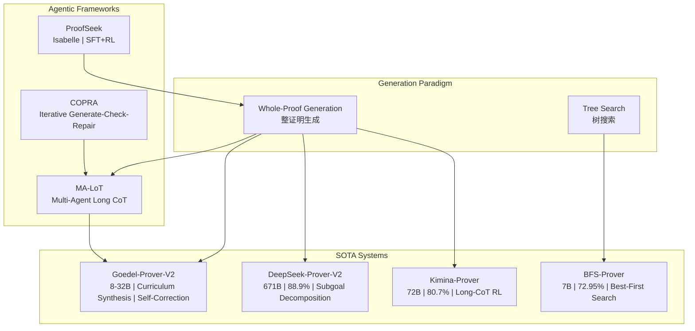
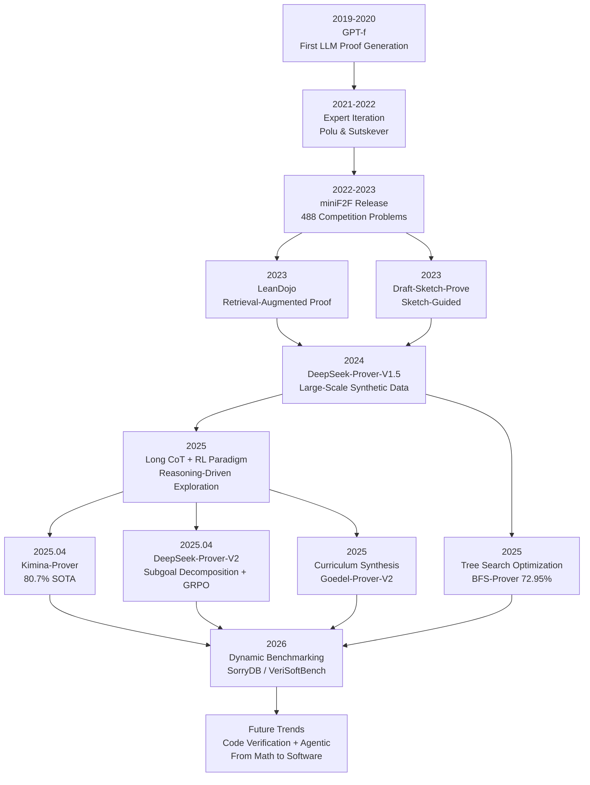

> **Status**: 🔮 Forward-Looking Content | **Risk Level**: High | **Last Updated**: 2026-04
>
> The content described in this document is in early planning stages and may differ from the final implementation. Please refer to the official releases of each prover system for authoritative information.

# AI-Assisted Formal Proof: 2025 SOTA Survey

> **Stage**: Struct/06-frontier | **Prerequisites**: [../04-proofs/](../04-proofs/) | **Formalization Level**: L3-L4 | **Theoretical Framework**: Neural Theorem Proving + RL + Agentic

---

## Table of Contents

- [AI-Assisted Formal Proof: 2025 SOTA Survey](#ai-assisted-formal-proof-2025-sota-survey)
  - [Table of Contents](#table-of-contents)
  - [Abstract](#abstract)
  - [1. Definitions](#1-definitions)
    - [Def-S-33-01. Neural Theorem Prover (神经定理证明器)](#def-s-33-01-neural-theorem-prover-神经定理证明器)
    - [Def-S-33-02. Proof Search Space and Verifier Feedback](#def-s-33-02-proof-search-space-and-verifier-feedback)
    - [Def-S-33-03. Reasoning-Driven Exploration Paradigm (推理驱动的探索范式)](#def-s-33-03-reasoning-driven-exploration-paradigm-推理驱动的探索范式)
  - [2. Properties](#2-properties)
    - [Lemma-S-33-01. Test-Time Scaling Monotonicity](#lemma-s-33-01-test-time-scaling-monotonicity)
    - [Prop-S-33-01. Convergence of Agentic Proof Loops](#prop-s-33-01-convergence-of-agentic-proof-loops)
    - [Lemma-S-33-02. Completeness Bound for Retrieval-Augmented Proof Premise Selection](#lemma-s-33-02-completeness-bound-for-retrieval-augmented-proof-premise-selection)
  - [3. Relations](#3-relations)
    - [Relation 1: Whole-Proof Generation ↔ Tree-Search Proof](#relation-1-whole-proof-generation--tree-search-proof)
    - [Relation 2: Mathematical Proof ↦ Software Verification](#relation-2-mathematical-proof--software-verification)
    - [Relation 3: Formal Reasoning ↔ Informal Reasoning](#relation-3-formal-reasoning--informal-reasoning)
  - [4. Argumentation](#4-argumentation)
    - [4.1 The Transfer Gap from Mathematics to Code Verification](#41-the-transfer-gap-from-mathematics-to-code-verification)
    - [4.2 Test-Time Scaling: Sequential vs. Parallel Scaling](#42-test-time-scaling-sequential-vs-parallel-scaling)
  - [5. Proof / Engineering Argument](#5-proof--engineering-argument)
    - [Thm-S-33-01. Performance Upper Bound of RL-Enhanced Theorem Proving](#thm-s-33-01-performance-upper-bound-of-rl-enhanced-theorem-proving)
  - [6. Examples](#6-examples)
    - [6.1 Kimina-Prover: Long-CoT RL Reasoning](#61-kimina-prover-long-cot-rl-reasoning)
    - [6.2 DeepSeek-Prover-V2: Explicit Subgoal Decomposition](#62-deepseek-prover-v2-explicit-subgoal-decomposition)
    - [6.3 Goedel-Prover-V2: Curriculum-Driven Data Synthesis](#63-goedel-prover-v2-curriculum-driven-data-synthesis)
    - [6.4 ProofSeek: AWS S3 Policy Verification](#64-proofseek-aws-s3-policy-verification)
    - [6.5 AutoVerus: Automated Rust Code Verification](#65-autoverus-automated-rust-code-verification)
  - [7. Visualizations](#7-visualizations)
    - [Figure 7.1: Comparison Matrix of Mainstream Neural Theorem Provers in 2025](#figure-71-comparison-matrix-of-mainstream-neural-theorem-provers-in-2025)
    - [Figure 7.2: Technology Evolution Tree of AI-Assisted Formal Proof](#figure-72-technology-evolution-tree-of-ai-assisted-formal-proof)
  - [8. References](#8-references)

---

## Abstract

In 2025, AI-assisted formal proof underwent a paradigm shift from **search-driven** to **reasoning-driven**. **Kimina-Prover** (80.7%)[^1], **DeepSeek-Prover-V2** (88.9%)[^2], and **Goedel-Prover-V2**[^3] pushed automated proof success rates higher through large-scale RL, subgoal decomposition, and curriculum-driven data synthesis. **BFS-Prover** (72.95%)[^4] challenged the dominance of MCTS; **Lean-SMT** (CAV 2025)[^5] deeply integrated SMT into Lean 4; **AutoVerus** (OOPSLA 2025)[^6] achieved end-to-end automated verification for Rust code. Agentic frameworks such as **COPRA**[^7] and **ProofSeek**[^8] extended application scenarios to security policy verification.

**Keywords**: Neural Theorem Proving, Lean 4, RL, Agentic Proof, Test-Time Scaling

---

## 1. Definitions

### Def-S-33-01. Neural Theorem Prover (神经定理证明器)

**Definition**: A neural theorem prover is an automated proof generation system parameterized by a large language model, outputting formal proof scripts and verified by a proof assistant kernel.

**Formal Statement**:

$$
\mathcal{P} = (\mathcal{M}, \mathcal{T}, \mathcal{V}, R, \pi_\theta)
$$

| Component | Type | Semantics |
|-----------|------|-----------|
| $\mathcal{M}$ | LLM | Language model with parameters $\theta$, $\mathcal{M}_\theta: \text{Prompt} \rightarrow \text{Distribution}(\text{ProofScript})$ |
| $\mathcal{T}$ | TacticSpace | Set of valid tactics / proof statements for the target proof assistant |
| $\mathcal{V}$ | Verifier | Proof verifier, $\mathcal{V}: \text{ProofScript} \times \text{Theorem} \rightarrow \{0, 1\}$ |
| $R$ | Reward | Reward function, $R = 1$ iff $\mathcal{V}(p, t) = 1$ |
| $\pi_\theta$ | Policy | Policy network generating probability distribution over proof candidates $p \sim \pi_\theta(\cdot \mid t)$ |

**Two Generation Paradigms**:

1. **Whole-Proof Generation**: The model outputs a complete proof script in one pass, which is verified end-to-end by the verifier.
2. **Step-by-Step Generation / Tree Search**: The model generates tactics one at a time, querying the verifier after each step to obtain a new proof state, searching over the proof state tree.

### Def-S-33-02. Proof Search Space and Verifier Feedback

**Definition**: The proof search space is a directed tree $\mathcal{S} = (N, E, \sigma_0, \mathcal{G})$, where nodes are proof states, edges are tactic applications, the root node is the initial goal to be proved, and the goal node set $\mathcal{G}$ contains all terminal states where the proof is complete.

**Formal Statement**:

$$
N = \{\sigma \mid \sigma \text{ is a proof state}\}, \quad E = \{(\sigma, s, \sigma') \mid \sigma' = \mathcal{V}_{\text{step}}(\sigma, s)\}
$$

**Key Observation**: The binary feedback provided by the verifier is a **sparse reward signal**. To improve credit assignment, 2025 SOTA systems universally introduce **process rewards** or **verifier-integrated reasoning**[^9].

### Def-S-33-03. Reasoning-Driven Exploration Paradigm (推理驱动的探索范式)

**Definition**: Reasoning-driven exploration is a paradigm that does not rely on external search algorithms but instead leverages the LLM's internal reasoning capability (via long chain-of-thought) to implicitly unfold the proof search space.

**Formal Statement**:

$$
r = (\underbrace{r_1, r_2, ..., r_m}_{\text{reasoning tokens}}, \underbrace{s_1, s_2, ..., s_n}_{\text{proof tokens}})
$$

Where reasoning tokens simulate human mathematicians' problem-solving strategies—including path exploration, reflective correction, and small-scale case analysis[^1].

| Dimension | Tree Search (BFS/MCTS) | Reasoning-Driven (Long CoT) |
|-----------|------------------------|----------------------------|
| Search Control | External algorithm | Model internal reasoning tokens |
| Sample Efficiency | Low (multiple LLM calls) | High (single generation) |
| Representative System | BFS-Prover | Kimina-Prover |

---

## 2. Properties

### Lemma-S-33-01. Test-Time Scaling Monotonicity

**Lemma**: For a sampling-based neural theorem prover, let $p_k$ be the probability of finding at least one correct proof under $k$ independent samples. Then:

$$
p_k = 1 - (1 - p_1)^k
$$

Where $p_1$ is the pass probability of a single sample (pass@1).

**Proof Sketch**: Each sample is a Bernoulli trial; the probability of all $k$ samples failing is $(1 - p_1)^k$, so the probability of at least one success is $1 - (1 - p_1)^k$. Clearly $p_{k+1} > p_k$, i.e., monotonically increasing. ∎

**Corollary**: Sample efficiency $p_1$ determines the marginal return of Test-Time Scaling. Kimina-Prover pass@1 = 52.94%[^1], reaching competitive levels with only a small number of samples.

### Prop-S-33-01. Convergence of Agentic Proof Loops

**Proposition**: Consider an Agentic proof framework where each iteration performs (generate → verify → repair). If the repair strategy eliminates errors with positive probability $\epsilon > 0$ within a finite number of steps, then the loop converges in finite expected steps, and the expected convergence rounds $\mathbb{E}[T] \leq 1/\epsilon$.

**Engineering Significance**: Systems such as COPRA[^7], MA-LoT[^10], and ProofSeek[^8] are designed based on this convergence property for multi-round iteration. In practice, syntax errors are easy to fix (high $\epsilon$), while strategic errors may require human intervention. ∎

### Lemma-S-33-02. Completeness Bound for Retrieval-Augmented Proof Premise Selection

**Lemma**: Let the set of premises relied upon by the theorem to be proved be $\mathcal{L}$ ($|\mathcal{L}| = m$), the candidate set returned by the retrieval system be $\hat{\mathcal{L}}$ ($|\hat{\mathcal{L}}| = k$), and the recall rate be $r$. Without introducing irrelevant premises, the upper bound on the probability of a successful proof is:

$$
\mathbb{P}[\text{success} \mid \hat{\mathcal{L}}] \leq \min\left(1, \frac{k \cdot r}{m}\right) \cdot \mathbb{P}[\text{success} \mid \mathcal{L}]
$$

**Intuitive Explanation**: This lemma quantifies the fundamental tension in systems such as LeanDojo[^11]—the retrieval window $k$ is limited while the true dependency $m$ in Mathlib4 may exceed 100. Kimina-Prover alleviates this problem by integrating retrieval into long-CoT reasoning[^1]. ∎

---

## 3. Relations

### Relation 1: Whole-Proof Generation ↔ Tree-Search Proof

In 2025, neural theorem proving systems formed two technical routes:

- **Whole-Proof Generation Route**: Kimina-Prover[^1], DeepSeek-Prover-V2[^2], Goedel-Prover-V2[^3]—train models to directly generate complete proofs through large-scale RL.
- **Tree-Search Route**: BFS-Prover[^4], LeanDojo + ReProver[^11]—maintain tactic-level interaction, using external search algorithms to navigate the proof space.

The two routes are mathematically equivalent: any whole proof can be unfolded tactic-by-tactic into a tree path; conversely, any successful path can be concatenated into a whole proof. The difference lies in the trade-off between **computational efficiency** and **sample efficiency**.

### Relation 2: Mathematical Proof ↦ Software Verification

Formal mathematical proof and software verification share the same theoretical foundation, but have structural differences:

| Dimension | Mathematical Proof (Mathlib4) | Software Verification (Rust/Verus, S3 Policy) |
|-----------|------------------------------|-----------------------------------------------|
| Lemma Ecosystem | Dense (>100K theorems) | Sparse (self-proved lemmas required) |
| Problem Structure | Well-defined, compact statements | Must handle state, side effects, concurrency |
| Failure Mode | Tactical errors | "Concept proliferation" [^12] |
| SOTA Pass Rate | ~80% (miniF2F) | ~30-40% (real-world code) |

**Concept Proliferation Problem**: In software verification, simple properties may depend on a large number of auxiliary definitions and intermediate lemmas, forming "proof bloat"—in stark contrast to Mathlib4 where existing lemmas can be directly referenced[^12].

### Relation 3: Formal Reasoning ↔ Informal Reasoning

Current general-purpose LLMs perform excellently on informal mathematical reasoning (capable of solving all 15 AIME problems), but lag significantly on formal proof: OpenAI o3-mini's miniF2F pass@32 is only 24.59%, Gemini 2.5 Pro only 37.70%, while Kimina-Prover reaches 68.85%[^1]. This indicates that **formal reasoning is an independent capability** that cannot be simply transferred from informal reasoning.

---

## 4. Argumentation

### 4.1 The Transfer Gap from Mathematics to Code Verification

Current SOTA systems are mainly evaluated on **miniF2F** (488 competition-level math problems) and **PutnamBench** (1,724 competition problems). These benchmarks suffer from saturation (approached by Seed-Prover[^13]), data contamination, and domain mismatch. **SorryDB** (2026)[^14] and **VeriSoftBench** (2026)[^15] mine unfinished `sorry` tasks from real Lean projects, dynamically updated to avoid contamination. Evaluations show that current models perform significantly worse on real projects than on miniF2F, and the sets of problems solved by different models exhibit **complementarity**.

### 4.2 Test-Time Scaling: Sequential vs. Parallel Scaling

**Sequential scaling** performs iterative reflection via long CoT, represented by Kimina-Prover, with high sample efficiency but high latency. **Parallel scaling** independently samples multiple candidate proofs, with pass@$k$ as the typical metric, easy to parallelize but with low sample efficiency. The 2025 best practice is a **hybrid strategy**: first use sequential reasoning to generate high-quality candidates, then fall back to parallel sampling for difficult cases. EconProver[^16]'s dynamic CoT switching mechanism further optimizes this trade-off.

---

## 5. Proof / Engineering Argument

### Thm-S-33-01. Performance Upper Bound of RL-Enhanced Theorem Proving

**Theorem**: Let the expected success rate of the initial policy $\pi_0$ on theorem distribution $\mathcal{D}$ be $\alpha_0$. After $N$ rounds of expert iteration, where successful proofs are filtered using verifier feedback and added to the training set in each round, the expected success rate of the new policy $\pi_N$ satisfies:

$$
\alpha_N \geq \alpha_0 + \sum_{i=1}^{N} \Delta_i, \quad \Delta_i \geq c \cdot \alpha_{i-1} \cdot (1 - \alpha_{i-1})
$$

For some constant $c > 0$ (depending on model capacity and data diversity).

**Proof Sketch**:

1. **Base Case** ($N=0$): Trivially holds, $\alpha_N = \alpha_0$.

2. **Inductive Step**: Assume it holds for $N-1$ rounds. In round $N$, the model successfully solves theorems with probability $\alpha_{N-1}$ and generates training data. By the model capacity assumption, learning these new positive examples can increase the success rate of "marginally solvable" theorems by at least $c \cdot \alpha_{N-1} \cdot (1 - \alpha_{N-1})$, which is maximized when $\alpha_{N-1} \approx 0.5$ and diminishes as it approaches 1.

3. **Convergence Analysis**: Convergence rate is $O(1/N)$. Engineering verification shows that Goedel-Prover-V2[^3] improves significantly in early iterations (+5-10% per round), then enters a plateau. ∎

---

## 6. Examples

### 6.1 Kimina-Prover: Long-CoT RL Reasoning

Kimina-Prover Preview (2025)[^1] is based on Qwen2.5-72B, trained through the Kimi k1.5 RL pipeline. Its core innovations are the **Formal Reasoning Pattern** and a clear **model scaling effect** (continuous improvement from 1.5B to 72B). pass@1 = 52.94%, pass@8192 = 80.74%.

### 6.2 DeepSeek-Prover-V2: Explicit Subgoal Decomposition

DeepSeek-Prover-V2 (2025)[^2] adopts a dual-model pipeline: DeepSeek-V3 generates proof sketches and recursively decomposes subgoals; the proof model formalizes Lean 4 snippets, using **GRPO** reinforcement learning. The 671B model achieves 88.9% (MiniF2F).

### 6.3 Goedel-Prover-V2: Curriculum-Driven Data Synthesis

Goedel-Prover-V2 (2025)[^3] is built on three mechanisms: **Scaffolded Data Synthesis** (an auto-formalizer translates 1.64M natural language statements into Lean 4), **Verifier-Guided Self-Correction**, and **Model Averaging**. The data flywheel forms a bootstrap: natural language problem → auto-formalization → proof attempt → verifier feedback → successful proof added to training set → iterate on harder problems.

### 6.4 ProofSeek: AWS S3 Policy Verification

ProofSeek (2025)[^8] targets formal verification in non-mathematical domains, adopting two-stage fine-tuning (SFT learns Isabelle syntax, RL encourages verifier passes). The AWS S3 use case transforms bucket access policies into formal security properties, verified through Isabelle/HOL, with a 3% success rate improvement in unseen domains.

### 6.5 AutoVerus: Automated Rust Code Verification

AutoVerus (OOPSLA 2025)[^6] targets Rust/Verus, using an LLM Agent network to simulate three stages: generating loop invariants, multi-agent refinement, and Verus-guided debugging. Pass rate on 150 non-trivial tasks is > 90%, with half completed in < 30 seconds. Received the OOPSLA Distinguished Artifact Award.

---

## 7. Visualizations

### Figure 7.1: Comparison Matrix of Mainstream Neural Theorem Provers in 2025

This matrix reveals two trends: (1) leading systems have shifted from step-by-step search to whole-proof generation; (2) Agentic frameworks act as a "meta-layer" orchestrating multiple provers.

### Figure 7.2: Technology Evolution Tree of AI-Assisted Formal Proof

Technology evolution exhibits a "data-algorithm-evaluation" triple-wheel drive: on the data side, moving toward automatic synthesis; on the algorithm side, moving toward large-scale RL; on the evaluation side, moving toward dynamic real-world projects.

---

## 8. References

[^1]: H. Wang et al., "Kimina-Prover Preview: Towards Large Formal Reasoning Models with Reinforcement Learning," arXiv:2504.11354, 2025.

[^2]: Z.Z. Ren et al., "DeepSeek-Prover-V2: Advancing Formal Mathematical Reasoning via RL for Subgoal Decomposition," arXiv:2504.21801, 2025.

[^3]: Y. Lin et al., "Goedel-Prover-V2: Scaling Formal Theorem Proving with Scaffolded Data Synthesis and Self-Correction," arXiv:2508.03613, 2025.

[^4]: R. Xin et al., "BFS-Prover: Scalable Best-First Tree Search for LLM-based Automatic Theorem Proving," ACL 2025, arXiv:2502.03438, 2025.

[^5]: A. Mohamed et al., "lean-smt: An SMT Tactic for Discharging Proof Goals in Lean," CAV 2025, pp. 197–212, 2025.

[^6]: C. Yang et al., "AutoVerus: Automated Proof Generation for Rust Code," OOPSLA 2025, 2025.

[^7]: A.D. Thakur et al., "COPRA: A Coq-Based Proof Repair Agent," arXiv:2310.04891, 2024.

[^8]: B. Rao et al., "Neural Theorem Proving: Generating and Structuring Proofs for Formal Verification," arXiv:2504.17017, 2025.

[^9]: Y. Ji et al., "Leanabell-Prover-V2: Verifier-integrated Reasoning for Formal Theorem Proving via RL," arXiv:2507.08649, 2025.

[^10]: C. Wang et al., "MA-LoT: Multi-Agent Lean-based Long Chain-of-Thought for Theorem Proving," 2025.

[^11]: K. Yang et al., "LeanDojo: Theorem Proving with Retrieval-Augmented Language Models," NeurIPS 2023, 2023.

[^12]: R. Reuel et al., "The Concept Proliferation Problem in Automated Software Verification," 2024.

[^13]: Y. Chen et al., "Seed-Prover: Advanced Theorem Proving via Iterative Proof Refinement," 2025.

[^14]: E. Letson et al., "SorryDB: A Dynamic Benchmark for Automated Theorem Proving from Real-World Lean Projects," arXiv:2603.02668, 2026.

[^15]: Y. Xu et al., "VeriSoftBench: Evaluating Proof Synthesis over Repository-Scale Lean Verification Tasks," 2026.

[^16]: C. Xi et al., "EconProver: Towards More Economical Test-Time Scaling for Automated Theorem Proving," arXiv:2509.12603, 2025.
