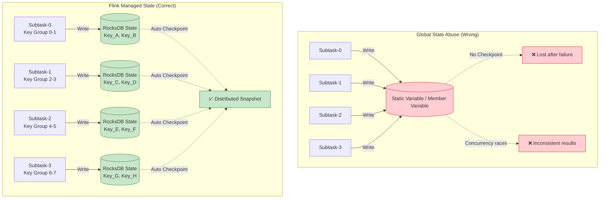
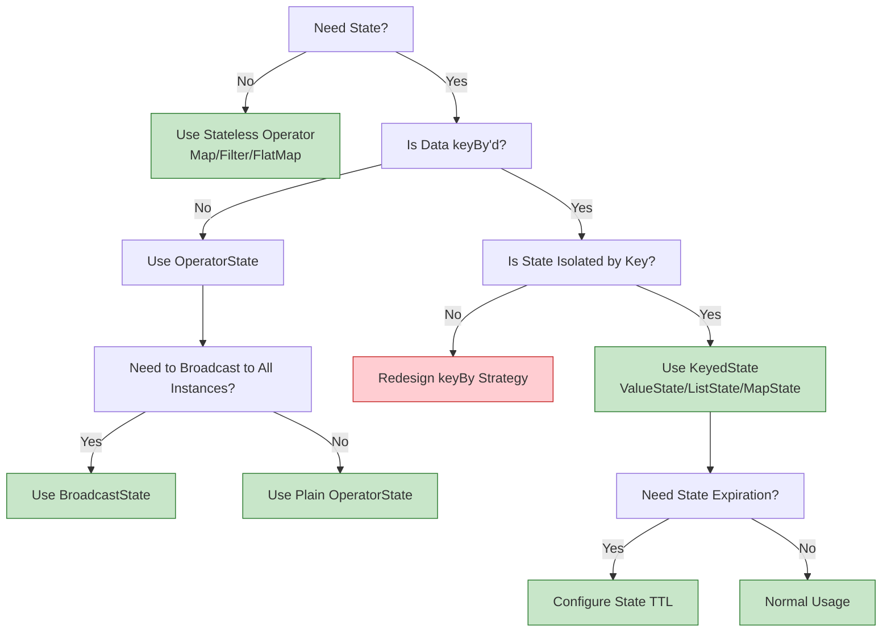

# Anti-Pattern AP-01: Global State Abuse

> Stage: Knowledge | Prerequisites: [Related Documents] | Formalization Level: L3

> **Anti-Pattern ID**: AP-01 | **Category**: State Management | **Severity**: P2 | **Detection Difficulty**: Easy
>
> Using global mutable state in operators that should remain stateless, leading to concurrency issues, recovery difficulties, and result non-determinism.

---

## Table of Contents

- [Anti-Pattern AP-01: Global State Abuse](#anti-pattern-ap-01-global-state-abuse)
  - [Table of Contents](#table-of-contents)
  - [1. Anti-Pattern Definition](#1-anti-pattern-definition)
  - [2. Symptoms / Manifestations](#2-symptoms--manifestations)
    - [2.1 Runtime Symptoms](#21-runtime-symptoms)
    - [2.2 Red Flags in Code Review](#22-red-flags-in-code-review)
    - [2.3 Monitoring Metric Anomalies](#23-monitoring-metric-anomalies)
  - [3. Negative Impacts](#3-negative-impacts)
    - [3.1 Correctness Impact](#31-correctness-impact)
    - [3.2 Performance Impact](#32-performance-impact)
    - [3.3 Operational Impact](#33-operational-impact)
  - [4. Solutions](#4-solutions)
    - [4.1 Use KeyedState (Recommended)](#41-use-keyedstate-recommended)
    - [4.2 Use OperatorState](#42-use-operatorstate)
    - [4.3 Use Broadcast State](#43-use-broadcast-state)
    - [4.4 Refactoring Checklist](#44-refactoring-checklist)
  - [5. Code Examples](#5-code-examples)
    - [5.1 Bad Example: Global Counter](#51-bad-example-global-counter)
    - [5.2 Good Example: KeyedState Counter](#52-good-example-keyedstate-counter)
    - [5.3 Bad Example: Member Variable Cache](#53-bad-example-member-variable-cache)
    - [5.4 Good Example: Checkpoint-Aware Buffering](#54-good-example-checkpoint-aware-buffering)
  - [6. Example Validation](#6-example-validation)
    - [6.1 Case Study: Real-Time E-Commerce Statistics](#61-case-study-real-time-e-commerce-statistics)
  - [7. Visualizations](#7-visualizations)
    - [7.1 Global State vs. Managed State Comparison](#71-global-state-vs-managed-state-comparison)
    - [7.2 Decision Tree: When to Use Which State](#72-decision-tree-when-to-use-which-state)
  - [8. References](#8-references)

---

## 1. Anti-Pattern Definition

**Definition (Def-K-09-01)**:

> Global State Abuse refers to the use of **non-Keyed global mutable state** (such as static variables, member variables, or external shared storage) within Flink operators to maintain cross-record or cross-Key context, instead of using Flink-provided KeyedState or OperatorState.

**Formal Description** [^1]:

Let the operator instance be $O_i$, the processed data record be $r$, and the Key extraction function be $k(r)$. Global State Abuse is manifested as:

$$
\exists O_i, \exists r_1, r_2: k(r_1) \neq k(r_2) \land \text{State}(O_i, r_1) \cap \text{State}(O_i, r_2) \neq \emptyset
$$

That is, records with different Keys share the same state block, violating the isolation semantics of Keyed Stream.

**Common Manifestations** [^2]:

| Type | Example | Problem |
|------|---------|---------|
| **Static Variables** | `static Map<String, Counter> globalCounters` | Shared across operator instances; not concurrency-safe |
| **Member Variables** | `private List<Event> buffer` | Not shared across parallel instances, but cannot be Checkpointed |
| **External Storage** | Redis / MySQL as state storage | No data locality, no consistency guarantee |
| **ThreadLocal** | `ThreadLocal<State>` | Not captured during Checkpoint |

---

## 2. Symptoms / Manifestations

### 2.1 Runtime Symptoms

```
┌─────────────────────────────────────────────────────────────────────────┐
│                    Global State Abuse Symptom Radar                     │
├─────────────────────────────────────────────────────────────────────────┤
│                                                                         │
│   Result Inconsistency ◄───────────────────────────────► Reproducibility│
│        │                                                     │          │
│        │    [Static Variable Concurrency Issues]             │          │
│        │    • Count results become random when parallelism>1 │          │
│        │    • Same input produces different results on rerun │          │
│        │    • Occasional array index OOB or NPE             │          │
│        │                                                     │          │
│   Recovery Failure ◄───────────────────────────────────► Consistency   │
│        │                                                     │          │
│        │    [Member Variable State Loss]                     │          │
│        │    • State resets after Checkpoint recovery         │          │
│        │    • Exactly-Once semantics broken                  │          │
│        │    • Duplicate processing or data loss              │          │
│        │                                                     │          │
│   Performance Degradation ◄────────────────────────────► Availability  │
│        │                                                     │          │
│        │    [External Storage Dependency]                    │          │
│        │    • Each record triggers external network call     │          │
│        │    • Network I/O becomes bottleneck                 │          │
│        │    • External service failure causes operator crash │          │
│        │                                                     │          │
└─────────────────────────────────────────────────────────────────────────┘
```

### 2.2 Red Flags in Code Review

```scala
// 🚨 Red Flag 1: Static collection used as state
object GlobalStateHolder {
  val userSessionMap = new ConcurrentHashMap[String, Session]() // ❌ Global state
}

// 🚨 Red Flag 2: Member variable cache without state backend
class MyFlatMap extends RichFlatMapFunction[Event, Result] {
  private var localBuffer = new ArrayList[Event]() // ❌ Cannot Checkpoint

  override def flatMap(value: Event, out: Collector[Result]): Unit = {
    localBuffer.add(value) // Buffer is empty after recovery!
  }
}

// 🚨 Red Flag 3: External storage used as state
class MyProcessFunction extends ProcessFunction[Event, Result] {
  private val redis = new Jedis("localhost") // ❌ External dependency

  override def processElement(event: Event, ctx: Context, out: Collector[Result]): Unit = {
    val count = redis.incr(event.userId) // ❌ No consistency guarantee
  }
}
```

### 2.3 Monitoring Metric Anomalies

| Metric | Anomaly | Root Cause |
|--------|---------|------------|
| `numRecordsInPerSecond` | Severe imbalance among subtasks | Static variables cause hotspots |
| `checkpointDuration` | Unstable or continuously increasing duration | State is not managed; incremental checkpointing ineffective |
| `numFailedCheckpoints` | Periodic failures | External storage connection drops |

---

## 3. Negative Impacts

### 3.1 Correctness Impact

**Concurrency races causing incorrect results** [^3]:

```
Scenario: Parallelism=2, counting user clicks

Subtask-0 processes user_1: globalCount++ (read: 0, write: 1)
Subtask-1 processes user_1: globalCount++ (read: 0, write: 1)  // Race!

Expected: globalCount = 2
Actual:   globalCount = 1 (lost update)
```

**Inconsistent state recovery** [^4]:

```
Scenario: Failure recovery after Checkpoint

Checkpoint N:
  - Kafka offset: 1000
  - Member variable buffer: [event_1, event_2, ...]  // Not saved!

After recovery from Checkpoint N:
  - Kafka offset: 1000 (correctly recovered)
  - Member variable buffer: [] (reset to empty!)

Consequence: event_1, event_2 are duplicated or lost
```

### 3.2 Performance Impact

| Impact Type | Specific Manifestation | Quantitative Estimate |
|-------------|------------------------|-----------------------|
| **Network Overhead** | Every record accesses external storage | RTT 1-10 ms/record |
| **Serialization Overhead** | Custom state lacks efficient serialization | 10-100x slower than Kryo |
| **GC Pressure** | Large long-lived objects | Increased Full GC frequency |
| **Parallelism Bottleneck** | Contention on static variables | Throughput drops 50-90% |

### 3.3 Operational Impact

- **Difficult failure recovery**: Cannot rely on automatic Checkpoint recovery
- **Scaling limitations**: External storage becomes a single-point bottleneck
- **Complex debugging**: State distribution is invisible and hard to trace

---

## 4. Solutions

### 4.1 Use KeyedState (Recommended)

Applicable to Keyed Stream scenarios; state is partitioned by Key [^4][^5]:

```scala
// ✅ Correct approach: Use KeyedState
class CorrectStatefulFunction
  extends KeyedProcessFunction[String, Event, Result] {

  // Declare ValueState
  private var countState: ValueState[Long] = _
  private var sessionState: ValueState[Session] = _

  override def open(parameters: Configuration): Unit = {
    val countDescriptor = new ValueStateDescriptor(
      "count",
      classOf[Long]
    )
    countState = getRuntimeContext.getState(countDescriptor)

    val sessionDescriptor = new ValueStateDescriptor(
      "session",
      classOf[Session]
    )
    sessionState = getRuntimeContext.getState(sessionDescriptor)
  }

  override def processElement(
    event: Event,
    ctx: Context,
    out: Collector[Result]
  ): Unit = {
    // Read state for current Key
    val currentCount = countState.value() match {
      case null => 0L
      case c => c
    }

    // Update state
    countState.update(currentCount + 1)

    // Update session state
    val currentSession = sessionState.value() match {
      case null => Session(event.userId, event.timestamp, 1)
      case s => s.copy(
        lastActivity = event.timestamp,
        eventCount = s.eventCount + 1
      )
    }
    sessionState.update(currentSession)

    out.collect(Result(event.userId, currentCount + 1))
  }
}

// Usage
stream
  .keyBy(_.userId)  // keyBy is required
  .process(new CorrectStatefulFunction())
```

### 4.2 Use OperatorState

Applicable to non-Keyed Stream or broadcast state scenarios [^4]:

```scala
// ✅ Correct approach: Use OperatorState (for non-Keyed scenarios)
class CorrectOperatorStateFunction
  extends ProcessFunction[Event, Result]
  with CheckpointedFunction {

  private var operatorState: ListState[Event] = _
  private var localBuffer = new ArrayList[Event]() // Local cache

  override def open(parameters: Configuration): Unit = {
    // Initialization
  }

  override def processElement(
    event: Event,
    ctx: Context,
    out: Collector[Result]
  ): Unit = {
    localBuffer.add(event)
    if (localBuffer.size() >= 1000) {
      flushBuffer(out)
    }
  }

  // Save state on Checkpoint
  override def snapshotState(context: FunctionSnapshotContext): Unit = {
    operatorState.clear()
    localBuffer.forEach(event => operatorState.add(event))
  }

  // Initialize or restore state
  override def initializeState(context: FunctionInitializationContext): Unit = {
    val descriptor = new ListStateDescriptor[Event](
      "buffer",
      classOf[Event]
    )
    operatorState = context.getOperatorStateStore.getListState(descriptor)

    // Load from Checkpoint on restore
    if (context.isRestored) {
      localBuffer.clear()
      operatorState.get().forEach(event => localBuffer.add(event))
    }
  }

  private def flushBuffer(out: Collector[Result]): Unit = {
    // Process and clear buffer
    localBuffer.clear()
  }
}
```

### 4.3 Use Broadcast State

Applicable to configuration broadcast scenarios [^5]:

```scala
// ✅ Correct approach: Use Broadcast State for dynamic configuration
val configStream: BroadcastStream[Config] = env
  .addSource(new ConfigSource())
  .broadcast(CONFIG_STATE_DESCRIPTOR)

class DynamicConfigFunction
  extends KeyedBroadcastProcessFunction[String, Event, Config, Result] {

  private var userState: ValueState[UserProfile] = _

  override def open(parameters: Configuration): Unit = {
    userState = getRuntimeContext.getState(
      new ValueStateDescriptor("user-profile", classOf[UserProfile])
    )
  }

  // Process data stream
  override def processElement(
    event: Event,
    ctx: ReadOnlyContext,
    out: Collector[Result]
  ): Unit = {
    // Read broadcast configuration (read-only)
    val config = ctx.getBroadcastState(CONFIG_STATE_DESCRIPTOR).get("config")
    val profile = userState.value()

    // Apply configuration to process event
    out.collect(processWithConfig(event, profile, config))
  }

  // Process configuration stream
  override def processBroadcastElement(
    config: Config,
    ctx: Context,
    out: Collector[Result]
  ): Unit = {
    // Update broadcast state
    ctx.getBroadcastState(CONFIG_STATE_DESCRIPTOR).put("config", config)
  }
}
```

### 4.4 Refactoring Checklist

| Original Anti-Pattern | Refactoring Target | Key Changes |
|-----------------------|--------------------|-------------|
| Static variables | KeyedState | Add `keyBy()` + `getRuntimeContext.getState()` |
| Member variable cache | OperatorState | Implement `CheckpointedFunction` interface |
| External storage access | Async I/O + State | Use `AsyncFunction` + local cached state |
| ThreadLocal | KeyedState | Delegate state to Flink state backend |

---

## 5. Code Examples

### 5.1 Bad Example: Global Counter

```scala
// ❌ Bad: Using static variable as global counter
object BadGlobalCounter {
  val counters = new ConcurrentHashMap[String, AtomicLong]()
}

class BadCounterFunction extends RichFlatMapFunction[Event, CountResult] {
  override def flatMap(event: Event, out: Collector[CountResult]): Unit = {
    val counter = BadGlobalCounter.counters.computeIfAbsent(
      event.category,
      _ => new AtomicLong(0)
    )
    val newCount = counter.incrementAndGet()
    out.collect(CountResult(event.category, newCount))
  }
}

// Problems:
// 1. Parallel instances share counters; concurrency races lead to inaccurate counts
// 2. counters does not participate in Checkpoint; count resets after failure
// 3. Cannot scale horizontally; all instances contend for the same data structure
```

### 5.2 Good Example: KeyedState Counter

```scala
// ✅ Good: Use KeyedState
class CorrectCounterFunction
  extends KeyedProcessFunction[String, Event, CountResult] {

  private var countState: ValueState[Long] = _

  override def open(parameters: Configuration): Unit = {
    countState = getRuntimeContext.getState(
      new ValueStateDescriptor("count", classOf[Long])
    )
  }

  override def processElement(
    event: Event,
    ctx: Context,
    out: Collector[CountResult]
  ): Unit = {
    val current = countState.value() match {
      case null => 0L
      case c => c
    }
    val newCount = current + 1
    countState.update(newCount)
    out.collect(CountResult(ctx.getCurrentKey, newCount))
  }
}

// Usage
stream
  .keyBy(_.category)
  .process(new CorrectCounterFunction())

// Advantages:
// 1. State per Key is isolated; no concurrency races
// 2. State automatically participates in Checkpoint; recoverable on failure
// 3. Flink automatically manages state partitioning and migration
```

### 5.3 Bad Example: Member Variable Cache

```scala
// ❌ Bad: Using member variable to cache non-Checkpointed data
class BadBufferFunction
  extends KeyedProcessFunction[String, Event, BatchResult] {

  private val buffer = new ArrayList[Event]() // ❌ Ordinary member variable

  override def processElement(
    event: Event,
    ctx: Context,
    out: Collector[BatchResult]
  ): Unit = {
    buffer.add(event)

    if (buffer.size() >= 100) {
      out.collect(BatchResult(ctx.getCurrentKey, new ArrayList(buffer)))
      buffer.clear()
    }
  }
}

// Problem:
// Buffer contents are not saved on Checkpoint; data is lost after failure recovery
```

### 5.4 Good Example: Checkpoint-Aware Buffering

```scala
// ✅ Good: Use ListState to implement Checkpoint-aware buffering
class CorrectBufferFunction
  extends KeyedProcessFunction[String, Event, BatchResult]
  with CheckpointedFunction {

  private var listState: ListState[Event] = _
  @transient private var localBuffer = new ArrayList[Event]()

  override def processElement(
    event: Event,
    ctx: Context,
    out: Collector[BatchResult]
  ): Unit = {
    localBuffer.add(event)

    if (localBuffer.size() >= 100) {
      out.collect(BatchResult(ctx.getCurrentKey, new ArrayList(localBuffer)))
      localBuffer.clear()
    }
  }

  override def snapshotState(context: FunctionSnapshotContext): Unit = {
    listState.clear()
    localBuffer.forEach(e => listState.add(e))
  }

  override def initializeState(context: FunctionInitializationContext): Unit = {
    listState = context.getKeyedStateStore.getListState(
      new ListStateDescriptor("buffer", classOf[Event])
    )

    if (context.isRestored) {
      localBuffer.clear()
      listState.get().forEach(e => localBuffer.add(e))
    }
  }
}
```

---

## 6. Example Validation

### 6.1 Case Study: Real-Time E-Commerce Statistics

**Business Scenario**: Calculate real-time order amount per product category.

**Anti-Pattern Implementation** (production incident):

```scala
// Faulty code (real case from an e-commerce platform)
object OrderStats {
  val categoryAmounts = new ConcurrentHashMap[String, BigDecimal]()
}

class OrderStatsFunction extends RichFlatMapFunction[Order, Stats] {
  override def flatMap(order: Order, out: Collector[Stats]): Unit = {
    val current = OrderStats.categoryAmounts.getOrDefault(
      order.category,
      BigDecimal.ZERO
    )
    OrderStats.categoryAmounts.put(
      order.category,
      current.add(order.amount)
    )

    // Emit statistics every minute
    if (shouldEmit()) {
      OrderStats.categoryAmounts.forEach { (cat, amount) =>
        out.collect(Stats(cat, amount, System.currentTimeMillis()))
      }
    }
  }
}
```

**Incident Symptoms** [^6]:

- After scaling parallelism from 4 to 8, statistics showed negative values
- After failure recovery, all category amounts reset to zero
- Statistics fluctuated wildly during peak hours

**Root Cause Analysis**:

1. Multiple TaskManager JVMs each hold their own copy of `OrderStats.categoryAmounts`
2. `ConcurrentHashMap` only synchronizes within a single JVM, not across JVMs
3. Checkpoint does not include static variables, so state is lost on recovery

**Refactoring Plan**:

```scala
class CorrectOrderStatsFunction
  extends KeyedProcessFunction[String, Order, Stats] {

  private var amountState: ValueState[BigDecimal] = _
  private var timerState: ValueState[Long] = _

  override def open(parameters: Configuration): Unit = {
    amountState = getRuntimeContext.getState(
      new ValueStateDescriptor("amount", classOf[BigDecimal])
    )
    timerState = getRuntimeContext.getState(
      new ValueStateDescriptor("timer", classOf[Long])
    )
  }

  override def processElement(
    order: Order,
    ctx: Context,
    out: Collector[Stats]
  ): Unit = {
    val current = amountState.value() match {
      case null => BigDecimal.ZERO
      case a => a
    }
    amountState.update(current.add(order.amount))

    // Register timer to emit every minute
    if (timerState.value() == null) {
      val nextMinute = (ctx.timestamp() / 60000 + 1) * 60000
      ctx.timerService().registerEventTimeTimer(nextMinute)
      timerState.update(nextMinute)
    }
  }

  override def onTimer(
    timestamp: Long,
    ctx: OnTimerContext,
    out: Collector[Stats]
  ): Unit = {
    val amount = amountState.value()
    if (amount != null) {
      out.collect(Stats(ctx.getCurrentKey, amount, timestamp))
    }

    // Register next timer
    val nextMinute = timestamp + 60000
    ctx.timerService().registerEventTimeTimer(nextMinute)
    timerState.update(nextMinute)
  }
}

// Usage
orders
  .keyBy(_.category)
  .process(new CorrectOrderStatsFunction())
```

**Validation Results**:

- Statistics remain consistent after scaling
- Automatic recovery from Checkpoint after failure
- Stable statistics during peak hours, no fluctuations

---

## 7. Visualizations

### 7.1 Global State vs. Managed State Comparison



### 7.2 Decision Tree: When to Use Which State



---

## 8. References

[^1]: Apache Flink Documentation, "State Backends," 2025. <https://nightlies.apache.org/flink/flink-docs-stable/docs/ops/state/state_backends/>

[^2]: Apache Flink Documentation, "Working with State," 2025. <https://nightlies.apache.org/flink/flink-docs-stable/docs/dev/datastream/fault-tolerance/state/>

[^3]: T. Akidau et al., "The Dataflow Model: A Practical Approach to Balancing Correctness, Latency, and Cost in Massive-Scale, Unbounded, Out-of-Order Data Processing," *PVLDB*, 8(12), 2015.

[^4]: Apache Flink Documentation, "Operator State," 2025. <https://nightlies.apache.org/flink/flink-docs-stable/docs/dev/datastream/fault-tolerance/state/#operator-state>

[^5]: Apache Flink Documentation, "Broadcast State Pattern," 2025. <https://nightlies.apache.org/flink/flink-docs-stable/docs/dev/datastream/fault-tolerance/broadcast_state/>

[^6]: Flink Design Patterns: State Management, see [Knowledge/02-design-patterns/pattern-stateful-computation.md](../02-design-patterns/pattern-stateful-computation.md)

---

*Document version: v1.0 | Translation date: 2026-04-24*
