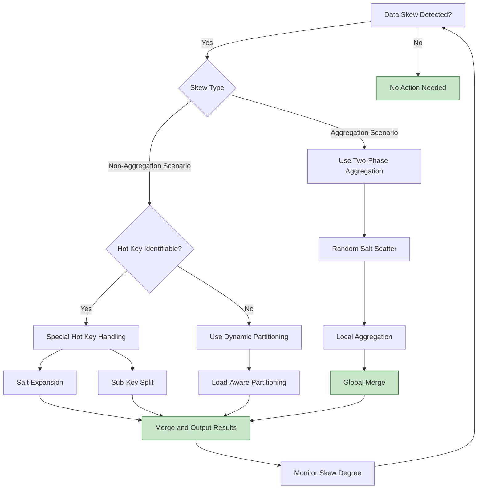

# Anti-Pattern AP-04: Unhandled Hot Key (Hot Key Skew)

> Stage: Knowledge | Prerequisites: [Related Documents] | Formalization Level: L3

> **Anti-Pattern ID**: AP-04 | **Category**: Data Distribution | **Severity**: P1 | **Detection Difficulty**: Hard
>
> Data skew causes certain subtasks to be heavily loaded, forming a processing bottleneck where overall throughput is limited by the slowest subtask.

---

## Table of Contents

- [Anti-Pattern AP-04: Unhandled Hot Key (Hot Key Skew)](#anti-pattern-ap-04-unhandled-hot-key-hot-key-skew)
  - [Table of Contents](#table-of-contents)
  - [1. Anti-Pattern Definition](#1-anti-pattern-definition)
  - [2. Symptoms](#2-symptoms)
    - [2.1 Runtime Symptoms](#21-runtime-symptoms)
    - [2.2 Flink Web UI Observations](#22-flink-web-ui-observations)
    - [2.3 Diagnostic Queries](#23-diagnostic-queries)
  - [3. Negative Impacts](#3-negative-impacts)
    - [3.1 Throughput Impact](#31-throughput-impact)
    - [3.2 Resource Waste](#32-resource-waste)
    - [3.3 State Management Impact](#33-state-management-impact)
    - [3.4 Business Impact](#34-business-impact)
  - [4. Solutions](#4-solutions)
    - [4.1 Two-Phase Aggregation](#41-two-phase-aggregation)
    - [4.2 Hot Key Salting](#42-hot-key-salting)
    - [4.3 Map-Side Combine](#43-map-side-combine)
    - [4.4 Dynamic Repartitioning](#44-dynamic-repartitioning)
    - [4.5 Key Split and Recomposition](#45-key-split-and-recomposition)
  - [5. Code Examples](#5-code-examples)
    - [5.1 Incorrect Example: Direct Grouping by Hot Key](#51-incorrect-example-direct-grouping-by-hot-key)
    - [5.2 Correct Example: Two-Phase Aggregation](#52-correct-example-two-phase-aggregation)
    - [5.3 Incorrect Example: Using State on Hot Keys](#53-incorrect-example-using-state-on-hot-keys)
    - [5.4 Correct Example: Hot Key State Splitting](#54-correct-example-hot-key-state-splitting)
  - [6. Example Validation](#6-example-validation)
    - [6.1 Case Study: Social Platform User Behavior Statistics](#61-case-study-social-platform-user-behavior-statistics)
  - [7. Visualizations](#7-visualizations)
    - [7.1 Data Skew vs. Balanced Processing Comparison](#71-data-skew-vs-balanced-processing-comparison)
    - [7.2 Hot Key Handling Decision Tree](#72-hot-key-handling-decision-tree)
  - [8. References](#8-references)

---

## 1. Anti-Pattern Definition

**Definition (Def-K-09-04)**:

> Unhandled hot key refers to the situation where the data partition key (Key) is distributed non-uniformly, causing certain keys to have a data volume far greater than others. Consequently, the subtasks processing these keys become system bottlenecks, and overall throughput is limited by the slowest subtask.

**Formal Description** [^1]:

Let the key space be $\mathcal{K}$, the data stream be $D$, the key extraction function be $k: D \to \mathcal{K}$, and the parallelism be $P$. The data skew is defined as:

$$
\text{Skew} = \frac{\max_{p \in [1,P]} |D_p|}{\frac{1}{P}\sum_{p=1}^{P} |D_p|}
$$

Where $D_p = \{d \in D : \text{hash}(k(d)) \mod P = p\}$ is the data assigned to subtask $p$.

When $\text{Skew} > 2$, significant data skew is considered present; when $\text{Skew} > 5$, severe skew requiring immediate remediation exists.

**Data Distribution Model** [^2]:

```
┌─────────────────────────────────────────────────────────────────────────┐
│                    Data Distribution and Skew Metrics                    │
├─────────────────────────────────────────────────────────────────────────┤
│                                                                         │
│  Uniform Distribution         Mild Skew           Severe Skew           │
│                                                                         │
│  │                            │                     │                   │
│  │    ┌─┐                    │   ┌───┐             │   ┌────────┐       │
│  │    ├─┤ ┌─┐                │   │   │ ┌─┐         │   │        │ ┌┐    │
│  │ ┌─┐├─┤┌┴┐│                │ ┌─┤   │┌┴┐│         │ ┌─┤        │┌┘└┐   │
│  │ ├─┤├─┤├─┤│                │ ├─┤   │├─┤│         │ ├─┤        │├──┤   │
│  └─┴─┴┴─┴┴─┴┘                └─┴─┴───┴┴─┴┘         └─┴─┴────────┴┴──┘   │
│                                                                         │
│  Skew ≈ 1.0                  Skew ≈ 2.5            Skew > 5.0           │
│  (Healthy)                   (Attention Needed)    (Must Handle)        │
│                                                                         │
│  Typical Scenarios:          Typical Scenarios:    Typical Scenarios:   │
│  - UUID User ID              - Long-tail users     - Top influencers/   │
│  - Random device ID          - Popular products      big sellers        │
│  - Evenly partitioned        - Geographic hotspots - Holiday/promotion  │
│    orders                                          hotspots             │
│                                                    - Global config/     │
│                                                      metadata           │
│                                                                         │
└─────────────────────────────────────────────────────────────────────────┘
```

**Common Hot Key Scenarios** [^3]:

| Scenario | Hot Key Examples | Cause |
|----------|------------------|-------|
| **Social Apps** | Influencer user IDs | Vast difference in follower counts leads to悬殊 interaction volumes |
| **E-commerce** | Best-selling SKUs, big sellers | Concentrated promotions, Matthew effect |
| **IoT Monitoring** | Faulty device IDs | Faulty devices report exceptions frequently |
| **Financial Trading** | Popular stock codes | Market attention disparity |
| **Log Processing** | Error types, popular URLs | Error concentration or uneven traffic |
| **Global Config** | "config", "default" | Configuration broadcast to a single key |

---

## 2. Symptoms

### 2.1 Runtime Symptoms

```
┌─────────────────────────────────────────────────────────────────────────┐
│                     Data Skew Symptom Radar                              │
├─────────────────────────────────────────────────────────────────────────┤
│                                                                         │
│   Throughput Bottleneck ◄──────────────────────────────► Resource Usage │
│        │                                                     │          │
│        │    【Imbalanced Subtask Performance】               │          │
│        │    • Some subtasks severely backpressured,          │          │
│        │      others idle                                    │          │
│        │    • Overall throughput = slowest subtask throughput│          │
│        │    • Increasing parallelism has limited effect      │          │
│        │                                                     │          │
│   Latency Variance ◄───────────────────────────────────► State Size    │
│        │                                                     │          │
│        │    【Latency Distribution Characteristics】         │          │
│        │    • Large latency percentile gaps (p50 vs p99)     │          │
│        │    • Certain subtask latency continuously increases │          │
│        │    • Hot key processing latency accumulates         │          │
│        │                                                     │          │
│   GC Anomaly ◄────────────────────────────────────────► Memory Pressure│
│        │                                                     │          │
│        │    【Hot Subtask Resource Issues】                  │          │
│        │    • Hot subtask GC frequency is high               │          │
│        │    • Hot subtask OOM risk                           │          │
│        │    • State backend writes to hot key state slower   │          │
│        │                                                     │          │
└─────────────────────────────────────────────────────────────────────────┘
```

### 2.2 Flink Web UI Observations

| Metric | Healthy State | Data Skew State |
|--------|---------------|-----------------|
| `Records Received` (per subtask) | Difference < 20% | Difference > 5x |
| `Records Sent` (per subtask) | Difference < 20% | Some subtasks extremely low |
| `Backpressure` | Evenly distributed | Concentrated on few subtasks |
| `Checkpoint Duration` | Similar across subtasks | Hot subtask significantly longer |
| `State Size` | Similar across subtasks | Hot subtask significantly larger |

### 2.3 Diagnostic Queries

```scala
// Use Flink SQL to analyze data distribution
val distributionAnalysis = tableEnv.sqlQuery("""
  SELECT
    key,
    COUNT(*) as record_count,
    COUNT(*) * 100.0 / SUM(COUNT(*)) OVER () as percentage
  FROM data_stream
  GROUP BY key
  ORDER BY record_count DESC
  LIMIT 20
""")

// Expected result: if top 10 keys account for > 50%, severe skew exists
```

---

## 3. Negative Impacts

### 3.1 Throughput Impact

**Amdahl's Law Manifestation in Data Skew** [^4]:

```
Scenario: Parallelism=8, extremely skewed data distribution

Subtask distribution:
- Subtask-0: 50% data (hot key)
- Subtask-1~7: ~7.1% data each

Theoretical max throughput:
= single subtask throughput × 8 (if uniform)

Actual max throughput:
= single subtask throughput × 2 (Subtask-0 becomes bottleneck)

Throughput loss:
= (8 - 2) / 8 = 75%

Even if parallelism is increased to 16,
if the hot key is still concentrated in one subtask,
throughput will NOT improve!
```

### 3.2 Resource Waste

```
Resource utilization distribution:

Subtask-0 (hot):  CPU 100%, Memory 90%, Network 80%  → Bottleneck
Subtask-1:        CPU 15%,  Memory 20%, Network 10%  → Idle
Subtask-2:        CPU 15%,  Memory 20%, Network 10%  → Idle
...
Subtask-7:        CPU 15%,  Memory 20%, Network 10%  → Idle

Overall resource utilization: ~25% (severe waste)
```

### 3.3 State Management Impact

| Impact | Description | Quantification |
|--------|-------------|----------------|
| **Uneven State Size** | Hot subtask state grows rapidly | Can reach 10-100x other subtasks |
| **Checkpoint Latency** | Hot subtask checkpoint duration | Increases 3-10x |
| **Slow State Recovery** | Hot subtask recovery time long | Drags down overall recovery |
| **RocksDB Compaction** | Hot key triggers frequent compaction | CPU spikes |

### 3.4 Business Impact

- **Decreased Real-timeness**: Hot key data latency accumulates, causing alert delays
- **Timeout Failures**: Hot data processing times out, leading to failure retries
- **Data Inconsistency**: Hot key state updates lag behind

---

## 4. Solutions

### 4.1 Two-Phase Aggregation

Applicable to aggregation scenarios: local aggregation first, then global aggregation [^3][^5]:

```scala
// ✅ Correct: Two-phase aggregation to solve hot key
object TwoPhaseAggregation {

  // Phase 1: Random pre-aggregation (scatter hotspots)
  def preAggregate(input: DataStream[Event]): DataStream[PartialResult] = {
    input
      .map(event => (event.key, Random.nextInt(100), event.value))  // Add random suffix
      .keyBy(t => (t._1, t._2))  // Group by (key, random)
      .window(TumblingProcessingTimeWindows.of(Time.seconds(5)))
      .aggregate(new PreAggregateFunction())  // Local aggregation
      .map(result => (result.key, result.partialSum))  // Remove random suffix
  }

  // Phase 2: Global aggregation
  def globalAggregate(partial: DataStream[(String, Long)]): DataStream[FinalResult] = {
    partial
      .keyBy(_._1)  // Group by original key
      .window(TumblingProcessingTimeWindows.of(Time.seconds(5)))
      .aggregate(new GlobalAggregateFunction())  // Global aggregation
  }

  // Usage
  val result = globalAggregate(preAggregate(input))
}

// Effect:
// Phase 1: Hot key is randomly split into 100 buckets, processed in parallel
// Phase 2: Each key has only 100 partial aggregation results, no hotspot
```

### 4.2 Hot Key Salting

Applicable to non-aggregation scenarios: split hot keys into multiple virtual keys [^5]:

```scala
// ✅ Correct: Hot key salting
class SaltedKeyProcessFunction extends KeyedProcessFunction[String, Event, Result] {

  private val SALT_COUNT = 100  // Number of salt values

  // Determine if it is a hot key (requires pre-analysis or dynamic detection)
  private val hotKeys = Set("user_123", "product_456")

  override def processElement(
    event: Event,
    ctx: Context,
    out: Collector[Result]
  ): Unit = {
    if (hotKeys.contains(event.key)) {
      // Hot key: randomly select salt, distribute to multiple virtual keys
      val salt = Random.nextInt(SALT_COUNT)
      val saltedKey = s"${event.key}#${salt}"
      // Forward to salted key processing
      forwardToSaltedSubtask(saltedKey, event)
    } else {
      // Normal key: process normally
      processNormal(event)
    }
  }

  // Periodically merge hot key results
  override def onTimer(
    timestamp: Long,
    ctx: OnTimerContext,
    out: Collector[Result]
  ): Unit = {
    // Collect all salt results and merge
    val mergedResult = collectAndMergeSaltedResults(ctx.getCurrentKey)
    out.collect(mergedResult)
  }
}
```

### 4.3 Map-Side Combine

Applicable to window aggregation: Flink built-in optimization [^3]:

```scala
// ✅ Correct: Use AggregateFunction to implement Map-Side Combine
class OptimizedWindowAggregation {

  // Use AggregateFunction instead of ProcessWindowFunction
  // AggregateFunction will first aggregate locally within the window
  val result = stream
    .keyBy(_.key)
    .window(TumblingEventTimeWindows.of(Time.minutes(1)))
    .aggregate(
      // Incremental aggregation function
      new AggregateFunction[Event, Long, Long] {
        override def createAccumulator(): Long = 0L
        override def add(value: Event, accumulator: Long): Long =
          accumulator + value.amount
        override def getResult(accumulator: Long): Long = accumulator
        override def merge(a: Long, b: Long): Long = a + b
      },
      // Optional: ProcessWindowFunction for window metadata
      new ProcessWindowFunction[Long, Result, String, TimeWindow] {
        override def process(
          key: String,
          context: Context,
          elements: Iterable[Long],
          out: Collector[Result]
        ): Unit = {
          // At this point elements has only one entry (already aggregated), no hotspot issue
          out.collect(Result(key, elements.head, context.window))
        }
      }
    )
}
```

### 4.4 Dynamic Repartitioning

Adjust partitioning strategy dynamically based on load [^6]:

```scala
// ✅ Correct: Custom partitioner for dynamic repartitioning
class DynamicPartitioner extends Partitioner[String] {

  private val loadTracker = new ConcurrentHashMap[String, AtomicLong]()

  override def partition(key: String, numPartitions: Int): Int = {
    val load = loadTracker.computeIfAbsent(key, _ => new AtomicLong(0))
    load.incrementAndGet()

    // For high-load keys, use consistent hashing to distribute
    if (load.get() > HIGH_LOAD_THRESHOLD) {
      // Use key + timestamp suffix for partitioning
      val distributedKey = s"${key}_${System.currentTimeMillis() % 10}"
      Math.abs(distributedKey.hashCode) % numPartitions
    } else {
      // Normal key direct hash
      Math.abs(key.hashCode) % numPartitions
    }
  }
}

// Use custom partitioner
stream
  .partitionCustom(new DynamicPartitioner(), _.key)
  .map(process)
```

### 4.5 Key Split and Recomposition

Applicable to large keys that can be split [^5]:

```scala
// ✅ Correct: Split large key into sub-keys, process then recompose
class KeySplitProcessFunction extends ProcessFunction[Event, Result] {

  // State: store partial results of sub-keys
  private var partialResults: MapState[String, PartialResult] = _

  override def open(parameters: Configuration): Unit = {
    partialResults = getRuntimeContext.getMapState(
      new MapStateDescriptor("partial-results", classOf[String], classOf[PartialResult])
    )
  }

  override def processElement(event: Event, ctx: Context, out: Collector[Result]): Unit = {
    // Split large key into multiple sub-keys for processing
    val subKeys = splitKey(event.key, SUB_KEY_COUNT)

    subKeys.foreach { subKey =>
      val current = Option(partialResults.get(subKey)).getOrElse(PartialResult.empty)
      val updated = current.merge(processSubEvent(event, subKey))
      partialResults.put(subKey, updated)
    }

    // Check if complete result can be emitted
    if (canEmitCompleteResult(event.key)) {
      out.collect(mergeAndEmit(event.key))
    }
  }

  private def splitKey(key: String, count: Int): List[String] = {
    (0 until count).map(i => s"${key}_sub${i}").toList
  }
}
```

---

## 5. Code Examples

### 5.1 Incorrect Example: Direct Grouping by Hot Key

```scala
// ❌ Wrong: Directly group by hot key
val result = eventStream
  .keyBy(_.userId)  // userId may be a hotspot (influencer user)
  .window(TumblingEventTimeWindows.of(Time.minutes(1)))
  .process(new UserStatsFunction())

// Problems:
// 1. Influencer user's subtask processing volume may be 100x other subtasks
// 2. That subtask is severely backpressured, affecting overall throughput
// 3. Influencer user's state continuously grows, checkpoint slows down
```

### 5.2 Correct Example: Two-Phase Aggregation

```scala
// ✅ Correct: Two-phase aggregation to handle hotspots
class TwoPhaseUserStats {

  // Phase 1: Random pre-aggregation
  def preAggregate(input: DataStream[UserEvent]): DataStream[PartialUserStats] = {
    input
      .map { event =>
        val salt = Random.nextInt(PRE_AGGREGATE_PARALLELISM)
        (event.userId, salt, event)
      }
      .keyBy(t => (t._1, t._2))  // Group by (userId, salt)
      .window(TumblingEventTimeWindows.of(Time.seconds(10)))
      .aggregate(new PreAggregateFunction())
  }

  // Phase 2: Global aggregation by userId
  def globalAggregate(partial: DataStream[PartialUserStats]): DataStream[UserStats] = {
    partial
      .keyBy(_.userId)
      .window(TumblingEventTimeWindows.of(Time.minutes(1)))
      .aggregate(
        new AggregateFunction[PartialUserStats, UserAccumulator, UserStats] {
          override def createAccumulator() = UserAccumulator(0, 0, 0)
          override def add(value: PartialUserStats, acc: UserAccumulator) =
            UserAccumulator(
              acc.clickCount + value.clickCount,
              acc.purchaseCount + value.purchaseCount,
              acc.totalAmount + value.totalAmount
            )
          override def getResult(acc: UserAccumulator) =
            UserStats(acc.clickCount, acc.purchaseCount, acc.totalAmount)
          override def merge(a: UserAccumulator, b: UserAccumulator) =
            UserAccumulator(
              a.clickCount + b.clickCount,
              a.purchaseCount + b.purchaseCount,
              a.totalAmount + b.totalAmount
            )
        }
      )
  }
}
```

### 5.3 Incorrect Example: Using State on Hot Keys

```scala
// ❌ Wrong: Accumulating large state on hot keys
class BadHotKeyStateFunction extends KeyedProcessFunction[String, Event, Result] {

  private var eventListState: ListState[Event] = _

  override def open(parameters: Configuration): Unit = {
    eventListState = getRuntimeContext.getListState(
      new ListStateDescriptor("events", classOf[Event])
    )
  }

  override def processElement(event: Event, ctx: Context, out: Collector[Result]): Unit = {
    // Hot key will accumulate massive events, causing state explosion
    eventListState.add(event)

    // Output once per hour, intermediate state continuously grows
    if (shouldEmit(ctx.timestamp())) {
      val events = eventListState.get().asScala.toList
      out.collect(Result(ctx.getCurrentKey, events))
      eventListState.clear()
    }
  }
}
```

### 5.4 Correct Example: Hot Key State Splitting

```scala
// ✅ Correct: Use timers and incremental aggregation to avoid state accumulation
class OptimizedHotKeyFunction extends KeyedProcessFunction[String, Event, Result] {

  private var accumulatorState: ValueState[Accumulator] = _
  private var timerState: ValueState[Long] = _

  override def open(parameters: Configuration): Unit = {
    accumulatorState = getRuntimeContext.getState(
      new ValueStateDescriptor("accumulator", classOf[Accumulator])
    )
    timerState = getRuntimeContext.getState(
      new ValueStateDescriptor("timer", classOf[Long])
    )
  }

  override def processElement(event: Event, ctx: Context, out: Collector[Result]): Unit = {
    // Incremental update, do not accumulate raw events
    val current = accumulatorState.value() match {
      case null => Accumulator.empty
      case acc => acc
    }
    accumulatorState.update(current.add(event))

    // Register timer
    if (timerState.value() == null) {
      val nextEmit = (ctx.timestamp() / 60000 + 1) * 60000
      ctx.timerService().registerEventTimeTimer(nextEmit)
      timerState.update(nextEmit)
    }
  }

  override def onTimer(timestamp: Long, ctx: OnTimerContext, out: Collector[Result]): Unit = {
    val acc = accumulatorState.value()
    if (acc != null) {
      out.collect(Result(ctx.getCurrentKey, acc.toStats()))
      accumulatorState.clear()
    }
    timerState.clear()
  }
}
```

---

## 6. Example Validation

### 6.1 Case Study: Social Platform User Behavior Statistics

**Business Scenario**: Real-time interaction count statistics per user (likes, comments, shares)

**Problem Analysis** [^7]:

- User ID distribution is extremely uneven: top 1% of users generate 50% of interactions
- A celebrity user ID's single subtask processing volume is 500x that of ordinary users
- Parallelism is 20, but effective throughput is only equivalent to parallelism 5

**Optimization Solution**:

```scala
// Before optimization: direct grouping by userId
// After optimization: two-phase aggregation + hot key special handling

object OptimizedUserStats {

  val HOT_KEY_THRESHOLD = 10000  // Events per second threshold
  val PRE_AGGREGATE_PARALLELISM = 50

  def process(input: DataStream[InteractionEvent]): DataStream[UserStats] = {
    input
      // Step 1: Add salt for hot keys
      .map { event =>
        if (isHotKey(event.userId)) {
          val salt = Random.nextInt(PRE_AGGREGATE_PARALLELISM)
          event.copy(userId = s"${event.userId}#${salt}")
        } else {
          event
        }
      }
      // Step 2: Pre-aggregation window (10 seconds)
      .keyBy(_.userId)
      .window(TumblingEventTimeWindows.of(Time.seconds(10)))
      .aggregate(new PreAggregateFunction())
      // Step 3: Remove salt, global aggregation
      .map(_.copy(userId = removeSalt(_.userId)))
      .keyBy(_.userId)
      .window(TumblingEventTimeWindows.of(Time.minutes(1)))
      .aggregate(new GlobalAggregateFunction())
  }

  private def isHotKey(userId: String): Boolean = {
    // Dynamic detection or load hot key list from config
    HotKeyDetector.isHot(userId)
  }

  private def removeSalt(userId: String): String = {
    userId.split("#").head
  }
}
```

**Effect Validation**:

- Throughput: Improved from 50K events/s to 200K events/s (4x)
- Latency: p99 reduced from 30s to 5s
- Resource utilization: Improved from 25% to 70%

---

## 7. Visualizations

### 7.1 Data Skew vs. Balanced Processing Comparison

```mermaid
graph TB
    subgraph "Data Skew (Incorrect)"
        I1[Input Stream] -->|hash(key) % 4| S1[Subtask-0<br/>80% Data<br/>Bottleneck!]
        I1 -->|hash(key) % 4| S2[Subtask-1<br/>7% Data]
        I1 -->|hash(key) % 4| S3[Subtask-2<br/>7% Data]
        I1 -->|hash(key) % 4| S4[Subtask-3<br/>6% Data]

        S1 --> O1[Output<br/>High Latency]
        S2 --> O1
        S3 --> O1
        S4 --> O1

        style S1 fill:#ffcdd2,stroke:#c62828
        style S2 fill:#c8e6c9,stroke:#2e7d32
        style S3 fill:#c8e6c9,stroke:#2e7d32
        style S4 fill:#c8e6c9,stroke:#2e7d32
    end

    subgraph "Two-Phase Aggregation (Correct)"
        I2[Input Stream] -->|Random Salt| P1[Pre-aggregate<br/>Subtask-0]
        I2 -->|Random Salt| P2[Pre-aggregate<br/>Subtask-1]
        I2 -->|Random Salt| P3[Pre-aggregate<br/>Subtask-2]
        I2 -->|Random Salt| P4[Pre-aggregate<br/>Subtask-3]

        P1 -->|Even Distribution| G1[Global Aggregate<br/>Subtask-0]
        P2 --> G2[Global Aggregate<br/>Subtask-1]
        P3 --> G3[Global Aggregate<br/>Subtask-2]
        P4 --> G4[Global Aggregate<br/>Subtask-3]

        G1 --> O2[Output<br/>Balanced]
        G2 --> O2
        G3 --> O2
        G4 --> O2

        style P1 fill:#c8e6c9,stroke:#2e7d32
        style P2 fill:#c8e6c9,stroke:#2e7d32
        style P3 fill:#c8e6c9,stroke:#2e7d32
        style P4 fill:#c8e6c9,stroke:#2e7d32
        style G1 fill:#c8e6c9,stroke:#2e7d32
        style G2 fill:#c8e6c9,stroke:#2e7d32
        style G3 fill:#c8e6c9,stroke:#2e7d32
        style G4 fill:#c8e6c9,stroke:#2e7d32
    end
```

### 7.2 Hot Key Handling Decision Tree



---

## 8. References

[^1]: Apache Flink Documentation, "Parallel Execution," 2025. <https://nightlies.apache.org/flink/flink-docs-stable/docs/dev/datastream/execution/parallel/>

[^2]: M. Kleppmann, "Designing Data-Intensive Applications," O'Reilly Media, 2017. Chapter 6: Partitioning.

[^3]: Apache Flink Documentation, "Windows," 2025. <https://nightlies.apache.org/flink/flink-docs-stable/docs/dev/datastream/operators/windows/>

[^4]: G. M. Amdahl, "Validity of the Single Processor Approach to Achieving Large Scale Computing Capabilities," *AFIPS*, 1967.

[^5]: Apache Flink Best Practices, "Handling Data Skew," 2025. <<https://nightlies.apache.org/flink/flink-docs-stable/docs/learn-flink/>

[^6]: P. Carbone et al., "Apache Flink: Stream and Batch Processing in a Single Engine," *IEEE Data Engineering Bulletin*, 38(4), 2015.

[^7]: User behavior analysis case study, see [Knowledge/02-design-patterns/pattern-realtime-feature-engineering.md](../Knowledge/02-design-patterns/pattern-realtime-feature-engineering.md)

---

*Document version: v1.0 | Translation date: 2026-04-24*
