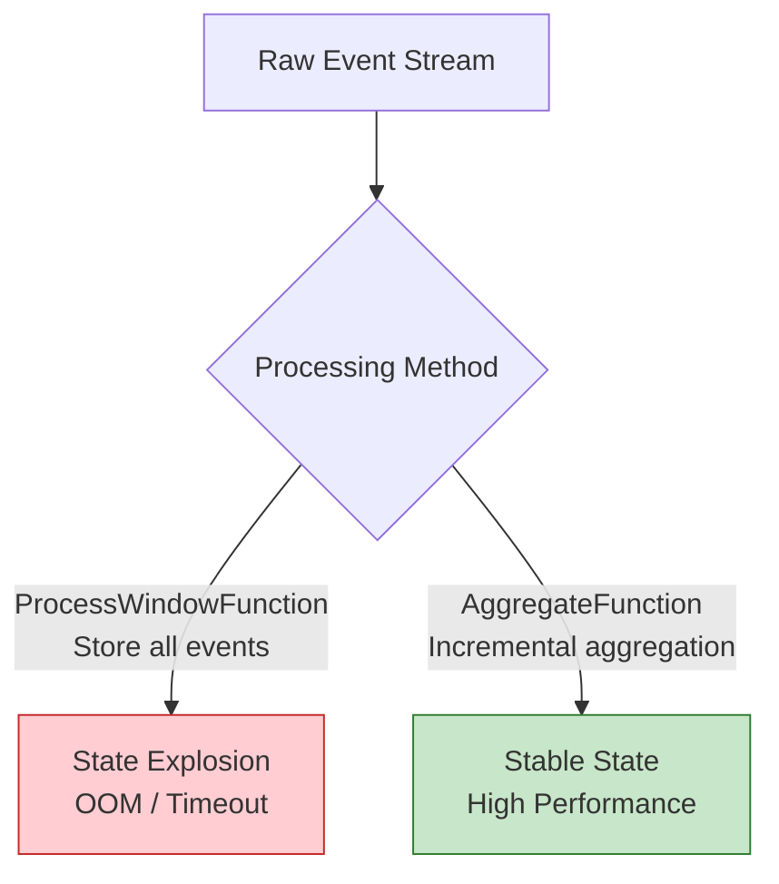

# Anti-Pattern AP-07: Window State Explosion

> **Stage**: Knowledge | **Prerequisites**: [Related Documents] | **Formalization Level**: L3

> **Anti-Pattern ID**: AP-07 | **Category**: State Management | **Severity**: P1 | **Detection Difficulty**: Hard
>
> Accumulating a large number of raw events in window functions without using incremental aggregation, causing window state to grow unboundedly and eventually leading to OOM or Checkpoint timeouts.

---

## Table of Contents

- [Anti-Pattern AP-07: Window State Explosion](#anti-pattern-ap-07-window-state-explosion)
  - [Table of Contents](#table-of-contents)
  - [1. Anti-Pattern Definition](#1-anti-pattern-definition)
  - [2. Symptoms / Manifestations](#2-symptoms--manifestations)
  - [3. Negative Impacts](#3-negative-impacts)
    - [3.1 Memory Impact](#31-memory-impact)
  - [4. Solutions](#4-solutions)
    - [4.1 Use AggregateFunction](#41-use-aggregatefunction)
    - [4.2 Combine Aggregate + ProcessWindow](#42-combine-aggregate--processwindow)
    - [4.3 Use Evictor to Limit State](#43-use-evictor-to-limit-state)
  - [5. Code Examples](#5-code-examples)
    - [5.1 Incorrect Example](#51-incorrect-example)
    - [5.2 Correct Example](#52-correct-example)
  - [6. Example Verification](#6-example-verification)
    - [Case Study: Real-Time User Behavior Statistics](#case-study-real-time-user-behavior-statistics)
  - [7. Visualizations](#7-visualizations)
  - [8. References](#8-references)

---

## 1. Anti-Pattern Definition

**Definition (Def-K-09-07)**:

> Window state explosion refers to the use of `ProcessWindowFunction` to store all raw events within a window operator without using `AggregateFunction` for incremental aggregation, causing the window state to grow linearly with the input data volume.

**State Growth Model** [^1]:

```
State Size = Number of Windows × Events per Window × Size per Event

Incorrect approach:
- 1-minute window × 1M events/minute × 1KB = 1GB/window

Correct approach:
- 1-minute window × 1 accumulator × 100 bytes = 100 bytes/window

Optimization ratio: 1GB / 100B = 10,000,000×!
```

---

## 2. Symptoms / Manifestations

| Symptom | Manifestation | Root Cause |
|---------|---------------|------------|
| Heap Out of Memory | Frequent OOM | Window stores a large number of events |
| Checkpoint Timeout | Increasing duration | Excessive state size slows down serialization |
| GC Pauses | Frequent Full GC | Large objects accumulate in the old generation |
| Throughput Degradation | Decreases over time | Slower state access |

---

## 3. Negative Impacts

### 3.1 Memory Impact

```
Scenario: 1-hour window, 10,000 events/second, 500 bytes per event

Incorrect approach (storing raw events):
- State Size = 10,000 × 3,600 × 500B = 18GB/window

Correct approach (incremental aggregation):
- State Size ≈ Accumulator ≈ 100 bytes/window

Savings: 18,000,000×!
```

---

## 4. Solutions

### 4.1 Use AggregateFunction

```scala
// ✅ Correct: Use AggregateFunction for incremental aggregation
val result = stream
  .keyBy(_.userId)
  .window(TumblingEventTimeWindows.of(Time.minutes(1)))
  .aggregate(new CountAggregate)

// Incremental aggregation function
class CountAggregate extends AggregateFunction[Event, CountAcc, CountResult] {
  override def createAccumulator(): CountAcc = CountAcc(0, 0.0)

  override def add(value: Event, accumulator: CountAcc): CountAcc =
    CountAcc(accumulator.count + 1, accumulator.sum + value.amount)

  override def getResult(accumulator: CountAcc): CountResult =
    CountResult(accumulator.count, accumulator.sum)

  override def merge(a: CountAcc, b: CountAcc): CountAcc =
    CountAcc(a.count + b.count, a.sum + b.sum)
}

case class CountAcc(count: Int, sum: Double)
case class CountResult(count: Int, sum: Double)
```

### 4.2 Combine Aggregate + ProcessWindow

```scala
// Use when window metadata is needed
val result = stream
  .keyBy(_.userId)
  .window(TumblingEventTimeWindows.of(Time.minutes(1)))
  .aggregate(
    new CountAggregate,  // Incremental aggregation
    new WindowResultFunction  // Process window metadata
  )

// WindowResultFunction receives the pre-aggregated result
class WindowResultFunction extends ProcessWindowFunction[
  CountResult, Output, String, TimeWindow
] {
  override def process(
    key: String,
    context: Context,
    elements: Iterable[CountResult],  // Only 1 element
    out: Collector[Output]
  ): Unit = {
    val result = elements.head
    out.collect(Output(
      key,
      result.count,
      result.sum,
      context.window.getStart,
      context.window.getEnd
    ))
  }
}
```

### 4.3 Use Evictor to Limit State

```scala
// Limit the number of retained events within the window
stream
  .keyBy(_.userId)
  .window(TumblingEventTimeWindows.of(Time.minutes(10)))
  .evictor(CountEvictor.of(1000))  // Keep only the latest 1000 events
  .process(new LimitedWindowFunction())
```

---

## 5. Code Examples

### 5.1 Incorrect Example

```scala
// ❌ Incorrect: Stores all raw events
class BadWindowFunction extends ProcessWindowFunction[
  Event, Output, String, TimeWindow
] {
  override def process(
    key: String,
    context: Context,
    elements: Iterable[Event],  // Stores all events!
    out: Collector[Output]
  ): Unit = {
    // State size = elements.size × Event size
    val count = elements.size
    val sum = elements.map(_.amount).sum
    out.collect(Output(key, count, sum))
  }
}
```

### 5.2 Correct Example

```scala
// ✅ Correct: Incremental aggregation + metadata processing
val result = stream
  .keyBy(_.userId)
  .window(TumblingEventTimeWindows.of(Time.minutes(1)))
  .aggregate(
    new SumAggregate,  // Stores only the accumulator
    new OutputFunction // Receives only the aggregated result
  )
```

---

## 6. Example Verification

### Case Study: Real-Time User Behavior Statistics

| Approach | State Size | Checkpoint Time | GC Frequency |
|----------|------------|-----------------|--------------|
| ProcessWindowFunction | 20GB | 180s | Frequent |
| AggregateFunction | 50MB | 5s | Rare |

---

## 7. Visualizations

The following diagram illustrates the choice between storing raw events and incremental aggregation, showing the resulting impact on system stability and performance.



---

## 8. References

[^1]: Apache Flink Documentation, "Windows," 2025.

---

*Document version: v1.0 | Translation date: 2026-04-24*
