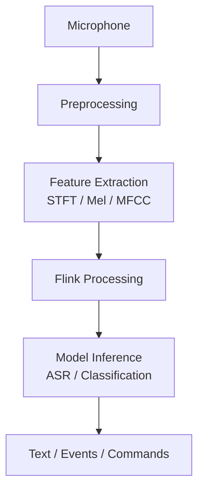

# Real-Time Audio Stream Processing

> **Stage**: Knowledge/06-frontier | **Prerequisites**: [Multimodal Stream Processing](multimodal-stream-processing.md) | **Formalization Level**: L3
> **Translation Date**: 2026-04-21

## Abstract

Real-time audio stream processing covers speech transcription, music recommendation, anomaly detection, and voice assistant interactions.

---

## 1. Definitions

### Def-K-Audio-01 (Real-Time Audio Stream Processing)

**Real-time audio stream processing** handles continuous audio signals with real-time acquisition, feature extraction, event detection, and classification.

### Def-K-Audio-02 (STFT)

**Short-Time Fourier Transform** splits time-domain audio into short frames and applies FFT, yielding time-frequency representation.

### Def-K-Audio-03 (Mel-Spectrogram)

**Mel-spectrogram** maps linear frequency to Mel scale, capturing perceptually relevant information for speech and music.

---

## 2. Properties

### Lemma-K-Audio-01 (Latency Perception Bounds)

- Speech interaction: human sensitivity ~200-300ms
- Music synchronization: sensitivity ~20-40ms
- Target: speech < 200ms, music sync < 20ms

### Lemma-K-Audio-02 (Feature-Inference Decoupling)

- Feature extraction (Mel-spectrogram): low compute, high frequency (10ms/frame)
- Deep inference (ASR model): high compute, batch processing (500ms/batch)
- Decoupling optimizes resource utilization

### Prop-K-Audio-01 (Sliding Windows for Event Detection)

Overlapping sliding windows improve event detection recall by preventing events from being split across window boundaries.

---

## 3. Architecture

---

## 4. References
